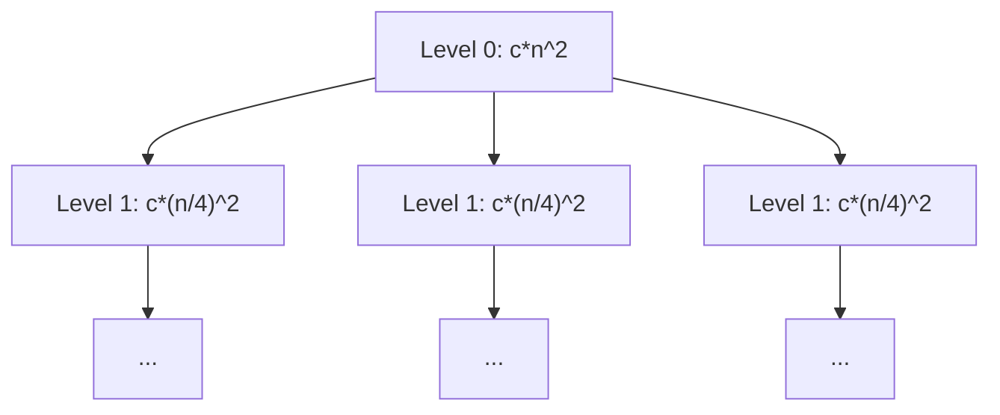
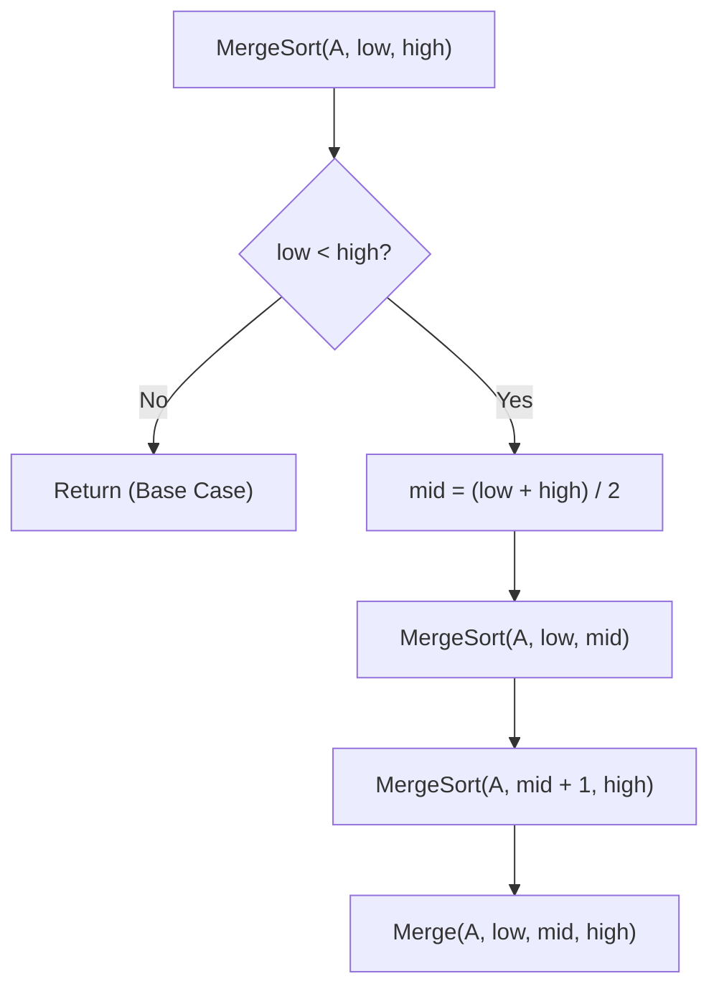
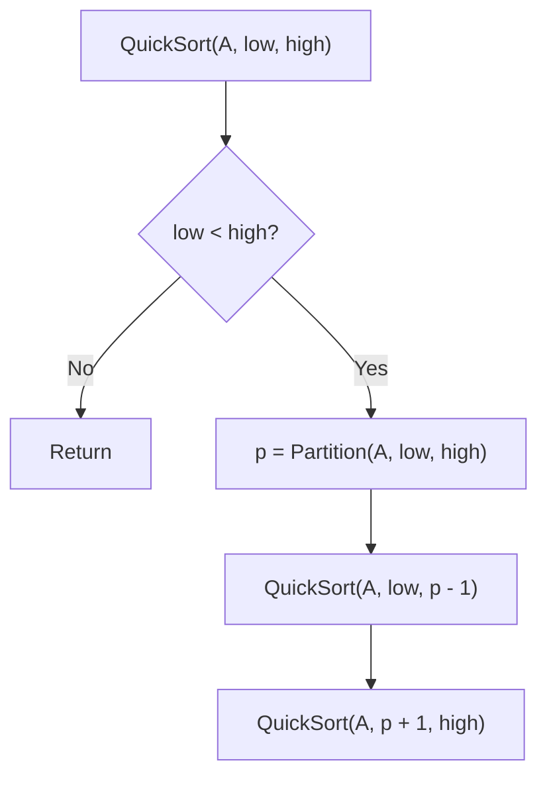
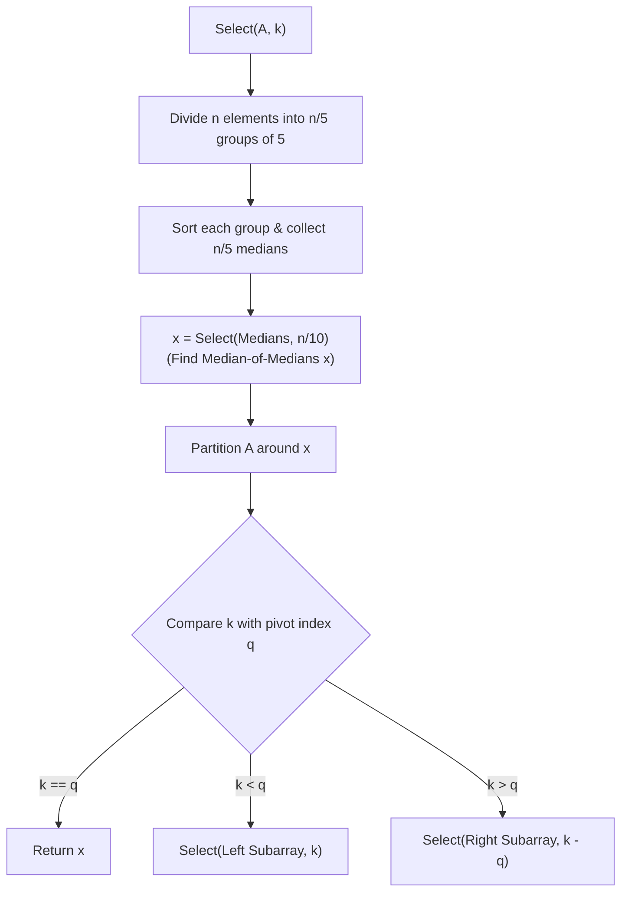
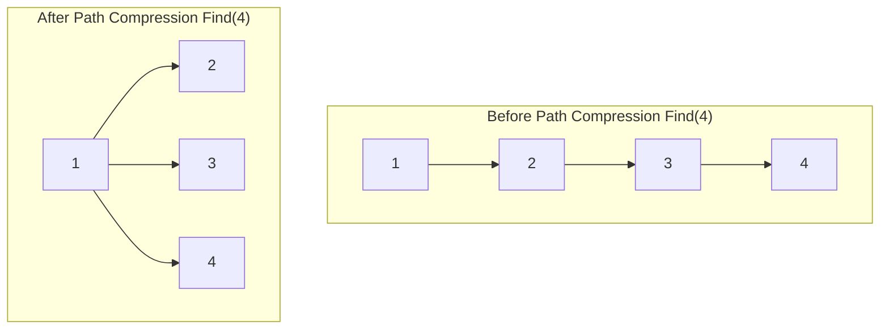

# Chapter 3: Recurrence Relations, Divide & Conquer, and Advanced Structures

> **Course Code:** 3CS501CC24
> **Focus:** Unit-III — Recurrence Solving Techniques, Divide & Conquer Paradigm, Sorting & Selection, Exponentiation, Interval Trees & Disjoint Sets

---

## 1. Chapter Overview

Many algorithms, particularly those based on the Divide and Conquer strategy, are recursive in nature. To analyze their time complexity, we formulate a recurrence relation—an equation or inequality that describes a function in terms of its values on smaller inputs. This unit focuses on comprehensive methods to solve recurrences (Substitution/Guesswork, Homogeneous, Non-Homogeneous, Change of Variable, Range Transformations, Master Theorem, and Recurrence Tree) and the application of Divide and Conquer to design efficient algorithms such as Large Integer Multiplication, Merge Sort, Quick Sort, Median-of-Medians Deterministic Selection, Strassen’s Matrix Multiplication, and Binary/Modular Exponentiation. Furthermore, it incorporates advanced structures like Interval Trees and Disjoint Set Structures.

---

## 2. Recurrence Relations — Introduction

### What is a recurrence relation?
A **recurrence relation** is an equation or inequality that defines a sequence recursively: each term of the sequence is defined as a function of preceding terms. In algorithm analysis, $T(n)$ denotes the running time of an algorithm on an input of size $n$.

### Setting up a recurrence from recursive pseudocode
For a Divide and Conquer algorithm that breaks a problem of size $n$ into $a$ subproblems, each of size $n/b$, and takes $f(n)$ time to divide the problem and combine the subproblem solutions:

$$
T(n) = aT\left(\frac{n}{b}\right) + f(n)
$$

For a Subtract and Conquer algorithm that reduces problem size by a constant amount $b$:

$$
T(n) = aT(n-b) + f(n)
$$

---

## 3. Method 1 — Intelligent Guesswork & Substitution Method

### Procedure
1. **Guess** the form of the solution (e.g., $O(n \log n)$, $O(n^2)$).
2. **Substitute** the guessed solution into the recurrence.
3. **Prove** by mathematical induction that the guess is correct (show $T(n) \le c \cdot g(n)$ for a chosen constant $c > 0$ and $n \ge n_0$).

### Rules for Making a Good Guess
- Compute the first few terms to observe patterns.
- Compare with standard recurrence structures.
- If a guess fails because of a lower-order term (e.g., trying to prove $T(n) \le c \cdot n$ yields $T(n) \le c \cdot n + b$), **subtract a lower-order term** from the guess (e.g., guess $T(n) \le c \cdot n - d$).

### Worked Examples

#### Example 1: Solving $T(n) = T(n-1) + n$
Using repeated substitution (expansion):

$$
T(n) = T(n-1) + n
$$

$$
T(n) = (T(n-2) + n - 1) + n = T(n-2) + (n-1) + n
$$

After $k$ steps:

$$
T(n) = T(n-k) + \sum_{j=0}^{k-1} (n - j)
$$

Setting base case $T(0) = 0$ at $k = n$:

$$
T(n) = T(0) + \sum_{j=1}^n j = \frac{n(n+1)}{2} = \Theta(n^2)
$$

#### Example 2: Proving $T(n) = 2T(\lfloor n/2 \rfloor) + n \implies T(n) = O(n \log n)$
- **Guess:** $T(n) \le c n \log_2 n$ for $c > 0$.
- **Inductive Step:** Assume $T(\lfloor n/2 \rfloor) \le c \lfloor n/2 \rfloor \log_2(\lfloor n/2 \rfloor)$.
- **Substitute:**

$$
T(n) \le 2 \left(c \frac{n}{2} \log_2\left(\frac{n}{2}\right)\right) + n
$$

$$
T(n) \le c n (\log_2 n - \log_2 2) + n = c n \log_2 n - c n + n
$$

For $T(n) \le c n \log_2 n$, we need $-c n + n \le 0 \implies c \ge 1$.
Thus, $T(n) = O(n \log n)$ holds for $c \ge 1$ and $n \ge 2$.

---

## 4. Method 2 — Homogeneous Recurrences (Characteristic Equation)

A linear homogeneous recurrence with constant coefficients has the form:

$$
a_0 T(n) + a_1 T(n-1) + a_2 T(n-2) + \dots + a_k T(n-k) = 0
$$

### Procedure
1. Substitute $T(n) = r^n$ to get the **Characteristic Equation**:

$$
a_0 r^k + a_1 r^{k-1} + a_2 r^{k-2} + \dots + a_k = 0
$$

2. Find the roots $r_1, r_2, \dots, r_k$.
3. Write the general solution based on root multiplicities.

### Case Rules:
- **Distinct Real Roots ($r_1 \neq r_2 \dots \neq r_k$):**

$$
T(n) = c_1 r_1^n + c_2 r_2^n + \dots + c_k r_k^n
$$

- **Repeated Root ($r_1$ with multiplicity $m$):**

$$
(c_1 + c_2 n + c_3 n^2 + \dots + c_m n^{m-1}) r_1^n
$$

### Worked Example: Fibonacci Recurrence $T(n) = T(n-1) + T(n-2)$, $T(0)=0, T(1)=1$
1. Equation: $T(n) - T(n-1) - T(n-2) = 0$.
2. Characteristic Equation: $r^2 - r - 1 = 0$.
3. Roots using quadratic formula:

$$
r_1 = \frac{1 + \sqrt{5}}{2} \quad (\phi \approx 1.618), \quad r_2 = \frac{1 - \sqrt{5}}{2} \quad (\psi \approx -0.618)
$$

4. General solution: $T(n) = c_1 \left(\frac{1+\sqrt{5}}{2}\right)^n + c_2 \left(\frac{1-\sqrt{5}}{2}\right)^n$.
5. Using initial conditions $T(0)=0 \implies c_1 + c_2 = 0 \implies c_2 = -c_1$.
   $T(1)=1 \implies c_1 r_1 + c_2 r_2 = 1 \implies c_1(r_1 - r_2) = 1 \implies c_1 = \frac{1}{\sqrt{5}}$.
6. Final Binet's Formula:

$$
T(n) = \frac{1}{\sqrt{5}} \left[\left(\frac{1+\sqrt{5}}{2}\right)^n - \left(\frac{1-\sqrt{5}}{2}\right)^n\right] = \Theta(\phi^n)
$$

---

## 5. Method 3 — Non-Homogeneous Recurrences

A non-homogeneous recurrence has the form:

$$
a_0 T(n) + a_1 T(n-1) + \dots + a_k T(n-k) = f(n) \quad (f(n) \neq 0)
$$

The total solution is:

$$
T(n) = T_h(n) + T_p(n)
$$

where $T_h(n)$ is the solution to the homogeneous equation ($f(n)=0$), and $T_p(n)$ is the **particular solution** depending on $f(n)$.

### Rules for Guessing $T_p(n)$:

| Form of $f(n)$ | Condition on Characteristic Root $a$ | Particular Solution $T_p(n)$ Guess |
| :--- | :--- | :--- |
| Constant $C$ | $1$ is NOT a root | $P$ |
| Constant $C$ | $1$ IS a root of multiplicity $m$ | $n^m P$ |
| Polynomial $\sum_{j=0}^d b_j n^j$ | $1$ is NOT a root | $P_0 + P_1 n + \dots + P_d n^d$ |
| Polynomial $\sum_{j=0}^d b_j n^j$ | $1$ IS a root of multiplicity $m$ | $n^m (P_0 + P_1 n + \dots + P_d n^d)$ |
| Exponential $C \cdot a^n$ | $a$ is NOT a root | $P \cdot a^n$ |
| Exponential $C \cdot a^n$ | $a$ IS a root of multiplicity $m$ | $n^m P \cdot a^n$ |

### Worked Example: $T(n) - 2T(n-1) = 3^n$, $T(0) = 1$
1. **Homogeneous Part:** $r - 2 = 0 \implies r = 2 \implies T_h(n) = c_1 2^n$.
2. **Particular Part:** $f(n) = 3^n$. Since base $a=3$ is NOT a characteristic root ($3 \neq 2$), guess $T_p(n) = P \cdot 3^n$.
3. Substitute $T_p(n)$ into original recurrence:

$$
P \cdot 3^n - 2 (P \cdot 3^{n-1}) = 3^n
$$

$$
P \cdot 3^n - \frac{2}{3} P \cdot 3^n = 3^n \implies \frac{1}{3} P = 1 \implies P = 3
$$

So $T_p(n) = 3 \cdot 3^n = 3^{n+1}$.
4. **Total Solution:** $T(n) = c_1 2^n + 3^{n+1}$.
5. Initial condition $T(0) = 1 \implies c_1 (2^0) + 3^1 = 1 \implies c_1 + 3 = 1 \implies c_1 = -2$.
6. Solution: $T(n) = 3^{n+1} - 2^{n+1} = \Theta(3^n)$.

---

## 6. Method 4 — Change of Variable & Domain Transformations

When the input argument inside $T(\cdot)$ is non-linear (e.g. $\sqrt{n}$, $\log n$), we perform a change of variable to map the recurrence into a standard linear form.

### Worked Example: $T(n) = 2 T(\lfloor \sqrt{n} \rfloor) + \log_2 n$
1. Let $n = 2^m \implies m = \log_2 n$.
2. Substitute into equation:

$$
T(2^m) = 2 T(2^{m/2}) + m
$$

3. Rename function $S(m) = T(2^m)$:

$$
S(m) = 2 S\left(\frac{m}{2}\right) + m
$$

4. Solve $S(m)$ using Master Theorem ($a=2, b=2, f(m)=m \implies m^{\log_2 2} = m$):
   Applies Case 2 of Master Theorem $\implies S(m) = \Theta(m \log_2 m)$.
5. Substitute back $m = \log_2 n$:

$$
T(n) = \Theta(\log_2 n \cdot \log_2(\log_2 n))
$$

---

## 7. Method 5 — Range Transformations

When the function value $T(n)$ itself is transformed (e.g., squared or multiplied by $n$), we transform the range using logarithms or division.

### Worked Example: $T(n) = n \cdot [T(n/2)]^2$ with $T(1) = 2$
1. Divide both sides by $n$ or take logarithms. Taking $\log_2$ on both sides:

$$
\log_2 T(n) = \log_2 n + 2 \log_2 T(n/2)
$$

2. Let $U(n) = \log_2 T(n)$:

$$
U(n) = 2 U(n/2) + \log_2 n
$$

3. Apply Master Theorem on $U(n)$ ($a=2, b=2, f(n)=\log_2 n$, $n^{\log_2 2} = n$):
   Since $f(n) = O(n^{1-\epsilon})$ for $\epsilon = 0.5$, Case 1 applies $\implies U(n) = \Theta(n)$.
4. Substitute back:

$$
\log_2 T(n) = c \cdot n \implies T(n) = 2^{c \cdot n} = \Theta(2^{\Theta(n)})
$$

---

## 8. Method 6 — Master Theorem (Divide-and-Conquer & Subtract-and-Conquer)

### Part A: Master Theorem for Divide and Conquer
For recurrences of the form:

$$
T(n) = a T\left(\frac{n}{b}\right) + f(n) \quad (a \ge 1, b > 1)
$$

Let $c_{crit} = \log_b a$. Compare $f(n)$ with $n^{c_{crit}}$:

**Case 1 (Leaf Dominated):**
If $f(n) = O(n^{\log_b a - \epsilon})$ for some constant $\epsilon > 0$:

$$
T(n) = \Theta\left(n^{\log_b a}\right)
$$

**Case 2 (Balanced Across Levels):**
If $f(n) = \Theta(n^{\log_b a} \log^k n)$ for $k \ge 0$:

$$
T(n) = \Theta\left(n^{\log_b a} \log^{k+1} n\right)
$$

*(Standard Case 2 with $k=0$ gives $T(n) = \Theta(n^{\log_b a} \log n)$).*

**Case 3 (Root Dominated):**
If $f(n) = \Omega(n^{\log_b a + \epsilon})$ for some constant $\epsilon > 0$, AND the regularity condition holds ($a f(n/b) \le c f(n)$ for some $c < 1$ and large $n$):

$$
T(n) = \Theta(f(n))
$$

---

### Part B: Master Theorem for Subtract and Conquer
For recurrences of the form:

$$
T(n) = a T(n-b) + f(n) \quad (a > 0, b > 0, f(n) = O(n^k) \text{ where } k \ge 0)
$$

1. **If $a < 1$:** $T(n) = O(f(n)) = O(n^k)$
2. **If $a = 1$:** $T(n) = O(n \cdot f(n)) = O(n^{k+1})$
3. **If $a > 1$:** $T(n) = O(a^{n/b} \cdot f(n)) = O(a^{n/b} \cdot n^k)$

---

## 9. Method 7 — Recurrence Tree Method

A Recurrence Tree visualizes recursive calls, where nodes represent work done at each level of recursion.

### Step-by-Step Execution: $T(n) = 3 T(n/4) + c n^2$



1. **Cost at Level $j$:** Number of nodes $= 3^j$. Problem size at level $j = n / 4^j$.
   Work per node at level $j = c (n / 4^j)^2$.
   Total work at level $j = 3^j \cdot c \cdot \frac{n^2}{16^j} = c n^2 \left(\frac{3}{16}\right)^j$.
2. **Tree Depth:** Recursion stops when $n / 4^h = 1 \implies h = \log_4 n$.
3. **Number of Leaves:** $3^{\log_4 n} = n^{\log_4 3} \approx n^{0.793}$.
4. **Total Cost Sum:**

$$
T(n) = \sum_{j=0}^{\log_4 n - 1} c n^2 \left(\frac{3}{16}\right)^j + \Theta(n^{\log_4 3})
$$

Since $\frac{3}{16} < 1$, this is a decreasing geometric series bounded by its first term:

$$
T(n) \le c n^2 \sum_{j=0}^{\infty} \left(\frac{3}{16}\right)^j = c n^2 \left(\frac{1}{1 - 3/16}\right) = \frac{16}{13} c n^2 = \Theta(n^2)
$$

---

## 10. Divide & Conquer Algorithms

The Divide and Conquer paradigm consists of three steps:
1. **Divide:** Break problem into independent smaller subproblems of the same type.
2. **Conquer:** Solve subproblems recursively (base cases solved directly).
3. **Combine:** Merge subproblem solutions to form the global solution.

---

### Algorithm 1: Multiplying Large Integers (Karatsuba Algorithm)

#### Problem
Multiply two $n$-digit integers $X$ and $Y$. Naive grade-school multiplication takes $O(n^2)$ operations.

#### Karatsuba Strategy
Split $X$ and $Y$ into $n/2$-digit halves:
$X = X_L \cdot 10^{n/2} + X_R$, $\quad Y = Y_L \cdot 10^{n/2} + Y_R$

$$
X \cdot Y = (X_L Y_L) 10^n + (X_L Y_R + X_R Y_L) 10^{n/2} + X_R Y_R
$$

Instead of 4 multiplications ($X_L Y_L, X_L Y_R, X_R Y_L, X_R Y_R$), compute **3 multiplications**:
1. $P_1 = X_L \cdot Y_L$
2. $P_2 = X_R \cdot Y_R$
3. $P_3 = (X_L + X_R) \cdot (Y_L + Y_R)$

Then middle term $X_L Y_R + X_R Y_L = P_3 - P_1 - P_2$.

#### Recurrence & Complexity

$$
T(n) = 3 T(n/2) + O(n)
$$

By Master Theorem Case 1 ($a=3, b=2 \implies n^{\log_2 3} \approx n^{1.585}$):

$$
T(n) = \Theta\left(n^{\log_2 3}\right) \approx \Theta\left(n^{1.585}\right)
$$

---

### Algorithm 2: Merge Sort

#### Pseudocode & Flowchart



#### Recurrence & Analysis
Dividing takes $O(1)$, merging two sorted halves takes $\Theta(n)$ time and $O(n)$ extra space.

$$
T(n) = 2 T(n/2) + \Theta(n) \implies T(n) = \Theta(n \log n) \quad (\text{All cases})
$$

---

### Algorithm 3: Quick Sort

#### Pseudocode & Partition Flowchart



#### Complexity Analysis
- **Worst Case (Already sorted/Reverse sorted with first element pivot):**

$$
T(n) = T(n-1) + \Theta(n) \implies \Theta(n^2)
$$

- **Best & Average Case (Balanced splits):**

$$
T(n) = 2 T(n/2) + \Theta(n) \implies \Theta(n \log n)
$$

- **Randomized Quick Sort:** Picking a random pivot guarantees expected $O(n \log n)$ time.

---

### Algorithm 4: Deterministic Linear-Time Selection (Median-of-Medians)

#### Problem
Find the $k$-th smallest element in an unsorted array of size $n$ in **guaranteed worst-case $O(n)$ time**.

#### Algorithm Steps (`Select(A, k)`):
1. **Group:** Divide the $n$ elements into $\lceil n/5 \rceil$ groups of 5 elements each (last group has $n \bmod 5$ elements).
2. **Find Medians:** Sort each group of 5 elements (takes $O(1)$ time per group) and pick its median. This yields a set $M$ of $\lceil n/5 \rceil$ medians.
3. **Pivot Selection:** Recursively call `Select(M, |M|/2)` to find the median of medians, $x$.
4. **Partition:** Partition array $A$ around pivot $x$. Let $x$ end up at index $q$.
5. **Recurse:**
   - If $k == q$, return $x$.
   - If $k < q$, call `Select(A[1...q-1], k)`.
   - If $k > q$, call `Select(A[q+1...n], k - q)`.



#### Proof of $O(n)$ Bound
At least half of the $\lceil n/5 \rceil$ medians are $\le x$. Thus, at least $\frac{1}{2} \cdot \frac{n}{5} = \frac{n}{10}$ groups contribute at least 3 elements that are $\le x$ (except the group containing $x$ and the last incomplete group).
Total elements $\le x$ is at least $3 \left(\frac{n}{10}\right) = \frac{3n}{10}$.
Hence, the recursive call on either subarray processes at most $n - \frac{3n}{10} = \frac{7n}{10}$ elements.

#### Recurrence Equation

$$
T(n) \le T\left(\frac{n}{5}\right) + T\left(\frac{7n}{10}\right) + O(n)
$$

Using substitution $T(n) \le c n$:

$$
T(n) \le c \frac{n}{5} + c \frac{7n}{10} + d n = c n \left(\frac{9}{10}\right) + d n = c n - \left(\frac{c}{10} - d\right) n
$$

For $c \ge 10 d$, $T(n) \le c n \implies T(n) = \Theta(n)$.

---

### Algorithm 5: Strassen's Matrix Multiplication

#### Problem
Multiply two $n \times n$ matrices $A$ and $B$. Standard method takes $O(n^3)$ operations.

#### Strassen's Formulas
Divide each matrix into four $n/2 \times n/2$ submatrices. Strassen computes **7 matrix multiplications** instead of 8:

$$
M_1 = (A_{11} + A_{22})(B_{11} + B_{22})
$$

$$
M_2 = (A_{21} + A_{22}) B_{11}
$$

$$
M_3 = A_{11}(B_{12} - B_{22})
$$

$$
M_4 = A_{22}(B_{21} - B_{11})
$$

$$
M_5 = (A_{11} + A_{12}) B_{22}
$$

$$
M_6 = (A_{21} - A_{11})(B_{11} + B_{12})
$$

$$
M_7 = (A_{12} - A_{22})(B_{21} + B_{22})
$$

Combine results:
- $C_{11} = M_1 + M_4 - M_5 + M_7$
- $C_{12} = M_3 + M_5$
- $C_{21} = M_2 + M_4$
- $C_{22} = M_1 - M_2 + M_3 + M_6$

#### Recurrence & Complexity

$$
T(n) = 7 T(n/2) + \Theta(n^2) \implies T(n) = \Theta\left(n^{\log_2 7}\right) \approx \Theta(n^{2.807})
$$

---

### Algorithm 6: Binary & Modular Exponentiation

#### Binary Exponentiation (Powering $a^n$)
Computes $a^n$ in $O(\log n)$ multiplications instead of $O(n)$ using Divide & Conquer:

$$
a^n = \begin{cases} 1 & \text{if } n = 0 \\ \left(a^{n/2}\right)^2 & \text{if } n \text{ is even} \\ a \cdot \left(a^{(n-1)/2}\right)^2 & \text{if } n \text{ is odd} \end{cases}
$$

#### Pseudocode
```text
Algorithm Power(a, n):
    if n == 0 then return 1
    temp = Power(a, floor(n / 2))
    if n is even then
        return temp * temp
    else
        return a * temp * temp
```

#### Modular Exponentiation ($(a^n) \bmod m$)
To prevent integer overflow during calculation, apply modulo at every step:

$$
\text{ModPower}(a, n, m) = \begin{cases} 1 & \text{if } n = 0 \\ (\text{temp}^2) \bmod m & \text{if } n \text{ is even} \\ (a \cdot \text{temp}^2) \bmod m & \text{if } n \text{ is odd} \end{cases}
$$

Time Complexity: $\Theta(\log n)$, Space Complexity: $O(\log n)$ call stack space.

---

## 11. Advanced Data Structures

### Structure 1: Interval Trees

#### Concept
An **Interval Tree** is an augmented Red-Black Tree (or self-balancing BST) designed to hold a dynamic set of intervals $[i.low, i.high]$ and perform efficient interval query operations.

#### Node Structure
Each node $x$ contains:
- $x.interval = [x.low, x.high]$
- $x.key = x.interval.low$ (Ordered by low endpoint)
- $x.max = \max(x.interval.high, x.left.max, x.right.max)$ (Maximum high endpoint in $x$'s subtree)


#### Operations & Algorithms

1. **Interval Overlap Check:** Two intervals $i$ and $i'$ overlap if:

$$
i.low \le i'.high \quad \text{and} \quad i'.low \le i.high
$$

2. **Interval Search (`Interval-Search(T, i)`):**
   Searches for any interval in tree $T$ that overlaps with target interval $i$.

```text
Algorithm Interval-Search(T, i):
    x = T.root
    while x != NIL and not Overlap(x.interval, i) do
        if x.left != NIL and x.left.max >= i.low then
            x = x.left
        else
            x = x.right
    return x
```

#### Correctness of Search Logic
- If `x.left.max >= i.low`, there is guaranteed to be an overlapping interval in $x$'s left subtree, OR no overlapping interval exists anywhere in the tree. Thus, going left is safe.
- If `x.left.max` $< i.low$, no interval in $x$'s left subtree can possibly overlap $i$ because every high endpoint in the left subtree is $< i.low$. Thus, going right is necessary.

3. **Insertion & Rotation Maintenance:**
   Standard BST insertion using $interval.low$ as key, followed by updating $x.max = \max(x.interval.high, x.left.max, x.right.max)$ on the path up to the root during rotations.
   - **Time Complexity:** Search: $O(\log n)$, Insertion: $O(\log n)$, Deletion: $O(\log n)$.

---

### Structure 2: Disjoint Set Structures (Union-Find)

#### Concept
Maintains a collection $\mathcal{S} = \{S_1, S_2, \dots, S_k\}$ of disjoint dynamic sets. Each set is identified by a representative element.

#### Core Operations:
1. `MAKE-SET(x)`: Creates a new set containing single element $x$.
2. `FIND-SET(x)`: Returns pointer to representative of set containing $x$.
3. `UNION(x, y)`: Merges sets containing $x$ and $y$.

#### Optimizations:
1. **Union by Rank:** Always attach the root of the smaller rank tree under the root of the larger rank tree.
2. **Path Compression:** During `FIND-SET(x)`, make every node on the lookup path point directly to the root.



#### Pseudocode
```text
Algorithm MAKE-SET(x):
    x.parent = x
    x.rank = 0

Algorithm FIND-SET(x):
    if x != x.parent then
        x.parent = FIND-SET(x.parent)  // Path Compression
    return x.parent

Algorithm UNION(x, y):
    LINK(FIND-SET(x), FIND-SET(y))

Algorithm LINK(x, y):
    if x.rank > y.rank then
        y.parent = x
    else
        x.parent = y
        if x.rank == y.rank then
            y.rank = y.rank + 1
```

#### Time Complexity
A sequence of $m$ operations on $n$ elements takes $O(m \cdot \alpha(n))$ time, where $\alpha(n)$ is the extremely slow-growing **Inverse Ackermann Function** ($\alpha(n) \le 4$ for all practical universe sizes $n \le 10^{80}$). Amortized cost per operation is $\Theta(1)$.

---

## 12. Interactive Sorting & Algorithm Visualizer Widget

<iframe srcdoc="
<!DOCTYPE html>
<html>
<head>
<meta charset='utf-8'>
<style>
  body { font-family: system-ui, sans-serif; background: #181825; color: #cdd6f4; margin: 0; padding: 15px; }
  h3 { color: #89b4fa; margin-top: 0; }
  .controls { display: flex; gap: 10px; flex-wrap: wrap; margin-bottom: 15px; align-items: center; }
  input, button, select { background: #313244; color: #cdd6f4; border: 1px solid #45475a; padding: 8px 12px; border-radius: 6px; font-size: 14px; }
  button { background: #89b4fa; color: #11111b; font-weight: bold; cursor: pointer; border: none; }
  button:hover { background: #b4befe; }
  .bar-container { display: flex; align-items: flex-end; height: 180px; gap: 4px; background: #1e1e2e; padding: 10px; border-radius: 8px; border: 1px solid #313244; }
  .bar { flex: 1; background: #89b4fa; text-align: center; font-size: 10px; color: #11111b; border-radius: 4px 4px 0 0; transition: height 0.2s, background 0.2s; }
  .active { background: #f38ba8 !important; }
  .sorted { background: #a6e3a1 !important; }
  .log { margin-top: 10px; font-family: monospace; font-size: 12px; color: #fab387; background: #11111b; padding: 8px; border-radius: 6px; height: 40px; overflow-y: auto; }
</style>
</head>
<body>
<h3>Interactive Divide & Conquer Sorting Visualizer</h3>
<div class='controls'>
  <label>Array: <input type='text' id='arrayInput' value='38, 27, 43, 3, 9, 82, 10' style='width: 180px;'></label>
  <button onclick='resetArray()'>Reset</button>
  <button onclick='runMergeSort()'>Merge Sort</button>
  <button onclick='runQuickSort()'>Quick Sort</button>
</div>
<div class='bar-container' id='bars'></div>
<div class='log' id='logBox'>Status: Ready to visualize.</div>

<script>
let array = [];
function log(msg) { document.getElementById('logBox').innerText = msg; }

function resetArray() {
  let val = document.getElementById('arrayInput').value;
  array = val.split(',').map(x => parseInt(x.trim())).filter(x => !isNaN(x));
  renderBars();
  log('Array reset successfully.');
}

function renderBars(activeIndices = [], sortedIndices = []) {
  const container = document.getElementById('bars');
  container.innerHTML = '';
  let max = Math.max(...array, 1);
  array.forEach((val, idx) => {
    const bar = document.createElement('div');
    bar.className = 'bar';
    bar.style.height = (val / max * 100) + '%';
    bar.innerText = val;
    if (activeIndices.includes(idx)) bar.classList.add('active');
    if (sortedIndices.includes(idx)) bar.classList.add('sorted');
    container.appendChild(bar);
  });
}

function sleep(ms) { return new Promise(resolve => setTimeout(resolve, ms)); }

async function runMergeSort() {
  log('Starting Merge Sort...');
  await mergeSortHelper(0, array.length - 1);
  renderBars([], array.map((_, i) => i));
  log('Merge Sort Complete!');
}

async function mergeSortHelper(l, r) {
  if (l >= r) return;
  let m = Math.floor((l + r) / 2);
  await mergeSortHelper(l, m);
  await mergeSortHelper(m + 1, r);
  await merge(l, m, r);
}

async function merge(l, m, r) {
  let left = array.slice(l, m + 1);
  let right = array.slice(m + 1, r + 1);
  let i = 0, j = 0, k = l;
  while (i &lt; left.length && j &lt; right.length) {
    renderBars([k]);
    await sleep(250);
    if (left[i] &lt;= right[j]) { array[k] = left[i++]; }
    else { array[k] = right[j++]; }
    k++;
  }
  while (i &lt; left.length) { array[k++] = left[i++]; }
  while (j &lt; right.length) { array[k++] = right[j++]; }
  renderBars([l, r]);
  await sleep(200);
}

async function runQuickSort() {
  log('Starting Quick Sort...');
  await quickSortHelper(0, array.length - 1);
  renderBars([], array.map((_, i) => i));
  log('Quick Sort Complete!');
}

async function quickSortHelper(low, high) {
  if (low &lt; high) {
    let pi = await partition(low, high);
    await quickSortHelper(low, pi - 1);
    await quickSortHelper(pi + 1, high);
  }
}

async function partition(low, high) {
  let pivot = array[high];
  let i = low - 1;
  for (let j = low; j &lt; high; j++) {
    renderBars([j, high]);
    await sleep(250);
    if (array[j] &lt; pivot) {
      i++;
      [array[i], array[j]] = [array[j], array[i]];
    }
  }
  [array[i + 1], array[high]] = [array[high], array[i + 1]];
  renderBars([i + 1]);
  await sleep(250);
  return i + 1;
}

resetArray();
</script>
</body>
</html>
" width="100%" height="320" style="border:1px solid #45475a; border-radius:8px; margin-top:15px;"></iframe>

---

## 13. Comparison Table: Recurrence Solving Methods

| Method | Applicable Recurrence Types | Key Strength | Limitation / Drawback |
| :--- | :--- | :--- | :--- |
| **Substitution** | Any recurrence | Rigorous formal inductive proof | Requires an accurate initial guess |
| **Homogeneous** | $a_0 T(n) + \dots + a_k T(n-k) = 0$ | Exact closed-form solution via roots | Restricted to $f(n) = 0$ and constant steps |
| **Non-Homogeneous** | $a_0 T(n) + \dots + a_k T(n-k) = f(n)$ | Handles polynomial and exponential $f(n)$ | Finding particular solution guess can be tedious |
| **Change of Variable** | Non-linear terms like $T(\sqrt{n})$ | Converts non-linear inputs to linear | Requires algebraic ingenuity |
| **Master Theorem (D&C)** | $T(n) = a T(n/b) + f(n)$ | Cookbook solution for D&C algorithms | Does not apply if $f(n)$ falls in gap or non-polynomial |
| **Master Theorem (S&C)** | $T(n) = a T(n-b) + f(n)$ | Instant bounds for subtract recurrences | Only linear step reduction |
| **Recurrence Tree** | Any D&C recurrence | Highly intuitive visual summation | Requires careful geometric series summation |

---

## 14. Formula Sheet

- **Master Theorem (Divide & Conquer):** $T(n) = a T(n/b) + f(n)$
  - Case 1: $f(n) = O(n^{\log_b a - \epsilon}) \implies T(n) = \Theta(n^{\log_b a})$
  - Case 2: $f(n) = \Theta(n^{\log_b a} \log^k n) \implies T(n) = \Theta(n^{\log_b a} \log^{k+1} n)$
  - Case 3: $f(n) = \Omega(n^{\log_b a + \epsilon}) \text{ and } a f(n/b) \le c f(n) \implies T(n) = \Theta(f(n))$
- **Karatsuba Integer Multiplication:** $T(n) = 3 T(n/2) + O(n) \implies \Theta(n^{\log_2 3}) \approx \Theta(n^{1.585})$
- **Strassen's Matrix Multiplication:** $T(n) = 7 T(n/2) + \Theta(n^2) \implies \Theta(n^{\log_2 7}) \approx \Theta(n^{2.807})$
- **Median-of-Medians Selection:** $T(n) \le T(n/5) + T(7n/10) + O(n) \implies \Theta(n)$
- **Binary Powering:** $T(n) = T(n/2) + O(1) \implies \Theta(\log n)$
- **Union-Find with Rank & Path Compression:** $O(m \cdot \alpha(n)) \approx \Theta(1)$ amortized per operation.

---

## 15. Definition Sheet

1. **Recurrence Relation:** An equation or inequality that defines a function in terms of its values on smaller inputs.
2. **Homogeneous Recurrence:** A linear recurrence relation with no external non-recursive forcing function ($f(n) = 0$).
3. **Master Theorem:** A cookbook method for determining asymptotic bounds for recurrences arising in divide-and-conquer and subtract-and-conquer algorithms.
4. **Interval Tree:** A self-balancing search tree data structure augmented to store intervals and efficiently query overlapping intervals in $O(\log n)$ time.
5. **Disjoint Set Structure (Union-Find):** A data structure that maintains non-overlapping sets supporting `FIND-SET` with path compression and `UNION` by rank in near-constant amortized time.
6. **Median-of-Medians:** A deterministic algorithm that selects the $k$-th smallest element in an array in guaranteed worst-case $O(n)$ time.
7. **Modular Exponentiation:** An algorithm to efficiently compute $(a^n) \bmod m$ in $O(\log n)$ steps using successive squaring while avoiding numerical overflow.

---

## 16. Exam-Oriented Review

1. **Solve by Substitution:** Prove that $T(n) = 2 T(\lfloor n/2 \rfloor) + n$ has solution $T(n) = O(n \log n)$.
2. **Characteristic Roots:** Solve $T(n) - 5 T(n-1) + 6 T(n-2) = 0$ given $T(0) = 1, T(1) = 4$.
3. **Non-Homogeneous Solution:** Find the general solution for $T(n) - 2 T(n-1) = 3^n$.
4. **Change of Variable:** Solve $T(n) = 2 T(\sqrt{n}) + \log_2 n$ step-by-step.
5. **Master Theorem Application:** Solve (a) $T(n) = 4 T(n/2) + n$, (b) $T(n) = 4 T(n/2) + n^2$, (c) $T(n) = 4 T(n/2) + n^3$.
6. **Recurrence Tree Trace:** Draw the recurrence tree and evaluate the total cost for $T(n) = 3 T(n/4) + c n^2$.
7. **Karatsuba Algorithm:** Explain how Karatsuba's algorithm multiplies two 4-digit numbers with only 3 recursive multiplications.
8. **Median-of-Medians:** Why are elements divided into groups of 5 rather than groups of 3 in the deterministic linear selection algorithm? Show the derivation of the $T(n/5) + T(7n/10) + O(n)$ recurrence.
9. **Strassen's Algorithm:** Write down the 7 formulas $M_1 \dots M_7$ for Strassen's matrix multiplication and show how $C_{11}, C_{12}, C_{21}, C_{22}$ are reconstructed.
10. **Modular Exponentiation:** Compute $(3^{13}) \bmod 7$ using Divide & Conquer binary exponentiation.
11. **Interval Tree Query:** Given an Interval Tree, explain the condition under which `Interval-Search` safely branches to the left child.
12. **Disjoint Sets Optimization:** Explain how Path Compression and Union by Rank achieve near $O(1)$ amortized time per operation.
