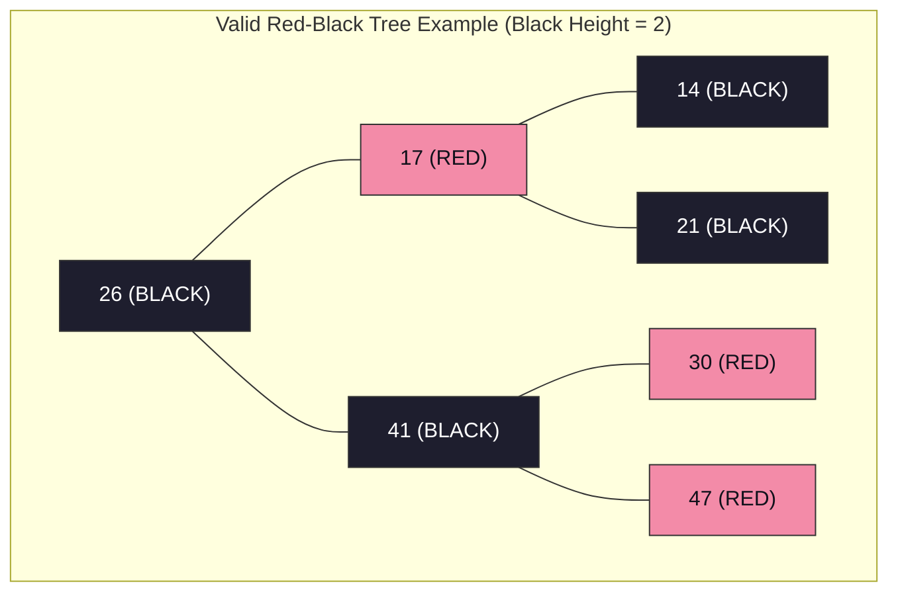
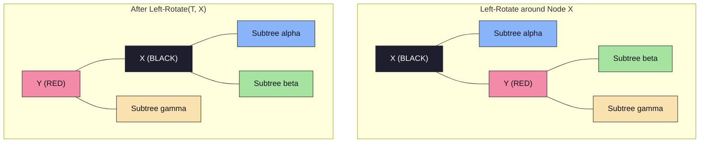
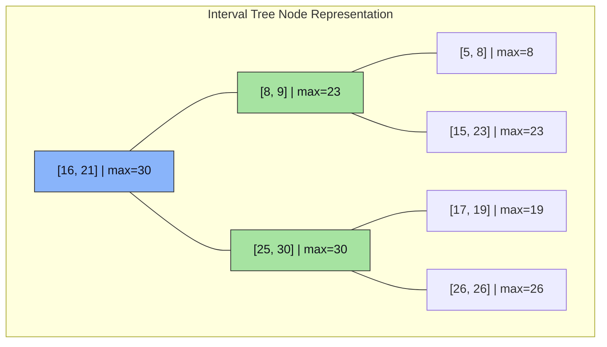
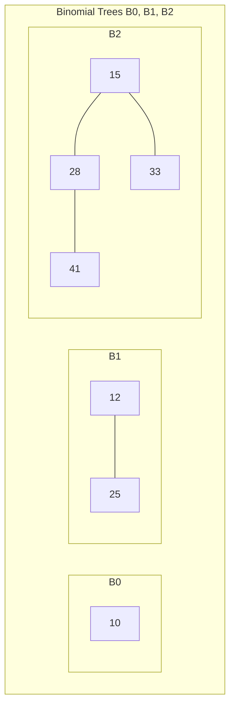
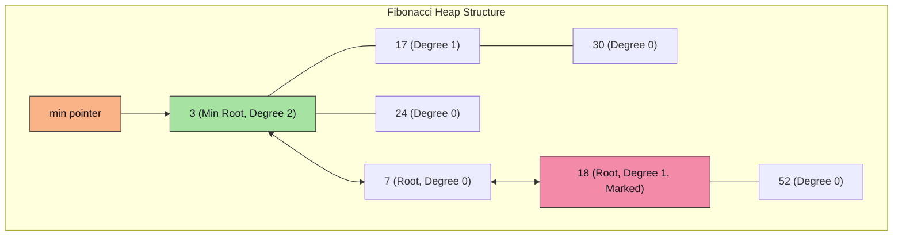
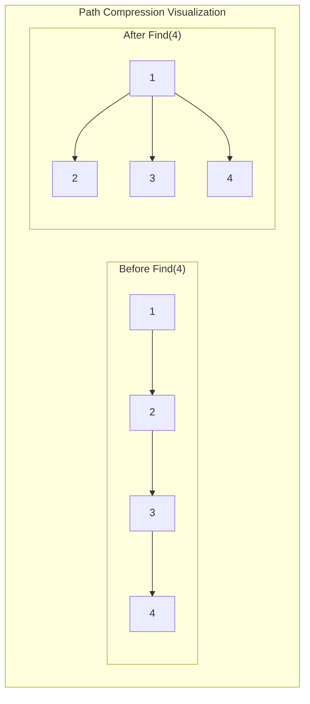
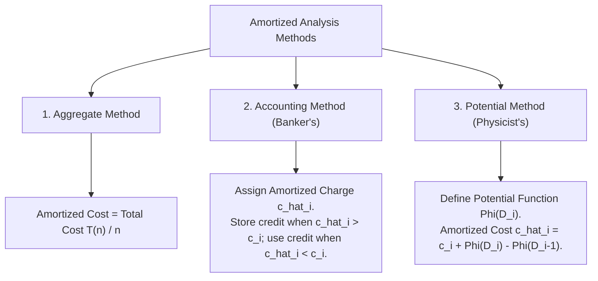

# Chapter 4: Advanced Data Structures & Amortized Analysis

> **Course Code:** 3CS501CC24
> **Focus:** Red-Black Trees, Interval Trees, Binomial Heaps, Fibonacci Heaps, Disjoint Set Structures & Amortized Analysis

---

## 1. Chapter Overview

This unit covers advanced data structures that guarantee logarithmic or constant amortized time complexities:
1. **Red-Black Trees (RBT):** Self-balancing binary search trees ensuring $O(\log n)$ worst-case bounds on search, insertion, and deletion.
2. **Interval Trees:** Augmented self-balancing search trees for dynamic interval management and overlap queries in $O(\log n)$ time.
3. **Binomial Heaps:** Forest of Binomial Trees supporting $O(\log n)$ worst-case merge/union operations.
4. **Fibonacci Heaps:** Lazy mergeable heaps supporting $O(1)$ amortized insertion, union, and decrease-key operations.
5. **Disjoint Set Structures:** Union-Find data structures with Path Compression and Union by Rank achieving $O(\alpha(n))$ amortized time.
6. **Amortized Analysis:** Evaluating average cost per operation over a sequence using Aggregate, Accounting, and Potential methods.

---

## 2. Red-Black Trees (RBT): Complete Case-by-Case Guide

### Definition & The 5 Red-Black Tree Properties
Every node in a Red-Black Tree has a `color` (**RED** or **BLACK**), `key`, `left`, `right`, and `parent`.
1. **Node Color:** Every node is either **RED** or **BLACK**.
2. **Root Property:** The root is always **BLACK**.
3. **Leaf Property:** Every leaf (`NIL`) is **BLACK**.
4. **Red Property (No Red-Red Conflict):** If a node is **RED**, both of its children must be **BLACK**.
5. **Black-Height Property:** Every simple path from a node to any of its descendant `NIL` leaves contains the exact same number of **BLACK** nodes.



---

### Tree Rotations (Left-Rotate and Right-Rotate)



---

### Red-Black Tree Insertion: All 3 Cases

When inserting node $Z$:
1. Insert $Z$ using standard BST insertion and color $Z$ **RED**.
2. If $Z$ is root $\implies$ Recolor $Z$ to **BLACK**.
3. If $Z$'s parent $P$ is **RED** $\implies$ Red-Red Conflict! Look at $Z$'s **Uncle $U$**:

#### Case 1: Uncle $U$ is RED (Recoloring)
- **Steps:** Recolor Parent $P \to$ **BLACK**, Uncle $U \to$ **BLACK**, Grandparent $G \to$ **RED**. Set $Z = G$ and repeat checks.

#### Case 2: Uncle $U$ is BLACK/NIL & $Z$ is Triangle Child (Rotation to Line)
- **Steps:** Rotate Parent $P$ away from $Z$ (e.g., Left-Rotate around $P$). Converts into Case 3 (Line).

#### Case 3: Uncle $U$ is BLACK/NIL & $Z$ is Line Child (Rotation & Recoloring)
- **Steps:** Rotate Grandparent $G$ away from $P$ (e.g., Right-Rotate around $G$). Recolor Parent $P \to$ **BLACK**, Grandparent $G \to$ **RED**.

---

### Red-Black Tree Deletion (`RB-DELETE-FIXUP`)
When a BLACK node is deleted, its path loses 1 black node, creating a **Double Black** on replacement $X$. Let $W$ be $X$'s Sibling:
- **Case 1:** Sibling $W$ is RED $\implies$ Recolor $W \to$ BLACK, Parent $X.p \to$ RED, Left-Rotate($X.p$).
- **Case 2:** Sibling $W$ is BLACK and both children of $W$ are BLACK $\implies$ Recolor $W \to$ RED, move Double Black up to $X.p$.
- **Case 3:** Sibling $W$ is BLACK, Inner Child is RED, Outer Child is BLACK $\implies$ Recolor $W.\text{left} \to$ BLACK, $W \to$ RED, Right-Rotate($W$). Converts to Case 4.
- **Case 4:** Sibling $W$ is BLACK and Outer Child is RED $\implies$ Recolor $W \to$ Parent $X.p$'s color, $X.p \to$ BLACK, $W.\text{right} \to$ BLACK, Left-Rotate($X.p$). Double Black fully resolved!

---

## 3. Interval Trees: Step-by-Step Operations & Case Guide

An **Interval Tree** is an augmented Red-Black Tree that stores dynamic intervals $[i.low, i.high]$.

### Node Structure & Attributes
Each node $x$ contains:
1. $x.interval = [x.low, x.high]$
2. $x.key = x.interval.low$ (Ordered by low endpoint in BST)
3. $x.max = \max(x.interval.high, x.left.max, x.right.max)$ (Max high endpoint in subtree)



### Core Operations

#### 1. Overlap Check Function
Two intervals $i$ and $i'$ overlap if:

$$
i.low \le i'.high \quad \text{and} \quad i'.low \le i.high
$$

#### 2. Interval Search Algorithm (`INTERVAL-SEARCH(T, i)`)
Finds an interval in $T$ overlapping with target interval $i$:

```text
Algorithm INTERVAL-SEARCH(T, i)
    x = T.root
    while x != NIL and NOT OVERLAP(x.interval, i) do
        if x.left != NIL and x.left.max >= i.low then
            x = x.left
        else
            x = x.right
    return x
```

- **Proof of Branching Logic:**
  - If `x.left` $\neq \text{NIL}$ and `x.left.max` $\ge i.low$, then the left subtree is guaranteed to contain an overlapping interval if any exists in $T$.
  - If `x.left.max` $< i.low$, then no interval in the left subtree can possibly overlap $i$ because every high endpoint in the left subtree is $< i.low$. Going right is necessary.

#### 3. Insertion & Rotation Maintenance
- Insert node $z$ using $z.interval.low$ as the key into the Red-Black Tree.
- Set $z.max = z.interval.high$.
- During upward traversal and rotations (Left-Rotate / Right-Rotate), update $x.max$ for affected nodes:

$$
x.max = \max(x.interval.high, x.left.max, x.right.max)
$$

- **Complexity:** All operations (Insert, Delete, Search) run in $O(\log n)$ worst-case time.

---

## 4. Binomial Heaps: Structure & Operations

### Binomial Tree $B_k$ Properties
1. $B_k$ has $2^k$ total nodes and height $k$.
2. Root degree of $B_k$ is $k$.
3. $B_k$ is formed by linking two $B_{k-1}$ trees (smaller root becomes parent).



### Union Algorithm
1. Merge root lists of $H_1$ and $H_2$ in ascending order of degree.
2. Link trees with duplicate degrees using pointers `prev`, `curr`, `next`:
   - If `curr.key <= next.key`: Link `next` under `curr`.
   - If `curr.key` $> \text{next.key}$: Link `curr` under `next`.
- **Complexity:** $O(\log n)$ worst-case.

---

## 5. Fibonacci Heaps: Lazy Operations & Amortized Bounds

### Key Features
- **Lazy Structure:** Trees are unstructured in circular root list until `Extract-Min`.
- **Marked Bit:** `mark[x]` tracks whether node $x$ lost a child since $x$ was made a child of another node.



### Key Operations & Amortized Costs
1. **Insert & Union:** Add node / concatenate root lists in $\Theta(1)$ amortized time.
2. **Extract-Min & Consolidation:** Remove min node, add children to root list, consolidate same-degree roots using array $A[0 \dots D(n)]$. Amortized time $O(\log n)$.
3. **Decrease-Key & Cascading Cut:**
   - If $x.key < x.parent.key$, `CUT(x, y)` moves $x$ to root list.
   - `CASCADING-CUT(y)` recursively cuts ancestors if they are already marked (`mark == TRUE`). Amortized time $\Theta(1)$.

---

## 6. Disjoint Set Structures (Union-Find)

Maintains non-overlapping dynamic sets supporting `MAKE-SET(x)`, `FIND-SET(x)`, and `UNION(x, y)`.

### Optimized Pseudocode
```text
Algorithm MAKE-SET(x)
    x.parent = x
    x.rank = 0

Algorithm FIND-SET(x)
    if x != x.parent then
        x.parent = FIND-SET(x.parent)  // Path Compression
    return x.parent

Algorithm UNION(x, y)
    LINK(FIND-SET(x), FIND-SET(y))

Algorithm LINK(x, y)
    if x.rank &gt; y.rank then
        y.parent = x
    else
        x.parent = y
        if x.rank == y.rank then
            y.rank = y.rank + 1
```



### Amortized Complexity
Using **Union by Rank** and **Path Compression**, a sequence of $m$ operations on $n$ elements takes $O(m \cdot \alpha(n))$ time, where $\alpha(n) \le 4$ is the Inverse Ackermann function. Amortized cost per operation is $\Theta(1)$.

---

## 7. Amortized Analysis Methods



---

## 8. Formula Sheet

- **Red-Black Tree Height:** $h \le 2 \log_2(n + 1)$.
- **Binomial Tree $B_k$:** Nodes $= 2^k$, Height $= k$, Root Degree $= k$.
- **Fibonacci Heap Potential Function:** $\Phi(H) = t(H) + 2 m(H)$ (where $t(H)$ is root count, $m(H)$ is marked node count).
- **Disjoint Set Operations Amortized Cost:** $O(\alpha(n)) \approx \Theta(1)$.
- **Interval Overlap Condition:** $i.low \le i'.high \text{ and } i'.low \le i.high$.

---

## 9. Definition Sheet

1. **Red-Black Tree:** A self-balancing binary search tree with colored nodes that guarantees $O(\log n)$ height.
2. **Interval Tree:** An augmented search tree for storing intervals and performing overlap queries in $O(\log n)$ time.
3. **Binomial Heap:** A collection of binomial trees satisfying min-heap property and unique degrees.
4. **Fibonacci Heap:** A min-heap structure achieving $O(1)$ amortized insertion, union, and decrease-key via lazy consolidation.
5. **Path Compression:** A technique in Union-Find that points all visited nodes directly to the root during `FIND-SET`.
6. **Inverse Ackermann Function ($\alpha(n)$):** An extremely slow-growing function ($\alpha(n) \le 4$ for all practical inputs) describing Disjoint Set efficiency.

---

## 10. Exam-Oriented Review

1. List the 5 Red-Black Tree properties and prove why the maximum height is $2 \log_2(n+1)$.
2. Trace Red-Black Tree insertion for keys $[15, 32, 20, 4, 12, 25, 7]$. Show all rotations and recoloring steps.
3. Explain the node structure of an Interval Tree. How is `x.max` updated during tree rotations?
4. Write the algorithm for `Interval-Search(T, i)` and prove why going left when `x.left.max >= i.low` is correct.
5. Explain how Fibonacci Heaps achieve $O(1)$ amortized time for `Decrease-Key` using Cascading Cuts.
6. Describe Union by Rank and Path Compression in Disjoint Sets. Derive the $O(\alpha(n))$ time complexity.
7. Compare Binary Heap, Binomial Heap, and Fibonacci Heap across all priority queue operations.

- **Red-Black Tree Height:** $h \le 2 \log_2(n + 1)$.
- **Binomial Tree $B_k$:** Nodes $= 2^k$, Height $= k$, Root Degree $= k$.
- **Fibonacci Heap Potential Function:** $\Phi(H) = t(H) + 2 m(H)$ (where $t(H)$ is root count, $m(H)$ is marked node count).
- **Disjoint Set Operations Amortized Cost:** $O(\alpha(n)) \approx \Theta(1)$.
- **Interval Overlap Condition:** $i.low \le i'.high \text{ and } i'.low \le i.high$.

---

## 9. Definition Sheet

1. **Red-Black Tree:** A self-balancing binary search tree with colored nodes that guarantees $O(\log n)$ height.
2. **Interval Tree:** An augmented search tree for storing intervals and performing overlap queries in $O(\log n)$ time.
3. **Binomial Heap:** A collection of binomial trees satisfying min-heap property and unique degrees.
4. **Fibonacci Heap:** A min-heap structure achieving $O(1)$ amortized insertion, union, and decrease-key via lazy consolidation.
5. **Path Compression:** A technique in Union-Find that points all visited nodes directly to the root during `FIND-SET`.
6. **Inverse Ackermann Function ($\alpha(n)$):** An extremely slow-growing function ($\alpha(n) \le 4$ for all practical inputs) describing Disjoint Set efficiency.

---

## 10. Exam-Oriented Review

1. List the 5 Red-Black Tree properties and prove why the maximum height is $2 \log_2(n+1)$.
2. Trace Red-Black Tree insertion for keys $[15, 32, 20, 4, 12, 25, 7]$. Show all rotations and recoloring steps.
3. Explain the node structure of an Interval Tree. How is `x.max` updated during tree rotations?
4. Write the algorithm for `Interval-Search(T, i)` and prove why going left when `x.left.max >= i.low` is correct.
5. Explain how Fibonacci Heaps achieve $O(1)$ amortized time for `Decrease-Key` using Cascading Cuts.
6. Describe Union by Rank and Path Compression in Disjoint Sets. Derive the $O(\alpha(n))$ time complexity.
7. Compare Binary Heap, Binomial Heap, and Fibonacci Heap across all priority queue operations.

---

Algorithm LINK(x, y)
    if x.rank &gt; y.rank then
        y.parent = x
    else
        x.parent = y
        if x.rank == y.rank then
            y.rank = y.rank + 1
```


### Amortized Complexity
Using **Union by Rank** and **Path Compression**, a sequence of $m$ operations on $n$ elements takes $O(m \cdot \alpha(n))$ time, where $\alpha(n) \le 4$ is the Inverse Ackermann function. Amortized cost per operation is $\Theta(1)$.

---

## 7. Amortized Analysis Methods


---

## 8. Formula Sheet

- **Red-Black Tree Height:** $h \le 2 \log_2(n + 1)$.
- **Binomial Tree $B_k$:** Nodes $= 2^k$, Height $= k$, Root Degree $= k$.
- **Fibonacci Heap Potential Function:** $\Phi(H) = t(H) + 2 m(H)$ (where $t(H)$ is root count, $m(H)$ is marked node count).
- **Disjoint Set Operations Amortized Cost:** $O(\alpha(n)) \approx \Theta(1)$.
- **Interval Overlap Condition:** $i.low \le i'.high \text{ and } i'.low \le i.high$.

---

## 9. Definition Sheet

1. **Red-Black Tree:** A self-balancing binary search tree with colored nodes that guarantees $O(\log n)$ height.
2. **Interval Tree:** An augmented search tree for storing intervals and performing overlap queries in $O(\log n)$ time.
3. **Binomial Heap:** A collection of binomial trees satisfying min-heap property and unique degrees.
4. **Fibonacci Heap:** A min-heap structure achieving $O(1)$ amortized insertion, union, and decrease-key via lazy consolidation.
5. **Path Compression:** A technique in Union-Find that points all visited nodes directly to the root during `FIND-SET`.
6. **Inverse Ackermann Function ($\alpha(n)$):** An extremely slow-growing function ($\alpha(n) \le 4$ for all practical inputs) describing Disjoint Set efficiency.

---

## 10. Exam-Oriented Review

1. List the 5 Red-Black Tree properties and prove why the maximum height is $2 \log_2(n+1)$.
2. Trace Red-Black Tree insertion for keys $[15, 32, 20, 4, 12, 25, 7]$. Show all rotations and recoloring steps.
3. Explain the node structure of an Interval Tree. How is `x.max` updated during tree rotations?
4. Write the algorithm for `Interval-Search(T, i)` and prove why going left when `x.left.max >= i.low` is correct.
5. Explain how Fibonacci Heaps achieve $O(1)$ amortized time for `Decrease-Key` using Cascading Cuts.
6. Describe Union by Rank and Path Compression in Disjoint Sets. Derive the $O(\alpha(n))$ time complexity.
7. Compare Binary Heap, Binomial Heap, and Fibonacci Heap across all priority queue operations.
