# Chapter 4: Unit 4 — Advanced Data Structures & Amortized Analysis

> **Course Code:** 3CS501CC24
> **Focus:** Red-Black Trees, Binomial Heaps, Fibonacci Heaps & Amortized Analysis (Comprehensive Exam & Problem-Solving Master Guide with Colorful Mermaid Diagrams)

---

## 1. Chapter Overview
This unit covers advanced data structures that guarantee logarithmic or constant amortized time complexities:
1. **Red-Black Trees (RBT):** Self-balancing binary search trees ensuring $O(\log n)$ worst-case bounds on search, insertion, and deletion.
2. **Binomial Heaps:** Forest of Binomial Trees supporting $O(\log n)$ worst-case merge/union operations.
3. **Fibonacci Heaps:** Lazy mergeable heaps supporting $O(1)$ amortized insertion, union, and decrease-key operations.
4. **Amortized Analysis:** Evaluating the average cost per operation over a sequence using Aggregate, Accounting, and Potential methods.

---

## 2. Red-Black Trees (RBT): Complete Case-by-Case Guide

### Definition & The 5 Red-Black Tree Properties
Every node in a Red-Black Tree has a `color` (**RED** or **BLACK**), `key`, `left`, `right`, and `parent`.
1. **Node Color:** Every node is either **RED** or **BLACK**.
2. **Root Property:** The root is always **BLACK**.
3. **Leaf Property:** Every leaf (`NIL`) is **BLACK**.
4. **Red Property (No Red-Red Conflict):** If a node is **RED**, both of its children must be **BLACK**.
5. **Black-Height Property:** Every simple path from a node to any of its descendant `NIL` leaves contains the exact same number of **BLACK** nodes.

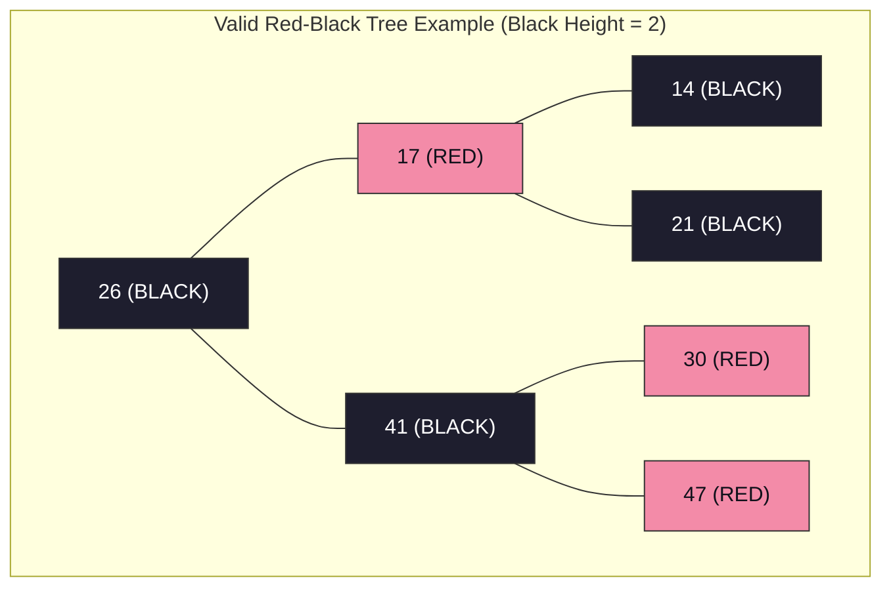

---

### Tree Rotations (Left-Rotate and Right-Rotate)

```mermaid
flowchart TD
    subgraph "Left-Rotate around Node X"
        direction LR
        X1["X (BLACK)"] --- A1["Subtree alpha"]
        X1 --- Y1["Y (RED)"]
        Y1 --- B1["Subtree beta"]
        Y1 --- C1["Subtree gamma"]

        style X1 fill:#1e1e2e,stroke:#333,color:#fff
        style Y1 fill:#f38ba8,stroke:#333,color:#11111b
        style A1 fill:#89b4fa,stroke:#333,color:#11111b
        style B1 fill:#a6e3a1,stroke:#333,color:#11111b
        style C1 fill:#f9e2af,stroke:#333,color:#11111b
    end

    subgraph "After Left-Rotate("T, X")"
        direction LR
        Y2["Y (RED)"] --- X2["X (BLACK)"]
        Y2 --- C2["Subtree gamma"]
        X2 --- A2["Subtree alpha"]
        X2 --- B2["Subtree beta"]

        style Y2 fill:#f38ba8,stroke:#333,color:#11111b
        style X2 fill:#1e1e2e,stroke:#333,color:#fff
        style A2 fill:#89b4fa,stroke:#333,color:#11111b
        style B2 fill:#a6e3a1,stroke:#333,color:#11111b
        style C2 fill:#f9e2af,stroke:#333,color:#11111b
    end
```

---

### Red-Black Tree Insertion: All 3 Cases with Diagrams

When inserting node $Z$:
1. Insert $Z$ using standard BST insertion and color $Z$ **RED**.
2. If $Z$ is root $\to$ Recolor $Z$ to **BLACK**.
3. If $Z$'s parent $P$ is **RED** $\to$ Red-Red Conflict! Look at $Z$'s **Uncle $U$** (sibling of $P$):

#### Case 1: Uncle $U$ is RED (Recoloring)
- **Condition:** Both Parent $P$ and Uncle $U$ are RED.
- **Steps:**
  1. Recolor Parent $P \to$ **BLACK**.
  2. Recolor Uncle $U \to$ **BLACK**.
  3. Recolor Grandparent $G \to$ **RED**.
  4. Set $Z = G$ and repeat check up the tree.

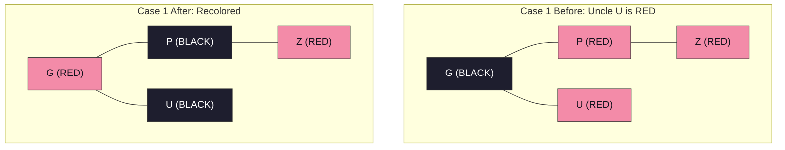

#### Case 2: Uncle $U$ is BLACK/NIL & $Z$ is a Triangle Child (Rotation to Line)
- **Condition:** Uncle $U$ is BLACK or NIL, $P$ is Left Child of $G$, and $Z$ is Right Child of $P$ (or vice-versa).
- **Steps:**
  1. Rotate Parent $P$ away from $Z$ (e.g. Left-Rotate around $P$).
  2. Set $Z = P$. $Z$ and $P$ are now in **Case 3 (Line)** shape.

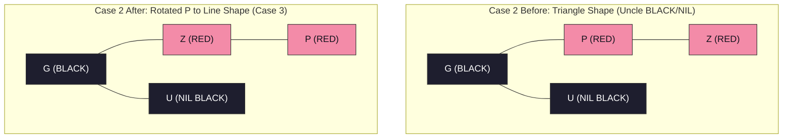

#### Case 3: Uncle $U$ is BLACK/NIL & $Z$ is a Line Child (Rotation & Recoloring)
- **Condition:** Uncle $U$ is BLACK or NIL, $P$ is Left Child of $G$, and $Z$ is Left Child of $P$ (or vice-versa).
- **Steps:**
  1. Rotate Grandparent $G$ away from $P$ (e.g. Right-Rotate around $G$).
  2. Recolor Parent $P \to$ **BLACK**.
  3. Recolor Grandparent $G \to$ **RED**.
  4. Red-Red conflict is fully resolved!

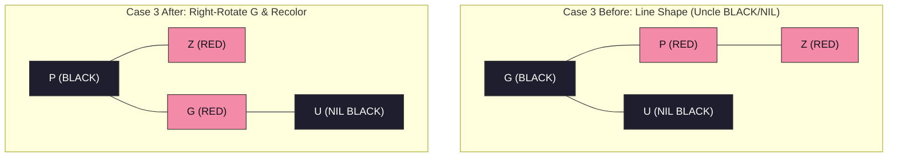

---

### Red-Black Tree Deletion: All 4 Cases (`RB-DELETE-FIXUP`)

When a BLACK node is deleted, its path loses 1 black node, creating a **Double Black** on replacement $X$. Let $W$ be $X$'s Sibling:

#### Case 1: Sibling $W$ is RED
- **Condition:** $W.\text{color} == \text{RED}$.
- **Steps:**
  1. Recolor Sibling $W \to$ **BLACK**.
  2. Recolor Parent $X.p \to$ **RED**.
  3. Left-Rotate($X.p$).
  4. New sibling is now BLACK $\to$ Proceed to Case 2, 3, or 4.

```mermaid
flowchart TD
    subgraph "Case 1 Before: Sibling W is RED"
        P1["X.p (BLACK)"] --- X1["X (Double Black)"]
        P1 --- W1["W (RED)"]
        W1 --- C1["Subtree A (BLACK)"]
        W1 --- C2["Subtree B (BLACK)"]

        style P1 fill:#1e1e2e,stroke:#333,color:#fff
        style X1 fill:#a6e3a1,stroke:#333,color:#11111b
        style W1 fill:#f38ba8,stroke:#333,color:#11111b
        style C1 fill:#1e1e2e,stroke:#333,color:#fff
        style C2 fill:#1e1e2e,stroke:#333,color:#fff
    end

    subgraph "Case 1 After: Recolor & Left-Rotate("X.p")"
        W2["W (BLACK)"] --- P2["X.p (RED)"]
        W2 --- C22["Subtree B (BLACK)"]
        P2 --- X2["X (Double Black)"]
        P2 --- C12["Subtree A (BLACK)"]

        style W2 fill:#1e1e2e,stroke:#333,color:#fff
        style P2 fill:#f38ba8,stroke:#333,color:#11111b
        style X2 fill:#a6e3a1,stroke:#333,color:#11111b
        style C12 fill:#1e1e2e,stroke:#333,color:#fff
        style C22 fill:#1e1e2e,stroke:#333,color:#fff
    end
```

#### Case 2: Sibling $W$ is BLACK and Both Children of $W$ are BLACK
- **Condition:** $W.\text{color} == \text{BLACK}$, $W.\text{left}.\text{color} == \text{BLACK}$, $W.\text{right}.\text{color} == \text{BLACK}$.
- **Steps:**
  1. Recolor Sibling $W \to$ **RED**.
  2. Move Double Black up: Set $X = X.p$.
  3. If $X.p$ was RED, recolor $X \to$ **BLACK** and finish; otherwise repeat loop.

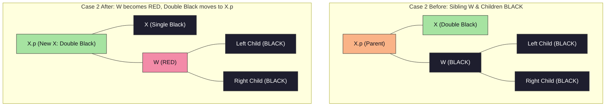

#### Case 3: Sibling $W$ is BLACK, Inner Child is RED, Outer Child is BLACK
- **Condition:** $W.\text{left}.\text{color} == \text{RED}, W.\text{right}.\text{color} == \text{BLACK}$.
- **Steps:**
  1. Recolor $W.\text{left} \to$ **BLACK**.
  2. Recolor Sibling $W \to$ **RED**.
  3. Right-Rotate($W$).
  4. Transforms into **Case 4**.

```mermaid
flowchart TD
    subgraph "Case 3 Before: Inner Child RED, Outer Child BLACK"
        P1["X.p"] --- X1["X (Double Black)"]
        P1 --- W1["W (BLACK)"]
        W1 --- WL1["W.left (RED)"]
        W1 --- WR1["W.right (BLACK)"]

        style P1 fill:#fab387,stroke:#333,color:#11111b
        style X1 fill:#a6e3a1,stroke:#333,color:#11111b
        style W1 fill:#1e1e2e,stroke:#333,color:#fff
        style WL1 fill:#f38ba8,stroke:#333,color:#11111b
        style WR1 fill:#1e1e2e,stroke:#333,color:#fff
    end

    subgraph "Case 3 After: Right-Rotate("W") -> Converted to Case 4"
        P2["X.p"] --- X2["X (Double Black)"]
        P2 --- WL2["New W: W.left (BLACK)"]
        WL2 --- Sub1["Subtree"]
        WL2 --- W2["Old W (RED)"]
        W2 --- WR2["W.right (BLACK)"]

        style P2 fill:#fab387,stroke:#333,color:#11111b
        style X2 fill:#a6e3a1,stroke:#333,color:#11111b
        style WL2 fill:#1e1e2e,stroke:#333,color:#fff
        style Sub1 fill:#1e1e2e,stroke:#333,color:#fff
        style W2 fill:#f38ba8,stroke:#333,color:#11111b
        style WR2 fill:#1e1e2e,stroke:#333,color:#fff
    end
```

#### Case 4: Sibling $W$ is BLACK and Outer Child is RED
- **Condition:** $W.\text{right}.\text{color} == \text{RED}$.
- **Steps:**
  1. Recolor Sibling $W \to$ Parent $X.p$'s color.
  2. Recolor Parent $X.p \to$ **BLACK**.
  3. Recolor $W.\text{right} \to$ **BLACK**.
  4. Left-Rotate($X.p$).
  5. Set $X = T.\text{root}$ $\implies$ **Double Black fully eliminated!**

```mermaid
flowchart TD
    subgraph "Case 4 Before: Outer Child is RED"
        P1["X.p (Parent)"] --- X1["X (Double Black)"]
        P1 --- W1["W (BLACK)"]
        W1 --- WL1["W.left"]
        W1 --- WR1["W.right (RED)"]

        style P1 fill:#fab387,stroke:#333,color:#11111b
        style X1 fill:#a6e3a1,stroke:#333,color:#11111b
        style W1 fill:#1e1e2e,stroke:#333,color:#fff
        style WL1 fill:#1e1e2e,stroke:#333,color:#fff
        style WR1 fill:#f38ba8,stroke:#333,color:#11111b
    end

    subgraph "Case 4 After: Recolor & Left-Rotate("X.p") -> Double Black Resolved!"
        W2["W (Parent Color)"] --- P2["X.p (BLACK)"]
        W2 --- WR2["W.right (BLACK)"]
        P2 --- X2["X (Single Black)"]
        P2 --- WL2["W.left"]

        style W2 fill:#fab387,stroke:#333,color:#11111b
        style P2 fill:#1e1e2e,stroke:#333,color:#fff
        style WR2 fill:#1e1e2e,stroke:#333,color:#fff
        style X2 fill:#1e1e2e,stroke:#333,color:#fff
        style WL2 fill:#1e1e2e,stroke:#333,color:#fff
    end
```

---

## 3. Binomial Heaps: Step-by-Step Operations & Cases

### Binomial Tree $B_k$ Properties
1. $B_k$ has $2^k$ total nodes.
2. Height of $B_k$ is $k$.
3. Root degree of $B_k$ is $k$.
4. $B_k$ is formed by making one $B_{k-1}$ the left child of another $B_{k-1}$.

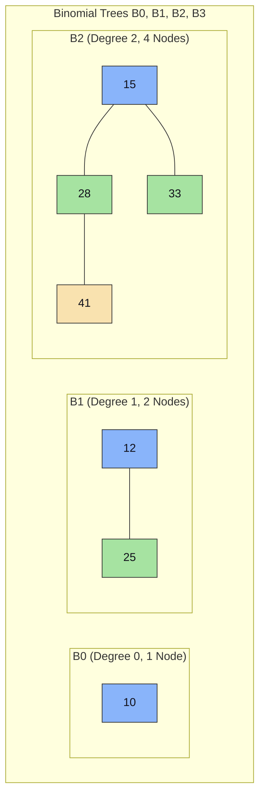

---

### Binomial Heap Union/Merge Algorithm (All Cases)

Given two Binomial Heaps $H_1$ and $H_2$:
1. **Merge Root Lists:** Merge root lists in ascending order of tree degree.
2. **Consolidate Equal Degrees:** Traverse root list with pointers `prev`, `curr`, `next`.
   - **Case A (Degrees Different):** `curr.degree != next.degree` $\implies$ Advance pointers.
   - **Case B (3 Equal Degrees):** `curr.degree == next.degree == next.next.degree` $\implies$ Advance pointers.
   - **Case C (2 Equal Degrees, `curr.key <= next.key`):** Link `next` under `curr` $\implies$ `curr` becomes parent of `next`. Degree of `curr` becomes $k+1$.
   - **Case D (2 Equal Degrees, `curr.key &gt; next.key`):** Link `curr` under `next` $\implies$ `next` becomes parent of `curr`.

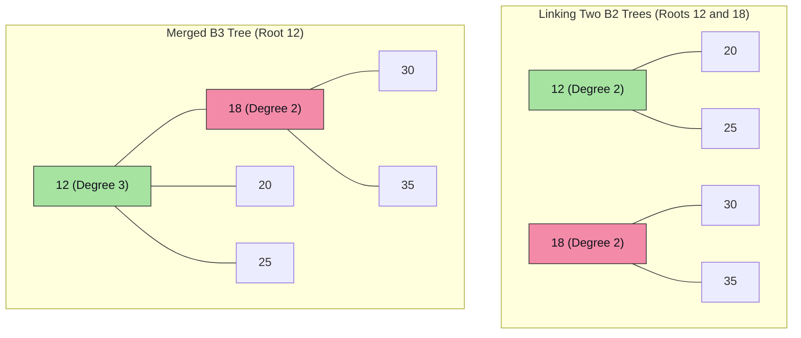

---

### Step-by-Step Solved Problem: Binomial Heap Operations

#### 1. Insert(H, x)
- Create a new single-node Binomial Heap $H'$ containing $x$ (a $B_0$ tree).
- Call `Binomial-Heap-Union(H, H')`.
- **Complexity:** $O(\log n)$.

#### 2. Extract-Min(H)
- Find root $x$ with minimum key in root list.
- Remove $x$ from root list.
- Reverse the order of $x$'s child subtrees to form a new Binomial Heap $H''$.
- Call `Binomial-Heap-Union(H, H'')`.
- **Complexity:** $O(\log n)$.

```mermaid
flowchart TD
    subgraph "Extract-Min Flow"
        Step1["1. Search Root List -> Locate Min Root X"] --> Step2["2. Remove X from Root List"]
        Step2 --> Step3["3. Reverse X's Children to form new Heap H''"]
        Step3 --> Step4["4. Call Binomial-Heap-Union("H, H''")"]
    end
```

#### 3. Decrease-Key(H, x, k)
- Set $x.\text{key} = k$.
- While $x$ is not root and $x.\text{key} < x.\text{parent}.\text{key}$:
  - Swap key and satellite data between $x$ and $x.\text{parent}$.
  - Set $x = x.\text{parent}$.
- **Complexity:** $O(\log n)$.

---

## 4. Fibonacci Heaps: Step-by-Step Operations & Cases

### Key Attributes
- **Lazy Structure:** Trees are unstructured in root list until `Extract-Min`.
- **Min Pointer:** Points directly to root with minimum key.
- **Marked Attribute:** `mark[x]` is `TRUE` if node $x$ lost a child since $x$ was made a child of another node.

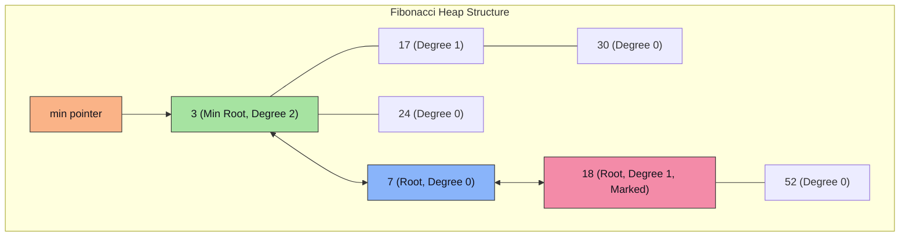

---

### Step-by-Step Fibonacci Heap Operations

#### 1. Insert(H, x) & Union(H1, H2)
- **Insert:** Create node $x$, add $x$ to $H$'s root list, update `min` pointer if $x.\text{key} < \text{min}.\text{key}$. Amortized Cost = $O(1)$.
- **Union:** Concatenate root lists of $H_1$ and $H_2$, update `min` pointer. Amortized Cost = $O(1)$.

#### 2. Extract-Min(H) & Consolidation
1. Remove `min` node $Z$ from root list.
2. Add all children of $Z$ to root list.
3. **Consolidate Root List:**
   - Initialize Degree Table $A[0 \dots D(n)] = \text{NIL}$.
   - For each node $x$ in root list:
     - $d = x.\text{degree}$.
     - While $A[d] \neq \text{NIL}$:
       - $y = A[d]$ (another root with degree $d$).
       - If $x.\text{key} > y.\text{key}$, swap $x$ and $y$.
       - Link $y$ under $x$ (`Fibonacci-Heap-Link`).
       - $A[d] = \text{NIL}, d = d + 1$.
     - $A[d] = x$.
4. Rebuild root list from $A[]$ and set `min` pointer. Amortized Cost = $O(\log n)$.

```mermaid
flowchart TD
    subgraph "Fibonacci Extract-Min Consolidation Flow"
        E1["Extract Min Z"] --> E2["Move Children of Z to Root List"]
        E2 --> E3["Loop Nodes in Root List"]
        E3 --> CheckA{"Is A["degree"] occupied?"}
        CheckA -- Yes --> Link["Link Roots: Larger Key becomes child of Smaller Key
Increment Degree -> Repeat Check"]
        CheckA -- No --> Store["&quot;Store Root in A[degree"]"]
        Link --> CheckA
        Store --> Done["Reconstruct Root List & Update min pointer"]
    end
```

#### 3. Decrease-Key(H, x, k) & Cascading Cut
1. Set $x.\text{key} = k$.
2. If $x.\text{key} < x.\text{parent}.\text{key}$:
   - **Cut(H, x, y):** Remove $x$ from child list of $y = x.\text{parent}$, add $x$ to root list, set $x.\text{mark} = \text{FALSE}$.
   - **Cascading-Cut(H, y):**
     - $z = y.\text{parent}$.
     - If $y$ is not root:
       - If $y.\text{mark} == \text{FALSE} \implies$ Set $y.\text{mark} = \text{TRUE}$.
       - If $y.\text{mark} == \text{TRUE} \implies$ Cut $y$ from $z$, add $y$ to root list, recursively call `Cascading-Cut(H, z)`.

```mermaid
flowchart TD
    subgraph "Cascading Cut Case Logic"
        DK["Decrease-Key("x, k")"] --> CheckViol{"Is x.key < x.parent.key?"}
        CheckViol -- No --> Valid["Heap Valid -> Done"]
        CheckViol -- Yes --> CutX["Cut x from Parent P -> Move x to Root List -> Unmark x"]
        CutX --> CheckP{"Is Parent P Marked?"}
        CheckP -- "No (P is Unmarked)" --> MarkP["Mark P = TRUE -> Done"]
        CheckP -- "Yes (P is Already Marked)" --> CutP["CASCADING CUT: Cut P from its Parent -> Move P to Root List -> Unmark P"]
        CutP --> RecP["Recursively Apply Cascading Cut to P's Parent"]
    end
```

---

## 5. Amortised Analysis Methods

```mermaid
flowchart TD
    A["Amortised Analysis Methods"] --> B["1. Aggregate Method"]
    A --> C["2. Accounting Method (Banker's)"]
    A --> D["3. Potential Method (Physicist's)"]

    B --> B1["Amortized Cost = Total Cost T("n") / n
Guarantees average cost per op over worst-case sequence"]
    C --> C1["Assign Amortized Charge c_hat_i to each op
If c_hat_i > c_i -> Store Credit in Data Structure
If c_hat_i < c_i -> Use Credit to pay for op
Rule: Total Credit >= 0 always"]
    D --> D1["Define Potential Function Phi("D_i") mapping state to real number
Amortized Cost c_hat_i = c_i + Phi("D_i") - Phi("D_i-1")
Rule: Phi("D_n") >= Phi("D_0") always"]

    style A fill:#fab387,stroke:#333,color:#11111b
    style B fill:#89b4fa,stroke:#333,color:#11111b
    style C fill:#a6e3a1,stroke:#333,color:#11111b
    style D fill:#f38ba8,stroke:#333,color:#11111b
```

---

## 6. Exam-Oriented Review & Formula Sheet

1. **Red-Black Tree Height Guarantee:** $h \le 2 \log_2(n+1)$.
2. **RBT Insertion Cases:**
   - **Case 1:** Uncle RED $\implies$ Recolor Parent, Uncle, Grandparent.
   - **Case 2:** Uncle BLACK, Triangle $\implies$ Rotate Parent to Line.
   - **Case 3:** Uncle BLACK, Line $\implies$ Rotate Grandparent & Recolor.
3. **RBT Deletion Fixup Cases:**
   - **Case 1:** Sibling RED $\implies$ Recolor & Rotate Parent towards $X$.
   - **Case 2:** Sibling BLACK, 2 Black Children $\implies$ Recolor Sibling RED, move Double Black up.
   - **Case 3:** Sibling BLACK, Inner Red Child $\implies$ Rotate Sibling away from $X$ (converts to Case 4).
   - **Case 4:** Sibling BLACK, Outer Red Child $\implies$ Recolor & Rotate Parent towards $X$ (Eliminates Double Black).
4. **Binomial Tree $B_k$:** $2^k$ nodes, degree $k$, height $k$.
5. **Fibonacci Heap Amortized Complexity:** $O(1)$ for Insert, Union, Decrease-Key; $O(\log n)$ for Extract-Min and Delete.
6. **Potential Method Equation:** $\hat{c}_i = c_i + \Phi(D_i) - \Phi(D_{i-1})$.

---

## 7. Master Worked Problem: Unified Array Construction Across RBT, Binomial Heap, and Fibonacci Heap

> [!IMPORTANT]
> **Unified Exam Problem:**
> Given the input array of keys:
> $$A = [15, 32, 20, 4, 12, 25, 7]$$
> Construct and demonstrate the complete step-by-step algorithmic procedures, state transitions, case resolutions, and final structures for:
> 1. **Red-Black Tree** (with Black-Height verification and Deletion Fixup)
> 2. **Binomial Heap** (with Binary Counter Analogy and Extract-Min)
> 3. **Fibonacci Heap** (with Root List Consolidation and Cascading Cut)

---

### Part 1: Red-Black Tree Construction Step-by-Step

We insert the sequence: $15, 32, 20, 4, 12, 25, 7$.
Standard BST rules apply first, followed by coloring newly inserted nodes **RED**, checking for Red-Red conflicts, and applying Cases 1, 2, or 3.

#### Step 1: Insert 15
- Standard BST insertion: 15 is root.
- **Rule 2 (Root Property):** Recolor root to **BLACK**.
- **Tree State:** Node `15 (BLACK)`. Black Height $bh = 1$.

#### Step 2: Insert 32
- BST insertion: $32 > 15 \implies$ Right child of 15.
- Color: $32$ is **RED**.
- Check: Parent 15 is BLACK $\implies$ No violation.

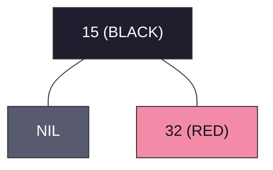

#### Step 3: Insert 20
- BST insertion: $20 > 15$ and $20 < 32 \implies$ Left child of 32.
- Color: $20$ is **RED**.
- **Violation:** Red-Red conflict between Parent 32 (RED) and Child 20 (RED).
- **Uncle Check:** Uncle of 20 is Left child of Grandparent 15 $\implies$ `NIL (BLACK)`.
- **Case Identification:** Uncle is BLACK and nodes form a **Triangle (RL)** configuration: Grandparent 15 $	o$ Right Child 32 $	o$ Left Child 20.
  - **Substep 3a (Case 2 - Rotate Parent to Line):** Right-Rotate around Parent 32.
    - 20 becomes Right child of 15; 32 becomes Right child of 20.
  - **Substep 3b (Case 3 - Line Shape RR):** Left-Rotate around Grandparent 15.
    - Recolor Parent 20 $	o$ **BLACK**.
    - Recolor Grandparent 15 $	o$ **RED**.

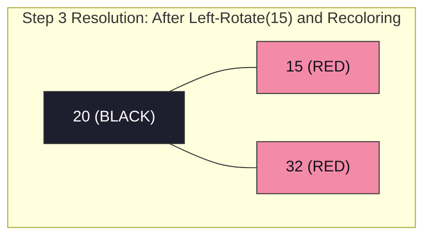

#### Step 4: Insert 4
- BST insertion: $4 < 20$ and $4 < 15 \implies$ Left child of 15.
- Color: $4$ is **RED**.
- **Violation:** Red-Red conflict between Parent 15 (RED) and Child 4 (RED).
- **Uncle Check:** Uncle of 4 is Right child of Grandparent 20 $\implies$ Node 32 is **RED**!
- **Case 1 (Uncle is RED $\implies$ Recoloring Only):**
  - Recolor Parent 15 $	o$ **BLACK**.
  - Recolor Uncle 32 $	o$ **BLACK**.
  - Recolor Grandparent 20 $	o$ **RED**.
  - Root Property Check: 20 is root $\implies$ Recolor 20 back to **BLACK**.

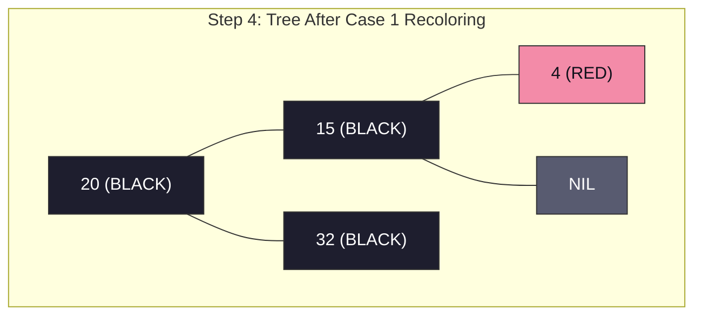

#### Step 5: Insert 12
- BST insertion: $12 < 20$, $12 < 15$, $12 > 4 \implies$ Right child of 4.
- Color: $12$ is **RED**.
- Check: Parent 4 is RED $\implies$ Red-Red Conflict!
- **Uncle Check:** Uncle of 12 is Right child of 15 $\implies$ `NIL (BLACK)`.
- **Case Identification:** Uncle is BLACK, Triangle (LR) shape (15 $	o$ 4 $	o$ 12).
  - **Substep 5a (Case 2 $	o$ Rotate Parent):** Left-Rotate around Parent 4 $\implies$ Line shape LL (15 $	o$ 12 $	o$ 4).
  - **Substep 5b (Case 3 $	o$ Rotate Grandparent & Recolor):** Right-Rotate around Grandparent 15.
    - Recolor 12 $	o$ **BLACK**.
    - Recolor 15 $	o$ **RED**.

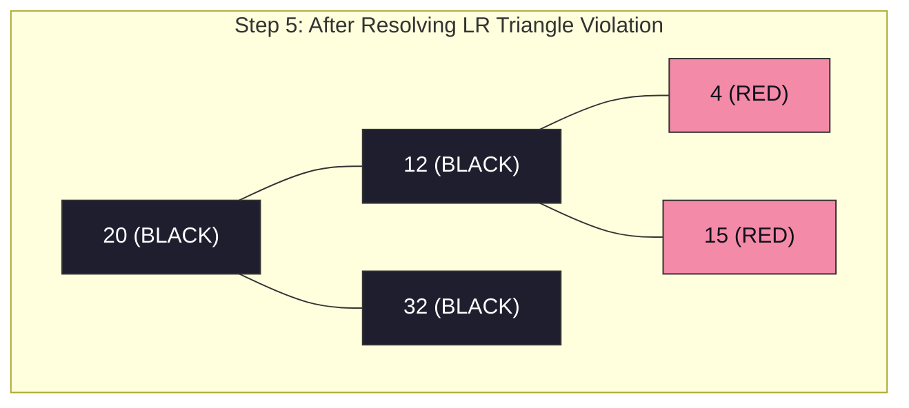

#### Step 6: Insert 25
- BST insertion: $25 > 20$, $25 < 32 \implies$ Left child of 32.
- Color: $25$ is **RED**.
- Check: Parent 32 is BLACK $\implies$ No violation! Black height preserved.

#### Step 7: Insert 7
- BST insertion: $7 < 20$, $7 < 12$, $7 > 4 \implies$ Right child of 4.
- Color: $7$ is **RED**.
- **Violation:** Parent 4 is RED, Child 7 is RED.
- **Uncle Check:** Uncle of 7 is Right child of 12 $\implies$ Node 15 is **RED**!
- **Case 1 (Uncle RED):**
  - Recolor Parent 4 $	o$ **BLACK**.
  - Recolor Uncle 15 $	o$ **BLACK**.
  - Recolor Grandparent 12 $	o$ **RED**.
  - Check Grandparent 12: Parent of 12 is 20 (BLACK) $\implies$ No further violation!

```mermaid
flowchart TD
    subgraph "Final Completed Red-Black Tree for Array [15, 32, 20, 4, 12, 25, 7]"
        Root["20 (BLACK)"] --- C12["12 (RED)"]
        Root --- C32["32 (BLACK)"]
        C12 --- C4["4 (BLACK)"]
        C12 --- C15["15 (BLACK)"]
        C4 --- NIL_L["NIL"]
        C4 --- C7["7 (RED)"]
        C32 --- C25["25 (RED)"]
        C32 --- NIL_R["NIL"]

        style Root fill:#1e1e2e,stroke:#333,color:#fff
        style C12 fill:#f38ba8,stroke:#333,color:#11111b
        style C32 fill:#1e1e2e,stroke:#333,color:#fff
        style C4 fill:#1e1e2e,stroke:#333,color:#fff
        style C15 fill:#1e1e2e,stroke:#333,color:#fff
        style C7 fill:#f38ba8,stroke:#333,color:#11111b
        style C25 fill:#f38ba8,stroke:#333,color:#11111b
        style NIL_L fill:#585b70,stroke:#333,color:#fff
        style NIL_R fill:#585b70,stroke:#333,color:#fff
    end
```

#### Black-Height Verification Matrix

| Path from Root (20) to Leaf | Nodes on Simple Path | Black Nodes Count | Path Black-Height ($bh$) | Property Valid? |
| :--- | :--- | :--- | :--- | :--- |
| Path 1 | $20 	o 12 	o 4 	o 	ext{NIL}$ | $20, 4, 	ext{NIL}$ | **2** (excluding root) | Valid |
| Path 2 | $20 	o 12 	o 4 	o 7 	o 	ext{NIL}$ | $20, 4, 	ext{NIL}$ | **2** (excluding root) | Valid |
| Path 3 | $20 	o 12 	o 15 	o 	ext{NIL}$ | $20, 15, 	ext{NIL}$ | **2** (excluding root) | Valid |
| Path 4 | $20 	o 32 	o 25 	o 	ext{NIL}$ | $20, 32, 	ext{NIL}$ | **2** (excluding root) | Valid |
| Path 5 | $20 	o 32 	o 	ext{NIL}$ | $20, 32, 	ext{NIL}$ | **2** (excluding root) | Valid |

---

### Part 2: Binomial Heap Construction Step-by-Step

We insert the same array $A = [15, 32, 20, 4, 12, 25, 7]$.
A Binomial Heap maintains a collection of binomial trees where no two trees share the same degree. Insertion is isomorphic to **binary addition**:

$$	ext{Count } n = 7_{10} = 111_2 \implies 	ext{Final Heap must contain } B_2 + B_1 + B_0$$

#### Step-by-Step State Transitions:

1. **Insert 15:**
   - Binary representation: $1_2 \implies B_0(15)$.
   - Forest: $\{ B_0(15) \}$.

2. **Insert 32:**
   - New single node: $B_0(32)$.
   - Binary representation: $2_{10} = 10_2$.
   - Conflict: Two $B_0$ trees ($B_0(15)$ and $B_0(32)$).
   - **Link Rule:** $\min(15, 32) = 15$. Node 32 becomes child of 15.
   - Resulting Tree: $B_1(15)$.
   - Forest: $\{ B_1(15) \}$.

3. **Insert 20:**
   - New node: $B_0(20)$.
   - Binary representation: $3_{10} = 11_2$.
   - Degrees present: Degree 0 and Degree 1. No conflict!
   - Forest: $\{ B_0(20), B_1(15) \}$.

4. **Insert 4:**
   - New node: $B_0(4)$.
   - Binary representation: $4_{10} = 100_2$ (triggers carry chain).
   - Collision 1: Two $B_0$ trees ($B_0(20)$ and $B_0(4)$).
     - $\min(4, 20) = 4 \implies 20$ links under $4 \implies B_1(4)$.
   - Collision 2: Two $B_1$ trees ($B_1(15)$ and $B_1(4)$).
     - $\min(4, 15) = 4 \implies 15$ links under $4 \implies B_2(4)$.
   - Forest: $\{ B_2(4) \}$.

5. **Insert 12:**
   - Binary: $5_{10} = 101_2$.
   - Forest: $\{ B_0(12), B_2(4) \}$.

6. **Insert 25:**
   - Binary: $6_{10} = 110_2$.
   - New $B_0(25)$ collides with $B_0(12)$:
     - $\min(12, 25) = 12 \implies 25$ links under $12 \implies B_1(12)$.
   - Forest: $\{ B_1(12), B_2(4) \}$.

7. **Insert 7:**
   - Binary: $7_{10} = 111_2$.
   - New node: $B_0(7)$.
   - No collisions!
   - Final Forest: $\{ B_0(7), B_1(12), B_2(4) \}$.

```mermaid
flowchart TD
    subgraph "Final Binomial Heap Forest: B0(7) + B1(12) + B2(4)"
        subgraph "B0 (Degree 0, 1 Node)"
            BH_7["7"]
            style BH_7 fill:#89b4fa,stroke:#333,color:#11111b
        end

        subgraph "B1 (Degree 1, 2 Nodes)"
            BH_12["12"] --- BH_25["25"]
            style BH_12 fill:#89b4fa,stroke:#333,color:#11111b
            style BH_25 fill:#a6e3a1,stroke:#333,color:#11111b
        end

        subgraph "B2 (Degree 2, 4 Nodes)"
            BH_4["4 (Min Root)"] --- BH_15["15"]
            BH_4 --- BH_20["20"]
            BH_15 --- BH_32["32"]
            style BH_4 fill:#f38ba8,stroke:#333,color:#11111b
            style BH_15 fill:#a6e3a1,stroke:#333,color:#11111b
            style BH_20 fill:#a6e3a1,stroke:#333,color:#11111b
            style BH_32 fill:#f9e2af,stroke:#333,color:#11111b
        end
    end
```

#### Extract-Min Execution on this Binomial Heap:
1. Scan root list roots $\{ 7, 12, 4 \} \implies 	ext{Minimum root is } 4$.
2. Remove root 4 from heap.
3. Children of 4 are $B_1(15)$ and $B_0(20)$.
4. Reverse children list to ascending degree order: $H'' = \{ B_0(20), B_1(15) \}$.
5. Remaining heap $H = \{ B_0(7), B_1(12) \}$.
6. Perform `Binomial-Heap-Union(H, H'')`:
   - Merge roots: $[B_0(7), B_0(20), B_1(12), B_1(15)]$.
   - Link $B_0(7)$ and $B_0(20) \implies B_1(7)$.
   - Link $B_1(7)$ and $B_1(12) \implies B_2(7)$.
   - Combine with $B_1(15) \implies$ Final heap after Extract-Min has $\{ B_1(15), B_2(7) \}$ (6 nodes $= 110_2$).

---

### Part 3: Fibonacci Heap Construction Step-by-Step

We insert the same array $A = [15, 32, 20, 4, 12, 25, 7]$.
Fibonacci Heaps use **lazy insertion**: new nodes are simply spliced into the circular doubly-linked root list in $O(1)$ amortized time without merging trees immediately.

#### Step 1: Sequential Insertion
- All 7 nodes are added directly to the circular root list:
  $$	ext{Root List: } [15 \leftrightarrow 32 \leftrightarrow 20 \leftrightarrow 4 \leftrightarrow 12 \leftrightarrow 25 \leftrightarrow 7]$$
- The pointer `H.min` is updated on each insert:
  `H.min` points to **Node 4**.
- All node degrees $= 0$, `mark = FALSE`.

```mermaid
flowchart LR
    subgraph "Fibonacci Heap Root List After 7 Lazy Insertions"
        direction LR
        N15["15"] <--> N32["32"]
        N32 <--> N20["20"]
        N20 <--> MIN["4 (H.min)"]
        MIN <--> N12["12"]
        N12 <--> N25["25"]
        N25 <--> N7["7"]
        N7 <--> N15

        style MIN fill:#f38ba8,stroke:#333,color:#11111b
        style N15 fill:#89b4fa,stroke:#333,color:#11111b
        style N32 fill:#89b4fa,stroke:#333,color:#11111b
        style N20 fill:#89b4fa,stroke:#333,color:#11111b
        style N12 fill:#89b4fa,stroke:#333,color:#11111b
        style N25 fill:#89b4fa,stroke:#333,color:#11111b
        style N7 fill:#89b4fa,stroke:#333,color:#11111b
    end
```

#### Step 2: Extract-Min & Degree Consolidation
1. Remove `H.min` (Node 4).
   - Node 4 has 0 children $\implies$ Root list now has 6 nodes: $[15, 32, 20, 12, 25, 7]$.
2. Initialize degree array: $D(n) \le \lfloor \log_\phi 6 
floor \implies A[0 \dots 2] = [	ext{NIL}, 	ext{NIL}, 	ext{NIL}]$.
3. Iterate through root list nodes:
   - **Node 15 (deg 0):** $A[0] = 	ext{NIL} \implies A[0] = 15$.
   - **Node 32 (deg 0):** $A[0]$ occupied by 15. Collision!
     - Link smaller root 15 with 32: 32 becomes child of $15 \implies$ Tree with root 15 has **degree 1**.
     - $A[0] = 	ext{NIL}$. $A[1]$ is empty $\implies A[1] = 15$.
   - **Node 20 (deg 0):** $A[0]$ empty $\implies A[0] = 20$.
   - **Node 12 (deg 0):** $A[0]$ occupied by 20. Collision!
     - Link: $\min(12, 20) = 12 \implies 20$ under $12 \implies$ Tree 12 has **degree 1**.
     - $A[0] = 	ext{NIL}$.
     - Check $A[1]$: $A[1]$ occupied by 15! Collision of degree 1 trees!
     - Link: $\min(12, 15) = 12 \implies 15$ under $12 \implies$ Tree 12 has **degree 2**.
     - $A[1] = 	ext{NIL}$. $A[2]$ is empty $\implies A[2] = 12$.
   - **Node 25 (deg 0):** $A[0]$ empty $\implies A[0] = 25$.
   - **Node 7 (deg 0):** $A[0]$ occupied by 25. Collision!
     - Link: $\min(7, 25) = 7 \implies 25$ under $7 \implies$ Tree 7 has **degree 1**.
     - $A[0] = 	ext{NIL}$. $A[1]$ is empty $\implies A[1] = 7$.
4. Reconstruction of root list:
   - Active roots in degree array: $A[1] = 7$, $A[2] = 12$.
   - New root list: $[7 \leftrightarrow 12]$.
   - `H.min` set to $\min(7, 12) = \mathbf{7}$.

```mermaid
flowchart TD
    subgraph "Consolidated Fibonacci Heap After Extract-Min"
        subgraph "Root 7 (Degree 1, H.min)"
            F7["7 (H.min)"] --- F25["25"]
            style F7 fill:#f38ba8,stroke:#333,color:#11111b
            style F25 fill:#a6e3a1,stroke:#333,color:#11111b
        end

        subgraph "Root 12 (Degree 2)"
            F12["12"] --- F20["20"]
            F12 --- F15["15"]
            F15 --- F32["32"]
            style F12 fill:#89b4fa,stroke:#333,color:#11111b
            style F20 fill:#a6e3a1,stroke:#333,color:#11111b
            style F15 fill:#a6e3a1,stroke:#333,color:#11111b
            style F32 fill:#f9e2af,stroke:#333,color:#11111b
        end
    end
```

#### Step 3: Decrease-Key & Cascading Cut Demonstration
Suppose we call $	ext{Decrease-Key}(H, 	ext{Node } 32, 2)$:
1. Key 32 becomes **2**.
2. Violates min-heap property: Child $2 < 	ext{Parent } 15$.
3. **Cut:** Cut Node 2 from child list of 15, add 2 to root list, set $2.	ext{mark} = 	ext{FALSE}$.
4. **Cascading Cut on Parent 15:**
   - Check $15.	ext{mark}$:
     - If $15.	ext{mark} == 	ext{FALSE} \implies$ Set $15.	ext{mark} = 	ext{TRUE}$ (Node 15 has now lost its first child).
     - If Node 15 subsequently loses another child $\implies$ It will be cut immediately and moved to root list.
5. Update `H.min`: Since $2 < 7$, `H.min` now points to **Node 2**!

---

### Part 4: Master Performance & Complexity Matrix

| Operation | Standard Binary Heap | Binomial Heap (Worst-Case) | Fibonacci Heap (Amortized) | Red-Black Tree (Worst-Case) |
| :--- | :--- | :--- | :--- | :--- |
| **Make-Heap** | $\Theta(1)$ | $\Theta(1)$ | $\Theta(1)$ | $\Theta(1)$ |
| **Insert** | $O(\log n)$ | $O(\log n)$ | **$\Theta(1)$** | $O(\log n)$ |
| **Find-Min / Search** | $\Theta(1)$ | $O(\log n)$ or $O(1)^*$ | **$\Theta(1)$** | $O(\log n)$ |
| **Extract-Min / Delete** | $O(\log n)$ | $O(\log n)$ | $O(\log n)$ | $O(\log n)$ |
| **Decrease-Key** | $O(\log n)$ | $O(\log n)$ | **$\Theta(1)$** | $N/A$ (Update: $O(\log n)$) |
| **Union / Merge** | $\Theta(n)$ | $O(\log n)$ | **$\Theta(1)$** | $O(n)$ |
| **Space Complexity** | $\Theta(n)$ | $\Theta(n)$ | $\Theta(n)$ | $\Theta(n)$ |

$^*$ With auxiliary pointer tracking min root.
