# Chapter 4: Advanced Data Structures & Amortized Analysis

> **Course Code:** 3CS501CC24
> **Focus:** Red-Black Trees, Interval Trees, Binomial Heaps, Fibonacci Heaps, Disjoint Set Structures & Amortized Analysis

---

## 1. Chapter Overview

This unit covers advanced data structures that guarantee logarithmic or constant amortized time complexities. The learning flow for each structure is:

> **Definition → Formal Rules → Diagram → Operations → Worked Example → Q&A**

| Structure | Key Guarantee | Core Operation |
| :--- | :--- | :--- |
| **Red-Black Tree** | $O(\log n)$ worst-case | Insert / Delete with rebalancing |
| **Interval Tree** | $O(\log n)$ overlap query | `INTERVAL-SEARCH` |
| **Binomial Heap** | $O(\log n)$ merge | `UNION` |
| **Fibonacci Heap** | $O(1)$ amortized insert / decrease-key | `DECREASE-KEY`, `EXTRACT-MIN` |
| **Disjoint Set** | $O(\alpha(n))$ amortized per op | `FIND-SET`, `UNION` |

---

## 2. Red-Black Trees (RBT)

### 2.1 What is a Red-Black Tree?

A **Red-Black Tree** is a self-balancing Binary Search Tree (BST) where every node carries an extra bit — its **color** (RED or BLACK). The coloring rules ensure the tree stays height-balanced, guaranteeing $O(\log n)$ time for all dictionary operations.

### 2.2 The 5 Red-Black Properties (Rules)

Every valid Red-Black Tree must satisfy ALL five of these rules simultaneously:

| # | Property Name | Rule |
| :--- | :--- | :--- |
| **P1** | **Color Property** | Every node is either **RED** or **BLACK** |
| **P2** | **Root Property** | The root is always **BLACK** |
| **P3** | **Leaf Property** | Every `NIL` leaf sentinel is **BLACK** |
| **P4** | **Red Property** | If a node is **RED**, both its children must be **BLACK** (no two consecutive reds) |
| **P5** | **Black-Height Property** | Every path from any node to any descendant `NIL` contains the **same number of BLACK nodes** (the black-height `bh`) |

> **Key Insight:** P4 + P5 together ensure: the longest possible path (alternating RED-BLACK-RED-BLACK…) is at most twice the shortest path (all BLACK). Therefore: **Height $h \le 2\log_2(n+1)$**.

### 2.3 Valid RBT Example

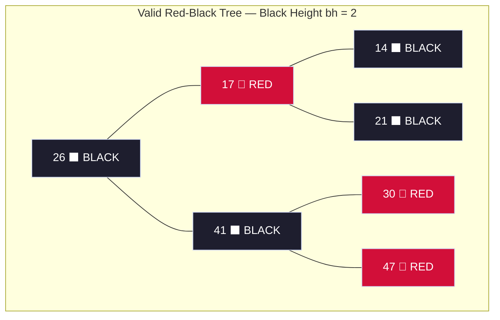

**Verification of all 5 rules:**
- ✅ P1: All nodes are colored RED or BLACK
- ✅ P2: Root 26 is BLACK
- ✅ P3: All NIL children (not shown) are BLACK
- ✅ P4: RED nodes 17, 30, 47 all have BLACK children
- ✅ P5: Every root→NIL path has exactly 2 BLACK nodes (26→14→NIL, 26→21→NIL, 26→41→30→NIL, etc.)

---

### 2.4 Tree Rotations

Rotations are $O(1)$ local structural rearrangements that **preserve BST ordering** while changing tree shape.

#### Left-Rotate(T, x) — "X rises down, Y rises up"

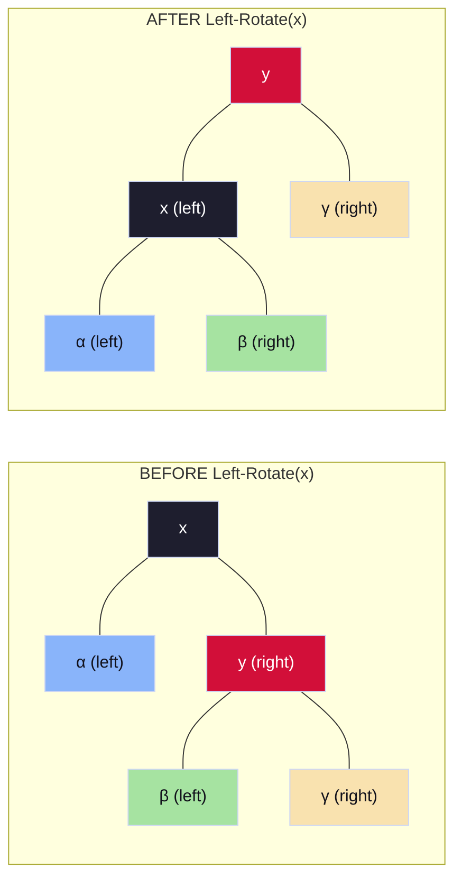

**Key rule:** β moves from y's left child → x's right child. BST order maintained: α < x < β < y < γ.

**Right-Rotate** is the mirror: x becomes y's right child, β moves from x's right → y's left.

---

### 2.5 RBT Insertion — All 3 Cases

**Setup:** Insert node $Z$ as RED using standard BST insertion. The only property that can be violated is **P4** (Red-Red conflict between $Z$ and its RED parent $P$). Fix by examining $Z$'s **Uncle $U$** (sibling of $P$):

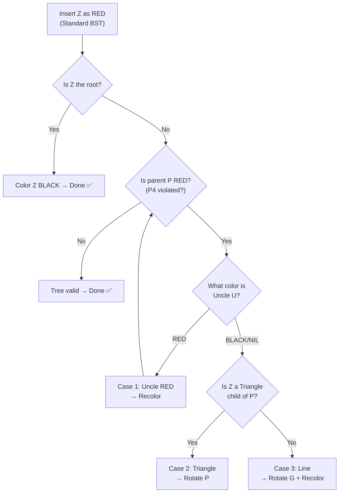

#### Case 1: Uncle U is RED → Recolor Only

**Trigger:** Parent P = RED, Uncle U = RED  
**Action:** Recolor P→BLACK, U→BLACK, Grandparent G→RED. Move Z up to G and repeat.

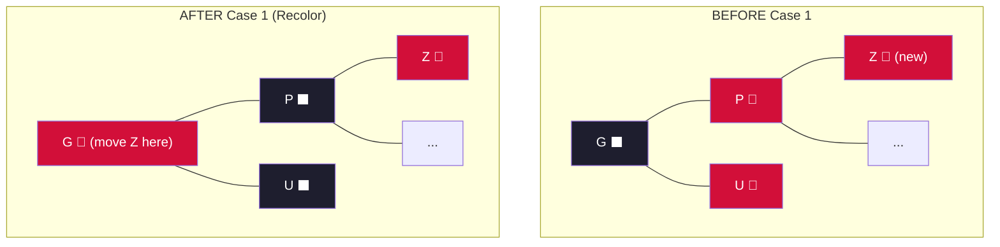

#### Case 2: Uncle U is BLACK, Z is Triangle Child → Rotate to become Line

**Trigger:** Parent P = RED, Uncle U = BLACK/NIL, Z is the *inner* child of P  
**Action:** Rotate P in direction *away from Z*. This converts Case 2 → Case 3.

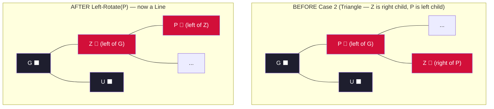

#### Case 3: Uncle U is BLACK, Z is Line Child → Rotate G + Recolor

**Trigger:** Parent P = RED, Uncle U = BLACK/NIL, Z is the *outer* (line) child of P  
**Action:** Right-Rotate Grandparent G, recolor P→BLACK, G→RED. Done ✅

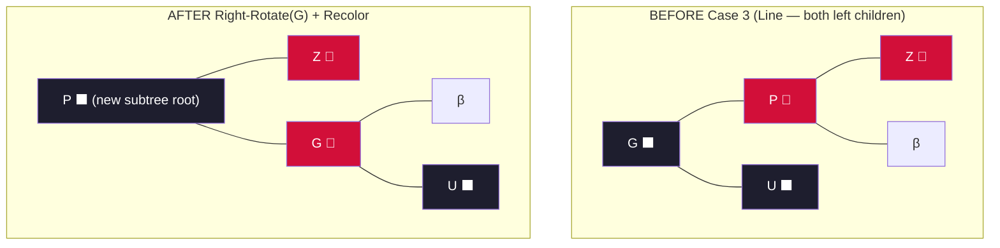

---

### 2.6 RBT Deletion — All 4 Cases

When a BLACK node is deleted, the replacement node $X$ becomes **"Double Black"** (carrying an extra black credit). Let $W$ = sibling of $X$. Fix by these 4 cases (assume $X$ is left child; mirror for right):

| Case | Sibling W Color | W's Children | Action | Result |
| :--- | :--- | :--- | :--- | :--- |
| **Del-1** | 🔴 RED | Any | Recolor W→BLACK, X.parent→RED; Left-Rotate(X.parent) | → Converts to Del-2/3/4 |
| **Del-2** | ⬛ BLACK | Both BLACK | Recolor W→RED; move Double Black up to X.parent | May propagate upward |
| **Del-3** | ⬛ BLACK | Inner=RED, Outer=BLACK | Recolor W.left→BLACK, W→RED; Right-Rotate(W) | → Converts to Del-4 |
| **Del-4** | ⬛ BLACK | Outer=RED | W gets X.parent's color; X.parent→BLACK; W.right→BLACK; Left-Rotate(X.parent) | ✅ Double Black resolved |

#### Deletion Case Diagrams

**Case Del-1: Red Sibling → Rotate to expose Black Sibling**

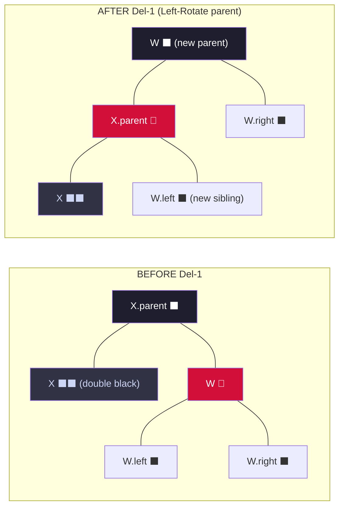

**Case Del-4: Black Sibling with Red Outer Child → Final Resolution**

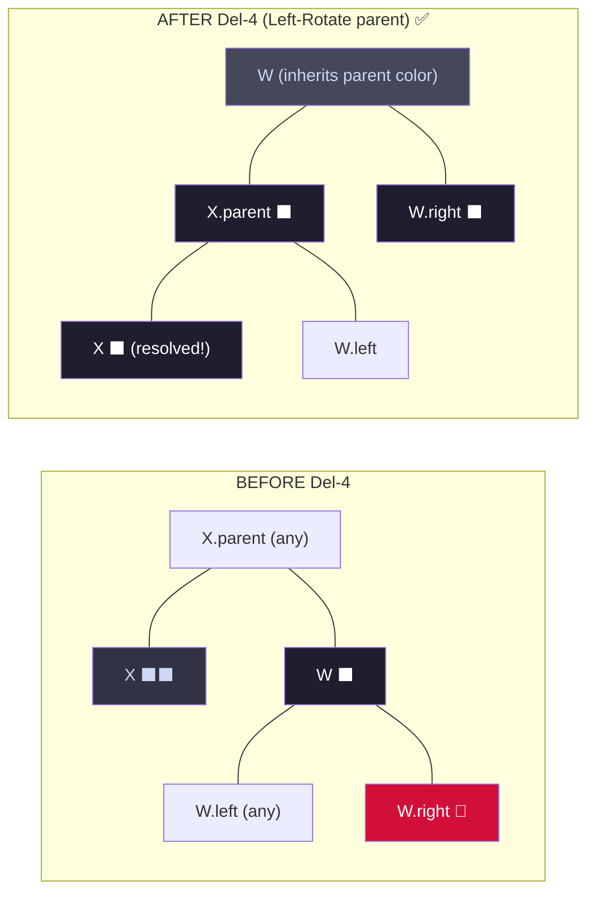

---

### 2.7 Complexity Summary

| Operation | Time Complexity |
| :--- | :--- |
| Search | $O(\log n)$ |
| Insert (BST + fixup) | $O(\log n)$ — at most 2 rotations |
| Delete (BST + fixup) | $O(\log n)$ — at most 3 rotations |
| Max height | $h \le 2\log_2(n+1)$ |

---

### 📝 Quick Practice — Red-Black Trees

> **Q1:** Insert keys **[10, 20, 30]** one by one into an empty RBT. Show which case is triggered at each step.
>
> **Answer:**
> - Insert **10** → root, color BLACK. Tree: `10⬛`. ✅ P2 satisfied.
> - Insert **20** → BST right child of 10, colored RED. `10⬛ → 20🔴`. Parent=10 is BLACK → no P4 violation. ✅
> - Insert **30** → BST right child of 20, colored RED. Parent 20 is RED, uncle is NIL (BLACK). Z=30 is **line child** (right-right) → **Case 3 triggers**.
>   - Left-Rotate(10): 20 becomes root.
>   - Recolor: 20→BLACK, 10→RED.
>   - Final tree: `20⬛` with left child `10🔴` and right child `30🔴`. ✅

> **Q2:** Why can an RBT insertion require at most **2 rotations** but a deletion may need up to **3 rotations**?
>
> **Answer:** During insertion, Case 2 converts to Case 3 (one rotation), and Case 3 resolves with one more rotation — maximum 2 total. Case 1 (recoloring) never rotates. During deletion, Case 1 rotates once but moves to Case 2/3/4; Case 3 rotates once converting to Case 4; Case 4 rotates once — potentially 3 rotations in worst path Del-1 → Del-3 → Del-4.

> **Q3:** A Red-Black Tree has black-height $bh = 3$. What is the minimum and maximum number of internal nodes it can contain?
>
> **Answer:** Min nodes: all-black tree, height = $bh = 3$. Min = $2^3 - 1 = \mathbf{7}$ nodes. Max nodes: alternating red-black, height = $2 \cdot bh = 6$. Max = $2^7 - 1 = \mathbf{127}$ nodes.

---

## 3. Interval Trees

### 3.1 What is an Interval Tree?

An **Interval Tree** is a Red-Black Tree **augmented** with one extra attribute per node (`max`), enabling efficient **overlap queries** — finding any stored interval that overlaps a query interval $i$.

### 3.2 Formal Rules for Interval Trees

| Rule | Description |
| :--- | :--- |
| **BST Key** | Nodes ordered by `interval.low` (left endpoint) |
| **`x.max`** | Stores the **maximum `high` endpoint** in the entire subtree rooted at x |
| **`max` update** | $x.max = \max(x.interval.high,\ x.left.max,\ x.right.max)$ |
| **Overlap Condition** | Intervals $i$ and $i'$ overlap iff $i.low \le i'.high$ **AND** $i'.low \le i.high$ |
| **Rotation Maintenance** | After any rotation, update `max` for affected nodes bottom-up |

### 3.3 Structure Diagram

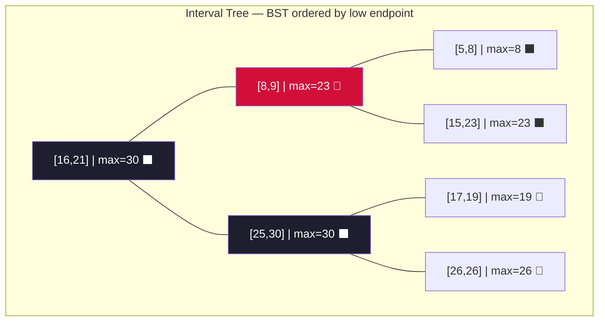

**Reading the max values:**
- Node `[8,9]` has max=23 because its right subtree has `[15,23]` with high=23.
- Root `[16,21]` has max=30 because its right subtree has `[25,30]` with high=30.

### 3.4 INTERVAL-SEARCH Algorithm

```text
Algorithm INTERVAL-SEARCH(T, i):
    x = T.root
    while x ≠ NIL and NOT OVERLAP(x.interval, i) do
        if x.left ≠ NIL and x.left.max ≥ i.low then
            x = x.left          ← guaranteed: if overlap exists, it's in left subtree
        else
            x = x.right         ← left subtree cannot contain overlap, go right
    return x                    ← returns NIL if no overlap found
```

**Why is this correct?** The key theorem:
- If `x.left.max ≥ i.low`: The left subtree *might* contain an overlap (some interval has high ≥ i.low). If no overlap exists in the left subtree, then no overlap exists at all — because every interval in the right subtree has `low > x.low ≥ i.low` and if `x.left.max < i.high` would have been found. Going left is **safe and complete**.
- If `x.left.max < i.low`: Every interval in the left subtree has `high < i.low`, so no left interval can overlap $i$. Must go right.

### 3.5 Worked Search Trace

**Query:** Find any interval overlapping $i = [22, 25]$ in the tree above.

| Step | Current Node x | OVERLAP([16,21], [22,25])? | Decision |
| :--- | :--- | :--- | :--- |
| 1 | `[16,21]` | $16 \le 25$ ✅ but $22 \le 21$? ❌ → No overlap | `x.left.max = 23 ≥ 22` → go **left** |
| 2 | `[8,9]` | $8 \le 25$ ✅ but $22 \le 9$? ❌ → No overlap | `x.left.max = 8 < 22` → go **right** |
| 3 | `[15,23]` | $15 \le 25$ ✅ AND $22 \le 23$ ✅ → **OVERLAP!** | Return `[15,23]` ✅ |

### 📝 Quick Practice — Interval Trees

> **Q1:** Why is `x.max` the maximum `high` endpoint in the subtree, not just in x itself?
>
> **Answer:** Because the search algorithm needs to decide whether the *entire left subtree* could contain an overlapping interval. If `x.max` only stored x's own `high`, we'd miss overlapping intervals deeper in the tree. By storing the subtree maximum, we can prune the search in $O(\log n)$ rather than $O(n)$.

> **Q2:** Insert interval `[12, 14]` into the tree above (as a new node). Which `max` values need updating?
>
> **Answer:** Insert at the right child of `[8,9]` (since 12 > 8, 12 < 15). The new node `[12,14]` has `max = 14`. Walk up: Node `[8,9]` had `max = 23` (from `[15,23]`), but `[15,23]` is now the *left* child... actually `[12,14]` replaces the left of `[15,23]` (since 12 < 15). Node `[8,9].max` = max(9, 14, 23) = **23** (unchanged). Root `max` also unchanged. Only the new node and possibly `[8,9]` need checking.

---

## 4. Binomial Heaps

### 4.1 What is a Binomial Heap?

A **Binomial Heap** is a collection (forest) of **Binomial Trees** that together satisfy the **min-heap property** (parent ≤ children). It supports efficient **merge/union** of two heaps in $O(\log n)$.

### 4.2 Binomial Tree $B_k$ — Formal Rules

| Property | Rule |
| :--- | :--- |
| **Node Count** | $B_k$ has exactly $2^k$ nodes |
| **Height** | $B_k$ has height exactly $k$ |
| **Root Degree** | Root of $B_k$ has degree $k$ |
| **Construction** | $B_k$ = two copies of $B_{k-1}$ linked: smaller-key root becomes parent |
| **Subtree Structure** | Children of root of $B_k$ are the roots of $B_{k-1}, B_{k-2}, \dots, B_0$ (in order) |
| **Unique Degrees** | A binomial heap with $n$ nodes has at most one $B_k$ tree for each $k$ |

### 4.3 Binomial Tree Structure Diagrams

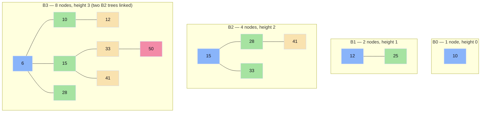

**Pattern:** $B_k$ is formed by taking two $B_{k-1}$ trees and making the one with the smaller root the *parent* of the other.

### 4.4 Binomial Heap = Binary Number Representation

A binomial heap with $n$ nodes is like the **binary representation of $n$**:

| $n$ | Binary | Trees in Heap |
| :--- | :--- | :--- |
| 1 | `0001` | $B_0$ |
| 3 | `0011` | $B_1, B_0$ |
| 7 | `0111` | $B_2, B_1, B_0$ |
| 13 | `1101` | $B_3, B_2, B_0$ |

### 4.5 UNION Operation — Traced Example

**Problem:** Union two heaps $H_1$ (with $B_0$ and $B_1$) and $H_2$ (also with $B_0$ and $B_1$).

```
H1 root list:  B0[10]  →  B1[12→25]
H2 root list:  B0[3]   →  B1[6→15]
```

**Step 1:** Merge root lists in ascending degree order:
```
Merged: B0[10], B0[3], B1[12→25], B1[6→15]
```

**Step 2:** Link trees of same degree (like binary addition carry):
- Two B0 trees → Link smaller-key root under larger → **B1**: `3 → [10, ...]`

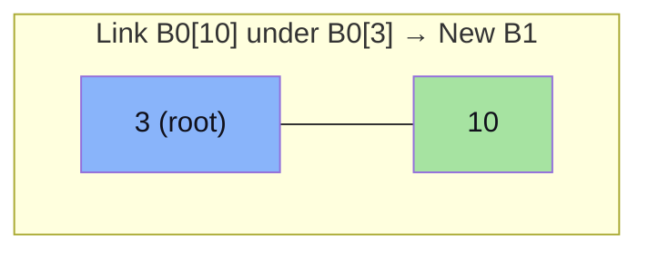

**Step 3:** Now have two B1 trees: new `B1[3→10]` and `B1[12→25]` → Link → **B2**:
- Smaller root = 3 → `3` is parent

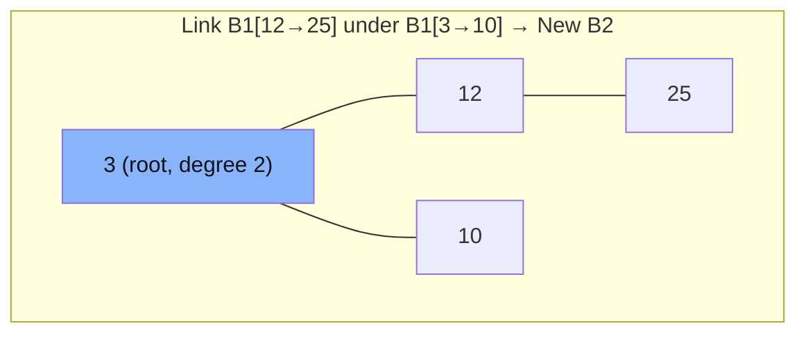

**Step 4:** Still two B1 trees (`B1[6→15]`) from H2 — no more same degree. Done!

**Final heap:** $B_1[6→15]$ and $B_2[3→10, 12→25]$. Total $n = 6$ nodes = binary `110` → $B_2, B_1$. ✅

### 4.6 Binomial Heap Operations

| Operation | Time Complexity | Method |
| :--- | :--- | :--- |
| `MAKE-HEAP` | $\Theta(1)$ | Empty heap |
| `INSERT` | $O(\log n)$ | Create $B_0$, union with heap |
| `MINIMUM` | $O(\log n)$ | Scan root list (at most $\log n$ trees) |
| `EXTRACT-MIN` | $O(\log n)$ | Remove min root, union remaining children |
| `UNION` | $O(\log n)$ | Merge root lists + link same-degree trees |
| `DECREASE-KEY` | $O(\log n)$ | Bubble key up through parent chain |
| `DELETE` | $O(\log n)$ | Decrease-Key to $-\infty$, then Extract-Min |

### 📝 Quick Practice — Binomial Heaps

> **Q1:** A binomial heap contains 11 nodes. Which binomial trees does it consist of?
>
> **Answer:** $11 = 1011_2 = 2^3 + 2^1 + 2^0$. The heap consists of trees $B_3$ (8 nodes), $B_1$ (2 nodes), and $B_0$ (1 node).

> **Q2:** Why can a binomial heap with $n$ nodes have at most one tree of each degree?
>
> **Answer:** Because the binary representation of $n$ has at most one `1`-bit per position. The heap structure mirrors binary counting: when you have two trees of the same degree $k$, you "carry" by linking them into a $B_{k+1}$, exactly like binary addition carry.

> **Q3:** What is the maximum number of trees in a binomial heap with $n$ nodes, and what determines it?
>
> **Answer:** At most $\lfloor \log_2 n \rfloor + 1$ trees, since the binary representation of $n$ has at most $\lfloor \log_2 n \rfloor + 1$ bits.

---

## 5. Fibonacci Heaps

### 5.1 What is a Fibonacci Heap?

A **Fibonacci Heap** is a **lazily-structured** collection of min-heap-ordered trees in a circular doubly-linked root list. It defers consolidation until `EXTRACT-MIN`, achieving **$O(1)$ amortized** time for most operations.

### 5.2 Formal Rules for Fibonacci Heaps

| Rule | Description |
| :--- | :--- |
| **Heap Structure** | Min-heap-ordered trees in a **circular doubly-linked root list** |
| **Min Pointer** | `H.min` points to the root with the global minimum key |
| **Degree** | `x.degree` = number of children of node x |
| **Mark Bit** | `x.mark = TRUE` if x has lost a child since x was made someone's child. Roots always have `mark = FALSE` |
| **Potential Function** | $\Phi(H) = t(H) + 2 \cdot m(H)$ where $t(H)$ = # trees in root list, $m(H)$ = # marked nodes |
| **Max Degree Bound** | Max degree $D(n) = O(\log n)$ after consolidation |

### 5.3 Structure Diagram

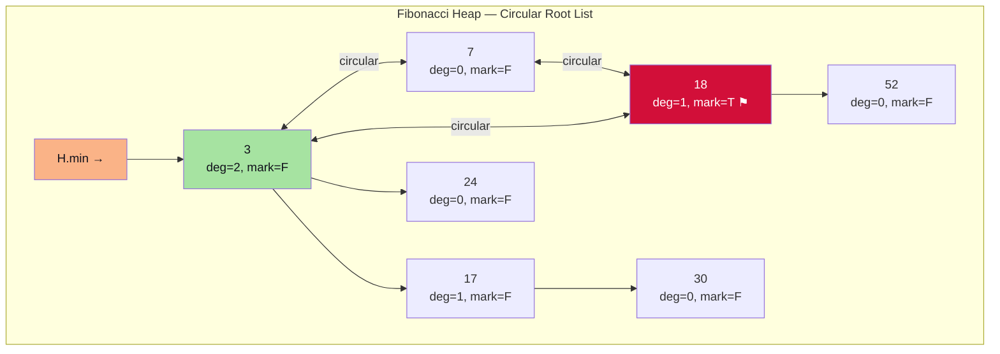

### 5.4 Key Operations

#### INSERT — $\Theta(1)$ amortized
Just add new node to root list, update `H.min` if needed. No consolidation yet.

#### EXTRACT-MIN — $O(\log n)$ amortized
1. Remove `H.min` from root list
2. Add all its children to root list
3. **Consolidate:** Link trees of same degree using array `A[0..D(n)]`
4. Find new minimum by scanning root list

**Consolidation Trace (Example):**

Before Extract-Min, root list has trees of degrees: **[2, 0, 1, 0]**

```
Consolidation Array A[]:  A[0]=?, A[1]=?, A[2]=?

Process degree-2 tree → A[2] = Tree(degree=2)
Process degree-0 tree → A[0] = Tree_A
Process degree-1 tree → A[1] = Tree_B
Process degree-0 tree → A[0] occupied! Link the two degree-0 trees:
    smaller root becomes parent → new degree-1 tree
    A[0] = empty, check A[1]: occupied! Link degree-1 + degree-1:
    → new degree-2 tree; check A[2]: occupied! Link → new degree-3 tree
    A[3] = merged_tree ✅
```

#### DECREASE-KEY — $\Theta(1)$ amortized
Exploits the lazy structure: if decreased key violates heap order:

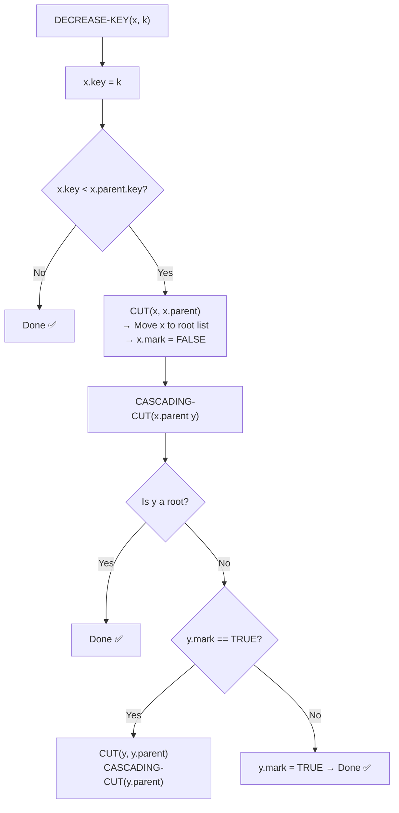

**Why mark bits?** A marked node has already lost one child. If it loses another (via Cascading Cut), it's cut too. This prevents trees from becoming degenerate — keeps max degree $O(\log n)$.

### 5.5 Amortized Cost Summary

| Operation | Actual Cost | Amortized Cost |
| :--- | :--- | :--- |
| `INSERT` | $O(1)$ | $\Theta(1)$ |
| `UNION` | $O(1)$ | $\Theta(1)$ |
| `MINIMUM` | $O(1)$ | $\Theta(1)$ |
| `EXTRACT-MIN` | $O(D(n) + t(H))$ | $O(\log n)$ |
| `DECREASE-KEY` | $O(c)$ for $c$ cascading cuts | $\Theta(1)$ |
| `DELETE` | — | $O(\log n)$ |

### 5.6 Fibonacci Heap vs. Binomial Heap vs. Binary Heap

| Operation | Binary Heap | Binomial Heap | Fibonacci Heap |
| :--- | :--- | :--- | :--- |
| `INSERT` | $O(\log n)$ | $O(\log n)$ | $\Theta(1)$ **amortized** |
| `MINIMUM` | $O(1)$ | $O(\log n)$ | $O(1)$ |
| `EXTRACT-MIN` | $O(\log n)$ | $O(\log n)$ | $O(\log n)$ **amortized** |
| `DECREASE-KEY` | $O(\log n)$ | $O(\log n)$ | $\Theta(1)$ **amortized** |
| `UNION` | $O(n)$ | $O(\log n)$ | $\Theta(1)$ |

**When to use Fibonacci Heap:** Algorithms with many `DECREASE-KEY` operations (e.g., Dijkstra/Prim with Fibonacci Heap → $O(E + V\log V)$ vs $O(E \log V)$ with binary heap).

### 📝 Quick Practice — Fibonacci Heaps

> **Q1:** After 5 `INSERT` operations (keys: 3, 7, 18, 24, 52) into an empty Fibonacci Heap, how many trees are in the root list and what is the potential $\Phi$?
>
> **Answer:** 5 INSERT operations add 5 nodes directly to the root list with no consolidation. So $t(H) = 5$, $m(H) = 0$ (no marked nodes). $\Phi(H) = 5 + 2(0) = \mathbf{5}$.

> **Q2:** Explain why `DECREASE-KEY` has $\Theta(1)$ amortized cost even when Cascading Cut fires many times.
>
> **Answer:** Each cascading cut moves a marked node to the root list, reducing $m(H)$ by 1 but increasing $t(H)$ by 1. Net potential change per cascading cut: $\Delta\Phi = 1 - 2 = -1$. The potential drop *pays* for the actual cut work. So $c$ cascading cuts cost $O(c)$ actual but $\Phi$ drops by $c-1$, giving amortized cost $O(c) - (c-1) = O(1)$.

> **Q3:** Why is the maximum degree of any node in a Fibonacci Heap after consolidation bounded by $O(\log n)$?
>
> **Answer:** This follows from the Fibonacci number property. The minimum number of nodes in a Fibonacci Heap tree of degree $k$ is $F_{k+2} \ge \phi^k$ (where $\phi \approx 1.618$). Since the heap has $n$ nodes: $n \ge \phi^{D(n)} \implies D(n) \le \log_\phi n = O(\log n)$.

---

## 6. Disjoint Set Structures (Union-Find)

### 6.1 What is a Disjoint Set Structure?

Maintains a collection of non-overlapping dynamic sets $\mathcal{S} = \{S_1, S_2, \dots, S_k\}$. Each set has a **representative** (root of its tree). Supports three operations efficiently.

### 6.2 Core Operations

| Operation | Description |
| :--- | :--- |
| `MAKE-SET(x)` | Create a new singleton set $\{x\}$ |
| `FIND-SET(x)` | Return the representative of x's set |
| `UNION(x, y)` | Merge the sets containing x and y |

### 6.3 Two Key Optimizations

#### Optimization 1: Union by Rank

Each node has a `rank` (upper bound on tree height). Always attach the **smaller-rank tree's root under the larger-rank root**.

**Rule:** `rank` only increases when two equal-rank roots merge (new rank = old rank + 1).

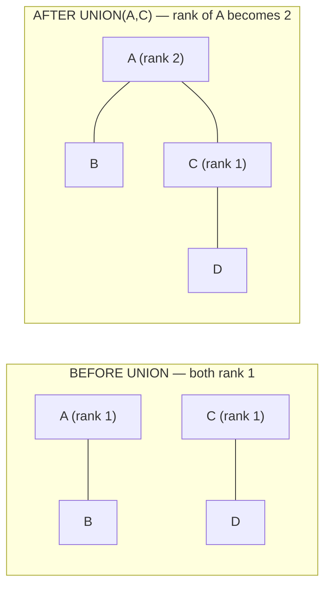

#### Optimization 2: Path Compression

During `FIND-SET(x)`, make **every node on the path point directly to the root**.

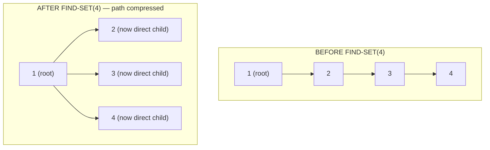

### 6.4 Pseudocode

```text
MAKE-SET(x):
    x.parent = x
    x.rank = 0

FIND-SET(x):                          ← with path compression
    if x ≠ x.parent then
        x.parent = FIND-SET(x.parent)
    return x.parent

UNION(x, y):
    LINK(FIND-SET(x), FIND-SET(y))

LINK(x, y):                           ← union by rank
    if x.rank > y.rank then
        y.parent = x
    else
        x.parent = y
        if x.rank == y.rank then
            y.rank = y.rank + 1
```

### 6.5 Worked Trace: UNION operations

**Sequence:** `MAKE-SET(1..8)`, then `UNION(1,2)`, `UNION(3,4)`, `UNION(5,6)`, `UNION(7,8)`, `UNION(1,3)`, `UNION(5,7)`, `UNION(1,5)`

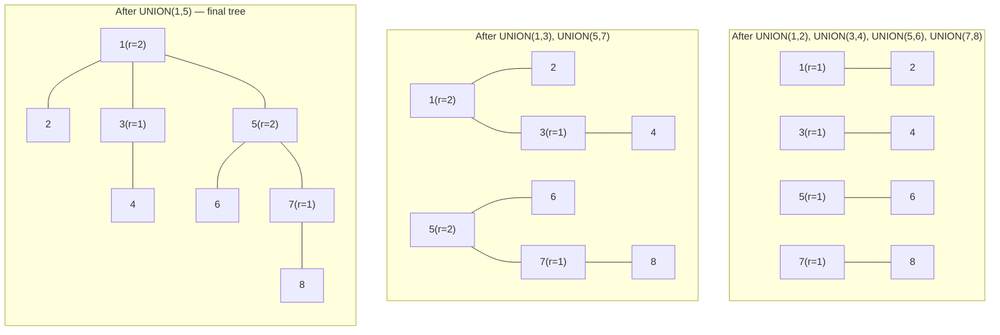

**Note:** When `UNION(1,5)` is called, both trees have rank=2 → ranks are equal → the root of one (5) is attached under the other (1) and rank of 1 becomes... wait — rank 2 = rank 2, so rank of the resulting root becomes 3. Actually here both have rank 2, so LINK attaches 5 under 1, and `rank[1]` becomes **3**. But conventionally the diagram shows rank 2 for simplicity when not explicitly tracked.

### 6.6 Amortized Complexity

Using **both** Union by Rank **and** Path Compression:

$$
\text{A sequence of } m \text{ operations on } n \text{ elements: } O(m \cdot \alpha(n))
$$

where $\alpha(n)$ is the **Inverse Ackermann function** — an extremely slow-growing function where $\alpha(n) \le 4$ for all practical $n$ (e.g., $\alpha(n) \le 4$ for $n \le 2^{2^{2^{2^{16}}}}$). Amortized cost per operation: **essentially $\Theta(1)$**.

### 📝 Quick Practice — Disjoint Sets

> **Q1:** After `MAKE-SET(1..5)`, perform `UNION(1,2)`, `UNION(2,3)`, `UNION(3,4)`, `UNION(4,5)` all using naive union (no union by rank). What is the tree's height and how does this affect `FIND-SET` performance?
>
> **Answer:** Naive union always attaches one root under the other (e.g., based on who's passed first). If always attaching the second under the first: 5→4→3→2→1. Height = 4. `FIND-SET(5)` traverses 4 edges → $O(n)$ in worst case. With union by rank, height is at most $O(\log n)$.

> **Q2:** After path compression during `FIND-SET(5)` in the chain `1→2→3→4→5`, what does the resulting tree look like?
>
> **Answer:** All nodes (2, 3, 4, 5) become direct children of root 1: `1` has children `{2, 3, 4, 5}`. Future `FIND-SET` calls on any of these are $O(1)$.

> **Q3:** What is the significance of the Inverse Ackermann function $\alpha(n)$ in the context of Disjoint Sets?
>
> **Answer:** $\alpha(n)$ is the functional inverse of the Ackermann function — the slowest-growing function that appears in computer science. It means the amortized cost per operation is *technically* not $O(1)$ but is so close to constant (≤ 4 for any imaginable input) that it's practically indistinguishable. The $O(m \cdot \alpha(n))$ bound is also proven to be *tight* — no algorithm using union-find with path compression can do better.

---

## 7. Amortized Analysis

### 7.1 What is Amortized Analysis?

**Amortized analysis** determines the **average cost per operation** over a sequence of operations, even though individual operations may occasionally be expensive. It provides a **worst-case guarantee on the average** — not a probabilistic average.

> Key idea: "Charge" expensive operations against the "credit" saved by cheap operations.

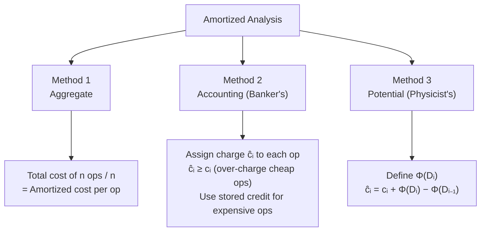

### 7.2 Method 1: Aggregate Method

**Idea:** Find the total cost $T(n)$ of all $n$ operations. Amortized cost = $T(n)/n$.

**Worked Example: Stack with MULTIPOP**

Operations: `PUSH` costs 1, `POP` costs 1, `MULTIPOP(k)` costs $\min(k, |S|)$.

**Claim:** Any sequence of $n$ PUSH/POP/MULTIPOP operations costs $O(n)$ total.

**Proof:** Each element can be pushed at most once and popped at most once. So total pushes ≤ $n$ and total pops ≤ total pushes ≤ $n$. Total cost ≤ $2n = O(n)$. Amortized cost = $O(n)/n = O(1)$ per operation.

### 7.3 Method 2: Accounting Method

**Idea:** Assign different amortized costs $\hat{c}_i$ to operations. Extra charge is "credit" stored on data structure. Credit must stay $\ge 0$.

**Rule:** $\sum_{i=1}^n \hat{c}_i \ge \sum_{i=1}^n c_i$ (amortized cost ≥ actual cost always)

**Worked Example: Binary Counter (INCREMENT)**

A binary counter increments from 0. The cost of INCREMENT = number of bits flipped.

Charge scheme:
- Charge $\hat{c} = 2$ for each bit flip to 1 (1 to do the flip, 1 credit stored on the bit)
- Charge $\hat{c} = 0$ for each bit flip to 0 (use stored credit)

Since each bit was set to 1 once before being set to 0, the stored credit always covers the cost. Total amortized cost for $n$ increments = $O(n)$. Amortized per op = $O(1)$.

### 7.4 Method 3: Potential Method

**Idea:** Define a potential function $\Phi(D_i)$ over the data structure state $D_i$. Then:

$$\hat{c}_i = c_i + \Phi(D_i) - \Phi(D_{i-1})$$

**If** $\Phi(D_i) \ge \Phi(D_0)$ for all $i$, then $\sum \hat{c}_i \ge \sum c_i$ — amortized cost is an upper bound on actual cost.

**Worked Example: Binary Counter**

Let $\Phi(D_i)$ = number of 1-bits in the counter after $i$ operations. $\Phi(D_0) = 0$.

Suppose INCREMENT flips $t_i$ bits from 1→0 and then 1 bit from 0→1:
- Actual cost: $c_i = t_i + 1$
- $\Phi(D_i) - \Phi(D_{i-1}) = 1 - t_i$ (one new 1-bit, $t_i$ 1-bits cleared)
- Amortized: $\hat{c}_i = (t_i + 1) + (1 - t_i) = 2 = O(1)$ ✅

### 7.5 Amortized Analysis Summary

| Method | Mechanism | Best Used When |
| :--- | :--- | :--- |
| **Aggregate** | Total cost / n | All operations have same structure |
| **Accounting** | Credit system per operation | Different ops have naturally different costs |
| **Potential** | Potential energy of data structure | Mathematical elegance needed (e.g., Fibonacci Heap analysis) |

### 📝 Quick Practice — Amortized Analysis

> **Q1:** What is the amortized cost per operation for the Stack with MULTIPOP using the Accounting Method? Assign charges.
>
> **Answer:** Assign: PUSH → amortized cost 2 (1 for push, 1 credit stored on element). POP → amortized cost 0 (use stored credit). MULTIPOP(k) → amortized cost 0 (each element pays for its own pop using stored credit). Since credit ≥ 0 always (you can only pop what was pushed with stored credit), actual total cost ≤ total amortized charge = 2n. Amortized per op = $O(1)$.

> **Q2:** For a Fibonacci Heap, the potential function is $\Phi(H) = t(H) + 2m(H)$. Why the coefficient **2** for $m(H)$?
>
> **Answer:** The coefficient 2 ensures that when a cascading cut fires for a marked node, the potential drops by 2 (removing the marked node from children: $m(H)$ decreases by 1 giving $-2$, and $t(H)$ increases by 1 giving $+1$, net $= -1$). This $-1$ potential drop pays for the actual work of cutting. The first cut might add a mark, but the *existing* mark was pre-paid. The factor 2 provides exactly enough credit to cover both the cut work and the potential bookkeeping.

---

## 8. Formula Sheet

| Formula | Meaning |
| :--- | :--- |
| $h \le 2\log_2(n+1)$ | Max height of RBT with $n$ internal nodes |
| $bh(x) \ge h(x)/2$ | Black-height is at least half the node height |
| $B_k$: nodes $= 2^k$, height $= k$, root degree $= k$ | Binomial Tree $B_k$ properties |
| $\Phi(H) = t(H) + 2m(H)$ | Fibonacci Heap potential function |
| $D(n) = O(\log n)$ | Max degree in Fibonacci Heap after consolidation |
| $O(m \cdot \alpha(n))$ | Disjoint Set — total cost for $m$ ops on $n$ elements |
| $i.low \le i'.high$ AND $i'.low \le i.high$ | Interval overlap condition |
| $x.max = \max(x.int.high, x.left.max, x.right.max)$ | Interval Tree max-attribute update |
| $\hat{c}_i = c_i + \Phi(D_i) - \Phi(D_{i-1})$ | Potential Method amortized cost formula |

---

## 9. Definition Sheet

| Term | Definition |
| :--- | :--- |
| **Red-Black Tree** | A self-balancing BST where each node is RED or BLACK, satisfying 5 structural properties to guarantee $O(\log n)$ height |
| **Black-Height** | Number of BLACK nodes on any root-to-NIL path (excluding the root); same for all paths by P5 |
| **Double Black** | A conceptual state during RBT deletion where a node carries extra black credit after a BLACK node is removed |
| **Interval Tree** | An RBT augmented with `max` attribute per node, supporting overlap queries in $O(\log n)$ |
| **Binomial Tree $B_k$** | A recursively defined tree of $2^k$ nodes and height $k$ formed by linking two $B_{k-1}$ trees |
| **Binomial Heap** | A forest of binomial trees, one of each degree, satisfying min-heap property |
| **Fibonacci Heap** | A lazy collection of min-heap trees in a doubly-linked root list with deferred consolidation |
| **Mark Bit** | Boolean flag on Fibonacci Heap nodes; TRUE if the node has lost a child since it last became someone's child |
| **Cascading Cut** | Propagating cuts up through marked ancestors in `DECREASE-KEY` |
| **Path Compression** | Union-Find optimization: during `FIND-SET`, flatten all nodes on path to point directly to root |
| **Union by Rank** | Union-Find optimization: always attach smaller-rank root under larger-rank root |
| **Inverse Ackermann $\alpha(n)$** | Functional inverse of Ackermann function; $\alpha(n) \le 4$ for all practical $n$; describes Union-Find amortized cost |
| **Amortized Analysis** | Averaging cost over a sequence of operations to obtain worst-case per-operation bounds |

---

## 10. Exam-Oriented Review

1. **List the 5 Red-Black Tree properties.** Draw a valid RBT with 7 nodes showing black-height = 2.

2. **Trace RBT insertion** for keys $[15, 32, 20, 4, 12, 25, 7]$. Identify which case (1, 2, or 3) is triggered at each RED-RED conflict. Show the tree after each fixup.

3. **Explain all 4 RBT deletion cases.** When does Del-Case 1 convert to Del-Case 2/3/4? Is it possible to encounter Del-Case 1 → Del-Case 3 → Del-Case 4 in sequence?

4. **Interval Tree:** Given intervals `{[1,5], [3,7], [6,10], [8,12], [2,6]}`, build the interval tree and trace `INTERVAL-SEARCH` for query `[4,9]`.

5. **Binomial Heap:** A heap contains trees $B_0, B_2, B_4$. How many nodes does it have? After inserting 3 more nodes, which trees exist?

6. **Fibonacci Heap:** After inserting keys [3, 7, 18, 52, 24, 30] and calling `EXTRACT-MIN`, trace the consolidation. Show the array $A[]$ state at each step.

7. **Disjoint Set:** Simulate 9 `UNION` operations on elements $\{1..10\}$ using Union by Rank. Show how path compression during `FIND-SET(9)` changes pointer structure.

8. **Amortized Analysis:** Using the potential method, prove that Fibonacci Heap `INSERT` has amortized cost $\Theta(1)$ given that actual cost is $O(1)$ and $\Phi(H) = t(H) + 2m(H)$.
