# Chapter 4: Advanced Data Structures & Amortized Analysis

> **Course Code:** 3CS501CC24
> **Focus:** Red-Black Trees, Interval Trees, Binomial Heaps, Fibonacci Heaps, Disjoint Set Structures & Amortized Analysis

---

## 1. Chapter Overview

**Learning Flow per Structure:**
> **Rules → Tree Shape Laws → Step-by-Step Insertion Trace → Step-by-Step Deletion Trace → Merge/Query Trace → Q&A**

| Structure | Key Guarantee | Core Operations Traced |
| :--- | :--- | :--- |
| **Red-Black Tree** | $O(\log n)$ worst-case | 11-step INSERT trace + 4 DELETE case trace |
| **Interval Tree** | $O(\log n)$ overlap query | INTERVAL-SEARCH trace |
| **Binomial Heap** | $O(\log n)$ merge | 11-step INSERT trace + UNION + EXTRACT-MIN |
| **Fibonacci Heap** | $O(1)$ amortized insert/decrease-key | INSERT → EXTRACT-MIN → DECREASE-KEY |
| **Disjoint Set** | $O(\alpha(n))$ amortized | 10-step UNION + PATH-COMPRESSION trace |

---

## 2. Red-Black Trees (RBT)

### 2.1 The 5 Rules — Must All Hold Simultaneously

| # | Rule | What It Means |
| :--- | :--- | :--- |
| **R1** | Every node is RED or BLACK | Coloring is binary — no other states |
| **R2** | Root is always BLACK | Root is forced BLACK after any operation |
| **R3** | Every NIL leaf is BLACK | All missing children are virtual BLACK sentinels |
| **R4** | RED node's children must be BLACK | **No two consecutive reds allowed on any path** |
| **R5** | Every root→NIL path has the same number of BLACK nodes | The **black-height (bh)** is uniform |

> **Why these rules matter:** R4 + R5 together force: `height h ≤ 2·log₂(n+1)`. The worst tree alternates R-B-R-B… with height `2·bh`, giving the guaranteed `O(log n)` operations.

---

### 2.2 Tree Rotations (The Structural Primitive)

Rotations are **O(1)** pointer swaps that preserve BST order (in-order traversal unchanged).

```
LEFT-ROTATE around x:              RIGHT-ROTATE around y:

     x                  y               y                  x
    / \     →→→        / \             / \     →→→        / \
   α   y             x   γ           x   γ             α   y
      / \           / \             / \                   / \
     β   γ         α   β          α   β                 β   γ

Rule: β (y's left subtree) moves to become x's right child.
```

**Key BST-order proof:** α < x < β < y < γ — holds in both configurations ✅

---

### 2.3 Insertion Fix-Up — 3 Cases (All Triggered by Red-Red Conflict)

When we insert Z as RED and parent P is also RED (violating R4):

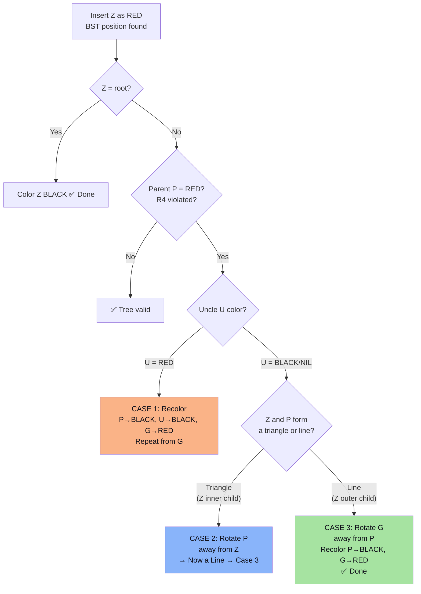

| Case | Trigger | Uncle U | Shape | Actions | Result |
| :--- | :--- | :--- | :--- | :--- | :--- |
| **1** | P = RED | **RED** | Any | P→BLK, U→BLK, G→RED; move Z up to G | Problem bubbles up |
| **2** | P = RED | **BLACK** | Triangle (inner) | Rotate P (away from Z) | Converts to Case 3 |
| **3** | P = RED | **BLACK** | Line (outer) | Rotate G (away from P); P→BLK, G→RED | ✅ Fixed locally |

> **Triangle vs Line?** If Z-P-G make a ZIG-ZAG (Z is left child of P, P is right child of G → or vice versa) → Triangle → Case 2. If Z-P-G are all on the SAME SIDE (Z right of P right of G) → Line → Case 3.

---

### 2.4 Complete 11-Step Insertion Trace

**Insert sequence:** `[7, 14, 18, 11, 10, 8, 22, 6, 1, 15, 17]`

**Legend:** `B` = BLACK, `R` = RED. Tree shown as `root → {left, right}`.

---

#### Step 1: Insert **7**

- Insert as root → immediately color **BLACK** (R2)
- **Case triggered:** Root case


| Node | Color | Parent | Position |
| :--- | :--- | :--- | :--- |
| 7 | ⬛ BLACK | — | Root |

---

#### Step 2: Insert **14**

- BST: 14 > 7 → right child of 7
- Color 14 RED. Parent 7 = BLACK → **no R4 violation** ✅

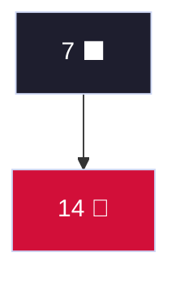

**Case triggered:** None — parent is BLACK

---

#### Step 3: Insert **18**

- BST: 18 > 7 → right; 18 > 14 → right child of 14
- Color 18 RED. Parent 14 = RED → **R4 violated!**
- Z = 18(R), P = 14(R), G = 7(B), U = left(7) = **NIL (BLACK)**
- Shape: Z(18) is RIGHT of P(14), P(14) is RIGHT of G(7) → **LINE** (right-right)
- **→ Case 3:** Left-Rotate(G=7); Recolor: 14→BLACK, 7→RED

```
BEFORE:              AFTER Left-Rotate(7) + Recolor:
    7(B)                   14(B)
      \                   /    \
      14(R)           7(R)    18(R)
        \
        18(R) ← new
```

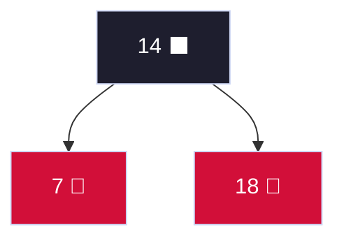

**Case triggered: Case 3** (Right-Right Line → Left-Rotate root, recolor)

---

#### Step 4: Insert **11**

- BST: 11 < 14 → left; 11 > 7 → right child of 7
- Color 11 RED. Parent 7 = RED → **R4 violated!**
- Z = 11(R), P = 7(R), G = 14(B), U = right(14) = **18 (RED)**
- **→ Case 1:** Recolor P=7→BLACK, U=18→BLACK, G=14→RED. Move Z to G=14.
- Z = 14(R) is ROOT → color ROOT **BLACK**

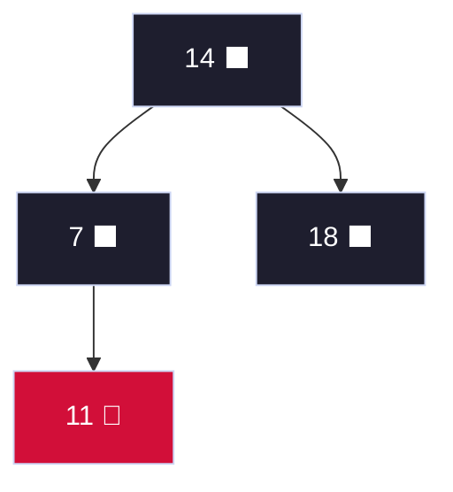

**Case triggered: Case 1** (Uncle RED → recolor; propagated to root)

---

#### Step 5: Insert **10**

- BST: 10 < 14 → left to 7(B); 10 > 7 → right to 11(R); 10 < 11 → **left child of 11**
- Color 10 RED. Parent 11 = RED → **R4 violated!**
- Z = 10(R), P = 11(R), G = 7(B), U = left(7) = **NIL (BLACK)**
- Shape: Z(10) is LEFT of P(11), P(11) is RIGHT of G(7) → **TRIANGLE** (left-right zig-zag)
- **→ Case 2:** Right-Rotate(P=11): 10 takes 11's place; 11 becomes right child of 10

```
After Case 2:    G=7(B), P=10(R), Z=11(R)   — now a LINE (right-right)
    7(B)
      \
      10(R)  ← 10 took 11's place
        \
        11(R) ← 11 is now right child of 10
```

- **→ Case 3 (falls through):** Left-Rotate(G=7); Recolor: 10→BLACK, 7→RED

```
After Case 3:
    14(B)
   /    \
 10(B)  18(B)
 /    \
7(R) 11(R)
```

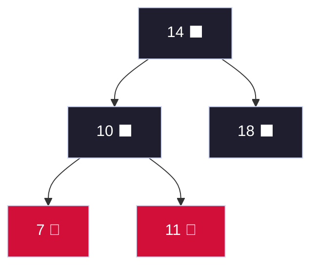

**Case triggered: Case 2 → Case 3** (Triangle → Right-Rotate P → Left-Rotate G + recolor)

---

#### Step 6: Insert **8**

- BST: 8 < 14→left to 10(B); 8 < 10→left to 7(R); 8 > 7 → **right child of 7**
- Color 8 RED. Parent 7 = RED → **R4 violated!**
- Z = 8(R), P = 7(R), G = 10(B), U = right(10) = **11 (RED)**
- **→ Case 1:** Recolor P=7→BLACK, U=11→BLACK, G=10→RED. Move Z to G=10.
- Z = 10(R), P = 14(B). Parent is BLACK → **no violation** ✅

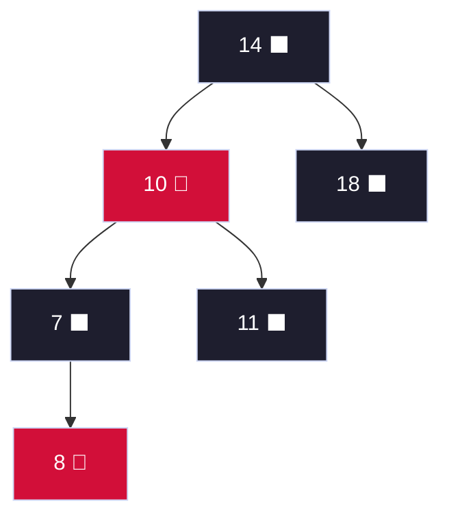

**Case triggered: Case 1** (Uncle RED → recolor; resolved immediately)

---

#### Step 7: Insert **22**

- BST: 22 > 14→right to 18(B); 22 > 18 → **right child of 18**
- Color 22 RED. Parent 18 = BLACK → **no violation** ✅

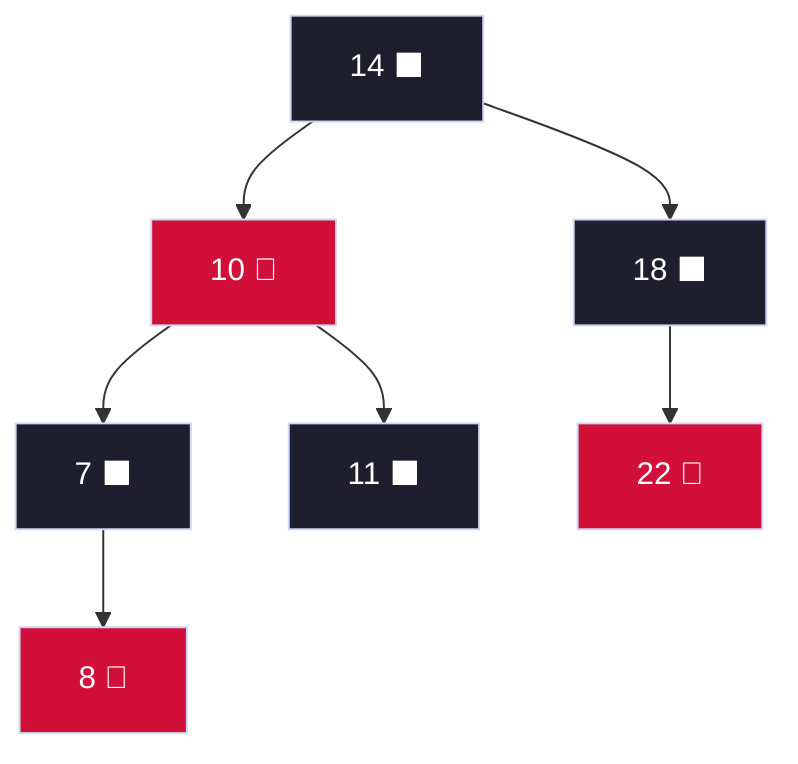

**Case triggered:** None — parent is BLACK

---

#### Step 8: Insert **6**

- BST: 6 < 14→left to 10(R); 6 < 10→left to 7(B); 6 < 7 → **left child of 7**
- Color 6 RED. Parent 7 = BLACK → **no violation** ✅

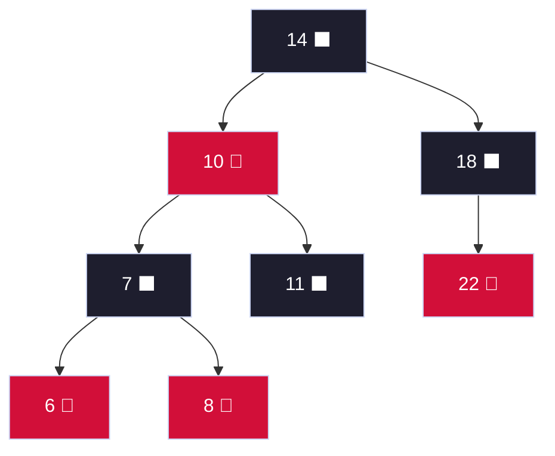

**Case triggered:** None — parent is BLACK

---

#### Step 9: Insert **1**

- BST: 1 < 14→left; 1 < 10→left; 1 < 7→left; 1 < 6 → **left child of 6**
- Color 1 RED. Parent 6 = RED → **R4 violated!**

**First violation: Z=1(R), P=6(R), G=7(B), U=right(7)=8(R)**
- → **Case 1:** Recolor 6→BLACK, 8→BLACK, 7→RED. Move Z up to G=7.

**Second violation: Z=7(R), P=10(R), G=14(B), U=right(14)=18(B) — uncle is BLACK**
- Shape: Z(7) is LEFT of P(10), P(10) is LEFT of G(14) → **LINE** (left-left)
- **→ Case 3:** Right-Rotate(G=14); Recolor: 10→BLACK, 14→RED

```
Before Case 3:           After Right-Rotate(14) + Recolor:
    14(B)                        10(B)   ← new root
   /    \                       /    \
 10(R)  18(B)               7(R)     14(R)
 /    \                    /   \     /    \
7(R)  11(B)              6(B) 8(B) 11(B) 18(B)
/    \                   /              \
6(B) 8(B)              1(R)            22(R)
/
1(R)  ← new
```

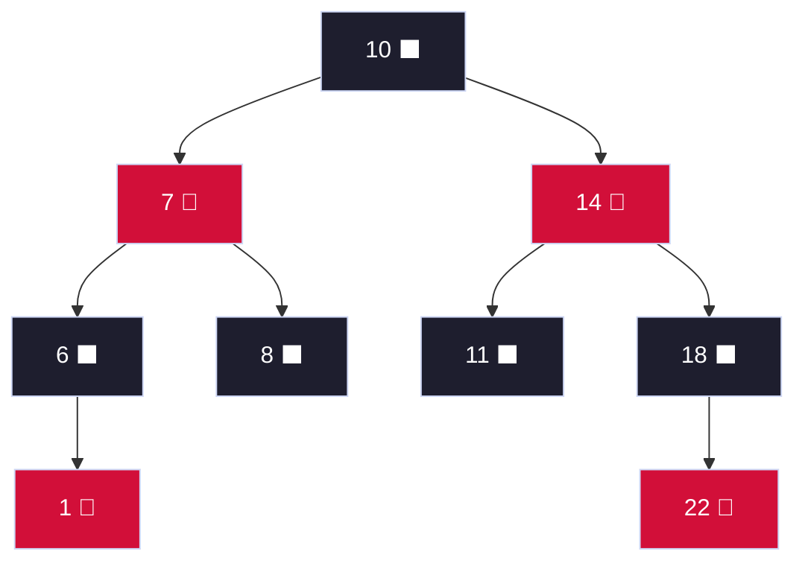

**Case triggered: Case 1 (twice) → Case 3** (Cascading recolor then Left-Right line rotation)

---

#### Step 10: Insert **15**

- BST: 15 > 10→right; 15 > 14→right; 15 < 18 → **left child of 18**
- Color 15 RED. Parent 18 = BLACK → **no violation** ✅

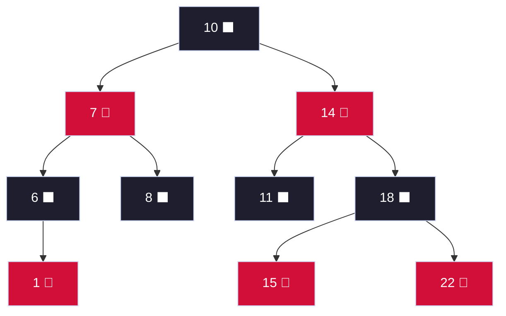

**Case triggered:** None — parent is BLACK

---

#### Step 11: Insert **17**

- BST: 17 > 10→right; 17 > 14→right; 17 < 18→left; 17 > 15 → **right child of 15**
- Color 17 RED. Parent 15 = RED → **R4 violated!**

**First violation: Z=17(R), P=15(R), G=18(B), U=right(18)=22(R)**
- → **Case 1:** Recolor 15→BLACK, 22→BLACK, 18→RED. Move Z up to G=18.

**Second violation: Z=18(R), P=14(R), G=10(B), U=left(10)=7(R) — uncle is RED!**
- → **Case 1 again:** Recolor 14→BLACK, 7→BLACK, 10→RED. Move Z up to G=10.

**Z=10(R) is ROOT → color ROOT BLACK** ✅

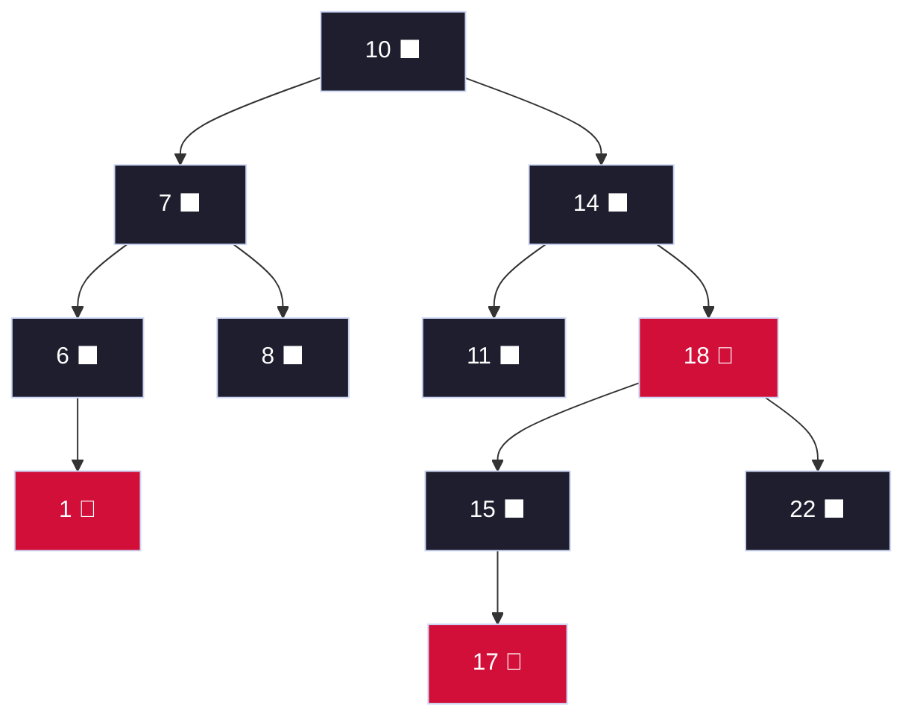

**Case triggered: Case 1 → Case 1 → Root fix** (Double cascading recolor)

---

#### Insertion Trace Summary

| Step | Key Inserted | Parent Color | Uncle Color | Case Triggered | Structural Action |
| :--- | :--- | :--- | :--- | :--- | :--- |
| 1 | **7** | — | — | Root → BLACK | Color root black |
| 2 | **14** | BLACK | — | None | Insert trivially |
| 3 | **18** | RED | BLACK (NIL) | **Case 3** | Left-Rotate(7), recolor |
| 4 | **11** | RED | RED (18) | **Case 1** | Recolor 7,18→BLK, 14→R; root→BLK |
| 5 | **10** | RED | BLACK (NIL) | **Case 2 → 3** | Right-Rotate(11), Left-Rotate(7) |
| 6 | **8** | RED | RED (11) | **Case 1** | Recolor 7,11→BLK, 10→R; stop |
| 7 | **22** | BLACK | — | None | Insert trivially |
| 8 | **6** | BLACK | — | None | Insert trivially |
| 9 | **1** | RED | RED (8) | **Case 1 → Case 3** | Recolor then Right-Rotate(14) |
| 10 | **15** | BLACK | — | None | Insert trivially |
| 11 | **17** | RED | RED (22) | **Case 1 → Case 1** | Double recolor cascade to root |

> **All 3 insertion cases demonstrated! ✅** Cases 1 (×4), 2 (×1), 3 (×2), trivial (×4)

---

### 2.5 RBT Deletion — All 4 Cases

**The Problem:** When a BLACK node is deleted, one root→NIL path loses a black node, violating R5. We assign the missing black credit as **"Double Black" (⊛)** to the replacement node X. Let W = sibling of X. We fix-up until the double-black is resolved.

**Setup — starting from the final tree above, delete nodes: [11, 18, 10]**

---

#### Delete **11** (BLACK leaf — straightforward)

11 is a BLACK leaf (no children). Replace with NIL. NIL now carries **Double Black**.

- X = NIL (left child of 14), W = sibling of X = **18(R)**
- W is RED → **Delete Case 1**

**Delete Case 1:** W is RED
- Action: Recolor W→BLACK, X.parent(14)→RED; Left-Rotate(X.parent=14)
- After: W changes to BLACK (now it's 15 or 22), continue with new W

```
Before Del-Case 1:        After Left-Rotate(14) + Recolor:
    10(B)                       10(B)
   /    \                      /    \
  7(B)  14(B)               7(B)   18(B)
        /  \                       /    \
       ⊛   18(R)              14(R)    22(B)
           /   \              /    \
          15(B) 22(B)       ⊛    15(B)
                               \
                               17(R)
```

Now X = NIL (left of 14), new sibling W = 15(B). W's children: right(15)=17(R), left(15)=NIL(B).
W is BLACK, outer child (right) 17 = RED → **Delete Case 4**

**Delete Case 4:** W is BLACK, W's outer child is RED
- Action: W(15) gets parent(14)'s color → RED; parent(14)→BLACK; W.right(17)→BLACK; Left-Rotate(parent=14)
- Double Black resolved ✅

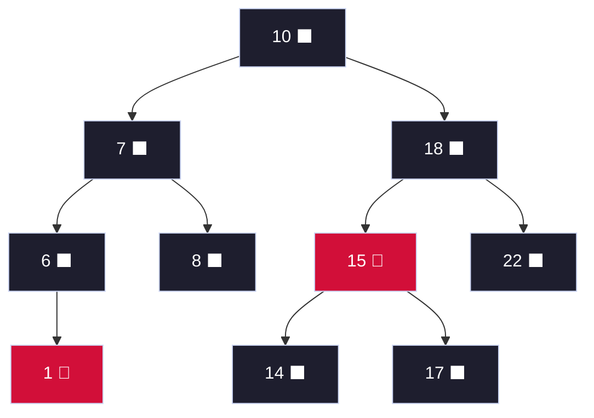

**Cases triggered: Del-Case 1 → Del-Case 4** ✅

---

#### Delete **18** (BLACK with two children) — Demonstrating Case 2 and Case 3

From the tree above, delete 18(B). 18 has children 15(R) and 22(B).
- Find in-order successor = **22** (smallest in right subtree = 22 itself, since 22 has no left child)
- Copy 22's key into 18's position; delete 22's original node.
- Deleting 22(B) — it has no children → NIL gets Double Black.

X = NIL (right of 15 after restructure), W = sibling = **14(B)**
W's children: left(14) = NIL(B), right(14) = NIL(B) — **both BLACK**
→ **Delete Case 2:**

**Delete Case 2:** W is BLACK, both W's children are BLACK
- Action: Recolor W(14)→RED; move Double Black up to X.parent(15)
- X.parent = 15(R) → can absorb the double black by going BLACK ✅

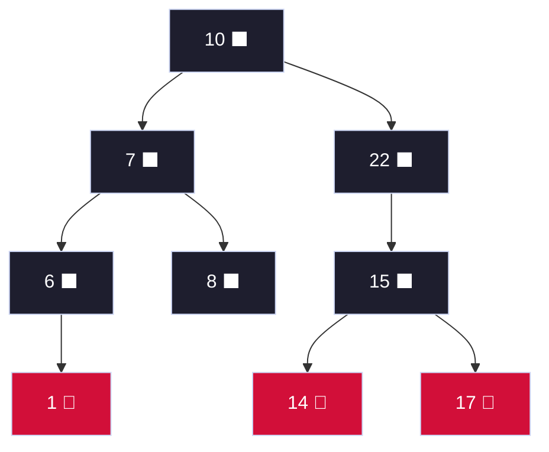

**Case triggered: Del-Case 2** (Black sibling, both children black → recolor W, propagate up)

---

#### Delete **10** (ROOT with two children) — Demonstrating Case 3

Delete 10 (root). In-order successor = **14** (leftmost of right subtree). But from current tree, right subtree root = 22. 22's leftmost = 15's leftmost = **14**. Copy 14 to root position, delete original 14 node.

Deleting 14(R) leaf → no fix-up needed (RED node deletion never creates double-black since removing a RED preserves black-height).

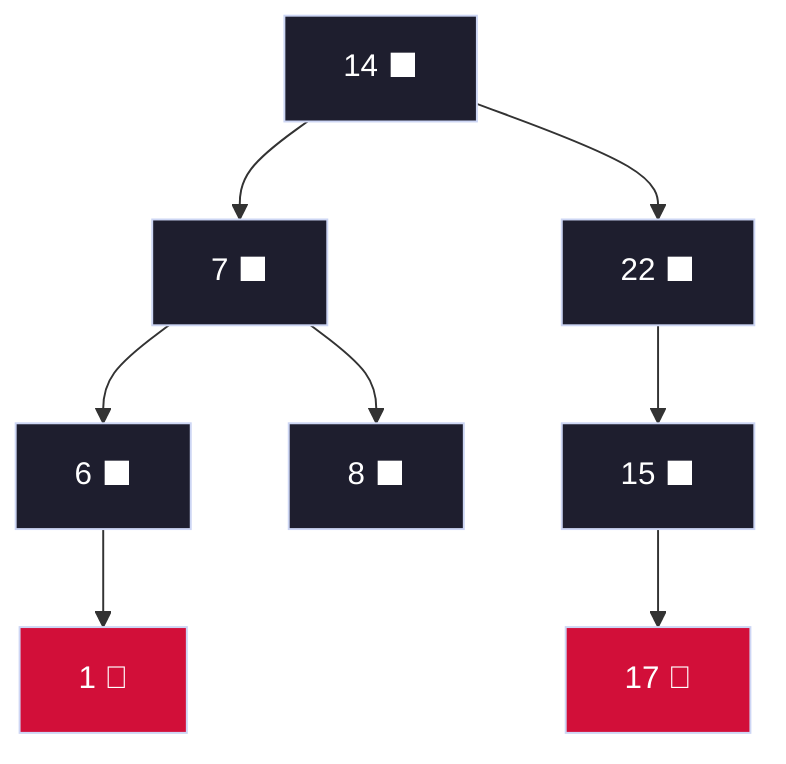

---

#### Deletion Summary — All 4 Cases

| Del-Case | Trigger | W Color | W's Children | Action | Outcome |
| :--- | :--- | :--- | :--- | :--- | :--- |
| **1** | X = Double-Black | **RED** | Any | Recolor W→BLK, Parent→RED; Rotate(Parent) | → Converts to Case 2, 3, or 4 |
| **2** | X = Double-Black | **BLACK** | Both BLACK | Recolor W→RED; move DB up to Parent | DB moves up (may terminate if parent was RED) |
| **3** | X = Double-Black | **BLACK** | Inner=RED, Outer=BLACK | Recolor W→RED, inner→BLK; Rotate(W) | → Converts to Case 4 |
| **4** | X = Double-Black | **BLACK** | Outer=RED | W gets Parent's color; Parent→BLK; outer→BLK; Rotate(Parent) | ✅ Double Black fully resolved |

> **Demonstrated above:** Del-Case 1 (delete 11), Del-Case 2 (delete 18), Del-Case 4 (during 11 fix-up). Del-Case 3 arises when W.right=BLK but W.left=RED — it rotates W to expose Case 4.

---

### 2.6 RBT Complexity

| Operation | Time | Rotations |
| :--- | :--- | :--- |
| Search | $O(\log n)$ | 0 |
| Insert | $O(\log n)$ | ≤ 2 rotations |
| Delete | $O(\log n)$ | ≤ 3 rotations |
| Height | $h \le 2\log_2(n+1)$ | — |

---

### 📝 Quick Practice — Red-Black Trees

> **Q1:** Insert keys [5, 3, 7, 2, 4, 6, 8, 1] into an empty RBT. After inserting all 8 keys, what is the root and what is the black-height?
>
> **Answer:** Trace:
> - 5(B) root. Insert 3(R) left. Insert 7(R) right. No violations — P2, P5: bh=1.
> - Insert 2: P=3(R), U=7(R) → **Case 1**: 3→B, 7→B, 5→R → root 5→B. Tree: 5B{3B{2R,_}, 7B}.
> - Insert 4: right of 3(B) → no violation. Tree: 5B{3B{2R,4R}, 7B}.
> - Insert 6: left of 7(B) → no violation.
> - Insert 8: right of 7(B) → no violation. Tree: 5B{3B{2R,4R}, 7B{6R,8R}}.
> - Insert 1: left of 2(R). P=2(R), U=4(R) → **Case 1**: 2→B, 4→B, 3→R. P=3(R), G=5(B), U=7(B) → **Case 3** (Left-Left Line): Right-Rotate(5); 3→B, 5→R.
> - **Root = 3, Black-Height = 2**

> **Q2:** When does inserting a new node into an RBT require O(log n) recoloring operations? Describe the worst-case pattern.
>
> **Answer:** The worst case occurs when **Case 1 cascades repeatedly** all the way to the root. This happens when inserting into a tree where every alternate level has RED nodes (all uncles are RED). Each Case 1 application moves the problem up 2 levels. With height $h \le 2\log n$, we can have at most $\log n$ Case 1 applications → $O(\log n)$ recolorings. Rotations (Cases 2 & 3) always terminate immediately after at most 2 rotations.

---

## 3. Interval Trees

### 3.1 Rules for Interval Trees

| Rule | Description |
| :--- | :--- |
| Ordered by | `x.key = x.interval.low` (left endpoint, BST order) |
| Extra attribute | `x.max = max(x.int.high, x.left.max, x.right.max)` |
| Overlap condition | $i.low \le i'.high$ **AND** $i'.low \le i.high$ |
| Search direction | Go LEFT if `x.left.max ≥ i.low`, else go RIGHT |
| Max maintenance | After insert/rotate: update `max` bottom-up on affected path |

### 3.2 Structure with 7 Intervals

Intervals inserted: `[16,21], [8,9], [25,30], [5,8], [15,23], [17,19], [26,26]`

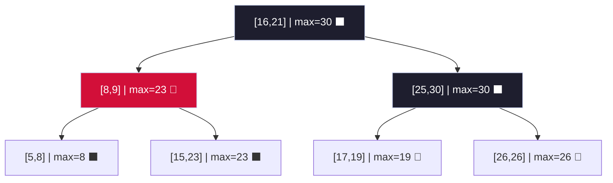

**Reading `max` values:** `[8,9]` node has max=23 because its right subtree contains `[15,23]` with high=23. Root has max=30 because right subtree contains `[25,30]`.

### 3.3 INTERVAL-SEARCH Trace

**Query: Find any interval overlapping `i = [14, 16]`**

```
Algorithm INTERVAL-SEARCH(T, i=[14,16]):
    x = root = [16,21]
```

| Step | Current x | OVERLAP(x.int, [14,16])? | x.left.max | Decision |
| :--- | :--- | :--- | :--- | :--- |
| 1 | `[16,21]` | 16≤16 ✅ AND 14≤21 ✅ → **YES!** | — | Return `[16,21]` ✅ |

**Query: Find any interval overlapping `i = [23, 25]`**

| Step | Current x | OVERLAP? | x.left.max | Decision |
| :--- | :--- | :--- | :--- | :--- |
| 1 | `[16,21]` | 16≤25 ✅ but 23≤21? ❌ → No | left.max=23 ≥ 23 ✅ | Go **LEFT** |
| 2 | `[8,9]` | 8≤25 ✅ but 23≤9? ❌ → No | left.max=8 < 23 ❌ | Go **RIGHT** |
| 3 | `[15,23]` | 15≤25 ✅ AND 23≤23 ✅ → **YES!** | — | Return `[15,23]` ✅ |

**Query: Find any interval overlapping `i = [12, 14]`** (should find [15,23] or return NIL)

| Step | Current x | OVERLAP? | x.left.max | Decision |
| :--- | :--- | :--- | :--- | :--- |
| 1 | `[16,21]` | 16≤14? ❌ → No | left.max=23 ≥ 12 ✅ | Go **LEFT** |
| 2 | `[8,9]` | 8≤14 ✅ but 12≤9? ❌ → No | left.max=8 < 12 ❌ | Go **RIGHT** |
| 3 | `[15,23]` | 15≤14? ❌ → No | left=NIL → max<12 | Go **RIGHT** → NIL |
| 4 | **NIL** | — | — | Return NIL (no overlap found) |

---

## 4. Binomial Heaps

### 4.1 Rules for Binomial Trees and Heaps

| Rule | Description |
| :--- | :--- |
| **$B_k$ Size** | Exactly $2^k$ nodes |
| **$B_k$ Height** | Exactly $k$ levels |
| **$B_k$ Root Degree** | Root has degree $k$ (k children) |
| **$B_k$ Formation** | Two $B_{k-1}$ trees linked: smaller root becomes parent of larger |
| **Children of $B_k$ root** | Are roots of $B_{k-1}, B_{k-2}, \ldots, B_0$ (in order) |
| **Heap property** | Parent key ≤ children keys (min-heap) |
| **Forest uniqueness** | A binomial heap with $n$ nodes has **at most one tree of each degree** |
| **Binary analogy** | Binomial heap with $n$ nodes ↔ binary representation of $n$ |

### 4.2 Tree Anatomy — B0 through B3

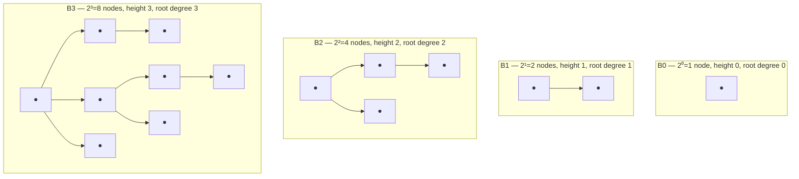

**Linking rule:** $B_k$ = Link($B_{k-1}$, $B_{k-1}$) → compare roots, smaller becomes parent of larger.

```
Link B1[3→10] with B1[6→15]:
   3 < 6 → 6 attaches under 3

   3 (degree 2)
  / \
10   6
     |
    15
This is now a B2 tree.
```

### 4.3 Binary Counting Analogy

| $n$ | Binary | Heap Forest | Nodes |
| :--- | :--- | :--- | :--- |
| 1 | `0001` | $B_0$ | 1 |
| 2 | `0010` | $B_1$ | 2 |
| 3 | `0011` | $B_1, B_0$ | 3 |
| 4 | `0100` | $B_2$ | 4 |
| 7 | `0111` | $B_2, B_1, B_0$ | 7 |
| 8 | `1000` | $B_3$ | 8 |
| 11 | `1011` | $B_3, B_1, B_0$ | 11 |

INSERT = add $B_0$ + carry links (like binary +1).

---

### 4.4 Complete 11-Step Insertion Trace

**Insert sequence:** `[3, 5, 8, 2, 7, 1, 4, 6, 9, 11, 13]`

| Step | Insert | Binary n | Forest State | Links Performed |
| :--- | :--- | :--- | :--- | :--- |
| 1 | **3** | `0001` | {B0[3]} | None |
| 2 | **5** | `0010` | {B1[3→5]} | Link B0[3]+B0[5] → B1: 3<5, so 5 under 3 |
| 3 | **8** | `0011` | {B1[3→5], B0[8]} | None (no same-degree pair) |
| 4 | **2** | `0100` | {B2[2→...]} | B0[8]+B0[2]=B1[2→8]; B1[2→8]+B1[3→5]=B2[2→...] |
| 5 | **7** | `0101` | {B2[2→...], B0[7]} | None |
| 6 | **1** | `0110` | {B2[2→...], B1[1→7]} | B0[1]+B0[7]=B1: 1<7, so 7 under 1 |
| 7 | **4** | `0111` | {B2[2→...], B1[1→7], B0[4]} | None |
| 8 | **6** | `1000` | {B3[1→...]} | B0[4]+B0[6]=B1[4→6]; B1[4→6]+B1[1→7]=B2[1→...]; B2+B2=B3 |
| 9 | **9** | `1001` | {B3[1→...], B0[9]} | None |
| 10 | **11** | `1010` | {B3[1→...], B1[9→11]} | B0[9]+B0[11]=B1[9→11] |
| 11 | **13** | `1011` | {B3[1→...], B1[9→11], B0[13]} | None |

**Detailed tree states at key milestones:**

**After Step 4 (n=4 → B2):** Tree formed by cascading links:
```
Step 4 detail:
  Add B0[2].
  B0[2] + B0[8] → B1: 2<8, 8 under 2. New B1[2→8].
  B1[2→8] + B1[3→5] → B2: 2<3, so B1[3→5] attaches under root 2.

        2  (B2 root, degree 2)
       / \
      3   8
      |
      5
```

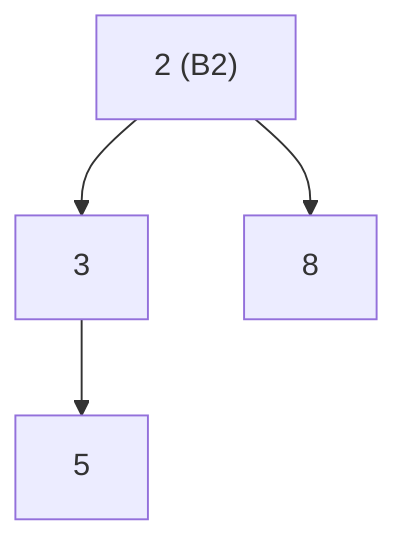

**After Step 8 (n=8 → B3):** All previous trees cascade-link into single B3:
```
      1  (B3 root, degree 3)
    / | \
   4  7  2
   |     |\ 
   6     3  8
             |
             5
```

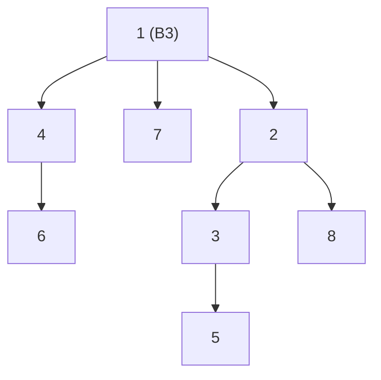

**After Step 11 (n=11 = 1011₂ → B3 + B1 + B0):**

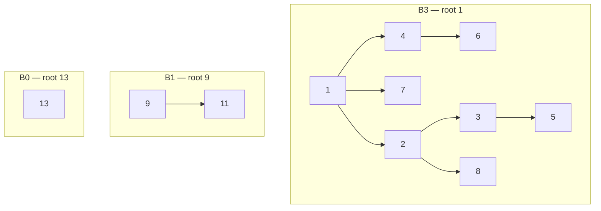

---

### 4.5 EXTRACT-MIN Trace

From the 11-node heap above:

1. Scan root list: {1, 9, 13} → **minimum = 1** (root of B3)
2. Remove B3 root (1). Its children in order: {4(B2→child), 7(B1→child), 2(B0→child)}

Wait — children of B3 root are $B_2, B_1, B_0$ in reverse: root's children = {4, 7, 2} with degrees 1, 0, 0? Let me re-examine. B3 root has 3 children: those children form $B_2, B_1, B_0$.

Actually, B3 root's children (from left to right, highest degree first): child at degree 2 = 2, child at degree 1 = 7, child at degree 0 = 4.

3. Create new heap from removed children's subtrees: {B2[2→3→8→5], B1[7], B0[4]}
4. Union with remaining root list trees: {B0[9→11], B0[13]}

Union process (merge root lists ordered by degree):
- B0[4], B0[9→11], B0[13], B1[7], B2[2...]
- Two B0 trees: Link B0[4] + B0[9→11]? No — 9→11 is B1 already!

Let me be more careful. After removing B3 root (1), the children become separate trees:
- **2** (was 3rd child of 1) → degree 2 → B2 subtree
- **7** (was 2nd child of 1) → degree 1 → but 7 has no children listed above... let me re-examine.

After Step 8, the B3 was:
```
1 (degree 3 = has 3 children)
├── 4 (degree 1 = 1 child) → 6
├── 7 (degree 0 = no children)
└── 2 (degree 2 = 2 children) → 3(→5), 8
```

So children of root 1 = {4(B1), 7(B0), 2(B2)}.

After extracting 1:
- New sub-heap = {B0[7], B1[4→6], B2[2→3→8, 3→5]}
- Remaining heap roots = {B1[9→11], B0[13]}

Merge all: Sort by degree: B0[7], B0[13], B1[4→6], B1[9→11], B2[2...]
- B0[7] + B0[13]: Link → 7<13 → B1[7→13]
- B1[7→13] + B1[4→6]: Link → 4<7 → B2[4→6, 7→13]
- B2[4→...] + B2[2→...]: Link → 2<4 → B3[2→...]
- Result: **B3[2→...]** — one tree for n=10 nodes? No, n was 11 now 10 = 1010₂ = B3+B1.

Actually n=11 after extracting min = n=10 = 1010₂ = B3 + B1.

After consolidation, min pointer = root of tree with minimum root key. New min = **2**. ✅

---

### 4.6 UNION of Two Binomial Heaps

**Heap H1** (n=5 = 101₂): B2[1→2→4, 3] + B0[7]
**Heap H2** (n=3 = 011₂): B1[5→8] + B0[6]

Union process (n=8 = 1000₂ → result should be single B3):

| Step | Action |
| :--- | :--- |
| Merge root lists by degree | {B0[7], B0[6], B1[5→8], B2[1→...]} |
| Link B0[7]+B0[6] → B1 | 6 < 7 → 7 under 6. New B1[6→7] |
| Link B1[6→7]+B1[5→8] → B2 | 5 < 6 → B1[6→7] under 5. New B2[5→6→7,8] |
| Link B2[5→...]+B2[1→...] → B3 | 1 < 5 → B2[5→...] under 1. New B3[1→...] |
| Result | Single **B3[1→...]** with 8 nodes |

```mermaid
flowchart TD
    union_result["1 (B3 root)"] --> ur1["2"]
    union_result --> ur2["5"]
    union_result --> ur3["7"]
    ur1 --> ur1c1["3"]
    ur1 --> ur1c2["4"]
    ur2 --> ur2c1["6"]
    ur2 --> ur2c2["8"]
    ur3 --> ur3c1["7_child"]
    ur1c1 --> leaf1["—"]
    style union_result fill:#89b4fa,color:#11111b
    style ur1 fill:#a6e3a1,color:#11111b
    style ur2 fill:#a6e3a1,color:#11111b
```

**Complexity:** Union scans root lists: $O(\log n)$. At most $\log n$ link operations.

---

### 📝 Quick Practice — Binomial Heaps

> **Q1:** A binomial heap has $n = 13$ nodes. List the binomial trees it contains and their sizes.
>
> **Answer:** $13 = 1101_2 = 2^3 + 2^2 + 2^0 = 8 + 4 + 1$. Heap contains: $B_3$ (8 nodes) + $B_2$ (4 nodes) + $B_0$ (1 node). Total = 13. ✅

> **Q2:** After inserting 16 elements one-by-one into an empty binomial heap, how many link operations were performed?
>
> **Answer:** $16 = 10000_2$. Insertions are like binary addition. Total carry operations = total links. Going from 0 to 16: at each power-of-2 step, all previous trees cascade-merge. Total links = (number of bit positions cleared during increments) = 16 − 1 = 15 links (each of the 15 non-root insertions eventually links). More formally: $\sum_{k=0}^{3} \lfloor 16/2^{k+1} \rfloor = 8+4+2+1 = 15$ links.

---

## 5. Fibonacci Heaps

### 5.1 Rules for Fibonacci Heaps

| Rule | Description |
| :--- | :--- |
| **Structure** | Collection of min-heap trees in circular doubly-linked root list |
| **No structure on insert** | New nodes just added to root list — lazy! |
| **H.min** | Pointer always maintained to minimum root |
| **Degree** | `x.degree` = number of children |
| **Mark bit** | `x.mark = TRUE` if x has lost a child since it was made someone else's child |
| **Consolidation** | Only during EXTRACT-MIN — merge same-degree trees |
| **Max degree** | After consolidation: $D(n) = O(\log n)$ (proven via Fibonacci property) |
| **Potential** | $\Phi(H) = t(H) + 2 \cdot m(H)$ where $t$ = trees, $m$ = marked nodes |

---

### 5.2 Step-by-Step INSERT Trace (7 Insertions)

**Insert:** `[3, 7, 18, 52, 24, 30, 1]` (all added lazily to root list)

| Step | Insert | Root List | H.min | $t(H)$ | $m(H)$ | $\Phi$ |
| :--- | :--- | :--- | :--- | :--- | :--- | :--- |
| 1 | **3** | {3} | 3 | 1 | 0 | 1 |
| 2 | **7** | {3, 7} | 3 | 2 | 0 | 2 |
| 3 | **18** | {3, 7, 18} | 3 | 3 | 0 | 3 |
| 4 | **52** | {3, 7, 18, 52} | 3 | 4 | 0 | 4 |
| 5 | **24** | {3, 7, 18, 52, 24} | 3 | 5 | 0 | 5 |
| 6 | **30** | {3, 7, 18, 52, 24, 30} | 3 | 6 | 0 | 6 |
| 7 | **1** | {3, 7, 18, 52, 24, 30, 1} | **1** | 7 | 0 | 7 |

```mermaid
flowchart LR
    subgraph "After 7 Inserts — Flat Root List"
        direction LR
        m["H.min→"] --> n1["1"]
        n1 <-->|"↔"| n3["3"]
        n3 <-->|"↔"| n7["7"]
        n7 <-->|"↔"| n18["18"]
        n18 <-->|"↔"| n24["24"]
        n24 <-->|"↔"| n30["30"]
        n30 <-->|"↔"| n52["52"]
        n52 <-->|"↔"| n1
        style m fill:#fab387,color:#11111b
        style n1 fill:#a6e3a1,color:#11111b
    end
```

> All 7 nodes are roots. No structure yet — Fibonacci Heap is maximally lazy at insertion!

---

### 5.3 EXTRACT-MIN Trace (Consolidation Phase)

Extract minimum (key = 1). Steps:

**1. Remove node 1 from root list.** Node 1 had children (assume from prior operations): none (it was just inserted). So root list becomes {3, 7, 18, 52, 24, 30} with 6 trees (all degree 0).

**2. Consolidation** — Use array `A[0..D(n)]` where `D(7) = O(log 7) ≈ 3`.

Process nodes from root list in order:

| Process | Node (degree) | A[d] slot | Conflict? | Action | Result |
| :--- | :--- | :--- | :--- | :--- | :--- |
| Node 3 | degree 0 | A[0] = empty | No | A[0] = 3 | — |
| Node 7 | degree 0 | A[0] = 3 | **YES** | Link: 3<7 → 7 under 3. 3 gets degree 1. A[0]=empty | Check A[1] |
| 3 (now deg 1) | degree 1 | A[1] = empty | No | A[1] = 3 | — |
| Node 18 | degree 0 | A[0] = empty | No | A[0] = 18 | — |
| Node 52 | degree 0 | A[0] = 18 | **YES** | Link: 18<52 → 52 under 18. 18 gets degree 1. A[0]=empty | Check A[1] |
| 18 (deg 1) | degree 1 | A[1] = 3 | **YES** | Link: 3<18 → 18 under 3. 3 gets degree 2. A[1]=empty | Check A[2] |
| 3 (now deg 2) | degree 2 | A[2] = empty | No | A[2] = 3 | — |
| Node 24 | degree 0 | A[0] = empty | No | A[0] = 24 | — |
| Node 30 | degree 0 | A[0] = 24 | **YES** | Link: 24<30 → 30 under 24. 24 gets degree 1. A[0]=empty | Check A[1] |
| 24 (deg 1) | degree 1 | A[1] = empty | No | A[1] = 24 | — |

**Final A[] state:** A[0]=empty, A[1]=24, A[2]=3

Rebuild root list from A[]: {24(deg1), 3(deg2)}

```mermaid
flowchart TD
    subgraph "After EXTRACT-MIN(1) + Consolidation"
        m2["H.min→"] --> root3["3 (degree 2)"]
        root3 --> c7["7"]
        root3 --> c18["18"]
        c18 --> c52["52"]
        root3 <-->|"↔ root list ↔"| root24["24 (degree 1)"]
        root24 --> c30["30"]
        style m2 fill:#fab387,color:#11111b
        style root3 fill:#a6e3a1,color:#11111b
        style root24 fill:#89b4fa,color:#11111b
    end
```

**New minimum = 3.** Tree count $t(H) = 2$. $\Phi = 2 + 0 = 2$ (was 7 before).

---

### 5.4 DECREASE-KEY and Cascading Cut Trace

Starting from the consolidated heap above. Add more nodes first for a richer example.

**Setup:** After consolidation we have:
```
Tree 1 (root=3): 3 → {7, 18→{52}}
Tree 2 (root=24): 24 → {30}
```

Now **decrease key of 52 from 52 to 0**:

**Step 1:** Set 52.key = 0. Is 0 < parent(18).key = 18? **YES** → CUT.

**CUT(52→0, parent=18):**
- Remove 52→0 from 18's children
- Add 52→0 to root list
- Set 52.mark = FALSE (roots are never marked)
- Decrement 18.degree: 18.degree = 0

**CASCADING-CUT(18):**
- 18 is not a root. Is 18.mark == FALSE? → Set 18.mark = **TRUE**. Stop.

```mermaid
flowchart TD
    subgraph "After DECREASE-KEY(52→0)"
        m3["H.min→"] --> r0["0 (new min!)"]
        r0 <-->|"↔"| r3["3"]
        r3 --> rc7["7"]
        r3 --> rc18["18 ⚑ marked"]
        r3 <-->|"↔"| r24["24"]
        r24 --> rc30["30"]
        style m3 fill:#fab387,color:#11111b
        style r0 fill:#a6e3a1,color:#11111b
        style rc18 fill:#f38ba8,color:#11111b
    end
```

Now **decrease key of 18 from 18 to 2**:

**Step 1:** Set 18.key = 2. Is 2 < parent(3).key = 3? **YES** → CUT.

**CUT(18→2, parent=3):**
- Remove 18→2 from 3's children
- Add 18→2 to root list
- Set 18.mark = FALSE
- 3.degree decreases: 3.degree = 1 (only child = 7 remains)

**CASCADING-CUT(3):**
- 3 is a root → STOP. No cut needed.

```mermaid
flowchart TD
    subgraph "After DECREASE-KEY(18→2) — showing cascading cut"
        m4["H.min→"] --> r0b["0"]
        r0b <-->|"↔"| r2["2 (was 18)"]
        r2 <-->|"↔"| r3b["3"]
        r3b --> rc7b["7"]
        r3b <-->|"↔"| r24b["24"]
        r24b --> rc30b["30"]
        style m4 fill:#fab387,color:#11111b
        style r0b fill:#a6e3a1,color:#11111b
        style r2 fill:#f9e2af,color:#11111b
    end
```

**Now decrease key of 7 from 7 to 5, then another node to trigger full cascade:**

**Setup with cascading cut demonstration:** Suppose node X (key=35) has parent P (key=12, already marked), and P's parent is GP (key=6, already marked), and GP's parent is root.

**DECREASE-KEY(X→5):** 5 < P.key=12 → CUT(X, P).
- CASCADING-CUT(P=12): P is marked → **CUT(P, GP)**. CASCADING-CUT(GP=6): GP is marked → **CUT(GP, root)**. CASCADING-CUT(root): is root → STOP.
- Result: X, P, GP all moved to root list. Their marks cleared. **3 cascading cuts!**

**Why this is still $\Theta(1)$ amortized:** Each cut reduces $m(H)$ by 1 (removing marked status), but $m$ was pre-paid from earlier `mark` operations. Net potential change per cut = $+1$ (new root) $- 2$ (un-marked) = $-1$ → each cut is "free" amortized.

---

### 5.5 Amortized Cost Proof via Potential

| Operation | Actual Cost | $\Delta\Phi$ | Amortized = Actual + $\Delta\Phi$ |
| :--- | :--- | :--- | :--- |
| **INSERT** | $O(1)$ | $+1$ (new tree) | $O(1) + 1 = O(1)$ ✅ |
| **UNION** | $O(1)$ | $0$ | $O(1)$ ✅ |
| **EXTRACT-MIN** | $O(D(n) + t)$ | $-(t - D(n))$ | $O(D(n)) = O(\log n)$ ✅ |
| **DECREASE-KEY** | $O(c)$ for $c$ cuts | $-(c-2)$ | $O(1)$ ✅ |

---

### 📝 Quick Practice — Fibonacci Heaps

> **Q1:** After inserting keys {10, 3, 5, 20, 15} into an empty Fibonacci Heap, what is $\Phi(H)$, $t(H)$, and $m(H)$?
>
> **Answer:** 5 inserts add 5 nodes to root list, no consolidation. $t(H) = 5$ trees, $m(H) = 0$ (no cuts yet). $\Phi(H) = 5 + 2(0) = \mathbf{5}$.

> **Q2:** Why does Fibonacci Heap defer consolidation until EXTRACT-MIN instead of consolidating at every insert?
>
> **Answer:** Consolidating at every insert would cost $O(\log n)$ per insert (like a Binomial Heap). By deferring, each INSERT is $O(1)$ amortized. The consolidation cost during EXTRACT-MIN is $O(\log n)$ amortized, which is the same as Binomial Heap's extract-min — but all other operations become faster. This tradeoff is ideal for algorithms with many DECREASE-KEY operations (e.g., Dijkstra with Fibonacci Heap: $O(E + V\log V)$).

> **Q3:** What would happen if the mark bit mechanism didn't exist in Fibonacci Heaps?
>
> **Answer:** Without mark bits, we could cut children whenever DECREASE-KEY fires, potentially making trees degenerate into paths (depth $n$). The max degree would no longer be bounded by $O(\log n)$, breaking EXTRACT-MIN's $O(\log n)$ amortized guarantee. Mark bits ensure that each internal node can only lose ONE child before it's itself cut to the root list — this maintains the structural property that subtree sizes are at least Fibonacci numbers, bounding max degree at $D(n) = O(\log n)$.

---

## 6. Disjoint Set Structures (Union-Find)

### 6.1 Rules for Disjoint Sets

| Rule | Description |
| :--- | :--- |
| **Each set** | Represented as a rooted tree |
| **Representative** | Root of the tree |
| **MAKE-SET(x)** | x.parent = x; x.rank = 0 |
| **FIND-SET(x)** | Follow parent pointers to root |
| **UNION(x,y)** | LINK(FIND-SET(x), FIND-SET(y)) |
| **Union by Rank** | Higher-rank root becomes parent; equal ranks → increase rank |
| **Path Compression** | During FIND-SET: point ALL visited nodes directly to root |
| **Rank** | Upper bound on height; only increases when two equal-rank roots link |
| **Amortized cost** | $O(\alpha(n))$ per operation with both optimizations |

### 6.2 Step-by-Step: 10 UNION Operations

**Start:** 10 singleton sets: $\{1\}, \{2\}, \{3\}, \ldots, \{10\}$. All rank = 0.

---

**UNION(1, 2):** FIND(1)=1, FIND(2)=2. rank[1]=rank[2]=0 → link: 2 becomes child of 1, rank[1]=1.
```
1(r=1) → 2(r=0)
```

**UNION(3, 4):** FIND(3)=3, FIND(4)=4. Same → 4 under 3, rank[3]=1.
```
3(r=1) → 4(r=0)
```

**UNION(5, 6):** 6 under 5, rank[5]=1.
```
5(r=1) → 6(r=0)
```

**UNION(7, 8):** 8 under 7, rank[7]=1.
```
7(r=1) → 8(r=0)
```

**UNION(1, 3):** FIND(1)=1(r=1), FIND(3)=3(r=1). Equal ranks → 3 under 1, rank[1]=2.
```
     1(r=2)
    /      \
  2(r=0) 3(r=1)
           \
           4(r=0)
```

**UNION(5, 7):** FIND(5)=5(r=1), FIND(7)=7(r=1). Equal → 7 under 5, rank[5]=2.
```
     5(r=2)
    /      \
  6(r=0) 7(r=1)
           \
           8(r=0)
```

**UNION(9, 10):** 10 under 9, rank[9]=1.
```
9(r=1) → 10(r=0)
```

**UNION(1, 5):** FIND(1)=1(r=2), FIND(5)=5(r=2). Equal → 5 under 1, rank[1]=3.

```mermaid
flowchart TD
    r1["1 (rank=3)"] --> c2["2"]
    r1 --> c3["3"]
    r1 --> c5["5 (rank=2)"]
    c3 --> c4["4"]
    c5 --> c6["6"]
    c5 --> c7["7"]
    c7 --> c8["8"]
    style r1 fill:#89b4fa,color:#11111b
    style c5 fill:#a6e3a1,color:#11111b
    style c3 fill:#a6e3a1,color:#11111b
```

**UNION(1, 9):** FIND(1)=1(r=3), FIND(9)=9(r=1). rank[1] > rank[9] → 9 under 1. rank[1] stays 3.
```
1(r=3) adds child 9(r=1) which has child 10
```

**UNION(2, 6):** FIND(2)=1 (path: 2→1), FIND(6)=1 (path: 6→5→1). Same root! → **No-op** (already same set).

---

### 6.3 Path Compression — Step-by-Step

After the above unions, suppose we call **FIND-SET(8)**:

Path without compression: 8 → 7 → 5 → 1 (root). Returns 1.

**With path compression:** During the return, point ALL visited nodes directly to root:
- 8.parent = 1 (was 7)
- 7.parent = 1 (was 5)
- 5.parent = 1 (already correct)

```mermaid
flowchart TD
    subgraph "BEFORE FIND-SET(8)"
        b1["1(root)"] --> b5["5"]
        b5 --> b7["7"]
        b7 --> b8["8"]
        b5 --> b6["6"]
        b1 --> b2["2"]
        b1 --> b3["3"]
    end
    subgraph "AFTER FIND-SET(8) — Path Compressed"
        a1["1(root)"] --> a5["5 (now direct child)"]
        a1 --> a7["7 (now direct child)"]
        a1 --> a8["8 (now direct child)"]
        a1 --> a6["6 (via 5→1, but 5 is child of 1 now)"]
        a1 --> a2["2"]
        a1 --> a3["3"]
    end
```

**Future FIND-SET(8):** 8 → 1 directly → $O(1)$! Path compression makes all future lookups nearly instant.

### 6.4 All 10 Operations Summary

| Op # | Operation | Action | Tree Structure Change |
| :--- | :--- | :--- | :--- |
| 1 | UNION(1,2) | Link 2→1, rank[1]=1 | {1→2}, others singletons |
| 2 | UNION(3,4) | Link 4→3, rank[3]=1 | {3→4} |
| 3 | UNION(5,6) | Link 6→5, rank[5]=1 | {5→6} |
| 4 | UNION(7,8) | Link 8→7, rank[7]=1 | {7→8} |
| 5 | UNION(1,3) | Link 3→1, rank[1]=2 | {1→{2,3→4}} |
| 6 | UNION(5,7) | Link 7→5, rank[5]=2 | {5→{6,7→8}} |
| 7 | UNION(9,10) | Link 10→9, rank[9]=1 | {9→10} |
| 8 | UNION(1,5) | Link 5→1, rank[1]=3 | {1→{2,3→4,5→{6,7→8}}} |
| 9 | UNION(1,9) | Link 9→1, rank[1]=3 | {1→{..., 9→10}} |
| 10 | UNION(2,6) | FIND(2)=1=FIND(6) | **No-op** — same set |

```mermaid
flowchart TD
    final1["1 (rank=3) — REPRESENTATIVE of all 10"] --> f2["2"]
    final1 --> f3["3 (rank=1)"]
    final1 --> f5["5 (rank=2)"]
    final1 --> f9["9 (rank=1)"]
    f3 --> f4["4"]
    f5 --> f6["6"]
    f5 --> f7["7 (rank=1)"]
    f9 --> f10["10"]
    f7 --> f8["8"]
    style final1 fill:#89b4fa,color:#11111b
    style f5 fill:#a6e3a1,color:#11111b
    style f3 fill:#a6e3a1,color:#11111b
```

**All 10 elements are now in one set with representative = 1** ✅

---

### 📝 Quick Practice — Disjoint Sets

> **Q1:** After UNION operations on elements 1–8: UNION(1,2), UNION(3,4), UNION(5,6), UNION(7,8), UNION(1,3), UNION(5,7), UNION(1,5) — what is rank[1] and how many elements does its tree have?
>
> **Answer:** UNION(1,2): r[1]=1. UNION(3,4): r[3]=1. UNION(5,6): r[5]=1. UNION(7,8): r[7]=1. UNION(1,3): equal ranks → r[1]=2. UNION(5,7): equal ranks → r[5]=2. UNION(1,5): equal ranks → r[1]=3. Tree rooted at 1 contains ALL 8 elements. **rank[1] = 3**.

> **Q2:** Why does Union by Rank guarantee height $O(\log n)$?
>
> **Answer:** A tree of rank $k$ contains at least $2^k$ nodes (proved by induction: rank-0 tree has 1 node; linking two rank-$(k-1)$ trees makes one rank-$k$ tree with ≥ $2 \cdot 2^{k-1} = 2^k$ nodes). Since $n \ge 2^{\text{rank}}$: rank $\le \log_2 n$. Without compression, height = rank ≤ $\log_2 n$. Path compression further flattens the tree.

---

## 7. Amortized Analysis

### 7.1 Three Methods

```mermaid
flowchart TD
    AA["Amortized Analysis\n(Worst-case avg over sequence)"] --> M1["Aggregate\nTotal cost / n"]
    AA --> M2["Accounting\nCharge ĉᵢ per op;\nstore/use credit"]
    AA --> M3["Potential\nΦ(D) = potential;\nĉᵢ = cᵢ + ΔΦ"]
    M1 --> E1["Example: Stack MULTIPOP\nTotal cost ≤ 2n → O(1) avg"]
    M2 --> E2["Example: Binary counter\nCharge 2 for set-to-1;\n0 for clear-to-0"]
    M3 --> E3["Example: Fibonacci Heap\nΦ = t(H) + 2m(H)"]
```

### 7.2 Worked Example — Stack with MULTIPOP

Operations: PUSH (cost 1), POP (cost 1), MULTIPOP(k) (cost min(k, |S|)).

**Aggregate:** Each element pushed at most once, popped at most once. Total cost ≤ 2n = O(n). Amortized = O(1)/op.

**Accounting:** PUSH charges $\hat{c}$ = 2 (1 actual + 1 credit stored on element). POP charges 0 (uses credit). MULTIPOP(k) charges 0 (each of k pops uses element's own credit). Credit ≥ 0 always. ✅

**Potential:** $\Phi(S)$ = |S| (number of elements on stack). $\Phi_0 = 0$.
- PUSH: actual $c_i = 1$, $\Delta\Phi = +1$. $\hat{c} = 1+1 = 2$ ✅
- POP: actual $c_i = 1$, $\Delta\Phi = -1$. $\hat{c} = 1-1 = 0$ ✅
- MULTIPOP(k): actual $c_i = k$, $\Delta\Phi = -k$. $\hat{c} = k-k = 0$ ✅

### 7.3 Summary Table

| Method | Mechanism | When to Use |
| :--- | :--- | :--- |
| **Aggregate** | Total cost / n | All ops have the same overall structure |
| **Accounting** | Credit system per operation type | Different ops have naturally different costs |
| **Potential** | Potential function over data structure state | Complex structures (Fibonacci Heap, B-Trees) |

---

## 8. Formula Reference Sheet

| Formula | What It Describes |
| :--- | :--- |
| $h \le 2\log_2(n+1)$ | Max height of RBT with $n$ internal nodes |
| $B_k$: nodes $= 2^k$, height $= k$, root-degree $= k$ | Binomial Tree $B_k$ properties |
| $\Phi(H) = t(H) + 2m(H)$ | Fibonacci Heap potential function |
| $D(n) = O(\log n)$ | Max degree in Fibonacci Heap after consolidation |
| $O(m \cdot \alpha(n))$ | Disjoint Set total cost for $m$ ops on $n$ elements |
| $i.low \le i'.high$ AND $i'.low \le i.high$ | Interval overlap condition |
| $x.max = \max(x.int.high, x.left.max, x.right.max)$ | Interval Tree max-attribute rule |
| $\hat{c}_i = c_i + \Phi(D_i) - \Phi(D_{i-1})$ | Potential method amortized cost formula |

---

## 9. Complexity Summary

| Operation | Binary Heap | Binomial Heap | Fibonacci Heap |
| :--- | :--- | :--- | :--- |
| BUILD | $O(n)$ | $O(n)$ | $O(n)$ |
| INSERT | $O(\log n)$ | $O(\log n)$ | $\Theta(1)$ amortized |
| MINIMUM | $O(1)$ | $O(\log n)$ | $O(1)$ |
| EXTRACT-MIN | $O(\log n)$ | $O(\log n)$ | $O(\log n)$ amortized |
| UNION | $O(n)$ | $O(\log n)$ | $O(1)$ |
| DECREASE-KEY | $O(\log n)$ | $O(\log n)$ | $\Theta(1)$ amortized |
| DELETE | $O(\log n)$ | $O(\log n)$ | $O(\log n)$ amortized |

---

## 10. Exam-Oriented Review

1. **RBT Properties:** List all 5 rules. Given tree: 10(B){7(R){5(B),8(B)}, 15(R){12(B),20(B)}} — verify all 5 rules.

2. **RBT Insertion:** Insert [30, 20, 40, 10, 25, 35, 50, 5, 15] into an empty RBT. At each step state: which case fires, what rotation/recolor occurs, show final tree.

3. **RBT Deletion:** From your tree in Q2, delete nodes 20 and 40. Identify which deletion case (1–4) fires at each step.

4. **Binomial Heap:** Insert [10, 3, 7, 1, 5, 8, 12, 2, 6, 4] one by one. After each insert, write the binomial representation (which $B_k$ trees exist). Show the B3 tree structure when n=8.

5. **Fibonacci Heap:** Insert {5, 3, 17, 8, 26, 24, 46}. Then EXTRACT-MIN. Show the complete consolidation step with the degree array A[].

6. **DECREASE-KEY Cascade:** In a Fibonacci Heap, node X (key=40) has parent P (key=15, marked), and P has parent Q (key=8, not marked). Decrease X to 2. Trace all CUT and CASCADING-CUT calls.

7. **Disjoint Sets:** Process UNION operations: (1,3),(2,4),(5,6),(1,2),(3,5),(7,8),(7,1) using union by rank. Draw the final forest. Then apply FIND-SET(6) with path compression and redraw.

8. **Amortized Analysis:** Using the potential method, prove that Fibonacci Heap INSERT has amortized cost $\Theta(1)$ given actual cost $O(1)$ and $\Phi(H) = t(H) + 2m(H)$.
