# Chapter 4: Advanced Data Structures & Amortized Analysis

> **Course Code:** 3CS501CC24
> **Focus:** Red-Black Trees, Interval Trees, Binomial Heaps, Fibonacci Heaps, Disjoint Set Structures & Amortized Analysis

---

## 1. Chapter Overview

This unit covers advanced data structures that guarantee logarithmic or constant amortized time complexities:
1. **Red-Black Trees (RBT):** Self-balancing binary search trees ensuring $O(\log n)$ worst-case bounds on search, insertion, and deletion.
2. **Interval Trees:** Augmented self-balancing search trees for dynamic interval management and overlap queries in $O(\log n)$ time.
3. **Binomial Heaps:** Forest of Binomial Trees supporting $O(\log n)$ worst-case merge/union operations.
4. **Fibonacci Heaps:** Lazy mergeable heaps supporting $O(1)$ amortized insertion, union, and decrease-key operations.
5. **Disjoint Set Structures:** Union-Find data structures with Path Compression and Union by Rank achieving $O(\alpha(n))$ amortized time.
6. **Amortized Analysis:** Evaluating average cost per operation over a sequence using Aggregate, Accounting, and Potential methods.

---

## 2. Red-Black Trees (RBT): Complete Case-by-Case Guide

### Definition & The 5 Red-Black Tree Properties
Every node in a Red-Black Tree has a `color` (**RED** or **BLACK**), `key`, `left`, `right`, and `parent`.
1. **Node Color:** Every node is either **RED** or **BLACK**.
2. **Root Property:** The root is always **BLACK**.
3. **Leaf Property:** Every leaf (`NIL`) is **BLACK**.
4. **Red Property (No Red-Red Conflict):** If a node is **RED**, both of its children must be **BLACK**.
5. **Black-Height Property:** Every simple path from a node to any of its descendant `NIL` leaves contains the exact same number of **BLACK** nodes.

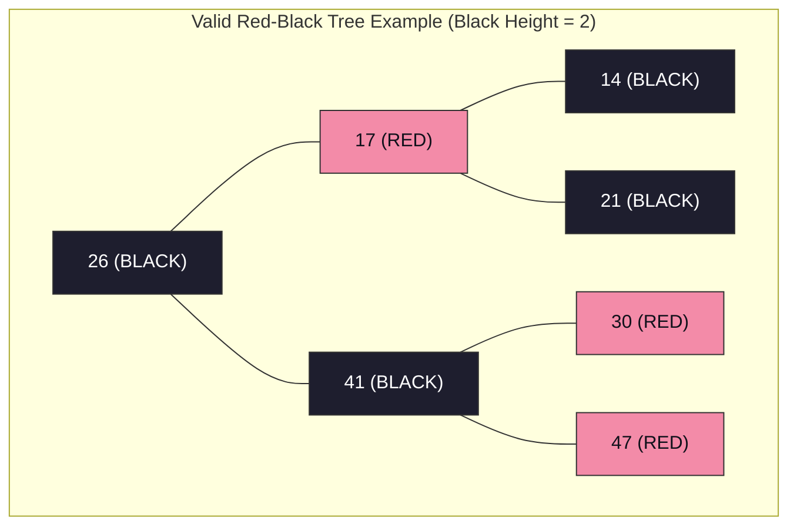

---

### Tree Rotations (Left-Rotate and Right-Rotate)

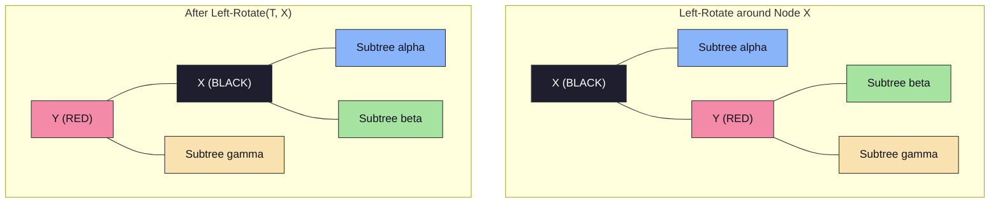

---

### Red-Black Tree Insertion: All 3 Cases

When inserting node $Z$:
1. Insert $Z$ using standard BST insertion and color $Z$ **RED**.
2. If $Z$ is root $\implies$ Recolor $Z$ to **BLACK**.
3. If $Z$'s parent $P$ is **RED** $\implies$ Red-Red Conflict! Look at $Z$'s **Uncle $U$**:

#### Case 1: Uncle $U$ is RED (Recoloring)
- **Steps:** Recolor Parent $P \to$ **BLACK**, Uncle $U \to$ **BLACK**, Grandparent $G \to$ **RED**. Set $Z = G$ and repeat checks.

#### Case 2: Uncle $U$ is BLACK/NIL & $Z$ is Triangle Child (Rotation to Line)
- **Steps:** Rotate Parent $P$ away from $Z$ (e.g., Left-Rotate around $P$). Converts into Case 3 (Line).

#### Case 3: Uncle $U$ is BLACK/NIL & $Z$ is Line Child (Rotation & Recoloring)
- **Steps:** Rotate Grandparent $G$ away from $P$ (e.g., Right-Rotate around $G$). Recolor Parent $P \to$ **BLACK**, Grandparent $G \to$ **RED**.

---

### Red-Black Tree Deletion (`RB-DELETE-FIXUP`)
When a BLACK node is deleted, its path loses 1 black node, creating a **Double Black** on replacement $X$. Let $W$ be $X$'s Sibling:
- **Case 1:** Sibling $W$ is RED $\implies$ Recolor $W \to$ BLACK, Parent $X.p \to$ RED, Left-Rotate($X.p$).
- **Case 2:** Sibling $W$ is BLACK and both children of $W$ are BLACK $\implies$ Recolor $W \to$ RED, move Double Black up to $X.p$.
- **Case 3:** Sibling $W$ is BLACK, Inner Child is RED, Outer Child is BLACK $\implies$ Recolor $W.\text{left} \to$ BLACK, $W \to$ RED, Right-Rotate($W$). Converts to Case 4.
- **Case 4:** Sibling $W$ is BLACK and Outer Child is RED $\implies$ Recolor $W \to$ Parent $X.p$'s color, $X.p \to$ BLACK, $W.\text{right} \to$ BLACK, Left-Rotate($X.p$). Double Black fully resolved!

---

## 3. Interval Trees: Step-by-Step Operations & Case Guide

An **Interval Tree** is an augmented Red-Black Tree that stores dynamic intervals $[i.low, i.high]$.

### Node Structure & Attributes
Each node $x$ contains:
1. $x.interval = [x.low, x.high]$
2. $x.key = x.interval.low$ (Ordered by low endpoint in BST)
3. $x.max = \max(x.interval.high, x.left.max, x.right.max)$ (Max high endpoint in subtree)

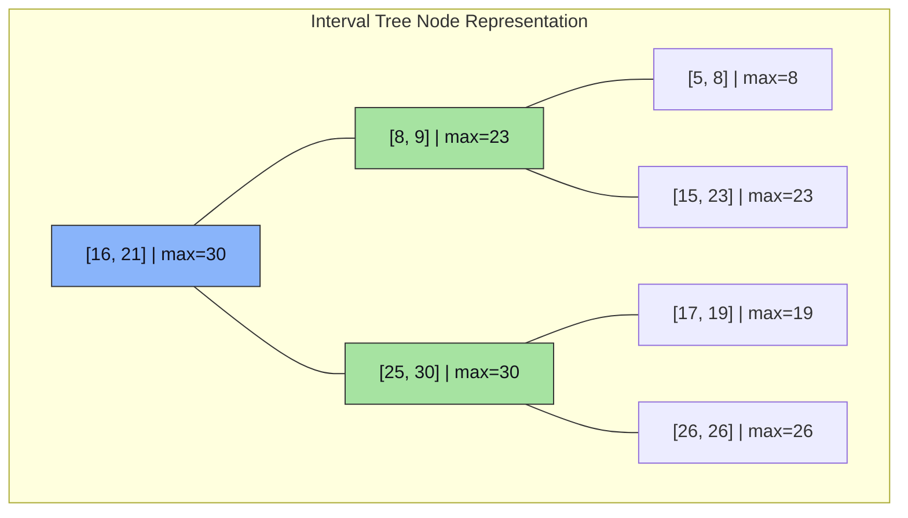

### Core Operations

#### 1. Overlap Check Function
Two intervals $i$ and $i'$ overlap if:

$$
i.low \le i'.high \quad \text{and} \quad i'.low \le i.high
$$

#### 2. Interval Search Algorithm (`INTERVAL-SEARCH(T, i)`)
Finds an interval in $T$ overlapping with target interval $i$:

```text
Algorithm INTERVAL-SEARCH(T, i)
    x = T.root
    while x != NIL and NOT OVERLAP(x.interval, i) do
        if x.left != NIL and x.left.max >= i.low then
            x = x.left
        else
            x = x.right
    return x
```

- **Proof of Branching Logic:**
  - If `x.left` $\neq \text{NIL}$ and `x.left.max` $\ge i.low$, then the left subtree is guaranteed to contain an overlapping interval if any exists in $T$.
  - If `x.left.max` $< i.low$, then no interval in the left subtree can possibly overlap $i$ because every high endpoint in the left subtree is $< i.low$. Going right is necessary.

#### 3. Insertion & Rotation Maintenance
- Insert node $z$ using $z.interval.low$ as the key into the Red-Black Tree.
- Set $z.max = z.interval.high$.
- During upward traversal and rotations (Left-Rotate / Right-Rotate), update $x.max$ for affected nodes:

$$
x.max = \max(x.interval.high, x.left.max, x.right.max)
$$

- **Complexity:** All operations (Insert, Delete, Search) run in $O(\log n)$ worst-case time.

---

## 4. Binomial Heaps: Structure & Operations

### Binomial Tree $B_k$ Properties
1. $B_k$ has $2^k$ total nodes and height $k$.
2. Root degree of $B_k$ is $k$.
3. $B_k$ is formed by linking two $B_{k-1}$ trees (smaller root becomes parent).

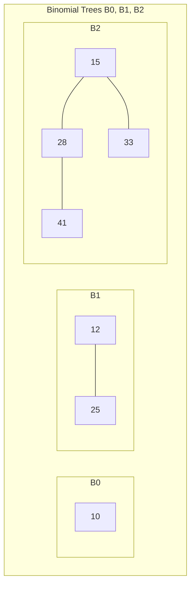

### Union Algorithm
1. Merge root lists of $H_1$ and $H_2$ in ascending order of degree.
2. Link trees with duplicate degrees using pointers `prev`, `curr`, `next`:
   - If `curr.key <= next.key`: Link `next` under `curr`.
   - If `curr.key` $> \text{next.key}$: Link `curr` under `next`.
- **Complexity:** $O(\log n)$ worst-case.

---

## 5. Fibonacci Heaps: Lazy Operations & Amortized Bounds

### Key Features
- **Lazy Structure:** Trees are unstructured in circular root list until `Extract-Min`.
- **Marked Bit:** `mark[x]` tracks whether node $x$ lost a child since $x$ was made a child of another node.

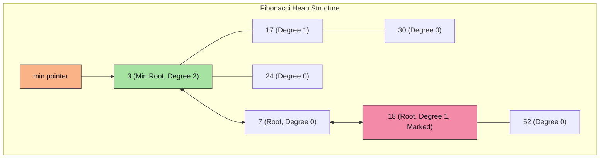

### Key Operations & Amortized Costs
1. **Insert & Union:** Add node / concatenate root lists in $\Theta(1)$ amortized time.
2. **Extract-Min & Consolidation:** Remove min node, add children to root list, consolidate same-degree roots using array $A[0 \dots D(n)]$. Amortized time $O(\log n)$.
3. **Decrease-Key & Cascading Cut:**
   - If $x.key < x.parent.key$, `CUT(x, y)` moves $x$ to root list.
   - `CASCADING-CUT(y)` recursively cuts ancestors if they are already marked (`mark == TRUE`). Amortized time $\Theta(1)$.

---

## 6. Disjoint Set Structures (Union-Find)

Maintains non-overlapping dynamic sets supporting `MAKE-SET(x)`, `FIND-SET(x)`, and `UNION(x, y)`.

### Optimized Pseudocode
```text
Algorithm MAKE-SET(x)
    x.parent = x
    x.rank = 0

Algorithm FIND-SET(x)
    if x != x.parent then
        x.parent = FIND-SET(x.parent)  // Path Compression
    return x.parent

Algorithm UNION(x, y)
    LINK(FIND-SET(x), FIND-SET(y))

Algorithm LINK(x, y)
    if x.rank > y.rank then
        y.parent = x
    else
        x.parent = y
        if x.rank == y.rank then
            y.rank = y.rank + 1
```

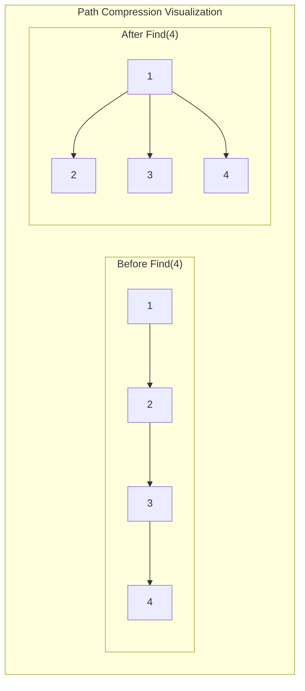

### Amortized Complexity
Using **Union by Rank** and **Path Compression**, a sequence of $m$ operations on $n$ elements takes $O(m \cdot \alpha(n))$ time, where $\alpha(n) \le 4$ is the Inverse Ackermann function. Amortized cost per operation is $\Theta(1)$.

---

## 7. Amortized Analysis Methods

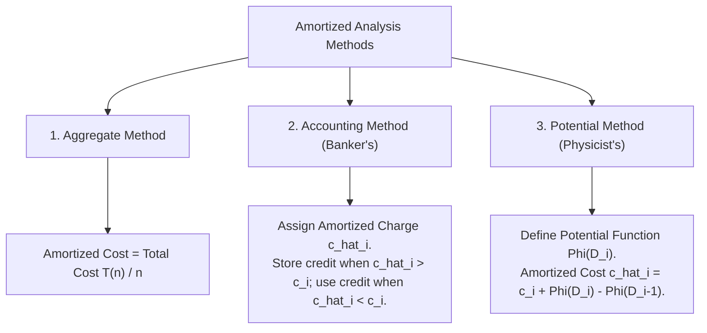

---

## 8. Formula Sheet

- **Red-Black Tree Height:** $h \le 2 \log_2(n + 1)$.
- **Binomial Tree $B_k$:** Nodes $= 2^k$, Height $= k$, Root Degree $= k$.
- **Fibonacci Heap Potential Function:** $\Phi(H) = t(H) + 2 m(H)$ (where $t(H)$ is root count, $m(H)$ is marked node count).
- **Disjoint Set Operations Amortized Cost:** $O(\alpha(n)) \approx \Theta(1)$.
- **Interval Overlap Condition:** $i.low \le i'.high \text{ and } i'.low \le i.high$.

---

## 9. Definition Sheet

1. **Red-Black Tree:** A self-balancing binary search tree with colored nodes that guarantees $O(\log n)$ height.
2. **Interval Tree:** An augmented search tree for storing intervals and performing overlap queries in $O(\log n)$ time.
3. **Binomial Heap:** A collection of binomial trees satisfying min-heap property and unique degrees.
4. **Fibonacci Heap:** A min-heap structure achieving $O(1)$ amortized insertion, union, and decrease-key via lazy consolidation.
5. **Path Compression:** A technique in Union-Find that points all visited nodes directly to the root during `FIND-SET`.
6. **Inverse Ackermann Function ($\alpha(n)$):** An extremely slow-growing function ($\alpha(n) \le 4$ for all practical inputs) describing Disjoint Set efficiency.

---

## 10. Exam-Oriented Review

1. List the 5 Red-Black Tree properties and prove why the maximum height is $2 \log_2(n+1)$.
2. Trace Red-Black Tree insertion for keys $[15, 32, 20, 4, 12, 25, 7]$. Show all rotations and recoloring steps.
3. Explain the node structure of an Interval Tree. How is `x.max` updated during tree rotations?
4. Write the algorithm for `Interval-Search(T, i)` and prove why going left when `x.left.max >= i.low` is correct.
5. Explain how Fibonacci Heaps achieve $O(1)$ amortized time for `Decrease-Key` using Cascading Cuts.
6. Describe Union by Rank and Path Compression in Disjoint Sets. Derive the $O(\alpha(n))$ time complexity.
7. Compare Binary Heap, Binomial Heap, and Fibonacci Heap across all priority queue operations.

---

## 7. Master Worked Problem: Unified Array Construction Across RBT, Binomial Heap, and Fibonacci Heap

> [!IMPORTANT]
> **Unified Exam Problem:**
> Given the input array of keys:
> **Keys:**  = [15, 32, 20, 4, 12, 25, 7]$

> Construct and demonstrate the complete step-by-step algorithmic procedures, state transitions, case resolutions, and final structures for:
> 1. **Red-Black Tree** (with Black-Height verification and Deletion Fixup)
> 2. **Binomial Heap** (with Binary Counter Analogy and Extract-Min)
> 3. **Fibonacci Heap** (with Root List Consolidation and Cascading Cut)

---

### Part 1: Red-Black Tree Construction Step-by-Step

We insert the sequence: $15, 32, 20, 4, 12, 25, 7$.
Standard BST rules apply first, followed by coloring newly inserted nodes **RED**, checking for Red-Red conflicts, and applying Cases 1, 2, or 3.

#### Step 1: Insert 15
- Standard BST insertion: 15 is root.
- **Rule 2 (Root Property):** Recolor root to **BLACK**.
- **Tree State:** Node `15 (BLACK)`. Black Height $bh = 1$.

#### Step 2: Insert 32
- BST insertion: $32 > 15 \implies$ Right child of 15.
- Color: $32$ is **RED**.
- Check: Parent 15 is BLACK $\implies$ No violation.

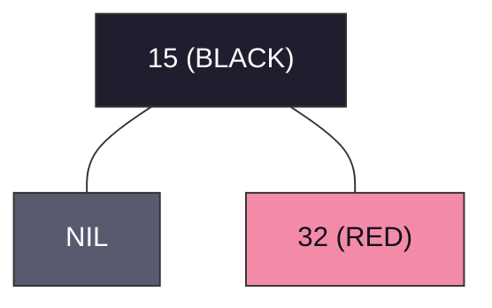

#### Step 3: Insert 20
- BST insertion: $20 > 15$ and $20 < 32 \implies$ Left child of 32.
- Color: $20$ is **RED**.
- **Violation:** Red-Red conflict between Parent 32 (RED) and Child 20 (RED).
- **Uncle Check:** Uncle of 20 is Left child of Grandparent 15 $\implies$ `NIL (BLACK)`.
- **Case Identification:** Uncle is BLACK and nodes form a **Triangle (RL)** configuration: Grandparent 15 $	o$ Right Child 32 $	o$ Left Child 20.
  - **Substep 3a (Case 2 - Rotate Parent to Line):** Right-Rotate around Parent 32.
    - 20 becomes Right child of 15; 32 becomes Right child of 20.
  - **Substep 3b (Case 3 - Line Shape RR):** Left-Rotate around Grandparent 15.
    - Recolor Parent 20 $	o$ **BLACK**.
    - Recolor Grandparent 15 $	o$ **RED**.

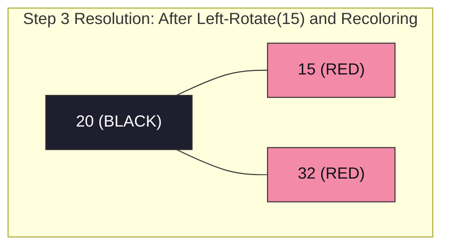

#### Step 4: Insert 4
- BST insertion: $4 < 20$ and $4 < 15 \implies$ Left child of 15.
- Color: $4$ is **RED**.
- **Violation:** Red-Red conflict between Parent 15 (RED) and Child 4 (RED).
- **Uncle Check:** Uncle of 4 is Right child of Grandparent 20 $\implies$ Node 32 is **RED**!
- **Case 1 (Uncle is RED $\implies$ Recoloring Only):**
  - Recolor Parent 15 $	o$ **BLACK**.
  - Recolor Uncle 32 $	o$ **BLACK**.
  - Recolor Grandparent 20 $	o$ **RED**.
  - Root Property Check: 20 is root $\implies$ Recolor 20 back to **BLACK**.

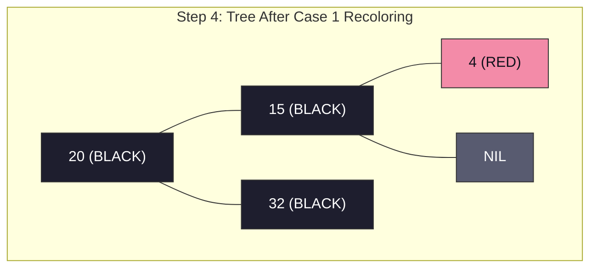

#### Step 5: Insert 12
- BST insertion: $12 < 20$, $12 < 15$, $12 > 4 \implies$ Right child of 4.
- Color: $12$ is **RED**.
- Check: Parent 4 is RED $\implies$ Red-Red Conflict!
- **Uncle Check:** Uncle of 12 is Right child of 15 $\implies$ `NIL (BLACK)`.
- **Case Identification:** Uncle is BLACK, Triangle (LR) shape (15 $	o$ 4 $	o$ 12).
  - **Substep 5a (Case 2 $	o$ Rotate Parent):** Left-Rotate around Parent 4 $\implies$ Line shape LL (15 $	o$ 12 $	o$ 4).
  - **Substep 5b (Case 3 $	o$ Rotate Grandparent & Recolor):** Right-Rotate around Grandparent 15.
    - Recolor 12 $	o$ **BLACK**.
    - Recolor 15 $	o$ **RED**.

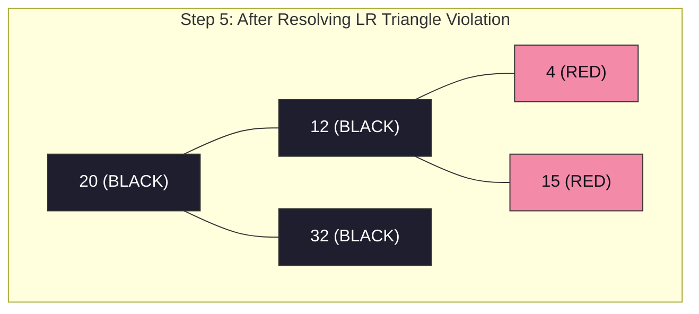

#### Step 6: Insert 25
- BST insertion: $25 > 20$, $25 < 32 \implies$ Left child of 32.
- Color: $25$ is **RED**.
- Check: Parent 32 is BLACK $\implies$ No violation! Black height preserved.

#### Step 7: Insert 7
- BST insertion: $7 < 20$, $7 < 12$, $7 > 4 \implies$ Right child of 4.
- Color: $7$ is **RED**.
- **Violation:** Parent 4 is RED, Child 7 is RED.
- **Uncle Check:** Uncle of 7 is Right child of 12 $\implies$ Node 15 is **RED**!
- **Case 1 (Uncle RED):**
  - Recolor Parent 4 $	o$ **BLACK**.
  - Recolor Uncle 15 $	o$ **BLACK**.
  - Recolor Grandparent 12 $	o$ **RED**.
  - Check Grandparent 12: Parent of 12 is 20 (BLACK) $\implies$ No further violation!

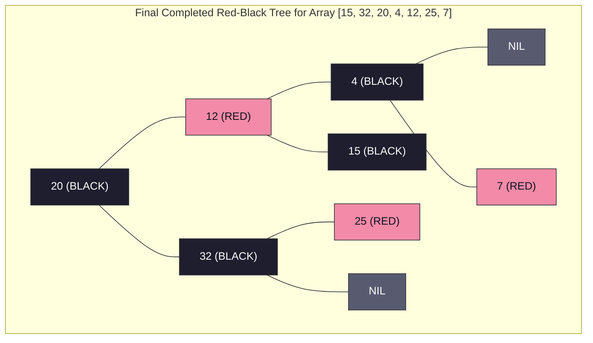

#### Black-Height Verification Matrix

| Path from Root (20) to Leaf | Nodes on Simple Path | Black Nodes Count | Path Black-Height ($bh$) | Property Valid? |
| :--- | :--- | :--- | :--- | :--- |
| Path 1 | $20 	o 12 	o 4 	o 	ext{NIL}$ | $20, 4, 	ext{NIL}$ | **2** (excluding root) | Valid |
| Path 2 | $20 	o 12 	o 4 	o 7 	o 	ext{NIL}$ | $20, 4, 	ext{NIL}$ | **2** (excluding root) | Valid |
| Path 3 | $20 	o 12 	o 15 	o 	ext{NIL}$ | $20, 15, 	ext{NIL}$ | **2** (excluding root) | Valid |
| Path 4 | $20 	o 32 	o 25 	o 	ext{NIL}$ | $20, 32, 	ext{NIL}$ | **2** (excluding root) | Valid |
| Path 5 | $20 	o 32 	o 	ext{NIL}$ | $20, 32, 	ext{NIL}$ | **2** (excluding root) | Valid |

---

### Part 2: Binomial Heap Construction Step-by-Step

We insert the same array $A = [15, 32, 20, 4, 12, 25, 7]$.
A Binomial Heap maintains a collection of binomial trees where no two trees share the same degree. Insertion is isomorphic to **binary addition**:


2885
	ext{Count } n = 7_{10} = 111_2 \implies 	ext{Final Heap must contain } B_2 + B_1 + B_0
2885


#### Step-by-Step State Transitions:

1. **Insert 15:**
   - Binary representation: $1_2 \implies B_0(15)$.
   - Forest: $\{ B_0(15) \}$.

2. **Insert 32:**
   - New single node: $B_0(32)$.
   - Binary representation: $2_{10} = 10_2$.
   - Conflict: Two $B_0$ trees ($B_0(15)$ and $B_0(32)$).
   - **Link Rule:** $\min(15, 32) = 15$. Node 32 becomes child of 15.
   - Resulting Tree: $B_1(15)$.
   - Forest: $\{ B_1(15) \}$.

3. **Insert 20:**
   - New node: $B_0(20)$.
   - Binary representation: $3_{10} = 11_2$.
   - Degrees present: Degree 0 and Degree 1. No conflict!
   - Forest: $\{ B_0(20), B_1(15) \}$.

4. **Insert 4:**
   - New node: $B_0(4)$.
   - Binary representation: $4_{10} = 100_2$ (triggers carry chain).
   - Collision 1: Two $B_0$ trees ($B_0(20)$ and $B_0(4)$).
     - $\min(4, 20) = 4 \implies 20$ links under $4 \implies B_1(4)$.
   - Collision 2: Two $B_1$ trees ($B_1(15)$ and $B_1(4)$).
     - $\min(4, 15) = 4 \implies 15$ links under $4 \implies B_2(4)$.
   - Forest: $\{ B_2(4) \}$.

5. **Insert 12:**
   - Binary: $5_{10} = 101_2$.
   - Forest: $\{ B_0(12), B_2(4) \}$.

6. **Insert 25:**
   - Binary: $6_{10} = 110_2$.
   - New $B_0(25)$ collides with $B_0(12)$:
     - $\min(12, 25) = 12 \implies 25$ links under $12 \implies B_1(12)$.
   - Forest: $\{ B_1(12), B_2(4) \}$.

7. **Insert 7:**
   - Binary: $7_{10} = 111_2$.
   - New node: $B_0(7)$.
   - No collisions!
   - Final Forest: $\{ B_0(7), B_1(12), B_2(4) \}$.

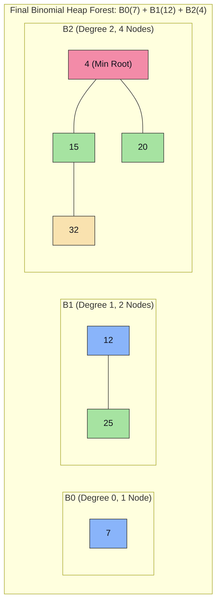

#### Extract-Min Execution on this Binomial Heap:
1. Scan root list roots $\{ 7, 12, 4 \} \implies 	ext{Minimum root is } 4$.
2. Remove root 4 from heap.
3. Children of 4 are $B_1(15)$ and $B_0(20)$.
4. Reverse children list to ascending degree order: $H'' = \{ B_0(20), B_1(15) \}$.
5. Remaining heap $H = \{ B_0(7), B_1(12) \}$.
6. Perform `Binomial-Heap-Union(H, H'')`:
   - Merge roots: $[B_0(7), B_0(20), B_1(12), B_1(15)]$.
   - Link $B_0(7)$ and $B_0(20) \implies B_1(7)$.
   - Link $B_1(7)$ and $B_1(12) \implies B_2(7)$.
   - Combine with $B_1(15) \implies$ Final heap after Extract-Min has $\{ B_1(15), B_2(7) \}$ (6 nodes $= 110_2$).

---

### Part 3: Fibonacci Heap Construction Step-by-Step

We insert the same array $A = [15, 32, 20, 4, 12, 25, 7]$.
Fibonacci Heaps use **lazy insertion**: new nodes are simply spliced into the circular doubly-linked root list in $O(1)$ amortized time without merging trees immediately.

#### Step 1: Sequential Insertion
- All 7 nodes are added directly to the circular root list:

2885
	ext{Root List: } [15 \leftrightarrow 32 \leftrightarrow 20 \leftrightarrow 4 \leftrightarrow 12 \leftrightarrow 25 \leftrightarrow 7]
2885

- The pointer `H.min` is updated on each insert:
  `H.min` points to **Node 4**.
- All node degrees $= 0$, `mark = FALSE`.

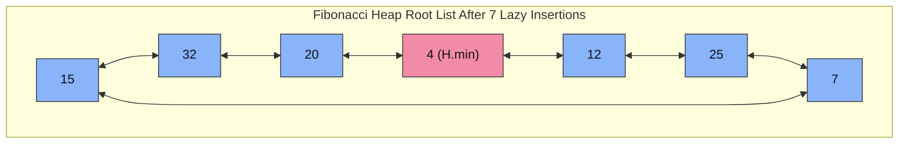

#### Step 2: Extract-Min & Degree Consolidation
1. Remove `H.min` (Node 4).
   - Node 4 has 0 children $\implies$ Root list now has 6 nodes: $[15, 32, 20, 12, 25, 7]$.
2. Initialize degree array: $D(n) \le \lfloor \log_\phi 6 
floor \implies A[0 \dots 2] = [	ext{NIL}, 	ext{NIL}, 	ext{NIL}]$.
3. Iterate through root list nodes:
   - **Node 15 (deg 0):** $A[0] = 	ext{NIL} \implies A[0] = 15$.
   - **Node 32 (deg 0):** $A[0]$ occupied by 15. Collision!
     - Link smaller root 15 with 32: 32 becomes child of $15 \implies$ Tree with root 15 has **degree 1**.
     - $A[0] = 	ext{NIL}$. $A[1]$ is empty $\implies A[1] = 15$.
   - **Node 20 (deg 0):** $A[0]$ empty $\implies A[0] = 20$.
   - **Node 12 (deg 0):** $A[0]$ occupied by 20. Collision!
     - Link: $\min(12, 20) = 12 \implies 20$ under $12 \implies$ Tree 12 has **degree 1**.
     - $A[0] = 	ext{NIL}$.
     - Check $A[1]$: $A[1]$ occupied by 15! Collision of degree 1 trees!
     - Link: $\min(12, 15) = 12 \implies 15$ under $12 \implies$ Tree 12 has **degree 2**.
     - $A[1] = 	ext{NIL}$. $A[2]$ is empty $\implies A[2] = 12$.
   - **Node 25 (deg 0):** $A[0]$ empty $\implies A[0] = 25$.
   - **Node 7 (deg 0):** $A[0]$ occupied by 25. Collision!
     - Link: $\min(7, 25) = 7 \implies 25$ under $7 \implies$ Tree 7 has **degree 1**.
     - $A[0] = 	ext{NIL}$. $A[1]$ is empty $\implies A[1] = 7$.
4. Reconstruction of root list:
   - Active roots in degree array: $A[1] = 7$, $A[2] = 12$.
   - New root list: $[7 \leftrightarrow 12]$.
   - `H.min` set to $\min(7, 12) = \mathbf{7}$.

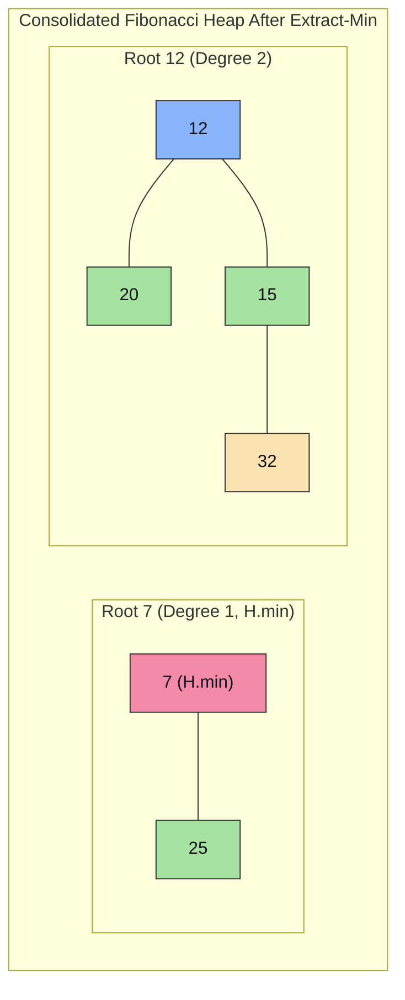

#### Step 3: Decrease-Key & Cascading Cut Demonstration
Suppose we call $	ext{Decrease-Key}(H, 	ext{Node } 32, 2)$:
1. Key 32 becomes **2**.
2. Violates min-heap property: Child $2 < 	ext{Parent } 15$.
3. **Cut:** Cut Node 2 from child list of 15, add 2 to root list, set $2.	ext{mark} = 	ext{FALSE}$.
4. **Cascading Cut on Parent 15:**
   - Check $15.	ext{mark}$:
     - If $15.	ext{mark} == 	ext{FALSE} \implies$ Set $15.	ext{mark} = 	ext{TRUE}$ (Node 15 has now lost its first child).
     - If Node 15 subsequently loses another child $\implies$ It will be cut immediately and moved to root list.
5. Update `H.min`: Since $2 < 7$, `H.min` now points to **Node 2**!

---

### Part 4: Master Performance & Complexity Matrix

| Operation | Standard Binary Heap | Binomial Heap (Worst-Case) | Fibonacci Heap (Amortized) | Red-Black Tree (Worst-Case) |
| :--- | :--- | :--- | :--- | :--- |
| **Make-Heap** | $\Theta(1)$ | $\Theta(1)$ | $\Theta(1)$ | $\Theta(1)$ |
| **Insert** | $O(\log n)$ | $O(\log n)$ | **$\Theta(1)$** | $O(\log n)$ |
| **Find-Min / Search** | $\Theta(1)$ | $O(\log n)$ or $O(1)^*$ | **$\Theta(1)$** | $O(\log n)$ |
| **Extract-Min / Delete** | $O(\log n)$ | $O(\log n)$ | $O(\log n)$ | $O(\log n)$ |
| **Decrease-Key** | $O(\log n)$ | $O(\log n)$ | **$\Theta(1)$** | $N/A$ (Update: $O(\log n)$) |
| **Union / Merge** | $\Theta(n)$ | $O(\log n)$ | **$\Theta(1)$** | $O(n)$ |
| **Space Complexity** | $\Theta(n)$ | $\Theta(n)$ | $\Theta(n)$ | $\Theta(n)$ |

$^*$ With auxiliary pointer tracking min root.
