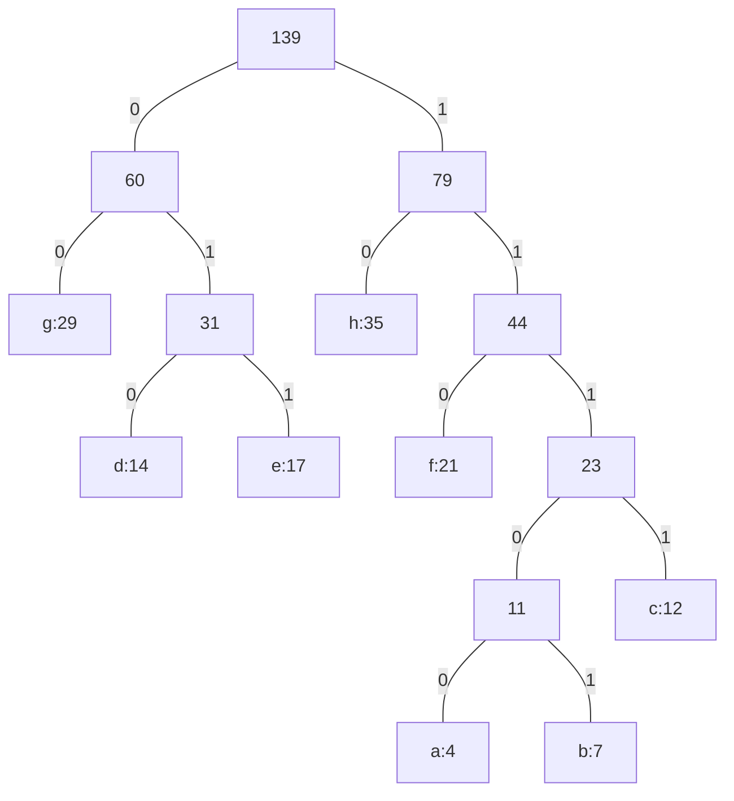
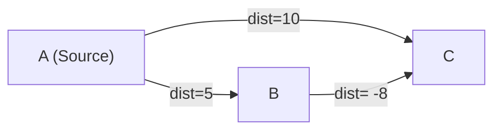

# Chapter 5: Greedy Algorithms & Optimization

> **Course Code:** 3CS501CC24
> **Focus:** Unit-V — Greedy Paradigm, Coin Change, Fractional Knapsack, Activity Selection, Job Scheduling, Huffman Coding, MST (Kruskal & Prim), Dijkstra's SSSP, Optimal Merge Patterns

---

## 1. Chapter Overview

The **Greedy Paradigm** builds solutions step-by-step via irrevocable locally-optimal choices.

**Learning Flow per Topic:**
> **Concept → Greedy Strategy → Algorithm → Comprehensive 10+ Step Trace → Complexity → 📝 Q&A**

| Problem | Greedy Criterion | Works? | Complexity | Operations Traced |
| :--- | :--- | :--- | :--- | :--- |
| **Coin Change** | Largest coin ≤ V | Canonical only | $O(V)$ | V=187 with 6 coin types |
| **Fractional Knapsack**| Max ratio $p/w$ | Always ✅ | $O(n \log n)$ | 10-item greedy selection table |
| **Activity Selection** | Earliest finish time | Always ✅ | $O(n \log n)$ | 11-activity scheduling trace |
| **Job Scheduling** | Max profit, latest slot | Always ✅ | $O(n^2)$ | 10-job deadline slotting |
| **Huffman Coding** | Min-frequency pair | Always ✅ | $O(n \log n)$ | 8-character full min-heap tree build |
| **Kruskal MST** | Min weight edge | Always ✅ | $O(E \log V)$ | 14-edge sorted processing trace |
| **Prim MST** | Min key to MST | Always ✅ | $O(E \log V)$ | 9-vertex key[] array progression |
| **Dijkstra SSSP** | Min tentative dist | Non-negative weights ✅ | $O(E \log V)$ | 9-vertex distance relaxation table |

---

## 2. What is a Greedy Algorithm?

A **Greedy Algorithm** makes the **locally optimal choice** at each step with the hope that these local choices accumulate into a **globally optimal solution**. It never backtracks.

### Two Required Properties
1. **Greedy Choice Property:** A global optimum can be reached by making local optimum choices.
2. **Optimal Substructure:** Optimal solution to the problem contains optimal solutions to sub-problems.

---

## 3. Problem 1: Coin Change Problem

**Problem:** Given amount $V$ and denominations $C = \{c_1 > c_2 > \cdots > c_n\}$, pay exactly $V$ using the **minimum number of coins**.
**Greedy Strategy:** Always choose the largest coin denomination $c_i \le V$.

### Comprehensive Trace: V = 187, Indian Currency System
Coins $C = \{500, 100, 50, 20, 10, 5, 2, 1\}$

| Step | Remaining V | Largest Coin $\le$ V | Action | New Remaining V | Running Coin List |
| :--- | :--- | :--- | :--- | :--- | :--- |
| 1 | 187 | 100 | Take 100 | 187 - 100 = 87 | {100} |
| 2 | 87 | 50 | Take 50 | 87 - 50 = 37 | {100, 50} |
| 3 | 37 | 20 | Take 20 | 37 - 20 = 17 | {100, 50, 20} |
| 4 | 17 | 10 | Take 10 | 17 - 10 = 7 | {100, 50, 20, 10} |
| 5 | 7 | 5 | Take 5 | 7 - 5 = 2 | {100, 50, 20, 10, 5} |
| 6 | 2 | 2 | Take 2 | 2 - 2 = 0 | {100, 50, 20, 10, 5, 2} |

**Result:** 6 coins. Since Indian Currency is canonical, this is guaranteed optimal.

### Counter-example (Non-Canonical)
Coins = {6, 4, 1}, V = 8.
- Greedy: Takes 6, then 1, then 1 → {6, 1, 1} (3 coins).
- Optimal: {4, 4} (2 coins). Greedy fails!

---

### 📝 Quick Practice — Coin Change

> **Q1:** How do we algorithmically check if a coin system is canonical?
> **Answer:** Pearson's algorithm can check if a coin system is canonical in $O(n^3)$ time. Without it, we must assume arbitrary systems are non-canonical and use Dynamic Programming ($O(V \cdot n)$ time) which tries all possibilities to guarantee the minimum coins.

---

## 4. Problem 2: Knapsack Problems

### Fractional Knapsack (Greedy Works ✅)
**Strategy:** Sort by **value-to-weight ratio** $r_i = p_i / w_i$ (descending). Fill greedily, taking fractions if needed.

### Comprehensive 10-Item Trace
Knapsack Capacity $W = 100$

| Item ID | Value ($p$) | Weight ($w$) | Ratio ($p/w$) | Sorted Rank | Action Taken | W Used | W Remaining | Profit Gained |
| :--- | :--- | :--- | :--- | :--- | :--- | :--- | :--- | :--- |
| I1 | 120 | 10 | **12.0** | 1 | Take 100% | 10 | 90 | +120.0 |
| I2 | 200 | 20 | **10.0** | 2 | Take 100% | 20 | 70 | +200.0 |
| I3 | 135 | 15 | **9.0** | 3 | Take 100% | 15 | 55 | +135.0 |
| I4 | 160 | 20 | **8.0** | 4 | Take 100% | 20 | 35 | +160.0 |
| I5 | 35 | 5 | **7.0** | 5 | Take 100% | 5 | 30 | +35.0 |
| I6 | 180 | 30 | **6.0** | 6 | Take 100% | 30 | 0 | +180.0 |
| I7 | 60 | 12 | **5.0** | 7 | Knapsack Full | 0 | 0 | 0 |
| I8 | 96 | 24 | **4.0** | 8 | Skipped | 0 | 0 | 0 |
| I9 | 45 | 15 | **3.0** | 9 | Skipped | 0 | 0 | 0 |
| I10| 40 | 20 | **2.0** | 10 | Skipped | 0 | 0 | 0 |

*(Note: In this specific trace, item 6 exactly filled the remaining capacity. If remaining was 15, we would take 15/30 = 50% of I6).*
**Total Value:** 830.0. **Time Complexity:** $O(n \log n)$ due to sorting.

### 0/1 Knapsack (Greedy Fails ❌)
If items cannot be split, the greedy ratio approach leaves empty wasted space. Dynamic Programming is required.

---

### 📝 Quick Practice — Knapsack

> **Q1:** Prove that the Fractional Knapsack greedy solution is optimal (exchange argument sketch).
> **Answer:** Suppose an optimal solution $O$ skips some capacity of item $i$ (high ratio) to include item $j$ (low ratio). By swapping a small weight $\epsilon$ from $j$ back to $i$, we preserve the total weight but increase the total value by $\epsilon(r_i - r_j) > 0$. This contradicts the assumption that $O$ was optimal. Thus, the greedy ratio order is strictly optimal.

---

## 5. Problem 3: Activity Selection

**Problem:** Given $n$ activities with start $s_i$ and finish $f_i$, find max mutually compatible activities.
**Greedy Strategy:** Sort activities by **finish time (ascending)**. Pick the first, then pick the next one that starts after the previous finished.

### Comprehensive 11-Activity Trace (CLRS Example)
Activities sorted by finish time $f_i$.

| i | 1 | 2 | 3 | 4 | 5 | 6 | 7 | 8 | 9 | 10 | 11 |
| :--- | :--- | :--- | :--- | :--- | :--- | :--- | :--- | :--- | :--- | :--- | :--- |
| **$s_i$** | 1 | 3 | 0 | 5 | 3 | 5 | 6 | 8 | 8 | 2 | 12 |
| **$f_i$** | 4 | 5 | 6 | 7 | 9 | 9 | 10| 11| 12| 14| 16 |

| Step | Activity | $s_i$ | $f_i$ | Current Time (Last Finish) | Compatible? ($s_i \ge$ Current) | Action |
| :--- | :--- | :--- | :--- | :--- | :--- | :--- |
| 1 | A1 | 1 | **4** | 0 | 1 $\ge$ 0 ✅ | **Selected**. Current Time = 4 |
| 2 | A2 | 3 | 5 | 4 | 3 $\ge$ 4 ❌ | Skipped |
| 3 | A3 | 0 | 6 | 4 | 0 $\ge$ 4 ❌ | Skipped |
| 4 | A4 | 5 | **7** | 4 | 5 $\ge$ 4 ✅ | **Selected**. Current Time = 7 |
| 5 | A5 | 3 | 9 | 7 | 3 $\ge$ 7 ❌ | Skipped |
| 6 | A6 | 5 | 9 | 7 | 5 $\ge$ 7 ❌ | Skipped |
| 7 | A7 | 6 | 10| 7 | 6 $\ge$ 7 ❌ | Skipped |
| 8 | A8 | 8 | **11**| 7 | 8 $\ge$ 7 ✅ | **Selected**. Current Time = 11 |
| 9 | A9 | 8 | 12| 11 | 8 $\ge$ 11 ❌ | Skipped |
| 10 | A10| 2 | 14| 11 | 2 $\ge$ 11 ❌ | Skipped |
| 11 | A11| 12| **16**| 11 | 12 $\ge$ 11 ✅ | **Selected**. Current Time = 16 |

**Selected Set:** {A1, A4, A8, A11}. Max activities = 4.

```mermaid
gantt
    title Activity Selection Timeline
    dateFormat  X
    axisFormat %s
    section Selected
    A1 (1-4) :done, a1, 1, 4
    A4 (5-7) :done, a4, 5, 7
    A8 (8-11) :done, a8, 8, 11
    A11 (12-16) :done, a11, 12, 16
    section Skipped
    A2 (3-5) :crit, 3, 5
    A3 (0-6) :crit, 0, 6
    A5 (3-9) :crit, 3, 9
    A6 (5-9) :crit, 5, 9
```

---

### 📝 Quick Practice — Activity Selection

> **Q1:** Why doesn't sorting by start time or shortest duration work?
> **Answer:** Sorting by start time fails if the first activity is extremely long, blocking all others. Sorting by shortest duration fails if a short activity overlaps the junction of two longer, non-overlapping activities (e.g., A(0-5), B(4-6), C(5-10). Shortest is B, which blocks both A and C, giving 1 activity instead of 2). Earliest finish time safely maximizes remaining time for future activities.

---

## 6. Problem 4: Job Sequencing with Deadlines

**Problem:** $n$ jobs, each taking 1 unit of time, with a deadline $d_i$ and profit $p_i$. Earn profit if completed before deadline. Maximize total profit.
**Greedy Strategy:** Sort jobs by **profit (descending)**. Assign each job to the **latest possible free slot** $\le$ its deadline.

### Comprehensive 10-Job Trace
Jobs sorted by descending profit. Max deadline = 6. Slots array = `[empty] × 6`.

| Job | Profit | Deadline | Target Slot (Deadline) | Action | Slot Array State [1..6] |
| :--- | :--- | :--- | :--- | :--- | :--- |
| J1 | 100 | 2 | Slot 2 | Free ✅ | `[_, J1, _, _, _, _]` |
| J2 | 80 | 4 | Slot 4 | Free ✅ | `[_, J1, _, J2, _, _]` |
| J3 | 75 | 3 | Slot 3 | Free ✅ | `[_, J1, J3, J2, _, _]` |
| J4 | 60 | 2 | Slot 2 | Taken → check 1. Free ✅ | `[J4, J1, J3, J2, _, _]` |
| J5 | 50 | 6 | Slot 6 | Free ✅ | `[J4, J1, J3, J2, _, J5]` |
| J6 | 45 | 4 | Slot 4 | Taken → check 3, 2, 1. All Taken ❌ | `[J4, J1, J3, J2, _, J5]` |
| J7 | 30 | 5 | Slot 5 | Free ✅ | `[J4, J1, J3, J2, J7, J5]` |
| J8 | 20 | 1 | Slot 1 | Taken. No earlier slots ❌ | `[J4, J1, J3, J2, J7, J5]` |
| J9 | 15 | 3 | Slot 3 | Taken → check 2, 1. All Taken ❌ | `[J4, J1, J3, J2, J7, J5]` |
| J10| 10 | 6 | Slot 6 | Taken → check 5..1. All Taken ❌ | `[J4, J1, J3, J2, J7, J5]` |

**Result:** Slots filled with {J4, J1, J3, J2, J7, J5}. **Total Profit:** 60 + 100 + 75 + 80 + 30 + 50 = **395**.
**Time Complexity:** $O(n^2)$ naive slot searching. Can be optimized to $O(n \log n)$ using Disjoint Sets to find the next available slot.

---

### 📝 Quick Practice — Job Sequencing

> **Q1:** Why assign jobs to the latest possible slot rather than the earliest?
> **Answer:** Assigning to the earliest slot wastes early time slots that might be needed by jobs with very tight, early deadlines. By placing jobs as late as possible, we reserve the earlier slots for jobs that have no flexibility.

---

## 7. Problem 5: Huffman Coding

<iframe src="huffman_visualizer.html" width="100%" height="600px" style="border:none; border-radius:12px; margin-bottom: 24px;"></iframe>

**Problem:** Given character frequencies, create a variable-length prefix code that minimizes total file size.
**Greedy Strategy:** Pick the **two nodes with the lowest frequencies**, merge them into a parent node with their sum, and place it back. Repeat until one tree remains.

### Comprehensive 8-Character Min-Heap Trace
Characters and Frequencies: `a:4, b:7, c:12, d:14, e:17, f:21, g:29, h:35` (Total = 139).
*Initial Min-Heap Size: 8.*

| Step | Action (Extract 2 mins, Insert sum) | Min-Heap State (Nodes/Subtrees) |
| :--- | :--- | :--- |
| 0 | Initial State | `{a:4, b:7, c:12, d:14, e:17, f:21, g:29, h:35}` |
| 1 | Extract 4, 7. Merge → N1=11 | `{N1:11, c:12, d:14, e:17, f:21, g:29, h:35}` |
| 2 | Extract 11, 12. Merge → N2=23 | `{d:14, e:17, f:21, N2:23, g:29, h:35}` |
| 3 | Extract 14, 17. Merge → N3=31 | `{f:21, N2:23, g:29, N3:31, h:35}` |
| 4 | Extract 21, 23. Merge → N4=44 | `{g:29, N3:31, h:35, N4:44}` |
| 5 | Extract 29, 31. Merge → N5=60 | `{h:35, N4:44, N5:60}` |
| 6 | Extract 35, 44. Merge → N6=79 | `{N5:60, N6:79}` |
| 7 | Extract 60, 79. Merge → Root=139 | `{Root:139}` |

#### Final Huffman Tree Diagram
*Left child = 0, Right child = 1*

#### Code Assignments & Cost
| Char | Freq | Code (Path from Root) | Length | Total Bits (Freq × Len) |
| :--- | :--- | :--- | :--- | :--- |
| a | 4 | 11100 | 5 | 20 |
| b | 7 | 11101 | 5 | 35 |
| c | 12 | 1111 | 4 | 48 |
| d | 14 | 010 | 3 | 42 |
| e | 17 | 011 | 3 | 51 |
| f | 21 | 110 | 3 | 63 |
| g | 29 | 00 | 2 | 58 |
| h | 35 | 10 | 2 | 70 |

**Total Size:** 387 bits. Fixed-length (3 bits for 8 chars) = $139 \times 3 = 417$ bits. Compression achieved!

---

### 📝 Quick Practice — Huffman Coding

> **Q1:** What makes a code a "prefix code", and why is it required?
> **Answer:** A prefix code guarantees that no codeword is a prefix of another (e.g., if '0' is a code, no other code can start with '0'). This is required so the binary string can be unambiguously decoded from left to right without needing spaces or delimiters. In the Huffman tree, characters are strictly at the leaves, ensuring the prefix property.

---

## 8. Graph Algorithms Overview

Given a connected, undirected/directed graph $G = (V, E)$.

| Algorithm | Goal | Data Structures | Complexity |
| :--- | :--- | :--- | :--- |
| **Kruskal's** | Minimum Spanning Tree (MST) | Sort Edges + Disjoint Set | $O(E \log E)$ |
| **Prim's** | Minimum Spanning Tree (MST) | Min-Priority Queue | $O(E \log V)$ |
| **Dijkstra's** | Single-Source Shortest Path | Min-Priority Queue | $O(E \log V)$ |

---

## 9. Kruskal's MST Algorithm

**Greedy Strategy:** Sort all edges by weight. Iteratively add the minimum weight edge to the MST **unless it forms a cycle**.

### Comprehensive 14-Edge Trace
Vertices: 9 (A-I). Edges: 14.
DSU (Disjoint Set) prevents cycles: `UNION` if `FIND(u) != FIND(v)`.

| Step | Edge | Weight | DSU Check: FIND(u) == FIND(v)? | Action |
| :--- | :--- | :--- | :--- | :--- |
| 1 | (H, G) | 1 | No cycle (Set H ≠ Set G) | **Accept** ✅. UNION(H, G) |
| 2 | (I, C) | 2 | No cycle | **Accept** ✅. UNION(I, C) |
| 3 | (G, F) | 2 | No cycle | **Accept** ✅. UNION(G, F) |
| 4 | (A, B) | 4 | No cycle | **Accept** ✅. UNION(A, B) |
| 5 | (C, F) | 4 | No cycle (Set {I,C} ≠ Set {H,G,F}) | **Accept** ✅. UNION(C, F) |
| 6 | (I, G) | 6 | Cycle! I and G both in {H,G,F,C,I} | Reject ❌ |
| 7 | (C, D) | 7 | No cycle | **Accept** ✅. UNION(C, D) |
| 8 | (A, H) | 8 | No cycle | **Accept** ✅. UNION(A, H) |
| 9 | (B, C) | 8 | Cycle! B and C both in massive set | Reject ❌ |
| 10| (D, E) | 9 | No cycle | **Accept** ✅. UNION(D, E) |
| 11| (E, F) | 10| Cycle! E and F already connected | Reject ❌ |
| 12| (B, H) | 11| Cycle! | Reject ❌ |
| 13| (D, F) | 14| Cycle! | Reject ❌ |
| 14| (A, I) | 15| Cycle! | Reject ❌ |

**Termination:** 8 edges added (V-1). MST complete! Total Weight = 1 + 2 + 2 + 4 + 4 + 7 + 8 + 9 = **37**.

---

### 📝 Quick Practice — Kruskal's

> **Q1:** If there are multiple edges with the exact same weight, does Kruskal's output a unique MST?
> **Answer:** No, the MST is not necessarily unique if edge weights are not strictly distinct. Kruskal's might pick tie-breaking edges in any order depending on the sorting algorithm. However, the *total weight* of any valid MST will always be identical and minimum.

---

## 10. Prim's MST Algorithm

**Greedy Strategy:** Grow a single tree from a starting vertex. Always add the minimum weight edge that connects a vertex IN the tree to a vertex OUTSIDE the tree.

### Comprehensive 9-Vertex Trace
Same graph as above. Start at vertex **A**.
`key[]`: Min edge weight connecting vertex to tree (initially $\infty$). `MST`: Is vertex in tree?

| Step | Extract Min (`u`) | `MST` Array | Relax Neighbors of `u` (Update `key` if smaller) |
| :--- | :--- | :--- | :--- |
| Init | — | Empty | `key[A]=0`, rest $\infty$ |
| 1 | **A** (key=0) | {A} | B: $\infty \to 4$, H: $\infty \to 8$, I: $\infty \to 15$ |
| 2 | **B** (key=4) | {A, B} | C: $\infty \to 8$, H: $8 \to 8$ (no change) |
| 3 | **C** (key=8) | {A, B, C} | I: $15 \to 2$, F: $\infty \to 4$, D: $\infty \to 7$ |
| 4 | **I** (key=2) | {A..I} | G: $\infty \to 6$ |
| 5 | **F** (key=4) | {A..F} | G: $6 \to 2$, E: $\infty \to 10$, D: $7 \to 7$ |
| 6 | **G** (key=2) | {A..G} | H: $8 \to 1$ |
| 7 | **H** (key=1) | {A..H} | No new smaller edges. |
| 8 | **D** (key=7) | {A..D} | E: $10 \to 9$ |
| 9 | **E** (key=9) | All V! | Done. |

Sum of final keys: 0(A) + 4(B) + 8(C) + 2(I) + 4(F) + 2(G) + 1(H) + 7(D) + 9(E) = **37**. Matches Kruskal's!

---

### 📝 Quick Practice — Prim's

> **Q1:** How does Prim's implementation differ between dense and sparse graphs?
> **Answer:** For sparse graphs ($E \ll V^2$), use a Binary Min-Heap (or Fibonacci Heap). Finding minimum takes $O(\log V)$, giving $O(E \log V)$. For very dense graphs ($E \approx V^2$), a simple unsorted array for the `key[]` array is faster! Scanning the array takes $O(V)$, so total time is $O(V^2)$, which is better than $O(E \log V) = O(V^2 \log V)$.

---

## 11. Dijkstra's SSSP Algorithm

**Problem:** Single-Source Shortest Path. Find minimum distance from source `S` to all other vertices.
**Greedy Strategy:** Pick unvisited vertex with smallest tentative distance. Relax all its outgoing edges. (Cannot handle negative edge weights!).

### Comprehensive 9-Vertex Trace
Graph with directed edges. Start = **S**.
`dist[]`: Shortest path estimate.

| Step | Extract Min (`u`) | `dist[u]` | Relax Outgoing Edges (`v`: old $\to$ new) | Unvisited Queue State (Current Mins) |
| :--- | :--- | :--- | :--- | :--- |
| Init | — | — | — | {S:0, A:$\infty$, B:$\infty$, C:$\infty$, D:$\infty$, E:$\infty$, F:$\infty$, G:$\infty$, H:$\infty$} |
| 1 | **S** | 0 | A: $\infty \to 4$, B: $\infty \to 8$ | {A:4, B:8, rest:$\infty$} |
| 2 | **A** | 4 | B: $8 \to 8$, C: $\infty \to 12$ (4+8) | {B:8, C:12, rest:$\infty$} |
| 3 | **B** | 8 | C: $12 \to 10$ (8+2), D: $\infty \to 14$ (8+6) | {C:10, D:14, rest:$\infty$} |
| 4 | **C** | 10 | E: $\infty \to 15$ (10+5), F: $\infty \to 17$ (10+7) | {D:14, E:15, F:17, rest:$\infty$} |
| 5 | **D** | 14 | F: $17 \to 16$ (14+2) | {E:15, F:16, rest:$\infty$} |
| 6 | **E** | 15 | G: $\infty \to 24$ (15+9) | {F:16, G:24, rest:$\infty$} |
| 7 | **F** | 16 | G: $24 \to 19$ (16+3), H: $\infty \to 26$ (16+10) | {G:19, H:26} |
| 8 | **G** | 19 | H: $26 \to 21$ (19+2) | {H:21} |
| 9 | **H** | 21 | None | {} (Empty) |

**Final Distances from S:** A=4, B=8, C=10, D=14, E=15, F=16, G=19, H=21.

### Why Dijkstra Fails with Negative Weights

1. Visit A. Update B=5, C=10.
2. Extract Min → B (5). Relax B→C. C=10 becomes 5 + (-8) = -3. Update C=-3.
3. If C was already extracted (say we visited C before B because of other edge weights), Dijkstra **does not revisit extracted nodes**, locking in a wrong distance. Negative weights destroy the greedy assumption that "path distances strictly monotonically increase."

---

### 📝 Quick Practice — Dijkstra's

> **Q1:** If Dijkstra's fails on negative weights, what algorithm should be used instead, and what is its complexity?
> **Answer:** Bellman-Ford algorithm. It handles negative weights and can detect negative-weight cycles. It works by relaxing all edges $V-1$ times. Its complexity is $O(V \cdot E)$, which is slower than Dijkstra's $O(E \log V)$.

---

## 12. Problem 9: Optimal Merge Patterns

**Problem:** Merge $n$ sorted files into 1 file. Cost to merge two files is the sum of their sizes. Minimize total merge cost.
**Greedy Strategy:** Exact same as Huffman Coding — always merge the two smallest files using a Min-Heap.

### Worked Example Trace
File sizes: `[10, 20, 30, 40, 50]`

| Step | Extract 2 Mins | Merge Cost | Insert Back | Heap State |
| :--- | :--- | :--- | :--- | :--- |
| 1 | 10, 20 | 30 | 30 | {30, 30, 40, 50} |
| 2 | 30, 30 | 60 | 60 | {40, 50, 60} |
| 3 | 40, 50 | 90 | 90 | {60, 90} |
| 4 | 60, 90 | 150 | 150 | {150} |

**Total Merge Cost:** 30 + 60 + 90 + 150 = **330**.

---

## 13. Exam-Oriented Review

1. **Coin Change:** Give an example of a coin system and an amount $V$ where the greedy algorithm fails to find the minimum number of coins. Show both the greedy output and the optimal output.
2. **Knapsack:** Solve the Fractional Knapsack problem for $W=60$ and items: (v=100, w=20), (v=120, w=30), (v=50, w=10), (v=90, w=15). Trace the 4 steps.
3. **Activity Selection:** Given activities with start/finish times: (1,4), (3,5), (0,6), (5,7), (3,8), (5,9), (6,10), (8,11), (8,12), (2,13), (12,14). Sort them and trace the greedy selection.
4. **Job Sequencing:** Given 7 jobs with (profit, deadline): J1(35,3), J2(30,4), J3(25,4), J4(20,2), J5(15,3), J6(12,1), J7(5,2). Find the optimal schedule and max profit.
5. **Huffman Coding:** Build the Huffman tree for characters with frequencies: a:5, b:9, c:12, d:13, e:16, f:45. What is the code for 'd'?
6. **Kruskal vs Prim:** Trace both algorithms on a 6-vertex, 10-edge graph. Prove they yield the exact same MST total weight.
7. **Dijkstra's:** Trace Dijkstra's algorithm on a graph. Show the `dist[]` array updates at each step. Provide a small 3-vertex counter-example showing why it fails with negative weights.
