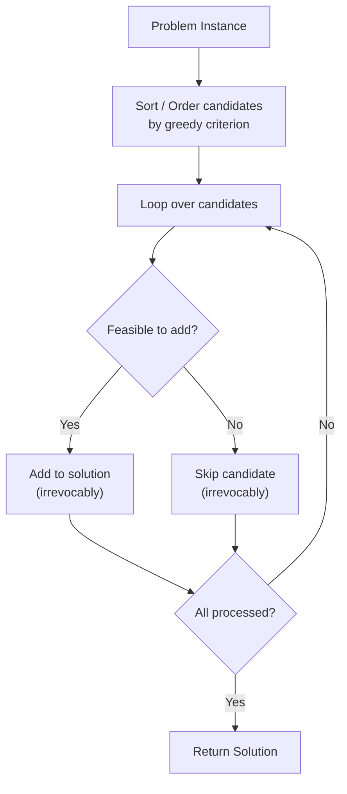
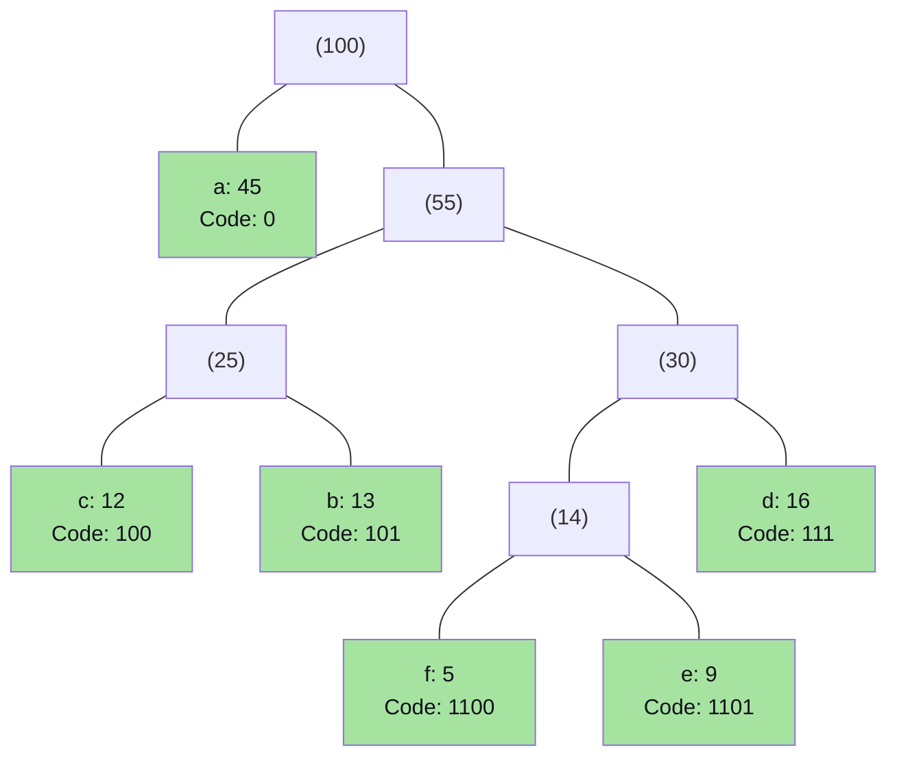
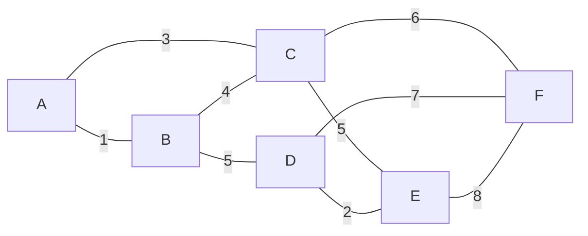
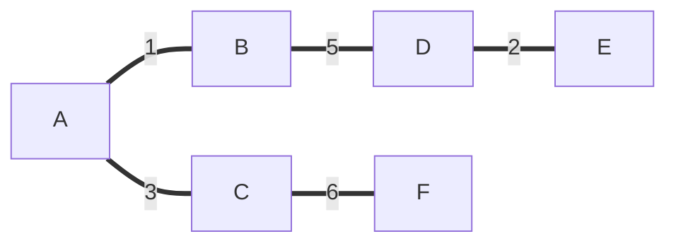
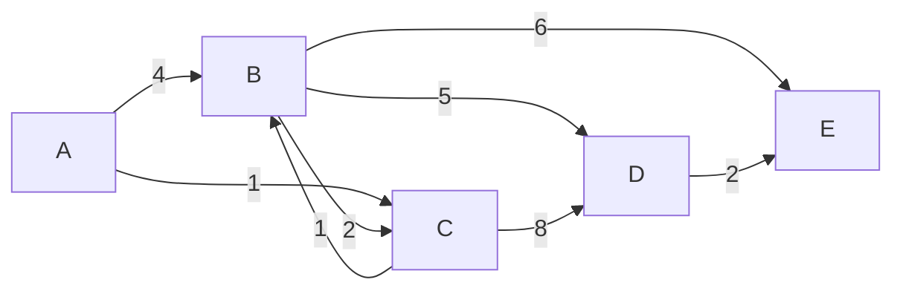

# Chapter 5: Greedy Algorithms & Optimization

> **Course Code:** 3CS501CC24
> **Focus:** Unit-V — Greedy Paradigm, Coin Change, Fractional Knapsack, Activity Selection, Job Scheduling, Huffman Coding, MST (Kruskal & Prim), Dijkstra's SSSP, Optimal Merge Patterns

---

## 1. Chapter Overview

The **Greedy Paradigm** builds solutions step-by-step via irrevocable locally-optimal choices.

**Learning Flow per Topic:**
> Concept → Greedy Strategy → Algorithm → Worked Example → Complexity → 📝 Q&A

| Problem | Greedy Criterion | Works? | Complexity |
| :--- | :--- | :--- | :--- |
| Coin Change | Largest coin ≤ V | Canonical only | $O(V)$ |
| Fractional Knapsack | Max ratio $p/w$ | Always ✅ | $O(n \log n)$ |
| 0/1 Knapsack | N/A | ❌ Fails | $O(n \cdot W)$ via DP |
| Activity Selection | Earliest finish time | Always ✅ | $O(n \log n)$ |
| Job Scheduling | Max profit, latest slot | Always ✅ | $O(n^2)$ |
| Huffman Coding | Min-frequency pair | Always ✅ | $O(n \log n)$ |
| Kruskal MST | Min weight edge | Always ✅ | $O(E \log V)$ |
| Prim MST | Min key to MST | Always ✅ | $O(E \log V)$ |
| Dijkstra SSSP | Min tentative dist | Non-negative weights ✅ | $O(E \log V)$ |
| Optimal Merge | Min two file sizes | Always ✅ | $O(n \log n)$ |

---

## 2. What is a Greedy Algorithm?

### Definition

A **Greedy Algorithm** makes the **locally optimal choice** at each step with the hope that these local choices accumulate into a **globally optimal solution**.

### Two Required Properties

| Property | Meaning |
| :--- | :--- |
| **Greedy Choice Property** | A globally optimal solution can be reached by making locally optimal (greedy) choices — no need to look ahead or reconsider |
| **Optimal Substructure** | An optimal solution to the overall problem contains optimal solutions to its sub-problems |

### Greedy Algorithm General Structure



### Greedy vs. Dynamic Programming

| Feature | Greedy | DP |
| :--- | :--- | :--- |
| **Decision order** | Makes choice FIRST, then solves one subproblem | Solves all subproblems FIRST, then picks best |
| **Subproblems** | Considers only one path | Considers all overlapping subproblems |
| **Commitment** | Irrevocable — no backtracking | Flexible — evaluates all combinations |
| **Optimality** | Only if Greedy Choice Property holds | Always optimal if conditions hold |
| **Speed** | Usually $O(n \log n)$ | Usually $O(n^2)$ or $O(n \cdot W)$ |

---

## 3. Problem 1: Coin Change Problem

### Problem Statement

Given amount $V$ and coin denominations $C = \{c_1 > c_2 > \cdots > c_n\}$, pay exactly $V$ using the **minimum number of coins**. Unlimited supply of each coin.

### Greedy Strategy

**Always choose the largest coin denomination $c_i \le V$**, subtract it, repeat.

### Algorithm

```text
GREEDY-COIN-CHANGE(C, V):
    Sort C in descending order
    coinList = []
    for each coin c in C:
        while V ≥ c:
            coinList.append(c)
            V = V - c
    if V == 0: return coinList
    else: return "No exact change possible"
```

### When Greedy Works vs. Fails

**Works — Canonical Systems** (e.g., US coins {25, 10, 5, 1}):

**Example:** $V = 41$ using {25, 10, 5, 1}

| Step | Coin Chosen | Remaining V |
| :--- | :--- | :--- |
| 1 | 25 | 16 |
| 2 | 10 | 6 |
| 3 | 5 | 1 |
| 4 | 1 | 0 ✅ |

Result: {25, 10, 5, 1} → **4 coins** (optimal)

**Fails — Non-Canonical Systems:**

**Example:** $C = \{6, 4, 1\}$, $V = 8$

- **Greedy:** Takes 6 (remaining = 2), then two 1s → **3 coins** {6,1,1}
- **Optimal (DP):** Takes two 4s → **2 coins** {4,4} ✅
- **Conclusion:** Greedy is suboptimal here!

### Complexity: $O(V)$ (making change), $O(n \log n)$ for sorting coins

---

### 📝 Quick Practice — Coin Change

> **Q1:** Given coins {10, 6, 1} and $V = 12$. Show that greedy gives a suboptimal answer and find the optimal.
>
> **Answer:**
> - **Greedy:** Take 10 (remaining = 2), take two 1s → {10, 1, 1} = **3 coins**
> - **Optimal:** Take two 6s → {6, 6} = **2 coins** ✅
> - Greedy fails because 10 + small coins wastes capacity that {6,6} fills perfectly.

> **Q2:** For which type of coin systems is greedy always optimal? Give the formal property.
>
> **Answer:** Greedy is optimal for **canonical coin systems**. The formal property: a coin system $C$ is canonical if the greedy algorithm yields the minimum number of coins for *every* amount $V$. All standard national currency systems (US, Indian, EU) are canonical. Arbitrary coin sets are often non-canonical, requiring DP ($O(V \cdot |C|)$ time).

---

## 4. Problem 2: Knapsack Problems

### Fractional Knapsack (Greedy Works ✅)

**Problem:** $n$ items with weight $w_i$ and value $p_i$. Knapsack capacity $W$. Items **can be fractioned** ($x_i \in [0,1]$). Maximize $\sum x_i p_i$ subject to $\sum x_i w_i \le W$.

**Greedy Strategy:** Sort by **value-to-weight ratio** $r_i = p_i / w_i$ (descending). Fill greedily.

**Worked Example:** $W = 50$

| Item | $p_i$ | $w_i$ | $r_i = p/w$ | Action | Remaining W |
| :--- | :--- | :--- | :--- | :--- | :--- |
| Item 1 | 60 | 10 | **6.0** | Take 100% | 40 |
| Item 2 | 100 | 20 | **5.0** | Take 100% | 20 |
| Item 3 | 120 | 30 | **4.0** | Take 20/30 = **2/3** fraction | 0 |

**Total Value:** $60 + 100 + \frac{2}{3} \times 120 = 60 + 100 + 80 = \mathbf{240}$ ✅

**Time Complexity:** $O(n \log n)$ (sorting dominates)

**Why greedy is optimal:** Proof by exchange argument — if any item with a lower ratio is taken before a higher-ratio item, swapping improves total value. Thus taking in descending ratio order is optimal.

---

### 0/1 Knapsack (Greedy Fails ❌)

**Problem:** Same as above but $x_i \in \{0, 1\}$ — items cannot be split.

**Counterexample** (same items, $W = 50$):

| Strategy | Items Taken | Weight | Value |
| :--- | :--- | :--- | :--- |
| **Greedy by ratio** | Item 1 (w=10) + Item 2 (w=20) | 30 | 160 (wasted 20 capacity!) |
| **Optimal (DP)** | Item 2 (w=20) + Item 3 (w=30) | 50 | **220** ✅ |

**Conclusion:** Greedy fails for 0/1 Knapsack because it can leave unused capacity. Use **Dynamic Programming** ($O(n \cdot W)$ time).

---

### 📝 Quick Practice — Knapsack

> **Q1:** For Fractional Knapsack with $W=10$, items: A(value=8, weight=4), B(value=6, weight=3), C(value=5, weight=5). Trace the greedy algorithm.
>
> **Answer:** Ratios: A = 8/4 = **2.0**, B = 6/3 = **2.0**, C = 5/5 = **1.0**. (Tie between A and B, take A first.)
> - Take A fully: W used = 4, value = 8, remaining W = 6
> - Take B fully: W used = 3, value = 6, remaining W = 3
> - Take C fraction: 3/5 of C, value = 3, remaining W = 0
> - **Total:** 8 + 6 + 3 = **17**

> **Q2:** Prove that the Fractional Knapsack greedy solution is optimal (exchange argument sketch).
>
> **Answer:** Suppose a greedy solution $G$ and optimal solution $O$ differ. Find the first position where they differ: $O$ includes more of item $j$ with a lower ratio at the cost of less of item $i$ with a higher ratio ($r_i > r_j$). Swapping: increase item $i$ by $\epsilon$, decrease item $j$ by $\epsilon \cdot w_i/w_j$ — this doesn't violate capacity but increases value by $\epsilon(r_i - r_j) > 0$. Contradiction: $O$ wasn't optimal. Hence greedy is optimal.

---

## 5. Problem 3: Activity Selection Problem

### Problem Statement

Given $n$ activities with start times $s_i$ and finish times $f_i$. Find the **maximum number of mutually compatible activities** (no two overlap: activity $i$ and $j$ are compatible if $s_i \ge f_j$ or $s_j \ge f_i$).

### Greedy Strategy

**Sort by finish time (earliest first). Always pick the next compatible activity.**

Why earliest-finish greedy? By finishing early, we leave maximum remaining time for future activities — provably optimal.

### Algorithm

```text
ACTIVITY-SELECTION(s, f):
    Sort activities by finish time: f[1] ≤ f[2] ≤ ... ≤ f[n]
    A = {a₁}            ← always take the first (earliest-finishing) activity
    k = 1               ← index of last selected activity
    for i = 2 to n:
        if s[i] ≥ f[k]:
            A = A ∪ {aᵢ}
            k = i
    return A
```

### Worked Example

Activities (sorted by finish time):

| Activity | Start $s$ | Finish $f$ | Compatible with last? |
| :--- | :--- | :--- | :--- |
| $a_1$ | 1 | **4** | — (first, always take) ✅ |
| $a_2$ | 3 | **5** | $s_2 = 3 < f_1 = 4$ ❌ skip |
| $a_3$ | 0 | **6** | $s_3 = 0 < f_1 = 4$ ❌ skip |
| $a_4$ | 5 | **7** | $s_4 = 5 \ge f_1 = 4$ ✅ take |
| $a_5$ | 3 | **8** | $s_5 = 3 < f_4 = 7$ ❌ skip |
| $a_6$ | 5 | **9** | $s_6 = 5 < f_4 = 7$ ❌ skip |
| $a_7$ | 6 | **10** | $s_7 = 6 < f_4 = 7$ ❌ skip |
| $a_8$ | 8 | **11** | $s_8 = 8 \ge f_4 = 7$ ✅ take |
| $a_9$ | 8 | **12** | $s_9 = 8 \ge f_4 = 7$ but $f_8 = 11$ selected before → $s_9 = 8 < 11$ ❌ skip |
| $a_{10}$ | 2 | **13** | $s_{10} < f_8 = 11$ ❌ skip |
| $a_{11}$ | 12 | **14** | $s_{11} = 12 \ge f_8 = 11$ ✅ take |

**Selected:** $\{a_1, a_4, a_8, a_{11}\}$ — **4 activities** ✅

### Gantt Chart Visualization

```
Time:   0    1    2    3    4    5    6    7    8    9   10   11   12   13   14
        |    |    |    |    |    |    |    |    |    |    |    |    |    |    |

a₁  ✅  [==========]                                                       [1→4]
a₂      [  skip  ]============]                                             [3→5]
a₄  ✅                       [===========]                                 [5→7]
a₈  ✅                                   [============]                    [8→11]
a₁₁ ✅                                                    [===========]   [12→14]
```

**Key insight:** The selected activities (✅) never overlap — each starts after the previous ends.

### Complexity: $O(n \log n)$ for sorting + $O(n)$ for selection = $O(n \log n)$ overall

---

### 📝 Quick Practice — Activity Selection

> **Q1:** Why doesn't sorting by **start time** (earliest start) give optimal results?
>
> **Answer:** Counterexample: Activities $\{[1,10], [2,3], [4,5]\}$. Earliest-start: pick $[1,10]$ first (starts at 1). This blocks both $[2,3]$ and $[4,5]$. Result: **1 activity**. Earliest-finish: pick $[2,3]$, then $[4,5]$. Result: **2 activities** — optimal!

> **Q2:** Activities: $\{(1,3), (2,5), (4,6), (6,8), (5,9), (8,10)\}$. Apply the greedy algorithm and show selected set.
>
> **Answer:** Sort by finish: $(1,3), (2,5), (4,6), (5,9), (6,8), (8,10)$ → after stable sort by finish: $(1,3), (2,5), (4,6), (6,8), (5,9), (8,10)$.
> - Take $(1,3)$ [k=3]. Next: $(2,5)$: $2 < 3$ ❌. $(4,6)$: $4 \ge 3$ ✅ take [k=6]. Next: $(6,8)$: $6 \ge 6$ ✅ take [k=8]. Next: $(5,9)$: $5 < 8$ ❌. $(8,10)$: $8 \ge 8$ ✅ take.
> - **Selected:** $\{(1,3), (4,6), (6,8), (8,10)\}$ — **4 activities**.

---

## 6. Problem 4: Job Scheduling with Deadlines

### Problem Statement

$n$ jobs, each takes **1 time unit**, has **profit** $p_i > 0$, **deadline** $d_i \ge 1$. Job $i$ earns profit if and only if completed by time $d_i$. Single processor — maximize total profit.

### Greedy Strategy

1. Sort jobs by **profit (descending)**
2. Create time slots $[1, 2, \ldots, D_{max}]$
3. For each job (high profit first): place in the **latest available free slot** $\le d_i$

### Worked Example

| Job | Profit | Deadline |
| :--- | :--- | :--- |
| $J_1$ | 20 | 2 |
| $J_2$ | 15 | 2 |
| $J_3$ | 10 | 1 |
| $J_4$ | 5 | 3 |
| $J_5$ | 1 | 3 |

**Available slots:** [1, 2, 3] (max deadline = 3)

| Job (by profit) | Deadline | Latest Free Slot ≤ d | Action | Slots State |
| :--- | :--- | :--- | :--- | :--- |
| $J_1$ (profit=20) | 2 | Slot 2 free | Assign slot 2 ✅ | `[_, J₁, _]` |
| $J_2$ (profit=15) | 2 | Slot 2 taken; Slot 1 free | Assign slot 1 ✅ | `[J₂, J₁, _]` |
| $J_3$ (profit=10) | 1 | Slot 1 taken | Reject ❌ | `[J₂, J₁, _]` |
| $J_4$ (profit=5) | 3 | Slot 3 free | Assign slot 3 ✅ | `[J₂, J₁, J₄]` |
| $J_5$ (profit=1) | 3 | All slots ≤ 3 taken | Reject ❌ | `[J₂, J₁, J₄]` |

**Schedule:** Time 1: $J_2$ → Time 2: $J_1$ → Time 3: $J_4$
**Total Profit:** $15 + 20 + 5 = \mathbf{40}$

### Complexity: $O(n^2)$ naive, $O(n \log n)$ with Disjoint Set

---

### 📝 Quick Practice — Job Scheduling

> **Q1:** Jobs: $J_1(100, d=2), J_2(19, d=1), J_3(27, d=2), J_4(25, d=1), J_5(15, d=3)$. Find optimal schedule.
>
> **Answer:** Sort by profit: $J_1(100, d=2), J_3(27, d=2), J_4(25, d=1), J_2(19, d=1), J_5(15, d=3)$. Slots: [1,2,3].
> - $J_1$, d=2: Latest free ≤ 2 = slot 2 ✅ → `[_, J1, _]`
> - $J_3$, d=2: Slot 2 taken; slot 1 free ✅ → `[J3, J1, _]`
> - $J_4$, d=1: Slot 1 taken ❌ reject
> - $J_2$, d=1: Slot 1 taken ❌ reject
> - $J_5$, d=3: Slot 3 free ✅ → `[J3, J1, J5]`
> - **Total Profit:** 27 + 100 + 15 = **142**

> **Q2:** Why do we assign to the **latest available free slot ≤ deadline** rather than the earliest?
>
> **Answer:** Assigning to the earliest slot would "use up" early slots that might be needed by future lower-profit jobs with tight (early) deadlines. By assigning to the latest slot ≤ deadline, we preserve early slots for jobs that strictly need them. This greedy invariant ensures we never unnecessarily block high-priority slots.

---

## 7. Problem 5: Huffman Coding

### Problem Statement

Given character frequencies, generate **optimal prefix-free variable-length binary codes** where frequent characters get shorter codes.

**Why prefix-free?** No codeword is a prefix of another → unambiguous decoding.

### Greedy Strategy (Min-Priority Queue)

**Always merge the two lowest-frequency nodes into a new internal node.**

### Algorithm

```text
HUFFMAN(f):
    Q = min-priority-queue of all characters as leaf nodes (keyed by frequency)
    while |Q| > 1:
        x = EXTRACT-MIN(Q)       ← lowest frequency
        y = EXTRACT-MIN(Q)       ← second lowest frequency
        z = NEW-NODE()
        z.left = x, z.right = y
        z.freq = x.freq + y.freq
        INSERT(Q, z)
    return EXTRACT-MIN(Q)        ← root of Huffman tree
```

### Worked Example

**Characters:** $a:45,\ b:13,\ c:12,\ d:16,\ e:9,\ f:5$

**Step-by-Step Min-Heap State:**

| Step | Queue State (freq:node) | Action |
| :--- | :--- | :--- |
| **Init** | {5:f, 9:e, 12:c, 13:b, 16:d, 45:a} | — |
| **1** | Extract f(5), e(9) → merge → new node Z₁(14) | {12:c, 13:b, 14:Z₁, 16:d, 45:a} |
| **2** | Extract c(12), b(13) → merge → Z₂(25) | {14:Z₁, 16:d, 25:Z₂, 45:a} |
| **3** | Extract Z₁(14), d(16) → merge → Z₃(30) | {25:Z₂, 30:Z₃, 45:a} |
| **4** | Extract Z₂(25), Z₃(30) → merge → Z₄(55) | {45:a, 55:Z₄} |
| **5** | Extract a(45), Z₄(55) → merge → ROOT(100) | {100:ROOT} |
| **Done** | Root extracted → Huffman Tree built ✅ | — |

### Huffman Tree



### Code Table & Total Bits

| Char | Freq | Code | Length | Freq × Length |
| :--- | :--- | :--- | :--- | :--- |
| $a$ | 45 | `0` | 1 | 45 |
| $b$ | 13 | `101` | 3 | 39 |
| $c$ | 12 | `100` | 3 | 36 |
| $d$ | 16 | `111` | 3 | 48 |
| $e$ | 9 | `1101` | 4 | 36 |
| $f$ | 5 | `1100` | 4 | 20 |
| **Total** | **100** | — | — | **224 bits** |

Fixed-length encoding would need $\lceil \log_2 6 \rceil = 3$ bits per character = $3 \times 100 = 300$ bits. Huffman saves **76 bits** (25.3% compression)!

**Complexity:** $O(n \log n)$ — each INSERT/EXTRACT-MIN on priority queue costs $O(\log n)$.

---

### 📝 Quick Practice — Huffman Coding

> **Q1:** Characters $\{A:10, B:20, C:30, D:40\}$. Build the Huffman tree and assign codes.
>
> **Answer:**
> - Step 1: Extract A(10), B(20) → Z₁(30). Queue: {Z₁(30), C(30), D(40)}
> - Step 2: Extract Z₁(30), C(30) → Z₂(60). Queue: {D(40), Z₂(60)}
> - Step 3: Extract D(40), Z₂(60) → ROOT(100). Queue: {ROOT(100)}
> - Tree: ROOT → left=D(40): code **0**, right=Z₂(60) → Z₂.left=Z₁(30): → Z₁.left=A(10): code **110**, Z₁.right=B(20): code **111**, Z₂.right=C(30): code **10**
> - **Total bits:** 40×1 + 30×2 + 10×3 + 20×3 = 40 + 60 + 30 + 60 = **190 bits**

> **Q2:** Why is Huffman coding optimal among all prefix-free codes?
>
> **Answer:** Proof by contradiction via exchange argument. In the optimal prefix-free code tree, the two lowest-frequency characters must be sibling leaves at the deepest level (otherwise swapping them deeper would reduce total bits — contradiction). Huffman's greedy step merges the two lowest-frequency nodes, building this optimal structure bottom-up. This property can be proven inductively on the number of characters.

---

## 8. Problem 6: Minimum Spanning Trees

A **Spanning Tree** of a connected graph $G = (V, E)$ connects all $|V|$ vertices using exactly $|V|-1$ edges with no cycles. A **Minimum Spanning Tree (MST)** minimizes the total edge weight.

**Two greedy algorithms:** Kruskal's (edge-based) and Prim's (vertex-based).

### 8.1 Kruskal's Algorithm

**Strategy:** Sort ALL edges by weight. Greedily add edges to MST if they don't form a cycle. Use Disjoint Set to detect cycles efficiently.

```text
KRUSKAL(G, w):
    A = {}                              ← MST edge set (empty initially)
    for each vertex v: MAKE-SET(v)      ← initialize DSU
    sort edges E by weight w ascending
    for each edge (u, v) in sorted E:
        if FIND-SET(u) ≠ FIND-SET(v):  ← u and v in different components?
            A = A ∪ {(u, v)}            ← safe to add — no cycle
            UNION(u, v)
    return A
```

**Worked Example:**

Graph (6 vertices, 9 edges):
```
Vertices: {A, B, C, D, E, F}
Edges (sorted by weight):
  (A,B)=1, (D,E)=2, (A,C)=3, (B,C)=4, (B,D)=5, (C,E)=5, (C,F)=6, (D,F)=7, (E,F)=8
```



**Kruskal Trace:**

| Step | Edge | Weight | FIND-SET(u) = FIND-SET(v)? | Action | MST Edges |
| :--- | :--- | :--- | :--- | :--- | :--- |
| 1 | (A,B) | 1 | No (A≠B) | Add ✅ | {(A,B)} |
| 2 | (D,E) | 2 | No (D≠E) | Add ✅ | {(A,B),(D,E)} |
| 3 | (A,C) | 3 | No (A≠C) | Add ✅ | {(A,B),(D,E),(A,C)} |
| 4 | (B,C) | 4 | Yes! (B and C both in {A,B,C}) | Skip ❌ cycle | unchanged |
| 5 | (B,D) | 5 | No ({A,B,C} ≠ {D,E}) | Add ✅ | +{(B,D)} |
| 6 | (C,E) | 5 | Yes! (all in same component) | Skip ❌ cycle | unchanged |
| 7 | (C,F) | 6 | No ({A,B,C,D,E} ≠ {F}) | Add ✅ | +{(C,F)} |
| Done | — | — | All 6 vertices connected (5 edges) | ✅ | **MST Complete** |

**MST Edges:** (A,B)=1, (D,E)=2, (A,C)=3, (B,D)=5, (C,F)=6 → **Total Weight = 17**



**Complexity:** $O(E \log E) = O(E \log V)$ (sorting edges dominates)

---

### 8.2 Prim's Algorithm

**Strategy:** Grow MST from a starting vertex. Maintain `key[v]` = minimum edge weight connecting $v$ to current MST. Repeatedly extract vertex with minimum key, add to MST.

```text
PRIM(G, w, r):
    for each v in V:
        key[v] = ∞, π[v] = NIL
    key[r] = 0                          ← start from root r
    Q = min-priority-queue of all V     ← keyed by key[]
    while Q ≠ empty:
        u = EXTRACT-MIN(Q)
        for each neighbor v of u:
            if v ∈ Q and w(u,v) < key[v]:
                π[v] = u                ← u is best MST predecessor of v
                key[v] = w(u,v)         ← DECREASE-KEY in Q
```

**Worked Example (same graph, start from A):**

| Extract | key[] after update (neighbors relaxed) | π[] (parent in MST) |
| :--- | :--- | :--- |
| A (key=0) | key[B]=1, key[C]=3 | π[B]=A, π[C]=A |
| B (key=1) | key[C]=min(3,4)=3, key[D]=5 | π[D]=B |
| C (key=3) | key[E]=5 (5<∞), key[F]=6 | π[E]=C, π[F]=C |
| D (key=5) | key[E]=min(5,2)=2, key[F]=min(6,7)=6 | π[E]=D |
| E (key=2) | key[F]=min(6,8)=6 | unchanged |
| F (key=6) | — | — |

**MST edges (π relationships):** A→B(1), A→C(3), B→D(5), D→E(2), C→F(6) → **Total = 17** ✅ (same as Kruskal)

**Key[] and π[] progression table:**

| Vertex | Initial key | After Extract A | After Extract B | After Extract C | After Extract D | MST Edge |
| :--- | :--- | :--- | :--- | :--- | :--- | :--- |
| A | 0 | extracted | — | — | — | root |
| B | ∞ | **1** | extracted | — | — | (A,B) |
| C | ∞ | **3** | 3 (no update) | extracted | — | (A,C) |
| D | ∞ | ∞ | **5** | 5 | extracted | (B,D) |
| E | ∞ | ∞ | ∞ | **5** | **2** | (D,E) |
| F | ∞ | ∞ | ∞ | **6** | 6 | (C,F) |

**Complexity:** $O(E \log V)$ with Binary Heap, $O(E + V \log V)$ with Fibonacci Heap

---

### 📝 Quick Practice — MST (Kruskal & Prim)

> **Q1:** What is the fundamental difference between Kruskal's and Prim's algorithms?
>
> **Answer:** Kruskal's is **edge-based** — it considers all edges globally sorted by weight and builds a forest that grows into an MST. It works well for **sparse graphs**. Prim's is **vertex-based** — it grows a single tree from a start vertex by repeatedly adding the cheapest edge connecting the tree to a non-tree vertex. It works well for **dense graphs**. Both produce the same MST total weight (MST may not be unique).

> **Q2:** Graph: vertices {1,2,3,4}, edges: (1,2)=3, (1,3)=1, (2,3)=4, (2,4)=2, (3,4)=5. Apply Kruskal's algorithm.
>
> **Answer:** Sorted edges: (1,3)=1, (2,4)=2, (1,2)=3, (2,3)=4, (3,4)=5.
> - Add (1,3)=1: {1,3} in MST.
> - Add (2,4)=2: {2,4} in MST (different component).
> - Add (1,2)=3: FIND(1)={1,3} ≠ FIND(2)={2,4} → Add. All 4 connected. Done!
> - **MST:** edges (1,3)+(2,4)+(1,2), total weight = 1+2+3 = **6**

> **Q3:** When would you prefer Prim's over Kruskal's?
>
> **Answer:** Prefer Prim's for **dense graphs** ($E \approx V^2$): Kruskal's must sort $O(V^2)$ edges ($O(V^2 \log V)$), while Prim's with Fibonacci Heap runs in $O(E + V \log V) = O(V^2)$. Prefer Kruskal's for **sparse graphs** ($E \approx V$): sorting $E = O(V)$ edges is fast, and DSU operations are near-constant.

---

## 9. Problem 7: Dijkstra's Single-Source Shortest Path

### Problem Statement

Given a graph $G = (V, E)$ with **non-negative edge weights** $w(u,v) \ge 0$, and source vertex $s$. Find shortest path from $s$ to every other vertex.

### Algorithm

```text
DIJKSTRA(G, w, s):
    for each v: d[v] = ∞, π[v] = NIL
    d[s] = 0
    Q = min-priority-queue with all V (keyed by d[])
    while Q ≠ empty:
        u = EXTRACT-MIN(Q)              ← vertex with smallest tentative distance
        for each neighbor v of u:
            RELAX(u, v, w)              ← try to improve d[v]

RELAX(u, v, w):
    if d[v] > d[u] + w(u,v):
        d[v] = d[u] + w(u,v)
        π[v] = u
        DECREASE-KEY(Q, v, d[v])
```

**Why it works:** Once $u$ is extracted, $d[u]$ is finalized. Since all weights ≥ 0, no future path through unprocessed vertices can improve $d[u]$.

### Worked Example

**Graph:**
```
Source: A
Edges: A→B=4, A→C=1, B→C=2, B→D=5, C→B=1, C→D=8, D→E=2, B→E=6
```



**Dijkstra Trace — Distance Table:**

| Step | Extract u | d[A] | d[B] | d[C] | d[D] | d[E] | Relaxations done |
| :--- | :--- | :--- | :--- | :--- | :--- | :--- | :--- |
| Init | — | **0** | ∞ | ∞ | ∞ | ∞ | d[A]=0 |
| 1 | **A** (d=0) | ✅0 | 4 | 1 | ∞ | ∞ | A→B: d[B]=4; A→C: d[C]=1 |
| 2 | **C** (d=1) | ✅0 | **2** | ✅1 | 9 | ∞ | C→B: d[B]=min(4,2)=2; C→D: d[D]=9 |
| 3 | **B** (d=2) | ✅0 | ✅2 | ✅1 | **7** | **8** | B→D: d[D]=min(9,7)=7; B→E: d[E]=8 |
| 4 | **D** (d=7) | ✅0 | ✅2 | ✅1 | ✅7 | **9→8** | D→E: d[E]=min(8,9)=8 (no improvement) |
| 5 | **E** (d=8) | ✅0 | ✅2 | ✅1 | ✅7 | ✅8 | No outgoing edges |

**Shortest Distances from A:**
- A→A: **0**
- A→B: **2** (via A→C→B)
- A→C: **1** (direct)
- A→D: **7** (via A→C→B→D)
- A→E: **8** (via A→C→B→E or A→C→B→D→E)

**Shortest Path Tree (π values):** A is root, C←A, B←C, D←B, E←B

### Why Dijkstra Fails with Negative Weights

Dijkstra assumes: once $u$ is extracted (finalized), $d[u]$ cannot decrease. With negative edges, a future path could offer a shorter route to $u$ via a negative edge — violating this assumption.

**Counterexample:** A→B=2, A→C=4, C→B= −3
- Dijkstra extracts A(0), relaxes: d[B]=2, d[C]=4
- Extracts B(2) → finalizes d[B]=2
- Extracts C(4) → C→B: d[B] = min(2, 4 + (−3)) = min(2, 1) = 1 ← should update but B already finalized!
- **Correct answer: d[B]=1, Dijkstra gives d[B]=2 ❌**

**Use Bellman-Ford** for negative edges: $O(VE)$ but handles negative weights.

### Complexity

| Priority Queue | Time Complexity |
| :--- | :--- |
| Array (naïve) | $O(V^2)$ |
| Binary Heap | $O((V+E)\log V) = O(E \log V)$ |
| Fibonacci Heap | $O(E + V \log V)$ |

---

### 📝 Quick Practice — Dijkstra's SSSP

> **Q1:** Graph: S→A=3, S→B=5, A→B=1, A→C=6, B→C=2. Run Dijkstra from S. Show all d[] updates.
>
> **Answer:**
> - Init: d[S]=0, d[A]=∞, d[B]=∞, d[C]=∞
> - Extract S(0): d[A]=3, d[B]=5
> - Extract A(3): d[B]=min(5, 3+1)=4 ✅ update; d[C]=min(∞, 3+6)=9
> - Extract B(4): d[C]=min(9, 4+2)=6 ✅ update
> - Extract C(6): No outgoing edges
> - **Shortest paths from S:** S=0, A=3, B=4, C=6

> **Q2:** Give a formal argument for why Dijkstra's greedy choice (always extract minimum d[u]) is correct for non-negative weights.
>
> **Answer:** **Invariant:** When vertex $u$ is extracted from Q, $d[u]$ equals the true shortest path distance $\delta(s, u)$.
> **Proof (by contradiction):** Suppose when $u$ is extracted, $d[u] > \delta(s,u)$. Then there's a shorter path $p = s \leadsto x \to y \leadsto u$ where $y \in Q$. Since $w \ge 0$, $\delta(s,y) \le \delta(s,u) < d[u]$. But $y$ hasn't been extracted yet and $d[y] \le \delta(s,y) \le \delta(s,u) < d[u]$. So $y$ would have been extracted BEFORE $u$ — contradiction. Hence invariant holds.

> **Q3:** What is the time complexity advantage of using a Fibonacci Heap over a Binary Heap in Dijkstra's algorithm, and when does this matter?
>
> **Answer:** Binary Heap: $O(E \log V)$. Fibonacci Heap: $O(E + V \log V)$. The difference is in `DECREASE-KEY`: $O(\log V)$ with Binary Heap vs $O(1)$ amortized with Fibonacci Heap. There are $O(E)$ decrease-key operations. For **sparse graphs** ($E = O(V)$): both are $O(V \log V)$ — same. For **dense graphs** ($E = O(V^2)$): Binary = $O(V^2 \log V)$ vs Fibonacci = $O(V^2)$ — Fibonacci Heap wins. In practice, constant factors often make Binary Heap faster for moderate graph sizes.

---

## 10. Problem 8: Optimal Merge Patterns

### Problem Statement

Given $n$ sorted files of sizes $S_1, S_2, \ldots, S_n$. Merging two files of sizes $a$ and $b$ costs $a + b$ comparisons. Find merge order minimizing total cost.

### Greedy Strategy

**Always merge the two smallest files first** (using a Min-Heap).

### Worked Example

Files: {3, 5, 6, 10, 15}

| Step | Min-Heap State | Extract Two | New Node | Total Cost |
| :--- | :--- | :--- | :--- | :--- |
| Init | {3, 5, 6, 10, 15} | — | — | 0 |
| 1 | {3, 5, 6, 10, 15} | 3+5=8 | Insert 8 | 8 |
| 2 | {6, 8, 10, 15} | 6+8=14 | Insert 14 | 8+14=22 |
| 3 | {10, 14, 15} | 10+14=24 | Insert 24 | 22+24=46 |
| 4 | {15, 24} | 15+24=39 | Insert 39 | 46+39=85 |
| Done | {39} | — | Root | **Total = 85** |

**Complexity:** $O(n \log n)$ — each heap operation is $O(\log n)$.

---

### 📝 Quick Practice — Optimal Merge

> **Q1:** Files {2, 3, 4, 5}. Compute the minimum merge cost using the greedy algorithm.
>
> **Answer:**
> - Merge 2+3=5: cost 5. Queue: {4, 5, 5}
> - Merge 4+5=9: cost 9. Queue: {5, 9}
> - Merge 5+9=14: cost 14. Queue: {14}
> - **Total cost = 5 + 9 + 14 = 28**

> **Q2:** Why does merging the two smallest files always lead to the global minimum cost?
>
> **Answer:** This is the same principle as Huffman coding — the total cost equals the sum of all intermediate merge costs, which equals $\sum_{i} (\text{depth of file}_i) \times S_i$. Files that are merged later (higher depth in the tree) get multiplied by larger "depth" factors. Smallest files should have the highest depths (merged first, buried deepest in the tree), so their weight contributes minimally to total cost. Greedy always achieves this optimal depth assignment.

---

## 11. Master Summary

### Problem Comparison Table

| Problem | Greedy Criterion | Optimal? | Time | Key Data Structure |
| :--- | :--- | :--- | :--- | :--- |
| **Coin Change** | Largest coin ≤ V | Canonical only | $O(V)$ | — |
| **Fractional Knapsack** | Max ratio $p_i/w_i$ | Always ✅ | $O(n \log n)$ | Sorted array |
| **Activity Selection** | Earliest finish time $f_i$ | Always ✅ | $O(n \log n)$ | Sorted array |
| **Job Scheduling** | Max profit, latest free slot | Always ✅ | $O(n^2)$ | Array of time slots |
| **Huffman Coding** | Min frequency pair | Always ✅ | $O(n \log n)$ | Min-Heap |
| **Kruskal MST** | Min weight non-cycle edge | Always ✅ | $O(E \log V)$ | Sorted edges + DSU |
| **Prim MST** | Min key to current tree | Always ✅ | $O(E \log V)$ | Min-Heap (key[]) |
| **Dijkstra SSSP** | Min tentative distance $d[u]$ | Non-neg weights ✅ | $O(E \log V)$ | Min-Heap (d[]) |
| **Optimal Merge** | Two smallest file sizes | Always ✅ | $O(n \log n)$ | Min-Heap |

---

## 12. Interactive Greedy Algorithm Visualizer

<iframe srcdoc="
<!DOCTYPE html>
<html>
<head>
<meta charset='utf-8'>
<style>
  body { font-family: 'Segoe UI', system-ui, sans-serif; background: #181825; color: #cdd6f4; margin: 0; padding: 16px; }
  h3 { color: #a6e3a1; margin-top: 0; font-size: 15px; }
  .tabs { display: flex; gap: 8px; margin-bottom: 14px; flex-wrap: wrap; }
  .tab { background: #313244; color: #cdd6f4; border: 1px solid #45475a; padding: 7px 14px; border-radius: 6px; font-size: 13px; cursor: pointer; }
  .tab.active { background: #a6e3a1; color: #11111b; font-weight: bold; border-color: #a6e3a1; }
  .controls { display: flex; gap: 10px; flex-wrap: wrap; margin-bottom: 12px; align-items: center; }
  input { background: #313244; color: #cdd6f4; border: 1px solid #45475a; padding: 6px 10px; border-radius: 5px; font-size: 13px; width: 90px; }
  button { background: #89b4fa; color: #11111b; border: none; padding: 7px 14px; border-radius: 6px; font-size: 13px; font-weight: bold; cursor: pointer; }
  button:hover { background: #74c7ec; }
  .output { background: #11111b; padding: 12px; border-radius: 6px; border: 1px solid #313244; font-family: 'Cascadia Code', monospace; font-size: 12px; line-height: 1.6; color: #f9e2af; min-height: 130px; white-space: pre-wrap; }
  label { font-size: 12px; color: #a6adc8; }
</style>
</head>
<body>
<h3>🎮 Interactive Greedy Solver</h3>
<div class='tabs'>
  <div class='tab active' onclick='switchTab(\"knapsack\",this)'>Fractional Knapsack</div>
  <div class='tab' onclick='switchTab(\"coin\",this)'>Coin Change</div>
  <div class='tab' onclick='switchTab(\"activity\",this)'>Activity Selection</div>
</div>
<div id='knapsack-ctrl' class='controls'>
  <label>Capacity W: <input type='number' id='capW' value='50'></label>
  <button onclick='runKnapsack()'>▶ Run</button>
</div>
<div id='coin-ctrl' class='controls' style='display:none'>
  <label>Amount V: <input type='number' id='coinV' value='41'></label>
  <button onclick='runCoin()'>▶ Run</button>
</div>
<div id='activity-ctrl' class='controls' style='display:none'>
  <button onclick='runActivity()'>▶ Run Demo</button>
</div>
<div class='output' id='out'>Select an algorithm and click Run.</div>
<script>
function switchTab(name, el) {
  document.querySelectorAll('.tab').forEach(t => t.classList.remove('active'));
  el.classList.add('active');
  ['knapsack','coin','activity'].forEach(n => {
    document.getElementById(n+'-ctrl').style.display = (n===name)?'flex':'none';
  });
  document.getElementById('out').textContent = 'Click ▶ Run to start.';
}
function runKnapsack() {
  let W = parseFloat(document.getElementById('capW').value);
  let items = [{id:1,p:60,w:10},{id:2,p:100,w:20},{id:3,p:120,w:30}];
  items.forEach(it => it.r = (it.p/it.w).toFixed(2));
  items.sort((a,b) => b.r - a.r);
  let totalP = 0, curW = 0, log = '─── Fractional Knapsack ───\n';
  log += `Capacity W = ${W}\nItems sorted by ratio p/w:\n`;
  items.forEach(i => log += `  Item${i.id}: p=${i.p} w=${i.w} ratio=${i.r}\n`);
  log += '\nStep-by-step:\n';
  for (let it of items) {
    if (curW + it.w <= W) {
      curW += it.w; totalP += it.p;
      log += `✅ Take 100% Item${it.id} (w=${it.w}, p=${it.p})  → TotalP=${totalP}, UsedW=${curW}\n`;
    } else {
      let rem = W - curW;
      if (rem > 0) {
        let frac = (rem/it.w); let gp = (frac*it.p).toFixed(2);
        totalP += parseFloat(gp); curW += rem;
        log += `✅ Take ${(frac*100).toFixed(1)}% Item${it.id} (w=${rem}, p=${gp})  → TotalP=${totalP.toFixed(2)}, UsedW=${curW}\n`;
      }
      break;
    }
  }
  log += `\n🏆 MAX PROFIT = ${totalP.toFixed(2)}`;
  document.getElementById('out').textContent = log;
}
function runCoin() {
  let V = parseInt(document.getElementById('coinV').value);
  let coins = [25,10,5,1], rem = V, taken = [], log = `─── Greedy Coin Change ───\nTarget = ${V}, Coins = {25,10,5,1}\n\nSteps:\n`;
  for (let c of coins) {
    while (rem >= c) { taken.push(c); rem -= c; log += `  Took ${c}  → Remaining = ${rem}\n`; }
  }
  log += `\n🏆 ${taken.length} coins: [${taken.join(', ')}]`;
  document.getElementById('out').textContent = log;
}
function runActivity() {
  let acts = [{id:1,s:1,f:4},{id:2,s:3,f:5},{id:3,s:0,f:6},{id:4,s:5,f:7},{id:5,s:3,f:8},{id:6,s:5,f:9},{id:7,s:6,f:10},{id:8,s:8,f:11},{id:9,s:8,f:12},{id:10,s:12,f:14}];
  acts.sort((a,b)=>a.f-b.f);
  let sel=[acts[0]], k=0, log='─── Activity Selection ───\nActivities sorted by finish time:\n';
  acts.forEach(a=>log+=`  a${a.id}: [${a.s}, ${a.f}]\n`);
  log+=`\nGreedy trace:\n✅ Select a${acts[0].id} [${acts[0].s},${acts[0].f}] (always first)\n`;
  for(let i=1;i<acts.length;i++){
    let a=acts[i];
    if(a.s>=sel[k].f){sel.push(a);log+=`✅ Select a${a.id} [${a.s},${a.f}] (start ${a.s} >= last finish ${sel[k-1]?sel[k-1].f:''})\n`;k=sel.length-1;}
    else log+=`❌ Skip a${a.id} [${a.s},${a.f}] (start ${a.s} < last finish ${sel[k].f})\n`;
  }
  log+=`\n🏆 ${sel.length} activities selected: {${sel.map(a=>'a'+a.id).join(', ')}}`;
  document.getElementById('out').textContent = log;
}
</script>
</body>
</html>
" width="100%" height="310" style="border:1px solid #45475a; border-radius:8px; margin-top:12px;"></iframe>

---

## 13. Formula Sheet

| Formula | Description |
| :--- | :--- |
| $r_i = p_i / w_i$ | Value-to-weight ratio for Knapsack |
| $\text{Total Bits} = \sum_{i=1}^n f_i \cdot \text{len}_i$ | Total bits encoded with Huffman |
| $|E_{MST}| = |V| - 1$ | Spanning tree always has $V-1$ edges |
| $V^{V-2}$ | Cayley's formula: number of spanning trees of complete graph $K_V$ |
| $d[v] = \min(d[v],\ d[u] + w(u,v))$ | Dijkstra edge relaxation |
| $O(E \log V)$ | Both Kruskal and Prim (with binary heap) time complexity |
| $O(E + V \log V)$ | Prim with Fibonacci Heap — optimal for dense graphs |

---

## 14. Definition Sheet

| Term | Definition |
| :--- | :--- |
| **Greedy Algorithm** | Makes locally optimal, irrevocable choices at each step hoping to achieve global optimum |
| **Greedy Choice Property** | Global optimum reachable via local greedy choices without reconsidering |
| **Optimal Substructure** | Optimal solution contains optimal solutions to subproblems |
| **Prefix-Free Code** | No codeword is a prefix of another — enables unambiguous decoding |
| **Huffman Code** | Optimal prefix-free code where frequency determines code length |
| **Minimum Spanning Tree** | Spanning tree of minimum total edge weight connecting all vertices |
| **Safe Edge** | An edge $(u,v)$ is safe for MST cut $(S, V-S)$ if it's the minimum-weight crossing edge |
| **SSSP** | Single-Source Shortest Paths — shortest paths from one source to all vertices |
| **Edge Relaxation** | Improving distance estimate $d[v]$ using a newly processed edge $(u,v)$ |
| **Canonical Coin System** | A coin system where greedy always gives minimum number of coins |

---

## 15. Exam-Oriented Review

1. **Greedy Properties:** State and prove the Greedy Choice Property for the Activity Selection Problem.

2. **Coin Change:** Show that greedy fails for $C = \{9, 6, 1\}$, $V = 12$. What is the optimal solution?

3. **Fractional Knapsack:** $W=20$, items: (value=20, weight=5), (value=30, weight=10), (value=35, weight=20). Trace greedy and compute max profit.

4. **Huffman:** Build Huffman tree for $\{P:5, Q:2, R:9, S:3, T:1\}$. List all codes and compute total encoded bits.

5. **Kruskal:** Apply Kruskal's on graph: vertices {A,B,C,D,E}, edges (A,B)=2, (A,C)=3, (B,C)=1, (B,D)=4, (C,D)=3, (C,E)=5, (D,E)=2. Show DSU state after each union.

6. **Prim vs Kruskal:** For the above graph, apply Prim starting from A. Show `key[]` and `π[]` arrays at each step. Verify the MST matches Kruskal's result.

7. **Dijkstra:** Graph with negative edge: explain with a specific example why Dijkstra gives wrong answer. Which algorithm would you use instead?

8. **Dijkstra Trace:** Apply Dijkstra on: S→A=2, S→B=6, A→B=3, A→C=8, B→C=2. Show all relaxation steps and final shortest distances from S.
