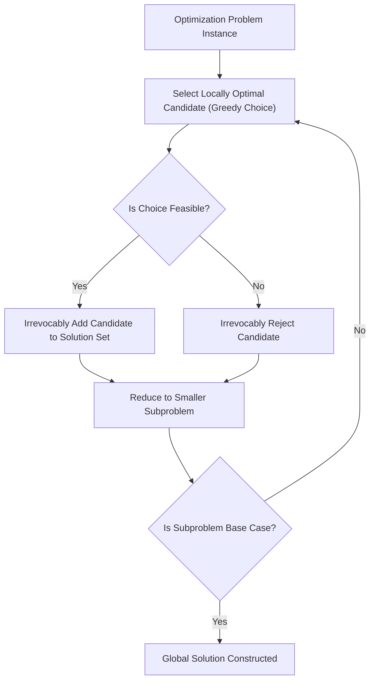
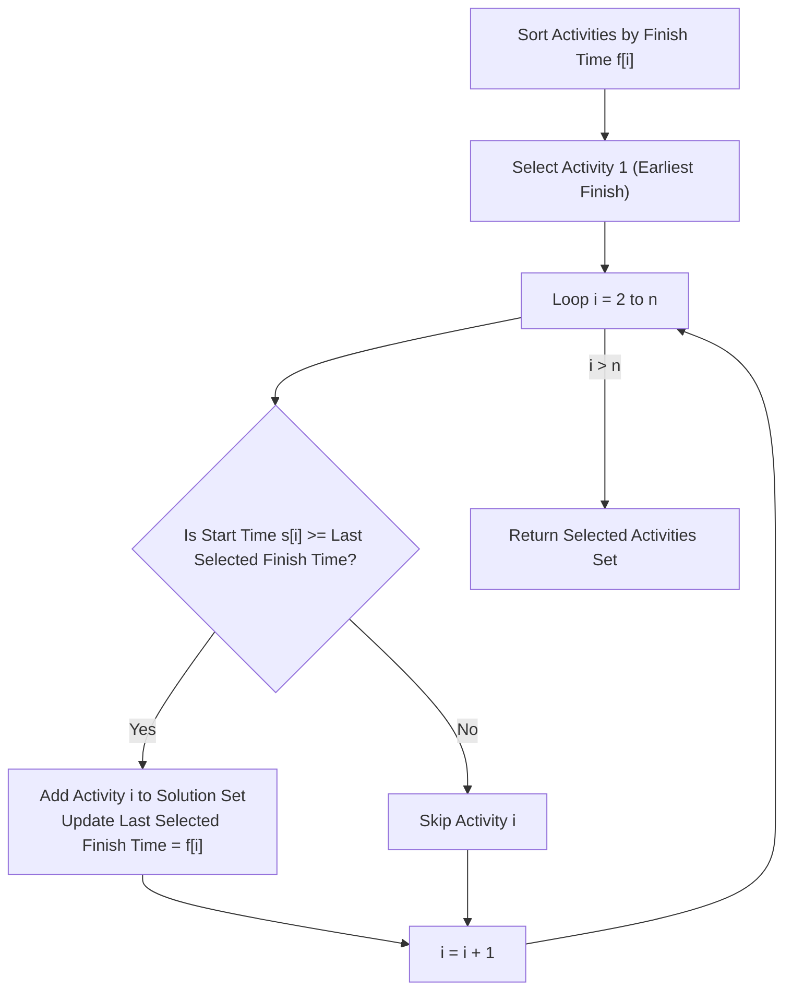
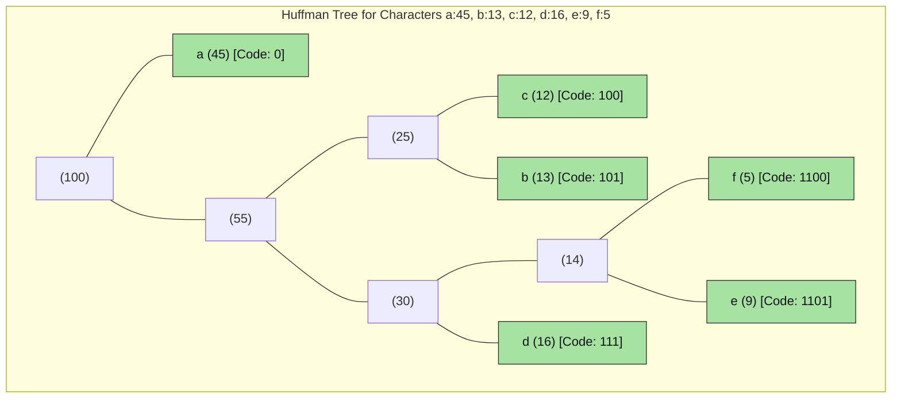

# Chapter 5: Greedy Algorithms & Optimization

> **Course Code:** 3CS501CC24
> **Focus:** Unit-V — Greedy Paradigm, Coin Change Problem, Fractional Knapsack, Activity Selection, Job Scheduling, Huffman Coding, Minimum Spanning Trees, Dijkstra's SSSP, Optimal Merge Patterns

---

## 1. Chapter Overview

This unit provides a comprehensive, rigorous study of the **Greedy Algorithm Paradigm**. Greedy algorithms build optimal solutions step-by-step by making locally optimal decisions without backtracking. We examine the core theoretical properties (Greedy Choice Property, Optimal Substructure, Irrevocable Decisions), investigate classic canonical problems (Coin Change, Fractional Knapsack, Activity Selection, Job Scheduling, Huffman Coding, Kruskal/Prim MST, Dijkstra's Shortest Path, and Optimal Merge Patterns), contrast Greedy with Dynamic Programming, and provide an interactive web visualization widget.

---

## 2. What is a Greedy Algorithm?

### Definition
A **Greedy Algorithm** solves an optimization problem by making the locally optimal choice at each step with the hope that these local choices lead to a global optimal solution.

### Core Properties & Characteristics

1. **Greedy Choice Property:**
   A globally optimal solution can be arrived at by making a locally optimal (greedy) choice without looking ahead or reconsidering previous choices.
2. **Optimal Substructure Property:**
   An optimal solution to the overall problem contains optimal solutions to its subproblems.
3. **Irrevocable Decisions:**
   Once a candidate element is selected into the solution set, it is permanent. Once a candidate is rejected, it is never reconsidered.



### Four Essential Components of a Greedy Strategy
1. **Selection Function:** Chooses the best candidate from the remaining options.
2. **Feasible Function:** Determines if a selected candidate can contribute to a valid solution.
3. **Objective Function:** Assigns a value or cost to a candidate or partial solution.
4. **Solution Function:** Indicates when a full, valid solution has been reached.

---

## 3. Greedy Paradigm vs. Dynamic Programming

Both paradigms require **Optimal Substructure**, but they differ fundamentally in strategy:

| Feature | Greedy Algorithms | Dynamic Programming |
| :--- | :--- | :--- |
| **Choice Sequence** | Top-down: Makes choice first, then solves one subproblem. | Bottom-up / Top-down: Solves all subproblems first, then chooses. |
| **Subproblem Space** | Considers only a single subproblem path. | Considers overlapping subproblems and evaluates combinations. |
| **Commitment** | Irrevocable (No backtracking). | Flexible (Evaluates all subproblem choices). |
| **Optimality Guarantee**| Works only if Greedy Choice Property holds. | Always guarantees optimal solution if conditions hold. |
| **Time & Space** | Generally faster ($O(n)$ or $O(n \log n)$), minimal memory. | Slower ($O(n^2)$, $O(n \cdot W)$), higher memory (tables). |

---

## 4. Problem 1: The Coin Change Problem

### Problem Statement
Given an amount $V$ and a set of coin denominations $C = \{c_1, c_2, \dots, c_n\}$, pay amount $V$ using the minimum total number of coins. Infinite supply of each denomination is available.

### Greedy Strategy
Always choose the largest available coin denomination $c_i \le V$, subtract $c_i$ from $V$, and repeat until $V = 0$.

### Algorithm Pseudocode
```text
Algorithm GREEDY-COIN-CHANGE(C, V):
    Sort denominations C in descending order (c1 > c2 > ... > cn)
    CoinList = []
    for i = 1 to n do:
        while V >= C[i] do:
            CoinList.append(C[i])
            V = V - C[i]
    if V == 0 then return CoinList
    else return "Cannot make exact change"
```

### Canonical vs. Non-Canonical Currency Systems

- **Canonical Systems (Greedy Works):**
  For standard monetary systems (e.g. US Coins $\{25, 10, 5, 1\}$, Indian Coins $\{10, 5, 2, 1\}$), the greedy choice always yields the minimum number of coins.
  - *Example:* Make change for $V = 28$ using US coins.
    - $28 - 25 = 3 \implies \text{Take } 25$
    - $3 - 1 = 2 \implies \text{Take } 1$
    - $2 - 1 = 1 \implies \text{Take } 1$
    - $1 - 1 = 0 \implies \text{Take } 1$
    - Result: $\{25, 1, 1, 1\}$ (4 coins). Optimal!

- **Non-Canonical Systems (Greedy Fails!):**
  If coin denominations are $C = \{6, 4, 1\}$ and target amount $V = 8$:
  - **Greedy Approach:**
    - Largest coin $\le 8$ is $6 \implies$ Remaining amount $8 - 6 = 2$.
    - Next largest coin $\le 2$ is $1 \implies$ Takes $1$, remaining $1$.
    - Takes $1$, remaining $0$.
    - Greedy Result: $\{6, 1, 1\}$ (**3 coins**).
  - **Optimal Solution (Dynamic Programming):**
    - $\{4, 4\}$ (**2 coins**).
  - **Conclusion:** Greedy fails for arbitrary non-canonical coin systems; DP is required.

---

## 5. Problem 2: The Knapsack Problem (Fractional vs. 0/1)

### Fractional Knapsack Problem (Greedy Works)

#### Problem Definition
Given $n$ items, each with weight $w_i$ and value $p_i$, and a knapsack of maximum capacity $W$. Items **can be broken into fractions** $x_i \in [0, 1]$. Maximize total value $\sum_{i=1}^n x_i p_i$ subject to $\sum_{i=1}^n x_i w_i \le W$.

#### Greedy Strategy
Compute value-to-weight ratio $r_i = \frac{p_i}{w_i}$ for each item. Sort items in descending order of ratio $r_i$. Greedily take as much of the item with the highest ratio as capacity allows.

#### Worked Step-by-Step Example
Knapsack Capacity $W = 50$. Items:

| Item | Value ($p_i$) | Weight ($w_i$) | Ratio ($r_i = p_i / w_i$) |
| :--- | :--- | :--- | :--- |
| Item 1 | 60 | 10 | $6.0$ |
| Item 2 | 100 | 20 | $5.0$ |
| Item 3 | 120 | 30 | $4.0$ |

1. **Sort by Ratio:** Order = Item 1 ($r=6$), Item 2 ($r=5$), Item 3 ($r=4$).
2. **Item 1:** Take fully ($x_1 = 1.0$). Weight used $= 10$, Value $= 60$, Remaining $W = 40$.
3. **Item 2:** Take fully ($x_2 = 1.0$). Weight used $= 20$, Value $= 100$, Remaining $W = 20$.
4. **Item 3:** $w_3 = 30 > \text{Remaining } W (20) \implies$ Take fraction $x_3 = \frac{20}{30} = \frac{2}{3}$.
   Value gained $= \frac{2}{3} \times 120 = 80$. Remaining $W = 0$.
5. **Total Value:** $60 + 100 + 80 = \mathbf{240}$. Total Weight $= 50$.

#### Complexity
- Sorting ratios: $O(n \log n)$.
- Item selection loop: $O(n)$.
- Overall Time Complexity: $O(n \log n)$.

---

### 0/1 Knapsack Problem (Greedy Fails Counterexample)

#### Problem Definition
Items **cannot be split** ($x_i \in \{0, 1\}$). Either take an entire item or leave it.

#### Why Greedy Fails
Using the same example ($W = 50$, Item 1: (60, 10, r=6), Item 2: (100, 20, r=5), Item 3: (120, 30, r=4)):
- **Greedy by Ratio:** Takes Item 1 (W=10, V=60) and Item 2 (W=20, V=100).
  - Total Weight $= 30$, Total Value $= \mathbf{160}$.
  - Remaining Capacity $= 20$ is wasted because Item 3 (W=30) cannot fit!
- **Optimal Choice:** Takes Item 2 (W=20, V=100) and Item 3 (W=30, V=120).
  - Total Weight $= 50$, Total Value $= \mathbf{220}$.
- **Conclusion:** Greedy choice leaves unused capacity that could yield higher total value. 0/1 Knapsack requires Dynamic Programming ($O(n \cdot W)$ time).

---

## 6. Problem 3: Activity Selection Problem

### Problem Definition
Given $n$ activities with start times $s_i$ and finish times $f_i$. Find a maximum-size set of mutually compatible activities (activities $i$ and $j$ are compatible if $s_i \ge f_j$ or $s_j \ge f_i$).

### Greedy Strategy
Sort activities by **finish times** $f_i$ in non-decreasing order. Always pick the first activity, then iteratively pick the next activity whose start time is $\ge$ the finish time of the last selected activity.



### Time Complexity
- Sorting: $O(n \log n)$.
- Selection: $O(n)$.
- Overall Complexity: $O(n \log n)$ (or $O(n)$ if already sorted).

---

## 7. Problem 4: Job Scheduling with Deadlines

### Problem Definition
Given $n$ jobs, where job $i$ takes 1 unit of time, yields profit $p_i > 0$, and has deadline $d_i \ge 1$. A job earns profit if completed by time $d_i$. Maximize total profit on a single processor.

### Greedy Strategy
1. Sort jobs in descending order of profit $p_i$.
2. Find maximum deadline $D = \max(d_i)$ and create time slots $1 \dots D$.
3. For each job, schedule it in the **latest available free slot** $\le d_i$.

### Worked Trace Example
Jobs: $J_1(20, d=2), J_2(15, d=2), J_3(10, d=1), J_4(5, d=3), J_5(1, d=3)$.

| Job (Sorted by Profit) | Profit | Deadline | Slot Assignment | Slots Array `[1, 2, 3]` |
| :--- | :--- | :--- | :--- | :--- |
| $J_1$ | 20 | 2 | Slot 2 free $\implies$ Assign $J_1$ | `[Free, J1, Free]` |
| $J_2$ | 15 | 2 | Slot 2 taken, Slot 1 free $\implies$ Assign $J_2$ | `[J2, J1, Free]` |
| $J_3$ | 10 | 1 | Slot 1 taken $\implies$ Reject $J_3$ | `[J2, J1, Free]` |
| $J_4$ | 5 | 3 | Slot 3 free $\implies$ Assign $J_4$ | `[J2, J1, J4]` |
| $J_5$ | 1 | 3 | All slots taken $\implies$ Reject $J_5$ | `[J2, J1, J4]` |

- **Optimal Job Sequence:** $J_2 \to J_1 \to J_4$. Total Profit $= 15 + 20 + 5 = \mathbf{40}$.
- **Complexity:** $O(n^2)$ naive search for slots, or $O(n \log n)$ using Disjoint Set structures.

---

## 8. Problem 5: Huffman Coding

### Problem Definition
Generate optimal **prefix-free variable-length binary codes** for characters based on frequencies. Frequent characters receive shorter binary strings.

### Greedy Tree Construction Algorithm
1. Initialize a Min-Priority Queue $Q$ with all character leaf nodes ordered by frequency.
2. While $|Q| > 1$:
   - Extract two nodes $x$ and $y$ with lowest frequencies.
   - Create new internal node $z$ with frequency $f[z] = f[x] + f[y]$, $z.left = x$, $z.right = y$.
   - Insert $z$ back into $Q$.
3. Remaining node in $Q$ is the root of the Huffman Tree.



- **Time Complexity:** $O(n \log n)$ using Min-Binary Heap.

---

## 9. Problem 6: Minimum Spanning Trees (Kruskal's & Prim's)

A **Spanning Tree** connects all $V$ vertices using $V-1$ edges without cycles. An **MST** minimizes total edge weight.

### Kruskal's Algorithm (Edge-Based)
Sort all edges in ascending order of weight. Add edges one-by-one to the MST if they do not form a cycle (using Disjoint Set `FIND-SET` and `UNION`).
- **Complexity:** $O(E \log E) = O(E \log V)$.

### Prim's Algorithm (Vertex-Based)
Start from arbitrary root vertex. Maintain Min-Priority Queue of vertices outside the MST. Repeatedly extract vertex with minimum key weight connecting to the MST.
- **Complexity:** $O(E \log V)$ with Binary Heap, $O(E + V \log V)$ with Fibonacci Heap.

---

## 10. Problem 7: Dijkstra's Single-Source Shortest Path

### Algorithm
Finds shortest paths from source $s$ to all vertices in a graph with **non-negative edge weights**. Repeatedly extracts vertex $u$ with minimum tentative distance $d[u]$ and relaxes outgoing edges $(u, v)$:

$$
\text{RELAX}(u, v, w): \quad \text{if } d[v] > d[u] + w(u, v) \implies d[v] = d[u] + w(u, v)
$$

### Why Negative Edges Break Dijkstra
Dijkstra assumes that once vertex $u$ is extracted from the queue, $d[u]$ is permanently optimal because adding non-negative edge weights can only increase path costs. Negative edges violate this assumption and require the **Bellman-Ford Algorithm**.

---

## 11. Problem 8: Optimal Merge Patterns

Given $n$ sorted files of sizes $S_1, S_2, \dots, S_n$. Merge them into a single sorted file with minimum total element comparisons.
- **Greedy Strategy:** Repeatedly extract and merge the two **smallest** file sizes using a Min-Heap.
- **Time Complexity:** $O(n \log n)$.

---

## 12. Interactive Greedy Algorithm Visualizer Widget

<iframe srcdoc="
<!DOCTYPE html>
<html>
<head>
<meta charset='utf-8'>
<style>
  body { font-family: system-ui, sans-serif; background: #181825; color: #cdd6f4; margin: 0; padding: 15px; }
  h3 { color: #a6e3a1; margin-top: 0; }
  .controls { display: flex; gap: 10px; flex-wrap: wrap; margin-bottom: 15px; align-items: center; }
  input, button { background: #313244; color: #cdd6f4; border: 1px solid #45475a; padding: 8px 12px; border-radius: 6px; font-size: 14px; }
  button { background: #a6e3a1; color: #11111b; font-weight: bold; cursor: pointer; border: none; }
  button:hover { background: #94e2d5; }
  .output { background: #11111b; padding: 12px; border-radius: 6px; border: 1px solid #313244; font-family: monospace; font-size: 13px; line-height: 1.5; color: #f9e2af; min-height: 100px; }
</style>
</head>
<body>
<h3>Interactive Fractional Knapsack & Coin Change Solver</h3>
<div class='controls'>
  <label>Target Capacity / Amount: <input type='number' id='valInput' value='50' style='width: 80px;'></label>
  <button onclick='runKnapsack()'>Run Fractional Knapsack</button>
  <button onclick='runCoinChange()'>Run Coin Change</button>
</div>
<div class='output' id='outBox'>Select an algorithm to run visualization.</div>

<script>
function runKnapsack() {
  let W = parseFloat(document.getElementById('valInput').value);
  let items = [
    { id: 1, p: 60, w: 10 },
    { id: 2, p: 100, w: 20 },
    { id: 3, p: 120, w: 30 }
  ];
  items.forEach(it => it.r = it.p / it.w);
  items.sort((a, b) => b.r - a.r);

  let totalP = 0, currentW = 0;
  let log = '--- Fractional Knapsack Step-by-Step ---\n';
  log += 'Capacity W = ' + W + '\n';

  for (let it of items) {
    if (currentW + it.w <= W) {
      currentW += it.w;
      totalP += it.p;
      log += `Took 100% of Item ${it.id} (W=${it.w}, P=${it.p}). Total Profit = ${totalP}, Current W = ${currentW}\n`;
    } else {
      let rem = W - currentW;
      if (rem &gt; 0) {
        let frac = rem / it.w;
        let gainedP = frac * it.p;
        totalP += gainedP;
        currentW += rem;
        log += `Took ${(frac * 100).toFixed(1)}% fraction of Item ${it.id} (W=${rem}, P=${gainedP}). Total Profit = ${totalP}\n`;
      }
      break;
    }
  }
  log += `\nFINAL MAX PROFIT = ${totalP}`;
  document.getElementById('outBox').innerText = log;
}

function runCoinChange() {
  let V = parseInt(document.getElementById('valInput').value);
  let coins = [25, 10, 5, 1];
  let remaining = V;
  let taken = [];
  let log = '--- Canonical Coin Change ({25, 10, 5, 1}) ---\n';
  log += 'Target Amount = ' + V + '\n';

  for (let c of coins) {
    while (remaining >= c) {
      taken.push(c);
      remaining -= c;
      log += `Took coin ${c}. Remaining Amount = ${remaining}\n`;
    }
  }
  log += `\nTotal Coins Used = ${taken.length} [Coins: ${taken.join(', ')}]`;
  document.getElementById('outBox').innerText = log;
}
</script>
</body>
</html>
" width="100%" height="260" style="border:1px solid #45475a; border-radius:8px; margin-top:15px;"></iframe>

---

## 13. Master Summary Comparison Table

| Problem | Greedy Selection Criterion | Time Complexity | Optimal? | Failure Condition |
| :--- | :--- | :--- | :--- | :--- |
| **Coin Change** | Largest coin denomination $\le V$ | $O(V)$ | Canonical systems | Non-canonical systems (e.g. $\{6,4,1\}$ for $8$) |
| **Fractional Knapsack** | Highest value-to-weight ratio $p_i/w_i$ | $O(n \log n)$ | Always | None (Fractions allowed) |
| **0/1 Knapsack** | N/A (Greedy Ratio Fails) | $O(n \cdot W)$ via DP | Fails | Fails on whole item constraint |
| **Activity Selection** | Earliest finish time $f_i$ | $O(n \log n)$ | Always | None |
| **Job Scheduling** | Highest profit $p_i$, latest free slot | $O(n^2)$ or $O(n \log n)$ | Always | None |
| **Huffman Coding** | Lowest frequency node pair | $O(n \log n)$ | Always | None |
| **Kruskal's MST** | Lightest edge not forming cycle | $O(E \log V)$ | Always | Disconnected graphs |
| **Prim's MST** | Lightest edge connecting MST to outside | $O(E \log V)$ | Always | Disconnected graphs |
| **Dijkstra's SSSP** | Minimum tentative distance $d[u]$ | $O(E \log V)$ | Non-negative weights | Negative edge weights |

---

## 14. Formula Sheet

- **Fractional Knapsack Ratio:** $r_i = \frac{p_i}{w_i}$
- **Total Huffman Code Bits:** $\text{Bits} = \sum_{i=1}^n (f_i \times \text{length}_i)$
- **Spanning Tree Edges Count:** Exactly $V - 1$ edges for $|V|$ vertices.
- **Complete Graph MST Count (Cayley's Formula):** $V^{V-2}$ spanning trees.
- **Dijkstra Relaxation Formula:** $d[v] = \min(d[v], d[u] + w(u, v))$

---

## 15. Definition Sheet

1. **Greedy Algorithm:** An optimization strategy that makes locally optimal choices without backtracking.
2. **Greedy Choice Property:** The property where a global optimum can be reached by making local optimal choices.
3. **Prefix-Free Code:** A binary code where no codeword is a prefix of any other codeword, ensuring unambiguous decoding.
4. **Minimum Spanning Tree (MST):** A connected subgraph containing all vertices with $V-1$ edges that minimizes total edge weight.
5. **Optimal Substructure:** The property where an optimal solution to a problem contains optimal solutions to its subproblems.

---

## 16. Exam-Oriented Review

1. Explain the Greedy Choice Property and Optimal Substructure Property with examples.
2. Show why the Greedy algorithm fails for the Coin Change problem on $C = \{6, 4, 1\}$ for $V = 8$.
3. Trace Fractional Knapsack for capacity $W=50$ and items $P=[60,100,120]$, $W=[10,20,30]$. Contrast with 0/1 Knapsack.
4. Prove that sorting by finish time yields an optimal solution for the Activity Selection problem.
5. Trace Job Scheduling for jobs $J_1(20, d=2), J_2(15, d=2), J_3(10, d=1), J_4(5, d=3), J_5(1, d=3)$.
6. Construct a Huffman tree for characters $a:45, b:13, c:12, d:16, e:9, f:5$ and calculate total bits.
7. Compare Kruskal's and Prim's algorithms in terms of approach, data structures, and time complexity.
8. Explain Dijkstra's algorithm and write the edge relaxation condition. Why does it fail for negative weight edges?
