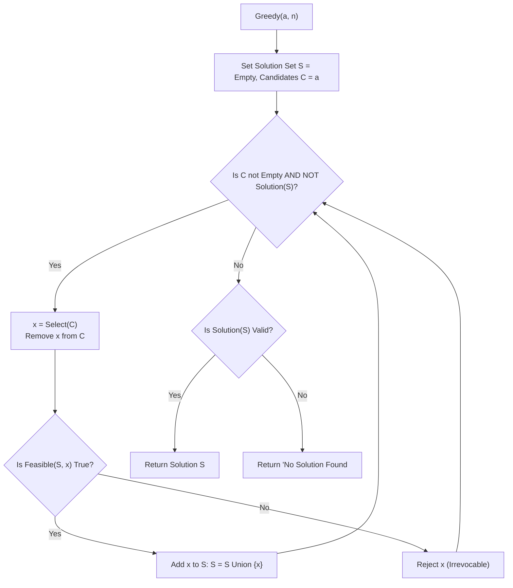
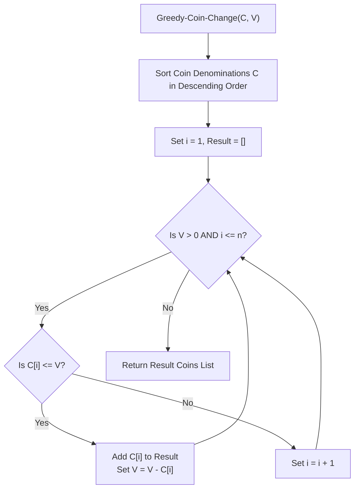
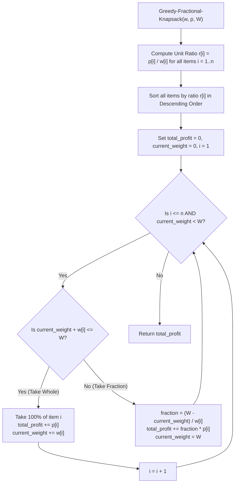
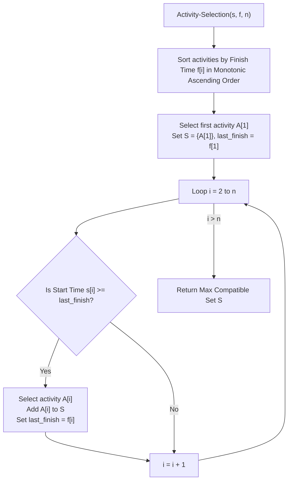
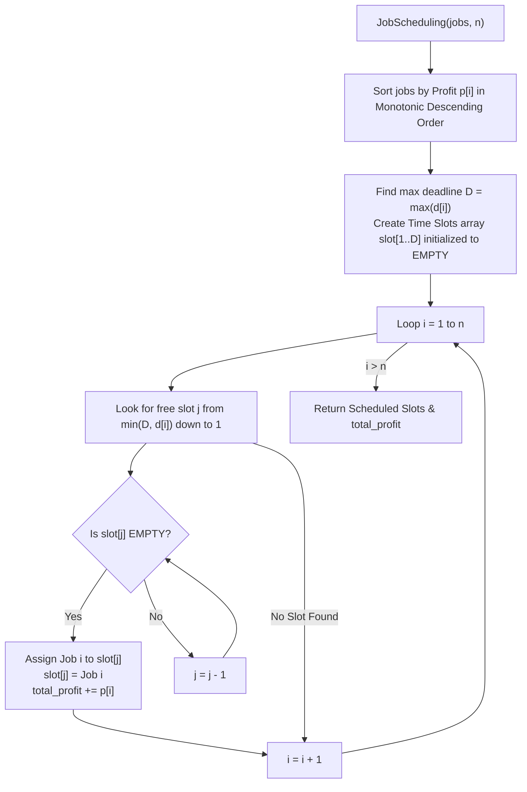
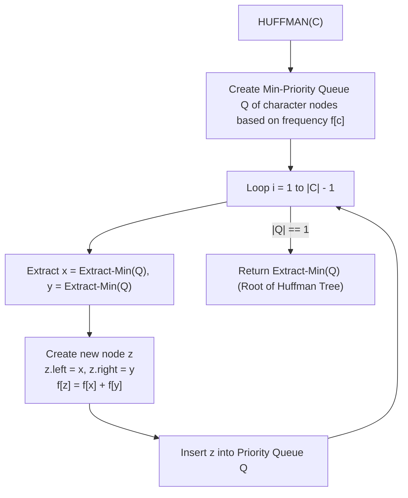
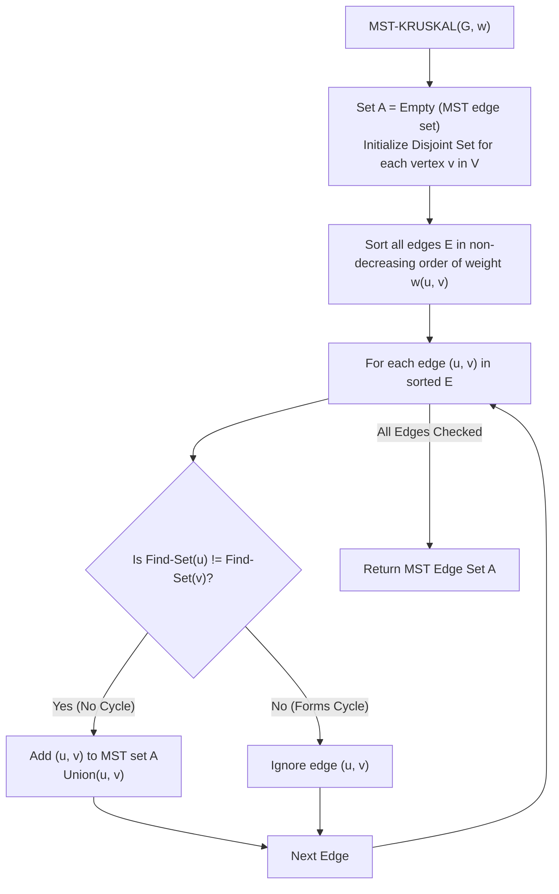
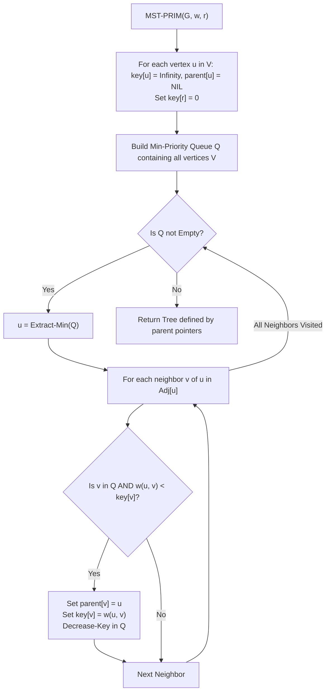
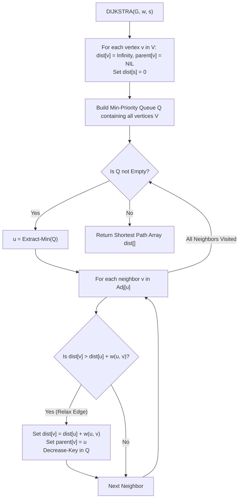

# Complete DAA Notes: Unit 5 — Greedy Algorithms

> **Course Code:** 3CS501CC24
> **Primary Source:** DAA_Unit5.pptx

---

# Chapter 5: Greedy Algorithms

## 1. Chapter Overview
This unit covers the Greedy Algorithm paradigm, which focuses on making the locally optimal choice at each step to arrive at a global optimum. Key applications explored include the Coin Change problem, Fractional Knapsack, Activity Selection, Job Scheduling with Deadlines, Huffman Coding, Minimum Spanning Trees (Kruskal's and Prim's algorithms), Dijkstra's Shortest Path, and Optimal Merge Patterns.

[Source: DAA_Unit5.pptx, Slide 2]

---

## 2. What is a Greedy Algorithm?

### Definition
A **Greedy Algorithm** is an approach that always makes the choice that seems to be the best at that moment. It builds a solution piece by piece, always choosing the next piece that offers the most obvious and immediate benefit.

### Characteristics & Properties
- **Greedy Choice Property:** A global optimum can be arrived at by selecting a locally optimal choice.
- **Optimal Substructure Property:** An optimal solution to the problem contains optimal solutions to subproblems.
- **Irrevocable Decisions:** Once a candidate is selected and added to the solution, it is there forever. Once a candidate is excluded from the solution, it is never reconsidered.

### Components of Greedy Strategy
Greedy algorithms typically maintain two sets:
1. Candidates already considered and chosen.
2. Candidates considered but rejected.

A greedy algorithm consists of four functions:
1. **Selection Function:** Tells which of the candidates is the most promising.
2. **Feasible Function:** Checks whether a candidate can be used to contribute to the solution.
3. **Objective Function:** Assigns a value to a solution or a partial solution.
4. **Solution Function:** Checks whether a complete solution has been reached.

### General Greedy Pseudocode Template


### Common Algorithms Using Greedy Approach
- Prim's and Kruskal's Minimal Spanning Tree (MST) algorithms
- Dijkstra's Shortest Path algorithm
- Activity Selection Problem
- Huffman Coding (lossless data compression)
- OSPF routing protocol
- Graph Coloring
- Fractional Knapsack Problem
- Job Scheduling Problem

[Source: DAA_Unit5.pptx, Slide 3-5]

---

## 3. Greedy vs Dynamic Programming

Both paradigms are used for optimization problems and rely on the optimal substructure property.

| Feature | Greedy Algorithm | Dynamic Programming |
|---------|-----------------|---------------------|
| **Approach** | Top-down: makes a choice before solving subproblems. | Bottom-up: solves all subproblems before making a choice. |
| **Subproblems** | Only considers one subproblem (the one arising from the greedy choice). | Considers overlapping subproblems and evaluates all possible choices. |
| **Optimality** | Does not always guarantee a global optimal solution. | Always guarantees an optimal solution if optimal substructure and overlapping subproblems hold. |
| **Efficiency** | Generally faster and requires less memory. | Slower and often requires more memory (memoization/tabulation). |
| **Commitment** | Commits to a choice irrevocably (no backtracking). | Considers alternatives before committing. |

[Source: General Knowledge based on syllabus context]

---

## 4. Problem: Make Change

### Problem Definition
Given coins of available denominations with unlimited quantity, devise an algorithm for paying a given amount to a customer using the smallest possible number of coins.

### Greedy Strategy
At every step, choose the **largest available coin** without worrying about whether this will prove to be a correct decision later. It never changes the decision (irrevocable).

### Algorithm Pseudocode


### Worked Example
Suppose we need to pay $28$ using coins of denominations $\{10, 5, 2, 1, 0.5\}$.
1. Choose $10$ (Sum: $10$)
2. Choose $10$ (Sum: $20$)
3. Choose $5$ (Sum: $25$)
4. Choose $2$ (Sum: $27$)
5. Choose $1$ (Sum: $28$)
- Total coins: 5
- Selected coins: $\{10, 10, 5, 2, 1\}$

### When Greedy Works and Fails
- **Works (Canonical Systems):** Standard currency systems (like US, Indian) are designed so the greedy approach yields an optimal solution.
- **Fails (Non-canonical Systems):** If denominations are $\{6, 4, 1\}$ and amount is $8$:
  - Greedy yields: $6, 1, 1$ (Total = 3 coins).
  - Optimal (DP) yields: $4, 4$ (Total = 2 coins).

[Source: DAA_Unit5.pptx, Slide 6-10]

---

## 5. Knapsack Problems

### Fractional Knapsack
- **Problem:** Given $n$ objects with weights $w_i$ and values $p_i$, and a knapsack of capacity $W$. Aim to maximize total value while respecting capacity constraint. Objects **can be broken** into smaller pieces (fractions).
- **Mathematical formulation:** Maximize $\sum_{i=1}^n p_i x_i$ subject to $\sum_{i=1}^n w_i x_i \le W$, where $0 \le x_i \le 1$.

#### Greedy Strategy
Calculate the value-to-weight ratio for each item. Sort items in descending order of this ratio. Greedily take as much of the item with the highest ratio as possible.

#### Pseudocode


#### Complete Worked Example
Capacity $W = 100$. Objects:
| Object | 1 | 2 | 3 | 4 | 5 |
|---|---|---|---|---|---|
| Profit ($p$) | 30 | 50 | 20 | 10 | 20 |
| Weight ($w$) | 30 | 40 | 30 | 10 | 20 |
| Ratio ($p/w$) | 1.0 | 1.25 | 0.67 | 1.0 | 1.0 |

**Sorting by Ratio:**
1. Object 2: Ratio 1.25, $w=40, p=50$. Take fully. (Weight: 40, Profit: 50)
2. Object 1: Ratio 1.0, $w=30, p=30$. Take fully. (Weight: 70, Profit: 80)
3. Object 4: Ratio 1.0, $w=10, p=10$. Take fully. (Weight: 80, Profit: 90)
4. Object 5: Ratio 1.0, $w=20, p=20$. Take fully. (Weight: 100, Profit: 110)
5. Object 3: Ratio 0.67, $w=30$. Knapsack full, take fraction if needed (not needed here as weight is exactly 100).
- Total Profit = $110$.
*(Note: Example in slides differs slightly, computing alternative objective functions before proving ratio is optimal).*

#### Complexity
- Sorting the items: $O(n \log n)$
- Processing items: $O(n)$
- Total Time Complexity: $O(n \log n)$

### 0/1 Knapsack
- **Problem:** Cannot take fractions ($x_i \in \{0, 1\}$).
- **Why Greedy Fails:** If we use the ratio method, we might be left with empty space that could have been better utilized by a different combination of items.
- **Counterexample:** Capacity $W=50$. Items: (Value=60, Weight=10), (Value=100, Weight=20), (Value=120, Weight=30).
  - Ratios: 6, 5, 4.
  - Greedy by ratio takes Item 1 (W=10) and Item 2 (W=20). Total Weight = 30, Profit = 160. Leaves W=20 empty space.
  - Optimal takes Item 2 and Item 3. Total Weight = 50, Profit = 220.
- **Solution:** Needs Dynamic Programming.

[Source: DAA_Unit5.pptx, Slide 11-19]

---

## 6. Activity Selection Problem

### Problem Definition
Select non-overlapping activities that need to be executed by a single person/machine. Given start times $s_i$ and finish times $f_i$, find the maximum size set of mutually compatible activities.
Activities are compatible if $s_i \ge f_j$ or $s_j \ge f_i$.

### Greedy Strategy
Sort the activities in increasing order of their **finish times**. Always pick the next activity that starts after the currently selected activity finishes. This maximizes remaining time for future activities.

### Algorithm Pseudocode


### Worked Trace
Activities $(s_i, f_i)$: P(1,4), Q(3,5), R(0,6), S(5,7), T(3,8), U(5,9), V(6,10), W(8,11), X(8,12), Y(2,13), Z(12,14)
*Already sorted by finish time.*

1. Initialize: Select first activity: **P(1,4)**. $A = \{P\}$. Current finish time = 4.
2. Check Q(3,5): $s_Q = 3 < 4$ (Overlap). Reject.
3. Check R(0,6): $s_R = 0 < 4$ (Overlap). Reject.
4. Check S(5,7): $s_S = 5 \ge 4$ (Compatible). Select **S(5,7)**. $A = \{P, S\}$. New finish = 7.
5. Check T(3,8), U(5,9), V(6,10) - Overlap, reject.
6. Check W(8,11): $s_W = 8 \ge 7$ (Compatible). Select **W(8,11)**. $A = \{P, S, W\}$. New finish = 11.
7. Check X(8,12), Y(2,13) - Overlap, reject.
8. Check Z(12,14): $s_Z = 12 \ge 11$ (Compatible). Select **Z(12,14)**. $A = \{P, S, W, Z\}$.
**Final Answer:** $\{P, S, W, Z\}$

### Complexity
- **Time Complexity:** $O(n \log n)$ if sorting is required. $O(n)$ if activities are already sorted by finish time.
- **Space Complexity:** $O(1)$ auxiliary space.

[Source: DAA_Unit5.pptx, Slide 20-29]

---

## 7. Job Scheduling with Deadlines

### Problem Definition
Given a set of jobs where each takes 1 unit of time, and each job has a profit $p_i$ and a deadline $d_i$. A job earns profit if executed no later than its deadline. Find an optimal sequence of jobs to maximize total profit on a uniprocessor.

### Greedy Strategy
Sort jobs in decreasing order of their profit. For each job, try to schedule it as close to its deadline as possible (in the latest available free time slot).

### Algorithm Pseudocode


### Worked Trace
Jobs: J1(Profit: 20, Deadline: 2), J2(Profit: 15, Deadline: 2), J3(Profit: 10, Deadline: 1), J4(Profit: 5, Deadline: 3), J5(Profit: 1, Deadline: 3)
*Assume sorted by profit.*

| Job | Profit | Deadline | Slot Assignment Strategy | Slots Array Status [0..2] |
|-----|--------|----------|--------------------------|---------------------------|
| J1 | 20 | 2 | Slot 1 is free. Assign J1. | `[Empty, J1, Empty]` |
| J2 | 15 | 2 | Slot 1 taken. Slot 0 free. Assign J2. | `[J2, J1, Empty]` |
| J3 | 10 | 1 | Slot 0 taken. Reject J3. | `[J2, J1, Empty]` |
| J4 | 5 | 3 | Slot 2 is free. Assign J4. | `[J2, J1, J4]` |
| J5 | 1 | 3 | All slots 0,1,2 taken. Reject J5. | `[J2, J1, J4]` |

- **Optimal Sequence:** J2 -> J1 -> J4
- **Total Profit:** $15 + 20 + 5 = 40$

### Complexity
- **Time Complexity:** $O(n^2)$ worst case to search for slots. (Can be optimized to $O(n \log n)$ using Disjoint Sets).

[Source: DAA_Unit5.pptx, Slide 30-41]

---

## 8. Huffman Coding

### Problem Definition
Compress data by assigning variable-length codes to input characters based on their frequencies. The most frequent character gets the smallest code. It generates an optimal **Prefix-free code** (no code is a prefix of another).

### Greedy Strategy
Build a binary tree from the bottom up. At each step, extract the two nodes with the lowest frequency, merge them into a new internal node whose frequency is the sum of the two, and re-insert into the priority queue. Repeat until one node (root) remains.

### Algorithm Pseudocode


### Step-by-Step Trace
Characters: a(45), b(13), c(12), d(16), e(9), f(5)

**Priority Queue State (Min-Heap):**
- Initial: f(5), e(9), c(12), b(13), d(16), a(45)
- **Step 1:** Extract f(5) and e(9). Merge into node (14).
  - Q: c(12), b(13), Node(14), d(16), a(45)
- **Step 2:** Extract c(12) and b(13). Merge into node (25).
  - Q: Node(14), d(16), Node(25), a(45)
- **Step 3:** Extract Node(14) and d(16). Merge into node (30).
  - Q: Node(25), Node(30), a(45)
- **Step 4:** Extract Node(25) and Node(30). Merge into node (55).
  - Q: a(45), Node(55)
- **Step 5:** Extract a(45) and Node(55). Merge into root node (100).
  - Q: Root(100)

**Derived Codewords (Left=0, Right=1):**
- a: `0` (1 bit)
- c: `100` (3 bits)
- b: `101` (3 bits)
- f: `1100` (4 bits)
- e: `1101` (4 bits)
- d: `111` (3 bits)

### Total Bits Calculation
$\text{Total bits} = \sum (\text{frequency}_i \times \text{Code Length}_i)$
$\text{Bits} = (45 \times 1) + (13 \times 3) + (12 \times 3) + (16 \times 3) + (9 \times 4) + (5 \times 4)$
$\text{Bits} = 45 + 39 + 36 + 48 + 36 + 20 = 224$ bits.

### Complexity
- **Time Complexity:** $O(n \log n)$ due to priority queue operations (Extract-Min and Insert take $O(\log n)$).
- **Space Complexity:** $O(n)$ to store the tree.

[Source: DAA_Unit5.pptx, Slide 42-61]

---

## 9. Minimum Spanning Trees (MST)

### Definitions
- **Spanning Tree:** A subgraph that connects all vertices of a graph with the minimum possible number of edges ($V-1$ edges), without any cycles.
- **Minimum Spanning Tree (MST):** A spanning tree with the minimum total edge weight.

### Kruskal's Algorithm
- **Approach:** Edge-based greedy algorithm.
- **Strategy:** Sort all edges by weight. Iteratively add the minimum weight edge to the MST if it does not form a cycle.
- **Data Structure:** Union-Find (Disjoint Set) to detect cycles.
  - `MAKE-SET(x)`: creates new set.
  - `FIND-SET(x)`: finds the representative of the set.
  - `UNION(x, y)`: unites two sets.

#### Pseudocode


#### Worked Trace Example
Graph Edges: (1,2: 1), (2,3: 2), (4,5: 3), (6,7: 3), (1,4: 4), (4,7: 4), (2,4: 6)

| Step | Edge | Action | Disjoint Sets State |
|------|------|--------|---------------------|
| 1 | (1,2: 1) | Accept | {1,2}, {3}, {4}, {5}, {6}, {7} |
| 2 | (2,3: 2) | Accept | {1,2,3}, {4}, {5}, {6}, {7} |
| 3 | (4,5: 3) | Accept | {1,2,3}, {4,5}, {6}, {7} |
| 4 | (6,7: 3) | Accept | {1,2,3}, {4,5}, {6,7} |
| 5 | (1,4: 4) | Accept | {1,2,3,4,5}, {6,7} |
| 6 | (4,7: 4) | Accept | {1,2,3,4,5,6,7} |
| 7 | (2,4: 6) | Reject (Cycle) | (Already in same set) |

#### Complexity
- Sorting edges: $O(E \log E)$
- Union-Find operations: $O(E \log V)$
- Overall Time Complexity: $O(E \log E)$ or $O(E \log V)$.

---

### Prim's Algorithm
- **Approach:** Vertex-based greedy algorithm.
- **Strategy:** Start from an arbitrary node. Always select the minimum weight edge that connects a vertex in the MST to a vertex outside the MST. Grow the tree one node at a time.
- **Data Structure:** Min-Priority Queue for selecting the minimum weight edge.

#### Pseudocode


#### Worked Trace Example
*Using same graph. Start at node 1.*
Initialize $key$ arrays to $\infty$.

| Step | Extract $u$ | Neighbors $v$ | Update $v.key$ | Set B (MST Nodes) |
|------|-------------|---------------|----------------|-------------------|
| 1 | Node 1 | 2(w=1), 4(w=4) | 2.key=1, 4.key=4 | {1} |
| 2 | Node 2 | 3(w=2), 5(w=4) | 3.key=2, 5.key=4 | {1, 2} |
| 3 | Node 3 | 5(w=5), 6(w=6) | *Ignore, worse weights*| {1, 2, 3} |
| 4 | Node 4 | 5(w=3), 7(w=4) | 5.key=3, 7.key=4 | {1, 2, 3, 4} |
| 5 | Node 5 | 6(w=8), 7(w=7) | *Ignore, worse weights*| {1, 2, 3, 4, 5} |
| 6 | Node 7 | 6(w=3) | 6.key=3 | {1, 2, 3, 4, 5, 7} |
| 7 | Node 6 | - | - | {1, 2, 3, 4, 5, 6, 7} |

#### Complexity
- With Binary Heap: $O((V+E) \log V)$ -> $O(E \log V)$ for connected graphs.
- With Fibonacci Heap: $O(E + V \log V)$.

### Kruskal vs Prim Comparison

| Feature | Kruskal's Algorithm | Prim's Algorithm |
|---------|---------------------|------------------|
| **Approach** | Edge-based | Vertex-based |
| **Data Structure** | Union-Find (Disjoint Set) | Min-Priority Queue |
| **Time Complexity** | $O(E \log E)$ or $O(E \log V)$ | $O(E \log V)$ (binary heap) |
| **Best for** | Sparse Graphs | Dense Graphs |
| **Disconnected Graphs** | Generates a minimum spanning forest. | Fails to reach all nodes if disconnected. |

[Source: DAA_Unit5.pptx, Slide 62-84]

---

## 10. Dijkstra's Shortest Path Algorithm

### Problem Definition
Find the shortest path from a single source node to all other nodes in a weighted directed/undirected graph with **non-negative weights**.

### Greedy Strategy
Maintain a set of explored nodes and a tentative distance to all nodes. Always pick the unexplored node with the smallest tentative distance and relax all its outgoing edges.

### Relaxation Operation
```text
RELAX(u, v, w)
    if v.d > u.d + w(u, v) then
        v.d = u.d + w(u, v)
        v.π = u
```

### Algorithm Pseudocode


### Worked Trace
Source node = 1.
Edges: $1 \xrightarrow{10} 5$, $1 \xrightarrow{100} 4$, $1 \xrightarrow{30} 3$, $1 \xrightarrow{50} 2$. $5 \xrightarrow{10} 4$, $4 \xrightarrow{20} 2$, $4 \xrightarrow{30} 3$.

| Step | Extract (Min) | $d[2]$ | $d[3]$ | $d[4]$ | $d[5]$ | Action (Relaxing Neighbors) |
|------|---------------|--------|--------|--------|--------|-----------------------------|
| Init | - | $\infty$ | $\infty$ | $\infty$ | $\infty$ | Set source $d[1]=0$ |
| 1 | **Node 1** (d=0) | 50 | 30 | 100 | 10 | Relax (1,5): $d[5]=10$. Relax (1,4): $d[4]=100$. Relax (1,3): $d[3]=30$. Relax (1,2): $d[2]=50$. |
| 2 | **Node 5** (d=10) | 50 | 30 | 20 | - | Relax (5,4): $10+10 < 100$, so $d[4]=20$. |
| 3 | **Node 4** (d=20) | 40 | 30 | - | - | Relax (4,2): $20+20 < 50$, so $d[2]=40$. Relax (4,3): $20+30 \not< 30$. |
| 4 | **Node 3** (d=30) | 40 | - | - | - | No better paths. |
| 5 | **Node 2** (d=40) | - | - | - | - | No neighbors. |

Final distances from Node 1: $d[2]=40$, $d[3]=30$, $d[4]=20$, $d[5]=10$.

### Why Negative Weights Break Dijkstra
Dijkstra's assumes that once a node is extracted, its minimum distance is permanently found (since adding positive weights can only increase distances). If negative edges exist, a later path could be shorter, breaking this irrevocable greedy choice.

### Complexity
- Adjacency Matrix: $O(V^2)$
- Adjacency List + Binary Heap: $O((V + E) \log V)$ -> $O(E \log V)$
- Adjacency List + Fibonacci Heap: $O(V \log V + E)$

[Source: DAA_Unit5.pptx, Slide 85-92]

---

## 11. Optimal Merge Pattern

### Problem Definition
Given $n$ sorted files, merge them into a single sorted file such that the total number of element comparisons (or total cost of merging) is minimized. Two-way merge cost is proportional to the sum of the sizes of the two files.

### Greedy Strategy
Always merge the two **smallest** sorted files first. Use a Min-Heap to continuously track the sizes.

### Algorithm Pseudocode
```text
Algorithm OPTIMAL_MERGE_PATTERNS(S)
    Create min-heap H from S
    while H.length > 1 do
        min1 = EXTRACT-MIN(H)
        min2 = EXTRACT-MIN(H)
        NewNode = min1 + min2
        INSERT(H, NewNode)
```

### Example
Sequences of sizes: {3, 5, 9, 11, 16, 18, 20}
1. Merge 3, 5 -> 8. Heap: {8, 9, 11, 16, 18, 20}
2. Merge 8, 9 -> 17. Heap: {11, 16, 17, 18, 20}
3. Merge 11, 16 -> 27. Heap: {17, 18, 20, 27}
4. Merge 17, 18 -> 35. Heap: {20, 27, 35}
5. Merge 20, 27 -> 47. Heap: {35, 47}
6. Merge 35, 47 -> 82.
Total Cost = sum of intermediate sizes.

### Complexity
- **Time Complexity:** $O(n \log n)$ using a Min-Heap.

[Source: DAA_Unit5.pptx, Slide 93-99]

---

## 12. Master Comparison Table

| Algorithm | Problem | Greedy Strategy | Data Structure | Time Complexity | Optimal? |
|-----------|---------|-----------------|----------------|-----------------|----------|
| **Coin Change** | Minimum coins | Take the largest possible denomination | None | $O(\text{amount})$ | Yes (only for canonical systems) |
| **Fractional Knapsack** | Maximize value | Take item with max value/weight ratio | Array (Sorting) | $O(n \log n)$ | Yes |
| **Activity Selection** | Max non-overlapping | Sort by finish time, pick first non-overlapping | Array (Sorting) | $O(n \log n)$ | Yes |
| **Job Scheduling** | Maximize profit | Sort by profit, schedule near deadline | Array/Disjoint Set | $O(n^2)$ | Yes |
| **Huffman Coding** | Compress string | Merge 2 nodes with lowest frequencies | Min-Heap | $O(n \log n)$ | Yes |
| **Kruskal's MST** | Find MST | Pick smallest edge not forming a cycle | Disjoint Set | $O(E \log E)$ | Yes |
| **Prim's MST** | Find MST | Pick smallest edge from MST to outside | Min-Heap | $O(E \log V)$ | Yes |
| **Dijkstra's** | Shortest path | Relax node with smallest known distance | Min-Heap | $O(E \log V)$ | Yes (No negative edges) |
| **Optimal Merge** | Min merge cost | Merge 2 smallest files | Min-Heap | $O(n \log n)$ | Yes |

---

## 13. Formula Sheet

- **Fractional Knapsack Ratio:**
$$
r_i = \frac{p_i}{w_i}
$$
- **Average Huffman Code Length:**
$$
\text{Average Length} = \frac{\sum (\text{frequency}_i \times \text{code length}_i)}{\sum \text{frequency}_i}
$$
- **Total Huffman Bits:**
$$
\text{Total Bits} = \text{Total chars} \times \text{Average Code Length} = \sum (\text{frequency}_i \times \text{code length}_i)
$$
- **Kruskal Complexity (Binary Heap):**
$$
O(E \log E) = O(E \log V)
$$
- **Dijkstra / Prim Complexity (Binary Heap):**
$$
O((V+E) \log V) \approx O(E \log V)
$$
- **Max Spanning Trees in Complete Graph (Cayley's Formula):**
$$
n^{n-2}
$$

---

## 14. Definition Sheet

- **Greedy Algorithm:** An algorithmic paradigm that follows the problem-solving heuristic of making the locally optimal choice at each stage.
- **Prefix-Free Code:** A coding system where no assigned code is a prefix of any other assigned code (used in Huffman to prevent ambiguity).
- **Spanning Tree:** A subgraph that includes all the vertices of the graph with a minimum number of edges. It contains no cycles.
- **Minimum Spanning Tree:** A spanning tree in which the sum of the weights of the edges is as small as possible.
- **Optimal Merge Pattern:** A pattern that dictates the most cost-effective way to merge multiple sorted files.
- **Cut Property:** If an edge is the lightest crossing a cut, it belongs to the MST.
- **Cycle Property:** The heaviest edge in any cycle does not belong to the MST.
- **Disjoint Set (Union-Find):** A data structure that tracks elements partitioned into a number of disjoint (non-overlapping) subsets.

---

## 15. Exam-Oriented Review

### Important Concepts
- The crucial difference between 0/1 Knapsack (DP required) and Fractional Knapsack (Greedy works).
- Why Greedy algorithms fail in non-canonical coin systems.
- Differences in approach (Edge vs Vertex) between Kruskal and Prim.
- The role of Disjoint Sets in Kruskal's algorithm to detect cycles.
- Why Dijkstra's algorithm fails with negative weight edges.

### Potential Exam Questions (15+)
1. Define a Greedy Algorithm. What are its main components and characteristics?
2. Prove that the Greedy strategy fails for the 0/1 Knapsack problem using a counterexample.
3. Apply Fractional Knapsack on items: $W = 50$, $P=\{60, 100, 120\}$, $W=\{10, 20, 30\}$. Show the step-by-step trace.
4. Explain the Activity Selection problem and prove the greedy choice property (sort by finish time).
5. Trace the Job Scheduling with Deadlines algorithm for: Profits (100, 19, 27, 25, 15) and Deadlines (2, 1, 2, 1, 3).
6. Build a Huffman Tree for characters a:50, b:20, c:15, d:30. Determine the codes and total bits required.
7. Define a prefix-free code and explain why it is crucial for lossless decompression.
8. State the differences between Prim's and Kruskal's algorithms. When would you prefer one over the other?
9. Apply Kruskal's algorithm to find the MST of a given 7-node graph. Show the Disjoint Set states.
10. Apply Prim's algorithm on the same graph and show the progression of the $key$ array.
11. Write the pseudocode for Dijkstra's Single-Source Shortest Path algorithm.
12. Trace Dijkstra's algorithm on a given 5-node graph. What is the time complexity?
13. Give an example graph with negative edges where Dijkstra's algorithm produces an incorrect shortest path.
14. What is the Optimal Merge Pattern problem? Show the greedy steps to merge files of sizes 3, 5, 9, 11, 16.
15. Contrast the Time and Space Complexities of Greedy vs Dynamic Programming approaches.
