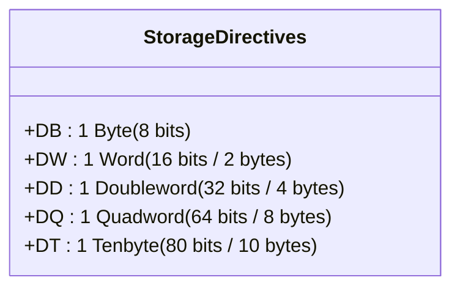
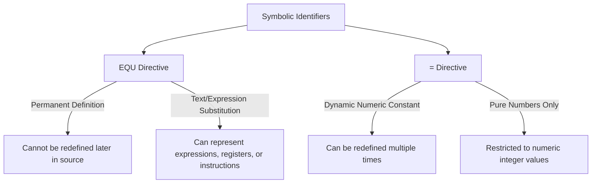

# Chapter 4 — 8086 Assembler Directives, Operators & Storage Allocation

> **Course Code:** 3CS526CC23  
> **Course Title:** Microprocessor and Interfacing [3 0 2 4]  
> **Governing Standard:** `notes_maker` Skill (Comprehensive Chapter Notes Generator)  
> **Primary Source:** Faculty Lecture Presentations (`Directives.pdf`, `8086_instruction_set_Basic.pdf`) & University Laboratory Guidelines  

---

## 1. Chapter Overview

Assembler directives (also known as pseudo-operations or pseudo-instructions) are directions to the assembler program (such as MASM, TASM, or NASM) rather than instructions executed directly by the 8086 CPU. While CPU instructions (`MOV`, `ADD`, `JMP`) translate into executable binary machine codes, directives govern memory reservation, data format definitions, variable typing, symbol equates, segment structuring, and location counter alignment.

This chapter details **every assembler directive and attribute operator** encountered in university curricula, including data definitions (`DB`, `DW`, `DD`, `DQ`, `DT`), array duplications (`DUP`), pointer overrides (`PTR`), symbolic definitions (`EQU`, `=`), segment declarations (`SEGMENT`, `ENDS`, `ASSUME`, `GROUP`), memory alignment (`EVEN`, `ORG`), procedure controls (`PROC`, `ENDP`), and value-returning attribute operators (`LENGTH`, `SIZE`, `OFFSET`, `SEG`, `TYPE`).

[Source: Directives.pdf, Slides 1–12]

---

## 2. Fundamental Directive Concepts & Two-Tier Terminology

### Definition: Assembler Directive
**Meaning:** A command written within an assembly language source file that directs the assembler how to assemble the program, allocate memory, or format the symbol table.  
**Formal Definition:** A non-executable pseudo-operation recognized exclusively during assembly passes that emits no CPU machine opcode but controls code generation, data storage allocation, and segment alignment.  
**Intuition:** While instructions tell the CPU what calculations to execute at runtime, directives tell the assembler how to build and organize the executable binary before it ever runs.  
**Example:** `DATA_ARR DW 100 DUP(0)` reserves 200 consecutive bytes in the data segment without producing CPU execution instructions.  

[Source: Directives.pdf, Slide 2]

---

### Core Directives Dictionary

1. **Pseudo-Op (Pseudo-Operation):** Synonymous with directive; a mnemonic that has no direct hardware opcode counterpart.
2. **Location Counter ($):** An internal assembler counter that tracks the current relative offset within the active segment during assembly.
3. **Data Allocation Directive:** Directives (`DB`, `DW`, `DD`, `DQ`, `DT`) that reserve physical bytes in the object module.
4. **Type Attribute:** The intrinsic data width associated with a memory label (`BYTE` = 1, `WORD` = 2, `DWORD` = 4).
5. **Distance Attribute:** The scope of a code label or procedure (`NEAR` = accessible within current 64 KB code segment; `FAR` = accessible across different code segments).
6. **Type Cast Operator (`PTR`):** A compiler directive that explicitly overrides or clarifies the memory access width of an operand.
7. **Paragraph Alignment:** Aligning memory to a physical address divisible by 16 ($10\text{H}$), forcing the lowest 4 bits of the address to zero.
8. **Symbol Table:** An internal table constructed by the assembler during Pass 1 mapping every symbolic identifier to its segment, offset, and type attribute.

[Source: Directives.pdf, Slides 2, 7, 12]

---

## 3. Data Definition & Storage Allocation Directives

Data allocation directives allocate memory in bytes, words, doublewords, quadwords, or ten-byte blocks.



### Comprehensive Storage Specification Table

| Directive | Full Name | Size in Bits | Size in Bytes | Numeric Range (Unsigned) | Numeric Range (Signed 2's Comp) | Common Applications |
| :--- | :--- | :---: | :---: | :---: | :---: | :--- |
| **DB** | Define Byte | 8 | 1 | $0$ to $255$ (`00H` to `FFH`) | $-128$ to $+127$ | ASCII characters, 8-bit integers, byte arrays. |
| **DW** | Define Word | 16 | 2 | $0$ to $65,535$ (`0000H` to `FFFFH`) | $-32,768$ to $+32,767$ | 16-bit integers, near memory pointers (offsets). |
| **DD** | Define Doubleword | 32 | 4 | $0$ to $2^{32}-1$ | $-2^{31}$ to $+2^{31}-1$ | 32-bit integers, far memory pointers (Segment:Offset). |
| **DQ** | Define Quadword | 64 | 8 | $0$ to $2^{64}-1$ | $-2^{63}$ to $+2^{63}-1$ | 64-bit integer values, double-precision floats. |
| **DT** | Define Tenbyte | 80 | 10 | - | - | Packed BCD numbers, 80-bit extended precision floats. |

---

### Data Definition Syntax & Behavioral Variants

#### 1. Integer & Constant Allocations
```assembly
DATA_BYTE  DB  10, 4, 10H       ; Allocates 3 bytes: 0AH, 04H, 10H
DATA_WORD  DW  100, 100H, -5    ; Allocates 3 words: 0064H, 0100H, FFFBH (2's complement of 5)
DATA_DWORD DD  3*20, 0FFFDH     ; Allocates two 32-bit dwords: 0000003CH (60 decimal), 0000FFFDH
```

#### 2. String Allocations
Strings are stored as sequences of sequential ASCII byte codes.
```assembly
MESSAGE1 DB 'H', 'E', 'L', 'L', 'O'        ; 5 discrete ASCII bytes: 48H, 45H, 4CH, 4CH, 4FH
MESSAGE2 DB 'HELLO'                        ; Exact equivalent to MESSAGE1
STR1     DB 'AB'                           ; Allocates 2 bytes: 'A' (41H) then 'B' (42H)
STR2     DW 'AB'                           ; Allocates 1 word: Little-Endian stores 'B' (42H) then 'A' (41H)
DOS_STR  DB 'Welcome to 8086$', 0DH, 0AH   ; Terminated with '$' for INT 21H / AH=09H, followed by CR, LF
```

#### 3. Uninitialized Memory Reservation (`?`)
When variables do not require specific initial values, the question mark (`?`) instructs the assembler to allocate storage without initializing memory, avoiding unnecessary object file overhead.
```assembly
TEMP_VAR DB ?              ; Reserves 1 uninitialized byte
ABC      DB 0, ?, ?, ?, 0  ; Reserves 5 bytes: byte 0=00H, bytes 1..3=uninitialized, byte 4=00H
DEF      DW ?, 52, ?       ; Reserves 3 words: uninitialized, 0034H, uninitialized
```

---

## 4. The Duplication Operator (`DUP`)

The `DUP` (Duplicate) operator initializes or reserves repeating sequences of data elements or structures.

### Syntax
$$
\text{Count} \quad \text{DUP} \quad (\text{Operand}_1, \text{Operand}_2, \dots, \text{Operand}_n)
$$

Where:
- $\text{Count}$ is an integer constant or evaluated expression specifying the repetition factor.
- Operands inside parentheses can be constants, uninitialized markers (`?`), or nested `DUP` expressions.

```assembly
ARRAY1 DB 2 DUP(0, 1, 2, ?)              ; Produces: 00, 01, 02, ?, 00, 01, 02, ? (8 bytes total)
ARRAY2 DB 100 DUP(?)                     ; Reserves an uninitialized 100-byte buffer
STACK_MEM DW 64 DUP(?)                   ; Reserves a 64-word (128-byte) stack frame
ARRAY3 DB 10 DUP(0, 2 DUP(1, 2), 0, 3)   ; Nested DUP: creates repeating structured record
```

#### Memory Footprint Breakdown of `ARRAY3`:
Each single iteration generates:

2885
0, \quad [1, 2, 1, 2], \quad 0, \quad 3 \implies 7 	ext{ bytes per group}
2885

Total bytes allocated for $10 \text{ groups} = 10 \times 7 = 70 \text{ bytes}$.

[Source: Directives.pdf, Slides 2–4]

---

## 5. Storage Preassignment & Pointer Tables

Directives can store the memory addresses of other variables or labels directly into pointer lookup tables.

```assembly
; Define variables
PAR1 DB 10H
PAR2 DW 1234H
PAR3 DB 20H

; Preassign 16-bit Near Pointers (Offset Addresses)
PARAMETER_TABLE DW PAR1    ; Stores 16-bit offset of PAR1
                DW PAR2    ; Stores 16-bit offset of PAR2
                DW PAR3    ; Stores 16-bit offset of PAR3

; Preassign 32-bit Far Pointers (Offset + Segment Addresses)
INTERSEG_TABLE  DD PAR1    ; Stores 16-bit offset of PAR1 followed by 16-bit segment of PAR1
                DD PAR2    ; Stores 16-bit offset of PAR2 followed by 16-bit segment of PAR2
```

[Source: Directives.pdf, Slide 5]

---

## 6. Type Clarification & The `PTR` Override Operator

Because the 8086 architecture is strongly typed at the assembler level, instructions referencing memory operands must have an unambiguously resolvable data width (Byte vs Word).

### Ambiguity Rule
If an instruction operates on a memory pointer without an accompanying register operand, the assembler cannot deduce whether to read/write 1 byte or 2 bytes:
```assembly
INC [BX]       ; COMPILER ERROR: Undefined operand size!
MOV [DI], 0    ; COMPILER ERROR: Is immediate 0 a Byte (00H) or Word (0000H)?
```

### Resolution via `PTR`
The `PTR` (Pointer) operator forces the assembler to treat the target memory address as a specific type:
```assembly
INC BYTE PTR [BX]       ; Increments 8-bit memory byte at DS:[BX]
INC WORD PTR [BX]       ; Increments 16-bit memory word at DS:[BX]
MOV BYTE PTR [DI], 0    ; Writes 8-bit 00H to ES:[DI]
MOV WORD PTR [DI], 0    ; Writes 16-bit 0000H to ES:[DI]
```

### Overriding Mismatched Variable Types
The `PTR` operator also permits accessing a variable under a different data size than originally declared:
```assembly
OPER1 DB 12H, 34H
OPER2 DW 5678H

; Illegal Type Mismatches:
MOV OPER1 + 1, AX       ; ERROR: Cannot move 16-bit AX into 8-bit declared variable OPER1
MOV OPER2, AL           ; ERROR: Cannot move 8-bit AL into 16-bit declared variable OPER2

; Legal Overrides using PTR:
MOV WORD PTR OPER1 + 1, AX   ; Legal: Treats address (OPER1 + 1) as a 16-bit WORD
MOV BYTE PTR OPER2, AL       ; Legal: Moves AL into lower byte of OPER2 (stores AL at OPER2)
MOV AL, BYTE PTR OPER2 + 1   ; Legal: Loads higher byte of OPER2 into AL
```

[Source: Directives.pdf, Slide 6; 8086_instruction_set_Basic, Slide 5]

---

## 7. The `LABEL` Directive

The `LABEL` directive creates a new symbolic name at the current location counter with a specified type or distance attribute, **without allocating any additional memory**.

### Syntax
$$
\text{Name} \quad \text{LABEL} \quad \text{Type/Distance}
$$

Where $\text{Type/Distance} \in \{\text{BYTE}, \text{WORD}, \text{DWORD}, \text{NEAR}, \text{FAR}\}$.

### Dual-Access Data Buffer Pattern
```assembly
DATA SEGMENT
    BYTE_ARRAY LABEL BYTE     ; Creates an 8-bit alias for the upcoming address
    WORD_ARRAY DW 50 DUP(0)   ; Allocates 50 words (100 bytes) starting at this exact address
DATA ENDS

CODE SEGMENT
    ; Accessing the exact same memory location as either a WORD or a BYTE without compiler warnings:
    MOV WORD_ARRAY + 2, 1234H ; Writes word 1234H starting at byte offset 2
    MOV BYTE_ARRAY + 2, 55H   ; Writes byte 55H at byte offset 2 (overwrites lower byte 34H)
CODE ENDS
```

[Source: Directives.pdf, Slide 7]

---

## 8. Symbolic Equates: `EQU` vs `=` Directives

Equate directives bind symbolic constants or expressions to human-readable identifiers.



### Comparison Matrix: `EQU` vs `=`

| Feature | `EQU` Directive | `=` Directive |
| :--- | :--- | :--- |
| **Redefinability** | **Permanently bound.** Re-declaring throws a compiler error. | **Freely redefinable** anywhere in the code. |
| **Allowed Values** | Numbers, addresses, expressions, register names, mnemonics. | Strictly numeric integer expressions. |
| **Memory Allocation** | Zero bytes (replaces tokens in symbol table during assembly).| Zero bytes. |
| **Example** | `BUFFER_SIZE EQU 1024`<br>`PORT_DATA EQU DX`<br>`INDEX_CHAR EQU ARRAY[SI+5]` | `COUNTER = 0`<br>`COUNTER = COUNTER + 1` |

```assembly
; EQU Examples
INDXD_CHAR EQU CHAR_ARRAY[SI + 10]
MOV AL, INDXD_CHAR       ; Translated to: MOV AL, CHAR_ARRAY[SI + 10]

NUM EQU 6
ADD BX, NUM              ; Translated to: ADD BX, 6

; = Examples
PORT_VAL = 0FFH
MOV AL, PORT_VAL
PORT_VAL = 00H           ; Redefined cleanly
MOV BL, PORT_VAL
```

[Source: Directives.pdf, Slide 8]

---

## 9. Segment Organization & Procedure Directives

### Segment Directives (`SEGMENT`, `ENDS`, `ASSUME`, `END`)
```assembly
DATA SEGMENT                  ; Begins logical segment named 'DATA'
    VAL1 DB 25H
DATA ENDS                     ; Terminates logical segment 'DATA'

CODE SEGMENT                  ; Begins logical segment 'CODE'
    ASSUME CS:CODE, DS:DATA   ; Informs assembler which segment registers map to which segments
START:
    MOV AX, DATA              ; Load segment base address of DATA into AX
    MOV DS, AX                ; Initialize DS register (Immediate cannot be moved directly to DS)
    ; ... program code ...
    MOV AH, 4CH               ; DOS terminate function
    INT 21H
CODE ENDS                     ; Terminates logical segment 'CODE'
END START                     ; Ends source file; declares 'START' as execution entry point
```

### Procedure Definition (`PROC`, `ENDP`)
Procedures (subroutines) are defined using `PROC` and ended with `ENDP`.
```assembly
; NEAR procedure: called only from within current code segment (CS unchanged, only IP pushed/popped)
CALCULATE_SUM PROC NEAR
    ADD AX, BX
    RET                       ; Emits Near RET opcode (Pops 2-byte IP)
CALCULATE_SUM ENDP

; FAR procedure: callable from other segments (Both CS and IP pushed/popped)
DISPLAY_MESSAGE PROC FAR
    MOV AH, 09H
    INT 21H
    RET                       ; Emits Far RET opcode (Pops 2-byte IP, then 2-byte CS)
DISPLAY_MESSAGE ENDP
```

[Source: Directives.pdf, Slide 9]

---

## 10. Alignment & Location Counter Directives

### `ORG` (Origin Directive)
Sets the assembler's internal location counter (`$`) to a specified offset within the active segment.
```assembly
VECTORS SEGMENT
    ORG 0010H                 ; Force next data to offset 0010H
    VECT1 DW 1234H            ; Placed at offset 0010H and 0011H
    
    ORG 0020H                 ; Force location counter to offset 0020H
    VECT2 DW 5678H            ; Placed at offset 0020H and 0021H
VECTORS ENDS
```

### `EVEN` & `ALIGN` Directives
The 8086 has a 16-bit external data bus that reads a full 16-bit word in **1 bus cycle (4 T-states)** if the word begins at an **even memory address**. If a word begins at an odd address, the CPU requires **2 bus cycles (8 T-states)** to fetch it.
- **`EVEN`**: Advances the location counter to the next even address by inserting an alignment `NOP` (in code) or padding byte `00H` (in data) if currently at an odd address.
- **`ALIGN n`**: Advances location counter to next boundary divisible by $n$ ($n = 2, 4, 16$).

```assembly
DATA SEGMENT
    FLAG_BYTE DB 01H          ; Stored at offset 0000H (Odd offset 0001H is next)
    EVEN                      ; Location counter advances from 0001H to 0002H
    WORD_ARR  DW 100 DUP(0)   ; Stored starting at even address 0002H (Optimized bus access!)
DATA ENDS
```

[Source: Directives.pdf, Slides 10–11]

---

## 11. Value-Returning Attribute Operators

Attribute operators evaluate meta-properties of variables and symbols during assembly, substituting constant numerical values into the generated machine instruction.

| Operator | Evaluated Value Returned | Return Type | Typical Code Example | Evaluated Machine Result |
| :--- | :--- | :---: | :--- | :--- |
| **`LENGTH`** | Returns the repetition count ($N$) defined in the first `DUP` clause. | 16-bit integer | `MOV CX, LENGTH ARRAY` | Loads array count into loop register `CX`. |
| **`SIZE`** | Total bytes allocated by variable (`LENGTH * TYPE`). | 16-bit integer | `MOV CX, SIZE ARRAY` | Loads total buffer byte count. |
| **`OFFSET`** | The 16-bit offset address of the variable from segment base. | 16-bit address | `MOV BX, OFFSET ARRAY` | Loads offset pointer into base register `BX`. |
| **`SEG`** | The 16-bit base paragraph address of the segment containing variable. | 16-bit address | `MOV AX, SEG ARRAY` | Loads segment selector for subsequent `DS` load. |
| **`TYPE`** | Evaluates byte width of data, or distance of code label: <br> `DB` = 1, `DW` = 2, `DD` = 4, `DQ` = 8, `DT` = 10, `NEAR` = -1, `FAR` = -2. | Integer | `ADD SI, TYPE ARRAY` | Automatically steps pointer `SI` by element width. |

#### Comprehensive Worked Demonstration
```assembly
DATA SEGMENT
    A DW 100 DUP(0)           ; 100 words (200 bytes total)
DATA ENDS

CODE SEGMENT
    ASSUME CS:CODE, DS:DATA
START:
    MOV CX, LENGTH A          ; Assembler replaces with: MOV CX, 100
    MOV CX, SIZE A            ; Assembler replaces with: MOV CX, 200 (100 elements * 2 bytes)
    MOV BX, OFFSET A          ; Assembler replaces with: MOV BX, 0000H (Offset of A in DATA)
    MOV AX, SEG A             ; Assembler replaces with: MOV AX, DATA (Segment address of DATA)
    ADD SI, TYPE A            ; Assembler replaces with: ADD SI, 2 (Since A is declared DW)
CODE ENDS
```

[Source: Directives.pdf, Slide 12]

---

## 12. Exam-Oriented Review & High-Frequency Questions

1. **Why does `MOV DS, 1000H` fail to assemble, and how must it be written?**  
   *Answer:* The 8086 ISA does not support an immediate-to-segment register addressing mode. The value must be routed through a general-purpose register:
   ```assembly
   MOV AX, 1000H
   MOV DS, AX
   ```
2. **What is the difference between `LENGTH` and `SIZE` operators in MASM?**  
   *Answer:* `LENGTH` returns the number of elements specified in the variable's `DUP` declaration. `SIZE` returns the total byte allocation, computed as $\text{SIZE} = \text{LENGTH} \times \text{TYPE}$. For `A DW 50 DUP(?)`, $\text{LENGTH A} = 50$, while $\text{SIZE A} = 100$.
3. **When is the `PTR` operator strictly required in assembly programming?**  
   *Answer:* `PTR` is mandatory whenever a memory operand is referenced without an accompanying register operand that establishes the data width (e.g., `INC [BX]`, `MOV [DI], 10H`), and when overriding the declared type of a memory variable (e.g., moving an 8-bit byte from a `DW` variable using `MOV AL, BYTE PTR [VAR_DW]`).


## Summary Formula
- **Physical Address Formula:** $	ext{Physical Address} = (	ext{Segment} 	imes 16) + 	ext{Offset}$.
