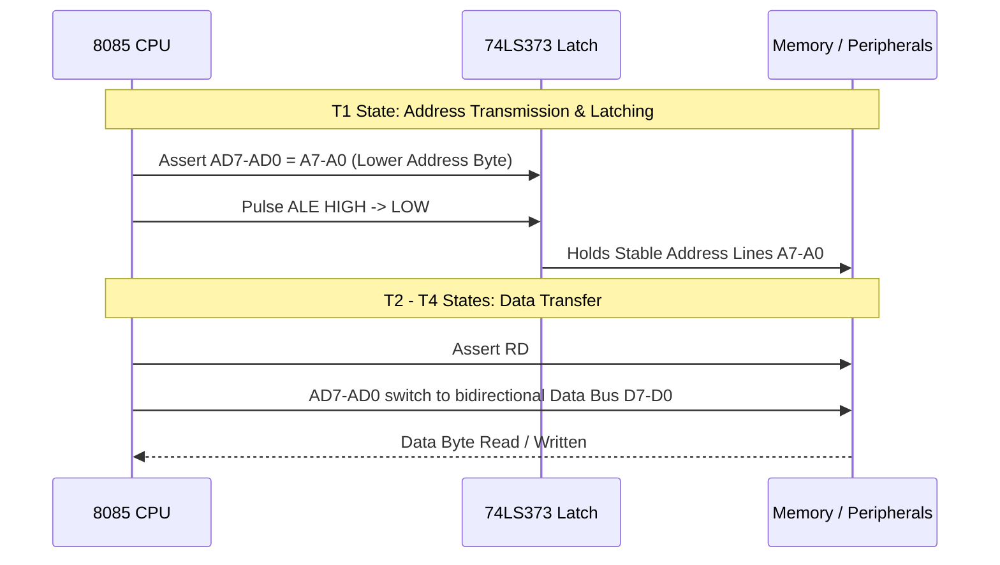

# Chapter 2 — 8085 Microprocessor Architecture, Interfacing & Complete Instruction Set

> **Course Code:** 3CS526CC23  
> **Course Title:** Microprocessor and Interfacing [3 0 2 4]  
> **Governing Standard:** `notes_maker` Skill (Comprehensive Chapter Notes Generator)  
> **Primary Source:** Faculty Lecture Presentations (`8085 PPT.pdf`, `3CS526CC23 Introduction.pdf`) & Reference Literature (Ramesh Gaonkar, Hall & Rao)  

---

## 1. Chapter Overview

This chapter delivers a thorough, university-level examination of the Intel 8085 8-bit microprocessor. It integrates internal architecture, register configuration, flag behaviors, multiplexed bus operations, pin specifications, machine status decoding, interrupt processing, 8259 Programmable Interrupt Controller (PIC) interfacing, and a **fully detailed, instruction-by-instruction reference of the entire 8085 instruction set** (Data Transfer, Arithmetic, Logical, Branching, and Machine Control) with addressing modes, opcode sizes, machine cycles, T-states, flag impacts, and worked assembly routines.

[Source: 8085 PPT, Slides 1–34]

---

## 2. Fundamental Architectural Concepts & Specifications

### Definition: Microprocessor
**Meaning:** A digital integrated circuit that functions as the central arithmetic, logical, and control processing unit of a microcomputer system.  
**Formal Definition:** An 8-bit, multipurpose, clock-driven, NMOS/HMOS register-based Central Processing Unit (CPU) capable of fetching, decoding, and executing machine language instructions to manipulate binary data.  
**Intuition:** The electronic "brain" that coordinates memory and input/output peripherals via a synchronized three-bus architecture.  
**Example:** The Intel 8085A operating with a 6.144 MHz crystal to produce a 3.072 MHz internal execution clock.  

[Source: 8085 PPT, Slide 10]

---

### Key Architectural Specifications of Intel 8085

| Parameter | Specification | Functional Details |
| :--- | :--- | :--- |
| **Word Length** | 8 bits | Processes, transfers, and stores data in 8-bit byte increments. |
| **Data Bus** | 8 bits ($D_7 - D_0$) | Bidirectional; time-multiplexed with lower address bus ($AD_7 - AD_0$). |
| **Address Bus** | 16 bits ($A_{15} - A_0$) | Unidirectional; directly addresses $2^{16} = 65,536\text{ bytes}$ (64 KB). |
| **Clock Frequency** | 3.0 MHz (8085A) / 5.0 MHz (8085A-2) | Driven by external quartz crystal on $X_1, X_2$; divided by 2 internally. |
| **Power Supply** | Single $+5\text{V DC}$ ($V_{CC}$), $V_{SS}$ (GND) | Major improvement over 8080 (which required $+5\text{V}, -5\text{V}, +12\text{V}$). |
| **Packaging** | 40-pin Plastic / Ceramic DIP | Dual-in-line package. |
| **Internal Registers** | 12 addressable 8-bit registers | A, B, C, D, E, H, L, Flags, SP (16-bit), PC (16-bit), W, Z (internal). |
| **Interrupt System** | 5 Hardware Interrupts | TRAP (NMI), RST 7.5, RST 6.5, RST 5.5, INTR. |
| **DMA Controller Support**| HOLD and HLDA lines | Provides high-speed direct memory transfer bypassing the CPU. |
| **Serial I/O Lines** | Dedicated SID and SOD pins | Software-controlled 1-bit serial communication via `RIM` / `SIM`. |
| **Machine Status Pins** | $IO/\overline{\text{M}}$, $S_1$, $S_0$ | Explicitly signal active bus transaction type to peripheral decoders. |

[Source: 8085 PPT, Slide 12]

---

## 3. Internal Functional Architecture

The internal organization of the 8085 is partitioned into functional processing units:

### Figure 2.1: 8085 High-Level Block Diagram


### Figure 2.2: 8085 Detailed Internal Functional Diagram

```mermaid
flowchart TD
    subgraph ALU_Subsystem["Arithmetic Logic Unit (ALU) Subsystem"]
        ACC["Accumulator (Reg A - 8 bit)"]
        TEMP_REG["Temporary Register (8 bit)"]
        ALU["8-Bit ALU"]
        FLAGS["Flag Register (5 Flip-Flops)"]
        ACC --> ALU
        TEMP_REG --> ALU
        ALU --> ACC
        ALU --> FLAGS
    end

    subgraph Register_Array["Internal Register Array"]
        W_Z["Temporary Regs (W, Z - 8 bit each)"]
        BC["B (8) | C (8)"]
        DE["D (8) | E (8)"]
        HL["H (8) | L (8) - Memory Pointer"]
        SP["Stack Pointer (SP - 16 bit)"]
        PC["Program Counter (PC - 16 bit)"]
        ADDR_INC["Incrementer / Decrementer Address Latch"]
    end

    subgraph Control_Unit["Timing & Control Unit"]
        CLK_GEN["Clock Generator (X1, X2, CLK OUT)"]
        CTRL_SIGS["Control Signals: RD#, WR#, ALE"]
        STATUS_SIGS["Status Signals: IO/M#, S0, S1"]
        DMA_SIGS["DMA: HOLD, HLDA"]
        RESET_SIGS["Reset: RESET IN#, RESET OUT"]
    end

    subgraph Instruction_Unit["Instruction Register & Decoder"]
        IR["Instruction Register (8 bit)"]
        ID["Instruction Decoder & Machine Cycle Encoding"]
        IR --> ID
        ID --> Control_Unit
    end

    subgraph Interrupt_Serial["Interrupt & Serial I/O"]
        INTR_CTRL["Interrupt Control (TRAP, RST 7.5, 6.5, 5.5, INTR, INTA#)"]
        SERIAL_CTRL["Serial I/O (SID, SOD)"]
    end

    ExtBus["8-Bit Internal Data Bus"] <--> ALU_Subsystem
    ExtBus <--> Register_Array
    ExtBus <--> Instruction_Unit
    ExtBus <--> Interrupt_Serial
    Register_Array --> ADDR_INC
    ADDR_INC --> AddressBus["Address Bus A15-A8 & AD7-AD0"]
```




#### Detailed Written Analysis of Functional Blocks

1. **Accumulator (Register A):** An 8-bit register connected directly to the internal data bus and ALU input. It supplies one of the two ALU source operands and receives the result of all arithmetic and logical operations. It also serves as the default register for all memory accumulator loads/stores (`LDA`, `STA`) and I/O transfers (`IN`, `OUT`).
2. **Temporary Register:** An 8-bit non-programmable register that holds the second operand for the ALU. When an instruction such as `ADD B` executes, the contents of register B are transferred into the temporary register before the ALU adds it to the accumulator.
3. **Flag Register:** Five 1-bit status flip-flops ($S, Z, AC, P, CY$) that record execution status and conditions following ALU operations.
4. **General-Purpose Registers (B, C, D, E, H, L):** Six 8-bit registers organized as register pairs:
   - **BC Pair:** Holds 16-bit count values or memory addresses.
   - **DE Pair:** Holds secondary 16-bit memory addresses or data operands.
   - **HL Pair:** Functions as the primary 16-bit **Memory Pointer ($M$)**. Whenever an instruction references operand `M`, the CPU accesses the physical memory location addressed by the 16-bit contents of $H$ (high byte) and $L$ (low byte).
5. **Temporary Registers W and Z:** Two internal 8-bit registers utilized strictly by the control unit to hold 16-bit addresses or data operands during two-byte and three-byte instruction executions (e.g., `CALL`, `XCHG`, `LHLD`). Completely inaccessible to programmers.
6. **Program Counter (PC):** A 16-bit register containing the memory address of the next sequential instruction byte to be fetched. It is automatically incremented after each byte fetch.
7. **Stack Pointer (SP):** A 16-bit register storing the current memory address of the Top of Stack in Read/Write RAM. The stack grows downward toward lower memory addresses. SP is decremented by 2 during `PUSH` and `CALL`, and incremented by 2 during `POP` and `RET`.
8. **Instruction Register (IR) & Decoder:** Holds the 8-bit opcode fetched from memory during the Opcode Fetch machine cycle ($M_1$). The decoder translates this binary opcode into micro-operations that direct internal execution.
9. **Timing and Control Unit:** Orchestrates all internal CPU operations and drives external control buses ($\overline{\text{RD}}$, $\overline{\text{WR}}$, $\text{ALE}$) in synchrony with the clock oscillator.

[Source: 8085 PPT, Slides 13, 20–22]

---

## 4. 8085 Register Configuration & Flag Register Details

### Figure 2.3: 8085 Register Array Structure


### Figure 2.4: 8085 Flag Register Format


```text
Bit Position:   D7   D6   D5   D4   D3   D2   D1   D0
Flag Bit:     [  S |  Z |  X | AC |  X |  P |  X | CY ]
              (X = Unspecified / Undefined)
```

| Flag Symbol | Flag Name | Set Condition ($= 1$) | Reset Condition ($= 0$) |
| :---: | :--- | :--- | :--- |
| **S** | Sign Flag | Bit $D_7$ of ALU result is `1` (negative signed number). | Bit $D_7$ of ALU result is `0` (positive signed number). |
| **Z** | Zero Flag | ALU result is exactly `00H` (all 8 bits zero). | ALU result is non-zero (`01H` to `FFH`). |
| **AC**| Auxiliary Carry | Carry generated out of bit $D_3$ into bit $D_4$ (BCD half-carry). | No carry from bit $D_3$ to $D_4$. |
| **P** | Parity Flag | Result contains an **even number of 1-bits** (Even Parity). | Result contains an **odd number of 1-bits** (Odd Parity). |
| **CY**| Carry Flag | Carry generated out of MSB ($D_7$) in addition, or borrow in subtraction. | No carry out of $D_7$ or borrow required. |

#### Worked Inline Example: Flag Calculation
Execute `ADD B` where Accumulator $\text{A} = \text{C4H}$ ($1100\,0100_2$) and $\text{B} = \text{5CH}$ ($0101\,1100_2$):

$$
\begin{aligned}
\text{Accumulator (A):} & \quad 1100\,\,\,0100_2 \quad (\text{C}4\text{H}) \\
+ \text{Register B:} & \quad 0101\,\,\,1100_2 \quad (5\text{CH}) \\
\hline
\text{Sum Result:} & \quad 1\,\,0010\,\,\,0000_2 \quad (20\text{H with Carry Out } 1)
\end{aligned}
$$

- **Carry Flag (CY):** `1` (Carry out of bit $D_7$).
- **Zero Flag (Z):** `0` (Lower 8 bits = `20H` $\neq 0$).
- **Sign Flag (S):** `0` (Bit $D_7$ of result is `0`).
- **Auxiliary Carry (AC):** `1` (Bit $D_3$ sum: $0 + 1 + 0 = 0$ with no carry... wait: bit $D_2=1, D_2=1 \rightarrow 1+1=0$, carry to $D_3$; $0+1+1=0$, carry to $D_4 \rightarrow AC = 1$).
- **Parity Flag (P):** `0` (Result `0010 0000` has only one `1` bit $\rightarrow$ odd parity).

[Source: 8085 PPT, Slide 23]

---

## 5. Pin Diagram, Signal Classifications & Bus Demultiplexing

### Figure 2.5: 8085 Pin Out & Interrupt Lines


### Bus Demultiplexing Mechanism (ALE)
To minimize physical IC pin count to 40, the 8085 time-multiplexes the lower 8 bits of the address bus with the 8-bit bidirectional data bus ($AD_7 - AD_0$).
- During state $T_1$ of every machine cycle, lines $AD_7 - AD_0$ emit the lower 8 address bits ($A_7 - A_0$).
- Simultaneously, the CPU pulses **$\text{ALE}$ (Address Latch Enable)** HIGH.
- The falling edge of $\text{ALE}$ strobes the address into an external 8-bit D-type latch (such as the 74LS373).
- During states $T_2, T_3, T_4$, $\text{ALE}$ remains LOW, and lines $AD_7 - AD_0$ function exclusively as bidirectional data lines ($D_7 - D_0$).



---

### Complete Machine Status Signal Decoding Table

The combination of $IO/\overline{\text{M}}$, $S_1$, and $S_0$ defines the active machine cycle:

| $IO/\overline{\text{M}}$ | $S_1$ | $S_0$ | Machine Cycle | Active Control Signal | Typical T-States |
| :---: | :---: | :---: | :--- | :---: | :---: |
| **0** | **1** | **1** | **Opcode Fetch (OF)** | $\overline{\text{RD}} = 0$ | 4 or 6 |
| **0** | **1** | **0** | **Memory Read (MR)** | $\overline{\text{RD}} = 0$ | 3 |
| **0** | **0** | **1** | **Memory Write (MW)** | $\overline{\text{WR}} = 0$ | 3 |
| **1** | **1** | **0** | **I/O Read (IOR)** | $\overline{\text{RD}} = 0$ | 3 |
| **1** | **0** | **1** | **I/O Write (IOW)** | $\overline{\text{WR}} = 0$ | 3 |
| **1** | **1** | **1** | **Interrupt Acknowledge (INA)** | $\overline{\text{INTA}} = 0$ | 6 or 12 |
| **0** | **0** | **0** | **Halt State** | None (Buses Tri-Stated) | Infinite |

[Source: 8085 PPT, Slides 15–19]

---

## 6. Interrupt System & 8259 PIC Interfacing

### 8085 Hardware Interrupt Hierarchy

| Interrupt | Priority | Trigger Mode | Maskability | Vector Address | Vector Calculation Formula |
| :--- | :---: | :--- | :--- | :---: | :--- |
| **TRAP** | 1 (Highest) | Level & Rising-Edge | Non-Maskable | `0024H` | Fixed vector ($4.5 \times 8 = 36_{10} = 24\text{H}$) |
| **RST 7.5** | 2 | Rising-Edge Only | Maskable (`SIM`) | `003CH` | Fixed vector ($7.5 \times 8 = 60_{10} = 3\text{CH}$) |
| **RST 6.5** | 3 | High-Level Only | Maskable (`SIM`) | `0034H` | Fixed vector ($6.5 \times 8 = 52_{10} = 34\text{H}$) |
| **RST 5.5** | 4 | High-Level Only | Maskable (`SIM`) | `0020H` | Fixed vector ($5.5 \times 8 = 44_{10} = 20\text{H}$) |
| **INTR** | 5 (Lowest) | High-Level Only | Maskable (`EI`/`DI`)| External | Provided by external hardware / 8259 PIC |

### Figure 2.6: 8259 Interrupt Controller Block Diagram


#### 8259 Handshake Execution Sequence
1. Peripheral devices assert interrupt request lines $IR_0 - IR_7$ on the 8259 PIC.
2. 8259 evaluates priority logic against the Interrupt Mask Register (IMR). If unmasked, it raises `INTR` HIGH to the 8085.
3. Upon finishing its current instruction cycle, 8085 issues three negative pulses on $\overline{\text{INTA}}$:
   - **1st Pulse:** 8259 places the `CALL` opcode (`CDH`) onto the data bus.
   - **2nd Pulse:** 8259 places the lower byte of the Subroutine Call Address onto the data bus.
   - **3rd Pulse:** 8259 places the higher byte of the Subroutine Call Address onto the data bus.
4. The 8085 pushes its 16-bit Program Counter (PC) onto the stack and jumps to the vector address.

[Source: 8085 PPT, Slides 26–34]

---

## 7. Complete 8085 Instruction Set (Exhaustive Reference)

The 8085 features **80 basic instructions** that expand into **246 total opcodes**. Instructions are 1, 2, or 3 bytes long.

### 7.1 Data Transfer Group (13 Primary Instructions)
**Rule:** Data transfer instructions **never affect condition flags**.

| Mnemonic | Operands | Bytes | Machine Cycles | T-States | Addressing Mode | Operation Description |
| :--- | :--- | :---: | :---: | :---: | :--- | :--- |
| **MOV** | $r_1, r_2$ | 1 | 1 (OF) | 4 | Register | $(r_1) \leftarrow (r_2)$. Copies register $r_2$ to $r_1$. |
| **MOV** | $r, M$ | 1 | 2 (OF, MR) | 7 | Reg. Indirect | $(r) \leftarrow ((H)(L))$. Copies memory byte at address HL to register $r$. |
| **MOV** | $M, r$ | 1 | 2 (OF, MW) | 7 | Reg. Indirect | $((H)(L)) \leftarrow (r)$. Copies register $r$ to memory byte at HL. |
| **MVI** | $r, \text{data8}$ | 2 | 2 (OF, MR) | 7 | Immediate | $(r) \leftarrow \text{byte 2}$. Loads immediate 8-bit data into register $r$. |
| **MVI** | $M, \text{data8}$ | 2 | 3 (OF, MR, MW) | 10 | Immediate/Indirect | $((H)(L)) \leftarrow \text{byte 2}$. Stores immediate byte into memory at HL. |
| **LXI** | $rp, \text{data16}$| 3 | 3 (OF, MR, MR) | 10 | Immediate | $(rp) \leftarrow \text{bytes 2 \& 3}$. Loads 16-bit data into register pair $rp$ (BC, DE, HL, SP). |
| **LDA** | $\text{addr16}$ | 3 | 4 (OF, MR, MR, MR)| 13 | Direct | $(A) \leftarrow (\text{addr16})$. Loads byte from direct 16-bit address into A. |
| **STA** | $\text{addr16}$ | 3 | 4 (OF, MR, MR, MW)| 13 | Direct | $(\text{addr16}) \leftarrow (A)$. Stores Accumulator byte into direct 16-bit address. |
| **LHLD**| $\text{addr16}$ | 3 | 5 (OF, 4 MR) | 16 | Direct | $(L) \leftarrow (\text{addr})$, $(H) \leftarrow (\text{addr}+1)$. Loads HL from direct address. |
| **SHLD**| $\text{addr16}$ | 3 | 5 (OF, 2 MR, 2 MW)| 16 | Direct | $(\text{addr}) \leftarrow (L)$, $(\text{addr}+1) \leftarrow (H)$. Stores HL into direct address. |
| **LDAX**| $rp$ (BC/DE)| 1 | 2 (OF, MR) | 7 | Reg. Indirect | $(A) \leftarrow ((rp))$. Loads Accumulator from address in BC or DE. |
| **STAX**| $rp$ (BC/DE)| 1 | 2 (OF, MW) | 7 | Reg. Indirect | $((rp)) \leftarrow (A)$. Stores Accumulator into address held in BC or DE. |
| **XCHG**| None | 1 | 1 (OF) | 4 | Register | $(H) \leftrightarrow (D)$, $(L) \leftrightarrow (E)$. Swaps HL and DE register pairs. |

---

### 7.2 Arithmetic Group (14 Primary Instructions)
**Flag Impact:** All arithmetic instructions update $S, Z, AC, P, CY$, **except `INX` and `DCX` (which affect NO flags)**, and `DAD` (which updates **ONLY the Carry Flag CY**).

| Mnemonic | Operands | Bytes | Cycles | T-States | Flags Affected | Operation Description |
| :--- | :--- | :---: | :---: | :---: | :---: | :--- |
| **ADD** | $r$ | 1 | 1 | 4 | All ($S,Z,AC,P,CY$) | $(A) \leftarrow (A) + (r)$. Adds register to Accumulator. |
| **ADD** | $M$ | 1 | 2 | 7 | All | $(A) \leftarrow (A) + ((H)(L))$. Adds memory byte at HL to A. |
| **ADI** | $\text{data8}$ | 2 | 2 | 7 | All | $(A) \leftarrow (A) + \text{data8}$. Adds immediate byte to A. |
| **ADC** | $r$ / $M$ | 1 | 1 / 2 | 4 / 7 | All | $(A) \leftarrow (A) + (r/M) + CY$. Add with Carry. |
| **ACI** | $\text{data8}$ | 2 | 2 | 7 | All | $(A) \leftarrow (A) + \text{data8} + CY$. Add immediate with Carry. |
| **SUB** | $r$ / $M$ | 1 | 1 / 2 | 4 / 7 | All | $(A) \leftarrow (A) - (r/M)$. Subtracts register/memory from A. |
| **SUI** | $\text{data8}$ | 2 | 2 | 7 | All | $(A) \leftarrow (A) - \text{data8}$. Subtracts immediate byte from A. |
| **SBB** | $r$ / $M$ | 1 | 1 / 2 | 4 / 7 | All | $(A) \leftarrow (A) - (r/M) - CY$. Subtract with Borrow. |
| **SBI** | $\text{data8}$ | 2 | 2 | 7 | All | $(A) \leftarrow (A) - \text{data8} - CY$. Subtract immediate with Borrow. |
| **INR** | $r$ / $M$ | 1 | 1 / 3 | 4 / 10 | $S, Z, AC, P$ (**CY NOT affected**) | Increments register or memory byte by 1. |
| **DCR** | $r$ / $M$ | 1 | 1 / 3 | 4 / 10 | $S, Z, AC, P$ (**CY NOT affected**) | Decrements register or memory byte by 1. |
| **INX** | $rp$ | 1 | 1 | 6 | **None** | $(rp) \leftarrow (rp) + 1$. 16-bit increment of BC, DE, HL, or SP. |
| **DCX** | $rp$ | 1 | 1 | 6 | **None** | $(rp) \leftarrow (rp) - 1$. 16-bit decrement of BC, DE, HL, or SP. |
| **DAD** | $rp$ | 1 | 3 | 10 | **CY Only** | $(HL) \leftarrow (HL) + (rp)$. 16-bit double addition to HL. |
| **DAA** | None | 1 | 1 | 4 | All | Decimal Adjust Accumulator. Converts binary sum in A to BCD. |

---

### 7.3 Logical Group (15 Primary Instructions)

| Mnemonic | Operands | Bytes | Cycles | T-States | Flags Affected | Operational Mechanics |
| :--- | :--- | :---: | :---: | :---: | :---: | :--- |
| **ANA** | $r$ / $M$ | 1 | 1 / 2 | 4 / 7 | $S, Z, P$ updated; **$CY=0, AC=1$** | Bitwise AND with Accumulator. |
| **ANI** | $\text{data8}$ | 2 | 2 | 7 | $S, Z, P$ updated; **$CY=0, AC=1$** | Bitwise AND immediate byte with Accumulator. |
| **ORA** | $r$ / $M$ | 1 | 1 / 2 | 4 / 7 | $S, Z, P$ updated; **$CY=0, AC=0$** | Bitwise OR with Accumulator. |
| **ORI** | $\text{data8}$ | 2 | 2 | 7 | $S, Z, P$ updated; **$CY=0, AC=0$** | Bitwise OR immediate byte with Accumulator. |
| **XRA** | $r$ / $M$ | 1 | 1 / 2 | 4 / 7 | $S, Z, P$ updated; **$CY=0, AC=0$** | Bitwise XOR with Accumulator (`XRA A` clears A and CY). |
| **XRI** | $\text{data8}$ | 2 | 2 | 7 | $S, Z, P$ updated; **$CY=0, AC=0$** | Bitwise XOR immediate byte with Accumulator. |
| **CMA** | None | 1 | 1 | 4 | **None** | $(A) \leftarrow \overline{(A)}$. One's complement of Accumulator. |
| **CMC** | None | 1 | 1 | 4 | **CY Only** | $(CY) \leftarrow \overline{(CY)}$. Complements Carry Flag. |
| **STC** | None | 1 | 1 | 4 | **CY Only** | $(CY) \leftarrow 1$. Explicitly sets Carry Flag to 1. |
| **CMP** | $r$ / $M$ | 1 | 1 / 2 | 4 / 7 | All | Compares register/memory with A (computes $A - r$). |
| **CPI** | $\text{data8}$ | 2 | 2 | 7 | All | Compares immediate byte with A. |
| **RLC** | None | 1 | 1 | 4 | **CY Only** | Rotate Left Circular: Bit 7 enters Bit 0 and CY. |
| **RRC** | None | 1 | 1 | 4 | **CY Only** | Rotate Right Circular: Bit 0 enters Bit 7 and CY. |
| **RAL** | None | 1 | 1 | 4 | **CY Only** | Rotate Left Through Carry: 9-bit rotation through CY. |
| **RAR** | None | 1 | 1 | 4 | **CY Only** | Rotate Right Through Carry: 9-bit rotation through CY. |

---

### 7.4 Branching Group (Jumps, Calls, Returns, Restarts)

| Mnemonic | Condition Tested | Bytes | Cycles (Taken / Untaken) | T-States (Taken / Untaken) | Description |
| :--- | :--- | :---: | :---: | :---: | :--- |
| **JMP** | Unconditional | 3 | 3 | 10 | $(PC) \leftarrow \text{addr16}$. Direct 16-bit jump. |
| **JC / JNC** | $CY = 1$ / $CY = 0$ | 3 | 3 / 2 | 10 / 7 | Jump on Carry / No Carry. |
| **JZ / JNZ** | $Z = 1$ / $Z = 0$ | 3 | 3 / 2 | 10 / 7 | Jump on Zero / Not Zero. |
| **JM / JP** | $S = 1$ / $S = 0$ | 3 | 3 / 2 | 10 / 7 | Jump on Minus (Negative) / Positive. |
| **JPE / JPO** | $P = 1$ / $P = 0$ | 3 | 3 / 2 | 10 / 7 | Jump on Parity Even / Parity Odd. |
| **PCHL** | None | 1 | 1 | 6 | $(PC) \leftarrow (HL)$. Jumps to address held in HL pair. |
| **CALL** | Unconditional | 3 | 5 | 18 | Pushes $(PC)$ onto stack, jumps to direct address. |
| **Ccond** | Condition True / False | 3 | 5 / 2 | 18 / 9 | Conditional Subroutine Call. |
| **RET** | Unconditional | 1 | 3 | 10 | Pops 16-bit return address from stack into PC. |
| **Rcond** | Condition True / False | 1 | 3 / 1 | 12 / 6 | Conditional Subroutine Return. |
| **RST $n$** | $n \in \{0..7\}$ | 1 | 3 | 12 | Software Restart: Calls vector $(n \times 8_{10})$. |

---

### 7.5 Stack, I/O & Machine Control Group

| Mnemonic | Operands | Bytes | Cycles | T-States | Flags Affected | Operational Mechanics |
| :--- | :--- | :---: | :---: | :---: | :---: | :--- |
| **PUSH** | $rp$ (BC/DE/HL/PSW)| 1 | 3 | 12 | **None** | $(SP-1) \leftarrow (rp_H)$, $(SP-2) \leftarrow (rp_L)$, $SP \leftarrow SP - 2$. |
| **POP** | $rp$ (BC/DE/HL/PSW)| 1 | 3 | 10 | None (PSW updates all)| $(rp_L) \leftarrow (SP)$, $(rp_H) \leftarrow (SP+1)$, $SP \leftarrow SP + 2$. |
| **XTHL** | None | 1 | 5 | 16 | **None** | Swaps $L$ with $(SP)$, and $H$ with $(SP+1)$. Top of stack exchange. |
| **SPHL** | None | 1 | 1 | 6 | **None** | $(SP) \leftarrow (HL)$. Copies HL address into Stack Pointer. |
| **IN** | $\text{port8}$ | 2 | 3 | 10 | **None** | $(A) \leftarrow (\text{port8})$. Reads byte from 8-bit I/O port into A. |
| **OUT** | $\text{port8}$ | 2 | 3 | 10 | **None** | $(\text{port8}) \leftarrow (A)$. Writes Accumulator byte to 8-bit I/O port. |
| **EI / DI** | None | 1 | 1 | 4 | **None** | Enable / Disable maskable hardware interrupts. |
| **HLT** | None | 1 | 1 | 5 | **None** | Halts CPU execution until interrupt or reset occurs. |
| **NOP** | None | 1 | 1 | 4 | **None** | No Operation; advances PC by 1. |
| **RIM** | None | 1 | 1 | 4 | **None** | Read Interrupt Mask & serial input bit (SID) into A. |
| **SIM** | None | 1 | 1 | 4 | **None** | Set Interrupt Mask & serial output bit (SOD) from A. |

[Source: 8085 PPT, Slides 24–25; Gaonkar Architecture & Programming]

---

## 8. Practical Worked Assembly Programs (8085)

### Program 2.1: Finding the Maximum Number in an Array of $N$ Bytes
```assembly
; Task: Find maximum byte in array starting at 2050H of length 0AH. Store max at 2060H.
          LXI H, 2050H      ; HL points to array length
          MOV C, M          ; Load count into C (Count = 10)
          INX H             ; Point to first data element
          MOV A, M          ; Assume first element is MAX
          DCR C             ; Decrement counter
LOOP:     INX H             ; Advance pointer to next element
          CMP M             ; Compare A with memory byte (A - M)
          JNC SKIP          ; If Carry = 0 (A >= M), existing MAX is larger
          MOV A, M          ; If Carry = 1 (A < M), load new larger value into A
SKIP:     DCR C             ; Decrement count
          JNZ LOOP          ; Repeat until all elements evaluated
          STA 2060H         ; Store largest element into 2060H
          HLT               ; Halt execution
```

---

## 9. Exam-Oriented Review & High-Frequency Questions

1. **Explain the purpose and timing of the $\text{ALE}$ pin during an Opcode Fetch machine cycle.**  
   *Answer:* $\text{ALE}$ pulses HIGH during $T_1$ to indicate that $AD_7 - AD_0$ carries the memory address ($A_7 - A_0$). The trailing edge of $\text{ALE}$ latches this address into an external 74LS373 latch, enabling lines $AD_7 - AD_0$ to be reused for data bus transfers during $T_2 - T_4$.
2. **Why does `INX rp` not affect any flags while `INR r` affects four flags?**  
   *Answer:* `INX` is designed for pointer and address arithmetic (such as indexing through memory arrays). It preserves the status flags (specifically Zero and Carry) so that loop counters and comparison outcomes in the ALU are not altered during address increments.
3. **Compare `CALL` and `JMP` in terms of stack interaction and execution states.**  
   *Answer:* `JMP` merely replaces the contents of the Program Counter with a new target address (3 machine cycles, 10 T-states). `CALL` first pushes the 16-bit return address (PC) onto the stack ($M_4, M_5$ Memory Write cycles) before loading PC with the target address (5 machine cycles, 18 T-states).
