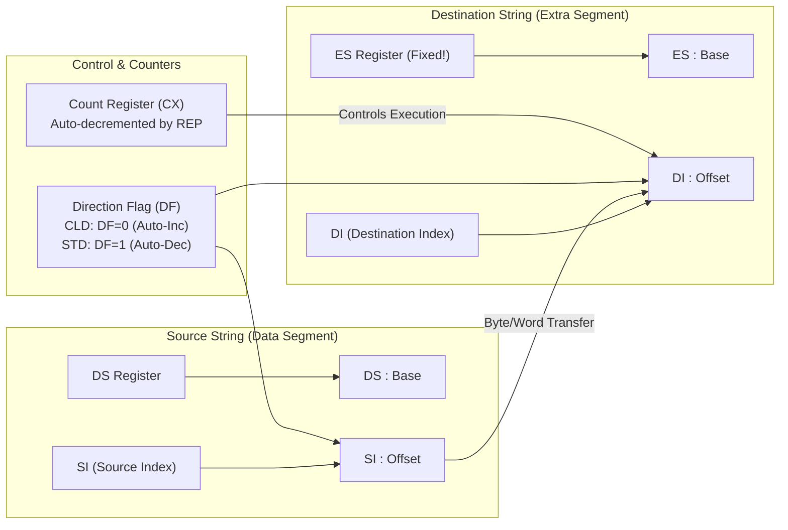
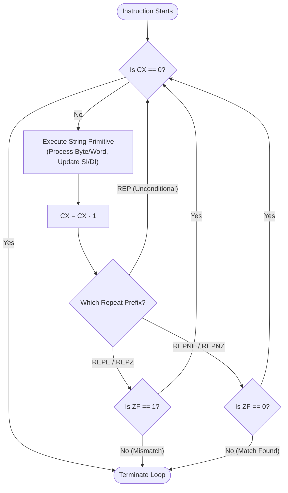

# Chapter 6 — 8086 String Operations, Branching & Looping Mechanics

> **Course Code:** 3CS526CC23  
> **Course Title:** Microprocessor and Interfacing [3 0 2 4]  
> **Governing Standard:** `notes_maker` Skill (Comprehensive Chapter Notes Generator)  
> **Primary Source:** Faculty Lecture Presentations (`Assembler Language Instruction Set _part 2.pdf`, `8086_instruction_set_Basic.pdf`) & Practical Curriculum Guidelines  

---

## 1. Chapter Overview

String processing and program control transfer constitute the core of complex assembly language algorithms. The 8086 microprocessor provides specialized hardware support for block memory manipulation and iterative looping via dedicated string primitives and automatic counter registers.

This chapter details:
1. **The 8086 String Architecture:** Dedicated pointer pairs (`DS:SI` and `ES:DI`), the Direction Flag (`DF`), auto-indexing rules, and repeat prefixes (`REP`, `REPE`/`REPZ`, `REPNE`/`REPNZ`).
2. **The 5 String Primitives:** `MOVS`, `CMPS`, `SCAS`, `LODS`, and `STOS` (in Byte and Word variations) with flag effects and execution timings.
3. **Branching & Control Transfer:** Unconditional jumps (`JMP` - Short, Near Direct, Near Indirect, Far Direct, Far Indirect), conditional jumps (Single-flag, Unsigned, and Signed comparisons), and relative displacement mathematics ($D_8, D_{16}$).
4. **Looping Instructions:** `LOOP`, `LOOPE`/`LOOPZ`, `LOOPNE`/`LOOPNZ`, and `JCXZ`.
5. **Practical University Lab Implementations:** String copying, space search, string reversal, and substring matching.

[Source: Assembler Language Instruction Set _part 2, Slides 1–20]

---

## 2. 8086 String Architecture & Fundamentals

A "string" in 8086 assembly is a contiguous sequence of bytes or words stored in memory. The 8086 features dedicated hardware mechanisms to manipulate strings at high speed without requiring explicit software indexing instructions.



### The Three Architectural Pillars of String Operations

1. **Dedicated Register Pairs:**
   - **Source String Pointer:** Always addressed by **`DS:SI`** (Data Segment : Source Index). `SI` holds the offset. The source segment can be overridden using a segment prefix (e.g., `ES:`, `SS:`, `CS:`).
   - **Destination String Pointer:** **STRICTLY AND EXCLUSIVELY ADDRESSED BY `ES:DI`** (Extra Segment : Destination Index). **THE DESTINATION SEGMENT CANNOT BE OVERRIDDEN!**
2. **Direction Flag (`DF`):**
   - Controlled via `CLD` and `STD`:
     - **`CLD` (Clear Direction Flag, $DF = 0$):** Auto-increments pointers forward (from low memory address to high memory address).
     - **`STD` (Set Direction Flag, $DF = 1$):** Auto-decrements pointers backward (from high memory address to low memory address).
   - **Step Size:**
     - For Byte operations (`MOVSB`, `LODSB`, etc.): Pointer adjusts by **$1$**.
     - For Word operations (`MOVSW`, `LODSW`, etc.): Pointer adjusts by **$2$**.
3. **Repeat Counter (`CX`):**
   - The `CX` register holds the iteration count. String instructions prefixed with `REP` automatically decrement `CX` on each iteration until the termination condition is satisfied.

[Source: 3CS526CC23 8086 Architecture, Slide 26; 8086_instruction_set_Basic, Slide 36]

---

## 3. String Primitives & Repeat Prefixes

### Summary Reference Table of String Primitives

| Mnemonic | Full Name | Source Pointer | Destination Pointer | Auto-Index Update ($DF=0$ / $DF=1$) | Flags Affected |
| :--- | :--- | :---: | :---: | :---: | :---: |
| **MOVSB / MOVSW** | Move String | `DS:SI` | `ES:DI` | Both `SI` & `DI` $\pm 1$ (Byte) or $\pm 2$ (Word) | **None** |
| **CMPSB / CMPSW** | Compare String | `DS:SI` | `ES:DI` | Both `SI` & `DI` $\pm 1$ or $\pm 2$ | All ($CF, ZF, SF, OF, PF, AF$) |
| **SCASB / SCASW** | Scan String | None (`AL`/`AX`) | `ES:DI` | `DI` $\pm 1$ or $\pm 2$ | All ($CF, ZF, SF, OF, PF, AF$) |
| **LODSB / LODSW** | Load String | `DS:SI` | None (`AL`/`AX`) | `SI` $\pm 1$ or $\pm 2$ | **None** |
| **STOSB / STOSW** | Store String | None (`AL`/`AX`) | `ES:DI` | `DI` $\pm 1$ or $\pm 2$ | **None** |

---

### Repeat Prefixes (`REP`, `REPE`/`REPZ`, `REPNE`/`REPNZ`)

Repeat prefixes are 1-byte prefixes placed before a string primitive that turn single-step operations into automatic hardware loops.



### Prefix Operational Truth Table

| Prefix | Compatible Instructions | Loop Continuation Condition | Termination Condition | Practical Use Case |
| :--- | :--- | :--- | :--- | :--- |
| **`REP`** | `MOVS`, `STOS` | $\text{CX} \neq 0$ | $\text{CX} = 0$ | Fast memory block copies; memory buffer initialization. |
| **`REPE` / `REPZ`** | `CMPS`, `SCAS` | $\text{CX} \neq 0$ **AND** $ZF = 1$ | $\text{CX} = 0$ **OR** $ZF = 0$ | Comparing two strings until first character mismatch. |
| **`REPNE` / `REPNZ`**| `CMPS`, `SCAS` | $\text{CX} \neq 0$ **AND** $ZF = 0$ | $\text{CX} = 0$ **OR** $ZF = 1$ | Searching a string for a specific target character. |

---

## 4. Branching Instructions & Target Address Calculation

Branch instructions alter sequential execution by modifying the Instruction Pointer (`IP`), and for far jumps, the Code Segment register (`CS`).

### 4.1 Unconditional Branching (`JMP`)

| Jump Type | Syntax | Address Modification | Range / Scope | Machine Format |
| :--- | :--- | :--- | :--- | :--- |
| **Intrasegment Direct Short** | `JMP SHORT Target` | $\text{IP} \leftarrow \text{IP} + \text{sign-extended } D_8$ | $-128$ to $+127$ bytes | 2 bytes (`EB D8`) |
| **Intrasegment Direct Near** | `JMP NEAR PTR Target`| $\text{IP} \leftarrow \text{IP} + \text{Disp}_{16}$ | Anywhere within current 64 KB segment | 3 bytes (`E9 D16`) |
| **Intrasegment Indirect Near**| `JMP Reg16 / [Mem16]`| $\text{IP} \leftarrow (EA)$ | Target offset fetched from register or memory word | 2 to 4 bytes |
| **Intersegment Direct Far** | `JMP FAR PTR Target` | $\text{IP} \leftarrow \text{Offset}$, $\text{CS} \leftarrow \text{Segment}$ | Anywhere in 1 MB physical memory | 5 bytes (`EA Offset Seg`) |
| **Intersegment Indirect Far** | `JMP DWORD PTR [Mem]`| $\text{IP} \leftarrow (\text{Mem})$, $\text{CS} \leftarrow (\text{Mem}+2)$ | Loaded from 4-byte memory pointer | 2 to 4 bytes |

[Source: Assembler Language Instruction Set _part 2, Slides 13–15]

---

### 4.2 Conditional Branching & Flag Testing

All conditional jumps are **2-byte machine instructions** restricted to a **Short Relative Displacement ($D_8$)** ranging from $-128$ to $+127$ bytes from the start of the next instruction. **Conditional jumps NEVER alter flags.**

```text
Format: [ Opcode (1 Byte) ] [ Signed Displacement D8 (1 Byte) ]
```

#### Relative Displacement Calculation Formula
$$
\text{Displacement } (D_8) = \text{Target Address} - \text{Address of Next Instruction}
$$

#### Worked Example: Displacement Calculation
Consider the assembly sequence:
```assembly
0050 AGAIN: INC CX
0052        ADD AX, [BX]
0054        JNS AGAIN          ; Jump if Sign flag = 0
0056        MOV DX, AX         ; Next instruction
```
- Address of target `AGAIN` = `0050H`.
- Address of next instruction after fetch = `0056H`.
- Relative Displacement:
  $$D_8 = 0050\text{H} - 0056\text{H} = -6_{10}$$
- Convert $-6_{10}$ to 8-bit Two's Complement:
  $$+6_{10} = 0000\,0110_2 \implies \text{1's Comp} = 1111\,1001_2 \implies \text{2's Comp} = 1111\,1010_2 = \mathbf{FAH}$$
- Machine Code generated for `JNS AGAIN`: `79 FAH`.

[Source: Assembler Language Instruction Set _part 2, Slide 3]

---

### Complete Conditional Jump Classification Table

| Group | Mnemonic | Alternative | Flag Condition Tested | Practical Significance |
| :--- | :--- | :--- | :---: | :--- |
| **Single Flag Tests** | **`JZ`** | `JE` | $ZF = 1$ | Result is zero / operands are equal. |
| | **`JNZ`** | `JNE` | $ZF = 0$ | Result is non-zero / operands unequal. |
| | **`JS`** | — | $SF = 1$ | Result is negative. |
| | **`JNS`** | — | $SF = 0$ | Result is positive (or zero). |
| | **`JC`** | `JB` / `JNAE` | $CF = 1$ | Carry generated / below in unsigned comparison. |
| | **`JNC`** | `JNB` / `JAE` | $CF = 0$ | No carry / above or equal. |
| | **`JO`** | — | $OF = 1$ | Signed arithmetic overflow occurred. |
| | **`JNO`** | — | $OF = 0$ | No signed overflow. |
| | **`JP`** | `JPE` | $PF = 1$ | Even parity (even count of 1-bits). |
| | **`JNP`** | `JPO` | $PF = 0$ | Odd parity (odd count of 1-bits). |
| **Unsigned Comparison**| **`JA`** | `JNBE` | $CF = 0 \land ZF = 0$ | Above (Greater magnitude in unsigned numbers). |
| | **`JAE`** | `JNB`, `JNC` | $CF = 0$ | Above or equal. |
| | **`JB`** | `JNAE`, `JC` | $CF = 1$ | Below (Lesser magnitude). |
| | **`JBE`** | `JNA` | $CF = 1 \lor ZF = 1$ | Below or equal. |
| **Signed Comparison** | **`JG`** | `JNLE` | $(SF \oplus OF = 0) \land ZF = 0$ | Greater than (Signed integer comparison). |
| | **`JGE`** | `JNL` | $SF \oplus OF = 0$ | Greater than or equal. |
| | **`JL`** | `JNGE` | $SF \oplus OF = 1$ | Less than (Signed negative difference). |
| | **`JLE`** | `JNG` | $(SF \oplus OF = 1) \lor ZF = 1$ | Less than or equal. |

[Source: Assembler Language Instruction Set _part 2, Slides 4–9]

---

## 5. Looping Instructions (`LOOP`, `LOOPE`, `LOOPNE`, `JCXZ`)

Loop instructions simplify repetitive iterative routines by combining decrement, test, and relative branch into a single instruction.

**Rule:** Loop instructions **DO NOT AFFECT ANY FLAGS**. They operate strictly on register `CX`.

| Instruction | Alternative | Operational Mechanics | Loop Termination Condition |
| :--- | :--- | :--- | :--- |
| **`LOOP Target`** | — | $(\text{CX}) \leftarrow (\text{CX}) - 1$; Jump if $\text{CX} \neq 0$ | $\text{CX} = 0$ |
| **`LOOPE Target`** | `LOOPZ` | $(\text{CX}) \leftarrow (\text{CX}) - 1$; Jump if $\text{CX} \neq 0 \land ZF = 1$ | $\text{CX} = 0 \lor ZF = 0$ |
| **`LOOPNE Target`**| `LOOPNZ`| $(\text{CX}) \leftarrow (\text{CX}) - 1$; Jump if $\text{CX} \neq 0 \land ZF = 0$ | $\text{CX} = 0 \lor ZF = 1$ |
| **`JCXZ Target`** | — | Jump if $(\text{CX}) = 0$ (**CX is NOT decremented**) | $\text{CX} \neq 0$ |

#### Comparative Efficiency: Standard Branch vs `LOOP`
```assembly
; Without LOOP (2 instructions per iteration):
BEGIN:  ; ... loop body ...
        DEC CX           ; Decrement counter
        JNZ BEGIN        ; Test and branch

; With LOOP (1 instruction per iteration):
BEGIN:  ; ... loop body ...
        LOOP BEGIN       ; Automatically decrements CX and branches if CX != 0
```

[Source: Assembler Language Instruction Set _part 2, Slide 17]

---

## 6. Practical Worked Programs (String & Control Flow)

### Program 6.1: Fast String Copy using `REP MOVSB`
```assembly
DATA SEGMENT
    SOURCE_STR DB 'University Microprocessor Lab'
    LEN        EQU $ - SOURCE_STR
DATA ENDS

EXTRA SEGMENT
    DEST_STR   DB LEN DUP(?)
EXTRA ENDS

CODE SEGMENT
    ASSUME CS:CODE, DS:DATA, ES:EXTRA
START:
    MOV AX, DATA
    MOV DS, AX
    MOV AX, EXTRA
    MOV ES, AX

    CLD                      ; DF = 0 (Auto-increment forward)
    LEA SI, SOURCE_STR       ; DS:SI points to source
    LEA DI, DEST_STR         ; ES:DI points to destination
    MOV CX, LEN              ; Load string length into CX
    REP MOVSB                ; Copy CX bytes automatically from DS:SI to ES:DI

    MOV AH, 4CH
    INT 21H
CODE ENDS
END START
```

---

### Program 6.2: Search a String for Space Character (`20H`) using `LOOPNE`
```assembly
; Task: Search string S of length L for space character (20H). 
; If found, exit with ZF=1; if not found, jump to NOT_FOUND.
DATA SEGMENT
    S   DB 'AssemblyProgrammingLanguage'
    L   EQU $ - S
DATA ENDS

CODE SEGMENT
    ASSUME CS:CODE, DS:DATA
START:
    MOV AX, DATA
    MOV DS, AX

    MOV CX, L                ; CX = String length
    MOV SI, -1               ; Initialize SI before start
    MOV AL, 20H              ; Target ASCII space character

SEARCH_LOOP:
    INC SI                   ; Advance to next character
    CMP AL, S[SI]            ; Compare AL with character in string (sets ZF=1 if match)
    LOOPNE SEARCH_LOOP       ; Decrement CX; branch if CX != 0 AND ZF == 0

    JNZ NOT_FOUND            ; If ZF = 0 upon exit, space was never found
    ; Space found at offset SI!
    JMP DONE

NOT_FOUND:
    ; Handle character not found...

DONE:
    MOV AH, 4CH
    INT 21H
CODE ENDS
END START
```

[Source: Assembler Language Instruction Set _part 2, Slides 18–19]

---

## 7. Exam-Oriented Review & High-Frequency Questions

1. **Why must the Destination String in string operations always reside in the Extra Segment (ES)?**  
   *Answer:* The 8086 hardware execution unit hardwires destination string accesses to use segment base `ES` via pointer `DI` (`ES:DI`). Unlike the source operand (`DS:SI`), which accepts a segment override prefix, the destination string segment cannot be overridden.
2. **Explain the functionality of the `JCXZ` instruction and where it is typically placed.**  
   *Answer:* `JCXZ` checks if `CX = 0` without decrementing `CX`. It is typically placed at the very entrance of a loop before the body executes to skip the entire loop if the input count is zero, preventing a 65,536-iteration underflow bug.
3. **What is the difference between `JA` and `JG` conditional jump instructions?**  
   *Answer:* `JA` (Jump if Above) is an **unsigned comparison** based strictly on $CF = 0$ and $ZF = 0$. `JG` (Jump if Greater) is a **signed comparison** based on the sign and overflow flags ($(SF \oplus OF = 0) \land ZF = 0$). For example, comparing `FFH` with `01H`: `FFH` is "Above" `01H` unsigned ($255 > 1$), but "Less" signed ($-1 < +1$).
