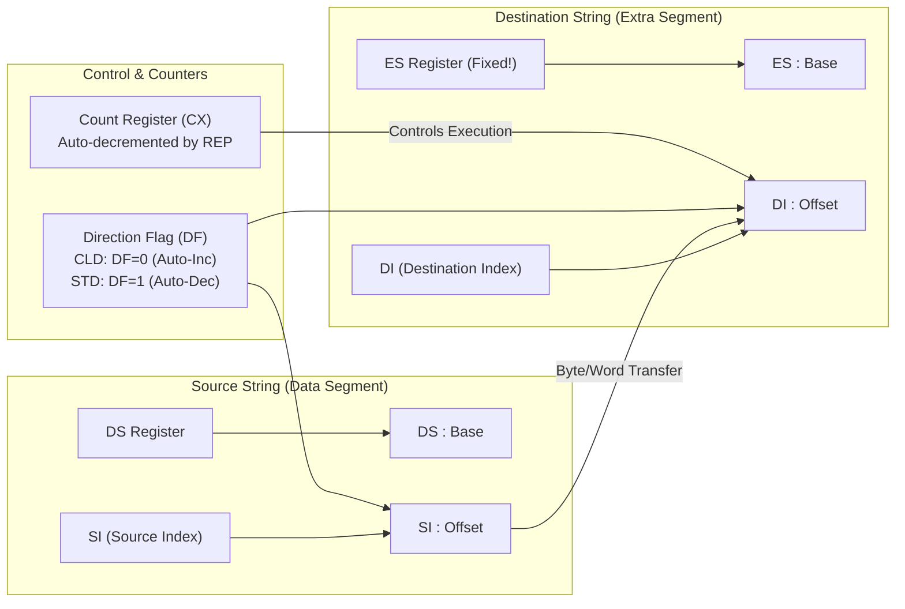

# Chapter 6 — 8086 String Operations, Branching & Looping Mechanics

> **Course Code:** 3CS526CC23
> **Course Title:** Microprocessor and Interfacing [3 0 2 4]
> **Governing Standard:** `notes_maker` Skill (Comprehensive Chapter Notes Generator)
> **Primary Source:** Faculty Lecture Presentations (`Assembler Language Instruction Set _part 2.pdf`, `8086_instruction_set_Basic.pdf`) & Practical Curriculum Guidelines

---

## 1. Chapter Overview

String processing and program control transfer constitute the core of complex assembly language algorithms. The 8086 microprocessor provides specialized hardware support for block memory manipulation and iterative looping via dedicated string primitives and automatic counter registers.

This chapter details:

1. **The 8086 String Architecture:** Dedicated pointer pairs (`DS:SI` and `ES:DI`), the Direction Flag (`DF`), auto-indexing rules, and repeat prefixes (`REP`, `REPE`/`REPZ`, `REPNE`/`REPNZ`).
2. **The 5 String Primitives:** `MOVS`, `CMPS`, `SCAS`, `LODS`, and `STOS` (in Byte and Word variations) with flag effects and execution timings.
3. **Branching & Control Transfer:** Unconditional jumps (`JMP` – Short, Near Direct, Near Indirect, Far Direct, Far Indirect), conditional jumps (Single-flag, Unsigned, and Signed comparisons), and relative displacement mathematics ($D_8, D_{16}$).
4. **Looping Instructions:** `LOOP`, `LOOPE`/`LOOPZ`, `LOOPNE`/`LOOPNZ`, and `JCXZ`.
5. **Complete University Lab Programs:** String copy, search, reversal, comparison, substring matching, buffer fill, and vowel counting.

[Source: Assembler Language Instruction Set _part 2, Slides 1–20]

---

## 2. 8086 String Architecture & Fundamentals

A "string" in 8086 assembly is a contiguous sequence of bytes or words stored in memory. The 8086 features dedicated hardware mechanisms to manipulate strings at high speed without requiring explicit software indexing instructions.



### The Three Architectural Pillars of String Operations

1. **Dedicated Register Pairs:**
   - **Source String Pointer:** Always addressed by **`DS:SI`** (Data Segment : Source Index). `SI` holds the offset. The source segment can be overridden using a segment prefix (e.g., `ES:`, `SS:`, `CS:`).
   - **Destination String Pointer:** **STRICTLY AND EXCLUSIVELY ADDRESSED BY `ES:DI`** (Extra Segment : Destination Index). **THE DESTINATION SEGMENT CANNOT BE OVERRIDDEN!**

2. **Direction Flag (`DF`):**
   - Controlled via `CLD` and `STD`:
     - **`CLD` (Clear Direction Flag, $DF = 0$):** Auto-increments `SI` and `DI` forward (from low to high address) — processes characters left-to-right.
     - **`STD` (Set Direction Flag, $DF = 1$):** Auto-decrements `SI` and `DI` backward (from high to low address) — processes characters right-to-left.
   - **Step Size:**
     - For Byte operations (`MOVSB`, `LODSB`, etc.): Pointer adjusts by **$\pm 1$**.
     - For Word operations (`MOVSW`, `LODSW`, etc.): Pointer adjusts by **$\pm 2$**.

3. **Repeat Counter (`CX`):**
   - The `CX` register holds the iteration count. String instructions prefixed with `REP` automatically decrement `CX` on each iteration until the termination condition is satisfied.

[Source: 3CS526CC23 8086 Architecture, Slide 26; 8086_instruction_set_Basic, Slide 36]

---

## 3. String Primitives — Full Reference with Code

### Summary Reference Table

| Mnemonic | Full Name | Source Pointer | Destination Pointer | Auto-Index ($DF=0$/$DF=1$) | Flags Affected |
| :--- | :--- | :---: | :---: | :---: | :---: |
| **MOVSB / MOVSW** | Move String | `DS:SI` | `ES:DI` | Both `SI` & `DI` $\pm 1$(B) or $\pm 2$(W) | **None** |
| **CMPSB / CMPSW** | Compare String | `DS:SI` | `ES:DI` | Both `SI` & `DI` $\pm 1$ or $\pm 2$ | All ($CF, ZF, SF, OF, PF, AF$) |
| **SCASB / SCASW** | Scan String | `AL`/`AX` | `ES:DI` | `DI` $\pm 1$ or $\pm 2$ | All ($CF, ZF, SF, OF, PF, AF$) |
| **LODSB / LODSW** | Load String | `DS:SI` | `AL`/`AX` | `SI` $\pm 1$ or $\pm 2$ | **None** |
| **STOSB / STOSW** | Store String | `AL`/`AX` | `ES:DI` | `DI` $\pm 1$ or $\pm 2$ | **None** |

---

### 3.1 MOVSB / MOVSW — Move String

**Operation:** Copies the byte or word at `DS:SI` to `ES:DI`, then updates both pointers by $\pm 1$ (byte) or $\pm 2$ (word) based on `DF`.

```assembly
; ─── Basic MOVSB: Copy 1 byte ───────────────────────────────────────
; Copies single byte from DS:SI to ES:DI, then SI++ and DI++
CLD                      ; DF = 0 → forward direction
MOV SI, OFFSET SOURCE    ; SI = source offset
MOV DI, OFFSET DEST      ; DI = destination offset
MOVSB                    ; [ES:DI] = [DS:SI], SI++, DI++

; ─── REP MOVSB: Copy a block of bytes ──────────────────────────────
CLD                      ; Forward direction
LEA SI, SOURCE_BUF       ; DS:SI → source
LEA DI, DEST_BUF         ; ES:DI → destination
MOV CX, 100              ; CX = 100 bytes to copy
REP MOVSB                ; Copy 100 bytes one at a time

; ─── REP MOVSW: Copy a block of words ──────────────────────────────
CLD
LEA SI, WORD_SOURCE
LEA DI, WORD_DEST
MOV CX, 50               ; 50 words = 100 bytes
REP MOVSW                ; Copy 50 words (each iteration moves 2 bytes)

; ─── Overlapping Buffer: Backward Copy (STD) ─────────────────────
; When source and destination overlap and dest > source, copy backward
STD                      ; DF = 1 → backward direction
MOV SI, OFFSET SRC_END   ; SI = last byte of source
MOV DI, OFFSET DST_END   ; DI = last byte of destination
MOV CX, LENGTH_STR
REP MOVSB                ; Copy backward to avoid overwriting
```

---

### 3.2 CMPSB / CMPSW — Compare String

**Operation:** Subtracts `ES:[DI]` from `DS:[SI]` to update flags (result discarded), then adjusts both pointers. Used to compare two strings character by character.

- **`REPE CMPSB`**: Continues while `CX ≠ 0` AND `ZF = 1` (characters equal). Stops at first **mismatch**.
- **`REPNE CMPSB`**: Continues while `CX ≠ 0` AND `ZF = 0`. Stops at first **match**.

```assembly
; ─── REPE CMPSB: Compare two strings for equality ──────────────────
DATA SEGMENT
    STR1  DB 'ASSEMBLY'
    STR2  DB 'ASSEMBLY'
    LEN   EQU $ - STR2
DATA ENDS

EXTRA SEGMENT ASSUME CS:CODE, DS:DATA, ES:DATA
; Note: Both strings can be in same segment if ES = DS

CODE SEGMENT
    ASSUME CS:CODE, DS:DATA, ES:DATA
START:
    MOV AX, DATA
    MOV DS, AX
    MOV ES, AX             ; ES = DS (both strings in DATA segment)

    CLD                    ; Forward direction
    LEA SI, STR1           ; DS:SI → string 1
    LEA DI, STR2           ; ES:DI → string 2
    MOV CX, LEN            ; CX = length to compare

    REPE CMPSB             ; Compare until mismatch or CX = 0

    JE   STRINGS_EQUAL     ; ZF = 1 after loop → all chars matched
    JL   STR1_LESS         ; CF = 1 → STR1 char was smaller (alphabetically earlier)
    JG   STR1_GREATER      ; CF = 0, ZF = 0 → STR1 char was larger

STRINGS_EQUAL:
    ; STR1 == STR2 (all LEN bytes identical)
    JMP DONE

STR1_LESS:
    ; STR1 < STR2 (first differing char of STR1 < STR2)
    JMP DONE

STR1_GREATER:
    ; STR1 > STR2

DONE:
    MOV AH, 4CH
    INT 21H
CODE ENDS
END START

; ─── Find position of first difference ──────────────────────────────
CLD
LEA SI, BUFFER1
LEA DI, BUFFER2
MOV CX, 50               ; Compare up to 50 bytes

REPE CMPSB               ; Stop at first mismatch

JE  IDENTICAL            ; Entire 50 bytes matched
DEC SI                   ; SI now points to mismatching byte in BUFFER1
SUB SI, OFFSET BUFFER1   ; Index of mismatch (0-based)
; SI = position of first difference
```

---

### 3.3 SCASB / SCASW — Scan String

**Operation:** Subtracts `ES:[DI]` from `AL` (SCASB) or `AX` (SCASW) to update flags, then adjusts `DI`. Used to search a string for a specific character.

- **`REPNE SCASB`**: Search for a character — stops when `AL == [ES:DI]` (match found, `ZF=1`).
- **`REPE SCASB`**: Stop when character changes — stops when `AL != [ES:DI]` (mismatch, `ZF=0`).

```assembly
; ─── REPNE SCASB: Find '$' (string terminator) ──────────────────────
DATA SEGMENT
    MSG   DB 'Hello World$'
DATA ENDS

EXTRA SEGMENT
    ; SCAS target must be in ES
EXTRA ENDS

CODE SEGMENT
    ASSUME CS:CODE, DS:DATA, ES:DATA
START:
    MOV AX, DATA
    MOV DS, AX
    MOV ES, AX             ; ES = DS (scanning within same segment)

    CLD                    ; Forward direction
    LEA DI, MSG            ; ES:DI → start of string
    MOV CX, 100            ; Max scan length
    MOV AL, '$'            ; Character to find

    REPNE SCASB            ; Scan: DI++ each step, stop when AL == [ES:DI]

    JNZ NOT_FOUND          ; ZF = 0 → '$' never found within CX bytes
    DEC DI                 ; DI now points to '$' (SCASB advances past it)
    SUB DI, OFFSET MSG     ; DI = position index of '$'
    ; DI = 11 (index of '$' in "Hello World$")
    JMP DONE

NOT_FOUND:
    ; '$' not found — error handling

DONE:
    MOV AH, 4CH
    INT 21H
CODE ENDS
END START

; ─── SCASB: Count a character's occurrences ──────────────────────────
; Count how many times 'A' appears in string
CLD
LEA DI, INPUT_STR        ; ES:DI = start
MOV CX, STR_LEN          ; Length to scan
MOV AL, 'A'              ; Target character
XOR BX, BX               ; BX = occurrence counter

SCAN_LOOP:
    SCASB                 ; Compare AL with [ES:DI], DI++
    JNZ NOT_A             ; ZF = 0 → current char != 'A'
    INC BX                ; Increment counter
NOT_A:
    LOOP SCAN_LOOP        ; Decrement CX, repeat
; BX = count of 'A' in string
```

---

### 3.4 LODSB / LODSW — Load String

**Operation:** Copies byte at `DS:[SI]` into `AL` (LODSB) or word at `DS:[SI]` into `AX` (LODSW), then adjusts `SI`. Used to process each string character individually in a loop.

```assembly
; ─── LODSB: Convert string to uppercase ─────────────────────────────
DATA SEGMENT
    INPUT_STR  DB 'hello world assembly'
    STR_LEN    EQU $ - INPUT_STR
DATA ENDS

EXTRA SEGMENT
    OUTPUT_STR DB STR_LEN DUP(?)
EXTRA ENDS

CODE SEGMENT
    ASSUME CS:CODE, DS:DATA, ES:EXTRA
START:
    MOV AX, DATA
    MOV DS, AX
    MOV AX, EXTRA
    MOV ES, AX

    CLD
    LEA SI, INPUT_STR    ; DS:SI → input
    LEA DI, OUTPUT_STR   ; ES:DI → output
    MOV CX, STR_LEN

UPPER_LOOP:
    LODSB                ; AL = [DS:SI], SI++
    CMP AL, 'a'          ; Is character lowercase?
    JB  NOT_LOWER        ; Below 'a' → not lowercase
    CMP AL, 'z'
    JA  NOT_LOWER        ; Above 'z' → not lowercase
    AND AL, 0DFH         ; Clear bit 5: 'a'(61H)→'A'(41H)
NOT_LOWER:
    STOSB                ; [ES:DI] = AL, DI++ (store result)
    LOOP UPPER_LOOP      ; Decrement CX and repeat

    MOV AH, 4CH
    INT 21H
CODE ENDS
END START

; ─── LODSB: Count vowels in a string ────────────────────────────────
CLD
LEA SI, INPUT_TEXT
MOV CX, TEXT_LEN
XOR BL, BL              ; BL = vowel counter

VOWEL_LOOP:
    LODSB               ; AL = next character
    OR  AL, 20H         ; Convert to lowercase for comparison
    CMP AL, 'a'
    JE  IS_VOWEL
    CMP AL, 'e'
    JE  IS_VOWEL
    CMP AL, 'i'
    JE  IS_VOWEL
    CMP AL, 'o'
    JE  IS_VOWEL
    CMP AL, 'u'
    JE  IS_VOWEL
    JMP NEXT_CHAR
IS_VOWEL:
    INC BL
NEXT_CHAR:
    LOOP VOWEL_LOOP
; BL = total vowel count

; ─── LODSW: Process an array of 16-bit words ────────────────────────
; Sum all words in a word array
CLD
LEA SI, WORD_ARRAY
MOV CX, ARRAY_LEN        ; Number of words
XOR AX, AX               ; Accumulator = 0
XOR DX, DX               ; High word of sum

SUM_LOOP:
    LODSW                ; AX = [DS:SI], SI += 2
    ADD DX, AX           ; Accumulate sum in DX (simple, no carry for demo)
    LOOP SUM_LOOP
; DX = sum of all words in array
```

---

### 3.5 STOSB / STOSW — Store String

**Operation:** Copies `AL` into `ES:[DI]` (STOSB) or `AX` into `ES:[DI]` (STOSW), then adjusts `DI`. Used to fill memory buffers.

```assembly
; ─── STOSB: Fill buffer with zeros ──────────────────────────────────
EXTRA SEGMENT
    BUFFER DB 200 DUP(?)
EXTRA ENDS

CODE SEGMENT
    ASSUME CS:CODE, ES:EXTRA
START:
    MOV AX, EXTRA
    MOV ES, AX

    CLD
    LEA DI, BUFFER       ; ES:DI → buffer start
    MOV CX, 200          ; 200 bytes
    MOV AL, 00H          ; Fill value = zero
    REP STOSB            ; [ES:DI++] = 00H, repeat 200 times

; ─── STOSB: Fill buffer with 0FFH ────────────────────────────────────
    MOV AL, 0FFH
    LEA DI, BUFFER
    MOV CX, 200
    REP STOSB            ; All 200 bytes = FFH

; ─── STOSW: Fill word array to 0000H ────────────────────────────────
    CLD
    MOV AX, 0000H        ; Fill word = 0
    LEA DI, WORD_ARRAY
    MOV CX, 50           ; 50 words = 100 bytes
    REP STOSW            ; [ES:DI] = 0000H, DI += 2, CX--, repeat

; ─── STOSB: Initialize lookup table with index values ───────────────
    CLD
    LEA DI, LOOKUP_TABLE ; 256-byte lookup table
    MOV CX, 256
    XOR AL, AL           ; Start with 0
FILL_TABLE:
    STOSB                ; [ES:DI] = AL, DI++
    INC AL               ; AL = 0,1,2...255
    LOOP FILL_TABLE      ; CX-- and branch

    MOV AH, 4CH
    INT 21H
CODE ENDS
END START
```

---

## 4. Repeat Prefixes — Full Operational Logic


### Prefix Operational Truth Table

| Prefix | Compatible Instructions | Loop Continuation Condition | Termination Condition | Practical Use Case |
| :--- | :--- | :--- | :--- | :--- |
| **`REP`** | `MOVS`, `STOS` | $\text{CX} \neq 0$ | $\text{CX} = 0$ | Fast memory block copies; buffer initialization. |
| **`REPE` / `REPZ`** | `CMPS`, `SCAS` | $\text{CX} \neq 0$ **AND** $ZF = 1$ | $\text{CX} = 0$ **OR** $ZF = 0$ | String comparison until first mismatch. |
| **`REPNE` / `REPNZ`** | `CMPS`, `SCAS` | $\text{CX} \neq 0$ **AND** $ZF = 0$ | $\text{CX} = 0$ **OR** $ZF = 1$ | Searching for a specific character. |

---

## 5. Branching Instructions & Target Address Calculation

Branch instructions alter sequential execution by modifying the Instruction Pointer (`IP`), and for far jumps, also `CS`.

### 5.1 Unconditional Branching (`JMP`)

| Jump Type | Syntax | Address Modification | Range / Scope | Machine Format |
| :--- | :--- | :--- | :--- | :--- |
| **Intrasegment Direct Short** | `JMP SHORT Target` | $\text{IP} \leftarrow \text{IP} + \text{sign-extended }D_8$ | $-128$ to $+127$ bytes | 2 bytes (`EB D8`) |
| **Intrasegment Direct Near** | `JMP NEAR PTR Target` | $\text{IP} \leftarrow \text{IP} + \text{Disp}_{16}$ | Anywhere within current 64 KB segment | 3 bytes (`E9 D16`) |
| **Intrasegment Indirect Near** | `JMP Reg16 / [Mem16]` | $\text{IP} \leftarrow (EA)$ | Target offset from register or memory | 2–4 bytes |
| **Intersegment Direct Far** | `JMP FAR PTR Target` | $\text{IP} \leftarrow \text{Offset}$, $\text{CS} \leftarrow \text{Segment}$ | Anywhere in 1 MB | 5 bytes (`EA Offset Seg`) |
| **Intersegment Indirect Far** | `JMP DWORD PTR [Mem]` | $\text{IP} \leftarrow (\text{Mem})$, $\text{CS} \leftarrow (\text{Mem}+2)$ | Loaded from 4-byte pointer | 2–4 bytes |

```assembly
; ─── JMP variants ───────────────────────────────────────────────────
JMP SHORT NEARBY_LABEL   ; Short: ± 127 bytes
JMP NEAR PTR FAR_LABEL   ; Near: anywhere in segment
JMP BX                   ; Indirect: IP = BX (jump table dispatch)
JMP [BX]                 ; Indirect via memory: IP = word at [DS:BX]
JMP FAR PTR OTHER_SEG    ; Far: new CS:IP
JMP DWORD PTR [FAR_PTR]  ; Far indirect: 4-byte memory pointer

; ─── Jump table dispatch (switch-case equivalent) ──────────────────
; Given AL = case index (0, 1, 2, 3), jump to case handler
XOR AH, AH              ; AX = AL (zero-extend)
MOV BX, OFFSET JUMP_TBL ; BX = start of jump table
SHL AX, 1               ; AX = AX * 2 (each entry is 1 word = 2 bytes)
ADD BX, AX              ; BX = address of entry
JMP [BX]                ; Indirect jump to handler

JUMP_TBL  DW CASE0, CASE1, CASE2, CASE3

CASE0: ; handle case 0
    JMP CASE_END
CASE1: ; handle case 1
    JMP CASE_END
CASE2: ; handle case 2
    JMP CASE_END
CASE3: ; handle case 3
CASE_END:
```

[Source: Assembler Language Instruction Set _part 2, Slides 13–15]

---

### 5.2 Conditional Branching & Displacement Calculation

All conditional jumps are **2-byte machine instructions** using **Short Relative Displacement ($D_8$)** in range $-128$ to $+127$ bytes.

$$
\text{Displacement } (D_8) = \text{Target Address} - \text{Address of Next Instruction}
$$

#### Worked Displacement Calculation

```assembly
0050  AGAIN:  INC CX           ; 2 bytes → next instruction at 0052H
0052           ADD AX, [BX]    ; 4 bytes → next instruction at 0056H
0056           JNS AGAIN       ; Jump-if-Sign-clear target = AGAIN = 0050H
0058           MOV DX, AX      ; Next sequential instruction
```

- $D_8 = 0050\text{H} - 0058\text{H} = -8_{10}$
- Two's complement of $8_{10}$: $+8 = 0000\,1000_2 \implies \text{2's comp} = 1111\,1000_2 = \mathbf{F8H}$
- Machine code for `JNS AGAIN`: `79 F8H`.

---

### Complete Conditional Jump Reference Table

| Group | Mnemonic | Alternative | Flag Condition Tested | Practical Significance |
| :--- | :--- | :--- | :---: | :--- |
| **Single Flag Tests** | **`JZ`** | `JE` | $ZF = 1$ | Result is zero / operands are equal. |
| | **`JNZ`** | `JNE` | $ZF = 0$ | Result is non-zero / operands unequal. |
| | **`JS`** | — | $SF = 1$ | Result is negative (sign bit = 1). |
| | **`JNS`** | — | $SF = 0$ | Result is positive (or zero). |
| | **`JC`** | `JB` / `JNAE` | $CF = 1$ | Unsigned carry / borrow / below. |
| | **`JNC`** | `JNB` / `JAE` | $CF = 0$ | No carry / above or equal. |
| | **`JO`** | — | $OF = 1$ | Signed arithmetic overflow occurred. |
| | **`JNO`** | — | $OF = 0$ | No signed overflow. |
| | **`JP`** | `JPE` | $PF = 1$ | Even parity (even count of 1-bits in result). |
| | **`JNP`** | `JPO` | $PF = 0$ | Odd parity (odd count of 1-bits). |
| **Unsigned Comparison** | **`JA`** | `JNBE` | $CF = 0 \land ZF = 0$ | Above (Greater in unsigned comparison). |
| | **`JAE`** | `JNB`, `JNC` | $CF = 0$ | Above or equal. |
| | **`JB`** | `JNAE`, `JC` | $CF = 1$ | Below (Lesser magnitude). |
| | **`JBE`** | `JNA` | $CF = 1 \lor ZF = 1$ | Below or equal. |
| **Signed Comparison** | **`JG`** | `JNLE` | $(SF \oplus OF = 0) \land ZF = 0$ | Greater than (signed integers). |
| | **`JGE`** | `JNL` | $SF \oplus OF = 0$ | Greater than or equal (signed). |
| | **`JL`** | `JNGE` | $SF \oplus OF = 1$ | Less than (signed). |
| | **`JLE`** | `JNG` | $(SF \oplus OF = 1) \lor ZF = 1$ | Less than or equal (signed). |

```assembly
; ─── Conditional jump usage examples ────────────────────────────────
; After CMP AX, BX:
JE  EQUAL_HANDLER        ; AX == BX
JNE NOT_EQUAL            ; AX != BX

; Unsigned comparison (for memory addresses, port numbers):
CMP AX, BX
JA  AX_BIGGER            ; AX > BX (unsigned: 255 > 128, FFH > 80H)
JB  AX_SMALLER           ; AX < BX (unsigned)
JAE AX_GE                ; AX >= BX (unsigned)
JBE AX_LE                ; AX <= BX (unsigned)

; Signed comparison (for signed integers):
CMP AX, BX
JG  AX_GREATER           ; AX > BX (signed: -1 < +1)
JL  AX_LESSER            ; AX < BX (signed)
JGE AX_GE_SIGNED         ; AX >= BX (signed)
JLE AX_LE_SIGNED         ; AX <= BX (signed)

; Flag-specific tests:
TEST AL, 80H             ; Test bit 7 of AL (sign bit)
JNZ IS_NEGATIVE          ; Bit 7 set → AL is negative signed
JS  ALSO_NEGATIVE        ; Equivalent via SF

TEST AL, 01H
JNZ IS_ODD               ; Bit 0 set → odd number

JO  OVERFLOW_HANDLER     ; Signed arithmetic overflowed
JC  CARRY_HANDLER        ; Unsigned carry/borrow occurred
```

[Source: Assembler Language Instruction Set _part 2, Slides 4–9]

---

## 6. Looping Instructions

Loop instructions simplify iterative routines by combining decrement, test, and relative branch.

**Rule:** Loop instructions **DO NOT AFFECT ANY FLAGS** (except `LOOPE`/`LOOPNE` which TEST `ZF` but do not modify it). They operate strictly on `CX`.

| Instruction | Alternative | Operational Mechanics | Termination Condition |
| :--- | :--- | :--- | :--- |
| **`LOOP Target`** | — | $(CX) \leftarrow (CX) - 1$; Jump if $CX \neq 0$ | $CX = 0$ |
| **`LOOPE Target`** | `LOOPZ` | $(CX) \leftarrow (CX) - 1$; Jump if $CX \neq 0 \land ZF = 1$ | $CX = 0 \lor ZF = 0$ |
| **`LOOPNE Target`** | `LOOPNZ` | $(CX) \leftarrow (CX) - 1$; Jump if $CX \neq 0 \land ZF = 0$ | $CX = 0 \lor ZF = 1$ |
| **`JCXZ Target`** | — | Jump if $(CX) = 0$ (**CX is NOT decremented**) | $CX \neq 0$ |

```assembly
; ─── LOOP: Basic counting loop ──────────────────────────────────────
MOV CX, 10               ; Loop 10 times
REPEAT:
    ; ... loop body (executed 10 times) ...
    NOP
    LOOP REPEAT          ; CX--, jump to REPEAT if CX != 0

; ─── LOOP vs DEC+JNZ comparison ────────────────────────────────────
; Without LOOP (explicit):
    DEC CX
    JNZ LOOP_TOP         ; Two instructions

; With LOOP (efficient):
    LOOP LOOP_TOP        ; One instruction (same effect, fewer bytes)

; ─── JCXZ: Skip loop if count is zero ──────────────────────────────
; Prevents 65,536-iteration underflow when CX = 0!
    MOV CX, ARRAY_LEN
    JCXZ SKIP_LOOP       ; Skip entirely if array is empty!
PROCESS_LOOP:
    ; ... process element ...
    LOOP PROCESS_LOOP
SKIP_LOOP:

; ─── LOOPE: Loop while equal (ZF=1) ─────────────────────────────────
; Continue loop as long as comparisons match AND count not zero
    MOV CX, 10
COND_LOOP:
    ; ... some operation that sets ZF ...
    CMP AL, BL           ; Sets ZF=1 if AL==BL
    LOOPE COND_LOOP      ; Continue if CX!=0 AND ZF=1 (still equal)
    JNE FOUND_MISMATCH   ; ZF=0 on exit → mismatch found

; ─── LOOPNE: Loop while not equal (ZF=0) ────────────────────────────
; Used in manual string scanning
    MOV CX, 50
    MOV SI, -1
    MOV AL, 20H          ; Search for space
FIND_SPACE:
    INC SI
    CMP AL, STRING[SI]   ; ZF=1 when space found
    LOOPNE FIND_SPACE    ; Continue if CX!=0 AND ZF=0
    JZ SPACE_FOUND       ; If ZF=1 → space was found
    ; else → not found within 50 chars
```

[Source: Assembler Language Instruction Set _part 2, Slide 17]

---

## 7. Complete Practical Programs

### Program 7.1: Fast String Copy using `REP MOVSB`

```assembly
; Task: Copy string from SOURCE_STR in DATA segment to DEST_STR in EXTRA segment.

DATA SEGMENT
    SOURCE_STR DB 'University Microprocessor Lab'
    LEN        EQU $ - SOURCE_STR
DATA ENDS

EXTRA SEGMENT
    DEST_STR   DB LEN DUP(?)
EXTRA ENDS

CODE SEGMENT
    ASSUME CS:CODE, DS:DATA, ES:EXTRA
START:
    MOV AX, DATA
    MOV DS, AX
    MOV AX, EXTRA
    MOV ES, AX

    CLD                      ; DF = 0 (forward)
    LEA SI, SOURCE_STR       ; DS:SI → source
    LEA DI, DEST_STR         ; ES:DI → destination
    MOV CX, LEN              ; CX = byte count

    REP MOVSB                ; Copy LEN bytes: [ES:DI++] = [DS:SI++]

    MOV AH, 4CH
    INT 21H
CODE ENDS
END START
```

---

### Program 7.2: Search for Space Character using `REPNE SCASB`

```assembly
; Task: Search for space (20H) in string MSG. If found, store index in BX.

DATA SEGMENT
    MSG     DB 'Hello World Assembly'
    MSG_LEN EQU $ - MSG
DATA ENDS

EXTRA SEGMENT ASSUME CS:CODE
EXTRA ENDS

CODE SEGMENT
    ASSUME CS:CODE, DS:DATA, ES:DATA
START:
    MOV AX, DATA
    MOV DS, AX
    MOV ES, AX             ; ES = DS (scanning in DATA segment)

    CLD
    LEA DI, MSG            ; ES:DI → string start
    MOV CX, MSG_LEN        ; Max search count
    MOV AL, 20H            ; Space character

    REPNE SCASB            ; Scan until AL == [ES:DI] or CX == 0

    JNZ NOT_FOUND          ; ZF = 0 → space not found
    DEC DI                 ; DI passed the space; step back
    MOV BX, DI
    SUB BX, OFFSET MSG     ; BX = 0-based index of space
    JMP DONE

NOT_FOUND:
    MOV BX, 0FFFFH         ; Sentinel: space not found

DONE:
    MOV AH, 4CH
    INT 21H
CODE ENDS
END START
```

---

### Program 7.3: String Reversal in Place

```assembly
; Task: Reverse string SOURCE in-place (e.g., "ABCDE" → "EDCBA").

DATA SEGMENT
    SOURCE  DB 'ASSEMBLY'
    STR_LEN EQU $ - SOURCE
DATA ENDS

CODE SEGMENT
    ASSUME CS:CODE, DS:DATA
START:
    MOV AX, DATA
    MOV DS, AX

    ; Set up pointers: left (SI) and right (DI)
    LEA SI, SOURCE           ; SI = first character
    LEA DI, SOURCE
    ADD DI, STR_LEN - 1     ; DI = last character

    MOV CX, STR_LEN
    SHR CX, 1               ; CX = STR_LEN / 2 (swap pairs)

    JCXZ DONE               ; If zero-length (odd 0 or 1 char), skip

SWAP_LOOP:
    MOV AL, [SI]             ; AL = left character
    MOV AH, [DI]             ; AH = right character
    MOV [SI], AH             ; left = right
    MOV [DI], AL             ; right = left
    INC SI                   ; Advance left pointer forward
    DEC DI                   ; Advance right pointer backward
    LOOP SWAP_LOOP           ; CX--, continue until center reached

DONE:
    ; SOURCE now reversed: "YLBMESSA"
    MOV AH, 4CH
    INT 21H
CODE ENDS
END START
```

---

### Program 7.4: String Comparison using `REPE CMPSB`

```assembly
; Task: Compare two strings STR1 and STR2. Report equal, STR1<STR2, or STR1>STR2.
; Result: BX = 0 (equal), BX = 1 (STR1 > STR2), BX = 0FFFFH (STR1 < STR2)

DATA SEGMENT
    STR1    DB 'HELLO'
    STR2    DB 'HELLO'
    LEN     EQU 5
    RESULT  DW ?
DATA ENDS

CODE SEGMENT
    ASSUME CS:CODE, DS:DATA, ES:DATA
START:
    MOV AX, DATA
    MOV DS, AX
    MOV ES, AX

    CLD
    LEA SI, STR1
    LEA DI, STR2
    MOV CX, LEN

    REPE CMPSB               ; Compare until mismatch or CX = 0

    JE   EQUAL               ; ZF = 1 after exit → all bytes matched
    JA   FIRST_GREATER       ; CF = 0 after mismatch → STR1[i] > STR2[i]
    ; else: CF = 1 → STR1[i] < STR2[i]
    MOV RESULT, 0FFFFH       ; STR1 < STR2
    JMP DONE
FIRST_GREATER:
    MOV RESULT, 0001H        ; STR1 > STR2
    JMP DONE
EQUAL:
    MOV RESULT, 0000H        ; Equal

DONE:
    MOV AH, 4CH
    INT 21H
CODE ENDS
END START
```

---

### Program 7.5: Count Vowels in String using `LODSB`

```assembly
; Task: Count all vowels (a,e,i,o,u — case insensitive) in INPUT_STR.
; Result stored in BL.

DATA SEGMENT
    INPUT_STR  DB 'University Assembly Programming'
    STR_LEN    EQU $ - INPUT_STR
DATA ENDS

CODE SEGMENT
    ASSUME CS:CODE, DS:DATA
START:
    MOV AX, DATA
    MOV DS, AX

    CLD
    LEA SI, INPUT_STR        ; DS:SI → string
    MOV CX, STR_LEN          ; Loop count
    XOR BL, BL               ; BL = vowel count

VOWEL_LOOP:
    LODSB                    ; AL = [DS:SI++]
    OR  AL, 20H              ; Normalize to lowercase (a-z range)
    CMP AL, 'a'
    JE  COUNT_IT
    CMP AL, 'e'
    JE  COUNT_IT
    CMP AL, 'i'
    JE  COUNT_IT
    CMP AL, 'o'
    JE  COUNT_IT
    CMP AL, 'u'
    JE  COUNT_IT
    JMP SKIP_VOWEL
COUNT_IT:
    INC BL
SKIP_VOWEL:
    LOOP VOWEL_LOOP          ; CX--, repeat until CX = 0

    ; BL = total vowels found
    MOV AH, 4CH
    INT 21H
CODE ENDS
END START
```

---

### Program 7.6: Initialize Buffer to All Zeros using `REP STOSB`

```assembly
; Task: Zero-fill a 256-byte buffer in Extra Segment.

EXTRA SEGMENT
    ZERO_BUF DB 256 DUP(?)
EXTRA ENDS

CODE SEGMENT
    ASSUME CS:CODE, ES:EXTRA
START:
    MOV AX, EXTRA
    MOV ES, AX

    CLD
    LEA DI, ZERO_BUF         ; ES:DI → buffer
    MOV CX, 256              ; 256 bytes
    XOR AL, AL               ; Fill value = 0
    REP STOSB                ; Stores 0 at [ES:DI++] 256 times

    MOV AH, 4CH
    INT 21H
CODE ENDS
END START
```

---

### Program 7.7: Sum of Array Elements using `LOOP`

```assembly
; Task: Add N bytes from ARRAY. Store 16-bit sum in RESULT.

DATA SEGMENT
    ARRAY   DB 10H, 20H, 30H, 40H, 50H
    N       EQU 5
    RESULT  DW ?
DATA ENDS

CODE SEGMENT
    ASSUME CS:CODE, DS:DATA
START:
    MOV AX, DATA
    MOV DS, AX

    MOV CX, N               ; Loop N times
    LEA SI, ARRAY           ; SI → first element
    XOR AX, AX              ; AX = running sum

    JCXZ STORE_RESULT       ; If N = 0, skip

SUM_LOOP:
    XOR AH, AH              ; Zero-extend byte to word
    MOV AL, [SI]            ; AL = array element
    ADD AX, [SI]            ; Add to sum (using word add for simplicity)
    INC SI                  ; Advance to next element
    LOOP SUM_LOOP           ; CX--, repeat

    ; Correction: AX was byte additions; use proper form:
    ; Reset and redo cleanly:
    XOR AX, AX
    LEA SI, ARRAY
    MOV CX, N
CLEAN_SUM:
    MOV BL, [SI]
    XOR BH, BH
    ADD AX, BX
    INC SI
    LOOP CLEAN_SUM

STORE_RESULT:
    MOV RESULT, AX          ; Store 16-bit sum

    MOV AH, 4CH
    INT 21H
CODE ENDS
END START
```

---

### Program 7.8: Find Maximum in Byte Array

```assembly
; Task: Find the maximum byte value in ARRAY of length N.

DATA SEGMENT
    ARRAY  DB 45H, 12H, 0FFH, 33H, 78H, 0AAH, 07H
    N      EQU 7
    MAX    DB ?
DATA ENDS

CODE SEGMENT
    ASSUME CS:CODE, DS:DATA
START:
    MOV AX, DATA
    MOV DS, AX

    LEA SI, ARRAY
    MOV AL, [SI]            ; Assume first element is MAX
    INC SI
    MOV CX, N - 1           ; Remaining elements to check

    JCXZ STORE_MAX          ; Single element: done

CHECK_LOOP:
    CMP AL, [SI]            ; AL - [SI]: CF=1 if AL < [SI]
    JNC SKIP_UPDATE         ; If AL >= [SI], keep current MAX
    MOV AL, [SI]            ; Update MAX = current element
SKIP_UPDATE:
    INC SI
    LOOP CHECK_LOOP

STORE_MAX:
    MOV MAX, AL             ; Store maximum value

    MOV AH, 4CH
    INT 21H
CODE ENDS
END START
```

---

### Program 7.9: Substring Search (Pattern Matching)

```assembly
; Task: Search for PATTERN inside MAINSTR. If found, store start index in BX.
; Simple brute-force scan — compare each position.

DATA SEGMENT
    MAINSTR DB 'Assembly Language Programming'
    MAIN_LEN EQU $ - MAINSTR
    PATTERN  DB 'Language'
    PAT_LEN  EQU $ - PATTERN
DATA ENDS

CODE SEGMENT
    ASSUME CS:CODE, DS:DATA, ES:DATA
START:
    MOV AX, DATA
    MOV DS, AX
    MOV ES, AX

    MOV CX, MAIN_LEN - PAT_LEN + 1  ; Number of positions to try
    LEA BX, MAINSTR                  ; BX = start of MAINSTR
    MOV DX, 0                        ; DX = current position index

OUTER_LOOP:
    JCXZ NOT_FOUND          ; No positions left

    ; Try matching pattern at current position BX
    LEA SI, MAINSTR
    ADD SI, DX              ; SI = MAINSTR + position
    LEA DI, PATTERN         ; DI = PATTERN start
    MOV AX, CX              ; Save outer count
    MOV CX, PAT_LEN         ; Inner count = pattern length
    PUSH AX                 ; Save outer CX

    REPE CMPSB              ; Compare PAT_LEN bytes

    POP AX                  ; Restore outer CX
    MOV CX, AX

    JE FOUND                ; All PAT_LEN bytes matched!
    INC DX                  ; Try next position
    LOOP OUTER_LOOP

NOT_FOUND:
    MOV BX, 0FFFFH          ; -1 sentinel: not found
    JMP DONE

FOUND:
    MOV BX, DX              ; BX = start index of match

DONE:
    MOV AH, 4CH
    INT 21H
CODE ENDS
END START
```

---

## 8. Exam-Oriented Review & High-Frequency Questions

1. **Why must the Destination String always reside in the Extra Segment (`ES:DI`)?**

   *Answer:* The 8086 EU hardware permanently hardwires destination string accesses to use the Extra Segment (`ES`) via `DI`. Unlike the source pointer (`DS:SI`), which accepts a segment override prefix (`CS:`, `SS:`, `ES:`), the destination segment is fixed in hardware and cannot be overridden by any software segment prefix.

2. **Explain the purpose of `JCXZ` and where it is typically placed.**

   *Answer:* `JCXZ` (Jump if CX is Zero) checks if `CX = 0` **without decrementing CX**. It is placed at the beginning of a loop — before the loop body executes — to skip the entire loop body when the input count is zero. Without `JCXZ`, executing `LOOP` with `CX = 0` would first decrement `CX` to `FFFFh` (65535), causing the loop to execute 65,536 times (underflow bug).

3. **What is the difference between `JA` and `JG` conditional jump instructions?**

   *Answer:* `JA` (Jump if Above) performs an **unsigned comparison**: tests $CF = 0 \land ZF = 0$. `JG` (Jump if Greater) performs a **signed comparison**: tests $(SF \oplus OF = 0) \land ZF = 0$. Example: If `AX = FFFFh` and `BX = 0001h`:
   - Unsigned: `FFFFh > 0001h` (65535 > 1) → `JA` takes the jump.
   - Signed: `FFFFh = -1 < +1` → `JG` does NOT jump.

4. **What is the function of the Direction Flag (`DF`)?**

   *Answer:* `DF` controls whether string instruction auto-indexing increments (`DF = 0`, set by `CLD`) or decrements (`DF = 1`, set by `STD`) the `SI` and `DI` registers after each string primitive operation. `DF = 0` (forward) is used for standard left-to-right string processing; `DF = 1` (backward) is used for overlapping buffer copies where destination is ahead of source.

5. **Write the machine code byte for the instruction `JZ NEXT` where `NEXT` is 5 bytes ahead.**

   *Answer:*
   - Opcode for `JZ` = `74H`.
   - $D_8 = \text{Target} - \text{Next Instruction} = +5$.
   - Machine code: `74 05H`. (Positive = forward jump of 5 bytes.)

6. **What are the differences between `REP MOVSB` and `REPE CMPSB`?**

   *Answer:*
   - `REP MOVSB` terminates only when `CX = 0`. It copies `CX` bytes unconditionally from `DS:SI` to `ES:DI`. It does not test any flags.
   - `REPE CMPSB` terminates when `CX = 0` **OR** `ZF = 0` (mismatch found). It compares without copying and sets all status flags based on the byte comparison result. It is used to detect the first difference between two strings.

7. **Write a sequence using `LOOPNE` to find the first space in a string.**

   *Answer:*
   ```assembly
   MOV CX, STR_LEN       ; Maximum search length
   MOV SI, -1            ; Initialize before LOOPNE body
   MOV AL, 20H           ; Target: space character
   
   FIND_SP:
       INC SI             ; Advance to next character
       CMP AL, STR[SI]   ; Compare with string[SI]; ZF=1 if match
       LOOPNE FIND_SP    ; Decrement CX; loop while CX≠0 AND ZF=0
   
   JZ  FOUND_SPACE       ; If ZF=1 → space at offset SI
   JMP NOT_FOUND         ; CX ran out without finding space
   ```

8. **What is the maximum forward and backward range of a conditional jump instruction?**

   *Answer:* Conditional jumps use a 1-byte signed displacement ($D_8$). This gives a range of **$-128$ bytes (backward) to $+127$ bytes (forward)** from the address of the instruction immediately following the conditional jump (i.e., the current `IP`).

9. **Why does `LOOP` not affect the Carry Flag, but `DEC CX` + `JNZ` does not affect it either — yet `DEC` affects other flags?**

   *Answer:* `LOOP` is a dedicated hardware instruction that decrements `CX` without affecting any status flags. `DEC reg` decrements a register and updates `SF, ZF, AF, PF, OF`, but critically **does not affect CF** (this is the same as `INC` — both preserve `CF` intentionally so multi-word arithmetic loops can use `ADC`/`SBB` safely). `JNZ` reads `ZF` (set by `DEC`) but does not modify flags. So `LOOP` is preferred precisely because it preserves all flags — enabling comparison instructions (`CMP`, `CMPSB`) inside the loop body to retain their results for the `LOOPE`/`LOOPNE` prefix test.

10. **Trace through `REPE CMPSB` comparing "HELLO" and "HELLX" (CX = 5). What is the state of ZF, CF, SI, DI and CX after the instruction completes?**

    *Answer:*
    - Iteration 1: `[SI]='H'` vs `[DI]='H'` → Equal, ZF=1, CX=4, SI++, DI++.
    - Iteration 2: `'E'` vs `'E'` → Equal, ZF=1, CX=3.
    - Iteration 3: `'L'` vs `'L'` → Equal, ZF=1, CX=2.
    - Iteration 4: `'L'` vs `'L'` → Equal, ZF=1, CX=1.
    - Iteration 5: `'O'` vs `'X'` → `'O'(4FH) - 'X'(58H)` → Negative → ZF=0, CF=1 (borrow), CX=0.
    - **`REPE CMPSB` terminates** because `ZF = 0` (mismatch at position 4).
    - **Final state:** `ZF = 0`, `CF = 1` (STR1 < STR2), `CX = 0`, SI and DI both advanced 5 positions past start.
    - Conclusion: Execute `JB STR1_LESS` since `CF = 1`.
