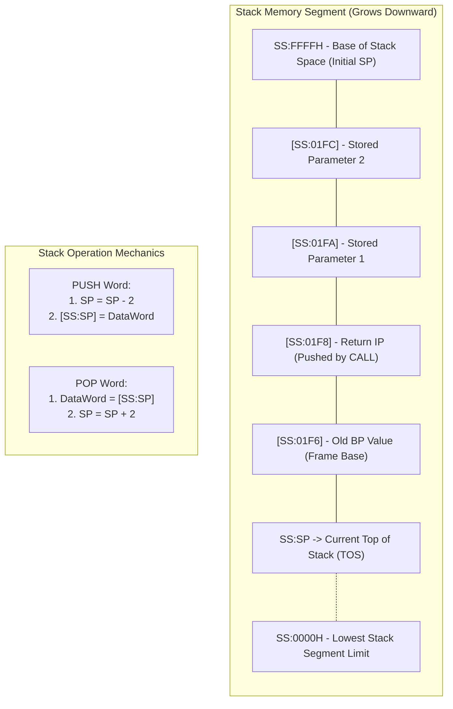
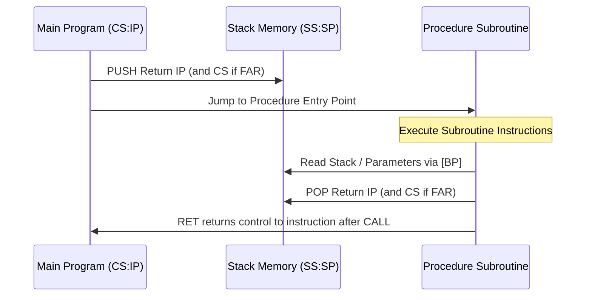

# Chapter 7 — 8086 Stack Architecture, Procedures & Modular Programming


> **Course Code:** 3CS526CC23  

> **Course Title:** Microprocessor and Interfacing [3 0 2 4]  

> **Governing Standard:** `notes_maker` Skill (Comprehensive Chapter Notes Generator)  

> **Primary Source:** Faculty Lecture Presentations (`3CS526CC23 Introduction.pdf`, `3CS526CC23 8086 Architecture.pdf`) & University Laboratory Manuals  


---


## 1. Chapter Overview


The hardware stack is a fundamental data structure in the 8086 microprocessor used for temporary data storage, return address tracking during subroutines and interrupts, and parameter passing between modular programs.


This chapter details:

1. **The 8086 Stack Architecture:** Stack Segment (`SS`), Stack Pointer (`SP`), Base Pointer (`BP`), Top of Stack (TOS) physical address computation, and downward stack growth dynamics.

2. **Stack Manipulation Instructions:** `PUSH`, `POP`, `PUSHF`, and `POPF` with operand constraints and byte/word ordering.

3. **Procedures & Subroutines:** `PROC`, `ENDP`, `NEAR` versus `FAR` procedures, subroutine invocation via `CALL`, and stack cleanup with `RET n`.

4. **Standard Stack Frame Architecture:** Constructing runtime activation records using `BP`, referencing passed parameters (`[BP+4]`, `[BP+6]`), allocating local stack variables (`[BP-2]`, `[BP-4]`), and frame deconstruction.

5. **Practical University Lab Implementations:** Reversing a string entered by a user using stack operations, and subroutine parameter passing.


[Source: 3CS526CC23 Introduction, Slides 5–6; 3CS526CC23 8086 Architecture, Slide 26]


---


## 2. 8086 Hardware Stack Architecture & Principles


The stack is a Last-In, First-Out (LIFO) data structure located within a dedicated 64 KB memory segment designated by the **Stack Segment register (`SS`)**. The current Top of Stack is tracked by the 16-bit **Stack Pointer register (`SP`)**.





### Core Architectural Rules of 8086 Stack


1. **Downward Growth (Decremental Stack):**

   - As items are pushed onto the stack, the Stack Pointer (`SP`) **decrements** toward lower memory addresses.

   - When items are popped from the stack, the Stack Pointer (`SP`) **increments** toward higher memory addresses.

2. **Strict Word-Alignment (16-bit Operands Only):**

   - The 8086 stack operations operate **exclusively on 16-bit words**.

   - You **cannot push or pop an 8-bit register** (e.g., `PUSH AL` is **STRICTLY ILLEGAL**).

3. **Physical Address of Top of Stack (TOS):**

   $$
\text{Physical Address (TOS)} = (\text{SS} \times 10\text{H}) + \text{SP}
$$


#### Worked Numerical Problem: Stack TOS Calculation

- **Given:** $\text{SS} = 3000\text{H}$, $\text{SP} = 8434\text{H}$.

- **Required:** Physical address of the top of stack.

- **Solution:**

  $$
\text{TOS Physical Address} = (3000\text{H} \times 10\text{H}) + 8434\text{H} = 30000\text{H} + 8434\text{H} = \mathbf{38434\text{H}}
$$


[Source: 3CS526CC23 8086 Architecture, Slide 33]


---


## 3. Stack Manipulation Instructions


### Detailed Operation Specifications


| Instruction | Syntax | Permitted Operands | Operation Performed | Flags Affected |
| :--- | :--- | :--- | :--- | :---: |
| **`PUSH`** | `PUSH src` | Reg16 (`AX, BX, CX, DX, SI, DI, BP, SP`), SegReg (`CS, DS, ES, SS`), Mem16 | $1.\; (\text{SP}) \leftarrow (\text{SP}) - 2$<br>$2.\; [\text{SS}:\text{SP}] \leftarrow (\text{src})$ | **None** |
| **`POP`** | `POP dst` | Reg16, SegReg (**except `CS`**), Mem16 | $1.\; (\text{dst}) \leftarrow [\text{SS}:\text{SP}]$<br>$2.\; (\text{SP}) \leftarrow (\text{SP}) + 2$ | **None** |
| **`PUSHF`** | `PUSHF` | None | Pushes entire 16-bit Flag Register onto stack. | **None** |
| **`POPF`** | `POPF` | None | Pops 16-bit word from stack into Flag Register. | **All Flags** |


### Critical Constraints & Edge Cases


1. **Little-Endian Storage on Stack:**

   When a 16-bit register (e.g., `AX = 1234H`) is pushed:

   - `SP` decrements by 1: $(\text{SP}-1)$ receives High Byte `12H`.

   - `SP` decrements by 1: $(\text{SP}-2)$ receives Low Byte `34H`.

   - `SP` now points to the lower byte `34H`.

2. **Forbidden POP Destination:**

   - `POP CS` is **STRICTLY FORBIDDEN** because altering the Code Segment without simultaneously changing `IP` creates unpredictable execution trajectories.

3. **Flags Preservation Pattern:**

   To preserve both general registers and the status flags across an interrupt or critical code block:

   ```assembly

   PUSHF                 ; Save flags

   PUSH AX               ; Save general registers

   PUSH BX

   ; ... critical routine ...

   POP BX                ; Restore in reverse order

   POP AX

   POPF                  ; Restore flags

   ```


---


## 4. Procedures, Calls & Subroutine Returns


Subroutines are defined using `PROC` and `ENDP`. They modularize code, eliminating redundant instructions.





### Procedure Distance Attributes: `NEAR` vs `FAR`


| Parameter | `NEAR` Procedure | `FAR` Procedure |
| :--- | :--- | :--- |
| **Scope** | Internal to the calling code segment. | External; callable from any code segment. |
| **`CALL` Mechanics** | Pushes only the 16-bit Instruction Pointer (`IP`). | Pushes `CS` first, followed by `IP`. |
| **`RET` Mechanics** | Pops 16-bit return address into `IP`. | Pops `IP` first, followed by `CS`. |
| **Machine Instruction** | 3-byte Opcode (`E8 Disp16`). | 5-byte Opcode (`9A Offset Seg`). |
| **Declaration** | `MY_PROC PROC NEAR` | `MY_PROC PROC FAR` |


---


### The `RET` Instruction & Stack Cleanup (`RET n`)


When parameters are passed to a procedure via the stack, those parameters remain on the stack after the subroutine finishes.

- **`RET`**: Pops return address into `IP` (or `CS:IP`).

- **`RET n`**: Pops return address into `IP`, and **automatically adds constant integer $n$to `SP`**, cleanly discarding$n$ bytes of pushed parameters in a single instruction.


```assembly

; Calling program pushes two 16-bit parameters (4 bytes total):

PUSH AX

PUSH BX

CALL COMPUTE_AVERAGE

; If subroutine ends with plain RET, caller must clean up: ADD SP, 4

; If subroutine ends with RET 4, stack is automatically cleaned up!

```


---


## 5. Standard Stack Frame Architecture (Using `BP`)


The **Base Pointer register (`BP`)** defaults to the **Stack Segment (`SS`)**. It enables random access to passed subroutine parameters and local stack variables without corrupting the active Top of Stack pointer (`SP`).


### The Standard Subroutine Prologue and Epilogue Template


```assembly

SUBROUTINE_NAME PROC NEAR

    ; === PROLOGUE: Set Up Stack Frame ===

    PUSH BP                  ; 1. Save caller's base pointer

    MOV  BP, SP              ; 2. Establish new frame base pointer (BP = SP)

    SUB  SP, 4               ; 3. Allocate 4 bytes for local variables ([BP-2], [BP-4])


    ; === FUNCTION BODY ===

    ; Accessing Passed Parameters (Caller pushed them before CALL):

    ; [BP + 0] = Saved Old BP

    ; [BP + 2] = Return Address (IP)

    ; [BP + 4] = 1st Parameter (Pushed last by caller)

    ; [BP + 6] = 2nd Parameter (Pushed first by caller)

    MOV AX, [BP + 4]         ; Load 1st parameter into AX

    ADD AX, [BP + 6]         ; Add 2nd parameter

    MOV [BP - 2], AX         ; Store result in local variable on stack


    ; === EPILOGUE: Deconstruct Stack Frame ===

    MOV  SP, BP              ; 1. Deallocate all local variables (restores SP)

    POP  BP                  ; 2. Restore caller's original BP

    RET  4                   ; 3. Return and discard 4 bytes of caller parameters

SUBROUTINE_NAME ENDP

```


---


## 6. Practical Worked Programs (Stack & Modular Systems)


### Program 7.1: Reversing a String Using the Stack (Lab Practical 6)

Because the stack is inherently a Last-In, First-Out (LIFO) structure, pushing an array of characters sequentially onto the stack and subsequently popping them off results in the characters emerging in reverse order.


```assembly

DATA SEGMENT

    STRING_IN  DB 'MICROPROCESSOR'

    STR_LEN    EQU $ - STRING_IN

    STRING_OUT DB STR_LEN DUP(?)

DATA ENDS


STACK_SEG SEGMENT STACK

    DW 64 DUP(?)

STACK_SEG ENDS


CODE SEGMENT

    ASSUME CS:CODE, DS:DATA, SS:STACK_SEG

START:

    MOV AX, DATA

    MOV DS, AX


    ; Step 1: Push all characters onto stack

    LEA SI, STRING_IN        ; DS:SI points to original string

    MOV CX, STR_LEN          ; Loop counter = String Length

PUSH_LOOP:

    MOV AL, [SI]             ; Fetch character

    MOV AH, 00H              ; Zero-extend to 16-bit word (Stack only accepts words!)

    PUSH AX                  ; Push word onto stack (SP decreases by 2)

    INC SI                   ; Advance to next input character

    LOOP PUSH_LOOP


    ; Step 2: Pop characters off stack into destination string

    LEA DI, STRING_OUT       ; DS:DI points to reversed output buffer

    MOV CX, STR_LEN          ; Reset counter

POP_LOOP:

    POP AX                   ; Pop word from stack (LIFO yields reverse character)

    MOV [DI], AL             ; Store character into destination

    INC DI                   ; Advance destination pointer

    LOOP POP_LOOP


    ; Terminate program

    MOV AH, 4CH

    INT 21H

CODE ENDS

END START

```


[Source: 3CS526CC23 Introduction, Slide 6 (Practical 6)]


---


## 7. Exam-Oriented Review & High-Frequency Questions


1. **Why does 8086 not permit an instruction like `PUSH AL`?**  

   *Answer:* The 8086 execution unit and internal bus architecture standardize all hardware stack operations to 16-bit words to maintain alignment with the 16-bit data bus and ensure `SP` remains stepped in 2-byte paragraph increments. Single-byte pushes would misalign word stack accesses, inducing bus timing penalties.

2. **Explain the memory organization of a stack frame when a procedure is called.**  

   *Answer:* The stack frame organized via `BP` contains:

   - `[BP + 4]` and higher: Input parameters pushed by the caller prior to invocation.

   - `[BP + 2]`: The 16-bit return address (`IP`) pushed by the `CALL` instruction.

   - `[BP + 0]`: The caller's preserved Base Pointer (`BP`).

   - `[BP - 2]` and lower: Local stack variables reserved by `SUB SP, n`.

3. **What is the advantage of `RET n` over standard `RET`?**  

   *Answer:* `RET n` performs both the return jump and parameter cleanup in one single atomic operation. It pops the return address into `IP` and automatically adds $n$ to `SP`, freeing the caller from needing an additional `ADD SP, n` instruction after every procedure call.

---

## 8. Step-by-Step Stack Trace — CALL and RETURN Sequence

This trace shows exactly what happens in memory and registers during a function call.

### Given Setup
```
SS = 3000H, SP = 0200H (initial)
Main code at CS:0100H
SUBROUTINE at CS:0050H
Caller pushes 2 parameters: AX = 0005H, BX = 000AH
```

### Trace Table

| Step | Action | SP Value | Stack Contents at `[SS:SP]` | Registers |
|:---:|:---|:---:|:---|:---|
| 1 | `PUSH BX` (2nd param) | `01FEH` | `[SS:01FEH] = 000AH` | SP=01FEH |
| 2 | `PUSH AX` (1st param) | `01FCH` | `[SS:01FCH] = 0005H` | SP=01FCH |
| 3 | `CALL SUBROUTINE` | `01FAH` | `[SS:01FAH] = 0103H` (return IP) | SP=01FAH, IP→0050H |
| 4 | `PUSH BP` (prologue) | `01F8H` | `[SS:01F8H] = old BP` | SP=01F8H |
| 5 | `MOV BP, SP` | `01F8H` | — | BP=01F8H (frame base) |
| 6 | `SUB SP, 2` (local var) | `01F6H` | `[SS:01F6H] = ?` (local) | SP=01F6H |

**Stack Layout at this point (BP=01F8H as reference):**
```
Address     Content               Access via BP
─────────────────────────────────────────────────
SS:01F6H    [Local variable]     [BP - 2]
SS:01F8H    Old BP value      ←  [BP + 0]  ← BP points here
SS:01FAH    Return IP (0103H)    [BP + 2]
SS:01FCH    Parameter 1 (0005H)  [BP + 4]  ← First arg
SS:01FEH    Parameter 2 (000AH)  [BP + 6]  ← Second arg
SS:0200H    (original top)
```

### Epilogue (Function Return)
```assembly
; Epilogue sequence:
MOV SP, BP       ; SP = BP = 01F8H (deallocates local var)
POP BP           ; BP restored, SP = 01FAH
RET 4            ; Pops IP → 0103H (SP=01FCH), then SP += 4 → SP=0200H
                 ; Stack completely restored to initial state!
```

---

## 9. Multi-Level (Nested) Procedure Calls

When one procedure calls another, multiple stack frames are chained together.

```assembly
; Caller → FUNC_A → FUNC_B (three levels deep)

FUNC_B PROC NEAR
    PUSH BP
    MOV  BP, SP
    ; [BP+2] = return addr to FUNC_A
    ; [BP+4] = FUNC_B's parameter
    MOV  AX, [BP + 4]    ; Get parameter
    ADD  AX, 100         ; Add 100
    POP  BP
    RET  2               ; Return and clean 1 word param
FUNC_B ENDP

FUNC_A PROC NEAR
    PUSH BP
    MOV  BP, SP
    ; [BP+2] = return addr to main
    ; [BP+4] = FUNC_A's parameter

    MOV  AX, [BP + 4]    ; Get FUNC_A's parameter
    PUSH AX              ; Pass it as FUNC_B's parameter
    CALL FUNC_B          ; FUNC_B return value comes back in AX

    POP  BP
    RET  2
FUNC_A ENDP

; Main calls FUNC_A:
PUSH WORD PTR 0050H    ; Parameter for FUNC_A
CALL FUNC_A            ; AX = 0050H + 100 = 0096H + 100 = 150 (0096H)
; Stack diagram during FUNC_B execution:
; SS:SP → FUNC_B local / FUNC_B old BP
;         FUNC_B return addr (inside FUNC_A)
;         FUNC_B's parameter (= 0050H)
;         FUNC_A old BP
;         FUNC_A return addr (in main)
;         FUNC_A's parameter (0050H)
```

---

## 10. PUSHA / POPA — 80286 Extension (Exam Gotcha)

> [!WARNING]
> **`PUSHA` and `POPA` are NOT 8086 instructions** — they were introduced in the **80286** processor.

| Instruction | Processor | Action |
|:---|:---:|:---|
| `PUSHA` | 80286+ | Push all 8 general registers in one instruction: AX, CX, DX, BX, SP, BP, SI, DI |
| `POPA` | 80286+ | Pop all 8 general registers (restores AX, CX, DX, BX, BP, SI, DI; discards SP value) |
| `PUSHF` | 8086 | Push FLAGS register (supported on 8086) |
| `POPF` | 8086 | Pop FLAGS register (supported on 8086) |

**On the 8086, to save all registers you must do it manually:**
```assembly
; 8086-compatible "save all" pattern:
PUSH AX
PUSH BX
PUSH CX
PUSH DX
PUSH SI
PUSH DI
PUSH BP
PUSHF        ; Save flags too

; ... critical code ...

POPF         ; Restore flags FIRST
POP BP
POP DI
POP SI
POP DX
POP CX
POP BX
POP AX       ; Restore in REVERSE order (LIFO!)
```

---

## 11. Additional Exam Questions

**Q4.** Trace the SP value when `PUSH AX`, `PUSH BX`, `CALL PROC` executes (initial SP = `0200H`).

> **Answer:**
> - After `PUSH AX`: SP = `0200H - 2 = 01FEH`
> - After `PUSH BX`: SP = `01FEH - 2 = 01FCH`
> - After `CALL PROC` (NEAR): SP = `01FCH - 2 = 01FAH` (IP = return address pushed)
> - Final SP = `01FAH`, with the stack holding [IP at 01FAH, BX at 01FCH, AX at 01FEH]

**Q5.** Why is `POP CS` forbidden on the 8086?

> **Answer:** `CS` (Code Segment) and `IP` (Instruction Pointer) together determine WHERE the CPU fetches the next instruction. Modifying `CS` alone — without simultaneously updating `IP` — would cause the CPU to fetch from a new segment at a random offset, leading to undefined behavior or a crash. The only safe way to change `CS` is via `JMP FAR`, `CALL FAR`, or `RETF`, which always update both `CS` and `IP` atomically.

**Q6.** What happens if you forget `MOV AX, DATA; MOV DS, AX` at the start of a program?

> **Answer:** Without initializing `DS`, the Data Segment register holds whatever value DOS happened to leave in it when it loaded the program (typically the PSP segment). Any memory variable access via DS would go to the wrong physical address, returning garbage values or corrupting memory, leading to incorrect results or a program crash.

**Q7.** A procedure has 3 word parameters and 2 word local variables. Draw the stack frame.

> **Answer (after PUSH BP; MOV BP,SP; SUB SP,4):**
> ```
> [BP + 8]   ← 3rd parameter (pushed first)
> [BP + 6]   ← 2nd parameter
> [BP + 4]   ← 1st parameter (pushed last by caller)
> [BP + 2]   ← Return IP (pushed by CALL)
> [BP + 0]   ← Old BP (saved by PUSH BP in prologue)
> [BP - 2]   ← Local variable 1
> [BP - 4]   ← Local variable 2  ← SP points here
> ```

**Q8.** What is the difference between NEAR and FAR CALL in terms of stack behavior?

> **Answer:**
> - **NEAR CALL:** Pushes only `IP` (2 bytes) onto the stack. `CS` is NOT pushed/changed. RET pops 2 bytes back into `IP`. Used for procedures within the same 64KB code segment.
> - **FAR CALL:** Pushes `CS` first (2 bytes), then `IP` (2 bytes) = **4 bytes total**. Both CS and IP are restored on `RETF`. Used to call procedures in different code segments (different CS values).

