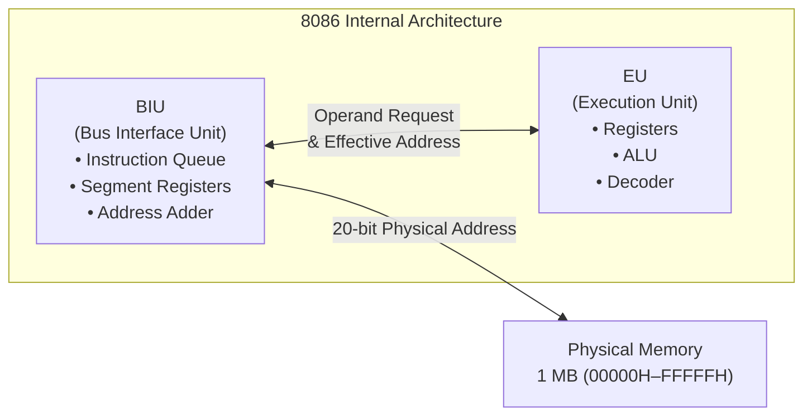
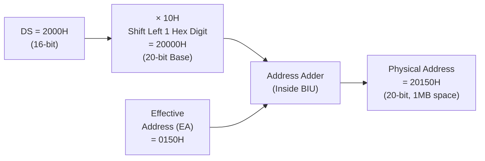

# Chapter 6 — 8086 Addressing Modes: Deep Dive with Diagrams

> **Course Code:** 3CS526CC23
> **Course Title:** Microprocessor and Interfacing [3 0 2 4]
> **Assembler:** TASM (Turbo Assembler) compatible syntax throughout
> **Primary Source:** 3CS526CC23 8086 Architecture.pdf, Liu & Gibson, Brey

---

## 1. What is an Addressing Mode?

An **Addressing Mode** defines the method the 8086 Execution Unit (EU) uses to locate the **operand** (data) required by an instruction. Before executing any instruction, the CPU must answer: *"Where is the data?"*

The 8086 has a **two-unit pipelined architecture**:
- **BIU (Bus Interface Unit):** Fetches instructions from memory, calculates physical addresses.
- **EU (Execution Unit):** Decodes and executes; requests operands from BIU.



---

## 2. The Physical Address Formula — The Foundation

The 8086 has a **20-bit address bus** (1 MB addressable) but only **16-bit internal registers**. To bridge this gap, a hardware **Address Adder** inside the BIU computes the physical address:

$$\boxed{\text{Physical Address (20-bit)} = \text{Segment Register} \times 10\text{H} + \text{Effective Address (EA)}}$$

> [!IMPORTANT]
> Multiplying by `10H` (hex) = shifting left by **one hex digit** = appending a zero nibble. This converts the 16-bit segment value into a 20-bit **paragraph-aligned** base address.

### Worked Formula Example

```
DS = 2000H  →  Shift left: 20000H
EA = 0150H  →  Add offset:  0150H
                            ──────
Physical Address         = 20150H  ✓
```



---

## 3. Segment-Register Defaults for Each Mode

Different registers default to different segments. This is **hardwired** in the 8086 silicon:

| Register Used in EA | Default Segment | Physical Address Formula |
|:---|:---:|:---|
| `BX`, `SI`, `DI` | **DS** (Data Segment) | `DS × 10H + EA` |
| `BP` | **SS** (Stack Segment) | `SS × 10H + EA` |
| `IP` (instruction fetch) | **CS** (Code Segment) | `CS × 10H + IP` |
| String Destination (`DI`) | **ES** (Extra Segment) | `ES × 10H + DI` |

### Segment Override Prefix
You can **force** a different segment using an override prefix byte placed before the instruction:

| Override | Prefix Byte (Hex) | Example |
|:---|:---:|:---|
| `CS:` | `2EH` | `MOV AL, CS:[BX]` |
| `SS:` | `36H` | `MOV AX, SS:[SI]` |
| `DS:` | `3EH` | `MOV AL, DS:[BP]` |
| `ES:` | `26H` | `MOV BX, ES:[DI]` |

> [!NOTE]
> The destination segment for **string instructions (`ES:DI`)** can **NEVER** be overridden — it is permanently wired to the Extra Segment.

---

## 4. The 7 Addressing Modes — In-Depth with Diagrams

---

### Mode 1: Register Addressing Mode

**Definition:** Both the source and destination operands are **internal CPU registers**. No memory access occurs whatsoever.

**Formula:** No EA calculation — the register IS the operand.

```
┌─────────────────────────────────────────────────────────────────┐
│                    REGISTER ADDRESSING MODE                      │
│                                                                   │
│   Instruction:  MOV BX, DX                                       │
│                                                                   │
│   ┌──────────┐   Contents Copied   ┌──────────┐                  │
│   │  DX Reg  │ ──────────────────► │  BX Reg  │                  │
│   │  [1234H] │                     │  [????]  │                  │
│   └──────────┘                     └──────────┘                  │
│                                     Result: BX = 1234H           │
│                                                                   │
│   ✅ NO MEMORY ACCESS — Fastest mode (2-3 clock cycles)          │
└─────────────────────────────────────────────────────────────────┘
```

**Valid Registers:**
- 8-bit: `AL`, `AH`, `BL`, `BH`, `CL`, `CH`, `DL`, `DH`
- 16-bit: `AX`, `BX`, `CX`, `DX`, `SP`, `BP`, `SI`, `DI`
- Segment: `CS`, `DS`, `ES`, `SS` (with restrictions)

**Illegal Operations:**
```assembly
MOV BL, BX      ; ❌ ILLEGAL — Mixed sizes (8-bit ← 16-bit)
MOV CS, AX      ; ❌ ILLEGAL — CS cannot be a destination
MOV ES, DS      ; ❌ ILLEGAL — Segment-to-segment transfer forbidden
MOV DS, 1000H   ; ❌ ILLEGAL — Immediate to segment register
```

**Legal Code Examples:**
```assembly
MOV BX, DX          ; BX = DX   (16-bit register copy)
MOV AL, BH          ; AL = BH   (8-bit register copy)
XCHG AX, CX         ; Swap AX ↔ CX
ADD AX, BX          ; AX = AX + BX
CMP AL, BL          ; Set flags based on AL - BL
MOV AX, CS          ; Reading CS is allowed (only writing CS is illegal)
```

**Exam Key Facts:**
- Fastest addressing mode (no memory bus cycles)
- Uses 0 or 1 byte for the instruction (no displacement, no address bytes)
- `PUSH`/`POP` are register mode for stack operations

---

### Mode 2: Immediate Addressing Mode

**Definition:** The operand data is a **constant value encoded directly inside the instruction bytes**, immediately following the opcode.

**Formula:** No EA — the constant IS the operand (part of the instruction stream).

```
┌─────────────────────────────────────────────────────────────────┐
│                   IMMEDIATE ADDRESSING MODE                       │
│                                                                   │
│   Instruction:  MOV AX, 2550H                                    │
│                                                                   │
│   Memory (Code Segment - Instruction Bytes):                     │
│   ┌────────┬────────┬────────┐                                   │
│   │  B8H   │  50H   │  25H   │  ← Instruction bytes in CS        │
│   │ Opcode │ Low    │ High   │    (little-endian: low byte first) │
│   └────────┴────────┴────────┘                                   │
│        ↓                                                          │
│   ┌──────────┐                                                    │
│   │  AX Reg  │  = 2550H (loaded directly from instruction)        │
│   └──────────┘                                                    │
└─────────────────────────────────────────────────────────────────┘
```

**Constraints:**
```assembly
; ❌ Cannot load immediate DIRECTLY into segment registers:
MOV DS, 1000H       ; ❌ ASSEMBLER ERROR

; ✅ Correct — route through general register:
MOV AX, 1000H       ; Step 1: Load into AX
MOV DS, AX          ; Step 2: Transfer to DS

; ❌ Immediate must fit destination size:
MOV AL, 2AAH        ; ❌ 2AAH = 682 > 255, exceeds 8-bit range
MOV AL, 0AAH        ; ✅ AAH = 170, fits in 8-bit range
```

**Legal Code Examples:**
```assembly
MOV AX, 2550H       ; AX = 2550H (word immediate)
MOV CL, 04H         ; CL = 04H (byte immediate — shift count)
MOV BX, -1          ; BX = FFFFh (sign-extended -1)
ADD AX, 100         ; AX = AX + 100 (decimal immediate)
AND AL, 0FH         ; Mask lower nibble (immediate mask)
CMP CX, 0000H       ; Compare CX with zero
```

---

### Mode 3: Direct Addressing Mode

**Definition:** The **16-bit Effective Address** is hardcoded as a constant displacement `[Disp16]` directly in the instruction. The CPU reads/writes the memory at that fixed offset within DS.

**Formula:**
$$EA = \text{Disp16} \quad \Rightarrow \quad \text{Physical} = \text{DS} \times 10\text{H} + \text{Disp16}$$

```
┌─────────────────────────────────────────────────────────────────┐
│                    DIRECT ADDRESSING MODE                         │
│                                                                   │
│   Instruction:  MOV DL, [2440H]                                  │
│   Given: DS = 2000H                                              │
│                                                                   │
│   ┌────────┐    × 10H    ┌──────────┐                           │
│   │ DS Reg │ ──────────► │  20000H  │                           │
│   │  2000H │             └──────────┘                           │
│                                    +                             │
│   Instruction contains:  ┌──────────┐                           │
│   [2440H] displacement   │  02440H  │                           │
│                           └──────────┘                           │
│                                    ↓                             │
│                     Physical Address = 22440H                    │
│                                                                   │
│   ┌─────────────────────────────────────────┐                   │
│   │              MEMORY (1 MB)               │                   │
│   │  ...                                     │                   │
│   │  22440H │ 0F3H │ ← This byte → DL        │                   │
│   │  22441H │ ...  │                          │                   │
│   │  ...                                     │                   │
│   └─────────────────────────────────────────┘                   │
└─────────────────────────────────────────────────────────────────┘
```

**Worked Numerical Problem:**
- DS = `3000H`, instruction: `MOV AX, [0200H]`
- Physical = `3000H × 10H + 0200H = 30000H + 0200H = **30200H**`
- `AX` is loaded with the **word** at addresses `30200H` (low) and `30201H` (high)

**Code Examples:**
```assembly
MOV DL, [2440H]         ; Load byte at DS:2440H into DL
MOV AX, [1000H]         ; Load word at DS:1000H into AX
MOV [5000H], CX         ; Store CX into DS:5000H (two bytes)
MOV WORD_VAR, BX        ; By label name (assembler replaces with offset)
ADD AX, COUNT           ; Add memory variable COUNT to AX
```

> [!NOTE]
> Using a **variable name** like `MOV AX, COUNT` IS direct addressing — the assembler replaces the name with its fixed 16-bit offset during assembly.

---

### Mode 4: Register Indirect Addressing Mode

**Definition:** The EA is **contained inside a register** (`BX`, `BP`, `SI`, or `DI`). The register points to the data in memory — like a C pointer (`*ptr`).

**Formula:**
$$EA = [R] \quad \text{where } R \in \{BX, BP, SI, DI\}$$

$$\text{Physical} = \begin{cases} \text{DS} \times 10\text{H} + [R] & \text{if } R \in \{BX, SI, DI\} \\ \text{SS} \times 10\text{H} + [R] & \text{if } R = BP \end{cases}$$

```
┌─────────────────────────────────────────────────────────────────┐
│                REGISTER INDIRECT ADDRESSING MODE                  │
│                                                                   │
│   Instruction:  MOV CX, [BX]                                     │
│   Given: DS = 4000H, BX = 0300H                                  │
│                                                                   │
│   ┌────────┐    × 10H   ┌──────────┐                            │
│   │  DS    │──────────► │  40000H  │  (Segment Base)             │
│   │  4000H │            └──────────┘                            │
│                                    +                             │
│   ┌────────┐             ┌──────────┐                            │
│   │  BX    │──────────► │  00300H  │  (Offset = EA)              │
│   │  0300H │ (EA = BX)  └──────────┘                            │
│                                    ↓                             │
│                    Physical Address = 40300H                     │
│                                                                   │
│   MEMORY:   40300H │ 56H │  → CL = 56H                          │
│             40301H │ 78H │  → CH = 78H                          │
│                    ──────                                         │
│                    CX = 7856H  (little-endian!)                  │
└─────────────────────────────────────────────────────────────────┘
```

**Only 4 Registers Allowed as Indirect Pointers:**

| Register | Default Segment | Typical Use |
|:---:|:---:|:---|
| `BX` | DS | Base pointer for data structures |
| `BP` | **SS** | Stack frame parameter access |
| `SI` | DS | Source pointer in string/array ops |
| `DI` | DS | Destination pointer |

> [!WARNING]
> `MOV AX, [CX]` is **ILLEGAL** — `CX` cannot be used as an indirect address register! Only BX, BP, SI, DI are valid.

**Code Examples:**
```assembly
MOV CX, [BX]            ; CX = word at DS:BX
MOV [DI], AX            ; Store AX at DS:DI
INC BYTE PTR [SI]        ; Increment byte at DS:SI (PTR required for byte size)
MOV AL, [BP]             ; Load byte from SS:BP (stack access)

; Typical pointer usage:
LEA BX, MY_ARRAY         ; Load address of array into BX
MOV AX, [BX]             ; Load first element via pointer
ADD BX, 2                ; Advance pointer to next word element
MOV AX, [BX]             ; Load second element
```

---

### Mode 5: Base Relative Addressing Mode

**Definition:** EA = **Base Register + Signed Displacement**. Used to access **fields within a structure** or **stack parameters** at a fixed offset from a base.

**Formula:**
$$EA = [BX\text{ or }BP] + \text{Displacement (8-bit or 16-bit signed)}$$

- **8-bit displacement**: Range −128 to +127
- **16-bit displacement**: Range −32,768 to +32,767

```
┌─────────────────────────────────────────────────────────────────┐
│               BASE RELATIVE ADDRESSING MODE                       │
│                                                                   │
│   Instruction:  MOV AX, [BX + 10H]                              │
│   Given: DS = 4000H, BX = 2000H                                  │
│                                                                   │
│   ┌────────┐    × 10H   ┌──────────┐                            │
│   │  DS    │──────────► │  40000H  │  (Segment Base)             │
│   │  4000H │            └──────────┘                            │
│                                    +                             │
│   ┌────────┐            ┌──────────┐                            │
│   │  BX    │──────────► │  02000H  │  (Base Register)            │
│   │  2000H │            └──────────┘                            │
│                    +                                             │
│   Displacement:    ┌──────────┐                                  │
│     [BX + 10H]     │  00010H  │  (Fixed Displacement)            │
│                    └──────────┘                                  │
│   EA = 2000H + 0010H = 2010H         ↓                          │
│                    Physical = 40000H + 2010H = 42010H            │
└─────────────────────────────────────────────────────────────────┘
```

**Structure/Record Access Example:**
```
EMPLOYEE RECORD:
  Offset 0: ID    (2 bytes)
  Offset 2: Age   (1 byte)
  Offset 3: Dept  (1 byte)
  Offset 4: Salary (2 bytes)

; If BX points to start of EMPLOYEE:
MOV AX, [BX + 0]    ; Load ID
MOV AL, [BX + 2]    ; Load Age
MOV AL, [BX + 3]    ; Load Dept
MOV AX, [BX + 4]    ; Load Salary
```

**Code Examples:**
```assembly
MOV AX, [BX + 10H]     ; Load word at DS:(BX + 10H)
MOV DL, [BP + 4]        ; Load byte from stack at SS:(BP + 4) — 1st parameter
ADD CX, [BX + 02H]      ; Add word from DS:(BX + 2) to CX
MOV [BP - 2], AX        ; Store AX into local var on stack at SS:(BP - 2)
MOV AX, [BP + 6]        ; Load 2nd parameter from stack frame
```

**Exam Worked Problem:**
- Given: `SS = 3000H`, `BP = 01FAH`, instruction: `MOV DL, [BP + 4]`
- EA = `01FAH + 0004H = 01FEH`
- Physical = `30000H + 01FEH = **301FEH**`

---

### Mode 6: Indexed Relative Addressing Mode

**Definition:** EA = **Index Register + Signed Displacement**. Used for **array access** where the index changes each iteration and the base address is the fixed displacement.

**Formula:**
$$EA = [SI\text{ or }DI] + \text{Displacement}$$

```
┌─────────────────────────────────────────────────────────────────┐
│              INDEXED RELATIVE ADDRESSING MODE                     │
│                                                                   │
│   Instruction:  MOV DX, ARRAY[SI]                                │
│   Given: DS = 2000H, SI = 5000H, ARRAY = 1234H                  │
│                                                                   │
│   ┌────────┐    × 10H   ┌──────────┐                            │
│   │  DS    │──────────► │  20000H  │  (Segment Base)             │
│   │  2000H │            └──────────┘                            │
│                                    +                             │
│   ┌────────┐            ┌──────────┐                            │
│   │  SI    │──────────► │  05000H  │  (Index = current array i)  │
│   │  5000H │            └──────────┘                            │
│                    +                                             │
│   ARRAY label:     ┌──────────┐                                  │
│     (disp = 1234H) │  01234H  │  (Array base address)            │
│                    └──────────┘                                  │
│   EA = 5000H + 1234H = 6234H         ↓                          │
│                    Physical = 20000H + 6234H = 26234H            │
└─────────────────────────────────────────────────────────────────┘
```

**Array Traversal Pattern:**
```assembly
; Traverse a byte array using INDEXED mode:
DATA SEGMENT
    SCORES DB 75, 82, 91, 68, 50    ; 5 student scores
    N      EQU 5
DATA ENDS

CODE SEGMENT
    ASSUME CS:CODE, DS:DATA
START:
    MOV AX, DATA
    MOV DS, AX
    XOR SI, SI          ; SI = 0 (index starts at 0)
    MOV CX, N           ; Loop N times

SCAN_LOOP:
    MOV AL, SCORES[SI]  ; AL = SCORES[SI] — Indexed Relative!
    ; ... process AL ...
    INC SI              ; SI++ (advance to next byte element)
    LOOP SCAN_LOOP
```

**Code Examples:**
```assembly
MOV DX, ARRAY[SI]       ; Load word from ARRAY + SI
MOV AL, STRING[DI]      ; Load byte from STRING + DI
CMP AL, LOOKUP[SI]      ; Compare AL with lookup table entry
MOV TABLE[DI], BL       ; Store BL into table at offset DI
ADD AX, MATRIX[SI]      ; Add array element to accumulator
```

---

### Mode 7: Base Indexed Relative Addressing Mode

**Definition:** The most powerful mode. EA = **Base Register + Index Register + Optional Displacement**. Naturally models **2D arrays**, **pointer arrays**, and **stack-frame indexed structures**.

**Formula:**
$$EA = [BX\text{ or }BP] + [SI\text{ or }DI] + \text{Displacement (optional)}$$

$$\text{Segment} = \begin{cases} \text{SS} & \text{if BP is the base} \\ \text{DS} & \text{if BX is the base} \end{cases}$$

```
┌─────────────────────────────────────────────────────────────────┐
│           BASE INDEXED RELATIVE ADDRESSING MODE                   │
│                                                                   │
│   Instruction:  MOV AX, BETA[BX][SI]                            │
│   Given: DS = 1200H, BX = 1000H, SI = 2000H, BETA = 1234H       │
│                                                                   │
│   ┌────────┐    × 10H   ┌──────────┐                            │
│   │  DS    │──────────► │  12000H  │  (Segment Base)             │
│   │  1200H │            └──────────┘                            │
│                                    +                             │
│   ┌────────┐            ┌──────────┐                            │
│   │  BX    │──────────► │  01000H  │  (Base Register)            │
│   │  1000H │            └──────────┘                            │
│                    +                                             │
│   ┌────────┐            ┌──────────┐                            │
│   │  SI    │──────────► │  02000H  │  (Index Register)           │
│   │  2000H │            └──────────┘                            │
│                    +                                             │
│   BETA:            ┌──────────┐                                  │
│     (disp = 1234H) │  01234H  │  (Array 2D base displacement)    │
│                    └──────────┘                                  │
│   EA = 1000H + 2000H + 1234H = 4234H     ↓                     │
│                    Physical = 12000H + 4234H = 16234H            │
└─────────────────────────────────────────────────────────────────┘
```

**2D Array Access Pattern:**
```assembly
; 2D Array: MATRIX[ROW][COL] — each element is 2 bytes (word)
; ROW_SIZE = number of columns × element_size
; Element at [row][col] = MATRIX + (row × ROW_SIZE) + (col × 2)

; If BX = row offset (row × ROW_SIZE), SI = col offset (col × 2):
MOV AX, MATRIX[BX][SI]   ; Access MATRIX[row][col] — Base Indexed!

; Practical example: 3×4 word matrix
; Access element at row=1, col=2:
MOV BX, 8        ; Row 1: 1 × (4 cols × 2 bytes) = 8
MOV SI, 4        ; Col 2: 2 × 2 bytes = 4
MOV AX, MATRIX[BX][SI]   ; AX = MATRIX[1][2]
```

**Valid Base + Index Combinations:**

| Base | + Index | Notes |
|:---:|:---:|:---|
| `BX` | `SI` | DS segment (most common) |
| `BX` | `DI` | DS segment |
| `BP` | `SI` | SS segment |
| `BP` | `DI` | SS segment |

> [!WARNING]
> You **cannot** combine two base registers (`BX + BP`) or two index registers (`SI + DI`). Also, `MOV AX, [BX + CX]` is **ILLEGAL** — `CX` is not a valid base or index register!

**Code Examples:**
```assembly
MOV AX, BETA[BX][SI]     ; 2D array access via base+index+displacement
MOV [BP + DI], CL        ; Store CL at SS:(BP+DI) — stack indexed
ADD AX, MATRIX[BX][SI]   ; Accumulate 2D matrix element
MOV BH, TABLE[BX + SI]   ; Byte from combined pointer (no separate disp)
MOV [BX + DI + 5], AL    ; Store with all three components
```

**Timing:** This mode is the SLOWEST (7–12 clock cycles for EA calculation):
- `BX + SI` or `BP + DI`: **7 cycles**
- `BX + DI` or `BP + SI`: **8 cycles**
- `BP + DI + Disp` or `BX + SI + Disp`: **11 cycles**
- `BP + SI + Disp` or `BX + DI + Disp`: **12 cycles**

---

## 5. Master Comparison Table — All 7 Modes

| # | Mode | EA Formula | Segment | Instruction Size | EA Calc Cycles | Exam Keyword |
|:---:|:---|:---|:---:|:---:|:---:|:---|
| 1 | Register | N/A (reg) | None | 2 bytes | 0 | Fastest |
| 2 | Immediate | N/A (const) | CS (in code) | 2–3 bytes | 0 | Hardcoded |
| 3 | Direct | `Disp16` | DS | 4 bytes | 6 | Fixed variable |
| 4 | Register Indirect | `[BX/BP/SI/DI]` | DS or SS | 2 bytes | 5 | Pointer (`*p`) |
| 5 | Base Relative | `[BX/BP] + Disp` | DS or SS | 2–4 bytes | 9 | Structure field |
| 6 | Indexed Relative | `[SI/DI] + Disp` | DS | 2–4 bytes | 9 | Array element |
| 7 | Base Indexed Rel. | `[BX/BP]+[SI/DI]+Disp` | DS or SS | 2–4 bytes | 7–12 | 2D Array |

---

## 6. Effective Address Calculation Timing Reference

The EA calculation penalty is **added to base instruction clock count**:

```
Memory-to-Register instruction: base = 9 + EA_time
Register-to-Memory instruction: base = 16 + EA_time

EA_time:
  Direct:                         6 cycles
  Register Indirect:              5 cycles
  Base or Index Relative:         9 cycles
  Base Indexed (no displacement): 7 or 8 cycles
  Base Indexed (with displacement): 11 or 12 cycles
  +4 cycles penalty if word at ODD memory address!
```

### Bus Alignment Rule (Critical!)
- Word at **even address**: 1 bus cycle (4 T-states), `BHE=0`, `A0=0`
- Word at **odd address**: 2 bus cycles (+4 clock penalty), `A0=1`

---

## 7. Complete Exam Programs Using Various Addressing Modes

### Program 1: Array Sum using Indexed Relative Mode

```assembly
; Task: Sum all bytes in SCORES array (Indexed Relative addressing)
DATA SEGMENT
    SCORES  DB 10H, 20H, 30H, 40H, 50H
    N       EQU $ - SCORES              ; N = 5
    TOTAL   DW ?
DATA ENDS

CODE SEGMENT
    ASSUME CS:CODE, DS:DATA
START:
    MOV AX, DATA
    MOV DS, AX

    XOR SI, SI          ; SI = 0 (array index = 0)
    XOR AX, AX          ; AX = running sum = 0
    MOV CX, N           ; CX = 5 (loop count)

SUM_LOOP:
    XOR AH, AH
    MOV AL, SCORES[SI]  ; MODE 6: Indexed Relative — SCORES + SI
    ADD AX, [SI + OFFSET SCORES]  ; Alternative equivalent syntax
    INC SI              ; Advance index
    LOOP SUM_LOOP       ; CX--, repeat

    MOV TOTAL, AX       ; Store sum
    MOV AH, 4CH
    INT 21H
CODE ENDS
END START
```

### Program 2: Structure Access using Base Relative Mode

```assembly
; Task: Access employee salary using Base Relative addressing
DATA SEGMENT
    ; Employee record: ID(2) | Age(1) | Dept(1) | Salary(2) = 6 bytes
    EMP_ID     DW 1001H
    EMP_AGE    DB 30H
    EMP_DEPT   DB 02H
    EMP_SALARY DW 5000H
DATA ENDS

CODE SEGMENT
    ASSUME CS:CODE, DS:DATA
START:
    MOV AX, DATA
    MOV DS, AX

    LEA BX, EMP_ID       ; BX → base of employee record

    MOV AX, [BX + 0]     ; MODE 5: Load ID    (Base Relative, disp=0)
    MOV AL, [BX + 2]     ; MODE 5: Load Age   (Base Relative, disp=2)
    MOV AL, [BX + 3]     ; MODE 5: Load Dept  (Base Relative, disp=3)
    MOV AX, [BX + 4]     ; MODE 5: Load Salary (Base Relative, disp=4)

    MOV AH, 4CH
    INT 21H
CODE ENDS
END START
```

### Program 3: 2D Array Access using Base Indexed Relative Mode

```assembly
; Task: Access element at [ROW=1][COL=2] of a 3×4 byte matrix
DATA SEGMENT
    ; 3×4 matrix (3 rows, 4 cols) stored row-major:
    MATRIX DB 01H,02H,03H,04H   ; Row 0
           DB 05H,06H,07H,08H   ; Row 1
           DB 09H,0AH,0BH,0CH   ; Row 2
    COLS   EQU 4                ; Columns per row
DATA ENDS

CODE SEGMENT
    ASSUME CS:CODE, DS:DATA
START:
    MOV AX, DATA
    MOV DS, AX

    ; Access MATRIX[1][2] = 07H
    MOV BX, 1 * COLS     ; BX = row offset = 1 × 4 = 4
    MOV SI, 2            ; SI = col offset = 2
    MOV AL, MATRIX[BX][SI] ; MODE 7: Base Indexed! AL = 07H

    MOV AH, 4CH
    INT 21H
CODE ENDS
END START
```

---

## 8. Exam-Oriented Review — 10 Questions

**Q1.** Which addressing mode is the fastest and why?

> **Answer:** **Register Addressing** is fastest because it requires **no memory bus cycles** — both operands exist inside the CPU. Zero EA calculation time, zero wait states.

**Q2.** If `DS = 5000H` and the instruction is `MOV BX, [1234H]`, what is the physical address accessed?

> **Answer:** EA = `1234H` (Direct mode). Physical = `5000H × 10H + 1234H = 50000H + 1234H = **51234H**`.

**Q3.** If `DS = 3000H`, `BX = 0200H`, instruction: `MOV AX, [BX + 100H]`. Find Physical Address.

> **Answer:** Base Relative mode. EA = `BX + Disp = 0200H + 0100H = 0300H`. Physical = `30000H + 0300H = **30300H**`.

**Q4.** Why can't `CX` be used as an indirect address register (e.g., `MOV AL, [CX]`)?

> **Answer:** The 8086 MOD-R/M decoding table only supports **BX, BP, SI, DI** as indirect address registers. `CX` (Count Register) has no corresponding R/M encoding for memory access — it is architecturally restricted to shift counts and loop counts.

**Q5.** What is the difference between `MOV AX, COUNT` and `MOV AX, OFFSET COUNT`?

> **Answer:** `MOV AX, COUNT` is **Direct Addressing** — loads the **contents** of the memory variable `COUNT`. `MOV AX, OFFSET COUNT` is **Immediate Addressing** — loads the **address** (offset value) of `COUNT` into `AX`, not its data.

**Q6.** Given `SS = 2000H`, `BP = 0300H`, `DI = 0050H`. Instruction: `MOV AL, [BP + DI]`. Find Physical Address.

> **Answer:** Base Indexed mode with BP → SS segment. EA = `0300H + 0050H = 0350H`. Physical = `20000H + 0350H = **20350H**`.

**Q7.** What is the `+4 clock cycle penalty` for odd memory addresses?

> **Answer:** The 8086 data bus is 16-bit and designed to read a word in **one bus cycle if the word starts at an even address** (both bytes on same bus cycle with `BHE=0, A0=0`). If the word starts at an **odd address**, the CPU must perform **two separate bus cycles** (first reads the odd-addressed byte, then reads the next even-addressed byte), costing +4 extra clock cycles.

**Q8.** Identify the addressing mode: `MOV AX, TABLE[BX + SI]`

> **Answer:** **Base Indexed Relative Addressing Mode.** `BX` is the base register, `SI` is the index, and `TABLE` is the displacement. EA = `[BX] + [SI] + TABLE_offset`.

**Q9.** What is a segment override prefix? Give an example.

> **Answer:** A 1-byte prefix added before an instruction to force the BIU to use a non-default segment. Example: `MOV AL, ES:[BX]` — here `ES:` overrides the normal DS default for BX, accessing `ES:BX` instead of `DS:BX`. Machine code: `26H 8AH 07H`.

**Q10.** A programmer writes `MOV AX, [SI + DI]`. Is this valid?

> **Answer:** **No, ILLEGAL.** Base Indexed mode requires **one base register (BX or BP)** and **one index register (SI or DI)**. Combining two index registers (`SI + DI`) is not supported by the 8086 MOD-R/M encoding. The assembler will generate an error.

---

## Summary Formula Sheet

$$\text{Physical Address} = (\text{Segment Register} \times 16_{10}) + \text{Effective Address}$$

$$= (\text{Segment Register} \times 10\text{H}) + \text{EA}$$

| Mode | EA |
|:---|:---|
| Register | No EA (register operand) |
| Immediate | No EA (embedded constant) |
| Direct | `Disp16` |
| Register Indirect | `[BX]` or `[BP]` or `[SI]` or `[DI]` |
| Base Relative | `[BX/BP] + Disp8/16` |
| Indexed Relative | `[SI/DI] + Disp8/16` |
| Base Indexed Relative | `[BX/BP] + [SI/DI] + Disp8/16` |
