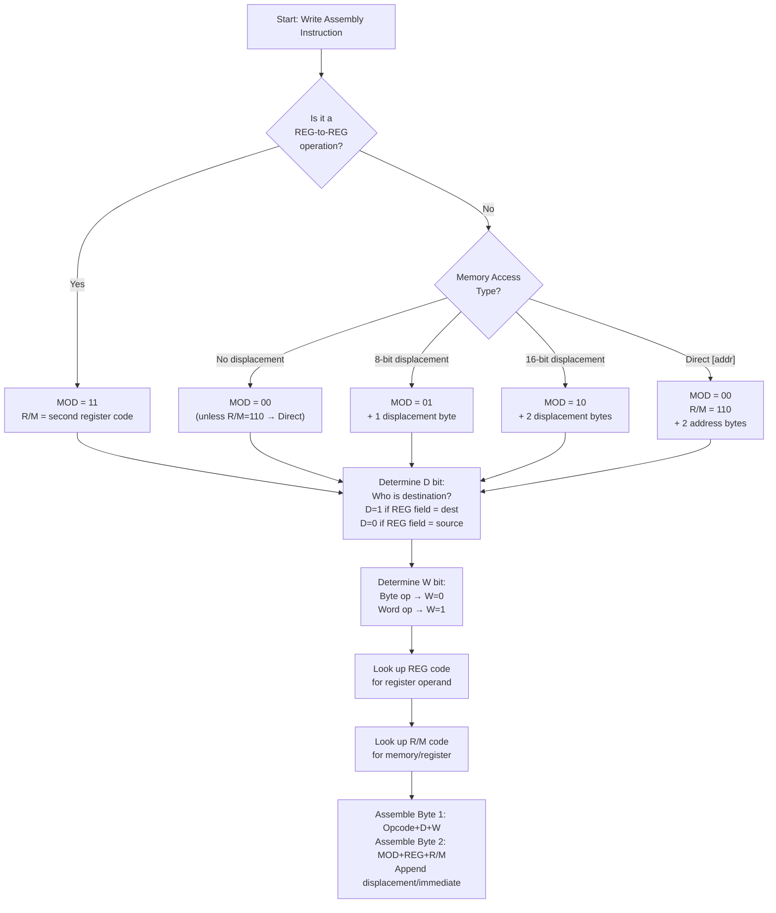

# Chapter 7 — 8086 Machine Instruction Encoding: Instructions to Binary

> **Course Code:** 3CS526CC23
> **Course Title:** Microprocessor and Interfacing [3 0 2 4]
> **Assembler:** TASM (Turbo Assembler) compatible
> **Primary Source:** Liu & Gibson Ch.3, Brey Ch.2, 3CS526CC23 8086 Architecture.pdf

---

## 1. Why Machine Encoding Matters

When you write `MOV CL, [BX]` in TASM, the assembler converts it into a sequence of binary/hex bytes. Understanding this translation process lets you:
- **Decode** hex dumps from debuggers
- **Calculate** machine code for exam problems
- **Understand** why some instructions are larger/faster than others
- **Read** disassembler output correctly

---

## 2. The 8086 Instruction Format — General Structure

An 8086 instruction ranges from **1 to 6 bytes**:

```
┌─────────────────────────────────────────────────────────────────────┐
│                   8086 INSTRUCTION BYTE FORMAT                       │
│                                                                       │
│  Byte 1:  ┌──────────────────┬───┬───┐                              │
│           │  OPCODE (6 bits) │ D │ W │                              │
│           └──────────────────┴───┴───┘                              │
│                                                                       │
│  Byte 2:  ┌──────────┬──────────┬──────────┐                        │
│           │ MOD(2b)  │ REG(3b)  │ R/M(3b)  │                        │
│           └──────────┴──────────┴──────────┘                        │
│                                                                       │
│  Byte 3:  Low byte of displacement (if any)                          │
│  Byte 4:  High byte of displacement (if any)                         │
│  Byte 5:  Low byte of immediate data (if any)                        │
│  Byte 6:  High byte of immediate data (if any)                       │
└─────────────────────────────────────────────────────────────────────┘
```

### Bit Field Definitions

#### Byte 1 — Opcode + D + W

| Field | Bits | Meaning |
|:---|:---:|:---|
| **OPCODE** | 6 | Fundamental operation (MOV, ADD, SUB, etc.) |
| **D (Direction)** | 1 | `D=0`: Data flows from REG → R/M. `D=1`: Data flows from R/M → REG |
| **W (Word/Byte)** | 1 | `W=0`: 8-bit byte operation. `W=1`: 16-bit word operation |

> [!IMPORTANT]
> **D bit rule:** Think "Who is the DESTINATION?"
> - `D=1` → REG field is the **destination** (data flows TO REG)
> - `D=0` → REG field is the **source** (data flows FROM REG)

#### Byte 2 — MOD + REG + R/M

| Field | Bits | Meaning |
|:---|:---:|:---|
| **MOD** | 2 | Memory access mode (displacement type or register-only) |
| **REG** | 3 | Specifies a register operand |
| **R/M** | 3 | Specifies memory EA formula or second register |

---

## 3. MOD Field — Complete Truth Table

| MOD | Binary | Memory Access Mode | Displacement Added |
|:---:|:---:|:---|:---:|
| `00` | `00` | Memory, **no displacement** (except R/M=110 → direct addr) | None |
| `01` | `01` | Memory, **8-bit signed** displacement follows | +1 byte |
| `10` | `10` | Memory, **16-bit signed** displacement follows | +2 bytes |
| `11` | `11` | **Register mode** — R/M specifies a register (no memory) | None |

> [!NOTE]
> **Special case:** When `MOD=00` AND `R/M=110`, it does NOT mean `[BP]` — it means **Direct Addressing** with a 16-bit address following.

---

## 4. REG Field Encoding Table

| REG Code | `W=0` (Byte) | `W=1` (Word) |
|:---:|:---:|:---:|
| `000` | AL | AX |
| `001` | CL | CX |
| `010` | DL | DX |
| `011` | BL | BX |
| `100` | AH | SP |
| `101` | CH | BP |
| `110` | DH | SI |
| `111` | BH | DI |

**Memory aid:** `AL, CL, DL, BL, AH, CH, DH, BH` ← byte registers in order 000–111

---

## 5. R/M Field Encoding Table

When `MOD ≠ 11` (memory access), R/M specifies the **EA formula**:

| R/M | Binary | EA Formula | Default Segment |
|:---:|:---:|:---|:---:|
| `000` | `000` | `[BX + SI]` | DS |
| `001` | `001` | `[BX + DI]` | DS |
| `010` | `010` | `[BP + SI]` | SS |
| `011` | `011` | `[BP + DI]` | SS |
| `100` | `100` | `[SI]` | DS |
| `101` | `101` | `[DI]` | DS |
| `110` | `110` | `[BP]` (MOD≠00) / Direct Address (MOD=00) | SS / DS |
| `111` | `111` | `[BX]` | DS |

When `MOD = 11` (register mode), R/M uses the **REG encoding table above** for the register.

---

## 6. Segment Override Prefix Bytes

Placed as a **separate byte BEFORE** the main instruction:

| Segment Prefix | Hex | Binary |
|:---|:---:|:---:|
| `ES:` override | `26H` | `0010 0110` |
| `CS:` override | `2EH` | `0010 1110` |
| `SS:` override | `36H` | `0011 0110` |
| `DS:` override | `3EH` | `0011 1110` |

---

## 7. Key Opcode Table

The table below shows **all major 8086 opcodes**. Entries marked ⭐ are the ones that appear most frequently in encoding exam problems.

### 7.1 Data Transfer Opcodes

| Instruction | Opcode Byte 1 | Notes |
|:---|:---|:---|
| ⭐ `MOV r/m, r` (byte) | `1000 1000` = `88H` | D=0, W=0 |
| ⭐ `MOV r/m, r` (word) | `1000 1001` = `89H` | D=0, W=1 |
| ⭐ `MOV r, r/m` (byte) | `1000 1010` = `8AH` | D=1, W=0 |
| ⭐ `MOV r, r/m` (word) | `1000 1011` = `8BH` | D=1, W=1 |
| `MOV r/m, imm` (byte) | `1100 0110` = `C6H` + ModRM | W=0 |
| `MOV r/m, imm` (word) | `1100 0111` = `C7H` + ModRM | W=1 |
| ⭐ `MOV reg, imm` (word) | `1011 1rrr` = `B8H`–`BFH` | Short form |
| `MOV reg, imm` (byte) | `1011 0rrr` = `B0H`–`B7H` | Short form |
| `MOV acc, [addr]` | `1010 000W` = `A0H`/`A1H` | Direct to AX/AL |
| `MOV [addr], acc` | `1010 001W` = `A2H`/`A3H` | Direct from AX/AL |
| `MOV r16, seg` | `1000 1100` = `8CH` | Segment → register |
| `MOV seg, r/m` | `1000 1110` = `8EH` | Register → segment |
| `XCHG r, r/m` | `1000 011W` = `86H`/`87H` | Exchange |
| `LEA r16, mem` | `1000 1101` = `8DH` | Load Effective Address |
| `XLAT` | `1101 0111` = `D7H` | Table translate |
| `LAHF` | `1001 1111` = `9FH` | Load AH from flags |
| `SAHF` | `1001 1110` = `9EH` | Store AH to flags |
| `PUSH r/m` | `1111 1111` = `FFH`, `/6` | Push memory |
| ⭐ `PUSH reg` | `0101 0rrr` = `50H`–`57H` | Push register short |
| `POP r/m` | `1000 1111` = `8FH`, `/0` | Pop to memory |
| ⭐ `POP reg` | `0101 1rrr` = `58H`–`5FH` | Pop register short |
| `PUSHF` | `1001 1100` = `9CH` | Push flags |
| `POPF` | `1001 1101` = `9DH` | Pop flags |
| `IN acc, imm8` | `1110 010W` = `E4H`/`E5H` | Direct port |
| `IN acc, DX` | `1110 110W` = `ECH`/`EDH` | Indirect port |
| `OUT imm8, acc` | `1110 011W` = `E6H`/`E7H` | Direct port |
| `OUT DX, acc` | `1110 111W` = `EEH`/`EFH` | Indirect port |

### 7.2 Arithmetic Opcodes

| Instruction | Opcode | Notes |
|:---|:---|:---|
| ⭐ `ADD r/m, r` (byte) | `0000 000W` → `00H`/`01H` | W=0 byte, W=1 word |
| ⭐ `ADD r, r/m` (byte) | `0000 001W` → `02H`/`03H` | D=1 form |
| `ADD acc, imm` | `0000 010W` → `04H`/`05H` | Accumulator short form |
| `ADC r/m, r` | `0001 000W` → `10H`/`11H` | Add with Carry |
| `ADC r, r/m` | `0001 001W` → `12H`/`13H` | |
| `SUB r/m, r` | `0010 100W` → `28H`/`29H` | Subtract |
| `SUB r, r/m` | `0010 101W` → `2AH`/`2BH` | |
| `SBB r/m, r` | `0001 100W` → `18H`/`19H` | Sub with Borrow |
| ⭐ `CMP r/m, r` | `0011 100W` → `38H`/`39H` | Compare (no store) |
| `CMP r, r/m` | `0011 101W` → `3AH`/`3BH` | |
| `CMP acc, imm` | `0011 110W` → `3CH`/`3DH` | |
| `INC r/m` | `1111 111W` = `FEH`/`FFH`, `/0` | Inc memory |
| ⭐ `INC reg` | `0100 0rrr` = `40H`–`47H` | Inc register short |
| `DEC r/m` | `1111 111W` = `FEH`/`FFH`, `/1` | Dec memory |
| ⭐ `DEC reg` | `0100 1rrr` = `48H`–`4FH` | Dec register short |
| `NEG r/m` | `1111 011W`, `/3` | 2's complement |
| `MUL r/m` | `1111 011W`, `/4` | Unsigned multiply |
| `IMUL r/m` | `1111 011W`, `/5` | Signed multiply |
| `DIV r/m` | `1111 011W`, `/6` | Unsigned divide |
| `IDIV r/m` | `1111 011W`, `/7` | Signed divide |
| `CBW` | `1001 1000` = `98H` | Byte→Word sign ext |
| `CWD` | `1001 1001` = `99H` | Word→DWord sign ext |
| `DAA` | `0010 0111` = `27H` | BCD adjust add |
| `DAS` | `0010 1111` = `2FH` | BCD adjust sub |
| `AAA` | `0011 0111` = `37H` | ASCII adjust add |
| `AAS` | `0011 1111` = `3FH` | ASCII adjust sub |
| `AAM` | `1101 0100` = `D4H`, `0AH` | ASCII adjust mul |
| `AAD` | `1101 0101` = `D5H`, `0AH` | ASCII adjust div |

### 7.3 Logical & Shift Opcodes

| Instruction | Opcode | Notes |
|:---|:---|:---|
| `AND r/m, r` | `0010 000W` → `20H`/`21H` | |
| `AND r, r/m` | `0010 001W` → `22H`/`23H` | |
| `AND acc, imm` | `0010 010W` → `24H`/`25H` | |
| `OR r/m, r` | `0000 100W` → `08H`/`09H` | |
| `OR acc, imm` | `0000 110W` → `0CH`/`0DH` | |
| `XOR r/m, r` | `0011 000W` → `30H`/`31H` | |
| `XOR acc, imm` | `0011 010W` → `34H`/`35H` | |
| `NOT r/m` | `1111 011W`, `/2` | 1's complement |
| `TEST r/m, r` | `1000 010W` → `84H`/`85H` | AND no store |
| ⭐ `SHL/SAL` by 1 | `1101 000W`, `/4` → `D0H`/`D1H` | |
| ⭐ `SHL/SAL` by CL | `1101 001W`, `/4` → `D2H`/`D3H` | |
| `SHR` by 1 | `1101 000W`, `/5` | |
| `SHR` by CL | `1101 001W`, `/5` | |
| `SAR` by 1 | `1101 000W`, `/7` | |
| `SAR` by CL | `1101 001W`, `/7` | |
| `ROL` by 1 | `1101 000W`, `/0` | |
| `ROR` by 1 | `1101 000W`, `/1` | |
| `RCL` by 1 | `1101 000W`, `/2` | |
| `RCR` by 1 | `1101 000W`, `/3` | |

### 7.4 Branch & Loop Opcodes ⭐ (Detailed — Exam-Critical)

| Instruction | Opcode | Operand | Flag Condition |
|:---|:---:|:---|:---|
| ⭐ `JMP short` | `EBH` | `D8` (signed) | None — unconditional |
| `JMP near` | `E9H` | `D16` (signed) | None — unconditional |
| `JMP far` | `EAH` | Offset + Seg | None — intersegment |
| ⭐ `JZ / JE` | `74H` | `D8` | ZF = 1 |
| ⭐ `JNZ / JNE` | `75H` | `D8` | ZF = 0 |
| `JS` | `78H` | `D8` | SF = 1 |
| `JNS` | `79H` | `D8` | SF = 0 |
| ⭐ `JC / JB / JNAE` | `72H` | `D8` | CF = 1 |
| ⭐ `JNC / JAE / JNB` | `73H` | `D8` | CF = 0 |
| `JO` | `70H` | `D8` | OF = 1 |
| `JNO` | `71H` | `D8` | OF = 0 |
| `JP / JPE` | `7AH` | `D8` | PF = 1 |
| `JNP / JPO` | `7BH` | `D8` | PF = 0 |
| ⭐ `JA / JNBE` | `77H` | `D8` | CF=0 AND ZF=0 |
| `JAE / JNB / JNC` | `73H` | `D8` | CF = 0 |
| ⭐ `JB / JNAE / JC` | `72H` | `D8` | CF = 1 |
| `JBE / JNA` | `76H` | `D8` | CF=1 OR ZF=1 |
| ⭐ `JG / JNLE` | `7FH` | `D8` | ZF=0 AND SF=OF |
| ⭐ `JGE / JNL` | `7DH` | `D8` | SF = OF |
| ⭐ `JL / JNGE` | `7CH` | `D8` | SF ≠ OF |
| `JLE / JNG` | `7EH` | `D8` | ZF=1 OR SF≠OF |
| ⭐ `LOOP` | `E2H` | `D8` | CX ≠ 0 (after decrement) |
| ⭐ `LOOPE / LOOPZ` | `E1H` | `D8` | CX≠0 AND ZF=1 |
| ⭐ `LOOPNE / LOOPNZ` | `E0H` | `D8` | CX≠0 AND ZF=0 |
| ⭐ `JCXZ` | `E3H` | `D8` | CX = 0 (no decrement) |
| ⭐ `CALL near` | `E8H` | `D16` | Pushes IP, jumps |
| `CALL far` | `9AH` | Offset+Seg | Pushes CS:IP |
| ⭐ `RET` | `C3H` | — | Near return |
| `RET n` | `C2H` | `n` (imm16) | Near return + cleanup |
| `RETF` | `CBH` | — | Far return |

### 7.5 String & Flag Opcodes

| Instruction | Opcode | Notes |
|:---|:---:|:---|
| ⭐ `MOVSB` | `A4H` | Move string byte |
| ⭐ `MOVSW` | `A5H` | Move string word |
| ⭐ `CMPSB` | `A6H` | Compare string byte |
| `CMPSW` | `A7H` | Compare string word |
| ⭐ `SCASB` | `AEH` | Scan string byte |
| `SCASW` | `AFH` | Scan string word |
| ⭐ `LODSB` | `ACH` | Load string byte |
| `LODSW` | `ADH` | Load string word |
| ⭐ `STOSB` | `AAH` | Store string byte |
| `STOSW` | `ABH` | Store string word |
| ⭐ `REP` | `F3H` | Repeat prefix |
| `REPE / REPZ` | `F3H` | (same, context depends) |
| `REPNE / REPNZ` | `F2H` | Repeat-not-equal prefix |
| ⭐ `CLD` | `FCH` | Clear Direction Flag |
| `STD` | `FDH` | Set Direction Flag |
| `CLC` | `F8H` | Clear Carry Flag |
| `STC` | `F9H` | Set Carry Flag |
| `CLI` | `FAH` | Clear Interrupt Flag |
| `STI` | `FBH` | Set Interrupt Flag |
| `CMC` | `F5H` | Complement Carry |
| `NOP` | `90H` | No operation |
| `HLT` | `F4H` | Halt |
| `INT n` | `CDH` + `n` | Software interrupt |
| `INT 3` | `CCH` | Breakpoint |
| `IRET` | `CFH` | Interrupt return |

---

## 8. Step-by-Step Encoding: Worked Problems

### ⭐ Problem 1: Encode `MOV CL, [BX]`

**Step 1 — Identify the operation:**
- `MOV` = opcode `100010`
- Destination is `CL` (register), Source is `[BX]` (memory)
- Data flows TO register CL → **D = 1**
- `CL` is 8-bit → **W = 0**

**Step 2 — Byte 1:**
$$\text{Byte 1} = \underbrace{100010}_{\text{opcode}} \underbrace{1}_D \underbrace{0}_W = 1000\,1010_2 = \mathbf{8AH}$$

**Step 3 — Byte 2 (MOD-REG-R/M):**
- `[BX]` = Register Indirect, no displacement → **MOD = 00**
- `CL` → REG code = `001`
- `[BX]` → R/M code = `111`

$$\text{Byte 2} = \underbrace{00}_{\text{MOD}} \underbrace{001}_{\text{REG=CL}} \underbrace{111}_{\text{R/M=[BX]}} = 0000\,1111_2 = \mathbf{0FH}$$

**Final Machine Code: `8A 0F`** (2 bytes)

---

### ⭐ Problem 2: Encode `MOV BX, DX`

**Step 1:**
- Both operands are registers → **MOD = 11**
- Data moves FROM DX TO BX → **D = 1** (BX is destination → BX is in REG field)
- 16-bit word → **W = 1**

**Step 2 — Byte 1:**
$$\text{Byte 1} = 1000\,1011_2 = \mathbf{8BH}$$

**Step 3 — Byte 2:**
- MOD = `11` (register-to-register)
- REG = `BX` = `011`
- R/M = `DX` = `010`

$$\text{Byte 2} = \underbrace{11}_{\text{MOD}} \underbrace{011}_{\text{REG=BX}} \underbrace{010}_{\text{R/M=DX}} = 1101\,1010_2 = \mathbf{DAH}$$

**Final Machine Code: `8B DA`** (2 bytes)

---

### ⭐ Problem 3: Encode `MOV [BX + 10H], DL`

**Step 1:**
- Data flows FROM DL (register) TO `[BX+10H]` (memory)
- DL is source → DL is in REG field → **D = 0**
- `DL` is 8-bit → **W = 0**

**Step 2 — Byte 1:**
$$\text{Byte 1} = \underbrace{100010}_{\text{opcode}} \underbrace{0}_D \underbrace{0}_W = 1000\,1000_2 = \mathbf{88H}$$

**Step 3 — Byte 2:**
- `[BX + 10H]` = Base Relative with 8-bit displacement → **MOD = 01**
- REG = `DL` = `010`
- R/M = `[BX]` = `111`

$$\text{Byte 2} = \underbrace{01}_{\text{MOD}} \underbrace{010}_{\text{REG=DL}} \underbrace{111}_{\text{R/M=[BX]}} = 0101\,0111_2 = \mathbf{57H}$$

**Step 4 — Byte 3 (8-bit displacement):**
$$\text{Byte 3} = 10H = \mathbf{10H}$$

**Final Machine Code: `88 57 10`** (3 bytes)

---

### ⭐ Problem 4: Encode `MOV CS:[BX], DL` (With Segment Override)

**Step 1 — Segment Override Prefix:**
`CS:` prefix = `2EH` → this goes BEFORE the instruction

**Step 2 — Main instruction (same as `MOV [BX], DL`):**
- D = 0 (DL = source = REG), W = 0 (byte)
- Byte 1 = `88H`
- MOD = `00` (no displacement), REG = `DL` = `010`, R/M = `[BX]` = `111`
- Byte 2 = `00 010 111` = `17H`

**Final Machine Code: `2E 88 17`** (3 bytes: prefix + opcode + ModRM)

---

### ⭐ Problem 5: Encode `MOV AX, [2040H]` (Direct Addressing)

**Step 1:**
- Direct addressing, AX is destination → D = 1, W = 1

**Byte 1:**
$$\text{Byte 1} = 1000\,1011_2 = \mathbf{8BH}$$

**Byte 2:**
- `[2040H]` → Direct mode: MOD = `00`, R/M = `110` (special case = direct!)
- AX → REG = `000`

$$\text{Byte 2} = \underbrace{00}_{\text{MOD}} \underbrace{000}_{\text{REG=AX}} \underbrace{110}_{\text{R/M=direct}} = 0000\,0110_2 = \mathbf{06H}$$

**Bytes 3–4 (16-bit address, little-endian):**
$$\text{Byte 3} = 40\text{H (low)}, \quad \text{Byte 4} = 20\text{H (high)}$$

**Final Machine Code: `8B 06 40 20`** (4 bytes)

---

### ⭐ Problem 6: Encode `ADD CX, [BX + SI]`

**Step 1:**
- ADD opcode (register ← memory): `0000 001W` → W=1 → `03H`
- D = 1 (CX is destination)

**Byte 1:** `03H`

**Byte 2:**
- `[BX + SI]` → Base Indexed, no displacement → MOD = `00`, R/M = `000`
- CX → REG = `001`

$$\text{Byte 2} = \underbrace{00}_{\text{MOD}} \underbrace{001}_{\text{REG=CX}} \underbrace{000}_{\text{R/M=[BX+SI]}} = 0000\,1000_2 = \mathbf{08H}$$

**Final Machine Code: `03 08`** (2 bytes)

---

### ⭐ Problem 7: Conditional Jump Displacement Calculation — `JNS AGAIN`

This is one of the most exam-tested encoding topics.

**The Formula:**
$$D_8 = \text{Target Address} - \text{Address of Next Instruction After Jump}$$

**Code fragment (with addresses):**
```
Address  Code
0050H:   AGAIN: INC CX           ; 2-byte instruction
0052H:          ADD AX, [BX]     ; 4-byte instruction (MOV word mem)
0056H:          JNS AGAIN        ; 2-byte instruction → next instr at 0058H
0058H:          MOV DX, AX
```

**Calculation:**
$$D_8 = \text{AGAIN} - \text{Next} = 0050\text{H} - 0058\text{H} = -8_{10}$$

**Convert −8 to 2's complement byte:**
$$+8_{10} = 0000\,1000_2 \xrightarrow{\text{2's comp}} 1111\,1000_2 = F8\text{H}$$

**Machine code for `JNS AGAIN`:**
- JNS opcode = `79H`
- Displacement = `F8H`
- **Result: `79 F8`**

---

### ⭐ Problem 8: Encode `LOOP TARGET` (forward jump)

**Code fragment:**
```
0100H:   LOOP TARGET     ; 2 bytes → next instr at 0102H
0102H:   NOP             ; next instruction
...
0108H:   TARGET: MOV AX, 0
```

$$D_8 = 0108\text{H} - 0102\text{H} = +6_{10} = 06\text{H}$$

**Result: `E2 06`** — LOOP opcode + displacement `+6`

---

### ⭐ Problem 9: Decode `8A 47 05` — What instruction is this?

**Step 1 — Byte 1 = `8AH` = `1000 1010`:**
- Opcode = `100010` = MOV register/memory
- D = `1` → destination is REG
- W = `0` → byte operation

**Step 2 — Byte 2 = `47H` = `0100 0111`:**
- MOD = `01` → 8-bit displacement follows
- REG = `000` → AL (W=0 → byte)
- R/M = `111` → `[BX]`

**Step 3 — Byte 3 = `05H`:** 8-bit displacement = `+5`

**Decoded instruction: `MOV AL, [BX + 5]`** ✓

---

### ⭐ Problem 10: Encode `PUSH AX`

**Short form PUSH for registers:**
- PUSH AX uses the short encoding `0101 0rrr` where `rrr` = AX code = `000`
$$\text{PUSH AX} = 0101\,0000_2 = \mathbf{50H}$$

**Single byte instruction!**

| Register | PUSH Opcode |
|:---:|:---:|
| AX | `50H` |
| CX | `51H` |
| DX | `52H` |
| BX | `53H` |
| SP | `54H` |
| BP | `55H` |
| SI | `56H` |
| DI | `57H` |

---

## 9. Encoding Summary Workflow



---

## 10. Quick Encoding Cheat Card

```
STEP 1: Byte 1
  Opcode (6 bits) + D + W
  D = 1 if REG is destination, D = 0 if REG is source
  W = 0 for byte, W = 1 for word

STEP 2: Byte 2
  MOD (2 bits) + REG (3 bits) + R/M (3 bits)
  MOD = 11 → register; 00 → no disp; 01 → 8b disp; 10 → 16b disp
  (Special: MOD=00 + R/M=110 → direct addressing!)

STEP 3: Displacement bytes (if MOD = 01 or 10)
  Little-endian: low byte first, high byte second

STEP 4: Immediate bytes (if immediate operand)
  Little-endian: low byte first, high byte second

STEP 5: Segment override prefix (if non-default segment)
  Prepend: ES=26H, CS=2EH, SS=36H, DS=3EH
```

---

## 11. Exam-Oriented Review — 10 Questions

**Q1.** Encode `MOV AH, BL`.

> **Answer:** Both registers → MOD=11. Data from BL to AH → D=1 (AH in REG), W=0 (byte).
> - Byte 1: `1000 1010` = `8AH`
> - Byte 2: `11 100 011` = MOD=11, REG=AH(100), R/M=BL(011) = `1110 0011` = `E3H`
> - **Result: `8A E3`**

**Q2.** Encode `MOV [SI], AX`.

> **Answer:** AX → memory, D=0 (AX=REG=source), W=1 (word). No displacement → MOD=00, R/M=[SI]=100.
> - Byte 1: `1000 1001` = `89H`
> - Byte 2: `00 000 100` = MOD=00, REG=AX(000), R/M=SI(100) = `0000 0100` = `04H`
> - **Result: `89 04`**

**Q3.** What is the displacement for `JZ LABEL` if LABEL is 3 bytes BEHIND the next instruction?

> **Answer:** D8 = −3. 2's comp of 3 = `FDH`. Machine code: `74 FD`

**Q4.** Decode `89 1E 00 20` — What instruction?

> **Answer:** Byte 1=`89H`=`1000 1001`: MOV, D=0, W=1. Byte 2=`1EH`=`0001 1110`: MOD=00, REG=011=BX, R/M=110=direct. Bytes 3-4=`00 20`=address `2000H`. → **`MOV [2000H], BX`**

**Q5.** Why is `MOV [BX+SI], CL` a 2-byte instruction?

> **Answer:** `[BX+SI]` = MOD=00, R/M=000 (no displacement). CL = REG=001, W=0. Byte 1=`88H`, Byte 2=`08H`. Only 2 bytes because no displacement is needed.

**Q6.** What does D=0 mean in the MOV instruction?

> **Answer:** D=0 means the **REG field identifies the SOURCE**, and the R/M field identifies the DESTINATION. The data flows FROM REG TO the R/M operand.

**Q7.** What is the maximum forward jump range for a conditional jump?

> **Answer:** Conditional jumps use a **1-byte signed displacement (D8)**. Maximum positive D8 = `+127` bytes forward from the next instruction address.

**Q8.** Encode `INC AX`.

> **Answer:** Short form: `0100 0rrr` where AX=000. `0100 0000` = **`40H`**. Single byte!

**Q9.** What is the special case of MOD=00, R/M=110?

> **Answer:** When MOD=00 AND R/M=110, the EA is NOT `[BP]` (which is the MOD≠00 interpretation). Instead, it signals **Direct Addressing**: the next 2 bytes contain the 16-bit offset address. This is the exception to the normal R/M=110 rule.

**Q10.** How many bytes does `MOV AX, [BP + SI + 100H]` encode to?

> **Answer:** Byte 1 (opcode+D+W) + Byte 2 (MOD+REG+R/M) + Bytes 3-4 (16-bit displacement `100H`). [BP+SI] uses BP → MOD=10 (16-bit displacement). = **4 bytes total** (`8B 42 00 01` approximately).
