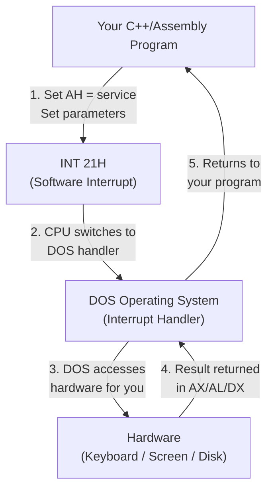

# Chapter 8 — C++ with DOS: INT 21H, Inline Assembly & Turbo C++

> **Course Code:** 3CS526CC23
> **Course Title:** Microprocessor and Interfacing [3 0 2 4]
> **Compiler:** Borland Turbo C++ 3.0 / Turbo C++ 4.5 (16-bit DOS mode)
> **Assembler:** TASM (Turbo Assembler) — used for external assembly modules
> **Environment:** DOS (Disk Operating System) 16-bit real mode

---

## 1. What is DOS and Why INT 21H?

### The DOS Operating System
DOS (Disk Operating System) is a 16-bit real-mode operating system that provides services to programs through **software interrupts**. When a program needs to do I/O (read keyboard, display text, open a file), it does NOT directly access hardware — it calls DOS through a standardized **interrupt interface**.



### The INT 21H Mechanism
To use a DOS service:
1. Load **service number** into `AH`
2. Load any required **parameters** into specified registers
3. Execute `INT 21H`
4. Read the **result** from registers (usually `AX` or `AL`)

```assembly
; Generic pattern:
MOV AH, <service_number>   ; Select which DOS function
; ... set other registers as required ...
INT 21H                     ; Call DOS
; ... read result from AX, AL, BX, etc ...
```

---

## 2. Complete INT 21H Service Table

### ⭐ Exam-Critical Services

| AH | Service Name | Input Parameters | Output | Description |
|:---:|:---|:---|:---|:---|
| `01H` | **Read Char w/ Echo** | None | `AL = ASCII char` | Waits for keypress, displays it, returns ASCII code |
| `02H` | **Display Char** | `DL = ASCII char` | None | Prints single character to console |
| `05H` | **Print Char** | `DL = ASCII char` | None | Sends character to printer (LPT1) |
| `06H` | **Direct Console I/O** | `DL = char` (or `FFH` for read) | `AL = char` if read | Raw I/O without echo or interrupt check |
| `07H` | **Read Char No Echo** | None | `AL = ASCII char` | Like 01H but does NOT echo character |
| `08H` | **Read Char No Echo** | None | `AL = ASCII char` | Like 07H but checks for Ctrl-Break |
| `09H` | **Display String** | `DS:DX → '$'-terminated string` | None | Prints string until `$` character |
| `0AH` | **Buffered Input** | `DS:DX → input buffer` | Buffer filled | Reads entire line into buffer |
| `0BH` | **Check Stdin Status** | None | `AL = FFH` if char ready, `00H` if not | Non-blocking check |
| `0CH` | **Flush + Read** | `AL = input fn (01/06/07/08/0A)` | Per function | Flushes keyboard buffer then reads |
| `25H` | **Set Interrupt Vector** | `AL = int#, DS:DX → handler` | None | Installs new interrupt handler |
| `35H` | **Get Interrupt Vector** | `AL = int#` | `ES:BX → handler` | Reads current interrupt vector |
| `2CH` | **Get System Time** | None | `CH=hr, CL=min, DH=sec, DL=1/100s` | Read system clock |
| `2AH` | **Get System Date** | None | `CX=year, DH=month, DL=day, AL=weekday` | Read system date |
| `4AH` | **Resize Memory Block** | `BX = new paragraphs, ES = segment` | None | Resize DOS memory allocation |
| `4CH` | **Exit to DOS** | `AL = exit code (0=success)` | Program ends | **Terminate program — used in EVERY program!** |

### File I/O Services

| AH | Service | Input | Output |
|:---:|:---|:---|:---|
| `3CH` | **Create File** | `DS:DX → filename, CX = attributes` | `AX = file handle` or error |
| `3DH` | **Open File** | `DS:DX → filename, AL = mode (0=read,1=write,2=both)` | `AX = file handle` |
| `3EH` | **Close File** | `BX = file handle` | None |
| `3FH` | **Read File** | `BX = handle, CX = bytes, DS:DX → buffer` | `AX = bytes read` |
| `40H` | **Write File** | `BX = handle, CX = bytes, DS:DX → data` | `AX = bytes written` |
| `41H` | **Delete File** | `DS:DX → filename` | CF=1 if error |
| `42H` | **Seek (LSEEK)** | `BX = handle, CX:DX = offset, AL = method (0=from start)` | `DX:AX = new position` |
| `56H` | **Rename File** | `DS:DX → old, ES:DI → new` | CF=1 if error |

> [!IMPORTANT]
> When `INT 21H` returns, always check the **Carry Flag (CF)**:
> - `CF = 0` → Success
> - `CF = 1` → Error, error code in `AX`

---

## 3. ASCII and Special Characters Reference

Understanding ASCII is essential for INT 21H character operations:

| Character | ASCII (Dec) | ASCII (Hex) | Notes |
|:---:|:---:|:---:|:---|
| `NUL` | 0 | `00H` | String terminator in C |
| `BEL` | 7 | `07H` | Terminal bell sound |
| `BS` | 8 | `08H` | Backspace |
| `TAB` | 9 | `09H` | Horizontal tab |
| `LF` | 10 | `0AH` | Line Feed (newline on Unix) |
| `CR` | 13 | `0DH` | Carriage Return |
| `ESC` | 27 | `1BH` | Escape key |
| `Space` | 32 | `20H` | Space character |
| `0`–`9` | 48–57 | `30H`–`39H` | Digit characters |
| `A`–`Z` | 65–90 | `41H`–`5AH` | Uppercase letters |
| `a`–`z` | 97–122 | `61H`–`7AH` | Lowercase letters |
| `$` | 36 | `24H` | DOS string terminator |

**Key Conversions:**
```
digit char → int:    AL - '0'  (e.g., '5' - '0' = 05H → 5)
int → digit char:    AL + '0'  (e.g., 7 + '0' = 37H → '7')
uppercase → lower:   OR  AL, 20H  (set bit 5)
lowercase → upper:   AND AL, DFH  (clear bit 5)
```

---

## 4. Inline Assembly in Turbo C++

Turbo C++ allows embedding assembly code directly inside C++ functions using the `asm` keyword (or `__asm`).

### Syntax Options

```cpp
// Option 1: Single statement
asm MOV AX, 0;

// Option 2: Block of statements (preferred)
asm {
    MOV AH, 09H
    LEA DX, myString
    INT 21H
}

// Option 3: Using __asm (ANSI-compatible alternative)
__asm {
    MOV AX, 4C00H
    INT 21H
}
```

### Accessing C++ Variables from Inline Assembly

```cpp
int myVar = 100;
char myChar = 'A';

asm {
    MOV AX, myVar       // Load C++ int variable into AX
    MOV BL, myChar      // Load C++ char variable into BL
    MOV myVar, AX       // Store AX back into C++ variable
}
```

> [!WARNING]
> - Do NOT use segment registers (`DS`, `ES`) in Turbo C++ inline assembly carelessly — Turbo C++ manages them. Modifying `CS`, `DS`, `SS` can crash the program.
> - The `BP` register is the **frame pointer** for C++ functions — NEVER modify BP in inline assembly inside a function.

---

## 5. Complete Programs — Pure TASM Assembly (DOS)

### Program 1: Hello World using INT 21H (AH=09H)

```assembly
; Hello World: Display a string using INT 21H service 09H
; Assemble with TASM, Link with TLINK

DATA SEGMENT
    MESSAGE DB 'Hello, World!', 0DH, 0AH, '$'
    ; 0DH = Carriage Return (CR), 0AH = Line Feed (LF), '$' = string terminator
DATA ENDS

CODE SEGMENT
    ASSUME CS:CODE, DS:DATA
START:
    MOV AX, DATA        ; Initialize Data Segment
    MOV DS, AX

    MOV AH, 09H         ; DOS Service 09H: Display String
    LEA DX, MESSAGE     ; DS:DX → string starting address
    INT 21H             ; Call DOS — prints until '$'

    MOV AH, 4CH         ; DOS Service 4CH: Exit to DOS
    MOV AL, 00H         ; Exit code 0 = success
    INT 21H
CODE ENDS
END START
```

**Explanation:**
- `LEA DX, MESSAGE` loads the **offset address** of `MESSAGE` into `DX`
- INT 21H / AH=09H prints all characters from `DS:DX` until it finds `$`
- `0DH, 0AH` = CR+LF = moves cursor to start of next line (DOS newline)

---

### Program 2: Read a Single Character (AH=01H)

```assembly
; Read one character from keyboard and display its ASCII code in hex
DATA SEGMENT
    PROMPT  DB 'Press any key: $'
    NEWLINE DB 0DH, 0AH, '$'
    MSG_HEX DB 'ASCII Hex: xx$'
    HEX_POS EQU MSG_HEX + 11     ; Offset of 'xx' in MSG_HEX
DATA ENDS

CODE SEGMENT
    ASSUME CS:CODE, DS:DATA
START:
    MOV AX, DATA
    MOV DS, AX

    ; Display prompt
    MOV AH, 09H
    LEA DX, PROMPT
    INT 21H

    ; Read character
    MOV AH, 01H         ; Service 01H: Read character WITH echo
    INT 21H             ; AL = ASCII code of pressed key
    MOV BL, AL          ; Save ASCII code in BL

    ; Move to new line
    MOV AH, 09H
    LEA DX, NEWLINE
    INT 21H

    ; Convert AL to hex string (high nibble)
    MOV AL, BL
    SHR AL, 4           ; Get upper 4 bits
    ADD AL, '0'         ; Convert to ASCII digit
    CMP AL, '9' + 1     ; Is it A-F?
    JB  STORE_HIGH
    ADD AL, 7           ; Adjust for A-F ('A' = 41H, '9'+1+7 = 41H)
STORE_HIGH:
    MOV [HEX_POS], AL   ; Store high hex digit

    ; Convert low nibble
    MOV AL, BL
    AND AL, 0FH         ; Get lower 4 bits
    ADD AL, '0'
    CMP AL, '9' + 1
    JB  STORE_LOW
    ADD AL, 7
STORE_LOW:
    MOV [HEX_POS + 1], AL  ; Store low hex digit

    ; Display hex result
    MOV AH, 09H
    LEA DX, MSG_HEX
    INT 21H

    MOV AH, 4CH
    INT 21H
CODE ENDS
END START
```

---

### Program 3: Display a Character (AH=02H)

```assembly
; Display 'A' through 'Z' using INT 21H Service 02H
CODE SEGMENT
    ASSUME CS:CODE, DS:CODE
START:
    MOV AX, CODE
    MOV DS, AX

    MOV CX, 26          ; 26 letters (A-Z)
    MOV DL, 'A'         ; Start with 'A' (41H)

PRINT_LOOP:
    MOV AH, 02H         ; Service 02H: Display character in DL
    INT 21H             ; Print character
    INC DL              ; Next letter
    LOOP PRINT_LOOP     ; CX--, repeat 26 times

    ; Print newline
    MOV AH, 02H
    MOV DL, 0DH         ; CR
    INT 21H
    MOV DL, 0AH         ; LF
    INT 21H

    MOV AH, 4CH
    INT 21H
CODE ENDS
END START
```

---

### Program 4: Buffered Keyboard Input (AH=0AH) — Read a Full String

```assembly
; Read a line of text from keyboard using INT 21H Service 0AH
DATA SEGMENT
    ; Buffer structure for Service 0AH:
    ; Byte 0: Maximum characters to read (includes CR)
    ; Byte 1: Actual characters read (filled by DOS)
    ; Byte 2+: The characters themselves
    IN_BUFFER DB 20          ; Max 20 chars
              DB  0          ; Actual count (filled by DOS)
              DB 20 DUP(?)   ; Character storage

    PROMPT    DB 'Enter your name: $'
    GREET     DB 'Hello, $'
    NEWLINE   DB 0DH, 0AH, '$'
DATA ENDS

CODE SEGMENT
    ASSUME CS:CODE, DS:DATA
START:
    MOV AX, DATA
    MOV DS, AX

    ; Display prompt
    MOV AH, 09H
    LEA DX, PROMPT
    INT 21H

    ; Read buffered input
    MOV AH, 0AH         ; Service 0AH: Buffered input
    LEA DX, IN_BUFFER   ; DS:DX → buffer
    INT 21H             ; Fills buffer; user presses Enter to end

    ; Move to new line (DOS does NOT add newline after 0AH input)
    MOV AH, 09H
    LEA DX, NEWLINE
    INT 21H

    ; Display "Hello, "
    MOV AH, 09H
    LEA DX, GREET
    INT 21H

    ; Display the entered name (terminated with '$' substitute)
    ; IN_BUFFER + 1 = count byte; IN_BUFFER + 2 = actual text
    MOV BX, OFFSET IN_BUFFER + 2   ; BX → first character
    MOV AL, [OFFSET IN_BUFFER + 1] ; AL = number of chars entered
    XOR AH, AH
    ADD BX, AX                      ; BX → byte AFTER last char
    MOV BYTE PTR [BX], '$'          ; Append '$' terminator

    MOV AH, 09H
    LEA DX, IN_BUFFER + 2           ; Print from char[0]
    INT 21H

    MOV AH, 4CH
    INT 21H
CODE ENDS
END START
```

---

### Program 5: Check If Character is Uppercase/Lowercase

```assembly
; Read a character; determine if uppercase, lowercase, or other
DATA SEGMENT
    UPPER_MSG DB 'Uppercase letter', 0DH, 0AH, '$'
    LOWER_MSG DB 'Lowercase letter', 0DH, 0AH, '$'
    OTHER_MSG DB 'Not a letter',     0DH, 0AH, '$'
    PROMPT    DB 'Enter a character: $'
DATA ENDS

CODE SEGMENT
    ASSUME CS:CODE, DS:DATA
START:
    MOV AX, DATA
    MOV DS, AX

    MOV AH, 09H
    LEA DX, PROMPT
    INT 21H

    MOV AH, 01H         ; Read char with echo
    INT 21H             ; AL = character

    ; Check if uppercase: 'A' (41H) to 'Z' (5AH)
    CMP AL, 'A'
    JB  NOT_UPPER
    CMP AL, 'Z'
    JA  NOT_UPPER
    ; Falls through: uppercase
    MOV AH, 09H
    LEA DX, UPPER_MSG
    INT 21H
    JMP DONE

NOT_UPPER:
    ; Check if lowercase: 'a' (61H) to 'z' (7AH)
    CMP AL, 'a'
    JB  NOT_LOWER
    CMP AL, 'z'
    JA  NOT_LOWER
    ; Falls through: lowercase
    MOV AH, 09H
    LEA DX, LOWER_MSG
    INT 21H
    JMP DONE

NOT_LOWER:
    MOV AH, 09H
    LEA DX, OTHER_MSG
    INT 21H

DONE:
    MOV AH, 4CH
    INT 21H
CODE ENDS
END START
```

---

### Program 6: Display a Number in Decimal (BCD Conversion)

```assembly
; Display a 16-bit number in AX as decimal digits
; Algorithm: repeatedly divide by 10, push remainders, then print in reverse

DATA SEGMENT
    NUM DW 1234H        ; Number to display (= 4660 decimal)
DATA ENDS

CODE SEGMENT
    ASSUME CS:CODE, DS:DATA
DISPLAY_DEC PROC NEAR
    ; Input: AX = number to display
    ; Pushes digit chars onto stack, then pops and prints
    MOV BX, 10         ; Divisor = 10
    MOV CX, 0          ; Digit count = 0

    ; Edge case: if AX = 0, print '0' directly
    CMP AX, 0
    JNE DIVIDE_LOOP
    MOV AH, 02H
    MOV DL, '0'
    INT 21H
    RET

DIVIDE_LOOP:
    XOR DX, DX         ; DX:AX = AX (zero-extend for unsigned div)
    DIV BX             ; AX = quotient, DX = remainder (0-9)
    ADD DX, '0'        ; Convert remainder to ASCII digit
    PUSH DX            ; Push digit char onto stack (print in reverse later)
    INC CX             ; Count digits
    CMP AX, 0          ; More digits?
    JNE DIVIDE_LOOP    ; Continue if quotient != 0

    ; Pop and print digits (they come out in correct order: MSD first)
PRINT_LOOP:
    POP DX             ; DX = digit char
    MOV AH, 02H        ; Service 02H: print char
    INT 21H
    LOOP PRINT_LOOP    ; CX--, print all digits

    RET
DISPLAY_DEC ENDP

START:
    MOV AX, DATA
    MOV DS, AX

    MOV AX, NUM        ; Load number
    CALL DISPLAY_DEC   ; Display as decimal

    MOV AH, 4CH
    INT 21H
CODE ENDS
END START
```

---

## 6. Inline Assembly in Turbo C++ — Complete Programs

### Program 7: Hello World from Turbo C++ with Inline Assembly

```cpp
// File: hello_asm.cpp
// Compile: Turbo C++ (tcc hello_asm.cpp) or Borland C++ IDE

#include <stdio.h>

int main() {
    // Method 1: Using standard C++ I/O
    printf("Hello from C++\n");

    // Method 2: Using inline assembly and DOS INT 21H
    // The string must be terminated with '$' for DOS service 09H
    char msg[] = "Hello from inline assembly!\r\n$";

    asm {
        MOV AH, 09H         // Service 09H: display string
        LEA DX, msg         // DS:DX → our string
        INT 21H             // Call DOS
    }

    return 0;
}
```

---

### Program 8: Reading a Character in Turbo C++ with Inline Assembly

```cpp
// File: readchar.cpp
// Reads a character using INT 21H and displays its ASCII value

#include <stdio.h>

int main() {
    unsigned char ch;

    printf("Press any key: ");

    // Read character using DOS INT 21H (without echo, service 07H)
    asm {
        MOV AH, 07H     // Service 07H: read char, no echo
        INT 21H         // AL = ASCII code of pressed key
        MOV ch, AL      // Save to C++ variable
    }

    printf("\nYou pressed: '%c' (ASCII = %d, Hex = %02XH)\n", ch, ch, ch);

    return 0;
}
```

---

### Program 9: Case Conversion Using Inline Assembly in C++

```cpp
// File: case_conv.cpp
// Reads a char; converts uppercase→lowercase or lowercase→uppercase

#include <stdio.h>

char convertCase(char c) {
    char result;
    asm {
        MOV AL, c          // Load character
        CMP AL, 'A'        // Is it >= 'A'?
        JB  NOT_UPPER
        CMP AL, 'Z'        // Is it <= 'Z'?
        JA  NOT_UPPER
        OR  AL, 20H        // Set bit 5: uppercase → lowercase
        JMP STORE_RESULT
    NOT_UPPER:
        CMP AL, 'a'
        JB  NOT_LOWER
        CMP AL, 'z'
        JA  NOT_LOWER
        AND AL, 0DFH       // Clear bit 5: lowercase → uppercase
        JMP STORE_RESULT
    NOT_LOWER:
        // Not a letter — keep unchanged
    STORE_RESULT:
        MOV result, AL     // Store converted char to C++ variable
    }
    return result;
}

int main() {
    printf("convertCase('A') = '%c'\n", convertCase('A')); // → 'a'
    printf("convertCase('z') = '%c'\n", convertCase('z')); // → 'Z'
    printf("convertCase('5') = '%c'\n", convertCase('5')); // → '5'
    return 0;
}
```

---

### Program 10: Array Sum Using Inline Assembly in C++

```cpp
// File: array_sum.cpp
// Sums an integer array using inline 8086 assembly

#include <stdio.h>

int arraySum(int *arr, int n) {
    // Returns sum of first n elements of arr[]
    // In real mode Turbo C++, int = 16-bit, int* = near pointer (offset only)
    int sum = 0;
    asm {
        LEA  SI, arr       // SI → pointer variable (holds array offset)
        MOV  SI, [SI]      // SI = actual array offset (dereference pointer)
        MOV  CX, n         // CX = count
        XOR  AX, AX        // AX = running sum = 0
        JCXZ DONE          // Skip if n = 0 (avoid 65536 iterations!)
    SUM_LOOP:
        ADD  AX, [SI]      // AX += arr[i] (16-bit word)
        ADD  SI, 2         // SI += 2 (next int = 2 bytes in 16-bit mode)
        LOOP SUM_LOOP      // CX--, repeat
    DONE:
        MOV  sum, AX       // Store sum in C++ variable
    }
    return sum;
}

int main() {
    int data[] = {10, 20, 30, 40, 50};
    int result = arraySum(data, 5);
    printf("Sum = %d\n", result);  // Should print: Sum = 150
    return 0;
}
```

---

## 7. Calling External TASM Procedures from Turbo C++

For larger projects, you can write performance-critical code in a separate `.asm` file and call it from C++.

### 7.1 The TASM Module (`mathlib.asm`)

```assembly
; File: mathlib.asm
; TASM module — exports COMPUTE_PRODUCT for use by C++

PUBLIC _COMPUTE_PRODUCT   ; Export with underscore (Turbo C++ convention)

CODE SEGMENT BYTE PUBLIC 'CODE'
    ASSUME CS:CODE

; int _COMPUTE_PRODUCT(int a, int b);
; Calling convention: NEAR, parameters pushed RIGHT-TO-LEFT by C++
; Stack on entry:  [SP+0]=return IP, [SP+2]=a, [SP+4]=b

_COMPUTE_PRODUCT PROC NEAR
    PUSH BP
    MOV  BP, SP              ; Establish stack frame

    MOV  AX, [BP + 4]        ; AX = parameter 'a' (first arg)
    IMUL WORD PTR [BP + 6]   ; DX:AX = AX * b; for 16-bit result: AX = low word

    ; Return value: integer in AX (Turbo C++ convention)
    POP  BP
    RET                      ; Near return
_COMPUTE_PRODUCT ENDP

CODE ENDS
END
```

### 7.2 The C++ Caller (`main.cpp`)

```cpp
// File: main.cpp
// Links with mathlib.obj

// Declare the external assembly function
// Turbo C++ looks for '_COMPUTE_PRODUCT' (with underscore) in .obj
extern "C" int COMPUTE_PRODUCT(int a, int b);

#include <stdio.h>

int main() {
    int result = COMPUTE_PRODUCT(12, 25);
    printf("12 × 25 = %d\n", result);   // Output: 12 × 25 = 300

    result = COMPUTE_PRODUCT(-3, 7);
    printf("-3 × 7 = %d\n", result);    // Output: -3 × 7 = -21

    return 0;
}
```

### 7.3 Build Commands (DOS Prompt)

```
TASM mathlib.asm          ; Assemble → mathlib.obj
TCC main.cpp mathlib.obj  ; Compile + Link → main.exe
```

---

### 7.4 Name Mangling Rule (Critical!)
Turbo C++ prepends an **underscore `_`** to all C function/variable names when generating object code:

| C++ Declaration | Exported Name in Object File |
|:---|:---|
| `int myFunc()` | `_myFunc` |
| `extern "C" int compute()` | `_compute` |
| `int globalVar` | `_globalVar` |

So in TASM, you must declare `PUBLIC _myFunc` (with underscore) to match what Turbo C++ expects.

---

## 8. File I/O Example — Create and Write a Text File

```assembly
; Create a text file and write "Hello File" to it

DATA SEGMENT
    FILENAME DB 'OUTPUT.TXT', 0     ; ASCIIZ filename (null-terminated!)
    TEXT_DATA DB 'Hello File', 0DH, 0AH
    TEXT_LEN  EQU $ - TEXT_DATA
    HANDLE    DW ?                  ; File handle storage
DATA ENDS

CODE SEGMENT
    ASSUME CS:CODE, DS:DATA
START:
    MOV AX, DATA
    MOV DS, AX

    ; === Create file ===
    MOV AH, 3CH         ; Service 3CH: Create file
    LEA DX, FILENAME    ; DS:DX → filename (null-terminated)
    MOV CX, 0000H       ; Attributes: Normal file (0=normal, 1=read-only, 2=hidden)
    INT 21H
    JC  CREATE_ERROR    ; CF=1 → error
    MOV HANDLE, AX      ; Save file handle

    ; === Write to file ===
    MOV AH, 40H         ; Service 40H: Write to file
    MOV BX, HANDLE      ; BX = file handle
    MOV CX, TEXT_LEN    ; CX = number of bytes to write
    LEA DX, TEXT_DATA   ; DS:DX → data buffer
    INT 21H
    JC  WRITE_ERROR     ; CF=1 → write error

    ; === Close file ===
    MOV AH, 3EH         ; Service 3EH: Close file
    MOV BX, HANDLE
    INT 21H

    JMP DONE

CREATE_ERROR:
    ; AX contains error code (e.g., 05H = access denied, 03H = path not found)
WRITE_ERROR:
    ; Handle error (display message etc.)
DONE:
    MOV AH, 4CH
    INT 21H
CODE ENDS
END START
```

---

## 9. Common INT 21H Patterns — Quick Reference

```assembly
; ─── Print a single character ─────────────────────────────────────
MOV AH, 02H
MOV DL, 'A'
INT 21H

; ─── Print a newline (CR + LF) ───────────────────────────────────
MOV AH, 02H
MOV DL, 0DH       ; Carriage Return
INT 21H
MOV AH, 02H
MOV DL, 0AH       ; Line Feed
INT 21H

; ─── Print a string (must end with '$') ──────────────────────────
DATA SEGMENT
    STR DB 'My String', 0DH, 0AH, '$'
DATA ENDS
; ...
MOV AH, 09H
LEA DX, STR       ; DS:DX → string
INT 21H

; ─── Read a character (with echo) ────────────────────────────────
MOV AH, 01H
INT 21H
; AL = character read

; ─── Read a character (without echo) ─────────────────────────────
MOV AH, 07H
INT 21H
; AL = character read

; ─── Exit program cleanly ─────────────────────────────────────────
MOV AH, 4CH
MOV AL, 00H       ; Return code 0 = success
INT 21H

; ─── Get system time ──────────────────────────────────────────────
MOV AH, 2CH
INT 21H
; CH = hours, CL = minutes, DH = seconds, DL = hundredths

; ─── Print a digit (0-9) ─────────────────────────────────────────
MOV AH, 02H
MOV DL, AL        ; AL contains digit 0-9
ADD DL, '0'       ; Convert to ASCII
INT 21H
```

---

## 10. Exam-Oriented Review — 10 Questions

**Q1.** What register must contain the service number before calling `INT 21H`?

> **Answer:** The **AH register** always holds the DOS service number. For example, `AH = 09H` for "display string", `AH = 01H` for "read character", `AH = 4CH` for "exit to DOS".

**Q2.** What is the string terminator character required by `INT 21H / AH=09H`?

> **Answer:** The **`$` character** (ASCII `24H = 36` decimal). The string must end with `$`. DOS service 09H prints characters from `DS:DX` until it encounters a `$`.

**Q3.** Write the assembly code to print "HELLO" using INT 21H.

> **Answer:**
> ```assembly
> DATA SEGMENT
>     MSG DB 'HELLO', '$'
> DATA ENDS
> CODE SEGMENT
>     ASSUME CS:CODE, DS:DATA
> START:
>     MOV AX, DATA
>     MOV DS, AX
>     MOV AH, 09H
>     LEA DX, MSG
>     INT 21H
>     MOV AH, 4CH
>     INT 21H
> CODE ENDS
> END START
> ```

**Q4.** What is the purpose of `MOV AH, 4CH` followed by `INT 21H`?

> **Answer:** This is the **DOS program termination** call. Service `4CH` exits the current program and returns control to DOS. The value in `AL` becomes the **exit code** (0 = success, non-zero = error). Every assembly program MUST end with this or the CPU will fall through into random memory.

**Q5.** How does `INT 21H / AH=01H` differ from `AH=07H`?

> **Answer:** Both read a single character from the keyboard. Service `01H` **echoes** the character to the screen before returning it in `AL`. Service `07H` reads WITHOUT echoing — useful for password input or menus where you don't want the key displayed.

**Q6.** In a Turbo C++ program, you write `asm { MOV AH, 09H; LEA DX, msg; INT 21H }`. What does this do?

> **Answer:** It calls DOS service 09H (Display String). `LEA DX, msg` loads the offset address of the C++ character array `msg` into `DX`. DOS then prints from `DS:DX` until it finds a `$` character. The `DS` register already points to the C++ program's data segment (Turbo C++ manages this).

**Q7.** What does the Carry Flag (CF) indicate after a file operation INT 21H call?

> **Answer:** `CF = 0` → Operation succeeded. `CF = 1` → Operation failed, and `AX` contains a **DOS error code** (e.g., `02H` = file not found, `05H` = access denied, `03H` = path not found).

**Q8.** Write TASM code to read a character and convert lowercase to uppercase.

> **Answer:**
> ```assembly
> MOV AH, 01H     ; Read character → AL
> INT 21H
> CMP AL, 'a'
> JB  DONE        ; Not lowercase
> CMP AL, 'z'
> JA  DONE        ; Not lowercase
> AND AL, 0DFH    ; Clear bit 5: lowercase → uppercase
> DONE:
> MOV AH, 02H     ; Display result
> MOV DL, AL
> INT 21H
> ```

**Q9.** What is the difference between `INT 21H / AH=02H` and `AH=09H`?

> **Answer:** `AH=02H` prints a **single character** stored in `DL`. `AH=09H` prints a **string** pointed to by `DS:DX`, scanning until it finds `$`. Use 02H in a loop to print one character at a time; use 09H to print an entire string efficiently.

**Q10.** Why must TASM external procedures start with an underscore `_` when called from Turbo C++?

> **Answer:** Turbo C++ (and most Borland compilers) automatically prepend an underscore `_` to all C-language identifiers in the object file (this is called **name decoration**). So a C function `myFunc()` is stored as `_myFunc` in the `.obj`. To link a TASM routine that Turbo C++ will call, you must declare it with `PUBLIC _myFunc` in the assembly source to match the name Turbo C++ expects.

---

## Summary — INT 21H Quick Reference Card

```
╔═══════════════════════════════════════════════════════════════╗
║                INT 21H SERVICES — QUICK CARD                  ║
╠══════╦═══════════════════════╦═══════════════════════════════╣
║  AH  ║ Service               ║ Key Parameters / Returns       ║
╠══════╬═══════════════════════╬═══════════════════════════════╣
║ 01H  ║ Read Char (echo)      ║ → AL = char                    ║
║ 02H  ║ Display Char          ║ DL = char                      ║
║ 07H  ║ Read Char (no echo)   ║ → AL = char                    ║
║ 09H  ║ Display String        ║ DS:DX → '$'-terminated string  ║
║ 0AH  ║ Buffered Input        ║ DS:DX → buffer struct          ║
║ 2AH  ║ Get Date              ║ → CX=year, DH=month, DL=day    ║
║ 2CH  ║ Get Time              ║ → CH=hr, CL=min, DH=sec        ║
║ 3CH  ║ Create File           ║ DS:DX→name, CX=attr → AX=handle║
║ 3DH  ║ Open File             ║ DS:DX→name, AL=mode → AX=handle║
║ 3EH  ║ Close File            ║ BX = handle                    ║
║ 3FH  ║ Read File             ║ BX=handle, CX=bytes, DS:DX→buf ║
║ 40H  ║ Write File            ║ BX=handle, CX=bytes, DS:DX→buf ║
║ 4CH  ║ Exit to DOS           ║ AL = exit code (0 = OK)        ║
╚══════╩═══════════════════════╩═══════════════════════════════╝
```
