# Microprocessors & Interfacing Notes

> **Course Code:** 3CS526CC23  
> **Course Title:** Microprocessor and Interfacing [3 0 2 4]  
> **Governing Standard:** `skills.md` (Comprehensive Chapter Notes Generator)  
> **Primary Source:** Faculty Lecture Presentations & University Reference Documents  
> **Files Integrated:** `3CS526CC23 Introduction.pdf`, `8085 PPT.pdf`, `3CS526CC23 8086 Architecture part 1.pdf`, `3CS526CC23 8086 Architecture.pdf`, `8086_instruction_set_Basic.pdf`  

---

# Chapter 1 — Introduction & Assembly Language

## Source map

- `3CS526CC23 Introduction.pdf` — primary faculty lecture material.
- `8085 PPT.pdf` — primary faculty lecture material.
- `3CS526CC23 8086 Architecture part 1.pdf` — primary faculty lecture material.
- `3CS526CC23 8086 Architecture.pdf` — primary faculty lecture material.
- `8086_instruction_set_Basic.pdf` — primary reference document.

---

## 1. Chapter Overview
This chapter establishes the core architectural foundations of microprocessors, fundamental computing terminology, the historical evolution of Intel microprocessors, assembly language design principles, assembly development toolchains, and practical laboratory applications as specified in the university curriculum.

---

## 2. Fundamental Concepts & Terminology

### Definition: Microprocessor
**Meaning:** A microprocessor is a multipurpose, clock-driven, register-based, programmable Integrated Circuit (IC) that reads binary instructions from memory, accepts binary data as input, processes data according to instructions, and outputs the result.  
**Formal Definition:** An integrated single-chip Central Processing Unit (CPU) containing an Arithmetic Logic Unit (ALU), internal register arrays, hardwired control logic, and bus interfacing circuitry. [Source: 8085 PPT, Slide 10]  
**Intuition:** The central execution engine of a computer system that executes instructions sequentially by fetching binary opcodes from memory and operating on high-speed internal registers.  

---

### Core Terminology Dictionary

1. **Bit (Binary Digit):** The smallest unit of digital data, representing binary logic state `0` or `1`.
2. **Byte:** A 8-bit sequence of binary data. Memory in 8085 and 8086 microprocessors is organized as byte-addressable memory storage.
3. **Word:** The natural data processing word size of a processor architecture.
   - For 8-bit processors (8085): 1 Word = 8 bits (1 byte).
   - For 16-bit processors (8086): 1 Word = 16 bits (2 bytes).
4. **Doubleword (DWORD):** A 32-bit data block consisting of 4 bytes (2 words).
5. **Bus System:** A group of parallel conducting wires used to transfer electrical signals between CPU, memory, and peripheral controllers.
   - **Data Bus:** Bidirectional lines used to transmit data operands and instruction bytes. Bus width determines CPU data processing capacity (e.g., 8-bit in 8085, 16-bit in 8086).
   - **Address Bus:** Unidirectional lines driven exclusively by CPU to select physical memory addresses or peripheral I/O ports. Bus width $N$ determines maximum addressable memory space ($2^N$ bytes).
   - **Control Bus:** Control and status signal lines emitted or monitored by CPU to synchronize data transfers (e.g., $\overline{\text{RD}}$, $\overline{\text{WR}}$, $\text{IO}/\overline{\text{M}}$, $\text{ALE}$).
6. **Clock Speed:** The master clock frequency generated by a crystal oscillator to synchronize internal micro-operations, measured in MHz.
7. **T-State (Timing State):** One clock cycle period ($T = \frac{1}{f}$). It is the atomic unit of internal CPU timing.
8. **Machine Cycle:** The time taken by CPU to execute one fundamental bus transaction (e.g., Opcode Fetch, Memory Read, Memory Write, I/O Read, I/O Write). Composed of 3 to 6 T-states.
9. **Instruction Cycle:** The total elapsed time to fetch, decode, and execute a complete instruction. Composed of one or more machine cycles.
10. **Opcode (Operation Code):** The binary code or symbolic mnemonic specifying the machine operation to execute (e.g., `MOV`, `ADD`).
11. **Operand:** The target data item, register, or memory address manipulated by an opcode.

---

## 3. Evolution of Microprocessors

| Generation | Processor | Data Bus Width | Address Bus Width | Addressable Memory | Key Architectural Features |
| :--- | :--- | :--- | :--- | :--- | :--- |
| **1st Gen (1971–1973)** | Intel 4004, 8008 | 4-bit / 8-bit | 12-bit / 14-bit | 4 KB / 16 KB | PMOS technology, primitive calculator controllers, low execution speeds. |
| **2nd Gen (1974–1976)** | Intel 8080, 8085 | 8-bit | 16-bit | 64 KB | NMOS technology, single +5V supply (8085), hardware interrupts, integrated status signals. |
| **3rd Gen (1978–1982)** | Intel 8086, 8088, 80286 | 16-bit | 20-bit / 24-bit | 1 MB / 16 MB | HMOS, dual independent processing units (BIU + EU), 6-byte instruction prefetch queue, segmented memory. |
| **4th Gen (1985–1990s)**| Intel 80386, 80486 | 32-bit | 32-bit | 4 GB | Paged virtual memory, on-chip floating point unit (FPU), cache memory hierarchy. |
| **5th Gen to Present** | Pentium, Core i-series, Xeon | 64-bit | 36-bit to 52-bit | Terabytes ($2^{64}$) | Superscalar execution, multi-core processing, out-of-order execution, hyper-threading. |

[Source: 8085 PPT, Slide 11]

---

## 4. Features of Assembly Language Programming

Assembly language operates at the boundary between human-readable software logic and physical CPU hardware.

### Key Characteristics & Architectural Properties

1. **Machine Dependent:** Programs are custom-architected for a specific CPU Instruction Set Architecture (ISA). Assembly written for 8085 or 8086 will not execute on ARM or MIPS CPUs.
2. **Low-Level Language:** Direct 1-to-1 mapping between symbolic assembly instructions and machine language binary opcodes.
3. **Mnemonic Instructions:** Uses human-readable alphanumeric strings (`MOV`, `ADD`, `SUB`, `JMP`) in place of raw binary or hexadecimal machine codes.
4. **Execution Speed:** Produces hyper-optimized machine binaries executing at maximum hardware speed with zero runtime interpretation overhead.
5. **Direct Register & Memory Control:** Enables granular, byte-level manipulation of CPU registers, stack memory frames, and hardware control flags.
6. **Direct Hardware Interfacing:** Provides unimpeded access to peripheral I/O ports, interrupt lines, and memory-mapped hardware controllers.
7. **Non-Portable:** Code cannot be compiled across different CPU families without complete rewriting.
8. **Prerequisite Knowledge:** Demands thorough knowledge of CPU internals, register structures, memory segmentation, flag behaviors, and bus timing.

[Source: 3CS526CC23 Introduction, Slide 7]

---

## 5. Assembly Language Toolchain & Environments

1. **MASM (Microsoft Macro Assembler):** Professional x86 macro assembler optimized for Windows systems.
2. **NASM (Netwide Assembler):** Modular, cross-platform open-source assembler widely used for 16-bit, 32-bit, and 64-bit x86 software.
3. **TASM (Turbo Assembler):** Legacy Borland assembler standard in classic academic software development.
4. **DOSBox-X / EMU8086:** Emulation platforms providing real-mode 16-bit DOS environments to execute and debug 8086 assembly code on modern 64-bit operating systems.
5. **SASM (SimpleASM IDE):** Graphical cross-platform IDE supporting NASM/MASM with real-time register inspection panels, memory dump viewing, and step-by-step debugging.

[Source: 3CS526CC23 Introduction, Slide 8]

---

## 6. University Course Practical Matrix

| Lab No. | Title | Core Assembly Concepts & Practical Skills |
| :--- | :--- | :--- |
| **1** | SASM IDE & Basic Assembly | Exploring IDE commands (step, breakpoint, register watch, memory dump); writing `Hello World` and 16-bit addition programs. |
| **2** | Binary Arithmetic & Bit Logic | Performing 16-bit and 32-bit addition, subtraction, bitwise AND/OR/XOR, and multi-bit shift operations. |
| **3** | Machine Code Generation | Reverse-engineering assembly instructions (`MOV`) into binary machine codes via opcode templates and MOD-R/M bytes. |
| **4** | Array Processing & Sorting | Memory array traversal, extracting minimum/maximum values, implementing Bubble Sort algorithm using register indexing. |
| **5** | Data Conversion & String Case | Converting octal numbers to binary; manipulating ASCII strings (converting uppercase to lowercase and vice versa via bitwise logic). |
| **6** | String Reversal Procedures | Developing modular `NEAR` procedures with stack-based string pointer passing to reverse character arrays. |
| **7** | Statistical Analysis & Parity | Computing array summation and averages; counting set bits (`1`s) in an 8-bit byte; determining parity; string-to-integer conversion. |
| **8** | Substring Search | Pattern search within text buffers using modular `NEAR` procedures and index pointers. |
| **9** | Fibonacci Series Generation | Generating N Fibonacci terms using `FAR` procedures (`NASM PROC` equivalents) and stack memory. |
| **10** | Modular Checking & 8254 Timer | Multi-file modular checking (prime/odd/even); theoretical and practical study of 8254 Programmable Interval Timer IC. |

[Source: 3CS526CC23 Introduction, Slides 5–6]

---

# Chapter 2 — 8085 Microprocessor Architecture

## 1. Chapter Overview
This chapter presents a comprehensive technical study of the Intel 8085 8-bit microprocessor architecture. It details internal functional blocks, register structures, flag bit states, multiplexed bus operations, timing and status signals, pin functions, hardware interrupt processing, and peripheral interfacing with the 8259 Programmable Interrupt Controller.

---

## 2. Main Features of Intel 8085 Microprocessor

* **Processing Capacity:** 8-bit parallel data processing.
* **Power Supply:** Operates on a single $+5\text{V DC}$ supply ($V_{CC}$) relative to ground ($V_{SS}$).
* **Clock Frequency:** Basic clock frequency is $3\text{ MHz}$ (for 8085A) or $5\text{ MHz}$ (for 8085A-2). Generated using an external crystal connected across $X_1$ and $X_2$ pins (internal divide-by-2 circuit yields $3\text{ MHz}$ clock from a $6\text{ MHz}$ crystal).
* **Address Bus:** 16-bit total address capacity yielding $2^{16} = 64\text{ KB}$ ($65,536\text{ bytes}$) direct addressable physical memory space.
  - High-order address bus: $A_{15} - A_8$ (8-bit unidirectional).
  - Low-order address/data bus: $AD_7 - AD_0$ (8-bit bidirectional, time-multiplexed using $ALE$ signal).
* **Register Architecture:** Contains 12 addressable 8-bit registers. Four registers can function as 16-bit register pairs (BC, DE, HL, WZ). Six general registers (B, C, D, E, H, L) can be used individually as 8-bit registers or combined as 16-bit pairs.
* **Interrupt System:** Includes 5 hardware interrupts: 1 non-maskable (TRAP) and 4 maskable (RST 7.5, RST 6.5, RST 5.5, INTR).
* **Direct Memory Access (DMA):** Hardware support for high-speed DMA bus transfers using `HOLD` and `HOLDA` signal lines.
* **Serial I/O Lines:** Dedicated single-bit serial input (`SID`) and serial output (`SOD`) pins controlled directly via `RIM` and `SIM` software instructions.
* **Machine Status Indication:** Provides explicit status outputs ($IO/\overline{\text{M}}$, $S_0$, $S_1$) to indicate the type of active machine cycle.
* **Instruction Set:** Supports 80 primary machine instruction types (with 246 total opcodes).

[Source: 8085 PPT, Slide 12]

---

## 3. 8085 Internal Architecture

The internal functional architecture of the Intel 8085 consists of distinct operational blocks:

### Figure 2.1: 8085 Internal Architecture Block Diagram
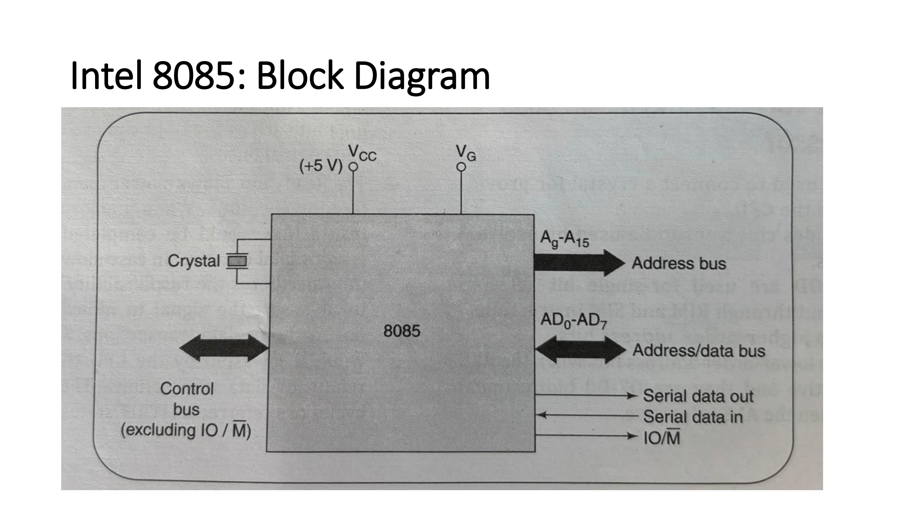

### Figure 2.2: 8085 Detailed Internal Functional Diagram
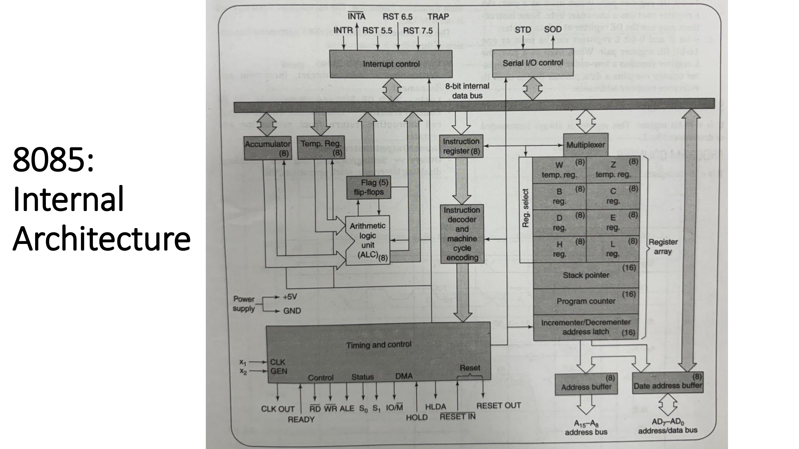

#### Written Analysis of 8085 Functional Components

1. **Arithmetic Logic Unit (ALU):** An 8-bit functional unit that performs binary arithmetic (ADD, SUB, INC, DEC) and logical operations (AND, OR, XOR, NOT, Rotate). Operates on operands supplied by the Accumulator and Temporary Register.
2. **Accumulator (Register A):** An 8-bit tri-state register connected directly to the internal data bus and ALU. Holds one of the source operands prior to ALU execution and stores the final execution result.
3. **Temporary Registers (W and Z):** Two internal 8-bit registers used exclusively by the control unit to hold 16-bit address bytes or temporary operands during instruction execution (e.g., `CALL`, `XCHG`). Completely hidden from the programmer.
4. **Flag Register:** An 8-bit status register containing 5 individual flip-flops that set or reset based on ALU execution results.
5. **General Purpose Registers (B, C, D, E, H, L):** Six 8-bit registers organized as arrays. Can be accessed as individual 8-bit registers or paired as 16-bit register pairs:
   - **BC Pair:** $B$ holds High byte, $C$ holds Low byte. Can serve as data pointer.
   - **DE Pair:** $D$ holds High byte, $E$ holds Low byte. Can serve as data pointer.
   - **HL Pair:** $H$ holds High byte, $L$ holds Low byte. Functions as the primary memory pointer ($M$). When memory location $M$ is referenced in an instruction, the CPU accesses the memory address specified by $HL$.
6. **Program Counter (PC):** A 16-bit register that stores the memory address of the next sequential instruction byte to be fetched. Automatically incremented as instruction bytes are fetched from memory.
7. **Stack Pointer (SP):** A 16-bit register pointing to the current memory address of the top of the stack in RAM. SP is decremented by 2 during `PUSH` / `CALL` operations and incremented by 2 during `POP` / `RET` operations.
8. **Instruction Register (IR) & Decoder:** An 8-bit non-programmable register that receives the instruction opcode fetched from memory. Holds the opcode while the Instruction Decoder decodes the binary pattern to generate micro-control signals.
9. **Timing and Control Unit:** Generates internal and external control signals ($\,\overline{\text{RD}}$, $\overline{\text{WR}}$, $\text{ALE}$, $\text{IO}/\overline{\text{M}}$, $S_0$, $S_1$) to synchronize data flow across address, data, and control buses.
10. **Interrupt Control Unit:** Manages priority resolution and response logic for external hardware interrupt signals (`TRAP`, `RST 7.5`, `RST 6.5`, `RST 5.5`, `INTR`).
11. **Serial I/O Control Unit:** Controls single-bit serial data reception (`SID`) and serial data transmission (`SOD`).

[Source: 8085 PPT, Slides 13, 20]

---

## 4. 8085 Register Organization

### Figure 2.3: 8085 Register Array Structure
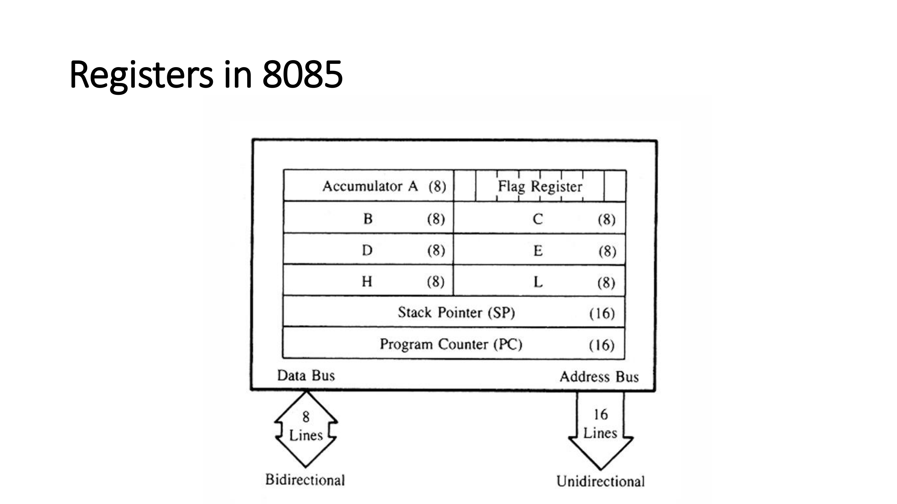

### Comprehensive 8085 Register Specifications

| Register Name | Bit Size | Functions & Special Characteristics | Important Operational Notes |
| :--- | :--- | :--- | :--- |
| **Accumulator (A)** | 8-bit | Primary operand storage for ALU; receives ALU output; target for I/O transfers. | Always implicit in arithmetic/logic instructions (e.g., `ADD B`). |
| **Flag Register (F)** | 8-bit | Contains 5 status flag flip-flops ($S, Z, AC, P, CY$). | Reflects status of recent ALU operation. |
| **B Register** | 8-bit | General purpose register; pairs with C as 16-bit BC pair. | Upper byte in BC pair. Used as generic loop counter. |
| **C Register** | 8-bit | General purpose register; pairs with B as 16-bit BC pair. | Lower byte in BC pair. |
| **D Register** | 8-bit | General purpose register; pairs with E as 16-bit DE pair. | Upper byte in DE pair. |
| **E Register** | 8-bit | General purpose register; pairs with D as 16-bit DE pair. | Lower byte in DE pair. |
| **H Register** | 8-bit | General purpose register; pairs with L as 16-bit HL pair. | Upper byte in HL pair. Primary high address pointer. |
| **L Register** | 8-bit | General purpose register; pairs with H as 16-bit HL pair. | Lower byte in HL pair. Primary low address pointer. |
| **Program Counter (PC)** | 16-bit | Points to memory location of next instruction byte to fetch. | Automatically incremented during fetch cycle. |
| **Stack Pointer (SP)** | 16-bit | Points to current Top-of-Stack memory address in RAM. | Decremented/Incremented by 2 during push/pop. |

[Source: 8085 PPT, Slides 21, 22]

---

## 5. 8085 Flag Register Details

### Figure 2.4: 8085 Flag Register Bit Format
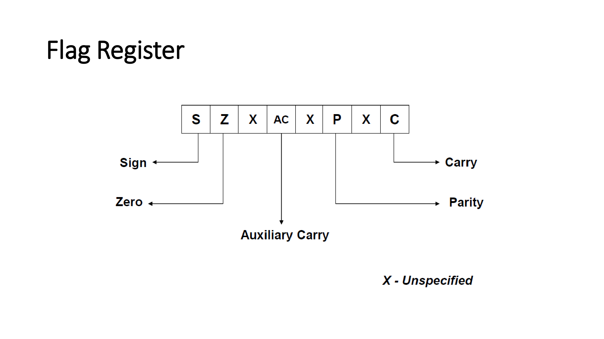

The 8-bit Flag register contains 5 active conditional status flags:

| Bit Position | Flag Name | Symbol | Description & Setting Condition |
| :--- | :--- | :--- | :--- |
| **$D_7$** | Sign Flag | **S** | Set to `1` if MSB ($D_7$) of result is `1` (negative); reset to `0` if $D_7 = 0$ (positive). |
| **$D_6$** | Zero Flag | **Z** | Set to `1` if ALU operation result is exactly zero; reset to `0` if non-zero. |
| **$D_5$** | Unassigned | **X** | Not used (undefined bit). |
| **$D_4$** | Auxiliary Carry | **AC**| Set to `1` if ALU generates a carry out of bit $D_3$ into bit $D_4$ during BCD math; otherwise `0`. |
| **$D_3$** | Unassigned | **X** | Not used (undefined bit). |
| **$D_2$** | Parity Flag | **P** | Set to `1` if result contains an **even number of 1s** (Even Parity); reset to `0` for Odd Parity. |
| **$D_1$** | Unassigned | **X** | Not used (undefined bit). |
| **$D_0$** | Carry Flag | **CY**| Set to `1` if arithmetic operation produces carry out of MSB ($D_7$) or borrow in subtraction; otherwise `0`. |

#### Worked Flag Calculation Example
Consider execution of `ADD B` where Accumulator holds `9BH` ($1001\,1011_2$) and B holds `A5H` ($1010\,0101_2$):

$$
\begin{aligned}
\text{Accumulator (A):} & \quad 1001\,1011_2 \quad (9\text{BH}) \\
+ \text{Register B:} & \quad 1010\,0101_2 \quad (\text{A}5\text{H}) \\
\hline
\text{Sum Result:} & \quad 1\,\,\,0100\,0000_2 \quad (40\text{H with Carry } 1)
\end{aligned}
$$

- **Carry Flag (CY):** `1` (Carry out of $D_7$).
- **Sign Flag (S):** `0` (Bit $D_7$ of result $40\text{H}$ is `0`).
- **Zero Flag (Z):** `0` (Result $40\text{H}$ is not zero).
- **Auxiliary Carry (AC):** `1` (Carry out of bit $D_3$: $1 + 1 = 10_2$).
- **Parity Flag (P):** `0` (Result $0100\,0000_2$ has one `1` bit $\rightarrow$ odd parity).

[Source: 8085 PPT, Slide 23]

---

## 6. 8085 Pin Diagram & Signal Descriptions

### Figure 2.5: 8085 Pin Out & Interrupt Lines
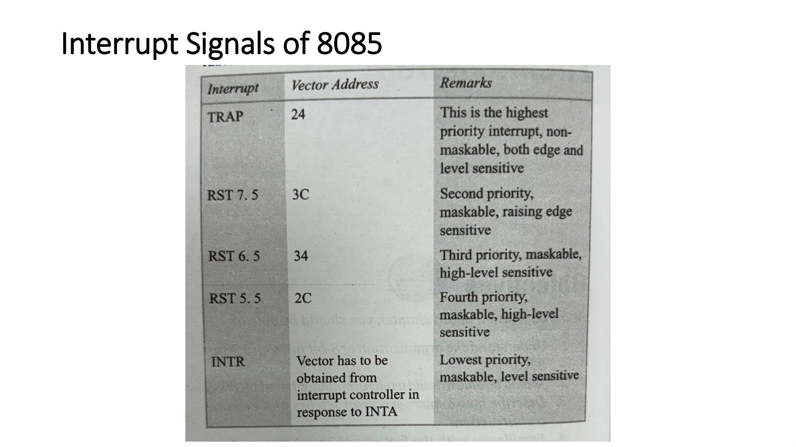

### Comprehensive Pin Function Table

| Signal Name | Pin Numbers | Type | Functional Description |
| :--- | :--- | :--- | :--- |
| **$A_{15} - A_8$** | Pins 21–28 | Output (Tri-state) | Higher-order address bus lines. Carry most significant 8 bits of memory/IO address. |
| **$AD_7 - AD_0$** | Pins 12–19 | Bidirectional (Tri-state) | Time-multiplexed lower address / data bus. Carries lower address byte when $ALE=1$, and data byte when $ALE=0$. |
| **$ALE$** | Pin 30 | Output | **Address Latch Enable:** Positive pulse emitted during $T_1$ of machine cycle to latch lower address byte into external 74LS373 latch. |
| **$\overline{\text{RD}}$** | Pin 32 | Output (Tri-state) | **Read Control:** Active low signal indicating CPU is reading data from memory or I/O device. |
| **$\overline{\text{WR}}$** | Pin 31 | Output (Tri-state) | **Write Control:** Active low signal indicating CPU is writing data to memory or I/O device. |
| **$\text{IO}/\overline{\text{M}}$** | Pin 34 | Output (Tri-state) | **IO / Memory Status:** Active high indicates I/O operation; Active low indicates Memory operation. |
| **$S_1, S_0$** | Pins 33, 29 | Output | **Machine Status Signals:** Specify type of active machine cycle (Fetch, Read, Write, Halt). |
| **$TRAP$** | Pin 6 | Input | Non-maskable highest priority interrupt. Highest priority; level and edge sensitive. Vector: `0024H`. |
| **$RST 7.5$** | Pin 7 | Input | Maskable interrupt; rising-edge sensitive. Internal flip-flop remembers trigger. Vector: `003CH`. |
| **$RST 6.5$** | Pin 8 | Input | Maskable interrupt; high-level sensitive. Vector: `0034H`. |
| **$RST 5.5$** | Pin 9 | Input | Maskable interrupt; high-level sensitive. Vector: `0020H`. |
| **$INTR$** | Pin 10 | Input | Maskable handshake interrupt; level sensitive. Expects external opcode/vector on $\overline{\text{INTA}}$. |
| **$\overline{\text{INTA}}$** | Pin 11 | Output | **Interrupt Acknowledge:** Active low signal issued in response to $INTR$ to read opcode from external hardware. |
| **$SID$** | Pin 5 | Input | **Serial Input Data:** Single-bit serial input line read by `RIM` instruction. |
| **$SOD$** | Pin 4 | Output | **Serial Output Data:** Single-bit serial output line set/reset by `SIM` instruction. |
| **$HOLD$** | Pin 39 | Input | Indicates external bus master (e.g., DMA Controller) requests control of address/data buses. |
| **$HOLDA$** | Pin 38 | Output | **HOLD Acknowledge:** Confirms CPU has released buses to tri-state for DMA transfer. |
| **$\overline{\text{RESET IN}}$** | Pin 3 | Input | Active low signal resetting CPU (clears PC to `0000H`, resets interrupt enables). |
| **$RESET OUT$** | Pin 37 | Output | Active high output signal to reset peripheral ICs connected in system. |
| **$READY$** | Pin 35 | Input | Synchronizes CPU with slow memory/IO devices. If low, CPU enters WAIT states ($T_{WAIT}$). |
| **$X_1, X_2$** | Pins 1, 2 | Input | Connections for external crystal oscillator to set internal clock frequency. |
| **$CLK(OUT)$** | Pin 37 | Output | System clock output for external support chips (half of crystal frequency). |
| **$V_{CC}, V_{SS}$**| Pins 40, 20 | Power | $+5\text{V}$ main power supply ($V_{CC}$) and Ground reference ($V_{SS}$). |

---

### Machine Status Signal Decoding Truth Table

| $\text{IO}/\overline{\text{M}}$ | $S_1$ | $S_0$ | Machine Cycle State | Control Signals Active |
| :---: | :---: | :---: | :--- | :--- |
| **0** | **1** | **1** | Opcode Fetch (OF) | $\overline{\text{RD}} = 0$ |
| **0** | **1** | **0** | Memory Read (MR) | $\overline{\text{RD}} = 0$ |
| **0** | **0** | **1** | Memory Write (MW) | $\overline{\text{WR}} = 0$ |
| **1** | **1** | **0** | I/O Read (IOR) | $\overline{\text{RD}} = 0$ |
| **1** | **0** | **1** | I/O Write (IOW) | $\overline{\text{WR}} = 0$ |
| **1** | **1** | **1** | Interrupt Acknowledge (INA) | $\overline{\text{INTA}} = 0$ |
| **0** | **0** | **0** | Halt State | None (Buses Tri-stated) |

[Source: 8085 PPT, Slides 15–19]

---

## 7. 8085 Interrupt System & 8259 Interfacing

### Interrupt Priority & Vector Addressing Hierarchy

| Interrupt Name | Priority Rank | Trigger Mode | Maskability | Vector Address (Hex) | Vector Calculation Formula |
| :--- | :--- | :--- | :--- | :--- | :--- |
| **TRAP** | 1 (Highest) | Level & Edge | Non-Maskable | `0024H` | Fixed vector ($4.5 \times 8 = 36 = 24\text{H}$) |
| **RST 7.5** | 2 | Rising-Edge | Maskable (`SIM`) | `003CH` | Fixed vector ($7.5 \times 8 = 60 = 3\text{CH}$) |
| **RST 6.5** | 3 | High-Level | Maskable (`SIM`) | `0034H` | Fixed vector ($6.5 \times 8 = 52 = 34\text{H}$) |
| **RST 5.5** | 4 | High-Level | Maskable (`SIM`) | `0020H` | Fixed vector ($5.5 \times 8 = 44 = 20\text{H}$) |
| **INTR** | 5 (Lowest) | High-Level | Maskable (`EI`/`DI`) | Provided Externally | Determined by 8259 or external hardware |

> **CRITICAL EXAM TWISTER (TRAP Triggering Sensitivity):**
> Why is the **TRAP** interrupt designed to be **both Level and Edge sensitive**?
> 1. **Edge Sensitivity:** A rising edge is required to trigger and set the internal TRAP latch. This prevents the interrupt from continuously re-triggering and looping indefinitely if the interrupt signal remains high for a long duration.
> 2. **Level Sensitivity:** The signal must remain high (level sensitive) until the microprocessor completes the execution of the current instruction and samples the interrupt line. This ensures that a very short, spurious noise spike doesn't trigger a false TRAP service routine.
>
> **RST 7.5 (Edge-Only):** Uses a positive edge-triggered D flip-flop to store the interrupt request. Thus, the pulse can be very short and doesn't need to be held high. It can be cleared using a `SIM` instruction.
> **RST 6.5 & 5.5 (Level-Only):** Must be held high until sampled, and must be deactivated before the interrupt service routine ends to avoid re-triggering.

### Software Restart Instructions (RST 0 to RST 7)
Formula for Restart Vector Address:

$$
\text{Vector Address (Hex)} = N \times 8_{10} \quad \text{converted to 16-bit Hex}
$$

For example, `RST 5` $\rightarrow 5 \times 8 = 40_{10} = 28\text{H} \rightarrow \text{Vector Address } 0028\text{H}$.

---

### Interfacing with 8259 PIC

#### Figure 2.6: 8259 Interrupt Controller Block Diagram
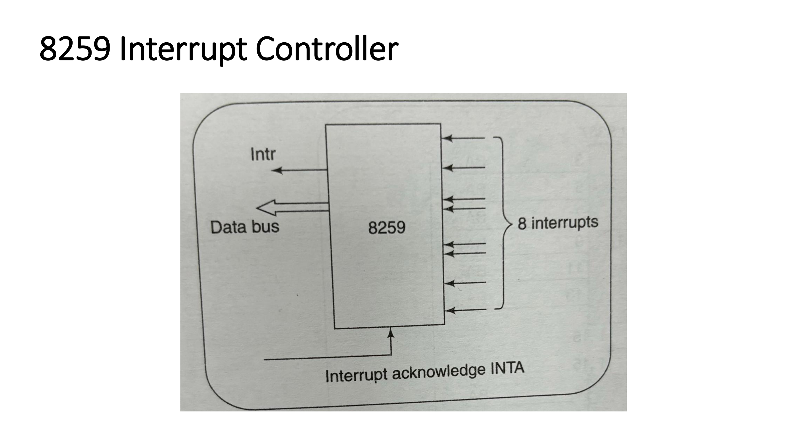

#### 8259 Handshake Execution Sequence
1. External devices assert interrupt lines $IR_0 - IR_7$ on the 8259 PIC.
2. The 8259 checks priority logic and unmasked status; if valid, it raises `INTR` to the 8085 CPU.
3. Upon completing the current instruction, 8085 emits three consecutive active low $\overline{\text{INTA}}$ pulses:
   - **1st $\overline{\text{INTA}}$ Pulse:** 8259 responds by placing `CALL` opcode (`CDH`) onto data bus.
   - **2nd $\overline{\text{INTA}}$ Pulse:** 8259 places the low byte of the target Service Routine address onto data bus.
   - **3rd $\overline{\text{INTA}}$ Pulse:** 8259 places the high byte of the target Service Routine address onto data bus.
4. The 8085 pushes Program Counter (PC) onto stack and jumps to the 16-bit vector address provided by 8259.

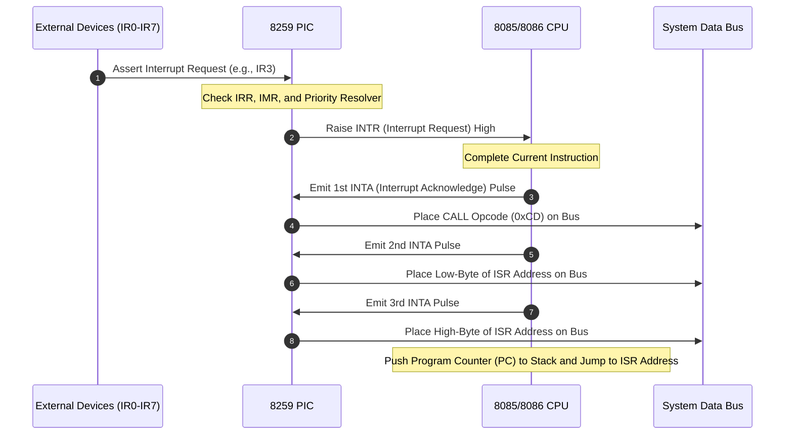
```mermaid
sequenceDiagram
    autonumber
    participant Dev as External Devices (IR0-IR7)
    participant PIC as 8259 PIC
    participant CPU as 8085/8086 CPU
    participant Bus as System Data Bus

    Dev->>PIC: Assert Interrupt Request (e.g., IR3)
    Note over PIC: Check IRR, IMR, and Priority Resolver
    PIC->>CPU: Raise INTR (Interrupt Request) High
    Note over CPU: Complete Current Instruction
    CPU->>PIC: Emit 1st INTA (Interrupt Acknowledge) Pulse
    PIC->>Bus: Place CALL Opcode (0xCD) on Bus
    CPU->>PIC: Emit 2nd INTA Pulse
    PIC->>Bus: Place Low-Byte of ISR Address on Bus
    CPU->>PIC: Emit 3rd INTA Pulse
    PIC->>Bus: Place High-Byte of ISR Address on Bus
    Note over CPU: Push Program Counter (PC) to Stack and Jump to ISR Address
```
5. **Cascading Support:** Master 8259 can connect to 8 slave 8259 controllers to manage up to 64 priority hardware interrupts.

[Source: 8085 PPT, Slides 26–34]

---

## 8. 8085 Addressing Modes

1. **Direct Addressing:** Memory address is explicitly specified in instruction (e.g., `LDA 2050H`).
2. **Register Addressing:** Operands reside in internal registers (e.g., `MOV A, B`).
3. **Register Indirect Addressing:** Memory address is held in register pair, usually HL (e.g., `MOV A, M`).
4. **Immediate Addressing:** Operand data is part of instruction byte sequence (e.g., `MVI A, 45H`, `LXI H, 2000H`).
5. **Implied/Implicit Addressing:** Operand is implicit in opcode (e.g., `CMA`, `RAR`, `STC`).

[Source: 8085 PPT, Slide 24]

---

# Chapter 3 — 8086 Architecture & Memory

## 1. Chapter Overview
This chapter presents an exhaustive architectural analysis of the Intel 8086 16-bit microprocessor. It details the dual-core internal organization comprising the Bus Interface Unit (BIU) and Execution Unit (EU), instruction prefetch queuing, 16-bit register structures, flag registers, 1 MB segmented memory organization, physical address calculation formulas, 8086 pin functions, all 7 addressing modes with circuit block diagrams, instruction machine encoding rules, and bus timing characteristics.

---

## 2. Main Features of Intel 8086 Microprocessor

* **16-bit Microprocessor Architecture:** Contains a 16-bit ALU, 16-bit internal registers, and a 16-bit external data bus ($D_{15} - D_0$).
* **Physical Addressability:** 20-bit unidirectional address bus ($A_{19} - A_0$) allowing direct addressing of $2^{20} = 1,048,576\text{ bytes} = 1\text{ MB}$ physical memory space.
* **Operating Clock Frequencies:** Standard 8086 ($5\text{ MHz}$), 8086-2 ($8\text{ MHz}$), 8086-1 ($10\text{ MHz}$).
* **Dual Operating Modes:** Hardware configurable via pin 33 ($\text{MN}/\overline{\text{MX}}$):
  - **Minimum Mode:** Single-processor system where 8086 generates all bus control signals.
  - **Maximum Mode:** Multiprocessor system utilizing 8288 Bus Controller to generate control signals.
* **Pipelined Dual-Unit Architecture:** Divided asynchronously into:
  - **Bus Interface Unit (BIU):** Manages instruction prefetching, memory/IO bus access, and physical address calculation.
  - **Execution Unit (EU):** Decodes opcodes and executes operations.
* **Instruction Stream Queue:** 6-byte FIFO prefetch queue in BIU providing hardware pipelining.
* **Segmented Memory Scheme:** 1 MB address space organized into 64 KB logical segments.
* **Internal Registers:** 14 16-bit registers.

[Source: 3CS526CC23 8086 Architecture part 1, Slides 2–3]

---

## 3. 8086 BIU and EU Interaction

### Figure 3.1: 8086 Internal Architecture Diagram
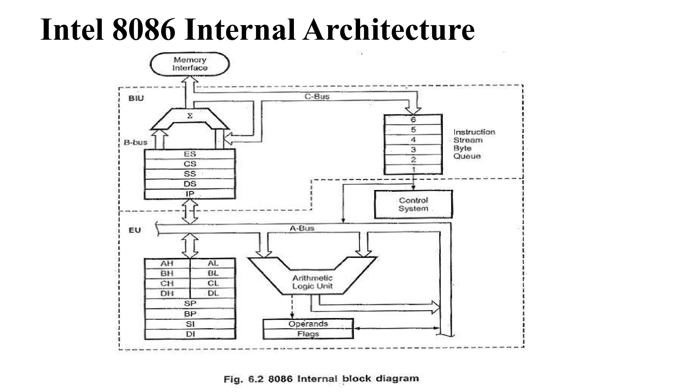

#### Functional Breakdown of BIU and EU

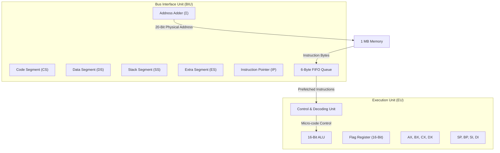
```mermaid
flowchart TD
    subgraph BIU["Bus Interface Unit (BIU)"]
        CS["Code Segment (CS)"]
        DS["Data Segment (DS)"]
        SS["Stack Segment (SS)"]
        ES["Extra Segment (ES)"]
        IP["Instruction Pointer (IP)"]
        Summation["Address Adder (Σ)"]
        Queue["6-Byte FIFO Queue"]
    end

    subgraph EU["Execution Unit (EU)"]
        ALU["16-Bit ALU"]
        Flags["Flag Register (16-Bit)"]
        GeneralRegs["AX, BX, CX, DX"]
        Pointers["SP, BP, SI, DI"]
        ControlUnit["Control & Decoding Unit"]
    end

    Summation -->|"20-Bit Physical Address"| ExternalMemory["1 MB Memory"]
    ExternalMemory -->|"Instruction Bytes"| Queue
    Queue -->|"Prefetched Instructions"| ControlUnit
    ControlUnit -->|"Micro-code Control"| ALU
```

#### Detailed Operations of BIU & EU

1. **Bus Interface Unit (BIU):**
   - **Instruction Queue (Q):** 6-byte First-In-First-Out (FIFO) buffer. The BIU prefetches up to 6 bytes of instruction code from memory whenever the queue has room for at least 2 bytes and the EU is not accessing memory.
   - **Segment Registers:** CS, DS, SS, ES (16-bit registers storing base segment paragraph addresses).
   - **Instruction Pointer (IP):** 16-bit register holding the offset address of the next instruction byte.
   - **Address Summing Block ($\\\Sigma$):** Dedicated 20-bit adder that computes physical addresses from segment and offset registers.

2. **Execution Unit (EU):**
   - **Control Unit:** Fetches decoded instruction bytes from the output of the BIU queue and generates control signals for execution.
   - **16-bit ALU:** Executes arithmetic, logical, shift, and rotate operations.
   - **Register Set:** Contains 8 general/pointer/index registers and 16-bit Flag register.
   - **Asynchronous Operation:** BIU and EU operate independently. While EU executes an instruction, BIU prefetches subsequent instruction bytes, maximizing bus utilization (Pipelining).
   - **Queue Flushing:** When EU encounters a branch/jump/call instruction, the pre-fetched queue bytes are flushed (cleared), and BIU fetches from the new branch target address.

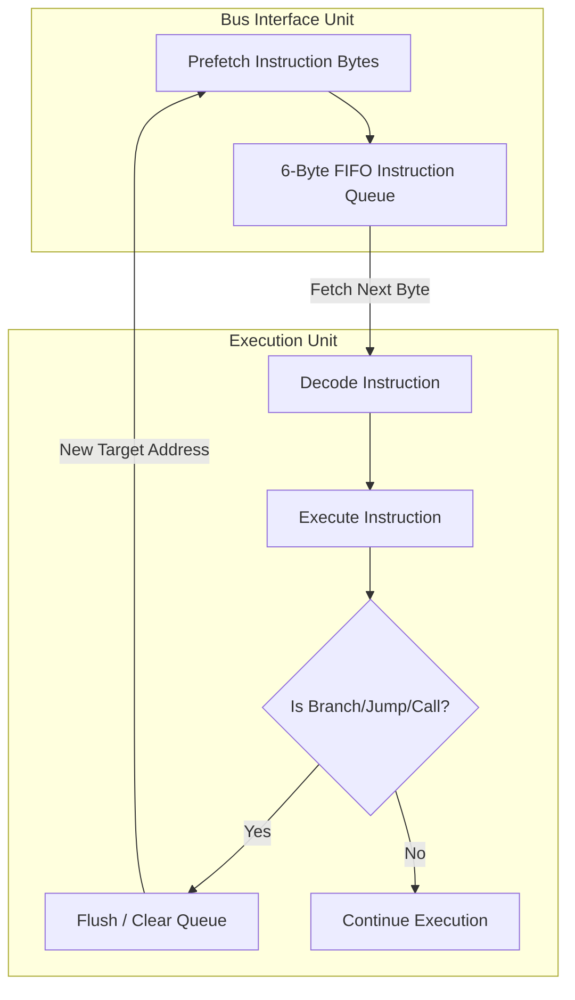
```mermaid
flowchart TD
    subgraph BIU [Bus Interface Unit]
        fetch["Prefetch Instruction Bytes"] --> q["6-Byte FIFO Instruction Queue"]
    end
    subgraph EU [Execution Unit]
        q -->|Fetch Next Byte| decode["Decode Instruction"]
        decode --> exec["Execute Instruction"]
        exec --> branch{"Is Branch/Jump/Call?"}
        branch -->|Yes| flush["Flush / Clear Queue"]
        branch -->|No| cont["Continue Execution"]
    end
    flush -->|New Target Address| fetch
```

[Source: 3CS526CC23 8086 Architecture part 1, Slides 6, 7, 18–20]

---

## 4. 8086 Register Structure

### Comprehensive 8086 Register Array Specifications

| Register Group | Symbol | Bit Size | Split Registers | Dedicated Functions |
| :--- | :--- | :--- | :--- | :--- |
| **Accumulator** | **AX** | 16-bit | AH (8-bit), AL (8-bit) | Primary arithmetic/logic target, I/O port data transfers, fast multiplication/division. |
| **Base Register** | **BX** | 16-bit | BH (8-bit), BL (8-bit) | Memory base address pointer for data references; indirect addressing. |
| **Count Register** | **CX** | 16-bit | CH (8-bit), CL (8-bit) | Loop counter (`LOOP`), bit shift/rotate counter (`CL`), string operations. |
| **Data Register** | **DX** | 16-bit | DH (8-bit), DL (8-bit) | 16-bit I/O port address pointer (`IN`/`OUT`); high-word holder in 32-bit math. |
| **Stack Pointer** | **SP** | 16-bit | None | Offset address of Top-of-Stack within Stack Segment (SS). |
| **Base Pointer** | **BP** | 16-bit | None | Base offset address for parameter passing inside stack frames (SS). |
| **Source Index** | **SI** | 16-bit | None | Source data offset pointer in DS; source string pointer (`DS:SI`). |
| **Destination Index**| **DI** | 16-bit | None | Destination data offset pointer in DS; string target pointer (`ES:DI`). |
| **Code Segment** | **CS** | 16-bit | None | Base paragraph address of active Code Segment. |
| **Data Segment** | **DS** | 16-bit | None | Base paragraph address of active Data Segment. |
| **Stack Segment** | **SS** | 16-bit | None | Base paragraph address of active Stack Segment. |
| **Extra Segment** | **ES** | 16-bit | None | Base paragraph address of active Extra Segment (string destinations). |
| **Instruction Pointer**| **IP**| 16-bit | None | Offset address of next instruction to execute within CS (`CS:IP`). |

[Source: 3CS526CC23 8086 Architecture part 1, Slides 8–14, 19]

---

## 5. 8086 Flag Register Specifications

The 8086 Flag Register is a 16-bit register containing 9 active flags (6 Status Flags and 3 Control Flags):

| Bit Position | Flag Name | Symbol | Category | Functional Description |
| :---: | :--- | :---: | :---: | :--- |
| **$D_0$** | Carry Flag | **CF** | Status | Set to `1` if unsigned math produces carry out of MSB or borrow; otherwise `0`. |
| **$D_2$** | Parity Flag | **PF** | Status | Set to `1` if lower 8 bits of result contain even number of `1`s (Even Parity). |
| **$D_4$** | Auxiliary Carry | **AF** | Status | Set to `1` if carry generated from bit 3 to bit 4 during BCD math. |
| **$D_6$** | Zero Flag | **ZF** | Status | Set to `1` if operation result is zero; reset to `0` if non-zero. |
| **$D_7$** | Sign Flag | **SF** | Status | Set to `1` if MSB of result is `1` (negative signed value). |
| **$D_8$** | Trap Flag | **TF** | Control | Set to `1` to enable single-step debugging mode (CPU generates Type 1 interrupt after each instruction). |
| **$D_9$** | Interrupt Flag | **IF** | Control | Set to `1` to enable maskable hardware interrupts (`INTR`); `0` disables `INTR`. |
| **$D_{10}$**| Direction Flag | **DF** | Control | Determines auto increment/decrement for string operations: `0` = Increment (forward), `1` = Decrement (backward). |
| **$D_{11}$**| Overflow Flag | **OF** | Status | Set to `1` if signed arithmetic result exceeds signed capacity of destination register. |

#### Comprehensive Flag Calculation Example
Consider execution of `ADD AL, 1` when register `AL` contains `7FH` ($0111\,1111_2$):

$$
\begin{aligned}
\text{Initial AL:} & \quad 0111\,1111_2 \quad (7\text{FH}) \\
+ \text{Value } 1: & \quad 0000\,0001_2 \quad (01\text{H}) \\
\hline
\text{New AL Result:} & \quad 1000\,0000_2 \quad (80\text{H})
\end{aligned}
$$

- **AL Output:** $80\text{H}$ (Decimal $-128$ in signed 2's complement).
- **Carry Flag (CF):** `0` (No carry out of bit 7).
- **Parity Flag (PF):** `0` (Result $1000\,0000_2$ has one `1` bit $\rightarrow$ odd parity).
- **Auxiliary Carry (AF):** `1` (Carry generated out of bit 3 into bit 4).
- **Zero Flag (ZF):** `0` (Result $80\text{H}$ is non-zero).
- **Sign Flag (SF):** `1` (Bit $D_7$ is `1`).
- **Overflow Flag (OF):** `1` (Positive $+127$ added to $+1$ resulted in negative $-128$, triggering signed overflow).

[Source: 3CS526CC23 8086 Architecture part 1, Slides 15–17]

---

## 6. Memory Segmentation & Address Calculation

### Concept of Segmented Memory
The 8086 addresses $1\text{ MB}$ ($1,048,576\text{ bytes}$) of physical memory using a 20-bit address. However, all internal registers are 16-bit wide. To bridge this gap, memory is organized into logical **Segments**.

* A **Segment** is a contiguous block of up to $64\text{ KB}$ ($65,536\text{ bytes}$) of memory.
* A segment can begin at any memory address divisible by 16 ($10\text{H}$), known as a **Paragraph Boundary** (where the lower 4 hex digits of physical address are `0000_2`).
* Four active logical segments are accessible at any instant: Code Segment (CS), Data Segment (DS), Stack Segment (SS), and Extra Segment (ES).

### Figure 3.2: 8086 Segmented Memory Organization
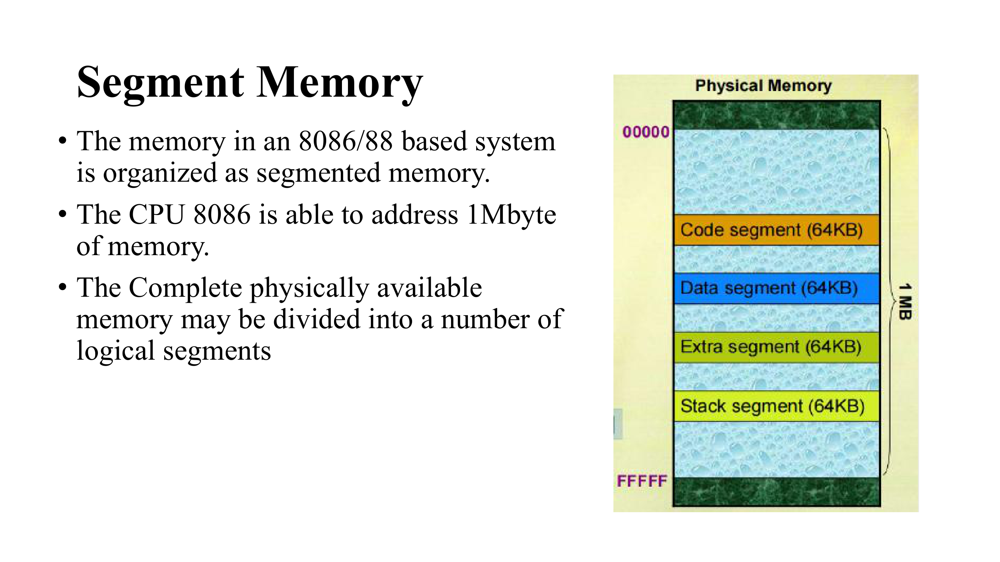

---

### Key Architectural Advantages of Memory Segmentation

1. **Expands Memory Capacity:** Allows 16-bit registers to address $1\text{ MB}$ of physical memory using segment:offset combinations.
2. **Code and Data Protection:** Separates executable code, data variables, and stack buffers into distinct logical areas, preventing accidental program overwrite.
3. **Dynamic Program Relocation:** Programs can be loaded into any physical memory location without altering internal offset addresses—only the segment register values are updated.
4. **Supports Programs $>$ 64 KB:** Code, data, or stack structures exceeding $64\text{ KB}$ can be handled by defining multiple logical segments.

[Source: 3CS526CC23 8086 Architecture part 1, Slides 21–24]

---

### Memory Banking (Physical Organization)

Although the 8086 has a 20-bit address bus to access 1 MB of physical memory, the memory is physically organized as two independent 512 KB banks: the **Even Bank (Low Bank)** and the **Odd Bank (High Bank)**. This allows the 16-bit CPU to access either an 8-bit byte or a 16-bit word in a single bus cycle.

* **Even Bank (Low Bank):** Contains all even-numbered physical addresses (`00000H, 00002H, ... FFFFEH`). Connected to the lower half of the data bus ($D_7 - D_0$). It is enabled when address line $A_0 = 0$.
* **Odd Bank (High Bank):** Contains all odd-numbered physical addresses (`00001H, 00003H, ... FFFFFH`). Connected to the upper half of the data bus ($D_{15} - D_8$). It is enabled when Bus High Enable ($\overline{\text{BHE}}$) pin is active low ($\overline{\text{BHE}} = 0$).

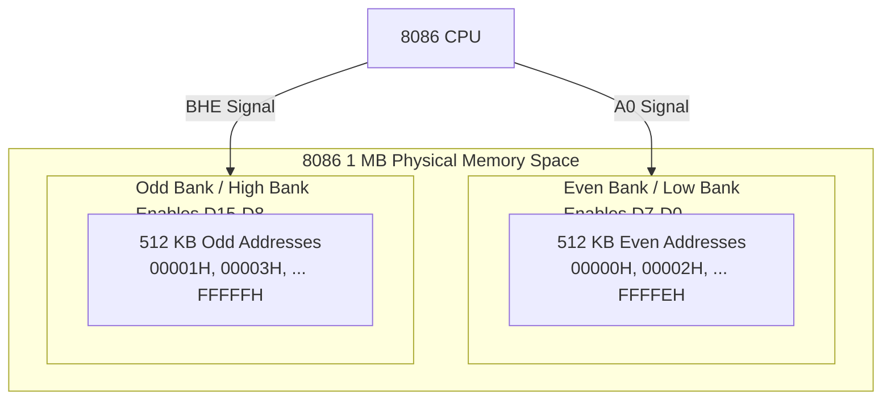
```mermaid
flowchart TD
    subgraph Mem["8086 1 MB Physical Memory Space"]
        subgraph Even["Even Bank / Low Bank<br>Enables D7-D0<br>Activated when A0 = 0"]
            even_mem["512 KB Even Addresses<br>00000H, 00002H, ... FFFFEH"]
        end
        subgraph Odd["Odd Bank / High Bank<br>Enables D15-D8<br>Activated when BHE = 0"]
            odd_mem["512 KB Odd Addresses<br>00001H, 00003H, ... FFFFFH"]
        end
    end
    8086["8086 CPU"] -->|BHE Signal| Odd
    8086 -->|A0 Signal| Even
```

#### Bank Selection and Alignment Scenarios (Exam Twisters)

The 8086 uses $A_0$ and $\overline{\text{BHE}}$ status signals to select the appropriate memory bank(s) according to this truth table:

| $\overline{\text{BHE}}$ | $A_0$ | Data Bus Width Used | Memory Bank Accessed | Bus Cycles Required |
| :---: | :---: | :---: | :--- | :---: |
| **0** | **0** | 16-bit ($D_{15} - D_0$) | Both Banks (Aligned Word access at Even Address) | 1 Cycle |
| **0** | **1** | 8-bit ($D_{15} - D_8$) | Odd Bank only (Byte access at Odd Address) | 1 Cycle |
| **1** | **0** | 8-bit ($D_7 - D_0$) | Even Bank only (Byte access at Even Address) | 1 Cycle |
| **1** | **1** | None (Idle) | No Bank selected | - |

> **CRITICAL EXAM TWISTER (Unaligned Word Access):**
> If the CPU attempts to read/write a 16-bit word starting at an **odd address** (e.g., `00001H`), it is called an **unaligned word access**. This requires **two consecutive bus cycles**:
> 1. **First Bus Cycle:** CPU accesses the Odd Bank ($\overline{\text{BHE}}=0, A_0=1$) to read the low byte of the word from `00001H` using $D_{15}-D_8$.
> 2. **Second Bus Cycle:** CPU accesses the Even Bank ($\overline{\text{BHE}}=1, A_0=0$) to read the high byte of the word from `00002H` using $D_7-D_0$.

[Source: 3CS526CC23 8086 Architecture part 1, Slide 25]

---

### Physical Address Generation Formula

### Figure 3.3: 8086 Physical Address Summing Block
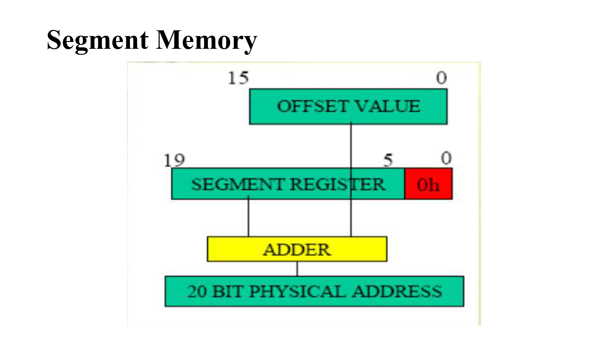

```mermaid
flowchart LR
    Seg["Segment Register<br>e.g., CS = 3000H"] -->|Shift Left 4 Bits<br>Multiply by 10H| Shift["Base Segment Address<br>30000H"]
    Offset["Offset Register<br>e.g., IP = 1234H"] --> Add
    Shift --> Add("(20-Bit Adder"))
    Add -->|Sum| PA["Physical Address<br>31234H"]
```

#### Mathematical Formula

$$
\text{Physical Address} = (\text{Segment Register Value} \times 16_{10}) + \text{Offset Address}
$$

In Hexadecimal notation:

$$
\text{Physical Address} = (\text{Segment Register Value} \times 10_H) + \text{Offset Address}
$$

```text
Segment Register (16-bit):  [ S3  S2  S1  S0 ] 0H    (Shifted 4 bits left = x 16)
+ Offset Register (16-bit):      [ O3  O2  O1  O0 ]
---------------------------------------------------
Physical Address (20-bit):  [ P4  P3  P2  P1  P0 ]
```

> **CRITICAL EXAM TWISTER (Physical Address Wrap-around in Real Mode):**
> What happens if the segment and offset combination computes an address exceeding the 1 MB addressable boundary (`FFFFFH`)?
> For example: $\text{Segment} = \text{FFFFH}$, $\text{Offset} = \text{FFFFH}$.

$$
\text{Base Segment Address} = \text{FFFFH} \times 10\text{H} = \text{FFFF0H}
$$

$$
\text{Physical Address} = \text{FFFF0H} + \text{FFFFH} = \text{10FFEFH}
$$

> Since the 8086 has only 20 physical address lines ($A_{19} - A_0$), the 21st bit (the leading `1` in `10FFEFH`) is discarded (there is no 21st line).
> The address **wraps around** to the very beginning of physical memory space, specifically to:

$$
\text{Wrapped Address} = \text{0FFEFH}
$$

> This is a classic real-mode memory limitation and an extremely common trick question in university examinations.

---

### Standard Segment and Offset Register Pairs

| Segment Type | Segment Register | Default Offset Register | Alternative Offset Registers | Physical Address Purpose |
| :--- | :---: | :---: | :---: | :--- |
| **Instruction Fetch** | **CS** | **IP** | None | Next instruction byte to fetch (`CS:IP`). |
| **Stack Operation** | **SS** | **SP** | **BP** | Top of stack (`SS:SP`) or stack frame (`SS:BP`). |
| **General Data** | **DS** | **BX** | **SI, DI**, Direct Address | General variable data (`DS:BX`, `DS:SI`, `DS:DI`). |
| **String Destination**| **ES** | **DI** | None | Destination operand in string commands (`ES:DI`). |

[Source: 3CS526CC23 8086 Architecture part 1, Slides 26, 32]

---

## 7. Worked Address Calculation Problems

### Numerical Problem 3.1
**Problem:** The Data Segment (DS) starts at physical address `10000H` (Segment value `1000H`). A data reference specifies an offset of `0029H`. Calculate the physical address of the data operand.  
**Given:** $\text{DS} = 1000\text{H}$, $\text{Offset} = 0029\text{H}$.  
**Required:** Physical Address.  
**Formula:** $\text{Physical Address} = \text{DS} \times 10\text{H} + \text{Offset}$.  
**Solution Steps:**
1. Shift DS value left by 4 hex bits: $1000\text{H} \times 10\text{H} = 10000\text{H}$.
2. Add offset: $10000\text{H} + 0029\text{H} = 10029\text{H}$.  
**Final Answer:** Physical Address = `10029H`.

---

### Numerical Problem 3.2
**Problem:** A program code segment starts at physical address `70400H`.
1. What value is stored in the Code Segment register (CS)?
2. If the Instruction Pointer (IP) contains `539CH`, what physical address is fetched?

**Given:** $\text{Physical Base} = 70400\text{H}$, $\text{IP} = 539\text{CH}$.  
**Required:** CS register value, physical fetch address.  
**Formula:** $\text{CS} = \frac{\text{Physical Base}}{16_{10}}$, $\text{Physical Address} = \text{CS} \times 10\text{H} + \text{IP}$.  
**Solution Steps:**
1. $\text{CS} = \frac{70400\text{H}}{10\text{H}} = 7040\text{H}$.
2. $\text{Physical Address} = 70400\text{H} + 539\text{CH} = 7579\text{CH}$.  
**Final Answer:** CS = `7040H`, Physical Address = `7579CH`.

---

### Numerical Problem 3.3
**Problem:** The Stack Segment register (SS) contains `3000H` and Stack Pointer (SP) contains `8434H`. Find the physical address of the top of stack.  
**Given:** $\text{SS} = 3000\text{H}$, $\text{SP} = 8434\text{H}$.  
**Required:** Physical Address of Top of Stack.  
**Formula:** $\text{Physical Address} = \text{SS} \times 10\text{H} + \text{SP}$.  
**Solution Steps:**

$$
\text{Physical Address} = 30000\text{H} + 8434\text{H} = 38434\text{H}
$$

**Final Answer:** Top of Stack Physical Address = `38434H`.

[Source: 3CS526CC23 8086 Architecture part 1, Slides 31, 33]

---

## 8. 8086 Pin Diagram & Signal Descriptions

### Figure 3.4: 8086 Pin Diagram (40-Pin DIP Layout)
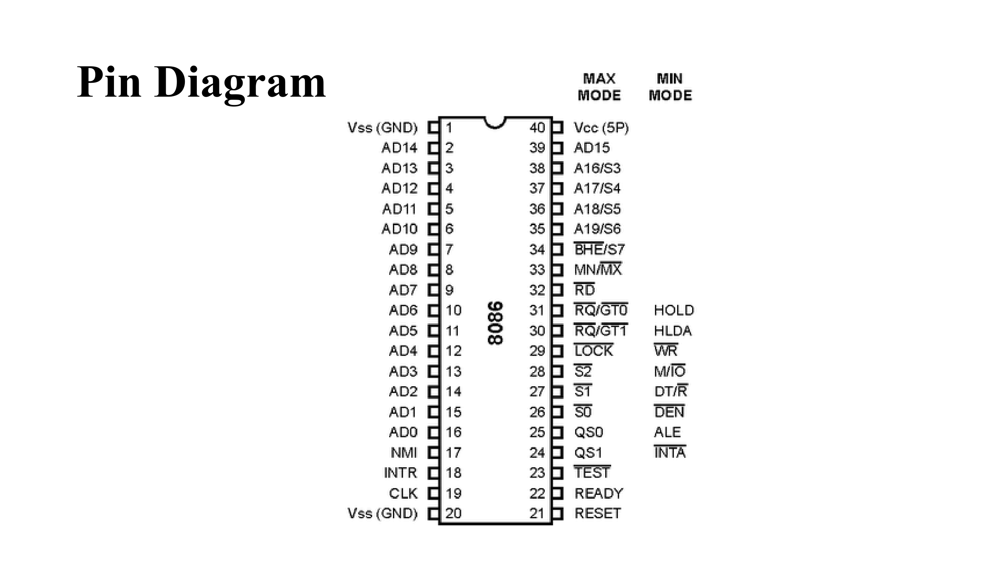

### Key 8086 Pin Signals

1. **$AD_{15} - AD_0$ (Pins 1–16, 39):** Multiplexed Address/Data bus. Carries memory address during $T_1$, and data during $T_2, T_3, T_4$.
2. **$A_{19}/S_6 - A_{16}/S_3$ (Pins 35–38):** Multiplexed high address lines and system status lines.
3. **$\overline{\text{BHE}}/S_7$ (Pin 34):** Bus High Enable / Status. Active low signal used to enable upper data byte ($D_{15} - D_8$) on memory bus.
4. **$\text{MN}/\overline{\text{MX}}$ (Pin 33):** Minimum / Maximum mode select. High selects Minimum mode; Low selects Maximum mode.
5. **$RD$ (Pin 32):** Read signal. Active low.
6. **$TEST$ (Pin 23):** Tested by `WAIT` instruction. If low, CPU continues execution; if high, CPU waits.
7. **$READY$ (Pin 22):** Bus ready input for interfacing slow memories.
8. **$RESET$ (Pin 21):** Reset input. Clears flags, IP to `0000H`, CS to `FFFFH`.

[Source: 3CS526CC23 8086 Architecture part 1, Slide 4]

---

## 9. 8086 Addressing Modes

The 8086 provides 7 primary addressing modes for accessing instruction operands:

### Summary Comparison Table of Addressing Modes

| Addressing Mode | Effective Address ($EA$) Formula | Advantage | Disadvantage | Typical Assembly Example |
| :--- | :--- | :--- | :--- | :--- |
| **Register** | $EA = R$ | Fastest (No memory reference) | Limited addressable space (registers only) | `MOV BX, DX` |
| **Immediate** | $EA = \text{Instruction Constant}$ | Fast operand loading | Fixed constant value | `MOV AX, 2550H` |
| **Direct** | $EA = [\text{Displacement}]$ | Simple to program | Fixed memory offset | `MOV AX, [2400H]` |
| **Register Indirect**| $EA = [\text{BX/BP/SI/DI}]$ | Large addressable memory | Requires prior register load | `MOV AX, [BX]` |
| **Base Relative** | $EA = [\text{BX/BP}] + \text{Disp}$ | Flexible for structures | Requires 16-bit register addition | `MOV AX, 12H[BX]` |
| **Indexed Relative** | $EA = [\text{SI/DI}] + \text{Disp}$ | Ideal for array indexing | Requires 16-bit register addition | `MOV DX, ARRAY[SI]` |
| **Base Indexed Relative** | $EA = [\text{BX/BP}] + [\text{SI/DI}] + \text{Disp}$ | Extremely flexible (2D arrays) | Complex address calculation | `MOV AX, BETA[BX][SI]` |

---

### Detailed Breakdown of Each Addressing Mode

#### 1. Register Addressing Mode
Operand is stored inside an internal CPU register.

### Figure 3.5: Register Addressing Mode
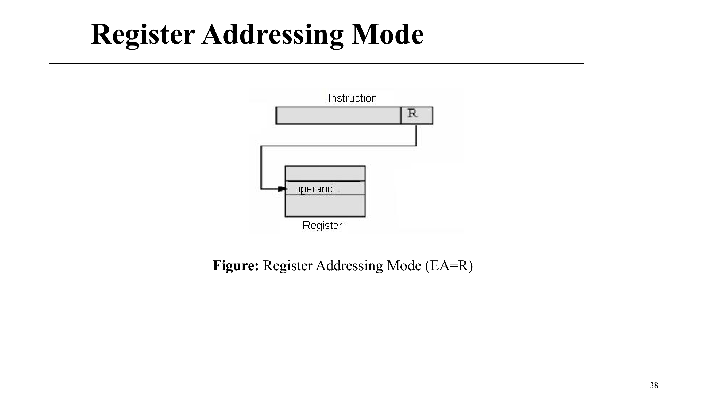

- **Formula:** $EA = R$
- **Example:** `MOV BX, DX` (Copies contents of DX into BX).

---

#### 2. Immediate Addressing Mode
Operand data is encoded directly as part of the machine instruction byte sequence.

### Figure 3.6: Immediate Addressing Mode
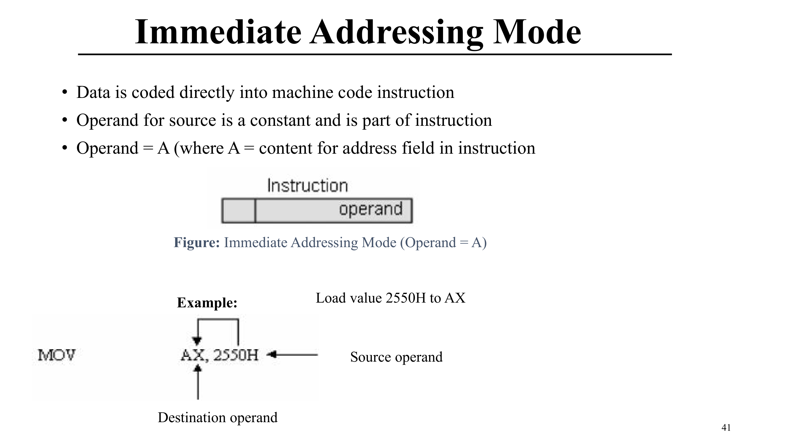

- **Formula:** $\text{Operand} = A$
- **Example:** `MOV AX, 2550H` (Loads immediate word `2550H` into AX).
> **CRITICAL EXAM WARNING (Segment Register Load Restriction):**
> Inside the 8086 Instruction Set Architecture, **immediate data cannot be loaded directly into any Segment Register** (`CS`, `DS`, `SS`, `ES`).
> - *Invalid/Illegal:* `MOV DS, 1000H` (Will result in a compiler/assembler error).
> - *Correct Workaround:* You must load the immediate value into a 16-bit general purpose register (like `AX`, `BX`, `CX`, `DX`) first, and then copy that register into the target Segment Register:
>   ```assembly
>   MOV AX, 1000H   ; Load immediate data into AX
>   MOV DS, AX      ; Transfer from AX to DS
>   ```

---

#### 3. Direct Addressing Mode
The 16-bit effective address (offset) of the operand is explicitly written inside the instruction.

### Figure 3.7: Direct Addressing Mode
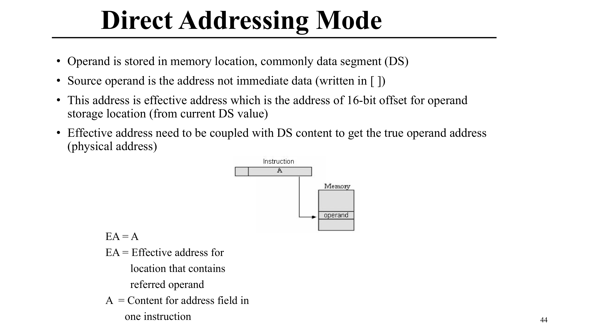

- **Formula:** $EA = A$, $\text{Physical Address} = \text{DS} \times 10\text{H} + A$
- **Example:** `MOV AX, [2400H]` (If $\text{DS} = 2000\text{H}$, $\text{Physical Address} = 20000\text{H} + 2400\text{H} = 22400\text{H}$).

---

#### 4. Register Indirect Addressing Mode
The 16-bit offset address of the operand in memory is held inside a Base register (`BX`, `BP`) or Index register (`SI`, `DI`).

### Figure 3.8: Register Indirect Addressing Mode
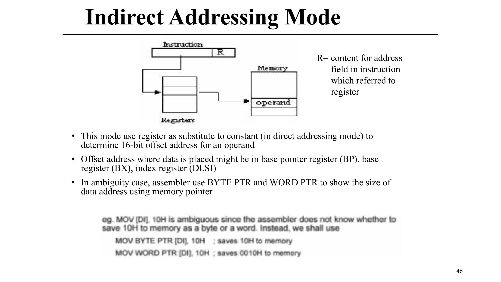

- **Formula:** $EA = [R]$ where $R \in \{\text{BX}, \text{BP}, \text{SI}, \text{DI}\}$
- **Example:** `MOV AX, [BX]` (If $\text{DS} = 1010\text{H}$ and $\text{BX} = 1122\text{H}$, $\text{Physical Address} = 10100\text{H} + 1122\text{H} = 11222\text{H}$).
- **Pointer Operator Requirement:** In ambiguous memory operations, `BYTE PTR` or `WORD PTR` must specify data size (e.g., `INC BYTE PTR [BX]`).

---

#### 5. Base Relative Addressing Mode
Effective address is computed by adding an 8-bit or 16-bit displacement to the contents of a Base register (`BX` or `BP`).

### Figure 3.9: Base Relative Addressing Mode
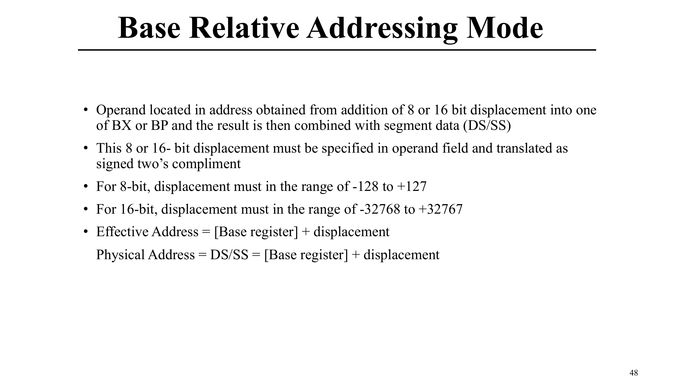

- **Formula:** $EA = [\text{Base Reg}] + \text{Displacement}$
  - Default Segment for `BX` is **DS**.
  - Default Segment for `BP` is **SS**.
- **Displacement Limits:** 8-bit signed ($-128$ to $+127$) or 16-bit signed ($-32768$ to $+32767$).
- **Example:** `MOV AX, 1234H[BX]` (If $\text{DS} = 4000\text{H}$, $\text{BX} = 1000\text{H}$, $\text{Physical Address} = 40000\text{H} + 1000\text{H} + 1234\text{H} = 42234\text{H}$).

---

#### 6. Indexed Relative Addressing Mode
Effective address is computed by adding an 8-bit or 16-bit displacement to an Index register (`SI` or `DI`).

### Figure 3.10: Indexed Relative Addressing Mode
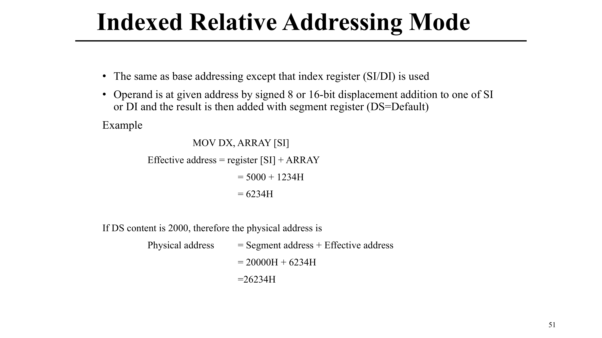

- **Formula:** $EA = [\text{Index Reg}] + \text{Displacement}$
- **Example:** `MOV DX, ARRAY[SI]` (If $\text{DS} = 2000\text{H}$, $\text{SI} = 5000\text{H}$, $\text{ARRAY} = 1234\text{H}$, $\text{Physical Address} = 20000\text{H} + 5000\text{H} + 1234\text{H} = 26234\text{H}$).

---

#### 7. Base Indexed Relative Addressing Mode
Combines Base register, Index register, and an optional displacement to compute the effective address.

### Figure 3.11: Base Indexed Relative Addressing Mode
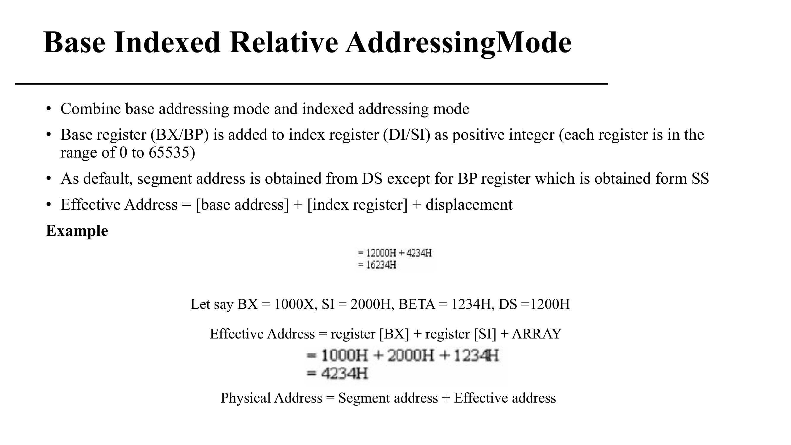

- **Formula:** $EA = [\text{Base Reg}] + [\text{Index Reg}] + \text{Displacement}$
- **Example:** `MOV AX, BETA[BX][SI]` (If $\text{DS} = 1200\text{H}$, $\text{BX} = 1000\text{H}$, $\text{SI} = 2000\text{H}$, $\text{BETA} = 1234\text{H}$, $\text{Physical Address} = 12000\text{H} + 1000\text{H} + 2000\text{H} + 1234\text{H} = 15234\text{H}$).

[Source: 3CS526CC23 8086 Architecture, Slides 34–54]

---

## 10. 8086 Instruction Format & Machine Encoding

8086 instructions range from 1 to 6 bytes in length.

### Figure 3.12: 8086 MOV Instruction Template Format
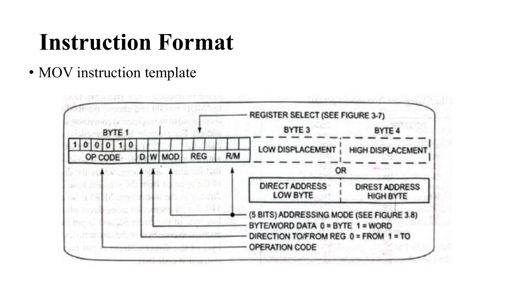

### Field Descriptions in Machine Code Byte

1. **Opcode (6 bits):** Identifies basic instruction operation (e.g., `100010_2` for `MOV`).
2. **D (Direction Bit, 1 bit):**
   - $D = 0$: Data flows **from** Register specified in `REG` field **to** operand in `R/M`.
   - $D = 1$: Data flows **to** Register specified in `REG` field **from** operand in `R/M`.
3. **W (Word/Byte Bit, 1 bit):**
   - $W = 0$: 8-bit Byte operation.
   - $W = 1$: 16-bit Word operation.
4. **MOD (Mode Field, 2 bits):** Specifies addressing mode (Register vs Memory with displacement):
   - $\text{MOD} = 11$: Register-to-Register mode (No memory displacement).
   - $\text{MOD} = 00$: Memory mode with no displacement (except direct addressing when $\text{R/M} = 110$).
   - $\text{MOD} = 01$: Memory mode with 8-bit sign-extended displacement.
   - $\text{MOD} = 10$: Memory mode with 16-bit displacement.
5. **REG (Register Field, 3 bits):** Identifies register operand.
6. **R/M (Register/Memory Field, 3 bits):** Specifies second operand or memory addressing combination.

### Figure 3.13: 8086 MOD and R/M Encoding Matrix
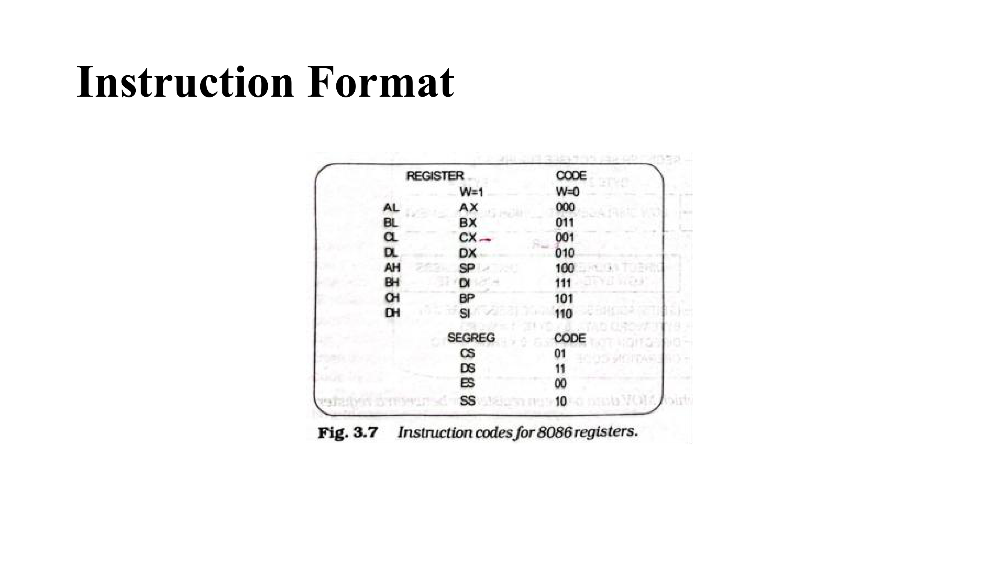

[Source: 3CS526CC23 8086 Architecture, Slides 55–66]

---

# Chapter 4 — 8086 Instruction Set

## 1. Chapter Overview
This chapter provides an exhaustive breakdown of the 8086 microprocessor instruction set. Instructions are classified into functional categories: Data Transfer, Arithmetic, Logical, Shift/Rotate, String Manipulation, Branch/Control Transfer, and Processor Control. Each instruction is detailed with syntax, operational mechanics, flag impacts, constraints, worked code examples, and practical programming patterns.

---

## 2. General Assembler Instruction Syntax

The standard format for an 8086 assembly language instruction line is:

```assembly
Label:   Mnemonic   Destination, Source   ; Comments
```

### Example
```assembly
START:   MOV        AX, [BX]              ; Load word from memory address BX into AX
```

### Pointer (PTR) Operator Resolution
When an instruction contains a memory operand without an explicit register to specify operand size, the assembler cannot determine whether to execute a 8-bit byte or 16-bit word operation. The `PTR` operator must be used to resolve ambiguity:

* `INC [BX]` $\rightarrow$ **AMBIGUOUS (Compiler Error)**.
* `INC BYTE PTR [BX]` $\rightarrow$ Increments the 8-bit byte at memory address `[BX]`.
* `INC WORD PTR [BX]` $\rightarrow$ Increments the 16-bit word at memory address `[BX]`.

[Source: 8086_instruction_set_Basic, Slides 3, 5]

---

## 3. Data Transfer Instructions

Data transfer instructions move data between registers, memory locations, and I/O ports. **No status flags are affected by standard data transfer instructions.**

---

### MOV (Move Data)
* **Purpose:** Copies data byte or word from source to destination.
* **Syntax:** `MOV Destination, Source`
* **Operation:** $(\text{Destination}) \leftarrow (\text{Source})$
* **Constraints:**
  - Both operands cannot be memory locations simultaneously.
  - Both operands cannot be segment registers simultaneously.
  - Immediate data cannot be moved directly into segment registers.
* **Flags Affected:** None.
* **Examples:**
  ```assembly
  MOV CX, 037AH        ; Load immediate word 037AH into CX
  MOV AL, BL           ; Copy byte from BL to AL
  MOV BX, [0301H]      ; Load word from memory offset 0301H into BX
  ```

---

### XCHG (Exchange Data)
* **Purpose:** Swaps contents of source and destination operands.
* **Syntax:** `XCHG Destination, Source`
* **Operation:** $(\text{Destination}) \leftrightarrow (\text{Source})$
* **Constraints:** Cannot exchange two memory locations directly. One operand must be a register. Segment registers cannot be exchanged.
* **Flags Affected:** None.
* **Examples:**
  ```assembly
  XCHG BX, AX          ; Swap contents of BX and AX
  XCHG [5000H], AX     ; Swap word in memory location 5000H with AX
  ```

---

### LEA (Load Effective Address)
* **Purpose:** Computes the 16-bit effective address (offset) of the source memory operand and stores it in the destination register.
* **Syntax:** `LEA Reg16, Memory`
* **Operation:** $\text{EA} \rightarrow (\text{Reg16})$
* **Flags Affected:** None.
* **Example:**
  ```assembly
  LEA BX, ARRAY        ; Load offset address of ARRAY into register BX
  ```

---

### LDS (Load Pointer Using DS)
* **Purpose:** Loads a 32-bit far pointer from a 4-byte memory location into a 16-bit general register and the Data Segment register (DS).

### Figure 4.1: LDS and LES Memory Pointer Loading Mechanism
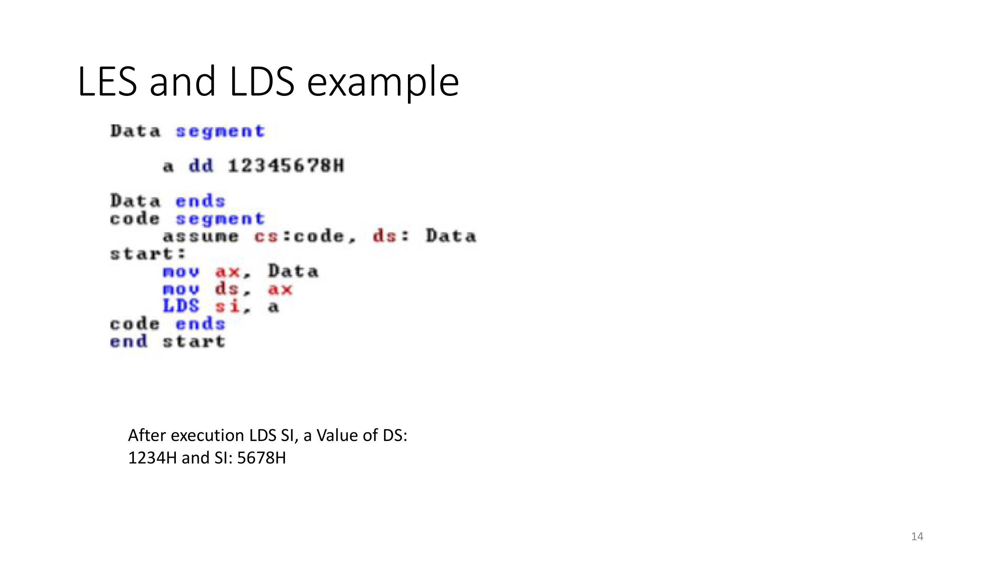

* **Syntax:** `LDS Reg16, MEM32`
* **Operation:**
  - $(\text{MEM32}) \rightarrow (\text{Reg16})$ (Offset loaded into destination register)
  - $(\text{MEM32} + 2) \rightarrow (\text{DS})$ (Segment selector loaded into DS)
* **Flags Affected:** None.
* **Example:**
  ```assembly
  LDS SI, [0301H]      ; Loads offset into SI and segment into DS from memory 0301H
  ```

---

### LES (Load Pointer Using ES)
* **Purpose:** Loads a 32-bit far pointer from memory into a specified 16-bit register and the Extra Segment register (ES).
* **Syntax:** `LES Reg16, MEM32`
* **Operation:**
  - $(\text{MEM32}) \rightarrow (\text{Reg16})$
  - $(\text{MEM32} + 2) \rightarrow (\text{ES})$
* **Flags Affected:** None.
* **Example:**
  ```assembly
  LES BX, STRING_PTR   ; Loads string offset into BX and segment into ES
  ```

[Source: 8086_instruction_set_Basic, Slides 7–14]

---

## 4. Arithmetic Instructions

Arithmetic instructions perform binary addition, subtraction, multiplication, division, increment, decrement, and sign extension. **All conditional flags (CF, PF, AF, ZF, SF, OF) are affected unless explicitly noted.**

---

### ADD (Add Words or Bytes)
* **Purpose:** Adds contents of source operand to destination operand and stores sum in destination.
* **Syntax:** `ADD Destination, Source`
* **Operation:** $(\text{Destination}) \leftarrow (\text{Destination}) + (\text{Source})$
* **Flags Affected:** All status flags (CF, PF, AF, ZF, SF, OF).
* **Examples:**
  ```assembly
  ADD AX, 2020H        ; AX = AX + 2020H
  ADD AX, BX           ; AX = AX + BX
  ```

---

### ADC (Add with Carry)
* **Purpose:** Adds source operand, destination operand, and the current Carry Flag (CF) bit together.
* **Syntax:** `ADC Destination, Source`
* **Operation:** $(\text{Destination}) \leftarrow (\text{Destination}) + (\text{Source}) + \text{CF}$
* **Flags Affected:** All status flags (CF, PF, AF, ZF, SF, OF).
* **Examples:**
  ```assembly
  ADC AX, 2020H        ; AX = AX + 2020H + CF
  ADC AX, BX           ; AX = AX + BX + CF
  ```

---

### SUB (Subtract)
* **Purpose:** Subtracts source operand from destination operand.
* **Syntax:** `SUB Destination, Source`
* **Operation:** $(\text{Destination}) \leftarrow (\text{Destination}) - (\text{Source})$
* **Flags Affected:** All status flags (CF, PF, AF, ZF, SF, OF).
* **Examples:**
  ```assembly
  SUB AX, 1000H        ; AX = AX - 1000H
  SUB AX, BX           ; AX = AX - BX
  ```

---

### SBB (Subtract with Borrow)
* **Purpose:** Subtracts source operand and Carry Flag (Borrow) from destination operand.
* **Syntax:** `SBB Destination, Source`
* **Operation:** $(\text{Destination}) \leftarrow (\text{Destination}) - (\text{Source}) - \text{CF}$
* **Flags Affected:** All status flags (CF, PF, AF, ZF, SF, OF).
* **Examples:**
  ```assembly
  SBB AX, 1000H        ; AX = AX - 1000H - CF
  SBB AX, BX           ; AX = AX - BX - CF
  ```

---

### INC (Increment) & DEC (Decrement)
* **Purpose:** Adds 1 to (INC) or subtracts 1 from (DEC) the operand.
* **Syntax:** `INC Source`, `DEC Source`
* **CRITICAL FLAG RULE:** **INC and DEC affect PF, AF, ZF, SF, OF, but DO NOT affect the Carry Flag (CF)!**
* **Constraints:** Operand cannot be immediate data.
* **Examples:**
  ```assembly
  INC AX               ; Increment AX by 1
  DEC BYTE PTR [5000H] ; Decrement byte in memory location 5000H by 1
  ```

> **CRITICAL EXAM TWISTER (Why INC/DEC do not affect CF):**
> If you have a loop that performs multi-word additions using `ADC` (Add with Carry), you typically use a register like `SI` or `DI` to point to the array elements, and a loop register like `CX` or `BX` as a counter. After each array addition, you increment the pointer using `INC SI` and decrement the counter using `DEC CX`.
> If `INC` or `DEC` affected the Carry Flag, they would overwrite the carry status generated by the `ADC` instruction. This would ruin the addition of the next word/byte in the sequence!
> By leaving CF untouched, the 8086 allows developers to update pointers and counters inside multi-word arithmetic loops without losing valuable carry information.

---

### NEG (Negate / Two's Complement)
* **Purpose:** Replaces operand contents with its two's complement ($0 - \text{Operand}$).
* **Syntax:** `NEG Source`
* **Flags Affected:** All status flags. CF is set to `1` for any non-zero operand.
* **Example:**
  ```assembly
  NEG AX               ; AX = -AX
  ```

---

### CMP (Compare)
* **Purpose:** Subtracts source operand from destination operand to update status flags without altering destination contents.
* **Syntax:** `CMP Operand1, Operand2`
* **Operation:** Flags updated based on $(\text{Operand1}) - (\text{Operand2})$. Result is discarded.
* **Flags Affected:** All status flags (CF, PF, AF, ZF, SF, OF).
* **Examples:**
  ```assembly
  CMP AX, 1000H        ; Compare AX with 1000H
  CMP AX, BX           ; Compare AX with BX
  ```

---

### CBW (Convert Byte to Word) & CWD (Convert Word to Doubleword)
* **Purpose:** Sign-extends signed operands for division/arithmetic.
  - `CBW`: Extends sign bit of AL ($D_7$) across all bits of AH.
  - `CWD`: Extends sign bit of AX ($D_{15}$) across all bits of DX.
* **Syntax:** `CBW`, `CWD` (No explicit operands).
* **Flags Affected:** **None.**
* **Example Code Sequence (Adding Signed Byte Y to Signed Word X):**
  ```assembly
  MOV AL, Y            ; Load signed byte Y into AL
  CBW                  ; Sign extend AL into AX (AX now holds 16-bit signed Y)
  ADD AX, X            ; Add signed word X to AX
  ```

---

### MUL (Unsigned Multiplication) & IMUL (Signed Multiplication)
* **Purpose:** Multiplies accumulator by source operand.
* **Operational Mechanics:**
  - **8-bit Multiplication:** $\text{AL} \times \text{Operand8} \rightarrow \text{AX}$ (16-bit product stored in AX).
  - **16-bit Multiplication:** $\text{AX} \times \text{Operand16} \rightarrow (\text{DX:AX})$ (32-bit product stored across DX:AX, where DX holds high word).
* **Flags Affected:** OF and CF are set to `1` if upper half of product contains significant digits (non-zero for MUL, non-sign extension for IMUL); otherwise reset to `0`. Other flags are undefined.
* **Constraints:** Source operand **cannot** be immediate data.
* **Examples:**
  ```assembly
  MUL BH               ; AX = AL * BH (Unsigned)
  IMUL CX              ; (DX:AX) = AX * CX (Signed)
  ```

---

### DIV (Unsigned Division) & IDIV (Signed Division)
* **Purpose:** Divides accumulator by source operand.
* **Operational Mechanics:**
  - **8-bit Division:** Dividend in AX $\div$ Operand8 $\rightarrow \text{AL} = \text{Quotient}$, $\text{AH} = \text{Remainder}$.
  - **16-bit Division:** Dividend in (DX:AX) $\div$ Operand16 $\rightarrow \text{AX} = \text{Quotient}$, $\text{DX} = \text{Remainder}$.
* **Flags Affected:** All status flags are undefined.
* **Examples:**
  ```assembly
  MOV AX, 0203H
  MOV BL, 04H
  DIV BL               ; AX / BL -> AL = 50H (Quotient), AH = 03H (Remainder)
  ```

[Source: 8086_instruction_set_Basic, Slides 15–32]

---

## 5. Logical Instructions

Logical instructions perform bitwise boolean operations. **CF and OF are cleared to `0` by all bitwise logical operations; SF, ZF, and PF are updated accordingly; AF is undefined.**

| Instruction | Syntax | Boolean Operation | Flag Rules |
| :--- | :--- | :--- | :--- |
| **NOT** | `NOT OPR` | $(\text{OPR}) \leftarrow \overline{\text{OPR}}$ (One's Complement) | **No flags affected.** |
| **AND** | `AND DST, SRC` | $(\text{DST}) \leftarrow (\text{DST}) \land (\text{SRC})$ | CF=0, OF=0, updates SF, ZF, PF. |
| **OR** | `OR DST, SRC` | $(\text{DST}) \leftarrow (\text{DST}) \lor (\text{SRC})$ | CF=0, OF=0, updates SF, ZF, PF. |
| **XOR** | `XOR DST, SRC` | $(\text{DST}) \leftarrow (\text{DST}) \oplus (\text{SRC})$ | CF=0, OF=0, updates SF, ZF, PF. |
| **TEST** | `TEST OPR1, OPR2` | $(\text{OPR1}) \land (\text{OPR2})$ (Result discarded) | CF=0, OF=0, updates SF, ZF, PF. |

#### Applied Bitwise Logic Program Example
*Task:* Selectively set bits 0 and 2 of DL; toggle (invert) bits 1 and 6; clear bits 3 and 4; then test bits 1 and 7 and branch to `EXIT` if both test bits are set.

```assembly
OR  DL, 00000101B      ; Set bits 0 and 2 of DL (Mask: 05H)
XOR DL, 01000010B      ; Toggle bits 1 and 6 of DL (Mask: 42H)
AND DL, 11100111B      ; Clear bits 3 and 4 of DL (Mask: E7H)
TEST DL, 10000010B     ; Test bits 1 and 7 of DL (Mask: 82H)
JZ  EXIT               ; Jump to EXIT if tested bits are zero
```

[Source: 8086_instruction_set_Basic, Slides 33–34]

---

## 6. Shift and Rotate Instructions

Shift and Rotate instructions manipulate operand bits by shifting them left or right.

* **Count Rule:** The shift/rotate count `CNT` can be `1` (specified as immediate constant) or stored in register `CL` for multi-bit shifts.

| Instruction | Name / Type | Operational Behavior | Carry Flag (CF) Impact |
| :--- | :--- | :--- | :--- |
| **SHL / SAL** | Shift Logical/Arithmetic Left | Shifts bits left; fills right with `0`. | MSB shifted out enters CF. |
| **SHR** | Shift Logical Right | Shifts bits right; fills left with `0`. | LSB shifted out enters CF. |
| **SAR** | Shift Arithmetic Right | Shifts bits right; **retains original MSB (sign bit)** on left. | LSB shifted out enters CF. |
| **ROL** | Rotate Left | Circular bit rotation left. | MSB rotates into LSB AND into CF. |
| **ROR** | Rotate Right | Circular bit rotation right. | LSB rotates into MSB AND into CF. |
| **RCL** | Rotate Left Through Carry | 9-bit/17-bit circular rotation left through CF. | CF bit enters LSB; MSB enters CF. |
| **RCR** | Rotate Right Through Carry | 9-bit/17-bit circular rotation right through CF. | CF bit enters MSB; LSB enters CF. |

[Source: 8086_instruction_set_Basic, Slides 35–36]

---

## 7. Branch & Control Transfer Instructions

Branch instructions alter program execution flow by modifying IP (and CS for Far branches).

### Unconditional Jump
* `JMP Target`: Unconditionally branches to `Target` address.

### Conditional Jumps (Depend on Flag States)
* `JZ` / `JE` Target: Jump if Zero ($ZF = 1$).
* `JNZ` / `JNE` Target: Jump if Not Zero ($ZF = 0$).
* `JC` / `JB` Target: Jump if Carry / Below ($CF = 1$).
* `JNC` / `JNB` Target: Jump if No Carry / Above or Equal ($CF = 0$).
* `JS` Target: Jump if Sign / Negative ($SF = 1$).
* `JNS` Target: Jump if No Sign / Positive ($SF = 0$).
* `JO` Target: Jump if Overflow ($OF = 1$).
* `JPO` / `JNP` Target: Jump if Parity Odd ($PF = 0$).
* `JPE` / `JP` Target: Jump if Parity Even ($PF = 1$).

### Loop Control Instructions
* `LOOP Target`: Decrements CX by 1; jumps to `Target` if $\text{CX} \neq 0$.
* `LOOPE` / `LOOPZ Target`: Decrements CX; jumps if $\text{CX} \neq 0$ AND $ZF = 1$.
* `LOOPNE` / `LOOPNZ Target`: Decrements CX; jumps if $\text{CX} \neq 0$ AND $ZF = 0$.

### Subroutine Control
* `CALL ProcedureName`: Pushes return address (IP) onto stack and branches to procedure.
* `RET`: Pops return address off stack into IP to return from procedure.

---

## 8. Processor Control & Flag Manipulation Instructions

* `CLC`: Clear Carry Flag ($CF \leftarrow 0$).
* `STC`: Set Carry Flag ($CF \leftarrow 1$).
* `CMC`: Complement Carry Flag ($CF \leftarrow \overline{CF}$).
* `CLD`: Clear Direction Flag ($DF \leftarrow 0$, Auto-increment string pointers).
* `STD`: Set Direction Flag ($DF \leftarrow 1$, Auto-decrement string pointers).
* `CLI`: Clear Interrupt Flag ($IF \leftarrow 0$, Disable maskable `INTR`).
* `STI`: Set Interrupt Flag ($IF \leftarrow 1$, Enable maskable `INTR`).
* `NOP`: No Operation (Consumes 3 T-states, performs no operation).
* `HLT`: Halt CPU execution until hardware interrupt or reset occurs.

---

# Appendix A — Formula Sheet

### 1. 8085 Clock Period & T-State Duration

$$
T = \frac{1}{f_{\text{CLK}}}
$$

Where $f_{\text{CLK}}$ is CPU operating frequency (e.g., $3\text{ MHz} \rightarrow T = 333.33\text{ ns}$).

### 2. 8085 Hardware Interrupt Vector Address

$$
\text{Vector Address (Hex)} = (N \times 8_{10}) \quad \text{converted to 16-bit Hex}
$$

Where $N$ is restart vector number (e.g., $RST 7.5 \rightarrow 7.5 \times 8 = 60_{10} = 003C_H$).

### 3. Physical Address Calculation

$$
\text{Physical Address} = (\text{Segment Register Value} \times 16_{10}) + \text{Offset Address}
$$

$$
\text{Physical Address} = (\text{Segment Register Value} \times 10_H) + \text{Offset Address}
$$

Where:
* $\text{Segment Register} \in \{\text{CS}, \text{DS}, \text{SS}, \text{ES}\}$ (16-bit Base Selector).
* $\text{Offset Address} \in \{\text{IP}, \text{SP}, \text{BP}, \text{BX}, \text{SI}, \text{DI}, \text{Direct Address}\}$ (16-bit Offset).

### 4. Effective Address ($EA$) Formulas
* **Register:** $EA = R$
* **Immediate:** $\text{Operand} = A$
* **Direct:** $EA = A$
* **Register Indirect:** $EA = [R] \quad (R \in \{\text{BX}, \text{BP}, \text{SI}, \text{DI}\})$
* **Base Relative:** $EA = [\text{Base Reg}] + \text{Displacement} \quad (\text{Base} \in \{\text{BX}, \text{BP}\})$
* **Indexed Relative:** $EA = [\text{Index Reg}] + \text{Displacement} \quad (\text{Index} \in \{\text{SI}, \text{DI}\})$
* **Base Indexed Relative:** $EA = [\text{Base Reg}] + [\text{Index Reg}] + \text{Displacement}$

---

# Appendix B — Definition Sheet

* **Accumulator:** Primary register used to store inputs and output results of ALU operations.
* **Address Bus:** Unidirectional bus lines used by CPU to select memory or I/O locations.
* **Address Latch Enable (ALE):** Signal issued to demultiplex address/data bus during $T_1$.
* **Arithmetic Logic Unit (ALU):** Digital circuit performing binary math and logic operations.
* **Bus Interface Unit (BIU):** 8086 section responsible for fetching instructions, bus access, and address translation.
* **Execution Unit (EU):** 8086 section responsible for instruction decoding and execution.
* **Instruction Queue:** FIFO buffer in 8086 BIU holding prefetched instruction bytes.
* **Machine Cycle:** Fundamental CPU bus operation (Fetch, Read, Write) composed of T-states.
* **Paragraph Boundary:** Physical memory address divisible by 16 (ending in lower hex `0`).
* **Pipelining:** Overlapping instruction fetch and execution cycles to increase CPU throughput.
* **Segment Register:** 16-bit register holding upper 16 bits of a 64 KB memory segment base address.
* **T-State:** Single clock period of CPU system clock.
* **Vector Address:** Fixed memory location to which CPU transfers execution upon receiving an interrupt.

---

# Appendix C — Important Diagrams

1. **8085 Block Diagram & Architecture:** [Figure 2.1](../images/8085_block_diagram.png), [Figure 2.2](../images/8085_internal_architecture.png)
2. **8085 Flag Register Format:** [Figure 2.4](../images/8085_flag_register.png)
3. **8085 Pin Out & Interrupt Connections:** [Figure 2.5](../images/8085_pin_interrupt_diagram.png)
4. **8259 Interrupt Controller Block Diagram:** [Figure 2.6](../images/8259_interrupt_controller.png)
5. **8086 Internal Architecture (BIU + EU):** [Figure 3.1](../images/8086_internal_architecture.png)
6. **8086 Memory Segmentation Diagram:** [Figure 3.2](../images/8086_segmented_memory.png)
7. **8086 Address Generation Adder Block:** [Figure 3.3](../images/8086_physical_address_generation.png)
8. **8086 Pin Diagram (40-Pin DIP):** [Figure 3.4](../images/8086_pin_diagram.png)
9. **8086 Addressing Mode Circuit Diagrams:** [Figures 3.5 – 3.11](../images/8086_addressing_register.png)
10. **8086 Machine Instruction Format Templates:** [Figures 3.12 – 3.13](../images/8086_instruction_format_mov.png)

---

# Appendix D — Summary Tables

1. Microprocessor Generation Evolution Table (Chapter 1, Section 3)
2. University Curriculum Practical Matrix (Chapter 1, Section 6)
3. 8085 Register Specification Matrix (Chapter 2, Section 4)
4. 8085 Machine Status Signal Truth Table (Chapter 2, Section 6)
5. 8085 Hardware Interrupt Priority & Vector Table (Chapter 2, Section 7)
6. 8086 Register Matrix & Dedicated Functions (Chapter 3, Section 4)
7. 8086 Flag Register Bit Specifications (Chapter 3, Section 5)
8. 8086 Addressing Modes Summary & Comparison Table (Chapter 3, Section 9)
9. 8086 Logical Instructions & Flag Behaviors (Chapter 4, Section 5)
10. 8086 Shift & Rotate Instruction Behavior Table (Chapter 4, Section 6)

---

# Appendix E — Exam Review & Questions

> This section provides an **Exam-oriented review** and question bank to test core microprocessor concepts.

### Section 1: Conceptual & Short Answer Questions

1. **Explain the purpose of the ALE signal in Intel 8085 and 8086 microprocessors.**  
   *Answer:* $ALE$ (Address Latch Enable) is a positive pulse emitted during $T_1$ of a machine cycle to signal external latches (e.g., 74LS373) to capture and hold the lower address byte from the multiplexed Address/Data bus ($AD_7 - AD_0$ or $AD_{15} - AD_0$).

2. **Why does the `INC` instruction in 8086 not affect the Carry Flag (CF)?**  
   *Answer:* `INC` (and `DEC`) instructions intentionally leave CF unaffected so that loop counter increments do not overwrite the carry state resulting from prior multi-word arithmetic operations.

3. **What is the difference between `MUL` and `IMUL` instructions in 8086?**  
   *Answer:* `MUL` performs unsigned binary multiplication, interpreting operands as positive magnitudes. `IMUL` performs signed two's complement multiplication, preserving operand sign bits.

4. **State two primary advantages of memory segmentation in the 8086 microprocessor.**  
   *Answer:* 1) Allows 16-bit registers to address $1\text{ MB}$ of physical memory. 2) Enables dynamic code and data relocation without modifying internal program offset addresses.

---

### Section 2: Architectural & Diagram-Based Questions

1. **Draw and explain the internal architecture of 8086, highlighting BIU and EU interaction.**  
   *Review Requirement:* Draw [Figure 3.1](../images/8086_internal_architecture.png). Explain prefetch queue operations, asynchronous execution, address generation, and queue flushing during branches.

2. **Explain the 8085 Interrupt structure in order of priority.**  
   *Review Requirement:* List priority: TRAP $>$ RST 7.5 $>$ RST 6.5 $>$ RST 5.5 $>$ INTR. Detail vector addresses, triggering mechanisms (edge vs level), and masking via `SIM`.

---

### Section 3: Numerical & Address Calculation Practice Problems

1. **If $\text{CS} = 24A0\text{H}$ and $\text{IP} = 1082\text{H}$, determine the physical memory address.**  
   *Solution:*

$$
\text{Physical Address} = 24A00\text{H} + 1082\text{H} = 25A82\text{H}
$$

2. **Find the effective address ($EA$) and physical address for `MOV AX, [BX+SI+0100H]` given $\text{DS} = 3000\text{H}$, $\text{BX} = 0200\text{H}$, $\text{SI} = 0050\text{H}$.**  
   *Solution:*

$$
EA = 0200\text{H} + 0050\text{H} + 0100\text{H} = 0350\text{H}
$$

$$
\text{Physical Address} = 30000\text{H} + 0350\text{H} = 30350\text{H}
$$

---

### Section 4: Assembly Code & Algorithm Synthesis

1. **Write an 8086 assembly program sequence to add two 32-bit numbers stored in memory.**  
   *Solution:*
   ```assembly
   MOV AX, WORD PTR [NUM1_LOW]     ; Load low word of Number 1
   ADD AX, WORD PTR [NUM2_LOW]     ; Add low word of Number 2
   MOV WORD PTR [SUM_LOW], AX      ; Store low word sum

   MOV AX, WORD PTR [NUM1_HIGH]    ; Load high word of Number 1
   ADC AX, WORD PTR [NUM2_HIGH]    ; Add high word of Number 2 with Carry
   MOV WORD PTR [SUM_HIGH], AX     ; Store high word sum
   ```

---


---

## 8. Exam-Oriented Worked Numerical Examples & Step-by-Step Traces

### Problem 1: 8086 Physical Address Generation
**Question:** Calculate the 20-bit Physical Address generated by the 8086 CPU for the following segment and offset register pairs:
1. $	ext{CS} = 2500	ext{H}, 	ext{IP} = 1200	ext{H}$
2. $	ext{DS} = 4000	ext{H}, 	ext{BX} = 0050	ext{H}, 	ext{SI} = 0100	ext{H}$ (Based-Indexed Addressing)
3. $	ext{SS} = 7000	ext{H}, 	ext{SP} = 0FF0	ext{H}$

**Step-by-Step Solution & Calculation:**
1. **Case 1 (Code Segment Fetch):**
   - Formula: $	ext{Physical Address} = (	ext{CS} 	imes 16_{10}) + 	ext{IP} = (	ext{CS} \ll 4) + 	ext{IP}$
   - $	ext{CS} 	imes 10	ext{H} = 25000	ext{H}$
   - Add Offset $	ext{IP} = 01200	ext{H}$
   - $	ext{Physical Address} = 25000	ext{H} + 01200	ext{H} = \mathbf{26200	ext{H}}$

2. **Case 2 (Data Segment Based-Indexed Fetch):**
   - Formula: $	ext{Effective Address (EA)} = 	ext{BX} + 	ext{SI} = 0050	ext{H} + 0100	ext{H} = 0150	ext{H}$
   - $	ext{Physical Address} = (	ext{DS} 	imes 10	ext{H}) + 	ext{EA} = 40000	ext{H} + 0150	ext{H} = \mathbf{41500	ext{H}}$

3. **Case 3 (Stack Segment Operation):**
   - Formula: $	ext{Physical Address} = (	ext{SS} 	imes 10	ext{H}) + 	ext{SP}$
   - $	ext{SS} 	imes 10	ext{H} = 70000	ext{H}$
   - Add Offset $	ext{SP} = 00FF0	ext{H}$
   - $	ext{Physical Address} = 70000	ext{H} + 00FF0	ext{H} = \mathbf{70FF0	ext{H}}$

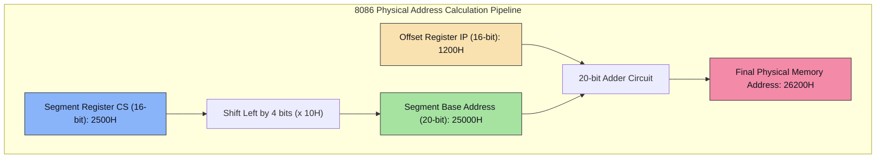
```mermaid
flowchart TD
    subgraph "8086 Physical Address Calculation Pipeline"
        CS["Segment Register CS (16-bit): 2500H"] --> Shift["Shift Left by 4 bits (x 10H)"]
        Shift --> Base["Segment Base Address (20-bit): 25000H"]
        IP["Offset Register IP (16-bit): 1200H"] --> Adder["20-bit Adder Circuit"]
        Base --> Adder
        Adder --> PA["Final Physical Memory Address: 26200H"]
    end

    style CS fill:#89b4fa,stroke:#333,color:#11111b
    style Base fill:#a6e3a1,stroke:#333,color:#11111b
    style IP fill:#f9e2af,stroke:#333,color:#11111b
    style PA fill:#f38ba8,stroke:#333,color:#11111b
```

---

### Problem 2: 8085 Hardware Interrupt Vector Calculation
**Question:** Calculate the vector interrupt jump location in memory for 8085 restart interrupts `RST 5`, `RST 6.5`, and `RST 7.5`.

**Step-by-Step Solution:**
1. **Formula:** $	ext{Vector Address} = (	ext{Interrupt Number}) 	imes 8_{10}$ converted to 16-bit Hexadecimal.
2. **For RST 5:**
   - $5 	imes 8 = 40_{10} = \mathbf{0028	ext{H}}$
3. **For RST 6.5:**
   - $6.5 	imes 8 = 52_{10} = \mathbf{0034	ext{H}}$
4. **For RST 7.5:**
   - $7.5 	imes 8 = 60_{10} = \mathbf{003C	ext{H}}$

| Interrupt Line | Trigger Type | Priority | Vector Address (Hex) | Maskable? |
| :--- | :--- | :--- | :--- | :--- |
| **TRAP (RST 4.5)** | Level + Edge | 1 (Highest) | `0024H` | Non-Maskable (NMI) |
| **RST 7.5** | Rising Edge | 2 | `003CH` | Maskable via `SIM` |
| **RST 6.5** | High Level | 3 | `0034H` | Maskable via `SIM` |
| **RST 5.5** | High Level | 4 | `002CH` | Maskable via `SIM` |
| **INTR** | High Level | 5 (Lowest) | Non-vectored (from Bus) | Maskable via `EI`/`DI` |

---

### Problem 3: 8259 PIC Vector Address Calculation
**Question:** If 8259 ICW1 is initialized with vector base address $T_7 - T_3 = 10000_2$ (`80H`), determine the interrupt vector address for Interrupt Request Line `IR3`.

**Step-by-Step Solution:**
1. **Vector Offset for IR3:** $3 	imes 4	ext{ bytes} = 12_{10} = 0C	ext{H}$ (or in 8086 mode, Vector Type Number = $	ext{Base Type} + 3$).
2. In 8086 mode, Type Number = $80	ext{H} + 3 = 83	ext{H}$.
3. Vector Table Entry Location = $83	ext{H} 	imes 4 = 20C	ext{H}$.
4. The 4 bytes at `0020CH` to `0020FH` store the 16-bit $	ext{IP}$ and 16-bit $	ext{CS}$ for IR3's Interrupt Service Routine (ISR).
