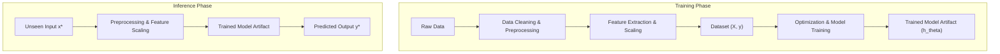
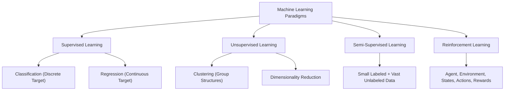
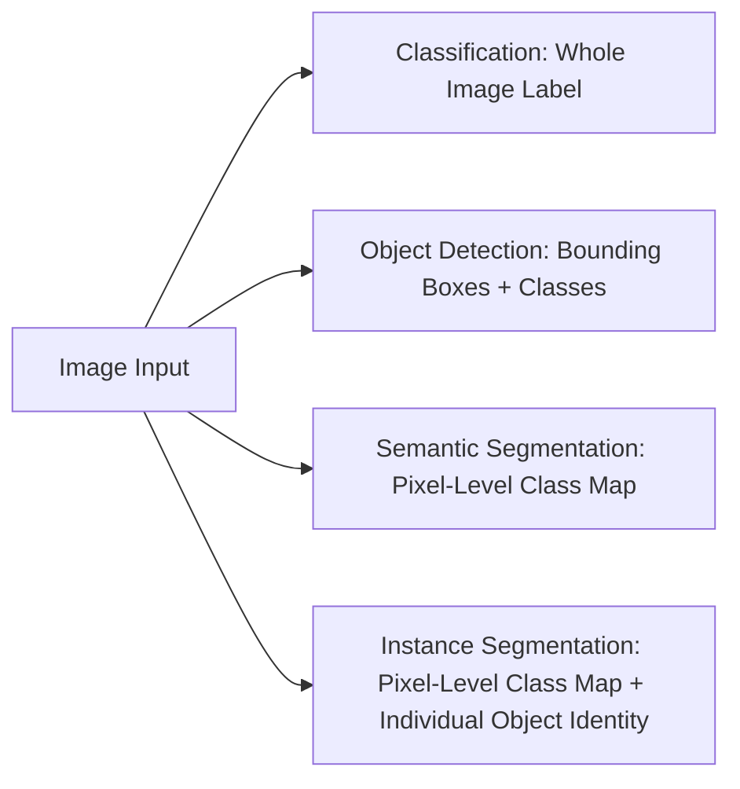
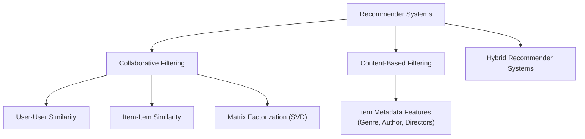

# Chapter 1: Introduction to Machine Learning & Applications

> **Course Title:** Machine Learning and its Applications
> **Source Material:** Faculty Lecture Slides - Nirma University (`1Machine Learning and its Applications.pdf`)

---

## 1. Chapter Overview
Machine Learning (ML) is the scientific discipline concerned with designing algorithms that automatically extract patterns, rules, and decision policies from empirical data without requiring bespoke, hand-crafted programming rules.

This foundational chapter covers:
- Epistemological Foundations: Artificial Intelligence (AI), Machine Learning (ML), Deep Learning (DL), and Data Science.
- Formal Definitions: Arthur Samuel and Tom Mitchell's $(T, E, P)$ framework.
- The End-to-End ML Pipeline: Training Phase vs. Inference Phase.
- Taxonomy of Machine Learning Paradigms: Supervised, Unsupervised, Semi-Supervised, and Reinforcement Learning.
- Computer Vision Hierarchy & Generative AI Models (GANs, CycleGAN, Pix2Pix, Inpainting, Pose Guidance).
- Personalized Recommender Systems (Collaborative vs Content-Based Filtering).
- Formula Sheet, Definition Sheet, and Exam-Oriented Review.

---

## 2. Epistemological Foundations: AI, ML, DL, and Data Science

- **Artificial Intelligence (AI):** Engineering computing systems capable of performing tasks typically requiring human intelligence (includes symbolic logic, expert systems, search trees).
- **Machine Learning (ML):** A subset of AI algorithms that learn decision rules automatically from empirical data.
- **Deep Learning (DL):** A specialized subset of ML utilizing multi-layer artificial neural networks for end-to-end feature learning directly from raw data.
- **Data Science:** Interdisciplinary field combining ML, statistics, data engineering, and domain expertise.

---

## 3. Formal Definitions of Machine Learning

### 3.1 Tom Mitchell's $(T, E, P)$ Triplet Framework
> "A computer program is said to **learn** from experience $E$ with respect to some class of tasks $T$ and performance measure $P$, if its performance at tasks in $T$, as measured by $P$, improves with experience $E$."

1. **Task ($T$):** The operational goal (e.g. classification, regression, control).
2. **Experience ($E$):** The empirical dataset or environmental interaction stream.
3. **Performance Measure ($P$):** Quantitative metric assessing execution quality (e.g., accuracy, MSE, win rate).

---

## 4. End-to-End Machine Learning Pipeline

---

## 5. Taxonomy of Machine Learning Paradigms

---

## 6. Computer Vision & Generative AI Models

- **Semantic Segmentation:** Classifies every pixel into a category without distinguishing separate instances.
- **Instance Segmentation:** Classifies every pixel AND assigns unique instance IDs to separate individual objects.
- **CycleGAN:** Learns bidirectional domain translation ($X \to Y$ and $Y \to X$) between unpaired images using **Cycle-Consistency Loss**.

---

## 7. Recommender System Architectures

---

## 8. Formula Sheet

- **Euclidean Distance ($L_2$ Norm):**

$$
d_2(\mathbf{x}^{(a)}, \mathbf{x}^{(b)}) = \sqrt{\sum_{j=1}^{d} (x_j^{(a)} - x_j^{(b)})^2}
$$

- **Mean Squared Error (MSE) Loss Function:**

$$
J(\theta) = \frac{1}{2m} \sum_{i=1}^{m} (h_\theta(\mathbf{x}^{(i)}) - y^{(i)})^2
$$

- **Cumulative Discounted Return (Reinforcement Learning):**

$$
R_t = \sum_{k=0}^{\infty} \gamma^k r_{t+k+1}
$$

---

## 9. Definition Sheet

1. **Machine Learning (Mitchell):** Learning from experience $E$ regarding task $T$ and performance $P$ if performance on $T$ measured by $P$ improves with $E$.
2. **Supervised Learning:** Inferring mapping $f: \mathcal{X} \to \mathcal{Y}$ from labeled input-output pairs.
3. **Unsupervised Learning:** Discovering latent patterns or clusters in unlabeled data $\mathbf{x}$.
4. **Cycle-Consistency Loss:** An objective in CycleGAN ensuring $F(G(x)) \approx x$ when converting back and forth between visual domains.

---

## 10. Exam-Oriented Review & Solved Numerical Problems

### Solved Numerical Problem 1: Euclidean Distance
Calculate the Euclidean distance between feature vectors $\mathbf{x}^{(1)} = [2, 5, 8]^T$ and $\mathbf{x}^{(2)} = [5, 1, 8]^T$.

**Step-by-Step Solution:**

$$
\begin{aligned}
d_2(\mathbf{x}^{(1)}, \mathbf{x}^{(2)}) &= \sqrt{(5 - 2)^2 + (1 - 5)^2 + (8 - 8)^2} \\
&= \sqrt{3^2 + (-4)^2 + 0^2} \\
&= \sqrt{9 + 16 + 0} = \sqrt{25} = \mathbf{5.0}
\end{aligned}
$$

---

### Solved Numerical Problem 2: Reinforcement Learning Discounted Return
An agent receives rewards $r_1 = +2, r_2 = -1, r_3 = 0, r_4 = +10$ over 4 time steps with discount factor $\gamma = 0.5$. Compute return $R_0$.

**Step-by-Step Solution:**

$$
\begin{aligned}
R_0 &= \sum_{k=0}^{3} \gamma^k r_{k+1} = \gamma^0 r_1 + \gamma^1 r_2 + \gamma^2 r_3 + \gamma^3 r_4 \\
&= (1.0)(2) + (0.5)(-1) + (0.25)(0) + (0.125)(10) \\
&= 2.0 - 0.5 + 0.0 + 1.25 = \mathbf{2.75}
\end{aligned}
$$
