# Complete Machine Learning Notes: Introduction and Applications

> **Course Code:** 3CS526CC23
> **Course Title:** Machine Learning and its Applications
> **Primary Source:** Faculty Lecture Slides - Nirma University
> **Files Integrated:** `1Machine Learning and its Applications.pdf` (87 Slides)

---

# Chapter 1 — Introduction to Machine Learning & Applications

## 1. Chapter Overview
Machine Learning (ML) is the scientific discipline concerned with designing algorithms that automatically extract patterns, rules, and decision policies from empirical data without requiring bespoke, hand-crafted programming rules. In traditional software engineering, human engineers formulate explicit symbolic rules and algorithms to process data inputs into computational outputs. In contrast, machine learning operates under an inverse inductive paradigm: algorithms ingest observational data alongside target outcomes to automatically discover, parameterize, and optimize the underlying governing function.

This foundational chapter establishes the structural, philosophical, mathematical, and practical bedrock of the entire subject:
1. **Academic Framework & Curriculum:** Teaching scheme, evaluation criteria, recommended foundational literature, and practical laboratory roadmap.
2. **Epistemological Foundations:** The hierarchical boundaries between Artificial Intelligence (AI), Machine Learning (ML), Deep Learning (DL), and Data Science; foundational definitions (Arthur Samuel, Tom Mitchell); and formal $(T, E, P)$ problem formulations.
3. **The End-to-End ML Pipeline:** Detailed comparative decomposition of the **Training Phase** and the **Inference Phase**.
4. **Taxonomy of Machine Learning Paradigms:** Formal definitions, operational objectives, and comparative properties of Supervised Learning, Unsupervised Learning, Semi-Supervised Learning, and Reinforcement Learning.
5. **Real-World Domains & Deep Generative Vision Applications:** Deep dives into tasks that cannot be programmed by hand—including Natural Language Processing, Generative Adversarial Networks (CycleGAN, Pix2Pix, DiscoGAN, Age-cGAN, Inpainting, Pose Guidance), Computer Vision segmentation hierarchies (Semantic vs. Instance), and Personalized Recommender Systems.
6. **Consolidated Reference Materials:** Formula sheet, formal definition dictionary, and an extensive exam-oriented review section.

[Source: 1Machine Learning and its Applications.pdf, Slides 1–18]

---

## 2. Academic Framework & Curriculum Context
[Source: 1Machine Learning and its Applications.pdf, Slides 1–8]

### 2.1 Course Structure and Evaluation Scheme
The course *Machine Learning and its Applications* (Course Code: 3CS526CC23) is architected to balance rigorous statistical foundation with applied software implementation.

#### Teaching Scheme:
- **Lectures:** 3 Hours / Week
- **Laboratory Practical Sessions (LPW):** 2 Hours / Week
- **Course Credits:** 4 Credits

#### Evaluation Methodology:
- **Continuous Evaluation (CE):** Quizzes, assignments, and class participation.
- **Laboratory Practical Work (LPW):** Progressive evaluation of hands-on implementations, lab reports, and viva-voce.
- **Semester End Examination (SEE):** Comprehensive theoretical and analytical examination covering algorithmic derivations, proofs, and design problems.

---

### 2.2 Recommended Literature and References
The course curriculum is anchored in internationally recognized foundational textbooks:

1. **Tom Mitchell**, *Machine Learning*, McGraw-Hill Education (TMH). (Primary reference for $(T, E, P)$ definitions, concept learning, decision trees, and Bayesian learning).
2. **Christopher M. Bishop**, *Pattern Recognition and Machine Learning*, Springer. (Standard text for Bayesian probabilities, regression, and kernel methods).
3. **Ethem Alpaydin**, *Introduction to Machine Learning*, MIT Press. (Comprehensive coverage of statistical learning, supervised/unsupervised algorithms).
4. **Ian Goodfellow, Yoshua Bengio, and Aaron Courville**, *Deep Learning*, MIT Press. (Definitive reference for deep neural networks, representation learning, and generative models).
5. **Aurélien Géron**, *Hands-On Machine Learning with Scikit-Learn, Keras, and TensorFlow*, O'Reilly Media. (Practical implementation guide for production ML workflows).

### Figure 1.1: Recommended Textbooks

---

### 2.3 Laboratory Curriculum Roadmap
The practical laboratory assignments are engineered to translate mathematical theory into robust code:
- **Practical 1:** Exploratory Data Analysis (EDA) and text feature extraction (e.g., downloading annual reports, tokenization, stop-word filtering, term frequency analysis).
- **Practical 2:** Implementing Simple and Multivariate Linear Regression from scratch with Gradient Descent and Normal Equation.
- **Practical 3:** Regularization techniques (Ridge, Lasso) and bias-variance tradeoff diagnostics.
- **Practical 4:** Supervised Classification algorithms (K-Nearest Neighbors, Naïve Bayes, Decision Trees ID3/CART).
- **Practical 5:** Unsupervised Clustering (K-Means, Hierarchical) and Dimensionality Reduction (PCA).

[Source: 1Machine Learning and its Applications.pdf, Slides 2–8]

---

## 3. Epistemological Foundations: AI, ML, DL, and Data Science
[Source: 1Machine Learning and its Applications.pdf, Slides 9–11]

### 3.1 Hierarchical Boundaries and Venn Diagram
A pervasive source of confusion in computer science is the conflation of Artificial Intelligence, Machine Learning, Deep Learning, and Data Science. These fields form nested sub-disciplines with distinct scopes and methodologies.

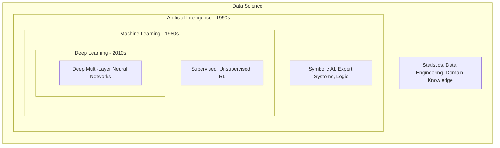

### Figure 1.2: AI, ML, DL, and Data Science Relationships
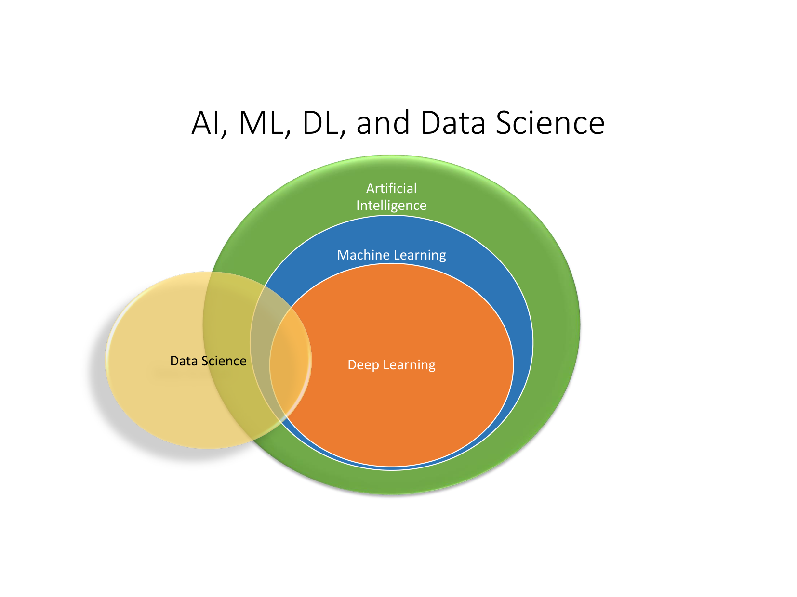

**Written Analysis of Figure 1.2:**
- **Artificial Intelligence (AI):** The broadest umbrella discipline, initiated in the 1950s, aiming to engineer computing machines capable of performing tasks typically requiring human intelligence. This includes non-learning symbolic logic, knowledge graphs, heuristic search algorithms (e.g., $A^*$, minimax), and rule-based expert systems.
- **Machine Learning (ML):** A specific subset of AI that emerged prominently in the 1980s, discarding hard-coded symbolic logic in favor of statistical, data-driven algorithms that improve performance through experience.
- **Deep Learning (DL):** A specialized subset of ML characterized by deep artificial neural network architectures (multiple hidden layers) capable of end-to-end representation learning directly from raw, unstructured sensory data (pixels, audio waveforms, text).
- **Data Science:** An interdisciplinary field combining ML, statistics, data engineering, data visualization, and domain expertise to extract actionable business insights from structured and unstructured big data.

---

### 3.2 Formal Definitions of Machine Learning

#### Definition 1: Arthur Samuel (1959)
> "Machine Learning is the field of study that gives computers the ability to learn without being explicitly programmed."

*Intuition:* Samuel coined the phrase while developing a self-learning Checkers playing program that learned by playing against itself, discovering heuristic strategies superior to its creator's explicit programming capability.

---

#### Definition 2: Tom M. Mitchell (1997) — The Operational Engineering Definition
> "A computer program is said to **learn** from experience $E$ with respect to some class of tasks $T$ and performance measure $P$, if its performance at tasks in $T$, as measured by $P$, improves with experience $E$."

### Formal Structure of Mitchell's Triplet $(T, E, P)$:
Every valid machine learning problem must be formally translatable into this three-part mathematical specification:
1. **Task ($T$):** The specific operational function the program must execute (e.g., classification, regression, control, anomaly detection).
2. **Experience ($E$):** The empirical dataset, historical interactions, sensory feedback, or self-play trials provided to the learning algorithm.
3. **Performance Measure ($P$):** A quantitative, mathematically defined evaluation metric assessing how effectively the program executes task $T$ (e.g., accuracy, mean squared error, win rate).

---

### 3.3 Concrete Case Studies of the $(T, E, P)$ Triplet

#### Case Study 1: Checkers / Chess Playing Agent
- **Task ($T$):** Playing the game of Checkers (selecting optimal legal board moves).
- **Experience ($E$):** Playing hundreds of thousands of self-play games against cloned iterations of itself.
- **Performance Measure ($P$):** Percentage of games won against human grandmasters or a standardized benchmark pool of tournament opponents.

#### Case Study 2: Autonomous Self-Driving Vehicle
- **Task ($T$):** Navigating an automobile safely along public roadways with real-time steering, throttle, and braking controls.
- **Experience ($E$):** Sequences of multi-modal sensor streams (LiDAR point clouds, RADAR, stereoscopic cameras, ultrasonic telemetry) recorded over millions of miles of human driving.
- **Performance Measure ($P$):** Average distance traveled before requiring human safety intervention; passenger safety score; adherence to traffic regulations.

#### Case Study 3: Automated Spam Email Filter
- **Task ($T$):** Assigning binary labels ($\{\text{Spam}, \text{Ham}\}$) to incoming electronic mail messages.
- **Experience ($E$):** A historical database of user-flagged emails containing header metadata, body text tokens, and ground-truth classification labels.
- **Performance Measure ($P$):** Classification precision, recall, and F1-score; specifically minimizing false positive errors (misrouting legitimate emails to the junk folder).

#### Case Study 4: Automated Medical Radiography Diagnostics
- **Task ($T$):** Detecting malignant pulmonary nodules on chest computed tomography (CT) scans.
- **Experience ($E$):** A repository of annotated, biopsy-confirmed CT scans with radiologist boundary segmentations.
- **Performance Measure ($P$):** Diagnostic sensitivity (recall for tumor detection) and Area Under the Receiver Operating Characteristic Curve (AU-ROC).

[Source: 1Machine Learning and its Applications.pdf, Slides 10–11]

---

## 4. Core Terminology Dictionary

1. **Feature Vector ($\mathbf{x}$):** An ordered $d$-dimensional vector of numerical or categorical measurements representing measurable properties of an observed entity: $\mathbf{x} = (x_1, x_2, \dots, x_d)^T \in \mathcal{X}$.
2. **Target Label ($y$):** The ground-truth outcome or dependent variable associated with an instance: $y \in \mathbb{R}$ for regression, $y \in \{C_1, \dots, C_K\}$ for classification.
3. **Training Set ($\mathcal{D}_{\text{train}}$):** The empirical dataset $\{(\mathbf{x}^{(i)}, y^{(i)})\}_{i=1}^m$ utilized by the optimization algorithm to parameterize the model.
4. **Test Set ($\mathcal{D}_{\text{test}}$):** A strictly held-out partition of data never exposed during training, used exclusively to assess out-of-sample generalization.
5. **Inductive Bias:** The set of prior assumptions, mathematical structures, or constraints that a machine learning algorithm incorporates to predict outputs for unseen inputs.
6. **Generalization:** The capability of an induced model to accurately predict labels for novel, out-of-sample instances drawn from the same underlying probability distribution.
7. **Overfitting:** The statistical pathology where a model with excessive capacity fits training noise and idiosyncratic quirks, yielding low training error but disastrous test error.
8. **Underfitting:** The condition where a model has insufficient capacity to capture the underlying structural patterns in data, performing poorly on both training and test sets.
9. **Supervised Learning:** A learning regime where every training input $\mathbf{x}^{(i)}$ is paired with an explicit supervisory ground-truth label $y^{(i)}$.
10. **Unsupervised Learning:** A regime where algorithms uncover latent geometry, density distributions, or cluster memberships without external labels.
11. **Semi-Supervised Learning:** An approach leveraging a small volume of labeled data combined with a vast corpus of unlabeled data to improve mapping accuracy.
12. **Reinforcement Learning:** An agent-oriented framework where an agent learns an action policy by interacting dynamically with an environment through reward signals.
13. **Markov Decision Process (MDP):** The formal mathematical framework for reinforcement learning defined by a 5-tuple $(S, A, P, R, \gamma)$.
14. **Discount Factor ($\gamma$):** A scalar factor $\gamma \in [0, 1)$ balancing the relative importance of immediate rewards against future rewards.
15. **Generative Adversarial Network (GAN):** A framework pitting two neural networks—a Generator $G$ and a Discriminator $D$—in a minimax zero-sum game.
16. **Cycle-Consistency Loss:** An objective ensuring that transforming an image from domain $A$ to $B$ and back to $A$ recovers the original input: $F(G(x)) \approx x$.
17. **Semantic Segmentation:** The computer vision task of classifying every single pixel into a predefined semantic class without distinguishing object instances.
18. **Instance Segmentation:** The vision task of detecting, segmenting, and individually identifying separate object instances within each semantic category.
19. **Collaborative Filtering:** A recommender system technique making predictions about a user's interests by collecting preferences from many users.
20. **Content-Based Filtering:** Recommending items similar to those a user previously preferred, based entirely on descriptive feature attributes of the items.

[Source: 1Machine Learning and its Applications.pdf, Slides 9–86]

---

## 5. The End-to-End Machine Learning Lifecycle
[Source: 1Machine Learning and its Applications.pdf, Slides 12–15]

A machine learning system does not exist as a static algorithm; it operates within an iterative, two-phase computational lifecycle: the **Training Phase** and the **Inference / Prediction Phase**.

### 5.1 The Training Phase
The objective of the training phase is to search through the hypothesis space $\mathcal{H}$ to discover optimal parameter settings $\theta^*$ that minimize an empirical loss objective.
1. **Data Ingestion & Cleaning:** Eliminating corrupt samples, handling missing attributes, imputing noisy measurements.
2. **Feature Extraction / Engineering:** Mapping raw observational inputs into meaningful mathematical feature vectors $\mathbf{x} \in \mathbb{R}^d$.
3. **Training Set Formulation:** Formulating pairs $(\mathbf{x}^{(i)}, y^{(i)})$ for $i = 1, \dots, m$.
4. **Optimization Loop:** Feeding training instances through the model hypothesis $h_\theta(\mathbf{x})$, calculating prediction discrepancies via a loss function $L(h_\theta(\mathbf{x}), y)$, and calculating parameter gradients to update weights $\theta$.
5. **Model Artifact Export:** Freezing the optimized parameter weights into a deployable compiled model artifact.

### Figure 1.3: The Machine Learning Training Phase
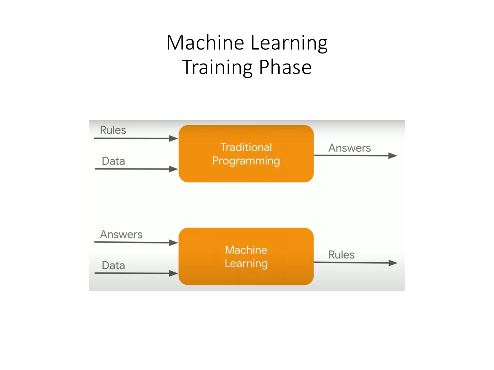

---

### 5.2 The Inference / Prediction Phase
In production deployment, the model operates on novel, real-world query instances $\mathbf{x}^*$ whose true target values are unknown.
1. **Feature Consistency:** Incoming raw samples must undergo the exact same transformation pipeline (mean normalization factors, vocabulary indexings, scaling parameters) calculated during the training phase. Never re-fit feature scalers on inference data!
2. **Forward Hypothesis Evaluation:** The compiled model evaluates $\hat{y}^* = h_{\theta^*}(\mathbf{x}^*)$ in low-latency forward propagation ($O(1)$ to $O(d)$).
3. **Decision & Action:** In classification, outputting a class label $\hat{y} \in \{C_1, \dots, C_K\}$; in regression, outputting a continuous real number $\hat{y} \in \mathbb{R}$.
4. **Performance Monitoring:** Collecting delayed feedback (e.g., whether the user clicked the recommended link or whether a transaction was disputed) to monitor for data drift and model degradation.

### Figure 1.4: The Machine Learning Inference Phase

[Source: 1Machine Learning and its Applications.pdf, Slides 12–15]

---

## 6. Taxonomy of Machine Learning Paradigms
[Source: 1Machine Learning and its Applications.pdf, Slides 16–18, 36–55]

Machine learning algorithms are categorized into four major foundational paradigms based on the nature of the learning feedback signal:

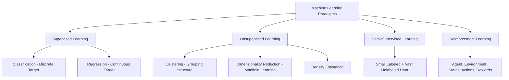

### 6.1 Supervised Learning: Classification vs. Regression

In supervised learning, the training set consists of $m$ input-output exemplars:

$$
\mathcal{D} = \left\{ (\mathbf{x}^{(1)}, y^{(1)}), (\mathbf{x}^{(2)}, y^{(2)}), \dots, (\mathbf{x}^{(m)}, y^{(m)}) \right\}
$$

The learning algorithm seeks an optimal function $h: \mathcal{X} \to \mathcal{Y}$ such that prediction error is minimized.

#### 1. Classification (Discrete Target Spaces):
The target space consists of discrete, unordered categorical classes: $y \in \{C_1, C_2, \dots, C_K\}$.
- **Binary Classification ($K = 2$):** $y \in \{0, 1\}$ or $y \in \{-1, +1\}$.
  - *Examples:* Benign vs. Malignant tumor diagnosis, Spam vs. Ham email classification, Credit card fraud detection (Fraudulent vs. Legitimate).
- **Multiclass Classification ($K > 2$):** $y \in \{1, 2, \dots, K\}$, where each instance belongs to exactly one class.
  - *Examples:* Handwritten digit recognition (MNIST $0-9$), automated vehicle classification (Sedan, SUV, Truck, Motorcycle).
- **Multilabel Classification:** Each instance may be simultaneously assigned multiple non-exclusive labels.
  - *Example:* Tagging an article with multiple topics (`Technology`, `Politics`, `Finance`).

### Figure 1.5: Classification Decision Boundary

#### 2. Regression (Continuous Target Spaces):
The target space is real-valued and continuous: $y \in \mathbb{R}$ (or $y \in \mathbb{R}^k$ for multi-output regression).
- *Mathematical Objective:* Estimate a mapping function $f(\mathbf{x}) = \hat{y}$ that minimizes a distance metric, typically Mean Squared Error (MSE):

$$
J(\theta) = \frac{1}{2m} \sum_{i=1}^{m} (h_\theta(\mathbf{x}^{(i)}) - y^{(i)})^2
$$

- *Examples:* Real estate valuation based on square footage and location, stock price forecasting, temperature and precipitation level prediction.

### Figure 1.6: Regression Curve Fitting

---

### 6.2 Unsupervised Learning: Discovering Latent Structure
In unsupervised learning, the algorithm receives only feature vectors $\mathbf{x}^{(i)}$ without any supervisory ground-truth target labels $y^{(i)}$:

$$
\mathcal{D} = \left\{ \mathbf{x}^{(1)}, \mathbf{x}^{(2)}, \dots, \mathbf{x}^{(m)} \right\}
$$

The goal is to discover inherent statistical structure, geometric manifolds, or underlying generative groupings.

#### 1. Clustering:
Partitioning $m$ unlabeled observations into $K$ distinct, non-overlapping clusters such that intra-cluster point similarity is maximized and inter-cluster similarity is minimized.
- **Algorithms:** K-Means Clustering, Hierarchical Agglomerative Clustering, DBSCAN.
- **Applications:** Customer market segmentation, document topic grouping, gene expression profiling.

### Figure 1.7: Unsupervised Clustering Latent Structure

#### 2. Dimensionality Reduction:
Transforming high-dimensional feature vectors $\mathbf{x} \in \mathbb{R}^D$ into a lower-dimensional latent space $\mathbf{z} \in \mathbb{R}^d$ ($d \ll D$) while retaining maximal statistical information (variance) or preserving neighborhood topologies.
- **Algorithms:** Principal Component Analysis (PCA), Linear Discriminant Analysis (LDA), t-Distributed Stochastic Neighbor Embedding (t-SNE), UMAP.
- **Applications:** Data visualization of multi-thousand-gene arrays, image compression, feature orthogonalization to eliminate multicollinearity.

### Figure 1.8: Dimensionality Reduction via PCA

---

### 6.3 Semi-Supervised Learning
Semi-supervised learning addresses scenarios where acquiring unlabeled data is inexpensive (e.g., scraping millions of medical X-rays or web pages), but acquiring expert annotations is cost-prohibitive.
- **Dataset Structure:** A tiny labeled subset $\mathcal{D}_L = \{(\mathbf{x}^{(i)}, y^{(i)})\}_{i=1}^{m_l}$ combined with an enormous unlabeled corpus $\mathcal{D}_U = \{\mathbf{x}^{(j)}\}_{j=m_l+1}^{m_l + m_u}$ ($m_u \gg m_l$).
- **Core Hypothesis (Cluster / Manifold Assumption):** If two points $\mathbf{x}_1, \mathbf{x}_2$ reside within the same high-density cluster or geometric manifold in the unlabeled data, their class labels are highly likely to be identical.
- **Techniques:** Pseudo-labeling, self-training, graph-based label propagation, generative semi-supervised models.

---

### 6.4 Reinforcement Learning (RL)
Reinforcement learning operates under an agent-environment feedback loop where learning is guided by sequential trial-and-error interaction rather than static datasets.

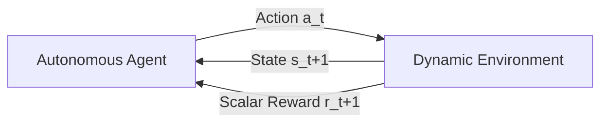

#### Formal Mathematical Specification (Markov Decision Process):
An RL problem is formalized as a Markov Decision Process (MDP) defined by the 5-tuple:

$$
\mathcal{M} = \langle \mathcal{S}, \mathcal{A}, \mathcal{P}, \mathcal{R}, \gamma \rangle
$$

Where:
- $\mathcal{S}$: Set of all permissible environment **States**.
- $\mathcal{A}$: Set of all permissible **Actions** the agent can execute.
- $\mathcal{P}(s_{t+1} \mid s_t, a_t)$: State transition probability distribution.
- $\mathcal{R}(s_t, a_t)$: Immediate scalar **Reward** returned by the environment.
- $\gamma \in [0, 1)$: **Discount Factor** weighting future rewards against immediate gains.

#### Objective:
Learn an optimal behavioral policy $\pi^*(a \mid s)$ that maximizes the expected cumulative discounted return $R_t$:

$$
R_t = \sum_{k=0}^{\infty} \gamma^k r_{t+k+1}
$$

*Benchmark Applications:* Mastering complex games without human data (AlphaGo, AlphaZero, Atari), robotic locomotion control, autonomous drone acrobatic maneuvers, algorithmic stock market trading execution.

---

### 6.5 Comprehensive Comparison Matrix of the Four Paradigms

| Feature | Supervised Learning | Unsupervised Learning | Semi-Supervised Learning | Reinforcement Learning |
| :--- | :--- | :--- | :--- | :--- |
| **Training Data** | Fully labeled pairs $(\mathbf{x}^{(i)}, y^{(i)})$ | Unlabeled feature vectors $\mathbf{x}^{(i)}$ | Small labeled $\mathcal{D}_L$ + large unlabeled $\mathcal{D}_U$ | Environment states $s_t$ & scalar rewards $r_t$ |
| **Feedback Signal** | Explicit direct supervision (ground truth label) | No external supervision; self-organizing | Partial supervision propagated through density manifolds | Delayed evaluative scalar reward signals |
| **Core Goal** | Infer mapping function $f: \mathcal{X} \to \mathcal{Y}$ | Uncover geometric manifolds, clusters, or density | Improve decision boundary using data density | Optimize action policy $\pi(a \mid s)$ |
| **Core Tasks** | Classification, Regression | Clustering, Dimensionality Reduction | Semi-supervised classification | Q-learning, Policy Gradients, Actor-Critic |
| **Data Cost** | High (demands human annotation) | Low (uses raw uncurated data) | Moderate (balances label cost) | Environment simulation or execution cost |
| **Benchmark Problems** | House price prediction, spam filter | Customer segmentation, PCA visualization | Medical diagnostics with few labeled biopsies | Chess, Go, autonomous robotic control |

[Source: 1Machine Learning and its Applications.pdf, Slides 16–18]

---

## 7. Real-World Applications That Cannot Be Programmed By Hand
[Source: 1Machine Learning and its Applications.pdf, Slides 19–85]

Traditional rule-based algorithms operate via deterministically hand-coded `if-then` logical statements. However, for perceptual sensory tasks (vision, speech, natural language), creating explicit hand-crafted rules is impossible due to infinite combinatorial variations in lighting, orientation, background clutter, vocabulary nuance, and physiological morphology. Machine learning solves these intractable challenges.

### 7.1 Natural Language Processing (NLP)
1. **Statistical Machine Translation (SMT) & Neural MT:** Mapping sentences between human languages (e.g., English to Hindi) capturing idioms, gender concordance, and semantic context.
2. **Sentiment Analysis:** Classifying customer reviews, financial earnings calls, or social media posts into valence states (Positive, Neutral, Negative).
3. **Information Extraction & Named Entity Recognition (NER):** Detecting and extracting structured domain entities (e.g., Person names, Geopolitical entities, Gene sequences, Monetary amounts) from uncurated corpora.
4. **Automated Abstractive Text Summarization:** Ingesting lengthy corporate annual reports or legal contracts and synthesizing concise, grammatically coherent executive summaries.
5. **Speech Recognition (Acoustic-to-Text):** Mapping continuous analog audio waveforms into discrete orthographic text tokens across varied accents and background ambient acoustic noise.

[Source: 1Machine Learning and its Applications.pdf, Slides 19–25]

---

### 7.2 Deep Generative Models & Advanced Computer Vision

#### 1. Photorealistic Human Face Synthesis (StyleGAN)
Pioneered by Goodfellow et al. (2014) and advanced by Karras et al. (Progressive GAN, StyleGAN), Generative Adversarial Networks synthesize photorealistic $1024 \times 1024$ facial images of non-existent people by mapping a latent noise vector $\mathbf{z} \sim \mathcal{N}(\mathbf{0}, \mathbf{I})$ through a generator network $G(\mathbf{z})$ that fools a discriminator $D(\mathbf{x})$.

#### 2. Pose-Guided Person Image Generation
Synthesizes novel images of a person in arbitrary arbitrary target postures while strictly preserving person identity, facial geometry, and clothing textures, given an input photo and a 2D skeletal landmark target.

### Figure 1.9: Pose Guided Person Image Generation
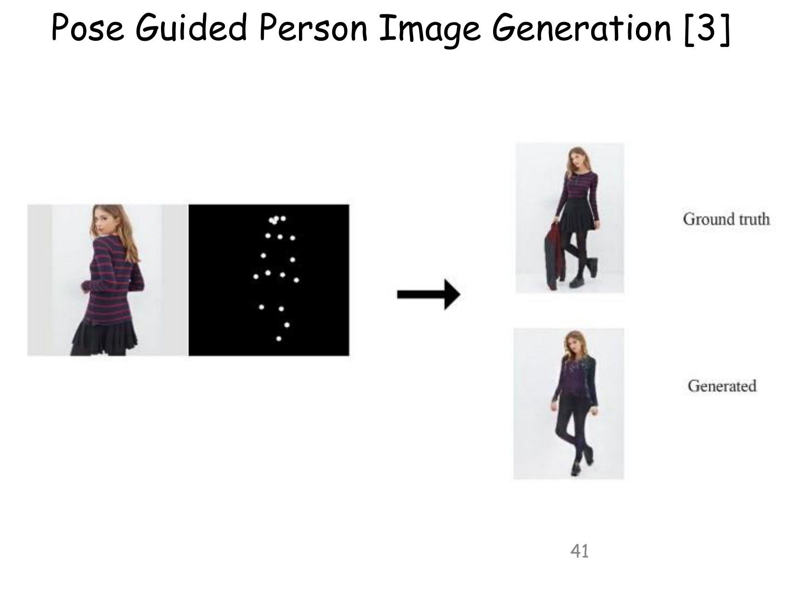

#### 3. Unpaired Image-to-Image Translation (CycleGAN)
Traditional conditional GANs require paired training datasets (e.g., photo $A$ exactly registered with photo $B$). CycleGAN (Zhu et al., 2017) resolves this by learning bidirectional mappings between two unpaired visual domains $X$ and $Y$ using a **Cycle-Consistency Loss**:

$$
\mathcal{L}_{\text{cycle}}(G, F) = \mathbb{E}_{x \sim p_{\text{data}}(x)} [\|F(G(x)) - x\|_1] + \mathbb{E}_{y \sim p_{\text{data}}(y)} [\|G(F(y)) - y\|_1]
$$

Where $G: X \to Y$ translates domain $X$ to $Y$, and $F: Y \to X$ translates $Y$ back to $X$.
*Classic Demonstrations:* Transforming horses into zebras, summer landscapes into winter snowscapes, and real-world photographs into Monet impressionist paintings.

### Figure 1.10: CycleGAN Unpaired Translation
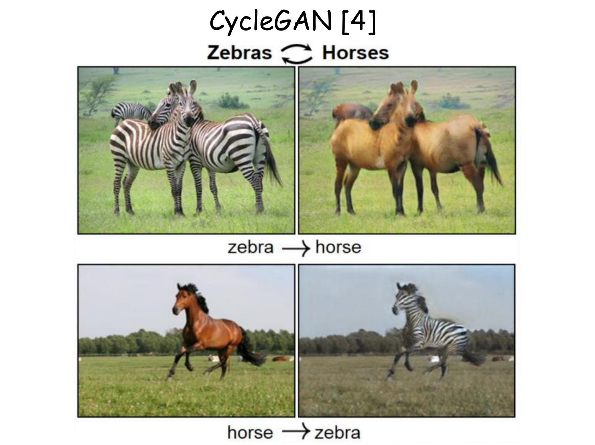

#### 4. Context-Aware Image Inpainting
Automatically fills in missing, damaged, or masked visual regions in an image using deep convolutional context encoders, synthesizing plausible high-frequency textures that blend seamlessly into surrounding pixel boundaries.

### Figure 1.11: Image Inpainting
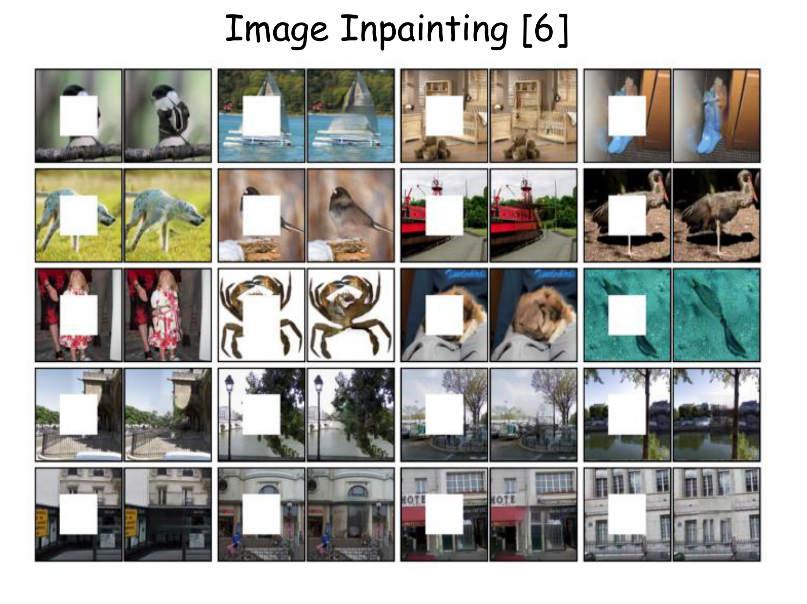

#### 5. Paired Image Translation (Pix2Pix)
Utilizes conditional GANs (cGAN) to learn direct mappings from input images to output images across structurally aligned pairs:
- Architectural sketches $\to$ photorealistic building facades.
- Cartographic aerial satellite imagery $\to$ standard road maps.
- Day photographs $\to$ nighttime lighting scenes.

### Figure 1.12: Pix2Pix Paired Translation
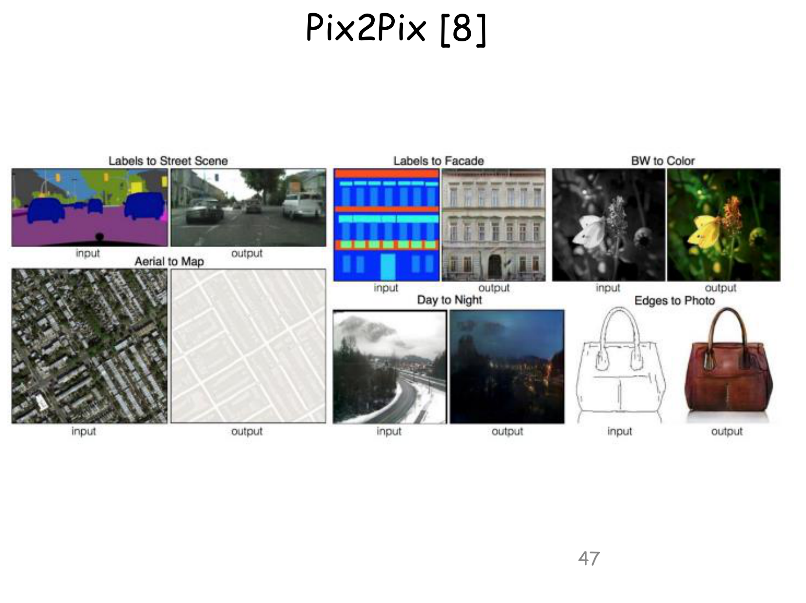

#### 6. Age-Conditional Face Synthesis (Age-cGAN)
Permits controlled synthetic facial aging and rejuvenation. By conditioning the generative process on target age brackets while enforcing biometric latent vector identity loss, the model visualizes how a person will look decades into the future.

#### 7. Unsupervised Domain Adaptation by Backpropagation
Solves domain shift where an algorithm trained on synthetic or laboratory-labeled datasets (e.g., CAD models or GTA V videogame driving footage) fails when deployed on real-world target environments. Using a gradient reversal layer, the model learns domain-invariant representations that align source and target feature distributions.

### Figure 1.13: Domain Adaptation Architecture
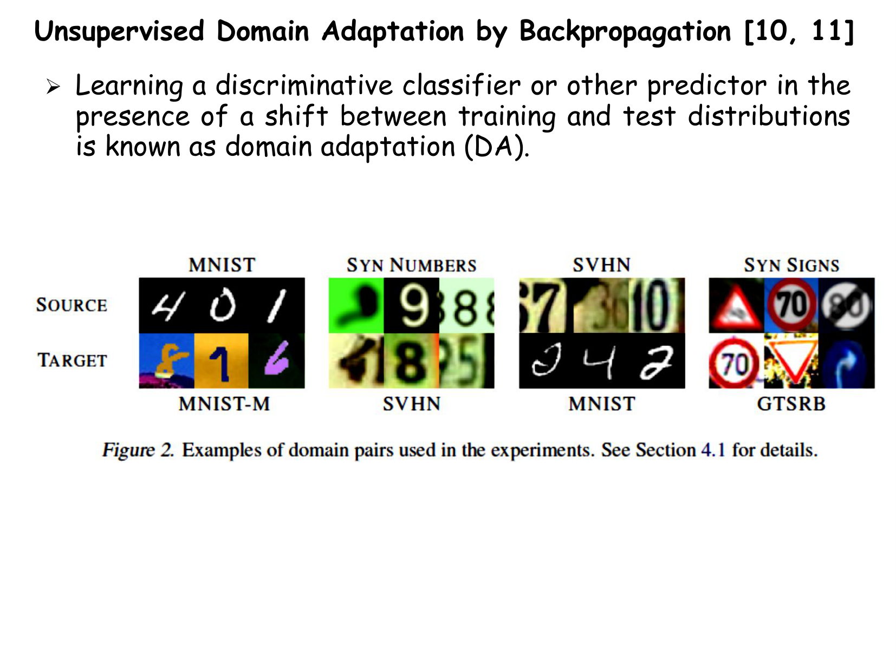

---

### 7.3 Computer Vision Segmentation Hierarchy

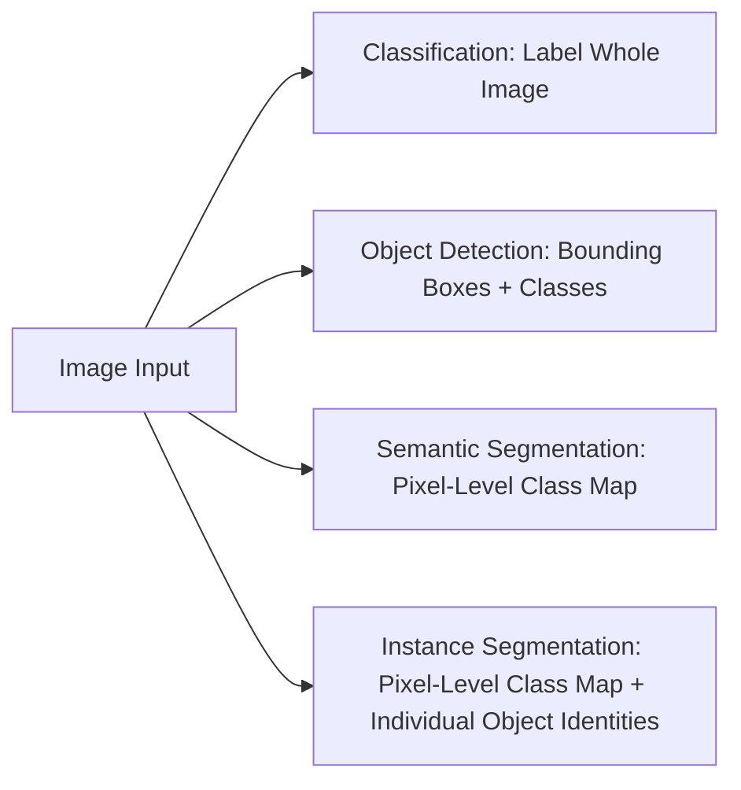

### Figure 1.14: Semantic vs. Instance Segmentation
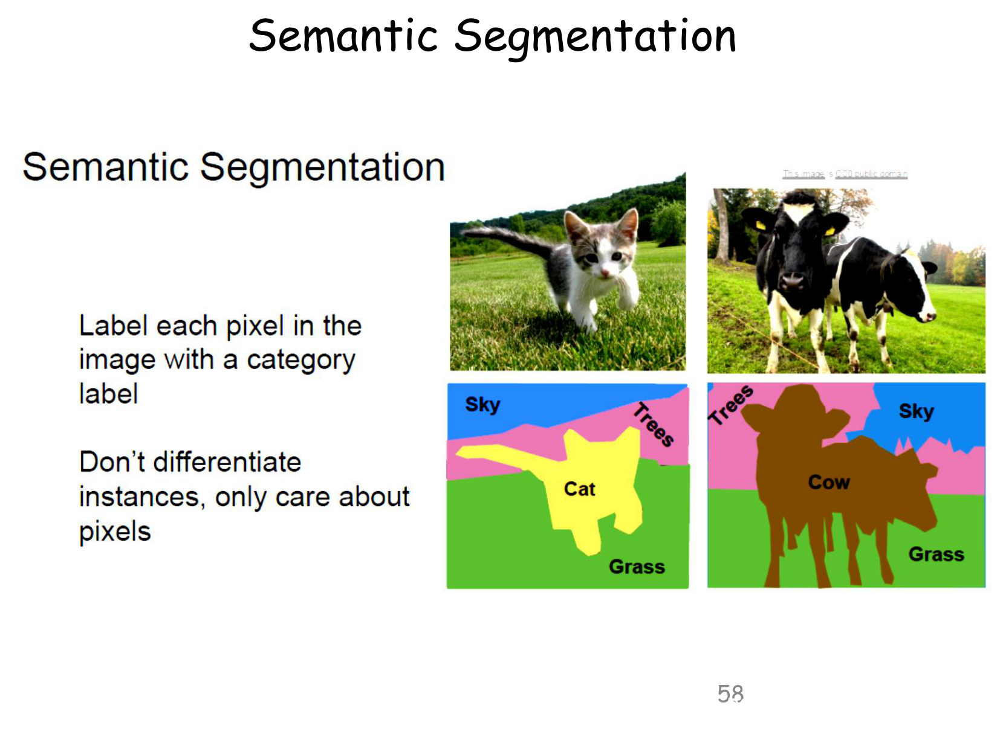
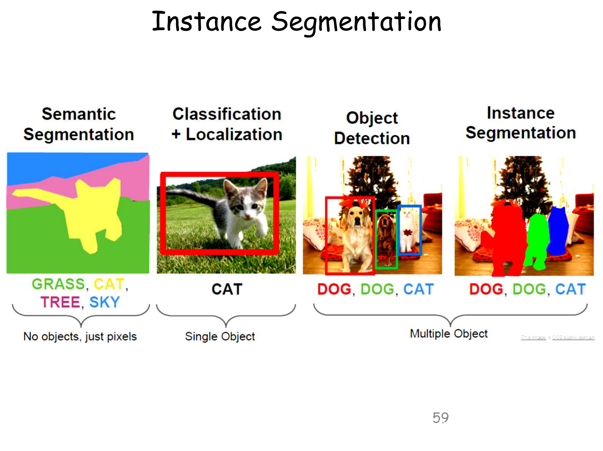

#### Comparative Analysis of Vision Tasks:

| Vision Task | Output Format | Distinguishes Separate Instances? | Typical Benchmark Problem |
| :--- | :--- | :---: | :--- |
| **Image Classification** | Single categorical class label for entire image | No | Is there a cat in this picture? |
| **Object Detection** | Bounding box coordinates $[x, y, w, h]$ + class label | Yes | Locate all pedestrian boxes in street view |
| **Semantic Segmentation** | Dense pixel-level categorical label map | **No** (all cars share identical color) | Drivable road surface vs. sidewalk vs. sky |
| **Instance Segmentation** | Dense pixel-level mask for each individual object | **Yes** (Car 1, Car 2, Car 3 have distinct masks) | Autonomous navigation tracking individual pedestrians |

[Source: 1Machine Learning and its Applications.pdf, Slides 56–59]

---

### 7.4 Personalized Recommender Systems
[Source: 1Machine Learning and its Applications.pdf, Slides 66–85]

Recommender systems overcome digital information overload by learning user preference mappings over millions of commercial catalog items.

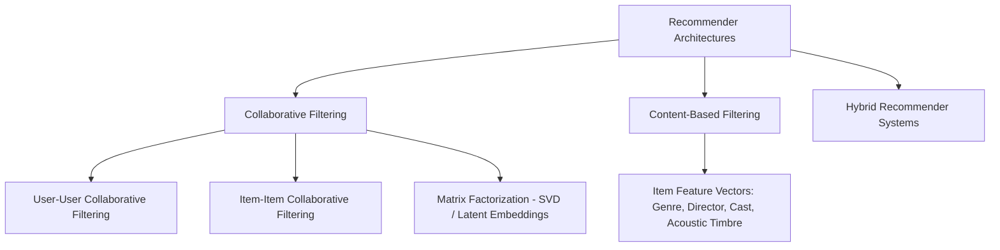

#### 1. Collaborative Filtering (CF):
Operates under the assumption that users who agreed on item evaluations in the past will agree in the future.
- **Mechanism:** Builds a sparse user-item utility matrix $R \in \mathbb{R}^{M \times N}$. Predicts missing entries by identifying nearest neighbor users (User-User CF) or calculating cosine similarity between rating vectors of items (Item-Item CF).
- **Matrix Factorization (SVD):** Decomposes $R \approx U \cdot V^T$, projecting users and items into a shared low-dimensional latent space.
- *Advantage:* Completely domain-independent; requires no understanding of item contents (e.g., can recommend music without analyzing audio files).
- *Disadvantage:* **Cold-Start Problem** (cannot recommend newly introduced items with zero historical ratings).

#### 2. Content-Based Filtering:
Recommends items whose descriptive metadata features align with the user's historical profile.
- *Advantage:* Highly effective for newly added items with zero historical ratings.
- *Disadvantage:* Tends to over-specialize, trapping users in recommendation "filter bubbles".

#### 3. Music Recommender Systems:
Music presents unique challenges due to short consumption duration, emotional context, and passive listening.
- **Acoustic Audio Feature Extraction:** Raw audio waveforms are processed via Short-Time Fourier Transform (STFT) into Mel-Frequency Spectrograms. Deep Convolutional Neural Networks extract acoustic timbre, rhythm, key, tempo, and vocal presence.
- **Hybrid Fusion:** Fusing acoustic audio embeddings with collaborative filtering interaction vectors to construct dynamic, session-aware playlists.

### Figure 1.15: Music Recommender System Architecture

[Source: 1Machine Learning and its Applications.pdf, Slides 66–85]

---

## 8. Consolidated Formula Sheet

### 1. Euclidean Distance Metric ($L_2$ Norm)

$$
d_2(\mathbf{x}^{(a)}, \mathbf{x}^{(b)}) = \sqrt{\sum_{j=1}^{d} (x_j^{(a)} - x_j^{(b)})^2} = \|\mathbf{x}^{(a)} - \mathbf{x}^{(b)}\|_2
$$

- Where $\mathbf{x}^{(a)}, \mathbf{x}^{(b)} \in \mathbb{R}^d$ are feature vectors. Assumes features are pre-standardized.

### 2. Mean Squared Error (MSE) Loss Function

$$
J(\theta) = \frac{1}{2m} \sum_{i=1}^{m} (h_\theta(\mathbf{x}^{(i)}) - y^{(i)})^2
$$

- Where $m$ is the number of training instances, $h_\theta(\mathbf{x})$ is model prediction, and $y$ is actual ground truth.

### 3. Binary Classification Cross-Entropy Loss

$$
J(\theta) = -\frac{1}{m} \sum_{i=1}^{m} \left[ y^{(i)} \ln(h_\theta(\mathbf{x}^{(i)})) + (1 - y^{(i)}) \ln(1 - h_\theta(\mathbf{x}^{(i)})) \right]
$$

### 4. Cumulative Discounted Return (Reinforcement Learning)

$$
R_t = \sum_{k=0}^{\infty} \gamma^k r_{t+k+1}
$$

- Where $r_{t+k+1}$ is scalar reward received at time step $t+k+1$, and $\gamma \in [0, 1)$ is the temporal discount factor.

### 5. CycleGAN Cycle-Consistency Objective

$$
\mathcal{L}_{\text{cycle}}(G, F) = \mathbb{E}_{x \sim p(x)} [\|F(G(x)) - x\|_1] + \mathbb{E}_{y \sim p(y)} [\|G(F(y)) - y\|_1]
$$

---

## 9. Important Definitions Sheet

- **Machine Learning (Mitchell):** A program learns from experience $E$ regarding task $T$ and performance measure $P$ if performance on $T$ measured by $P$ improves with $E$.
- **Supervised Learning:** Learning a mapping $f: \mathcal{X} \to \mathcal{Y}$ from labeled training pairs $(\mathbf{x}^{(i)}, y^{(i)})$.
- **Unsupervised Learning:** Discovering hidden patterns, clusters, or probability distributions from unlabeled inputs $\mathbf{x}^{(i)}$.
- **Semi-Supervised Learning:** Training models using a small labeled dataset combined with a large unlabeled dataset.
- **Reinforcement Learning:** Goal-directed learning where an agent learns an action policy through dynamic environmental rewards.
- **Classification:** Supervised learning task predicting discrete class labels $y \in \{C_1, \dots, C_K\}$.
- **Regression:** Supervised learning task predicting continuous real-valued outputs $y \in \mathbb{R}$.
- **Clustering:** Unsupervised partitioning of data into similarity groups without ground-truth labels.
- **Dimensionality Reduction:** Projecting high-dimensional data into a lower-dimensional latent space while retaining maximal statistical structure.
- **Semantic Segmentation:** Pixel-level classification of an image into categorical classes without distinguishing individual object instances.
- **Instance Segmentation:** Pixel-level classification that detects and segments each individual object instance separately.
- **Collaborative Filtering:** Recommending items based on collective user rating patterns without analyzing item contents.
- **Content-Based Filtering:** Recommending items based on similarity between item metadata and a user's past preferences.

---

## 10. Exam-Oriented Review

### 10.1 High-Frequency Theoretical Questions
1. **Define Machine Learning according to Tom Mitchell. Provide explicit specifications of $(T, E, P)$ for an autonomous self-driving car.**
   - *Answer:* Definition: "A computer program is said to learn from experience $E$ with respect to some class of tasks $T$ and performance measure $P$, if its performance at tasks in $T$, as measured by $P$, improves with experience $E$."
     - **Task ($T$):** Steering, lane following, throttle control, and collision avoidance on public roads.
     - **Experience ($E$):** Millions of hours of driving sensor telemetry (camera streams, LiDAR, radar, human driver steering angles).
     - **Performance Measure ($P$):** Average miles driven between disengagements/safety interventions; collision rate per million miles.

2. **Differentiate thoroughly between Classification and Regression with concrete mathematical representations and real-world examples.**
   - *Answer:* Classification maps inputs to a discrete set $\mathcal{Y} = \{C_1, \dots, C_K\}$ using decision boundaries (e.g., predicting whether a loan application is Approved or Denied). Regression maps inputs to a continuous space $\mathcal{Y} = \mathbb{R}$ using response surfaces (e.g., predicting the exact credit score or loan repayment amount in dollars).

3. **Compare Semantic Segmentation and Instance Segmentation. Explain why instance segmentation is substantially more computationally challenging.**
   - *Answer:* Semantic segmentation labels every pixel with a category (e.g., all pedestrians are colored yellow). Instance segmentation assigns each pixel both a category and an instance identifier (e.g., Pedestrian 1 is yellow, Pedestrian 2 is blue). It is harder because the model must simultaneously solve object localization, variable-count bounding box detection, and pixel-precise binary mask delineation for overlapping objects.

4. **Explain the Cold-Start Problem in Recommender Systems. How do Content-Based methods overcome this limitation of Collaborative Filtering?**
   - *Answer:* The cold-start problem occurs when new items or users enter the system with zero historical ratings, rendering collaborative filtering incapable of computing user-item correlations. Content-based systems overcome this by recommending new items based solely on their static metadata features (e.g., genre, director, author) matching a user's known profile.

---

### 10.2 Worked Numerical Problems

#### Problem 1: Euclidean Distance Computation
A 3-dimensional dataset contains observations $\mathbf{x}^{(1)} = [2, 5, 8]^T$ and $\mathbf{x}^{(2)} = [5, 1, 8]^T$. Compute the Euclidean distance $d_2(\mathbf{x}^{(1)}, \mathbf{x}^{(2)})$.

**Solution:**

$$
\begin{aligned}
d_2(\mathbf{x}^{(1)}, \mathbf{x}^{(2)}) &= \sqrt{(5 - 2)^2 + (1 - 5)^2 + (8 - 8)^2} \\
&= \sqrt{3^2 + (-4)^2 + 0^2} \\
&= \sqrt{9 + 16 + 0} = \sqrt{25} = \mathbf{5.0}
\end{aligned}
$$

---

#### Problem 2: Reinforcement Learning Cumulative Discounted Return
An autonomous robot navigates a maze receiving the following sequence of immediate rewards over 4 consecutive time steps: $r_1 = +2$, $r_2 = -1$, $r_3 = 0$, $r_4 = +10$. Assuming discount factor $\gamma = 0.5$, compute the cumulative discounted return $R_0$ from time $t = 0$.

**Solution:**

$$
\begin{aligned}
R_0 &= \sum_{k=0}^{3} \gamma^k r_{k+1} = \gamma^0 r_1 + \gamma^1 r_2 + \gamma^2 r_3 + \gamma^3 r_4 \\
&= (1.0)(2) + (0.5)(-1) + (0.25)(0) + (0.125)(10) \\
&= 2.0 - 0.5 + 0.0 + 1.25 = \mathbf{2.75}
\end{aligned}
$$

---
