# Chapter: Introduction to Machine Learning & Applications

---

## 1. Introduction and Foundations
[Source: 1Machine Learning and its Applications.pdf, Slide 1-12]

### 1.1 What is Machine Learning?
Machine Learning (ML) is a branch of artificial intelligence concerned with building systems that automatically learn and improve from experience without being explicitly programmed.

#### Formal Definition (Tom Mitchell, 1997):
> "A computer program is said to learn from experience $E$ with respect to some class of tasks $T$ and performance measure $P$, if its performance at tasks in $T$, as measured by $P$, improves with experience $E$."

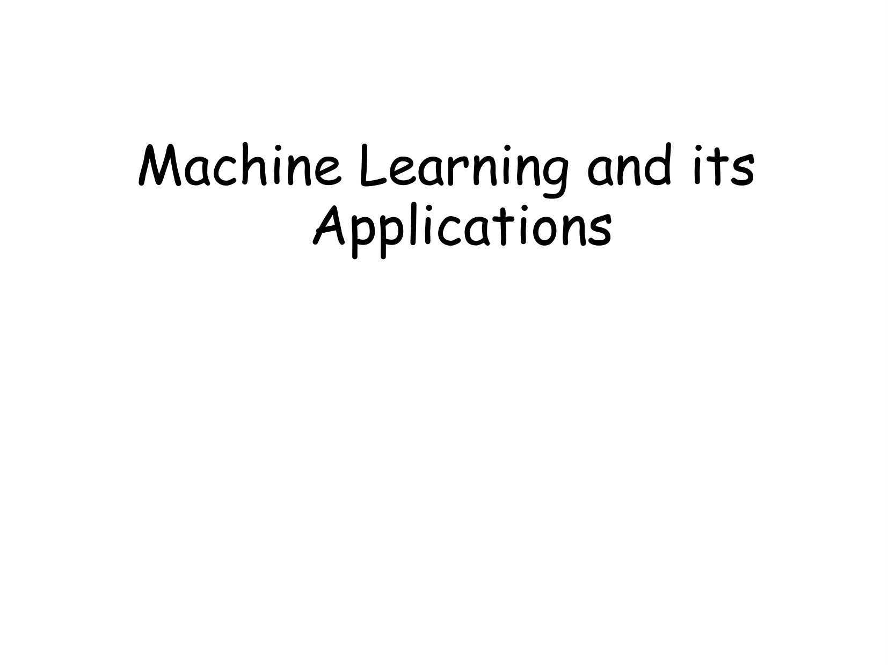
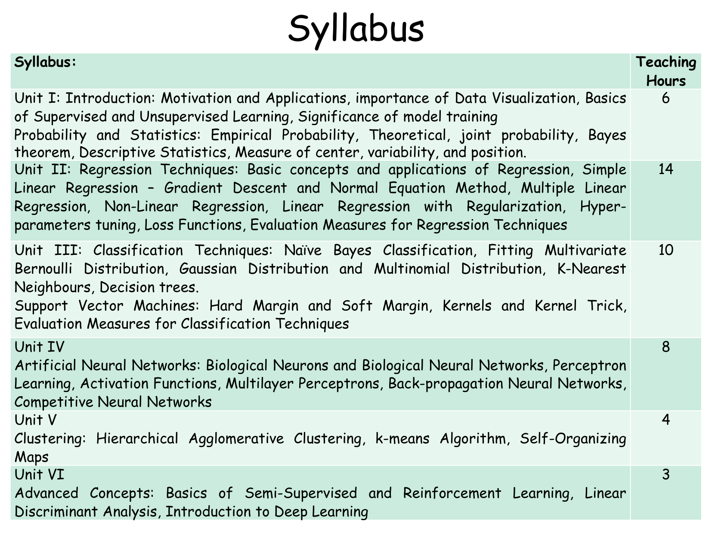
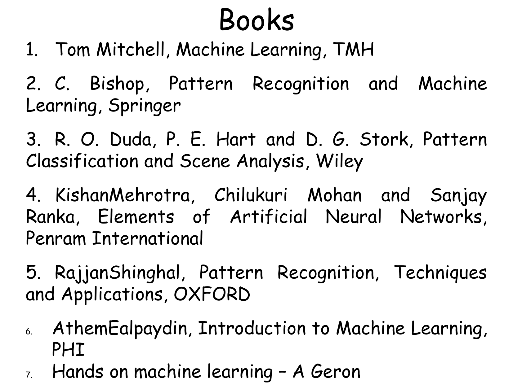

---

## 2. Taxonomy of Machine Learning Paradigms
[Source: 1Machine Learning and its Applications.pdf, Slide 13-35]

Machine learning algorithms are categorized into four major paradigms:

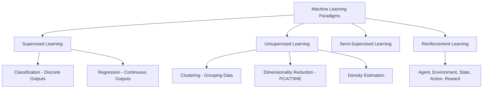

### 2.1 Comparison of ML Paradigms

| Feature | Supervised Learning | Unsupervised Learning | Semi-Supervised Learning | Reinforcement Learning |
|---|---|---|---|---|
| Input Data | Labeled $(x^{(i)}, y^{(i)})$ | Unlabeled $x^{(i)}$ | Small Labeled + Large Unlabeled | State $s_t$, Reward $r_t$ feedback |
| Primary Goal | Map $x \to y$ for accurate predictions | Discover hidden patterns/structure | Improve mapping using unlabeled data | Learn optimal action policy $\pi(a|s)$ |
| Key Sub-types | Classification, Regression | Clustering, Dimensionality Reduction | Semi-supervised Classification | Q-Learning, Policy Gradients |
| Benchmark Tasks | Spam detection, House pricing | Customer segmentation, PCA | Medical imaging with few labels | Game playing (Chess, Go), Robotics |

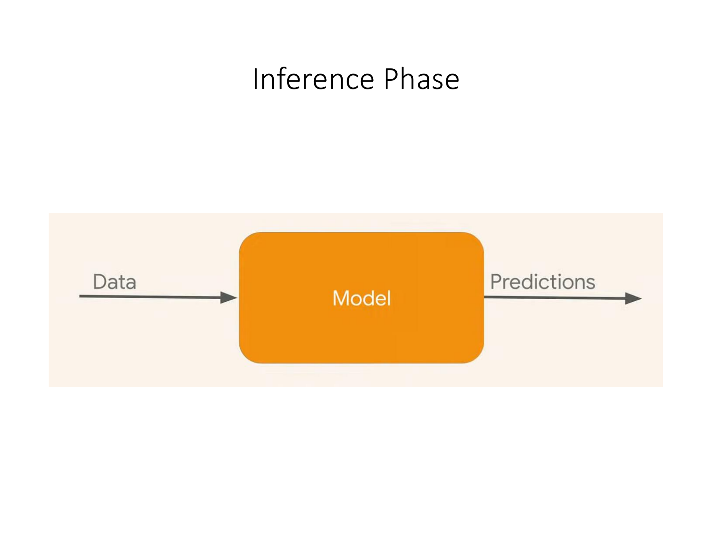
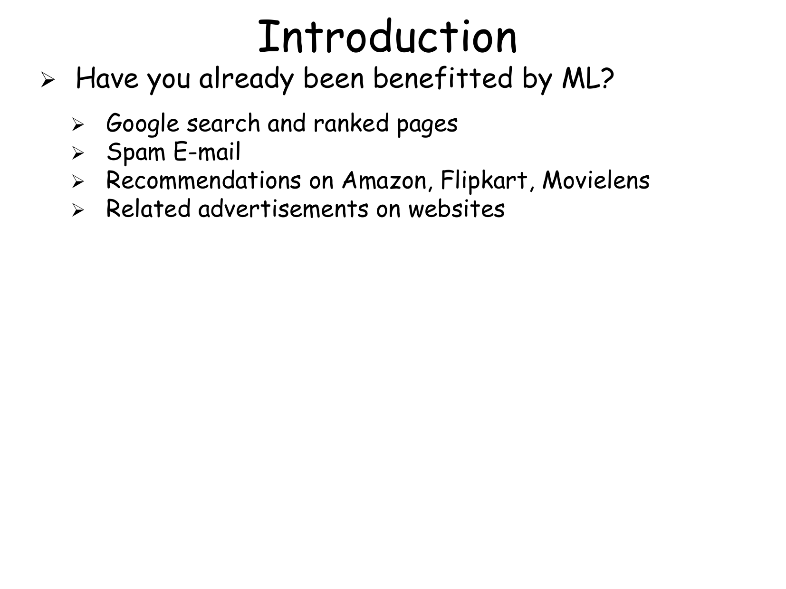

---

## 3. Detailed Breakdown of Learning Paradigms
[Source: 1Machine Learning and its Applications.pdf, Slide 36-65]

### 3.1 Supervised Learning: Classification vs. Regression

#### Definition: Classification
Predicting a discrete categorical class label $y \in \{0, 1, \dots, K-1\}$.
- Binary Classification: $y \in \{0, 1\}$ (e.g., Malignant vs Benign tumor, Spam vs Non-Spam email).
- Multiclass Classification: $y \in \{1, 2, \dots, K\}$ (e.g., Digit recognition $0-9$).

#### Definition: Regression
Predicting a real-valued continuous quantity $y \in \mathbb{R}$ (e.g., Stock prices, Housing values, Temperature forecasting).

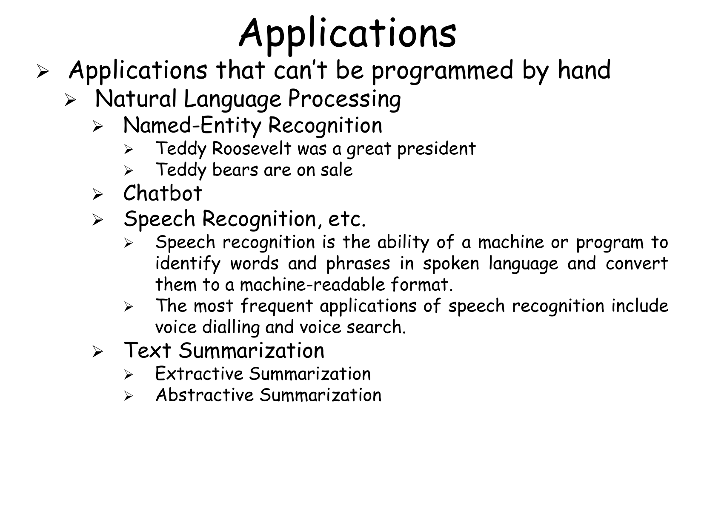
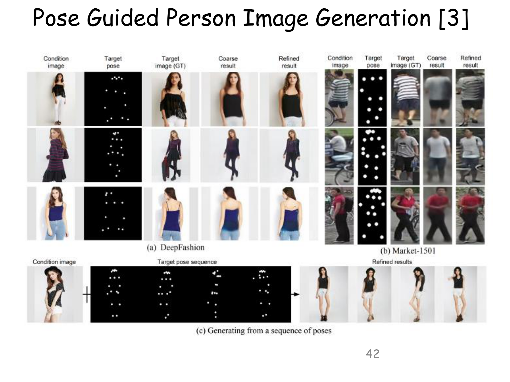

### 3.2 Unsupervised Learning Techniques
- **Clustering (K-Means, Hierarchical)**: Partitioning data points into $K$ distinct clusters based on feature similarity metrics (e.g., Euclidean distance $d(u,v) = \sqrt{\sum (u_i - v_i)^2}$).
- **Dimensionality Reduction (PCA)**: Projecting high-dimensional data into low-dimensional orthogonal latent space while preserving maximum variance.

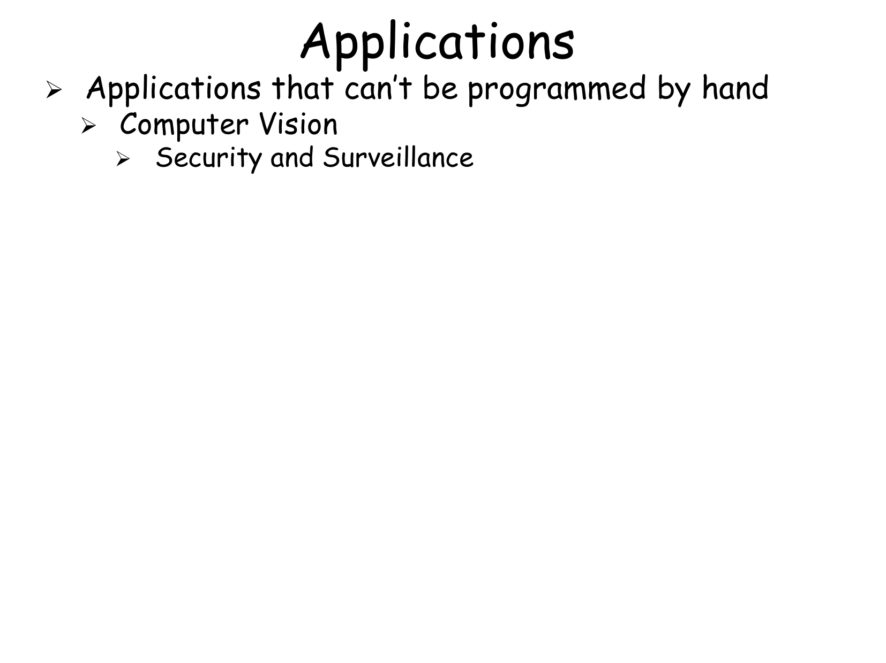
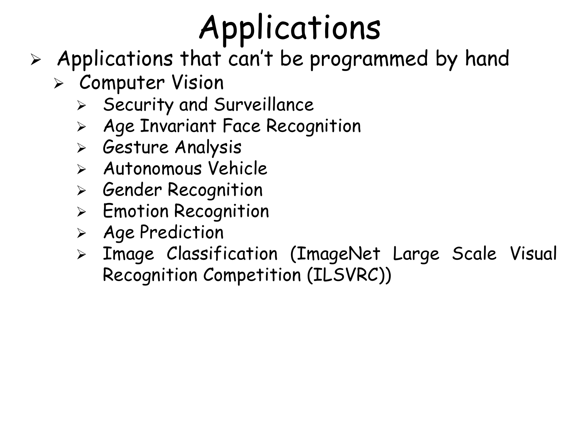

---

## 4. Real-World Applications & Edge Cases
[Source: 1Machine Learning and its Applications.pdf, Slide 66-87]

1. **Computer Vision & Medical Diagnostics**: Tumorous tissue detection, facial identification, automated radiography analysis.
2. **Natural Language Processing**: Machine translation, sentiment evaluation, automated text summarization.
3. **Autonomous Robotics**: Real-time sensor fusion, path planning, self-driving navigation.

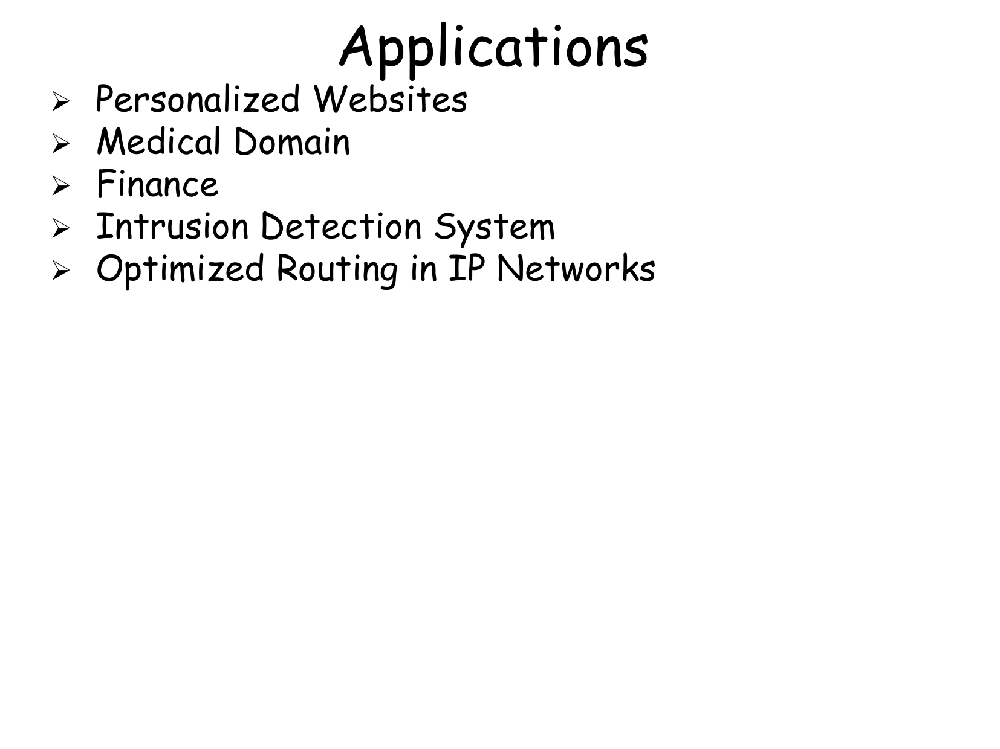
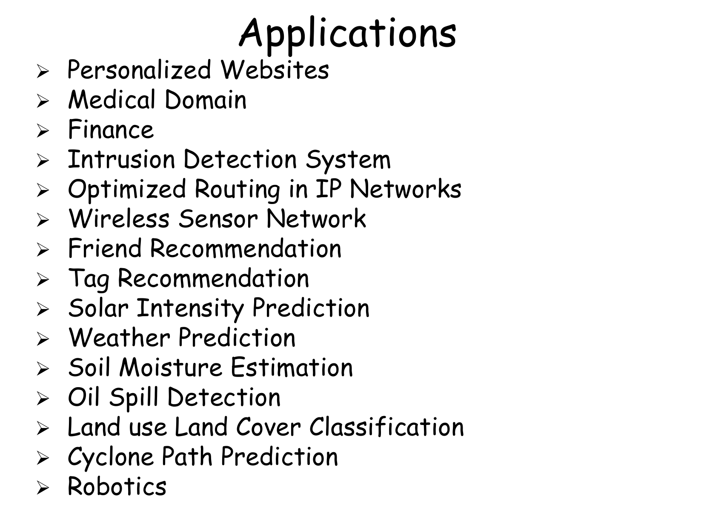

---

## 5. Definitions and Terms

### Definition: Supervised Learning
A learning paradigm where algorithms construct mapping function $f: X \to Y$ using training pairs $(x^{(i)}, y^{(i)})$.

### Definition: Unsupervised Learning
A paradigm where algorithms uncover inherent structure, clustering patterns, or probability density distributions from unlabeled inputs $x^{(i)}$.

### Definition: Reinforcement Learning
A framework where an autonomous agent interacts with an environment, learning action selection policy $\pi(a|s)$ to maximize cumulative scalar reward $R = \sum_{t=0}^{\infty} \gamma^t r_t$.

---

## 6. Formula Sheet

| Concept | Mathematical Equation |
|---|---|
| Mitchell's ML Definition | $P(\text{Task } T \text{ with Experience } E) \uparrow$ |
| Binary Classification | $y \in \{0, 1\}$ |
| Continuous Regression | $y \in \mathbb{R}$ |
| Euclidean Distance Metric | $d(\mathbf{x}^{(a)}, \mathbf{x}^{(b)}) = \sqrt{\sum_{j=1}^n (x_j^{(a)} - x_j^{(b)})^2}$ |
| Cumulative Discounted Reward | $R_t = \sum_{k=0}^{\infty} \gamma^k r_{t+k+1} \quad (0 \le \gamma < 1)$ |

---

## 7. Exam-Oriented Review

### 7.1 Potential Exam Questions
1. **Define Machine Learning according to Tom Mitchell and identify the three components $(T, E, P)$ for a Checkers-playing agent.**
   - *Solution*: Definition: A computer program learns from experience $E$ regarding task $T$ and performance measure $P$ if $P$ improves with $E$.
     - Task $T$: Playing Checkers.
     - Experience $E$: Playing thousands of self-play Checkers games.
     - Performance Measure $P$: Percentage of games won against opponent pool.

2. **Differentiate between Classification and Regression with concrete examples.**
   - *Solution*: Classification predicts discrete class labels (e.g., predicting whether a transaction is Fraudulent ($1$) or Legitimate ($0$)). Regression predicts continuous numerical quantities (e.g., predicting exact fraudulent loss amount in dollars).

### 7.2 Numerical Problem & Step-by-Step Solution
**Problem**: Calculate Euclidean distance between two data instances $\mathbf{x}^{(1)} = [2, 5, 8]^T$ and $\mathbf{x}^{(2)} = [5, 1, 8]^T$.

**Solution**:

$$
d(\mathbf{x}^{(1)}, \mathbf{x}^{(2)}) = \sqrt{(5-2)^2 + (1-5)^2 + (8-8)^2} = \sqrt{3^2 + (-4)^2 + 0^2} = \sqrt{9 + 16 + 0} = \sqrt{25} = 5.0
$$
