# Chapter: Simple Linear Regression

---

## 1. Introduction and Problem Formulation
[Source: Linear Regression.pdf, Slide 1-2]

### 1.1 Motivation: Housing Price Prediction
Linear regression is one of the most foundational supervised learning algorithms in machine learning. Its primary objective is to predict a continuous target variable $y \in \mathbb{R}$ given an input feature vector $x \in \mathbb{R}^n$.

Consider a real-estate dataset where the objective is to predict the **Selling Price** (in Lacs) of a house based on its **Area** (in Square Meters, SQM).

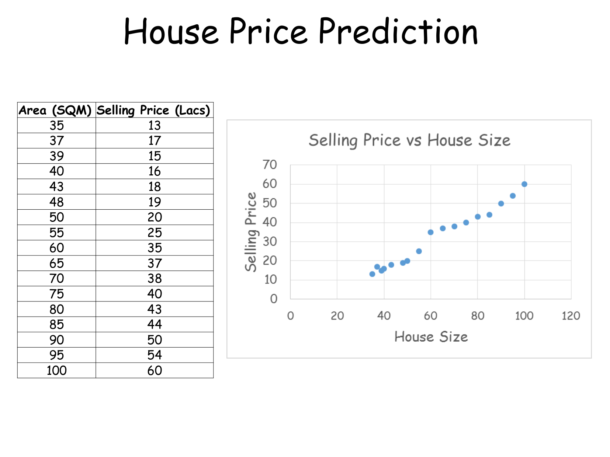

#### Training Dataset Example:
The dataset consists of $m = 16$ historical observations $(x^{(i)}, y^{(i)})$:

| Example ($i$) | Area $x^{(i)}$ (SQM) | Selling Price $y^{(i)}$ (Lacs) |
|---|---|---|
| 1 | 35 | 13 |
| 2 | 37 | 17 |
| 3 | 39 | 15 |
| 4 | 40 | 16 |
| 5 | 43 | 18 |
| 6 | 48 | 19 |
| 7 | 50 | 20 |
| 8 | 55 | 25 |
| 9 | 60 | 35 |
| 10 | 65 | 37 |
| 11 | 70 | 38 |
| 12 | 75 | 40 |
| 13 | 80 | 43 |
| 14 | 85 | 44 |
| 15 | 90 | 50 |
| 16 | 100 | 60 |

---

## 2. Hypothesis Function and Model Representation
[Source: Linear Regression.pdf, Slide 3-6]

In univariate (simple) linear regression, we model the relationship between the independent variable $x$ and dependent variable $y$ using a linear equation.

### 2.1 The Linear Hypothesis
The hypothesis function $h_\theta(x)$ (or predicted output $\hat{y}$) is defined as:

$$
h_\theta(x) = \theta_0 + \theta_1 x
$$

$$
\hat{y} = h_\theta(x)
$$

Where:
- $x$: Input feature (e.g., House Area in SQM).
- $y$: Actual target value (e.g., Selling Price in Lacs).
- $\hat{y} = h_\theta(x)$: Predicted target value.
- $\theta_0$: Y-intercept parameter (bias term), representing predicted value when $x = 0$.
- $\theta_1$: Slope parameter (weight/coefficient), representing rate of change of $\hat{y}$ per unit change in $x$.
- $\theta = (\theta_0, \theta_1)^T$: Parameter vector of the model.

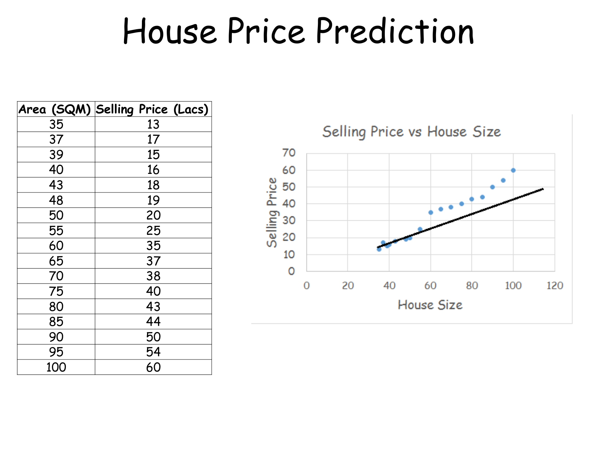
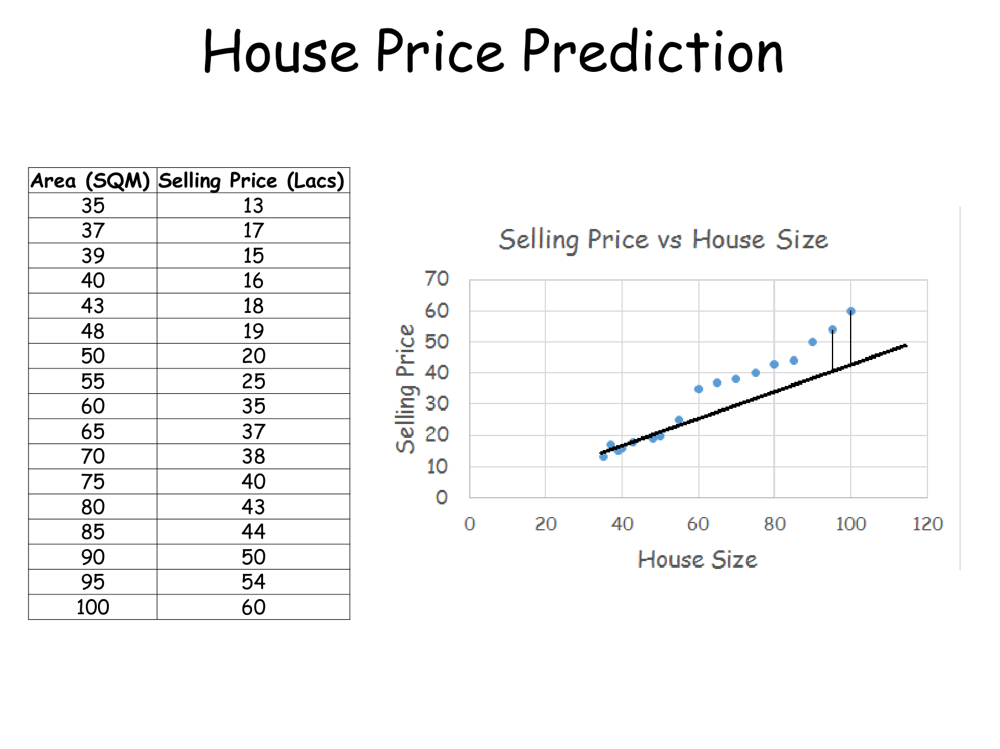
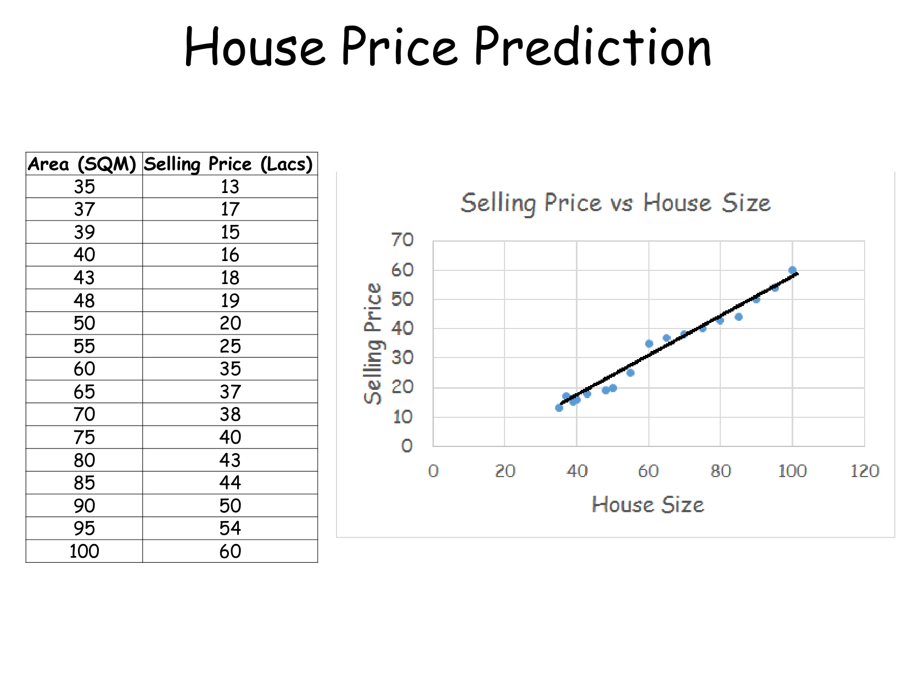

---

## 3. Cost Function Derivation
[Source: Linear Regression.pdf, Slide 7-8]

### 3.1 Residual Error
For any training instance $(x^{(i)}, y^{(i)})$, the residual (error) is defined as the vertical distance between the actual target $y^{(i)}$ and predicted output $h_\theta(x^{(i)})$:

$$
e^{(i)} = y^{(i)} - h_\theta(x^{(i)}) = y^{(i)} - (\theta_0 + \theta_1 x^{(i)})
$$

### 3.2 Formulation of Mean Squared Error (MSE)
Why do we use Mean Squared Error rather than raw or absolute errors?
1. **Raw Sum of Errors**: $\sum_{i=1}^m (y^{(i)} - \hat{y}^{(i)})$ allows positive and negative errors to cancel each other out, making a terrible model appear to have zero error.
2. **Absolute Errors (MAE)**: $\sum_{i=1}^m |y^{(i)} - \hat{y}^{(i)}|$ is non-differentiable at zero, creating optimization difficulties for derivative-based algorithms.
3. **Squared Errors (MSE)**: $(y^{(i)} - \hat{y}^{(i)})^2$ ensures strictly non-negative penalty, heavily penalizes larger outliers, and produces a smooth, differentiable quadratic surface.

The Mean Squared Error cost function $J(\theta_0, \theta_1)$ is mathematically defined as:

$$
J(\theta_0, \theta_1) = \frac{1}{2m} \sum_{i=1}^{m} (h_\theta(x^{(i)}) - y^{(i)})^2
$$

Where:
- $m$: Total number of training examples.
- $\frac{1}{2}$: Scaling factor introduced for mathematical convenience to cleanly cancel out the power $2$ during partial differentiation.

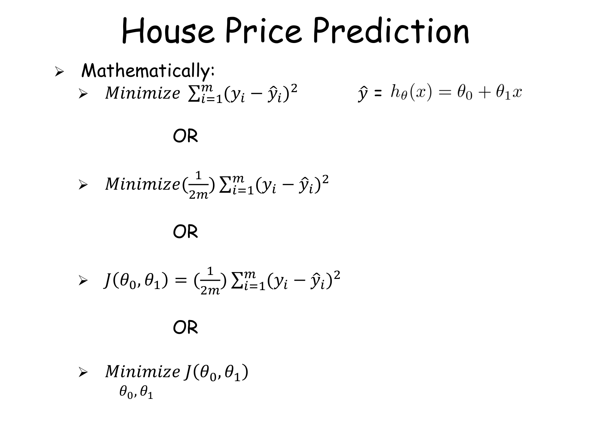

### 3.3 Geometry of the Cost Function Surface
The cost function $J(\theta_0, \theta_1)$ forms a 3-dimensional convex paraboloid (bowl shape). Because $J(\theta_0, \theta_1)$ is strictly convex, it possesses a single unique global minimum and zero local minima.

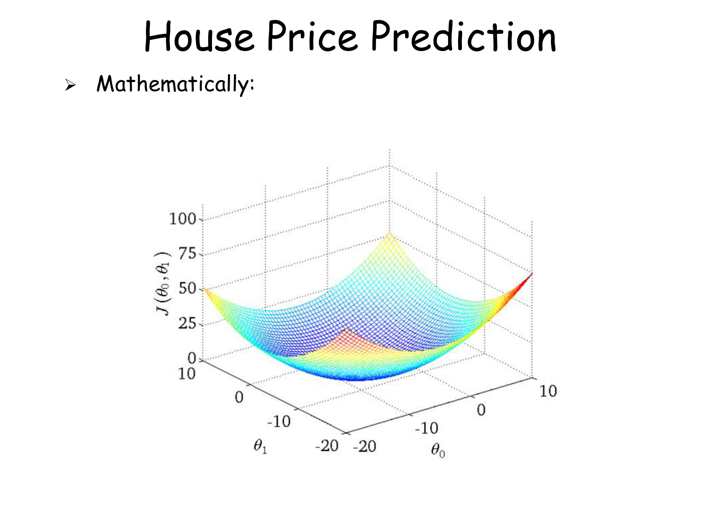
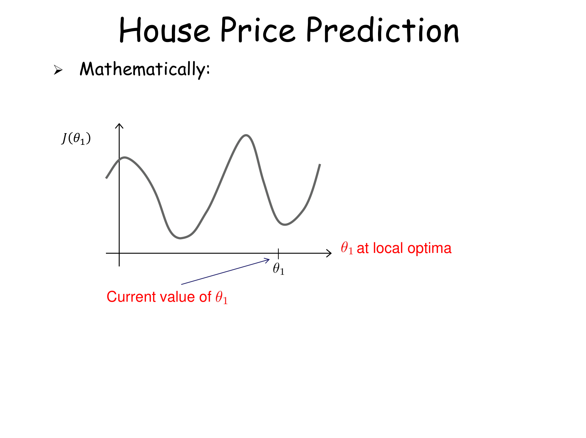

---

## 4. Optimization via Gradient Descent Algorithm
[Source: Linear Regression.pdf, Slide 10-16]

### 4.1 Gradient Descent Intuition
Gradient Descent is an iterative optimization algorithm used to minimize $J(\theta_0, \theta_1)$. Starting from an initial guess $(\theta_0^{(0)}, \theta_1^{(0)})$, the algorithm takes steps in the direction of steepest descent (opposite to the gradient vector $\nabla J$).

### 4.2 Simultaneous Update Rule
The general update rule for parameter $\theta_j$ ($j = 0, 1$) is:

$$
\theta_j := \theta_j - \alpha \frac{\partial}{\partial \theta_j} J(\theta_0, \theta_1)
$$

#### ⚠️ CRITICAL RULE: Simultaneous Updates
Parameters $\theta_0$ and $\theta_1$ MUST be updated simultaneously at every iteration.

| Correct (Simultaneous Update) | Incorrect (Sequential Update) |
|---|---|
| $\text{temp0} := \theta_0 - \alpha \frac{\partial}{\partial \theta_0} J(\theta_0, \theta_1)$ | $\theta_0 := \theta_0 - \alpha \frac{\partial}{\partial \theta_0} J(\theta_0, \theta_1)$ |
| $\text{temp1} := \theta_1 - \alpha \frac{\partial}{\partial \theta_1} J(\theta_0, \theta_1)$ | $\theta_1 := \theta_1 - \alpha \frac{\partial}{\partial \theta_1} J(\theta_0, \theta_1)$ |
| $\theta_0 := \text{temp0}$ | *(Here $\theta_1$ is computed using updated $\theta_0$, breaking gradient direction!)* |
| $\theta_1 := \text{temp1}$ | |

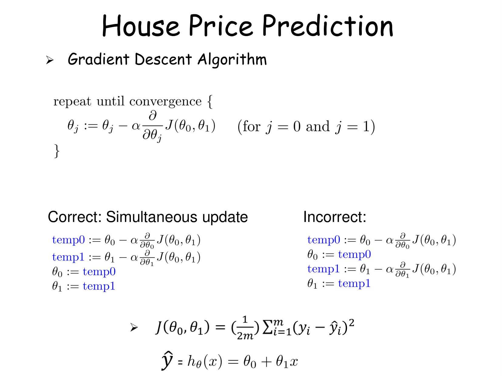

### 4.3 Derivative Expressions for Linear Regression
Let us compute partial derivatives of $J(\theta_0, \theta_1)$ with respect to $\theta_0$ and $\theta_1$:

$$
\frac{\partial}{\partial \theta_j} J(\theta_0, \theta_1) = \frac{\partial}{\partial \theta_j} \left[ \frac{1}{2m} \sum_{i=1}^m (h_\theta(x^{(i)}) - y^{(i)})^2 \right]
$$

Applying chain rule:

$$
\frac{\partial}{\partial \theta_j} J(\theta_0, \theta_1) = \frac{1}{m} \sum_{i=1}^m (h_\theta(x^{(i)}) - y^{(i)}) \cdot \frac{\partial}{\partial \theta_j} h_\theta(x^{(i)})
$$

Since $h_\theta(x^{(i)}) = \theta_0 + \theta_1 x^{(i)}$:
- For $j = 0$: $\frac{\partial}{\partial \theta_0} h_\theta(x^{(i)}) = 1$
- For $j = 1$: $\frac{\partial}{\partial \theta_1} h_\theta(x^{(i)}) = x^{(i)}$

#### Concrete Derivative Formulas:

$$
\frac{\partial}{\partial \theta_0} J(\theta_0, \theta_1) = \frac{1}{m} \sum_{i=1}^{m} (h_\theta(x^{(i)}) - y^{(i)})
$$

$$
\frac{\partial}{\partial \theta_1} J(\theta_0, \theta_1) = \frac{1}{m} \sum_{i=1}^{m} (h_\theta(x^{(i)}) - y^{(i)}) \cdot x^{(i)}
$$

#### Full Gradient Descent Algorithm:

Repeat until convergence:

$$
\theta_0 := \theta_0 - \alpha \frac{1}{m}
\sum_{i=1}^{m}(h_\theta(x^{(i)}) - y^{(i)})
$$

$$
\theta_1 := \theta_1 - \alpha \frac{1}{m}
\sum_{i=1}^{m}(h_\theta(x^{(i)}) - y^{(i)})x^{(i)}
$$

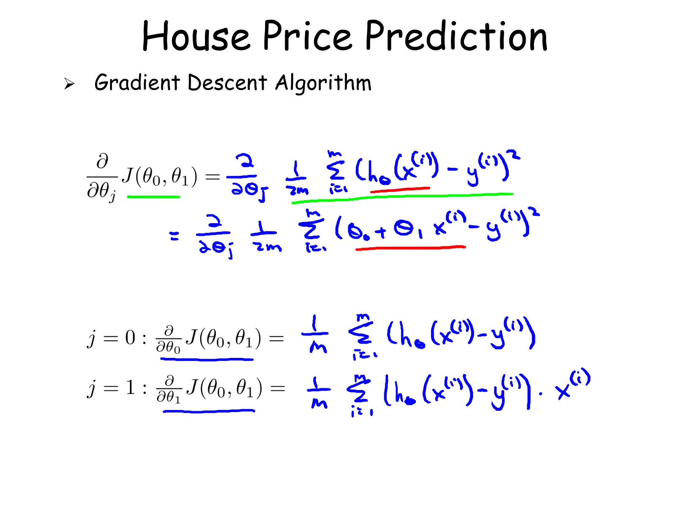
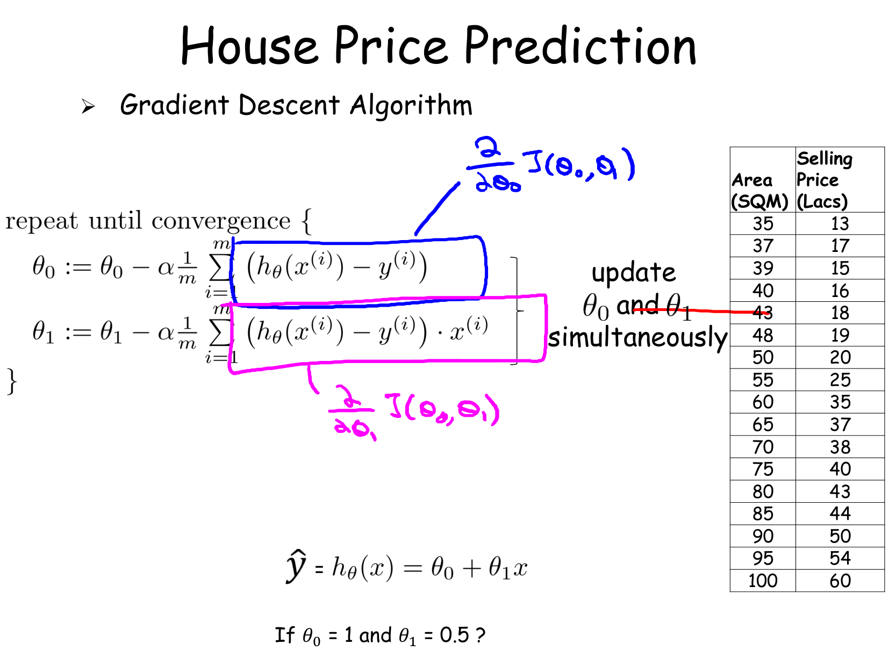

### 4.4 Impact of Learning Rate $\alpha$
The scalar learning rate $\alpha > 0$ controls the step size taken per iteration:

1. **If $\alpha$ is too small**: Gradient descent takes tiny micro-steps, leading to extremely slow convergence.
2. **If $\alpha$ is too large**: Gradient descent overshoots the minimum, fluctuates, and may diverge ($\lim_{k \to \infty} J(\theta) = \infty$).
3. **Slope Direction**:
   - If slope $\frac{\partial J}{\partial \theta_1} > 0$, $\theta_1 := \theta_1 - \alpha (\text{positive}) \implies \theta_1$ decreases towards optimum.
   - If slope $\frac{\partial J}{\partial \theta_1} < 0$, $\theta_1 := \theta_1 - \alpha (\text{negative}) \implies \theta_1$ increases towards optimum.

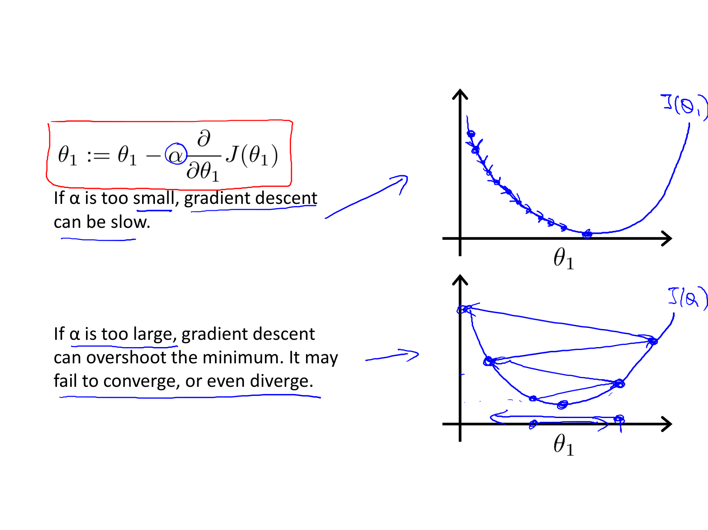
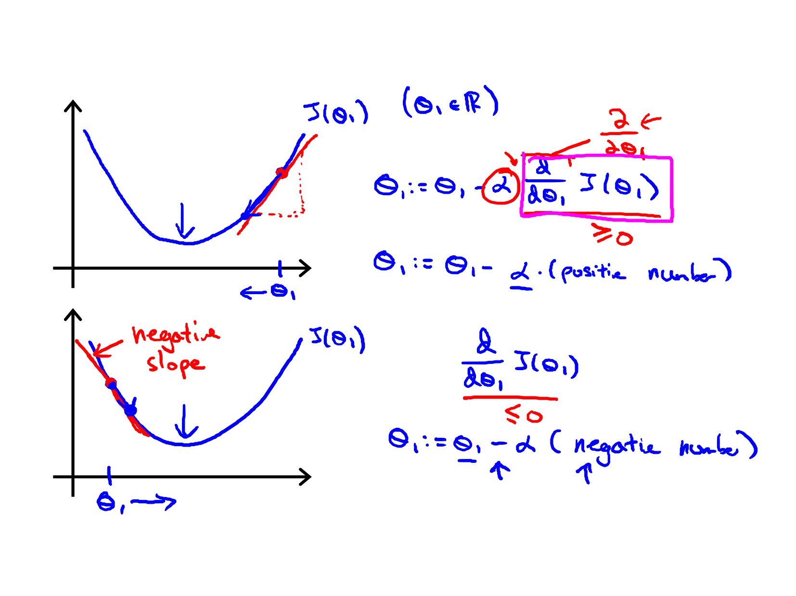

### 4.5 Batch Gradient Descent
This algorithm is called **"Batch" Gradient Descent** because each step of gradient descent evaluates the error over the entire batch of $m$ training examples ($\sum_{i=1}^m$).

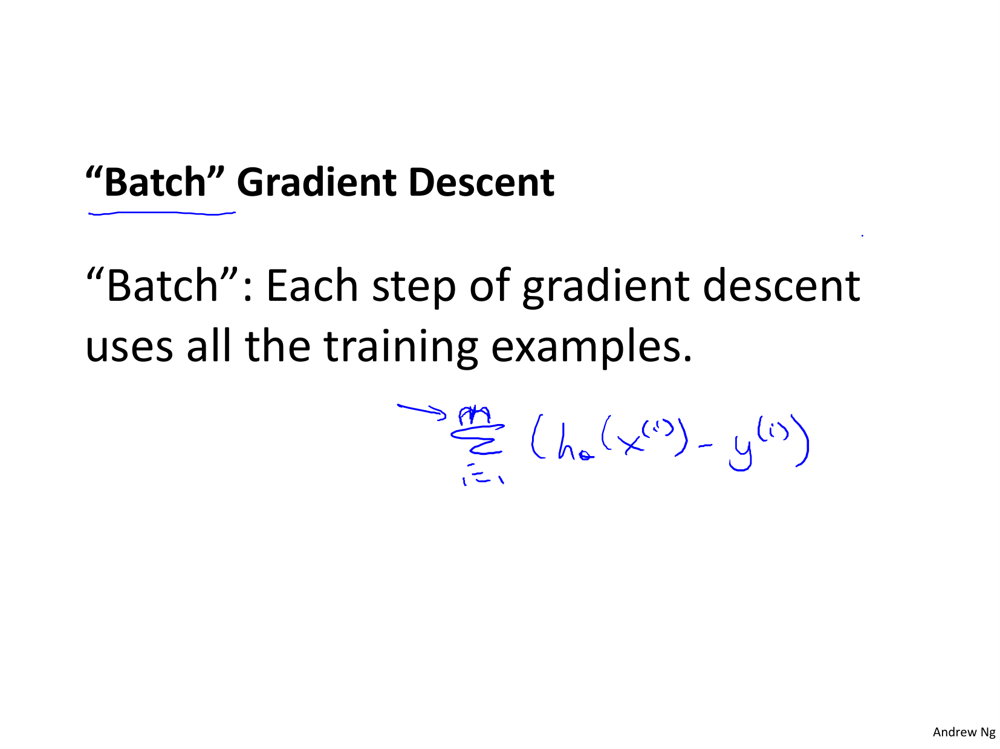

---

## 5. Architectural & Algorithmic Workflow

```mermaid
flowchart TD
    A["Input Training Dataset (x, y)"] --> B["Initialize Parameters theta_0, theta_1"]
    B --> C["Compute Predictions h_theta("x") = theta_0 + theta_1 * x"]
    C --> D["Calculate Residuals e_i = h_theta("x_i") - y_i"]
    D --> E["Compute MSE Cost J("theta_0, theta_1")"]
    E --> F["Calculate Gradients dJ/dtheta_0 and dJ/dtheta_1"]
    F --> G["Simultaneously Update theta_0 and theta_1"]
    G --> H{"Has J(&quot;theta&quot;) Converged?"}
    H -- No --> C
    H -- Yes --> I["Output Optimal Parameters theta_0*, theta_1*"]
```

---

## 6. Definitions and Terms

### Definition: Simple Linear Regression
A supervised learning technique that models the linear scalar relationship between a single independent input variable $x$ and a continuous dependent output variable $y$.

### Definition: Hypothesis Function
The parametric model function $h_\theta(x) = \theta_0 + \theta_1 x$ used to predict output value $\hat{y}$ for a given input $x$.

### Definition: Cost Function (MSE)
A mathematical objective function $J(\theta) = \frac{1}{2m}\sum_{i=1}^m (h_\theta(x^{(i)}) - y^{(i)})^2$ measuring the average squared error between predictions and true target values.

### Definition: Gradient Descent
An iterative optimization algorithm that updates parameters in the direction of steepest negative gradient of the cost function: $\theta := \theta - \alpha \nabla_\theta J(\theta)$.

### Definition: Learning Rate ($\alpha$)
A positive hyperparameter determining the magnitude of step size taken along the negative gradient direction during each iteration.

### Definition: Simultaneous Update
The mandatory practice of computing all parameter updates using current iteration values before updating any parameter state.

---

## 7. Formula Sheet

| Formula Name | Mathematical Expression |
|---|---|
| Hypothesis Function | $h_\theta(x) = \theta_0 + \theta_1 x$ |
| Residual Error | $e^{(i)} = y^{(i)} - h_\theta(x^{(i)})$ |
| Cost Function (MSE) | $J(\theta_0, \theta_1) = \frac{1}{2m} \sum_{i=1}^{m} (h_\theta(x^{(i)}) - y^{(i)})^2$ |
| Partial Derivative w.r.t. $\theta_0$ | $\frac{\partial J}{\partial \theta_0} = \frac{1}{m} \sum_{i=1}^{m} (h_\theta(x^{(i)}) - y^{(i)})$ |
| Partial Derivative w.r.t. $\theta_1$ | $\frac{\partial J}{\partial \theta_1} = \frac{1}{m} \sum_{i=1}^{m} (h_\theta(x^{(i)}) - y^{(i)}) \cdot x^{(i)}$ |
| $\theta_0$ Update Rule | $\theta_0 := \theta_0 - \alpha \frac{1}{m} \sum_{i=1}^{m} (h_\theta(x^{(i)}) - y^{(i)})$ |
| $\theta_1$ Update Rule | $\theta_1 := \theta_1 - \alpha \frac{1}{m} \sum_{i=1}^{m} (h_\theta(x^{(i)}) - y^{(i)}) x^{(i)}$ |

---

## 8. Definition Sheet

- **Supervised Learning**: Learning paradigm where training instances are pairs of input features and ground-truth labels.
- **Parametric Model**: Model characterized by a fixed set of learnable parameters $\theta$.
- **Convex Function**: Function where line segment connecting any two points lies above/on graph, guaranteeing single global minimum.
- **Global Minimum**: Parameter state $\theta^*$ where $J(\theta^*) \le J(\theta)$ for all valid $\theta$.
- **Batch Gradient Descent**: Gradient descent variant evaluating all $m$ training instances per step.

---

## 9. Exam-Oriented Review

### 9.1 Potential Exam Questions

1. **Explain why the scaling factor $\frac{1}{2m}$ is used in the MSE cost function $J(\theta_0, \theta_1)$ instead of $\frac{1}{m}$.**
   - *Solution*: The factor $\frac{1}{m}$ computes average squared error across $m$ samples. The factor $\frac{1}{2}$ is introduced so that when taking the partial derivative $\frac{\partial}{\partial \theta} (h_\theta(x) - y)^2$, the derivative power $2$ cleanly cancels out with $\frac{1}{2}$, yielding $\frac{1}{m} (h_\theta(x) - y)$ without extra numerical constants.

2. **What occurs during Gradient Descent optimization if parameter updates are executed sequentially instead of simultaneously?**
   - *Solution*: Sequential update updates $\theta_0$ first, and then calculates $\frac{\partial J}{\partial \theta_1}$ using the new $\theta_0$ value within the same iteration. This alters the gradient vector trajectory away from the true direction of steepest descent, causing inefficient convergence paths or algorithmic divergence.

3. **Why does $J(\theta_0, \theta_1)$ for linear regression have no local minima?**
   - *Solution*: The mean squared error cost function for linear regression is a linear combination of quadratic terms, which is strictly convex. Convex functions possess the mathematical property that any local minimum is identically the unique global minimum.

### 9.2 Edge Cases and Pitfalls

- **Unscaled Features**: If feature $x$ has very large magnitude compared to $y$, cost surface contours become elongated ellipses, causing gradient descent steps to oscillate wildly unless learning rate $\alpha$ is set extremely small.
- **Zero Gradient at Local/Global Optima**: At optimum $\theta^*$, $\nabla J(\theta^*) = 0$. Consequently, gradient descent automatically takes zero step size: $\theta := \theta - \alpha(0) = \theta$, cleanly remaining at optimum without reducing $\alpha$.

### 9.3 Numerical Problem & Step-by-Step Solution

**Problem**:
Consider a dataset with $m = 3$ samples:
- $(x^{(1)}, y^{(1)}) = (1, 2)$
- $(x^{(2)}, y^{(2)}) = (2, 3)$
- $(x^{(3)}, y^{(3)}) = (3, 5)$

Given current parameter values $\theta_0 = 0$, $\theta_1 = 1$, and learning rate $\alpha = 0.1$:
1. Calculate predicted values $h_\theta(x^{(i)})$ for all samples.
2. Compute cost $J(\theta_0, \theta_1)$.
3. Perform one step of simultaneous Gradient Descent update to calculate new parameters $\theta_0^{(new)}$ and $\theta_1^{(new)}$.

**Step-by-Step Solution**:

**Step 1: Compute Predictions $h_\theta(x^{(i)}) = 0 + 1 \cdot x^{(i)}$**:
- $h_\theta(x^{(1)}) = 1 \cdot 1 = 1$
- $h_\theta(x^{(2)}) = 1 \cdot 2 = 2$
- $h_\theta(x^{(3)}) = 1 \cdot 3 = 3$

**Step 2: Calculate Errors $(h_\theta(x^{(i)}) - y^{(i)})$**:
- $e^{(1)} = 1 - 2 = -1$
- $e^{(2)} = 2 - 3 = -1$
- $e^{(3)} = 3 - 5 = -2$

**Step 3: Compute Cost $J(\theta_0, \theta_1)$**:

$$
J(0, 1) = \frac{1}{2 \times 3} \left[ (-1)^2 + (-1)^2 + (-2)^2 \right] = \frac{1}{6} [1 + 1 + 4] = \frac{6}{6} = 1.0
$$

**Step 4: Compute Gradients**:

$$
\frac{\partial J}{\partial \theta_0} = \frac{1}{3} [(-1) + (-1) + (-2)] = \frac{-4}{3} \approx -1.333
$$

$$
\frac{\partial J}{\partial \theta_1} = \frac{1}{3} [(-1)(1) + (-1)(2) + (-2)(3)] = \frac{1}{3} [-1 - 2 - 6] = \frac{-9}{3} = -3.0
$$

**Step 5: Simultaneous Gradient Descent Update**:

$$
\theta_0^{(new)} := 0 - 0.1 \times \left(-\frac{4}{3}\right) = 0 + 0.1333 = 0.1333
$$

$$
\theta_1^{(new)} := 1 - 0.1 \times (-3.0) = 1 + 0.3 = 1.3000
$$

**Final Answer**:
- Initial Cost $J(0,1) = 1.0$
- Updated parameters: $\theta_0^{(new)} = 0.1333$, $\theta_1^{(new)} = 1.3000$.
