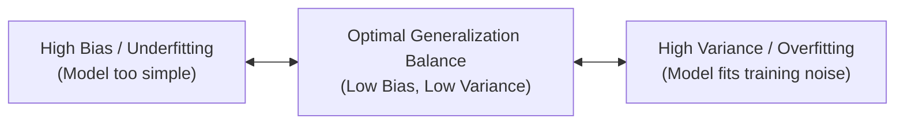

# Chapter 4: Regularization Techniques & Bias-Variance Tradeoff

> **Course Title:** Machine Learning and its Applications
> **Source Material:** Faculty Lecture Slides - Nirma University

---

## 1. Chapter Overview
Regularization prevents overfitting by adding a penalty term to the loss function that constrains coefficient magnitude.

This chapter covers:
- The Bias-Variance Tradeoff (Underfitting vs. Overfitting).
- Ridge Regression ($L_2$ Regularization).
- Lasso Regression ($L_1$ Regularization & Feature Selection).
- ElasticNet Regularization ($L_1 + L_2$).
- Detailed worked numerical example comparing $L_1$ and $L_2$ penalty calculations step-by-step.
- Formula Sheet, Definition Sheet, and Exam-Oriented Review.

---

## 2. The Bias-Variance Tradeoff

### Total Expected Error Decomposition:

$$
\text{Expected Error} = \text{Bias}^2 + \text{Variance} + \sigma^2 \quad (\text{Irreducible Error})
$$

- **Bias:** Error introduced by approximating a real-world complex problem with a simplified model.
- **Variance:** Amount by which predicted values change if trained on a different dataset split.

---

## 3. Regularization Formulations

### 3.1 Ridge Regression ($L_2$ Regularization)
Adds sum of squared weights penalty:

$$
J_{\text{Ridge}}(\mathbf{w}) = \frac{1}{2m} \sum_{i=1}^{m} \left( h_{\mathbf{w}}(\mathbf{x}^{(i)}) - y^{(i)} \right)^2 + \lambda \sum_{j=1}^{n} w_j^2
$$

- **Analytical Solution:** $\mathbf{w}^* = (\mathbf{X}^T \mathbf{X} + \lambda \mathbf{I})^{-1} \mathbf{X}^T \mathbf{y}$.

---

### 3.2 Lasso Regression ($L_1$ Regularization)
Adds sum of absolute weight magnitudes penalty:

$$
J_{\text{Lasso}}(\mathbf{w}) = \frac{1}{2m} \sum_{i=1}^{m} \left( h_{\mathbf{w}}(\mathbf{x}^{(i)}) - y^{(i)} \right)^2 + \lambda \sum_{j=1}^{n} |w_j|
$$

- Shrinks uninformative feature weights strictly to zero, performing implicit **feature selection**.

---

## 4. Detailed Step-by-Step Solved Numerical Problem

### Problem Statement:
Suppose a trained model has parameter weights $\mathbf{w} = [w_1, w_2]^T = [3.0, -4.0]^T$. The unregularized MSE loss on the dataset is $J_{\text{MSE}} = 12.0$.

**Task:**
1. Compute the $L_2$ penalty term and total Ridge Cost $J_{\text{Ridge}}$ for $\lambda = 0.5$.
2. Compute the $L_1$ penalty term and total Lasso Cost $J_{\text{Lasso}}$ for $\lambda = 0.5$.

---

### Step-by-Step Solution:

#### Step 1: Compute $L_2$ Squared Norm Penalty ($w_1 = 3, w_2 = -4$)

$$
\sum_{j=1}^{2} w_j^2 = (3.0)^2 + (-4.0)^2 = 9 + 16 = \mathbf{25.0}
$$

$$
\text{Ridge Penalty} = \lambda \sum_{j=1}^{2} w_j^2 = (0.5)(25.0) = \mathbf{12.5}
$$

$$
J_{\text{Ridge}} = J_{\text{MSE}} + \text{Ridge Penalty} = 12.0 + 12.5 = \mathbf{24.5}
$$

---

#### Step 2: Compute $L_1$ Absolute Norm Penalty ($w_1 = 3, w_2 = -4$)

$$
\sum_{j=1}^{2} |w_j| = |3.0| + |-4.0| = 3 + 4 = \mathbf{7.0}
$$

$$
\text{Lasso Penalty} = \lambda \sum_{j=1}^{2} |w_j| = (0.5)(7.0) = \mathbf{3.5}
$$

$$
J_{\text{Lasso}} = J_{\text{MSE}} + \text{Lasso Penalty} = 12.0 + 3.5 = \mathbf{15.5}
$$

---

## 5. Formula Sheet

- **Ridge Loss ($L_2$):**

$$
J_{\text{Ridge}}(\mathbf{w}) = \text{MSE}(\mathbf{w}) + \lambda \sum_{j=1}^{n} w_j^2
$$

- **Lasso Loss ($L_1$):**

$$
J_{\text{Lasso}}(\mathbf{w}) = \text{MSE}(\mathbf{w}) + \lambda \sum_{j=1}^{n} |w_j|
$$

---

## 6. Definition Sheet

1. **Overfitting:** High variance condition where a model learns training noise, degrading test set generalization.
2. **$L_2$ Regularization (Ridge):** Penalty method shrinking weight values continuously toward zero.
3. **$L_1$ Regularization (Lasso):** Penalty method setting irrelevant feature weights strictly to zero.

---

## 7. Exam-Oriented Review

1. Differentiate between Ridge ($L_2$) and Lasso ($L_1$) regularization in terms of weight penalty geometry and feature selection.
2. Explain why $(\mathbf{X}^T \mathbf{X} + \lambda \mathbf{I})$ is always invertible in Ridge regression even when $\mathbf{X}^T \mathbf{X}$ is non-invertible.
