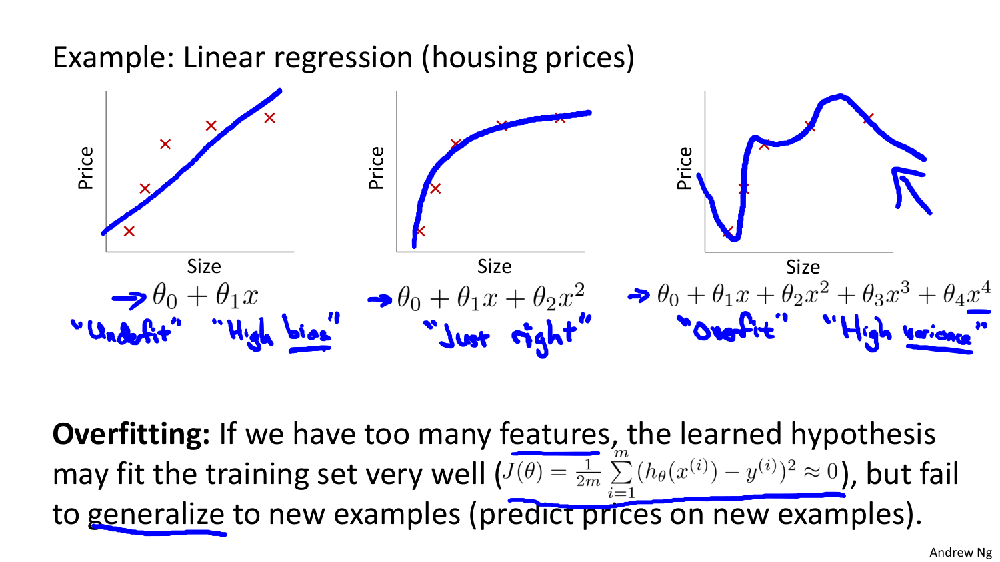
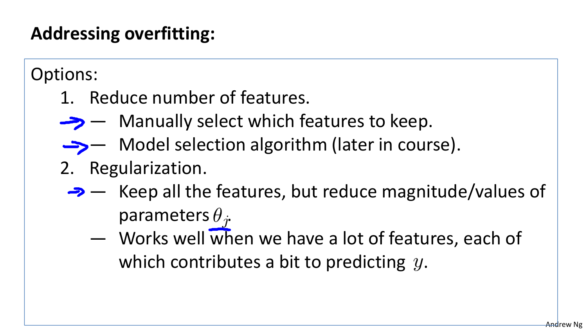
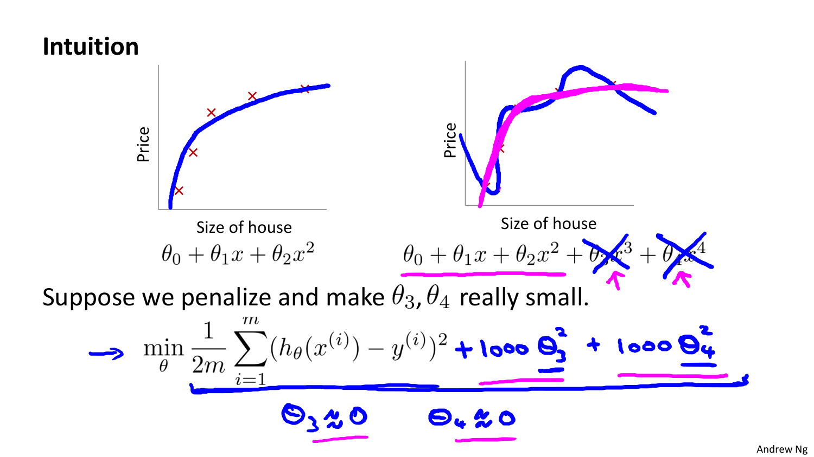
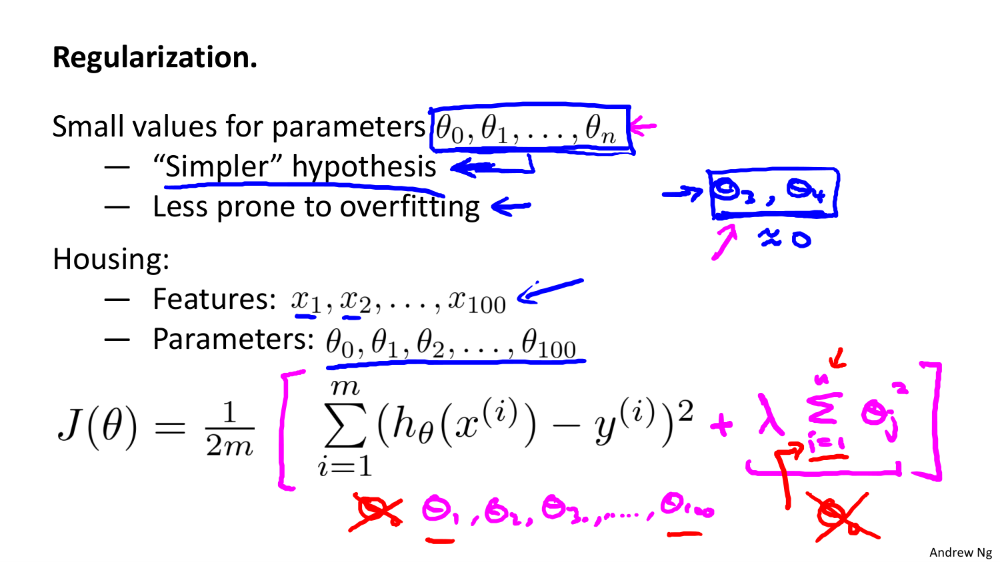
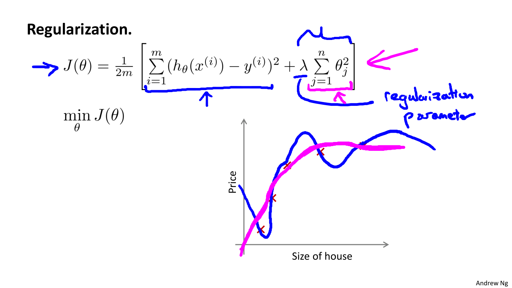
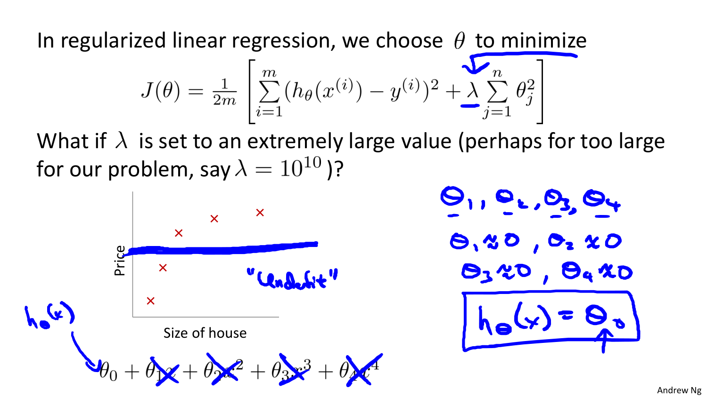
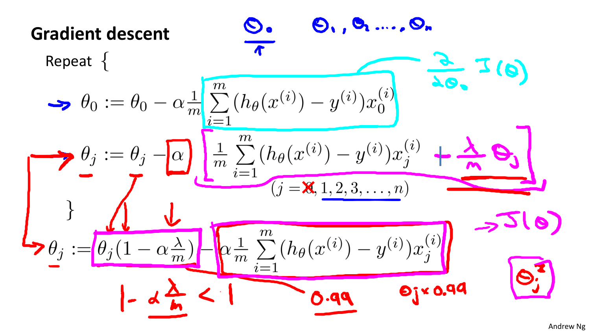
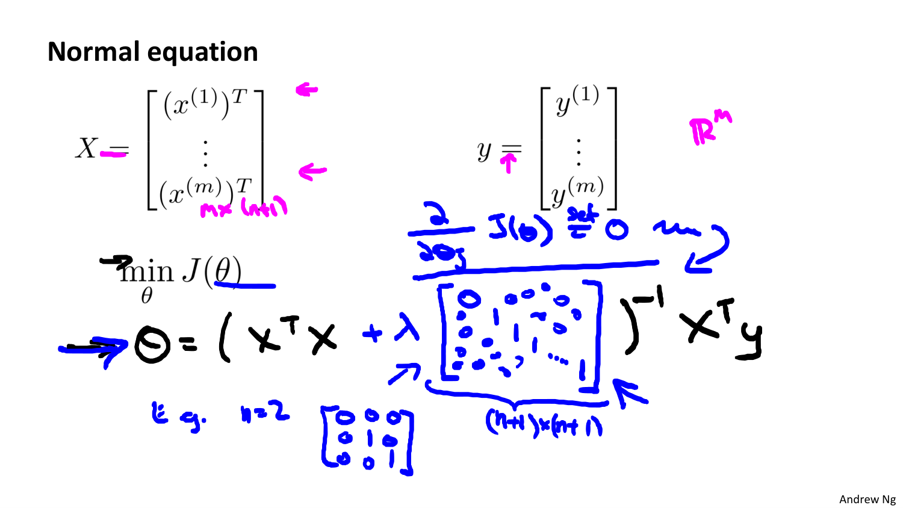
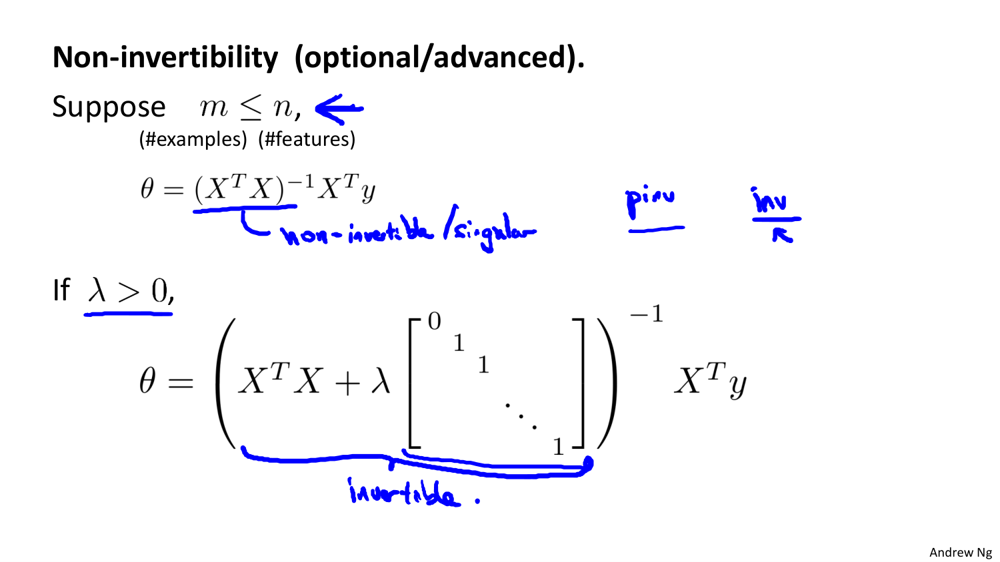
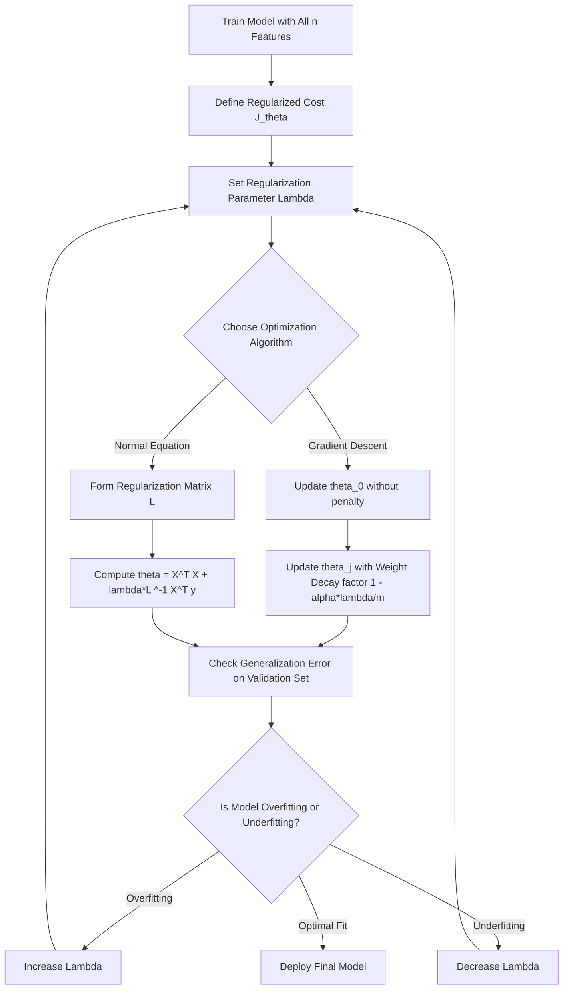

# Chapter: Regularization and Overfitting

---

## 1. The Problem of Overfitting & Underfitting
[Source: Regularization Shared.pdf, Slide 1-3]

When fitting machine learning models, balancing model capacity against dataset size is critical to achieve good generalization on unseen test data.

### 1.1 Bias-Variance Tradeoff Concepts

1. **Underfitting ("High Bias")**:
   - Model is too simple to capture underlying data trends (e.g., fitting a line $h_\theta(x) = \theta_0 + \theta_1 x$ to curved quadratic data).
   - Results in high cost $J(\theta)$ on both training set and test set.

2. **Just Right ("Balanced")**:
   - Model capacity matches data complexity (e.g., quadratic hypothesis $h_\theta(x) = \theta_0 + \theta_1 x + \theta_2 x^2$).
   - Generalizes well to new, unseen examples.

3. **Overfitting ("High Variance")**:
   - Model is overly complex with too many parameters (e.g., 4th-degree polynomial $h_\theta(x) = \sum_{j=0}^4 \theta_j x^j$).
   - Fits training data almost perfectly ($J(\theta) \approx 0$), but fits noise and fails drastically to generalize to new test samples.

### 1.2 Strategies to Resolve Overfitting
1. **Reduce Feature Count**:
   - Manually select subset of features to retain.
   - Use automated model selection algorithms.
   - *Disadvantage*: Discards potentially useful domain information.
2. **Regularization**:
   - Retain all $n$ features, but penalize/shrink parameter magnitudes $\theta_j$ ($j = 1, \dots, n$).
   - Works exceptionally well when having numerous features, each contributing a small amount to target prediction.

---

## 2. Regularized Cost Function ($L_2$ / Ridge Penalty)
[Source: Regularization Shared.pdf, Slide 4-8]

### 2.1 Intuition Behind Penalizing Parameters
Suppose we want to prevent high-degree terms ($\theta_3 x^3, \theta_4 x^4$) from causing wild oscillations. If we add huge penalties (e.g., $1000 \cdot \theta_3^2 + 1000 \cdot \theta_4^2$) to the cost function, optimization will force $\theta_3 \approx 0$ and $\theta_4 \approx 0$, effectively simplifying model behavior.

### 2.2 Formal $L_2$ Regularized Cost Function
The regularized cost function $J(\theta)$ is defined as:

$$
J(\theta) = \frac{1}{2m} \left[ \sum_{i=1}^{m} (h_\theta(x^{(i)}) - y^{(i)})^2 + \lambda \sum_{j=1}^{n} \theta_j^2 \right]
$$

Where:
- $\frac{1}{2m} \sum_{i=1}^{m} (h_\theta(x^{(i)}) - y^{(i)})^2$: Standard Mean Squared Error (Data fit objective).
- $\lambda \sum_{j=1}^{n} \theta_j^2$: Regularization penalty term ($L_2$ norm weight penalty).
- $\lambda \ge 0$: Regularization Parameter controlling trade-off between fitting training data well and keeping parameters small.
- **Index $j = 1$ to $n$**: Notice parameter $\theta_0$ (intercept/bias) is explicitly excluded from penalization by standard convention.

### 2.3 Impact of Regularization Parameter $\lambda$
- **If $\lambda = 0$**: Regularization is disabled, reverting to standard MSE (risk of overfitting).
- **If $\lambda$ is optimal**: Keeps weights small, smoothing hypothesis curve and improving test set generalization.
- **If $\lambda$ is extremely large (e.g., $\lambda = 10^{10}$)**: Penalizes $\theta_1, \dots, \theta_n$ so severely that all $\theta_j \approx 0$. Hypothesis collapses to $h_\theta(x) \approx \theta_0$ (flat horizontal line), resulting in severe **underfitting**.

---

## 3. Regularized Gradient Descent
[Source: Regularization Shared.pdf, Slide 10-12]

Because bias term $\theta_0$ is unpenalized, parameter update equations are split into two distinct cases:

### 3.1 Parameter Update Equations

#### For Bias Term ($j = 0$):

$$
\theta_0 := \theta_0 - \alpha \frac{1}{m} \sum_{i=1}^{m} (h_\theta(x^{(i)}) - y^{(i)}) x_0^{(i)}
$$

#### For Weight Terms ($j = 1, 2, \dots, n$):

$$
\theta_j := \theta_j - \alpha \left[ \frac{1}{m} \sum_{i=1}^{m} (h_\theta(x^{(i)}) - y^{(i)}) x_j^{(i)} + \frac{\lambda}{m} \theta_j \right]
$$

Grouping terms containing $\theta_j$:

$$
\theta_j := \theta_j \left( 1 - \alpha \frac{\lambda}{m} \right) - \alpha \frac{1}{m} \sum_{i=1}^{m} (h_\theta(x^{(i)}) - y^{(i)}) x_j^{(i)}
$$

### 3.2 Weight Decay Interpretation
The factor $\left(1 - \alpha \frac{\lambda}{m}\right)$ explains the term **"Weight Decay"**:
- For typical learning rates $\alpha > 0$ and $\lambda > 0$, the quantity $\left(1 - \alpha \frac{\lambda}{m}\right) < 1$ (e.g., $0.99$).
- In every iteration, $\theta_j$ is first multiplied by $0.99$ (shrinking its magnitude slightly towards zero) before subtracting the standard unregularized gradient step!

---

## 4. Regularized Normal Equation
[Source: Regularization Shared.pdf, Slide 13-14]

### 4.1 Closed-Form Matrix Equation
To find global minimum analytically with $L_2$ regularization, set $\nabla_\theta J(\theta) = \mathbf{0}$:

$$
\theta = \left( X^T X + \lambda L \right)^{-1} X^T y
$$

Where $L$ is an $(n+1) \times (n+1)$ matrix with $0$ at top-left position $(0,0)$ and $1$'s along the remaining diagonal:

$$
L = \begin{bmatrix} 0 & 0 & 0 & \dots & 0 \\ 0 & 1 & 0 & \dots & 0 \\ 0 & 0 & 1 & \dots & 0 \\ \vdots & \vdots & \vdots & \ddots & \vdots \\ 0 & 0 & 0 & \dots & 1 \end{bmatrix} \in \mathbb{R}^{(n+1) \times (n+1)}
$$

### 4.2 Resolution of Non-Invertibility
When $m \le n$ (fewer samples than features), matrix $X^T X$ is singular and non-invertible.

However, for any $\lambda > 0$, matrix $\left( X^T X + \lambda L \right)$ is **guaranteed to be strictly positive definite and invertible**! Thus, regularization completely resolves non-invertibility problems in normal equations.

---

## 5. Mermaid Process Flow

---

## 6. Formula Sheet

| Formula Name | Expression |
|---|---|
| Regularized Cost Function ($L_2$) | $J(\theta) = \frac{1}{2m} \left[ \sum_{i=1}^m (h_\theta(x^{(i)}) - y^{(i)})^2 + \lambda \sum_{j=1}^n \theta_j^2 \right]$ |
| Regularized GD Update ($\theta_0$) | $\theta_0 := \theta_0 - \alpha \frac{1}{m} \sum_{i=1}^m (h_\theta(x^{(i)}) - y^{(i)}) x_0^{(i)}$ |
| Regularized GD Update ($\theta_j, j \ge 1$) | $\theta_j := \theta_j \left(1 - \alpha \frac{\lambda}{m}\right) - \alpha \frac{1}{m} \sum_{i=1}^m (h_\theta(x^{(i)}) - y^{(i)}) x_j^{(i)}$ |
| Regularized Normal Equation | $\theta = \left( X^T X + \lambda L \right)^{-1} X^T y$ |
| Weight Decay Factor | $1 - \alpha \frac{\lambda}{m} < 1$ |

---

## 7. Exam-Oriented Review

### 7.1 Potential Exam Questions

1. **Why is the bias parameter $\theta_0$ excluded from the regularization penalty in $J(\theta)$?**
   - *Solution*: Penalizing $\theta_0$ forces baseline target predictions towards zero, regardless of data location. Unpenalized $\theta_0$ allows model hypothesis to freely shift vertically without penalty while regularizing feature sensitivities ($\theta_1, \dots, \theta_n$).

2. **Prove mathematically why adding $\lambda L$ ($\lambda > 0$) guarantees invertibility of $(X^T X + \lambda L)$.**
   - *Solution*: $X^T X$ is positive semi-definite ($v^T X^T X v = \|Xv\|^2 \ge 0$). Matrix $\lambda L$ for $j \ge 1$ adds positive eigenvalues $\lambda > 0$ to all feature directions. The sum $(X^T X + \lambda L)$ is strictly positive definite ($v^T (X^T X + \lambda L) v > 0$ for all $v \ne \mathbf{0}$), ensuring non-zero determinant and invertibility.

### 7.2 Numerical Problem & Step-by-Step Solution

**Problem**:
Consider a 1-feature dataset ($m = 2, n = 1$):
- $x^{(1)} = 1, y^{(1)} = 2$
- $x^{(2)} = 2, y^{(2)} = 4$

Suppose $\theta_0 = 0$ is fixed. For weight parameter $\theta_1$, given $\alpha = 0.1$, $m = 2$, regularization parameter $\lambda = 4$, and current $\theta_1 = 3$:
1. Calculate prediction $h_\theta(x^{(i)})$ and unregularized gradient step.
2. Compute weight decay factor $\left(1 - \alpha \frac{\lambda}{m}\right)$.
3. Perform one step of regularized gradient descent to compute updated parameter $\theta_1^{(new)}$.

**Step-by-Step Solution**:

**Step 1: Compute Predictions**:
- $h_\theta(x^{(1)}) = 3 \times 1 = 3$ (actual $y^{(1)} = 2 \implies \text{error} = +1$)
- $h_\theta(x^{(2)}) = 3 \times 2 = 6$ (actual $y^{(2)} = 4 \implies \text{error} = +2$)

**Step 2: Unregularized Data Gradient**:

$$
\frac{1}{m} \sum_{i=1}^2 (h_\theta(x^{(i)}) - y^{(i)}) x^{(i)} = \frac{1}{2} [(1)(1) + (2)(2)] = \frac{1 + 4}{2} = 2.5
$$

**Step 3: Weight Decay Factor**:

$$
1 - \alpha \frac{\lambda}{m} = 1 - 0.1 \times \frac{4}{2} = 1 - 0.2 = 0.8
$$

**Step 4: Regularized Parameter Update**:

$$
\theta_1^{(new)} := \theta_1 \left(1 - \alpha \frac{\lambda}{m}\right) - \alpha (\text{data gradient})
$$

$$
\theta_1^{(new)} := 3 \times 0.8 - 0.1 \times 2.5 = 2.4 - 0.25 = 2.15
$$

**Final Answer**:
- Weight decay reduced parameter from $3.0 \to 2.4$ prior to subtracting data gradient $0.25$, yielding final parameter $\theta_1^{(new)} = 2.15$.

## Key Summary & Definition
- Standard definition definitions and notes.