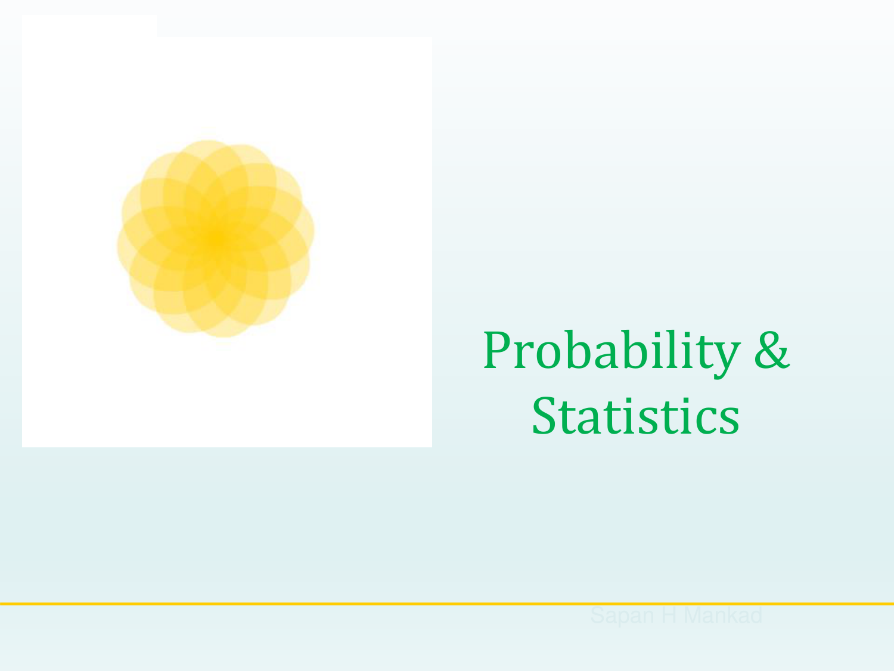
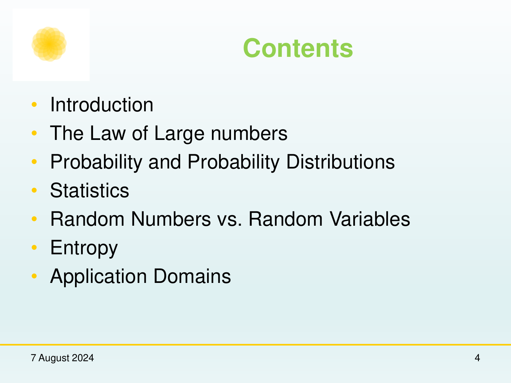
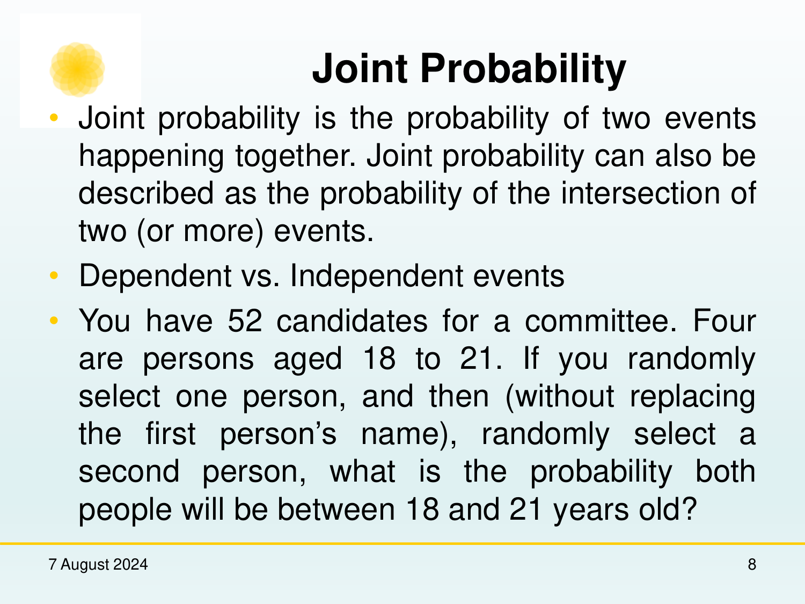
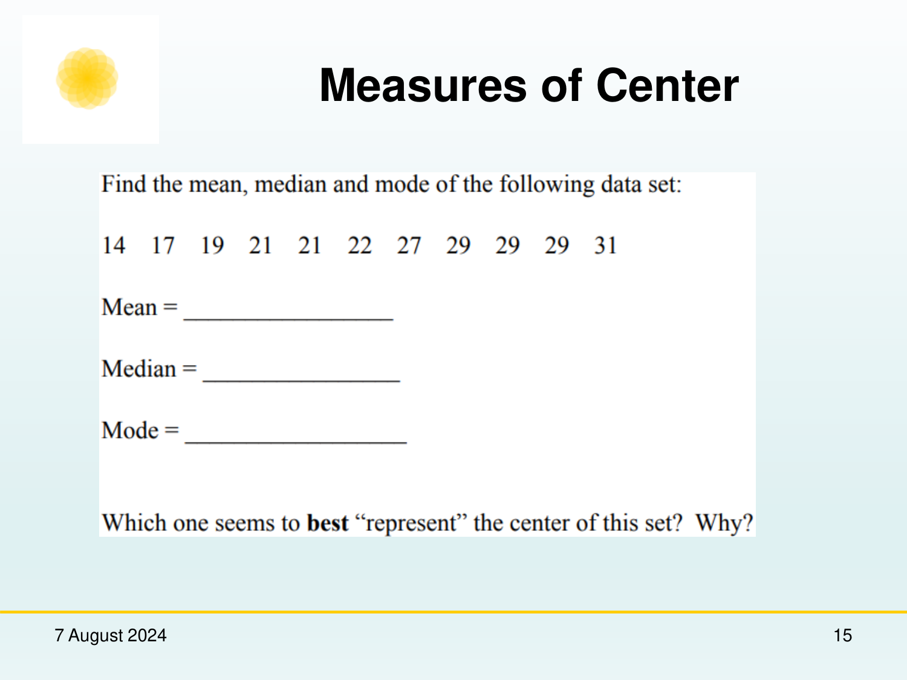
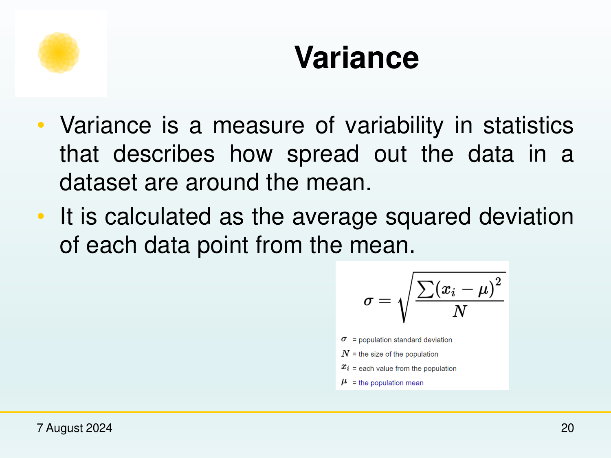
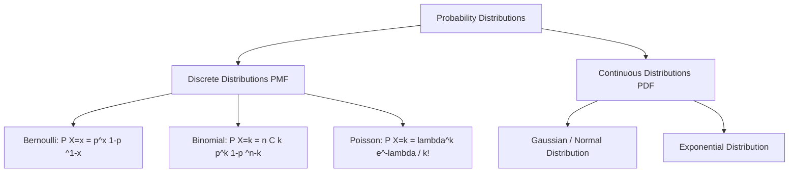
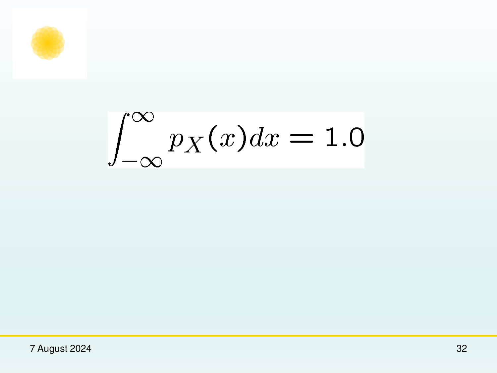
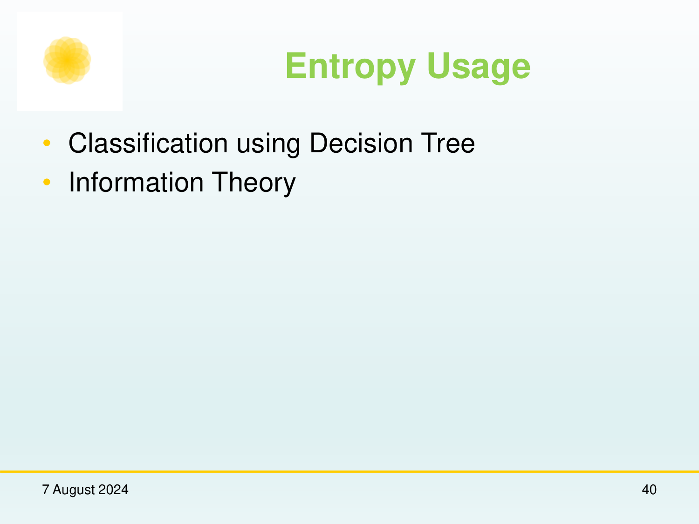

# Chapter: Probability & Statistics for Machine Learning

## Source map

- `ps4ml.pdf` — primary course presentation file.

---

## 1. Introduction and Objectives
[Source: ps4ml.pdf, Slide 1-5]

Probability and statistics form the mathematical bedrock of machine learning, enabling models to quantify uncertainty, perform probabilistic inference, estimate parameters, and optimize decision-making under noise.

---

## 2. Law of Large Numbers (LLN)
[Source: ps4ml.pdf, Slide 5-12]

### 2.1 Theoretical Foundations
The Law of Large Numbers states that as the number of independent and identically distributed (i.i.d.) trials $n$ approaches infinity, the sample average $\bar{X}_n$ converges towards the true expected value $\mu = \mathbb{E}[X]$.

#### Mathematical Statement:

$$
\lim_{n \to \infty} P(|\bar{X}_n - \mu| < \epsilon) = 1 \quad \text{for any } \epsilon > 0
$$

Where:
- $\bar{X}_n = \frac{1}{n} \sum_{i=1}^n X_i$: Sample mean after $n$ trials.
- $\mu = \mathbb{E}[X]$: Population mean (true theoretical expectation).
- $\epsilon > 0$: Arbitrarily small positive constant tolerance.

---

## 3. Probability Foundations & Distributions
[Source: ps4ml.pdf, Slide 13-28]

### 3.1 Conditional Probability & Bayes' Theorem
Conditional probability measures the likelihood of event $A$ occurring given that event $B$ has already occurred:

$$
P(A \mid B) = \frac{P(A \cap B)}{P(B)} \quad \text{provided } P(B) > 0
$$

#### Bayes' Theorem Formulation:

$$
P(A \mid B) = \frac{P(B \mid A) P(A)}{P(B)}
$$

Where:
- $P(A \mid B)$: Posterior probability of hypothesis $A$ given evidence $B$.
- $P(B \mid A)$: Likelihood of observing evidence $B$ under hypothesis $A$.
- $P(A)$: Prior probability of hypothesis $A$.
- $P(B) = \sum_k P(B \mid A_k) P(A_k)$: Marginal probability of evidence $B$ (normalizing constant).

### 3.2 Discrete vs. Continuous Distributions

#### Gaussian (Normal) Distribution PDF:

$$
f(x \mid \mu, \sigma^2) = \frac{1}{\sqrt{2\pi\sigma^2}} \exp\left( -\frac{(x - \mu)^2}{2\sigma^2} \right)
$$

Where $\mu$ is the distribution mean and $\sigma^2$ is variance.

---

## 4. Statistical Inference & Parameter Estimation
[Source: ps4ml.pdf, Slide 29-44]

### 4.1 Maximum Likelihood Estimation (MLE)
Given i.i.d. dataset $\mathcal{D} = \{x^{(1)}, \dots, x^{(m)}\}$, Maximum Likelihood Estimation finds parameter vector $\theta$ maximizing likelihood $L(\theta) = \prod_{i=1}^m P(x^{(i)} \mid \theta)$.

#### Log-Likelihood Objective:

$$
\theta_{\text{MLE}} = \arg\max_\theta \log L(\theta) = \arg\max_\theta \sum_{i=1}^m \log P(x^{(i)} \mid \theta)
$$

---

## 5. Definitions and Terms

### Definition: Sample Space ($\Omega$)
The set of all possible outcomes of a random experiment.

### Definition: Law of Large Numbers
The probability theorem stating that the average of results obtained from a large number of independent trials converges to expected value $\mu$.

### Definition: Maximum Likelihood Estimator
A method of estimating parameters of an assumed probability distribution by maximizing the log-likelihood function.

---

## 6. Formula Sheet

| Concept | Expression |
|---|---|
| Law of Large Numbers | $\lim_{n \to \infty} \bar{X}_n = \mu$ |
| Bayes' Theorem | $P(A \mid B) = \frac{P(B \mid A) P(A)}{P(B)}$ |
| Gaussian PDF | $f(x) = \frac{1}{\sqrt{2\pi\sigma^2}} e^{-\frac{(x-\mu)^2}{2\sigma^2}}$ |
| MLE Objective | $\theta_{\text{MLE}} = \arg\max_\theta \sum_{i=1}^m \log P(x^{(i)} \mid \theta)$ |

---

## 7. Exam-Oriented Review

### 7.1 Potential Exam Questions
1. **Explain the Law of Large Numbers and its implication for sample mean estimation in Machine Learning.**
   - *Solution*: As sample size $n \to \infty$, the sample mean $\bar{X}_n$ converges almost surely to true expectation $\mu$. In ML, this guarantees empirical risk minimization converges to true risk as training dataset size grows arbitrarily large.

2. **Derive Bayes' Theorem from the definition of conditional probability.**
   - *Solution*:
     1. By definition: $P(A \mid B) = \frac{P(A \cap B)}{P(B)} \implies P(A \cap B) = P(A \mid B) P(B)$.
     2. Similarly: $P(B \mid A) = \frac{P(A \cap B)}{P(A)} \implies P(A \cap B) = P(B \mid A) P(A)$.
     3. Equating both: $P(A \mid B) P(B) = P(B \mid A) P(A) \implies P(A \mid B) = \frac{P(B \mid A) P(A)}{P(B)}$.

### 7.2 Numerical Problem & Step-by-Step Solution
**Problem**: Medical test for a disease has $99\%$ sensitivity ($P(\text{Positive} \mid \text{Disease}) = 0.99$) and $95\%$ specificity ($P(\text{Negative} \mid \text{No Disease}) = 0.95$). If disease prevalence $P(\text{Disease}) = 0.001$, compute probability a person has disease given positive test result $P(\text{Disease} \mid \text{Positive})$.

**Solution**:
1. $P(D) = 0.001 \implies P(\neg D) = 0.999$.
2. $P(+ \mid D) = 0.99$, $P(+ \mid \neg D) = 1 - 0.95 = 0.05$.
3. Compute total probability of positive test $P(+)$:

$$
P(+) = P(+ \mid D)P(D) + P(+ \mid \neg D)P(\neg D) = (0.99 \times 0.001) + (0.05 \times 0.999) = 0.00099 + 0.04995 = 0.05094
$$

4. Compute Bayes posterior $P(D \mid +)$:

$$
P(D \mid +) = \frac{0.00099}{0.05094} \approx 0.01943 \implies 1.94\%
$$
