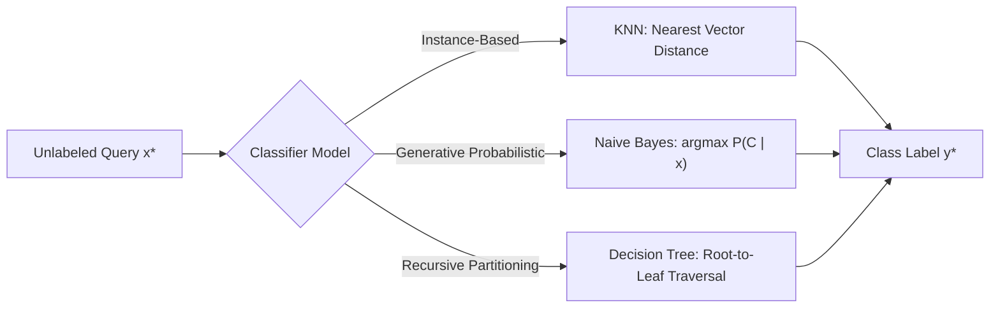
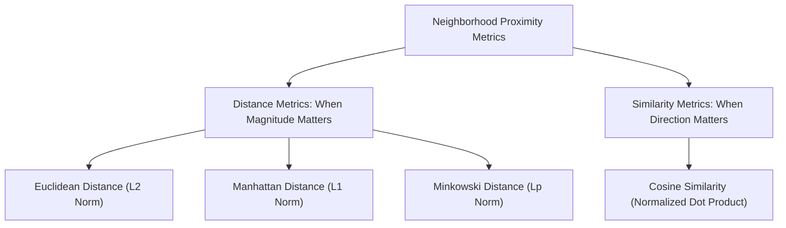
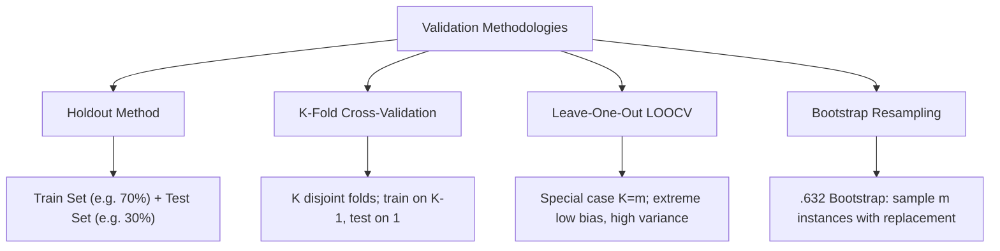
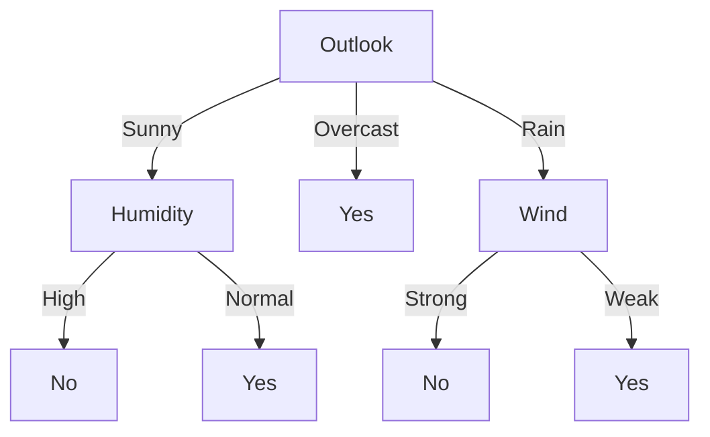
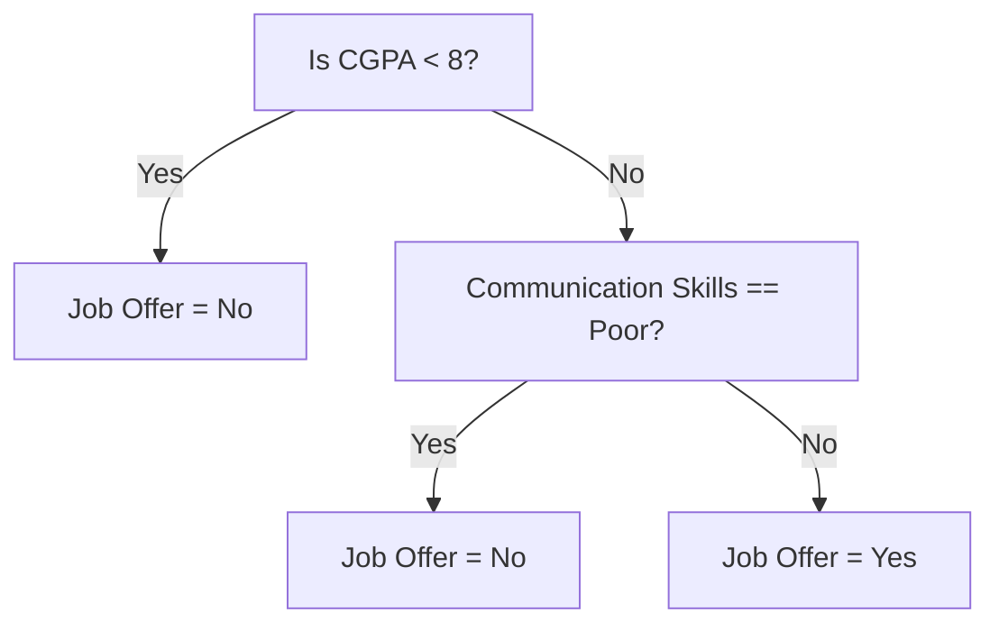

# Complete Machine Learning Notes: Supervised Classification

> **Course Code:** 3CS526CC23 / ML-Course

> **Course Title:** Machine Learning and its Applications

> **Primary Source:** Faculty Lecture Slides - Nirma University

> **Files Integrated:** `KNN Naive Bayes and DT1.pdf` (102 Slides)

---

# Chapter 6 — Supervised Classification: K-Nearest Neighbors, Naïve Bayes, and Decision Trees

## 1. Chapter Overview

Supervised classification is one of the most fundamental tasks in machine learning. Given a labeled training dataset $\mathcal{D} = \{(\mathbf{x}^{(1)}, y^{(1)}), (\mathbf{x}^{(2)}, y^{(2)}), \dots, (\mathbf{x}^{(m)}, y^{(m)})\}$, where $\mathbf{x}^{(i)} \in \mathbb{R}^d$denotes a$d$-dimensional feature vector and $y^{(i)} \in \{C_1, C_2, \dots, C_K\}$ represents a categorical class label, the objective is to learn a mapping function $f: \mathcal{X} \to \mathcal{Y}$ that accurately predicts the class label for novel, unseen query instances.

This chapter provides an exhaustive, exam-focused synthesis of three foundational classification paradigms:

1. **Instance-Based (Lazy) Learning:** K-Nearest Neighbors (KNN), which avoids explicit model training and classifies query points using local geometric neighborhoods.

2. **Generative Probabilistic Learning:** Naïve Bayes Classifiers (Multinomial, Multivariate Bernoulli, and Gaussian), which apply Bayes' theorem assuming conditional independence among features given the class.

3. **Non-Parametric Decision Trees:** ID3 (Shannon Entropy & Information Gain), C4.5 (Split Information & Gain Ratio), and CART (Gini Impurity & Binary Splits), which recursively partition the feature space into interpretable decision regions.

4. **Validation and Diagnostic Protocols:** Confusion matrices, multiclass evaluation, Holdout, Cross-Validation, and Bootstrap resampling methods.

[Source: KNN Naive Bayes and DT1.pdf, Slides 1–3]

---

## 2. Fundamental Concepts

### 2.1 The Classification Pipeline

In classification, machine learning systems operate across two distinct operational phases:

- **Training Phase:** Training instances are processed to construct an internal model representation (compiled hypothesis for eager learners; stored vector database for lazy learners).

- **Inference / Prediction Phase:** An unlabeled query vector $\mathbf{x}^*$is evaluated to assign a predicted class label$\hat{y} = f(\mathbf{x}^*)$.

### 2.2 Taxonomy of Supervised Learners

| Characteristic | Lazy Learners (KNN) | Eager Probabilistic (Naïve Bayes) | Eager Rule-Based (Decision Trees) |

| :--- | :--- | :--- | :--- |

| **Model Nature** | Non-parametric, instance-storing | Parametric generative probabilistic | Non-parametric hierarchical rule induction |

| **Training Complexity** | $O(1)$(trivial storage) |$O(m \cdot d)$(frequency counting / stats) |$O(d \cdot m \log m)$ (sorting & splitting) |

| **Inference Complexity** | $O(m \cdot d)$(exhaustive distance calculation) |$O(K \cdot d)$(evaluating class likelihoods) |$O(\text{tree depth}) \le O(d)$ |

| **Memory Footprint** | $O(m \cdot d)$(retains entire training set) |$O(K \cdot d)$(stores class priors & likelihoods) |$O(\text{node count})$ (compact tree) |

| **Interpretability** | Low (no explicit global rules) | Moderate (probabilistic evidence weights) | High (human-readable if-then rules) |

[Source: KNN Naive Bayes and DT1.pdf, Slides 2–5]

---

## 3. Core Terminology Dictionary

1. **Instance-Based Learning:** An inductive learning approach that defers model generalization until an explicit query is presented, predicting class labels based on local stored training exemplars.

2. **Voronoi Cell:** A convex polyhedral region in feature space surrounding a training instance such that every point inside the cell is closer to that instance than to any other.

3. **K-Nearest Neighbors (KNN):** A non-parametric classifier that assigns an unlabeled query input to the majority class among its $k$ closest training neighbors.

4. **Euclidean Distance:** The straight-line $L_2$ norm distance between two points in Euclidean feature space.

5. **Cosine Similarity:** The normalized dot product measuring the angular cosine between two vectors, invariant to vector magnitude.

6. **Prior Probability $P(C_k)$:** The baseline probability of observing class $C_k$ in the dataset prior to considering feature evidence.

7. **Likelihood $P(\mathbf{x} \mid C_k)$:** The conditional probability of observing feature vector $\mathbf{x}$given that the class is$C_k$.

8. **Posterior Probability $P(C_k \mid \mathbf{x})$:** The updated probability of class $C_k$after incorporating observed feature evidence$\mathbf{x}$.

9. **Naïve Independence Assumption:** The assumption that feature attributes $X_1, X_2, \dots, X_d$are mutually conditionally independent given class$C_k$.

10. **Laplace (Add-1) Smoothing:** A pseudo-count regularization technique that eliminates zero probabilities in categorical frequency estimation.

11. **Multinomial Naïve Bayes:** A Naïve Bayes variant designed for discrete frequency count data (e.g., word occurrences in documents).

12. **Multivariate Bernoulli Naïve Bayes:** A Naïve Bayes variant where features are binary indicators ($0$or$1$) representing attribute presence or absence.

13. **Gaussian Naïve Bayes:** A Naïve Bayes variant for continuous real-valued features assuming a Gaussian (normal) probability distribution per class.

14. **Confusion Matrix:** A tabular representation comparing actual ground-truth classes against model predictions to evaluate diagnostic error metrics.

15. **Sensitivity (Recall / True Positive Rate):** The proportion of actual positive instances correctly predicted as positive by the classifier.

16. **Specificity (True Negative Rate):** The proportion of actual negative instances correctly predicted as negative by the classifier.

17. **Precision (Positive Predictive Value):** The proportion of positive predictions that are truly positive.

18. **F1-Score:** The harmonic mean of Precision and Recall, balancing false positives and false negatives.

19. **Shannon Entropy $H(S)$:** An information-theoretic measure quantifying the impurity or uncertainty in dataset $S$.

20. **Information Gain $IG(S, A)$:** The expected reduction in entropy achieved by partitioning dataset $S$based on attribute$A$.

21. **Split Information:** The intrinsic entropy of an attribute partition measuring the breadth and uniformity of the split.

22. **Gain Ratio:** Information Gain normalized by Split Information, introduced in C4.5 to penalize high-cardinality attributes.

23. **Gini Impurity:** A statistical metric used in CART representing the probability that a randomly chosen sample would be misclassified.

24. **Pre-Pruning:** Halting decision tree growth prematurely during induction based on stopping thresholds (e.g., depth cap, sample size).

25. **Post-Pruning:** Growing a full decision tree to max depth and subsequently collapsing non-significant subtrees from the bottom up.

[Source: KNN Naive Bayes and DT1.pdf, Slides 2–100]

---

## 4. K-Nearest Neighbors (KNN) Classifier

[Source: KNN Naive Bayes and DT1.pdf, Slides 3–9]

### 4.1 Concept, Theory, and Geometric Intuition

- **Lazy vs. Eager Learning:** KNN performs zero abstraction during the training phase ($O(1)$ training complexity). It simply stores the training instances in memory and defers all computation until an explicit query instance $\mathbf{x}^*$ is presented.

- **Geometric Voronoi Tessellation:** KNN partitions the feature space into local decision regions known as Voronoi cells. When $k=1$, the decision boundary is formed by the perpendicular bisectors between adjacent class exemplars, resulting in jagged, non-linear boundaries.

- **Decision Rule:** To classify query point $\mathbf{x}^*$:

  1. Compute the pairwise distance between $\mathbf{x}^*$and all$m$stored training instances$\mathbf{x}^{(i)}$.

  2. Select the $k$training points with the smallest distance values, forming neighborhood$\mathcal{N}_k(\mathbf{x}^*)$.

  3. Predict label $\hat{y}$ via majority voting (or distance-weighted voting).

### Figure 6.1: KNN Decision Boundaries and Voronoi Tessellation

**What it shows:**

Figure 6.1 illustrates how KNN constructs piecewise linear decision boundaries. Each stored exemplar serves as a generator point for a Voronoi region. As $k$ increases, local noise is filtered out, smoothing the decision boundary.

---

### 4.2 Choice of $k$ and Bias-Variance Tradeoff

The hyperparameter $k$ controls the model capacity and generalization performance:

- **Small $k$(e.g.,$k=1$):**

  - High sensitivity to local sample noise and outliers.

  - Low bias, high variance (overfitting).

  - Decision boundary is highly complex, jagged, and flexible.

- **Large $k$(e.g.,$k \approx m$):**

  - Excessive smoothing across class boundaries.

  - High bias, low variance (underfitting).

  - Decision boundary approaches a simple linear/global boundary dominated by the majority class in the entire dataset.

- **Selection Heuristic:**

  - $k$is commonly chosen as an odd integer (e.g.,$k = 3, 5, 7$) in binary classification to eliminate tie votes.

  - A standard rule of thumb is setting $k \approx \sqrt{m}$, where $m$ is the number of training instances, verified using cross-validation.

---

### 4.3 Distance & Similarity Metrics

#### Mathematical Formulations:

1. **Euclidean Distance ($L_2$ Norm):**

$$
d_2(\mathbf{u}, \mathbf{v}) = \sqrt{\sum_{j=1}^{d} (u_j - v_j)^2} = \|\mathbf{u} - \mathbf{v}\|_2
$$

2. **Manhattan Distance ($L_1$ Norm / City-Block):**

$$
d_1(\mathbf{u}, \mathbf{v}) = \sum_{j=1}^{d} |u_j - v_j| = \|\mathbf{u} - \mathbf{v}\|_1
$$

3. **Minkowski Distance ($L_p$ Metric):**

$$
d_p(\mathbf{u}, \mathbf{v}) = \left( \sum_{j=1}^{d} |u_j - v_j|^p \right)^{\frac{1}{p}}
$$

- Special cases: $p=1$yields Manhattan distance;$p=2$yields Euclidean distance;$p \to \infty$ yields Chebyshev distance ($\max_j |u_j - v_j|$).

4. **Cosine Similarity & Cosine Distance:**

$$
\text{CosineSimilarity}(\mathbf{u}, \mathbf{v}) = \frac{\mathbf{u} \cdot \mathbf{v}}{\|\mathbf{u}\|_2 \|\mathbf{v}\|_2} = \frac{\sum_{j=1}^d u_j v_j}{\sqrt{\sum_{j=1}^d u_j^2} \sqrt{\sum_{j=1}^d v_j^2}}
$$

$$
d_{\text{Cosine}}(\mathbf{u}, \mathbf{v}) = 1 - \text{CosineSimilarity}(\mathbf{u}, \mathbf{v})
$$

#### Selection Guidelines:

- **Euclidean/Manhattan Distance:** Preferred when features are continuous, dense, and absolute spatial magnitude matters.

- **Cosine Distance:** Preferred when features are sparse and high-dimensional, such as text term-frequency vectors where document length varies.

[Source: KNN Naive Bayes and DT1.pdf, Slide 6]

---

### 4.4 Voting Protocols and Choice of Decision Rules

#### Standard Majority Voting

Each of the $k$ nearest neighbors gets an equal vote ($1$ vote each):

$$
\hat{y} = \arg\max_{c \in \{1, \dots, K\}} \sum_{i \in \mathcal{N}_k(\mathbf{x}^*)} \mathbb{I}(y^{(i)} = c)
$$

Where $\mathbb{I}(\cdot)$ is the indicator function ($1$if true,$0$ if false).

#### Distance-Weighted Voting

To give closer neighbors greater influence than distant ones:

$$
w_i = \frac{1}{d(\mathbf{x}^*, \mathbf{x}^{(i)})^2} \quad \text{or} \quad w_i = \frac{1}{d(\mathbf{x}^*, \mathbf{x}^{(i)})}
$$

$$
\hat{y} = \arg\max_{c \in \{1, \dots, K\}} \sum_{i \in \mathcal{N}_k(\mathbf{x}^*)} w_i \cdot \mathbb{I}(y^{(i)} = c)
$$

### Figure 6.2: 1-NN vs. K-NN Decision Behavior

**Empirical Observations from Slide 9:**

- **1-NN:** Predicts Class B (closest single neighbor is Class B).

- **3-NN:** Predicts Class B (2 out of 3 neighbors are Class B).

- **5-NN:** Predicts Class A (3 out of 5 neighbors are Class A).

- **Distance-Weighted 3-NN:** Selects Class B due to the high inverse-distance weight of the immediate Class B neighbor.

---

### 4.5 Edge Cases and Practical Considerations in KNN

1. **Feature Scaling Requirement:**

   - Distance calculations are heavily dominated by features with large absolute ranges (e.g., Annual Income in thousands vs. Age in years).

   - **Min-Max Normalization:** Scales features to $[0, 1]$:

$$
x_{\text{scaled}} = \frac{x - x_{\min}}{x_{\max} - x_{\min}}
$$

   - **Z-score Standardization:** Transforms features to mean $\mu=0$and variance$\sigma^2=1$:

$$
x_{\text{standard}} = \frac{x - \mu}{\sigma}
$$

2. **Handling Tie Votes:**

   - If two classes receive equal votes in majority voting, tie-breaking heuristics include:

     - Reducing $k$ by 1 until the tie is broken.

     - Using distance-weighted voting as a fallback.

     - Randomly selecting among tied classes or selecting the class with higher global prior probability $P(C_k)$.

3. **Curse of Dimensionality:**

   - In high-dimensional spaces ($d \gg 10$), the volume of the space grows exponentially, causing training instances to become sparse and equidistant from one another ($d_{\max} \approx d_{\min}$). Distance metrics lose discriminative power, requiring dimensionality reduction (PCA or feature selection) prior to running KNN.

---

### 4.6 Step-by-Step Solved Numerical Exam Problem: KNN Classification & Feature Normalization

> **Exam Problem:**

> A bank evaluates loan applicant risk based on two features: $X_1 = \text{Age (years)}$and$X_2 = \text{Income (\$1000s)}$.

>

> Training Dataset ($m = 5$ instances):

>

> | Instance | Age ($X_1$) | Income ($X_2$) | Risk Class ($Y$) |

> | :---: | :---: | :---: | :---: |

> | **A** | 25 | 40 | Low Risk ($+1$) |

> | **B** | 35 | 60 | Low Risk ($+1$) |

> | **C** | 45 | 80 | High Risk ($-1$) |

> | **D** | 20 | 20 | High Risk ($-1$) |

> | **E** | 50 | 120 | Low Risk ($+1$) |

>

> Query Instance: $\mathbf{x}^* = (\text{Age} = 30, \text{Income} = 50)$.

>

> **Task:**

> 1. Compute unnormalized Euclidean distances from $\mathbf{x}^*$ to all training instances and determine the 3-NN prediction under standard majority voting.

> 2. Demonstrate the effect of Min-Max feature normalization on distances and compute the normalized 3-NN prediction under both standard and distance-weighted voting ($w_i = 1/d_i^2$).

#### Part 1: Unnormalized Distance Calculations

Query: $\mathbf{x}^* = (30, 50)$

- $d(\mathbf{x}^*, A) = \sqrt{(30 - 25)^2 + (50 - 40)^2} = \sqrt{25 + 100} = \sqrt{125} \approx \mathbf{11.180}$

- $d(\mathbf{x}^*, B) = \sqrt{(30 - 35)^2 + (50 - 60)^2} = \sqrt{25 + 100} = \sqrt{125} \approx \mathbf{11.180}$

- $d(\mathbf{x}^*, C) = \sqrt{(30 - 45)^2 + (50 - 80)^2} = \sqrt{225 + 900} = \sqrt{1125} \approx \mathbf{33.541}$

- $d(\mathbf{x}^*, D) = \sqrt{(30 - 20)^2 + (50 - 20)^2} = \sqrt{100 + 900} = \sqrt{1000} \approx \mathbf{31.623}$

- $d(\mathbf{x}^*, E) = \sqrt{(30 - 50)^2 + (50 - 120)^2} = \sqrt{400 + 4900} = \sqrt{5300} \approx \mathbf{72.801}$

**Unnormalized 3-NN Neighbors:**

Smallest 3 distances: $A$ ($11.180$), $B$ ($11.180$), $D$ ($31.623$).

- $A \implies \text{Low Risk } (+1)$

- $B \implies \text{Low Risk } (+1)$

- $D \implies \text{High Risk } (-1)$

**Unnormalized 3-NN Decision:**

Majority Vote: 2 Low Risk vs 1 High Risk $\implies$ **Predicted Class = Low Risk ($+1$)**.

---

#### Part 2: Min-Max Feature Normalization

Feature Ranges:

- Age ($X_1$): $X_{1, \min} = 20, X_{1, \max} = 50 \implies \text{Range} = 30$.

- Income ($X_2$): $X_{2, \min} = 20, X_{2, \max} = 120 \implies \text{Range} = 100$.

Normalized Formula: $x' = \frac{x - x_{\min}}{x_{\max} - x_{\min}}$

Normalized Training Table:

| Instance | Age ($X_1'$) | Income ($X_2'$) | Class ($Y$) |

| :---: | :---: | :---: | :---: |

| **A** | $\frac{25-20}{30} = 0.1667$|$\frac{40-20}{100} = 0.2000$ | Low Risk ($+1$) |

| **B** | $\frac{35-20}{30} = 0.5000$|$\frac{60-20}{100} = 0.4000$ | Low Risk ($+1$) |

| **C** | $\frac{45-20}{30} = 0.8333$|$\frac{80-20}{100} = 0.6000$ | High Risk ($-1$) |

| **D** | $\frac{20-20}{30} = 0.0000$|$\frac{20-20}{100} = 0.0000$ | High Risk ($-1$) |

| **E** | $\frac{50-20}{30} = 1.0000$|$\frac{120-20}{100} = 1.0000$ | Low Risk ($+1$) |

Normalized Query Vector:

$\mathbf{x}^{*'} = \left(\frac{30-20}{30}, \frac{50-20}{100}\right) = (0.3333, 0.3000)$

Normalized Euclidean Distances:

- $d'(\mathbf{x}^*, A) = \sqrt{(0.3333 - 0.1667)^2 + (0.3000 - 0.2000)^2} = \sqrt{0.1666^2 + 0.1000^2} = \sqrt{0.02776 + 0.0100} = \mathbf{0.1943}$

- $d'(\mathbf{x}^*, B) = \sqrt{(0.3333 - 0.5000)^2 + (0.3000 - 0.4000)^2} = \sqrt{(-0.1667)^2 + (-0.1000)^2} = \sqrt{0.02779 + 0.0100} = \mathbf{0.1944}$

- $d'(\mathbf{x}^*, C) = \sqrt{(0.3333 - 0.8333)^2 + (0.3000 - 0.6000)^2} = \sqrt{(-0.5000)^2 + (-0.3000)^2} = \sqrt{0.2500 + 0.0900} = \mathbf{0.5831}$

- $d'(\mathbf{x}^*, D) = \sqrt{(0.3333 - 0.0000)^2 + (0.3000 - 0.0000)^2} = \sqrt{0.3333^2 + 0.3000^2} = \sqrt{0.1111 + 0.0900} = \mathbf{0.4484}$

- $d'(\mathbf{x}^*, E) = \sqrt{(0.3333 - 1.0000)^2 + (0.3000 - 1.0000)^2} = \sqrt{(-0.6667)^2 + (-0.7000)^2} = \sqrt{0.4445 + 0.4900} = \mathbf{0.9667}$

**Normalized 3-NN Neighbors:**

Smallest 3 normalized distances:

1. Instance $A$: $d' = 0.1943 \implies \text{Low Risk } (+1)$

2. Instance $B$: $d' = 0.1944 \implies \text{Low Risk } (+1)$

3. Instance $D$: $d' = 0.4484 \implies \text{High Risk } (-1)$

**Normalized Distance-Weighted 3-NN Calculation:**

Weights $w_i = \frac{1}{(d'_i)^2}$:

- $w_A = \frac{1}{(0.1943)^2} = \frac{1}{0.03775} = \mathbf{26.490}$

- $w_B = \frac{1}{(0.1944)^2} = \frac{1}{0.03779} = \mathbf{26.462}$

- $w_D = \frac{1}{(0.4484)^2} = \frac{1}{0.20106} = \mathbf{4.974}$

Weighted Class Sums:

- Total Weight for Low Risk ($+1$): $w_A + w_B = 26.490 + 26.462 = \mathbf{52.952}$

- Total Weight for High Risk ($-1$): $w_D = \mathbf{4.974}$

**Final Conclusion:** Under both standard majority voting and distance-weighted voting, the query instance $\mathbf{x}^*$ is classified as **Low Risk ($+1$)**.

---

## 5. Mathematical Foundations of Naïve Bayes Classifiers

[Source: KNN Naive Bayes and DT1.pdf, Slides 10–24]

### 5.1 Bayes' Theorem Formulation

Naïve Bayes is a generative probabilistic classifier rooted in Bayes' Rule of conditional probability:

$$
P(C_k \mid \mathbf{x}) = \frac{P(\mathbf{x} \mid C_k) P(C_k)}{P(\mathbf{x})}
$$

Where:

- $P(C_k \mid \mathbf{x})$: **Posterior Probability** of class $C_k$given feature vector$\mathbf{x} = (x_1, x_2, \dots, x_d)^T$.

- $P(\mathbf{x} \mid C_k)$: **Class-Conditional Likelihood** of observing feature vector $\mathbf{x}$given class$C_k$.

- $P(C_k)$: **Prior Probability** of class $C_k$.

- $P(\mathbf{x})$: **Evidence (Marginal Probability)** normalizing the posterior across all $K$ classes:

$$
P(\mathbf{x}) = \sum_{j=1}^{K} P(\mathbf{x} \mid C_j) P(C_j)
$$

### Figure 6.3: Bayes' Theorem Derivation and Architecture

---

### 5.2 Formal Derivation of the Naïve Bayes Objective

1. **Joint Probability Expansion via the Chain Rule:**

By conditional probability rules, the joint probability of observing class $C_k$and features$x_1, \dots, x_d$ is:

$$
P(C_k, x_1, x_2, \dots, x_d) = P(C_k) \cdot P(x_1 \mid C_k) \cdot P(x_2 \mid C_k, x_1) \cdots P(x_d \mid C_k, x_1, \dots, x_{d-1})
$$

2. **The Naïve Conditional Independence Assumption:**

Estimating full joint likelihoods requires $O(K \cdot 2^d)$ parameters, leading to data sparsity issues. Naïve Bayes assumes that each feature $x_i$is conditionally independent of every other feature$x_j$ ($j \ne i$) given class $C_k$:

$$
P(x_i \mid C_k, x_1, \dots, x_{i-1}) = P(x_i \mid C_k)
$$

Substituting this assumption into the joint likelihood yields:

$$
P(\mathbf{x} \mid C_k) = P(x_1, x_2, \dots, x_d \mid C_k) = \prod_{j=1}^{d} P(x_j \mid C_k)
$$

### Figure 6.4: Naïve Conditional Independence Assumption

**Written Analysis of Figure 6.4:**

The graphical model illustrates a Bayesian network where the class node $C$is the single parent node pointing to child attribute nodes$X_1, X_2, \dots, X_d$. Conditioned on $C$, all paths between attributes are d-separated, meaning features do not directly interact with one another.

3. **Maximum A Posteriori (MAP) Decision Rule:**

Because evidence denominator $P(\mathbf{x})$is constant across all candidate classes$C_k$, it is dropped during class maximization:

$$
\begin{aligned}
\hat{y} &= \arg\max_{k \in \{1, \dots, K\}} P(C_k \mid \mathbf{x}) \\
&= \arg\max_{k \in \{1, \dots, K\}} \frac{P(C_k) \prod_{j=1}^{d} P(x_j \mid C_k)}{P(\mathbf{x})} \\
&= \arg\max_{k \in \{1, \dots, K\}} P(C_k) \prod_{j=1}^{d} P(x_j \mid C_k)
\end{aligned}
$$

4. **Log-Likelihood Transformation (Numerical Underflow Prevention):**

Multiplying many small floating-point probabilities $P(x_j \mid C_k) < 1$ causes arithmetic underflow on modern computers. Taking the natural logarithm transforms products into summations:

$$
\hat{y} = \arg\max_{k \in \{1, \dots, K\}} \left[ \ln P(C_k) + \sum_{j=1}^{d} \ln P(x_j \mid C_k) \right]
$$

[Source: KNN Naive Bayes and DT1.pdf, Slides 14–21]

---

### 5.3 Zero-Frequency Problem & Laplace Smoothing

If a feature value $x_j$never appears alongside class$C_k$ in the training set, its empirical probability estimate becomes zero:

$$
P(x_j \mid C_k) = 0 \implies \prod_{j=1}^d P(x_j \mid C_k) = 0
$$

A single zero likelihood term zeroes out the entire posterior probability. To prevent this, **Laplace (Add-1) Smoothing** adds a pseudo-count $\alpha = 1$:

$$
P(x_j = v \mid C_k) = \frac{N_{kj} + \alpha}{N_k + \alpha \cdot |V_j|}
$$

Where:

- $N_{kj}$: Number of times feature $j$takes value$v$in class$C_k$.

- $N_k$: Total count of training instances belonging to class $C_k$.

- $|V_j|$: Cardinality (number of distinct possible categories) of feature $j$.

- $\alpha$: Smoothing parameter (typically $\alpha = 1$; $\alpha < 1$ is Lidstone smoothing).

[Source: KNN Naive Bayes and DT1.pdf, Slides 25–28]

---

## 6. The Three Major Naïve Bayes Implementations

[Source: KNN Naive Bayes and DT1.pdf, Slides 25–43]

### 6.1 Multinomial Naïve Bayes

#### Theory & Formulation:

Multinomial Naïve Bayes models discrete count data (e.g., word frequencies in text documents).

$$
P(\mathbf{x} \mid C_k) = \frac{(\sum_{j=1}^d x_j)!}{\prod_{j=1}^d x_j!} \prod_{j=1}^{d} p_{kj}^{x_j}
$$

With Laplace smoothing, parameter $p_{kj} = P(w_j \mid C_k)$ is estimated as:

$$
p_{kj} = \frac{\text{Count}(w_j, C_k) + 1}{\sum_{w \in V} \text{Count}(w, C_k) + |V|}
$$

Where $|V|$ is the total vocabulary size across all classes.

### Figure 6.5: Multinomial Text Corpus

#### Document-Term Matrix from Slide 29:

Vocabulary: $V = \{\text{team}, \text{win}, \text{game}, \text{vote}, \text{election}\}$, $|V| = 5$.

| Document | Text Contents | team | win | game | vote | election | True Class |

| :--- | :--- | :---: | :---: | :---: | :---: | :---: | :--- |

| **D1** | team team win game game win | 2 | 2 | 2 | 0 | 0 | **Sports** |

| **D2** | team win win game team game | 2 | 2 | 2 | 0 | 0 | **Sports** |

| **D3** | team team win game win team | 3 | 2 | 1 | 0 | 0 | **Sports** |

| **D4** | team vote vote election election game game | 1 | 0 | 2 | 2 | 2 | **Politics** |

| **D5** | team vote election game game vote | 1 | 0 | 2 | 2 | 1 | **Politics** |

| **D6** | team team vote vote election game | 2 | 0 | 1 | 2 | 1 | **Politics** |

Total word tokens in Sports ($N_{\text{Sports}}$): $6 + 6 + 6 = 18$.

Total word tokens in Politics ($N_{\text{Politics}}$): $7 + 6 + 6 = 19$.

---

#### Step-by-Step Solved Exam Problem: Multinomial Text Classification

> **Exam Question:**

> Using the Document-Term Matrix above, classify an unlabeled test document:

> $D^* = \text{"game vote election"}$

> using Multinomial Naïve Bayes with Laplace smoothing ($\alpha = 1$).

**Step 1: Compute Class Priors $P(C_k)$:**

Total documents $m = 6$, $m_{\text{Sports}} = 3$, $m_{\text{Politics}} = 3$.

$$
P(\text{Sports}) = \frac{3}{6} = 0.5, \quad P(\text{Politics}) = \frac{3}{6} = 0.5
$$

**Step 2: Word Counts per Class:**

- Vocabulary size $|V| = 5$.

- Total tokens in Sports: $N_{\text{Sports}} = 18$.

- Total tokens in Politics: $N_{\text{Politics}} = 19$.

Word Frequency Counts:

- `game`: Count in Sports = $2 + 2 + 1 = 5$; Count in Politics = $2 + 2 + 1 = 5$.

- `vote`: Count in Sports = $0$; Count in Politics = $2 + 2 + 2 = 6$.

- `election`: Count in Sports = $0$; Count in Politics = $2 + 1 + 1 = 4$.

**Step 3: Laplace-Smoothed Probabilities $P(w_i \mid C_k) = \frac{\text{Count}(w_i, C_k) + 1}{N_{C_k} + |V|}$:**

- **For Class Sports ($N_{\text{Sports}} + |V| = 18 + 5 = 23$):**

  - $P(\text{game} \mid \text{Sports}) = \frac{5 + 1}{23} = \mathbf{\frac{6}{23}}$

  - $P(\text{vote} \mid \text{Sports}) = \frac{0 + 1}{23} = \mathbf{\frac{1}{23}}$

  - $P(\text{election} \mid \text{Sports}) = \frac{0 + 1}{23} = \mathbf{\frac{1}{23}}$

- **For Class Politics ($N_{\text{Politics}} + |V| = 19 + 5 = 24$):**

  - $P(\text{game} \mid \text{Politics}) = \frac{5 + 1}{24} = \mathbf{\frac{6}{24}} = \mathbf{0.2500}$

  - $P(\text{vote} \mid \text{Politics}) = \frac{6 + 1}{24} = \mathbf{\frac{7}{24}}$

  - $P(\text{election} \mid \text{Politics}) = \frac{4 + 1}{24} = \mathbf{\frac{5}{24}}$

**Step 4: Posterior Likelihood Scores for $D^* = \{\text{game}, \text{vote}, \text{election}\}$:**

$$
\begin{aligned}
\text{Score}(\text{Sports}) &= P(\text{Sports}) \times P(\text{game} \mid \text{Sports}) \times P(\text{vote} \mid \text{Sports}) \times P(\text{election} \mid \text{Sports}) \\
&= 0.5 \times \left(\frac{6}{23}\right) \times \left(\frac{1}{23}\right) \times \left(\frac{1}{23}\right) \\
&= 0.5 \times \frac{6}{12167} = \frac{3}{12167} \approx \mathbf{0.0002466}
\end{aligned}
$$

$$
\begin{aligned}
\text{Score}(\text{Politics}) &= P(\text{Politics}) \times P(\text{game} \mid \text{Politics}) \times P(\text{vote} \mid \text{Politics}) \times P(\text{election} \mid \text{Politics}) \\
&= 0.5 \times \left(\frac{6}{24}\right) \times \left(\frac{7}{24}\right) \times \left(\frac{5}{24}\right) \\
&= 0.5 \times \frac{210}{13824} = \frac{105}{13824} \approx \mathbf{0.0075953}
\end{aligned}
$$

**Step 5: Probability Normalization:**

$$
P(\text{Politics} \mid D^*) = \frac{0.0075953}{0.0002466 + 0.0075953} = \frac{0.0075953}{0.0078419} \approx \mathbf{96.86\%}
$$

**Decision:** Since $\text{Score}(\text{Politics}) \gg \text{Score}(\text{Sports})$, the test document $D^*$ is classified as **Politics**.

---

### 6.2 Multivariate Bernoulli Naïve Bayes

#### Theory & Formulation:

In Multivariate Bernoulli Naïve Bayes, feature vectors are strictly binary indicators $x_j \in \{0, 1\}$ denoting feature presence ($1$) or absence ($0$).

$$
P(\mathbf{x} \mid C_k) = \prod_{j=1}^{d} p_{kj}^{x_j} (1 - p_{kj})^{(1 - x_j)}
$$

With Laplace smoothing ($\alpha = 1$), the denominator adds $+2$because binary features have$|V_j| = 2$ outcomes ($\{0, 1\}$):

$$
p_{kj} = P(x_j = 1 \mid C_k) = \frac{\text{Count}(x_j = 1 \text{ in } C_k) + 1}{N_k + 2}
$$

$$
1 - p_{kj} = P(x_j = 0 \mid C_k) = \frac{\text{Count}(x_j = 0 \text{ in } C_k) + 1}{N_k + 2}
$$

Where $N_k$is the total number of documents in class$C_k$.

### Figure 6.6: Bernoulli Dataset and Calculations

---

#### Step-by-Step Solved Exam Problem: Bernoulli Email Spam Classification

> **Exam Question:**

> Training Dataset ($m = 6$ emails):

>

> | Email ID | Win ($x_1$) | Free ($x_2$) | Hello ($x_3$) | Class ($y$) |

> | :---: | :---: | :---: | :---: | :--- |

> | **1** | 1 | 1 | 0 | **Spam** ($C_1$) |

> | **2** | 1 | 0 | 0 | **Spam** ($C_1$) |

> | **3** | 0 | 1 | 0 | **Spam** ($C_1$) |

> | **4** | 0 | 0 | 1 | **Ham** ($C_2$) |

> | **5** | 0 | 0 | 1 | **Ham** ($C_2$) |

> | **6** | 1 | 0 | 1 | **Ham** ($C_2$) |

>

> Classify query email: $\mathbf{x}^* = (\text{Win}=1, \text{Free}=1, \text{Hello}=0)$ using Bernoulli Naïve Bayes with Laplace smoothing.

**Step 1: Class Priors $P(Y)$:**

$N_{\text{Spam}} = 3$, $N_{\text{Ham}} = 3$, Total $m = 6$.

$$
P(\text{Spam}) = \frac{3}{6} = 0.5, \quad P(\text{Ham}) = \frac{3}{6} = 0.5
$$

**Step 2: Laplace-Smoothed Likelihoods ($N_k + 2 = 3 + 2 = 5$):**

- **Class Spam ($N_{\text{Spam}} = 3$):**

  - $\text{Win}=1$appears in emails 1, 2 (2 times)$\implies P(\text{Win}=1 \mid \text{Spam}) = \frac{2+1}{5} = \mathbf{0.6}$

  - $\text{Free}=1$appears in emails 1, 3 (2 times)$\implies P(\text{Free}=1 \mid \text{Spam}) = \frac{2+1}{5} = \mathbf{0.6}$

  - $\text{Hello}=1$appears in 0 emails$\implies P(\text{Hello}=1 \mid \text{Spam}) = \frac{0+1}{5} = 0.2 \implies P(\text{Hello}=0 \mid \text{Spam}) = 1 - 0.2 = \mathbf{0.8}$

- **Class Ham ($N_{\text{Ham}} = 3$):**

  - $\text{Win}=1$appears in email 6 (1 time)$\implies P(\text{Win}=1 \mid \text{Ham}) = \frac{1+1}{5} = \mathbf{0.4}$

  - $\text{Free}=1$appears in 0 emails$\implies P(\text{Free}=1 \mid \text{Ham}) = \frac{0+1}{5} = \mathbf{0.2}$

  - $\text{Hello}=1$appears in emails 4, 5, 6 (3 times)$\implies P(\text{Hello}=1 \mid \text{Ham}) = \frac{3+1}{5} = 0.8 \implies P(\text{Hello}=0 \mid \text{Ham}) = 1 - 0.8 = \mathbf{0.2}$

**Step 3: Posterior Score Calculation for $\mathbf{x}^* = (1, 1, 0)$:**

$$
\begin{aligned}
\text{Score}(\text{Spam}) &= P(\text{Spam}) \cdot P(\text{Win}=1 \mid \text{Spam}) \cdot P(\text{Free}=1 \mid \text{Spam}) \cdot P(\text{Hello}=0 \mid \text{Spam}) \\
&= 0.5 \times 0.6 \times 0.6 \times 0.8 = \mathbf{0.144}
\end{aligned}
$$

$$
\begin{aligned}
\text{Score}(\text{Ham}) &= P(\text{Ham}) \cdot P(\text{Win}=1 \mid \text{Ham}) \cdot P(\text{Free}=1 \mid \text{Ham}) \cdot P(\text{Hello}=0 \mid \text{Ham}) \\
&= 0.5 \times 0.4 \times 0.2 \times 0.2 = \mathbf{0.008}
\end{aligned}
$$

**Step 4: Normalization:**

$$
P(\text{Spam} \mid \mathbf{x}^*) = \frac{0.144}{0.144 + 0.008} = \frac{0.144}{0.152} \approx \mathbf{94.74\%}
$$

**Decision:** The incoming email is classified as **Spam**.

---

### 6.3 Gaussian Naïve Bayes

#### Theory & Formulation:

When feature attributes are continuous real numbers $\mathbf{x} \in \mathbb{R}^d$, Gaussian Naïve Bayes assumes that each feature within class $C_k$ follows a Normal (Gaussian) distribution:

$$
P(x_j \mid C_k) = \frac{1}{\sqrt{2\pi \sigma_{kj}^2}} \exp\left( -\frac{(x_j - \mu_{kj})^2}{2\sigma_{kj}^2} \right)
$$

Where parameters are estimated via sample mean and sample variance:

$$
\mu_{kj} = \frac{1}{N_k} \sum_{i: y^{(i)}=C_k} x_j^{(i)}
$$

$$
\sigma_{kj}^2 = \frac{1}{N_k - 1} \sum_{i: y^{(i)}=C_k} (x_j^{(i)} - \mu_{kj})^2
$$

### Figure 6.7: Gaussian Naïve Bayes Dataset and Model

---

#### Step-by-Step Solved Exam Problem: Weather Play Prediction

> **Exam Question:**

> Training Dataset ($m = 14$ instances):

>

> | Instance | Temperature ($x_1$) | Humidity ($x_2$) | Play ($y$) |

> | :---: | :---: | :---: | :---: |

> | 1 | 85 | 85 | **No** |

> | 2 | 80 | 90 | **No** |

> | 3 | 65 | 70 | **No** |

> | 4 | 72 | 95 | **No** |

> | 5 | 71 | 80 | **No** |

> | 6 | 83 | 78 | **Yes** |

> | 7 | 70 | 96 | **Yes** |

> | 8 | 68 | 80 | **Yes** |

> | 9 | 64 | 65 | **Yes** |

> | 10 | 69 | 79 | **Yes** |

> | 11 | 75 | 80 | **Yes** |

> | 12 | 75 | 70 | **Yes** |

> | 13 | 72 | 90 | **Yes** |

> | 14 | 81 | 75 | **Yes** |

>

> Classify query instance: $\mathbf{x}^* = (\text{Temperature} = 83, \text{Humidity} = 64)$.

**Step 1: Compute Class Priors $P(Y)$:**

$N_{\text{No}} = 5 \implies P(\text{No}) = \frac{5}{14} \approx 0.3571$

$N_{\text{Yes}} = 9 \implies P(\text{Yes}) = \frac{9}{14} \approx 0.6429$

**Step 2: Estimate Gaussian Parameters ($\mu, \sigma$):**

- **Class No ($N=5$):**

  - Temp: $\{85, 80, 65, 72, 71\} \implies \mu = \mathbf{74.60}, \sigma = \mathbf{7.893}$

  - Humidity: $\{85, 90, 70, 95, 80\} \implies \mu = \mathbf{84.00}, \sigma = \mathbf{9.618}$

- **Class Yes ($N=9$):**

  - Temp: $\{83, 70, 68, 64, 69, 75, 75, 72, 81\} \implies \mu = \mathbf{73.00}, \sigma = \mathbf{6.164}$

  - Humidity: $\{78, 96, 80, 65, 79, 80, 70, 90, 75\} \implies \mu = \mathbf{79.22}, \sigma = \mathbf{9.391}$

**Step 3: Evaluate Gaussian Densities for $\mathbf{x}^* = (83, 64)$:**

- **For Class Yes:**

$$
P(T=83 \mid \text{Yes}) = \frac{1}{\sqrt{2\pi (6.164)^2}} \exp\left( -\frac{(83 - 73.00)^2}{2(6.164)^2} \right) = \frac{1}{15.45} \exp\left(-\frac{100}{76.00}\right) = 0.06472 \times 0.2683 = \mathbf{0.01736}
$$

$$
P(H=64 \mid \text{Yes}) = \frac{1}{\sqrt{2\pi (9.391)^2}} \exp\left( -\frac{(64 - 79.22)^2}{2(9.391)^2} \right) = \frac{1}{23.54} \exp\left(-\frac{231.65}{176.38}\right) = 0.04248 \times 0.2689 = \mathbf{0.01142}
$$

$$
\text{Score}(\text{Yes}) = 0.6429 \times 0.01736 \times 0.01142 = \mathbf{0.0001275}
$$

- **For Class No:**

$$
P(T=83 \mid \text{No}) = \frac{1}{\sqrt{2\pi (7.893)^2}} \exp\left( -\frac{(83 - 74.60)^2}{2(7.893)^2} \right) = \frac{1}{19.78} \exp\left(-\frac{70.56}{124.60}\right) = 0.05055 \times 0.5676 = \mathbf{0.02869}
$$

$$
P(H=64 \mid \text{No}) = \frac{1}{\sqrt{2\pi (9.618)^2}} \exp\left( -\frac{(64 - 84.00)^2}{2(9.618)^2} \right) = \frac{1}{24.11} \exp\left(-\frac{400.00}{185.01}\right) = 0.04148 \times 0.1151 = \mathbf{0.00477}
$$

$$
\text{Score}(\text{No}) = 0.3571 \times 0.02869 \times 0.00477 = \mathbf{0.0000489}
$$

**Conclusion:** Since $\text{Score}(\text{Yes}) = 0.0001275 > \text{Score}(\text{No}) = 0.0000489$, the model predicts **Play = Yes**.

[Source: KNN Naive Bayes and DT1.pdf, Slides 37–41]

---

## 7. Performance Evaluation of Classifiers

[Source: KNN Naive Bayes and DT1.pdf, Slides 44–56]

### 7.1 The Binary Confusion Matrix

A confusion matrix summarizes predicted outcomes against actual target labels:

| | Actual Positive ($y=1$) | Actual Negative ($y=0$) |

| :--- | :--- | :--- |

| **Predicted Positive ($\hat{y}=1$)** | **True Positive (TP)** | **False Positive (FP)** (Type I Error) |

| **Predicted Negative ($\hat{y}=0$)** | **False Negative (FN)** (Type II Error) | **True Negative (TN)** |

### Figure 6.8: Confusion Matrix and Metric Formulations

---

### 7.2 Diagnostic Metric Definitions & Formulations

1. **Classification Accuracy:**

$$
\text{Accuracy} = \frac{TP + TN}{TP + TN + FP + FN}
$$

2. **Classification Error Rate:**

$$
\text{Error Rate} = 1 - \text{Accuracy} = \frac{FP + FN}{TP + TN + FP + FN}
$$

3. **Sensitivity / Recall / True Positive Rate (TPR):**

$$
\text{Sensitivity} = \text{Recall} = \frac{TP}{TP + FN}
$$

4. **Specificity / True Negative Rate (TNR):**

$$
\text{Specificity} = \frac{TN}{TN + FP}
$$

5. **Precision / Positive Predictive Value (PPV):**

$$
\text{Precision} = \frac{TP}{TP + FP}
$$

6. **F1-Score / F-Measure:**

$$
F_1 = 2 \cdot \frac{\text{Precision} \cdot \text{Recall}}{\text{Precision} + \text{Recall}} = \frac{2 \cdot TP}{2 \cdot TP + FP + FN}
$$

#### Why Accuracy Fails on Skewed Datasets:

In imbalanced datasets (e.g., fraud detection with $99\%$ legitimate transactions), a naive classifier predicting all instances as legitimate achieves $99\%$ accuracy while failing completely to detect fraud ($\text{Recall} = 0$). Precision, Recall, and $F_1$-score are required for meaningful evaluation.

---

### 7.3 Multiclass Confusion Matrix (One-vs-Rest Decomposition)

For $K > 2$classes, the confusion matrix expands to$K \times K$. Per-class metrics are derived by decomposing the matrix into $K$ binary One-vs-Rest matrices.

### Figure 6.9: Multiclass Confusion Matrix Illustrated

For Class $0$in a$3 \times 3$ matrix:

- $TP_0 = M_{0, 0}$

- $FP_0 = \sum_{j \ne 0} M_{j, 0}$(sum of column 0 excluding$M_{0,0}$)

- $FN_0 = \sum_{k \ne 0} M_{0, k}$(sum of row 0 excluding$M_{0,0}$)

- $TN_0 = \sum_{j \ne 0} \sum_{k \ne 0} M_{j, k}$ (sum of all other cells)

[Source: KNN Naive Bayes and DT1.pdf, Slide 50]

---

### 7.4 Validation and Resampling Protocols

#### The $.632$ Bootstrap Protocol

When $m$instances are sampled with replacement$m$times, the probability of an instance NOT being selected in a single draw is$1 - \frac{1}{m}$.

In the limit as $m \to \infty$:

$$
\lim_{m \to \infty} \left( 1 - \frac{1}{m} \right)^m = e^{-1} \approx 0.368
$$

Thus, approximately $63.2\%$of original instances form the training set, while$36.8\%$ form the out-of-bag (OOB) test set. The overall bootstrap accuracy estimator is:

$$
\text{Acc}_{\text{boot}} = 0.632 \cdot \text{Acc}_{\text{test}} + 0.368 \cdot \text{Acc}_{\text{train}}
$$

[Source: KNN Naive Bayes and DT1.pdf, Slides 52–56]

---

## 8. Decision Tree Induction & The ID3 Algorithm

[Source: KNN Naive Bayes and DT1.pdf, Slides 57–81]

### 8.1 Anatomy of a Decision Tree

A decision tree is a hierarchical, non-parametric model that recursively partitions feature space into axis-aligned hyper-rectangles:

- **Root Node:** Topmost node containing the entire dataset ($0$ incoming edges).

- **Internal Nodes:** Intermediate decision points testing specific attribute conditions.

- **Branches:** Outgoing edges representing distinct split outcomes.

- **Leaf (Terminal) Nodes:** Final nodes assigning target class labels or class probabilities.

### Figure 6.10: Decision Tree Anatomy and Induction Flow

---

### 8.2 Information Theory Foundations & Shannon Entropy

Information content of an event with probability $p$:

$$
I(p) = \log_2\left(\frac{1}{p}\right) = -\log_2(p) \quad \text{(bits)}
$$

#### Shannon Entropy $H(S)$:

Entropy measures the average impurity or uncertainty in dataset $S$across$c$ classes:

$$
H(S) = -\sum_{i=1}^{c} p_i \log_2(p_i)
$$

For binary classification ($p_+$positive,$p_-$ negative):

$$
H(S) = -p_+ \log_2(p_+) - p_- \log_2(p_-)
$$

### Figure 6.11: Entropy Curve for Binary Classification

**Key Properties:**

- Pure sample ($p_+=1$or$p_+=0$): $H(S) = 0$ bits (zero uncertainty).

- Maximally impure sample ($p_+=0.5, p_-=0.5$): $H(S) = 1.0$ bit (maximum uncertainty).

---

### 8.3 Information Gain Formulation (ID3)

Information Gain $IG(S, A)$is the expected entropy reduction from partitioning$S$on attribute$A$:

$$
IG(S, A) = H(S) - \sum_{v \in \text{Values}(A)} \frac{|S_v|}{|S|} H(S_v)
$$

ID3 greedily selects the attribute maximizing Information Gain at each node:

$$
A^* = \arg\max_A IG(S, A)
$$

---

### 8.4 Step-by-Step Solved Exam Problem: ID3 Decision Tree Induction (PlayTennis)

> **Exam Question:**

> Induce a complete ID3 decision tree using the 14-instance PlayTennis dataset below. Show all entropy and Information Gain calculations at every step.

#### The 14-Instance Training Table:

| Day | Outlook | Temperature | Humidity | Wind | Play Tennis ($y$) |

| :---: | :--- | :--- | :--- | :--- | :---: |

| D1 | Sunny | Hot | High | Weak | **No** |

| D2 | Sunny | Hot | High | Strong | **No** |

| D3 | Overcast | Hot | High | Weak | **Yes** |

| D4 | Rain | Mild | High | Weak | **Yes** |

| D5 | Rain | Cool | Normal | Weak | **Yes** |

| D6 | Rain | Cool | Normal | Strong | **No** |

| D7 | Overcast | Cool | Normal | Strong | **Yes** |

| D8 | Sunny | Mild | High | Weak | **No** |

| D9 | Sunny | Cool | Normal | Weak | **Yes** |

| D10 | Rain | Mild | Normal | Weak | **Yes** |

| D11 | Sunny | Mild | Normal | Strong | **Yes** |

| D12 | Overcast | Mild | High | Strong | **Yes** |

| D13 | Overcast | Hot | Normal | Weak | **Yes** |

| D14 | Rain | Mild | High | Strong | **No** |

#### Step 1: Base Dataset Entropy $H(S)$

Total instances $|S| = 14$: $9$Yes,$5$ No ($[9+, 5-]$).

$$
H(S) = -\left(\frac{9}{14}\right) \log_2\left(\frac{9}{14}\right) - \left(\frac{5}{14}\right) \log_2\left(\frac{5}{14}\right) = -(0.6429)(-0.6374) - (0.3571)(-1.4854) = \mathbf{0.9403 \text{ bits}}
$$

#### Step 2: Information Gain for Candidate Root Attributes

1. **Outlook:** Values $\{\text{Sunny}, \text{Overcast}, \text{Rain}\}$

   - Sunny ($5$instances: D1, D2, D8, D9, D11$\implies 2+, 3-$):

$$
H(S_{\text{Sunny}}) = -\frac{2}{5} \log_2\left(\frac{2}{5}\right) - \frac{3}{5} \log_2\left(\frac{3}{5}\right) = \mathbf{0.9710}
$$

   - Overcast ($4$instances: D3, D7, D12, D13$\implies 4+, 0-$):

$$
H(S_{\text{Overcast}}) = \mathbf{0.0} \quad (\text{Pure})
$$

   - Rain ($5$instances: D4, D5, D6, D10, D14$\implies 3+, 2-$):

$$
H(S_{\text{Rain}}) = \mathbf{0.9710}
$$

   - Weighted Entropy:

$$
\frac{5}{14}(0.9710) + \frac{4}{14}(0) + \frac{5}{14}(0.9710) = \mathbf{0.6936}
$$

   - Information Gain:

$$
IG(S, \text{Outlook}) = 0.9403 - 0.6936 = \mathbf{0.2467 \text{ bits}}
$$

2. **Humidity:** Values $\{\text{High}, \text{Normal}\}$

   - High ($7$instances$\implies 3+, 4-$): $H = \mathbf{0.9852}$

   - Normal ($7$instances$\implies 6+, 1-$): $H = \mathbf{0.5917}$

   - Weighted Entropy: $\frac{7}{14}(0.9852) + \frac{7}{14}(0.5917) = \mathbf{0.7884}$

-

$$
IG(S, \text{Humidity}) = 0.9403 - 0.7884 = \mathbf{0.1518 \text{ bits}}
$$

3. **Wind:** Values $\{\text{Weak}, \text{Strong}\}$

   - Weak ($8$instances$\implies 6+, 2-$): $H = \mathbf{0.8113}$

   - Strong ($6$instances$\implies 3+, 3-$): $H = \mathbf{1.0000}$

   - Weighted Entropy: $\frac{8}{14}(0.8113) + \frac{6}{14}(1.0000) = \mathbf{0.8922}$

-

$$
IG(S, \text{Wind}) = 0.9403 - 0.8922 = \mathbf{0.0481 \text{ bits}}
$$

4. **Temperature:** Values $\{\text{Hot}, \text{Mild}, \text{Cool}\}$

   - Hot ($4$instances$\implies 2+, 2-$): $H = \mathbf{1.0000}$

   - Mild ($6$instances$\implies 4+, 2-$): $H = \mathbf{0.9183}$

   - Cool ($4$instances$\implies 3+, 1-$): $H = \mathbf{0.8113}$

   - Weighted Entropy: $\frac{4}{14}(1.0) + \frac{6}{14}(0.9183) + \frac{4}{14}(0.8113) = \mathbf{0.9111}$

-

$$
IG(S, \text{Temperature}) = 0.9403 - 0.9111 = \mathbf{0.0292 \text{ bits}}
$$

#### Root Selection:

Outlook yields maximum Information Gain ($0.2467$ bits) and is selected as Root Node!

### Figure 6.13: First Root Split on Outlook

#### Step 3: Subtree Expansion

- **Branch Outlook = Overcast:** All 4 samples are Yes $\implies$ **Leaf: Yes**.

- **Branch Outlook = Sunny ($5$ samples: D1, D2, D8, D9, D11):**

  - Evaluating Humidity on $S_{\text{Sunny}}$:

    - High (D1, D2, D8): $0+, 3- \implies H = 0$ (all No).

    - Normal (D9, D11): $2+, 0- \implies H = 0$ (all Yes).

-

$$
IG(S_{\text{Sunny}}, \text{Humidity}) = 0.9710 - 0 = \mathbf{0.9710 \text{ bits}}
$$

  - Split on **Humidity**: High $\to$**No**, Normal$\to$ **Yes**.

- **Branch Outlook = Rain ($5$ samples: D4, D5, D6, D10, D14):**

  - Evaluating Wind on $S_{\text{Rain}}$:

    - Weak (D4, D5, D10): $3+, 0- \implies H = 0$ (all Yes).

    - Strong (D6, D14): $0+, 2- \implies H = 0$ (all No).

-

$$
IG(S_{\text{Rain}}, \text{Wind}) = 0.9710 - 0 = \mathbf{0.9710 \text{ bits}}
$$

  - Split on **Wind**: Weak $\to$**Yes**, Strong$\to$ **No**.

### Figure 6.14: Final Completed ID3 Decision Tree

[Source: KNN Naive Bayes and DT1.pdf, Slides 70–76]

---

## 9. The C4.5 Algorithm

[Source: KNN Naive Bayes and DT1.pdf, Slides 82–85]

### 9.1 High-Cardinality Bias of Information Gain

A major flaw in ID3 is its systemic bias toward high-cardinality attributes (e.g., `Customer_ID` or `SSN`). If an attribute assigns a unique value to every instance, partitioning on it produces $m$pure single-item subsets with$H(S_v) = 0$, yielding maximum Information Gain:

$$
IG(S, \text{ID}) = H(S) - 0 = H(S)
$$

This creates a shallow tree with $m$ branches that memorizes the data but has zero predictive power on unseen samples.

---

### 9.2 Split Information & Gain Ratio Formulations

1. **Split Information:**

Measures the intrinsic entropy of the partition itself:

$$
\text{SplitInfo}_A(S) = -\sum_{v=1}^{c} \frac{|S_v|}{|S|} \log_2\left( \frac{|S_v|}{|S|} \right)
$$

Attributes with many small branches produce large $\text{SplitInfo}$, penalizing fragmented partitions.

2. **Gain Ratio:**

$$
\text{GainRatio}(S, A) = \frac{IG(S, A)}{\text{SplitInfo}_A(S)}
$$

### Figure 6.15: C4.5 Gain Ratio Principles

#### C4.5 Attribute Selection Rule:

To prevent selecting attributes with near-zero Information Gain whose Split Information is infinitesimally small:

1. Calculate average Information Gain across all candidate attributes.

2. Select the attribute that **maximizes Gain Ratio** among those attributes whose Information Gain is **at or above average**.

---

### 9.3 Additional Advances in C4.5

1. **Continuous Attribute Handling (Dynamic Thresholding):**

   - For continuous feature $A$, sort distinct training values: $v_1 < v_2 < \dots < v_n$.

   - Evaluate binary split thresholds at midpoints: $\theta_i = \frac{v_i + v_{i+1}}{2}$.

   - Partition into $S_1 = \{x \mid A \le \theta_i\}$and$S_2 = \{x \mid A > \theta_i\}$, computing $IG$for each midpoint and selecting threshold$\theta^*$ maximizing Gain.

2. **Handling Missing Feature Values:**

   - If an instance lacks a value for test attribute $A$, C4.5 assigns it fractional weights proportional to branch sizes: $w_v = \frac{|S_v|}{|S|}$.

---

### 9.4 Step-by-Step Solved Exam Problem: C4.5 Gain Ratio Calculation

> **Exam Question:**

> A company dataset ($m = 8$) evaluates employee promotion based on `Employee_ID` (unique), `Department` ($\text{Sales, IT}$), and `Performance_Rating` ($\text{High, Medium}$):

>

> | Employee_ID | Department | Performance_Rating | Promoted ($y$) |

> | :---: | :---: | :---: | :---: |

> | E1 | Sales | High | Yes |

> | E2 | Sales | High | Yes |

> | E3 | Sales | Medium | No |

> | E4 | IT | High | Yes |

> | E5 | IT | High | Yes |

> | E6 | IT | Medium | No |

> | E7 | IT | Medium | No |

> | E8 | Sales | Medium | No |

>

> Target distribution: 4 Yes, 4 No ($|S|=8$).

>

> **Task:** Demonstrate how C4.5 overcomes the high-cardinality bias of `Employee_ID` by computing $IG$, $\text{SplitInfo}$, and $\text{GainRatio}$ for `Employee_ID` and `Performance_Rating`.

**Step 1: Compute Base Entropy $H(S)$:**

$p_+ = \frac{4}{8} = 0.5, p_- = 0.5 \implies H(S) = \mathbf{1.0000 \text{ bit}}$.

**Step 2: Evaluate `Employee_ID` (8 unique values, 8 branches):**

- Each subset $S_v$ has 1 instance ($H(S_v) = 0$).

- Weighted entropy = $0 \implies IG(S, \text{Employee\_ID}) = 1.0000 - 0 = \mathbf{1.0000 \text{ bit}}$ (Maximum possible!).

- Split Information:

$$
\text{SplitInfo}_{\text{ID}}(S) = -\sum_{i=1}^{8} \frac{1}{8} \log_2\left(\frac{1}{8}\right) = -\log_2\left(\frac{1}{8}\right) = \mathbf{3.0000 \text{ bits}}
$$

- Gain Ratio:

$$
\text{GainRatio}(S, \text{Employee\_ID}) = \frac{1.0000}{3.0000} = \mathbf{0.3333}
$$

**Step 3: Evaluate `Performance_Rating` ($\{\text{High}, \text{Medium}\}$):**

- High ($4$instances: E1, E2, E4, E5$\implies 4+, 0-$): $H = 0$.

- Medium ($4$instances: E3, E6, E7, E8$\implies 0+, 4-$): $H = 0$.

- Weighted entropy = $0 \implies IG(S, \text{Performance}) = 1.0000 - 0 = \mathbf{1.0000 \text{ bit}}$.

- Split Information:

$$
\text{SplitInfo}_{\text{Performance}}(S) = -\left[ \frac{4}{8}\log_2\left(\frac{4}{8}\right) + \frac{4}{8}\log_2\left(\frac{4}{8}\right) \right] = \mathbf{1.0000 \text{ bit}}
$$

- Gain Ratio:

$$
\text{GainRatio}(S, \text{Performance}) = \frac{1.0000}{1.0000} = \mathbf{1.0000}
$$

**Conclusion:** Although both attributes have $IG = 1.0$, `Performance_Rating` has a significantly higher Gain Ratio ($1.0000$) than `Employee_ID` ($0.3333$). C4.5 correctly penalizes the high cardinality of `Employee_ID` and selects `Performance_Rating`!

---

## 10. The CART Algorithm (Classification and Regression Trees)

[Source: KNN Naive Bayes and DT1.pdf, Slides 86–100]

### 10.1 Mathematical Formulation of Gini Impurity

CART constructs strictly **binary decision trees** using Gini Impurity:

$$
\text{Gini}(S) = 1 - \sum_{i=1}^{c} p_i^2
$$

For binary classification ($p_1$positive,$p_2 = 1 - p_1$ negative):

$$
\text{Gini}(S) = 1 - (p_1^2 + p_2^2) = 2 p_1 (1 - p_1)
$$

### Figure 6.16: Gini Impurity Formulation

**Key Properties:**

- Pure node ($p_1=1$or$p_1=0$): $\text{Gini} = 0$.

- Maximum impurity ($p_1=0.5, p_2=0.5$): $\text{Gini} = 0.50$.

- Computationally faster than entropy because it avoids logarithmic operations.

---

### 10.2 Binary Subset Partitioning & Gini Gain

For a categorical attribute $A$with values$\{v_1, \dots, v_k\}$, CART tests all proper non-empty binary subset splits $(S_1, S_2)$. The weighted Gini index of partition $(S_1, S_2)$ is:

$$
\text{Gini}_A(S) = \frac{|S_1|}{|S|} \text{Gini}(S_1) + \frac{|S_2|}{|S|} \text{Gini}(S_2)
$$

Gini Gain (Impurity Reduction):

$$
\Delta\text{Gini}(A) = \text{Gini}(S) - \text{Gini}_A(S)
$$

CART selects the split maximizing $\Delta\text{Gini}(A)$ (minimizing weighted Gini index).

---

### 10.3 Step-by-Step Solved Exam Problem: CART Job Offer Induction

> **Exam Question:**

> Induce a binary CART tree using the Job Offer dataset ($m = 10$):

>

> | ID | CGPA | Interactiveness | Practical Knowledge | Communication Skills | Job Offer ($y$) |

> | :---: | :---: | :---: | :--- | :--- | :---: |

> | 1 | $\ge 9$ | Yes | Very Good | Good | **Yes** |

> | 2 | $\ge 8$ | No | Good | Moderate | **Yes** |

> | 3 | $\ge 9$ | No | Average | Poor | **No** |

> | 4 | $< 8$ | No | Average | Good | **No** |

> | 5 | $\ge 8$ | Yes | Good | Moderate | **Yes** |

> | 6 | $\ge 9$ | Yes | Good | Moderate | **Yes** |

> | 7 | $< 8$ | Yes | Good | Poor | **No** |

> | 8 | $\ge 9$ | No | Very Good | Good | **Yes** |

> | 9 | $\ge 8$ | Yes | Good | Good | **Yes** |

> | 10 | $\ge 8$ | Yes | Average | Good | **Yes** |

**Step 1: Base Gini Impurity $\text{Gini}(T)$:**

$|T| = 10$: $7$Yes,$3$ No ($[7+, 3-]$).

$$
\text{Gini}(T) = 1 - \left(\frac{7}{10}\right)^2 - \left(\frac{3}{10}\right)^2 = 1 - 0.49 - 0.09 = \mathbf{0.4200}
$$

**Step 2: Candidate Root Binary Split Evaluation:**

1. **CGPA Split: $\{\ge 9, \ge 8\}$vs.$\{< 8\}$:**

   - $S_1$ ($\text{CGPA} \in \{\ge 9, \ge 8\}$, 8 instances: IDs 1, 2, 3, 5, 6, 8, 9, 10 $\implies 7+, 1-$):

$$
\text{Gini}(S_1) = 1 - \left(\frac{7}{8}\right)^2 - \left(\frac{1}{8}\right)^2 = 1 - \frac{49}{64} - \frac{1}{64} = \mathbf{0.21875}
$$

   - $S_2$ ($\text{CGPA} < 8$, 2 instances: IDs 4, 7 $\implies 0+, 2-$):

$$
\text{Gini}(S_2) = 0 \quad (\text{Pure})
$$

   - Weighted Gini:

$$
\text{Gini}(T, \text{CGPA}) = \frac{8}{10}(0.21875) + \frac{2}{10}(0) = \mathbf{0.1755}
$$

   - Impurity Reduction:

$$
\Delta\text{Gini}(\text{CGPA}) = 0.4200 - 0.1755 = \mathbf{0.2445}
$$

2. **Communication Skills Split: $\{\text{Good}, \text{Moderate}\}$vs.$\{\text{Poor}\}$:**

   - $S_{\text{Poor}}$(2 instances: IDs 3, 7$\implies 0+, 2-$): $\text{Gini} = 0$.

   - $S_{\text{Good/Mod}}$(8 instances$\implies 7+, 1-$): $\text{Gini} = 0.21875$.

-

$$
\text{Gini}(T, \text{Comm}) = \frac{8}{10}(0.21875) + 0 = \mathbf{0.1755} \implies \Delta\text{Gini} = \mathbf{0.2445}
$$

3. **Selecting Root Split:**

Both CGPA and Communication Skills tie at $\Delta\text{Gini} = 0.2445$. CART selects **$\text{CGPA} < 8$** as the primary root test.

- Branch $\text{CGPA} < 8$(Right)$\implies$Pure$\implies$ **Leaf: Job Offer = No**.

### Figure 6.17: Step-by-Step CART Split Calculations

#### Step 3: Subtree Induction on Left Branch ($\text{CGPA} \in \{\ge 9, \ge 8\}$)

Dataset at left node: 8 instances ($7+, 1-$), $\text{Gini} = 0.21875$.

Evaluating Communication Skills on remaining left branch samples:

- `Comm Skills == Poor` (ID 3): Job Offer = **No** ($0+, 1- \implies \text{Gini} = 0$).

- `Comm Skills != Poor` (7 instances: IDs 1, 2, 5, 6, 8, 9, 10): Job Offer = **Yes** ($7+, 0- \implies \text{Gini} = 0$).

- Weighted Gini = $0 \implies \Delta\text{Gini} = 0.21875$ (Perfect Purity!).

### Figure 6.18: Completed CART Binary Decision Tree

[Source: KNN Naive Bayes and DT1.pdf, Slides 87–96]

---

## 11. Decision Tree Pruning & Overfitting Prevention

[Source: KNN Naive Bayes and DT1.pdf, Slide 100]

Unconstrained decision trees tend to memorize sample noise, resulting in high variance and poor generalization.

### Figure 6.19: Tree Pruning and Generalization Tradeoff

### 11.1 Pre-Pruning (Early Stopping)

Halts tree expansion during induction if a stopping condition is met:

1. **Max Depth Cap:** Stop growth when tree depth exceeds $d_{\max}$.

2. **Min Node Samples:** Stop if a node contains fewer than $n_{\min}$ instances.

3. **Impurity Threshold:** Stop if node impurity falls below $\epsilon$.

4. **Statistical Significance:** Stop if split gain is not statistically significant ($\chi^2$ test).

*Limitation:* Susceptible to the horizon effect (premature stopping where an uninformative split would have enabled a decisive subsequent split).

### 11.2 Post-Pruning (Cost-Complexity Pruning)

Grows the tree to full max depth and systematically prunes subtrees from the bottom up using validation data.

#### Cost-Complexity Objective (Weakest Link Pruning):

$$
R_\alpha(T) = R(T) + \alpha |T|
$$

Where $R(T)$is training error rate,$|T|$is the number of terminal leaves, and$\alpha \ge 0$ is the complexity penalty parameter.

---

## 12. Comprehensive Comparative Matrix of Classifiers

| Criterion | K-Nearest Neighbors (KNN) | Naïve Bayes Classifiers | ID3 Decision Trees | C4.5 Decision Trees | CART Decision Trees |

| :--- | :--- | :--- | :--- | :--- | :--- |

| **Model Type** | Non-parametric, lazy | Parametric generative | Non-parametric rule tree | Non-parametric rule tree | Non-parametric binary tree |

| **Splitting / Choice Metric** | Distance / Similarity | Joint likelihood probability | Shannon Information Gain | Information Gain Ratio | Gini Impurity Index |

| **Branching Structure**| Implicit local Voronoi cells | No explicit tree | Multi-way categorical branches | Multi-way & binary splits | Strict binary branching |

| **Feature Types** | Continuous / Dense numeric | Count (Multi), Binary (Bernoulli), Continuous (Gauss) | Categorical discrete | Categorical & continuous | Categorical & continuous |

| **Missing Value Handling**| Requires imputation prior to run | Omit missing attribute in likelihood | Requires pre-processing | Proportional fractional weights | Surrogate split variables |

| **Training Complexity**| $O(1)$(trivial storage) |$O(m \cdot d)$(frequency counting) |$O(d \cdot m \log m)$|$O(d \cdot m \log m)$|$O(d \cdot m \log m)$ |

| **Inference Complexity**| $O(m \cdot d)$(distance computation) |$O(K \cdot d)$(likelihood evaluations) |$O(\text{tree depth}) \le O(d)$|$O(\text{tree depth}) \le O(d)$|$O(\text{tree depth}) \le O(d)$ |

| **Primary Limitation**| Curse of dimensionality; sensitive to outliers | Unrealistic feature independence assumption | High-cardinality attribute bias | High memory during recursive tree build | Sensitive to class imbalance |

---

## 13. Consolidated Formula Sheet

### 1. Distance Metrics

$$
d_{\text{Euclidean}}(\mathbf{u}, \mathbf{v}) = \sqrt{\sum_{j=1}^d (u_j - v_j)^2}, \quad d_{\text{Manhattan}}(\mathbf{u}, \mathbf{v}) = \sum_{j=1}^d |u_j - v_j|, \quad \text{Cosine}(\mathbf{u}, \mathbf{v}) = \frac{\mathbf{u} \cdot \mathbf{v}}{\|\mathbf{u}\|_2 \|\mathbf{v}\|_2}
$$

### 2. General Naïve Bayes MAP Decision Rule

$$
\hat{y} = \arg\max_{k \in \{1, \dots, K\}} \left[ \ln P(C_k) + \sum_{j=1}^{d} \ln P(x_j \mid C_k) \right]
$$

### 3. Multivariate Bernoulli Naïve Bayes Likelihood

$$
P(\mathbf{x} \mid C_k) = \prod_{j=1}^{d} p_{kj}^{x_j} (1 - p_{kj})^{(1 - x_j)}, \quad p_{kj} = \frac{\text{Count}(x_j = 1, C_k) + 1}{N_k + 2}
$$

### 4. Gaussian Naïve Bayes Likelihood

$$
P(x_j \mid C_k) = \frac{1}{\sqrt{2\pi \sigma_{kj}^2}} \exp\left( -\frac{(x_j - \mu_{kj})^2}{2\sigma_{kj}^2} \right)
$$

### 5. Classification Performance Metrics

$$
\text{Accuracy} = \frac{TP + TN}{TP + TN + FP + FN}, \quad \text{Precision} = \frac{TP}{TP + FP}, \quad \text{Recall} = \frac{TP}{TP + FN}, \quad F_1 = \frac{2 \cdot TP}{2 \cdot TP + FP + FN}
$$

### 6. Shannon Entropy and Information Gain (ID3)

$$
H(S) = -\sum_{i=1}^c p_i \log_2(p_i), \quad IG(S, A) = H(S) - \sum_{v \in \text{Values}(A)} \frac{|S_v|}{|S|} H(S_v)
$$

### 7. Split Information and Gain Ratio (C4.5)

$$
\text{SplitInfo}_A(S) = -\sum_{v=1}^c \frac{|S_v|}{|S|} \log_2\left( \frac{|S_v|}{|S|} \right), \quad \text{GainRatio}(S, A) = \frac{IG(S, A)}{\text{SplitInfo}_A(S)}
$$

### 8. Gini Impurity and Gini Gain (CART)

$$
\text{Gini}(S) = 1 - \sum_{i=1}^c p_i^2, \quad \Delta\text{Gini}(A) = \text{Gini}(S) - \left( \frac{|S_1|}{|S|} \text{Gini}(S_1) + \frac{|S_2|}{|S|} \text{Gini}(S_2) \right)
$$

---

## 14. Important Definitions Sheet

- **Lazy Learner:** An algorithm that stores training instances and defers all hypothesis formulation until an active inference query arrives (e.g., KNN).

- **Curse of Dimensionality:** The phenomenon where high-dimensional feature spaces become exponential in volume, making pairwise distances equidistant.

- **Conditional Independence:** The condition where random variables $X_i$and$X_j$provide no information about each other when conditioned on class$C$.

- **Laplace Smoothing:** Adding 1 to observation counts and $|V|$ to denominators to eliminate zero probabilities in categorical likelihood estimation.

- **Sensitivity (Recall):** The probability that a positive instance is correctly identified by the model ($TP / (TP + FN)$).

- **Specificity:** The probability that a negative instance is correctly identified by the model ($TN / (TN + FP)$).

- **Shannon Entropy:** The expected amount of information (in bits) produced by a stochastic source.

- **Information Gain:** The expected reduction in entropy obtained by splitting on a specific attribute.

- **Gain Ratio:** Information Gain normalized by Split Information to penalize attributes with excessive branches.

- **Gini Impurity:** A quadratic measure of node impurity representing expected misclassification probability.

- **Pre-Pruning:** Stopping decision tree growth before full expansion using validation metrics or depth caps.

- **Post-Pruning:** Collapsing branches of a fully grown decision tree to optimize test set generalization.

---

## 15. Exam-Oriented Review

### 15.1 High-Probability Theory Questions

1. **Explain the differences between lazy and eager learners. Why is KNN classified as a lazy learner?**

   - *Answer:* Eager learners (Naïve Bayes, Decision Trees) construct an explicit, compiled hypothesis model during training, discarding original training data. Lazy learners (KNN) perform $O(1)$ storage during training, deferring all computational effort ($O(m \cdot d)$ distance computations) to the inference query phase.

2. **State the conditional independence assumption of Naïve Bayes. Why is it called "naïve", and why does it perform surprisingly well in practice?**

   - *Answer:* It assumes $P(\mathbf{x} \mid C) = \prod_{j=1}^d P(x_j \mid C)$. It is "naïve" because real-world features frequently correlate. It performs well because classification only requires picking the maximum posterior class, which remains correct even if probability magnitudes are distorted, provided relative ranking order is preserved.

3. **Why does ID3 favor high-cardinality attributes, and how does C4.5 resolve this issue?**

   - *Answer:* High-cardinality attributes (e.g., ID numbers) partition data into tiny, pure single-item subsets with zero subset entropy ($H=0$), yielding maximal Information Gain. C4.5 resolves this by normalizing Information Gain by Split Information, defining the Gain Ratio.

4. **Differentiate between Information Gain and Gini Impurity.**

   - *Answer:* Information Gain is logarithmic ($-\sum p_i \log_2 p_i$), maximizing entropy reduction; Gini Impurity is quadratic ($1 - \sum p_i^2$), computationally faster, and tends to isolate the largest class into pure binary splits.

---

### 15.2 Comprehensive Summary of Solved Exam Problems

The chapter includes step-by-step solved numerical exam problems covering:

1. **KNN Classification:** Feature normalization, unnormalized vs. normalized Euclidean distances, 3-NN majority voting, and distance-weighted voting ($1/d^2$).

2. **Diagnostic Metric Derivation:** Accuracy, Sensitivity, Specificity, Precision, and $F_1$-score calculations from confusion matrices.

3. **Multinomial Naïve Bayes:** Text document classification using word frequency matrices and Laplace smoothing.

4. **Multivariate Bernoulli Naïve Bayes:** Email spam classification with binary presence/absence features and Laplace smoothing.

5. **Gaussian Naïve Bayes:** Continuous feature play prediction using sample mean, sample variance, and Gaussian probability density evaluations.

6. **ID3 Decision Tree Induction:** Complete PlayTennis tree construction showing step-by-step Shannon Entropy and Information Gain for all attributes.

7. **C4.5 Gain Ratio Calculation:** Demonstrating penalty on high-cardinality ID attributes using Split Information and Gain Ratio.

8. **CART Binary Decision Tree Induction:** Step-by-step Job Offer tree induction evaluating candidate binary subset splits with Gini Impurity and Gini Gain ($\Delta \text{Gini}$).

