# Complete Machine Learning Notes: Supervised Classification

> **Course Code:** 3CS526CC23 / ML-Course
> **Course Title:** Machine Learning and its Applications
> **Primary Source:** Faculty Lecture Slides - Nirma University
> **Files Integrated:** `KNN Naive Bayes and DT1.pdf` (102 Slides)

---

# Chapter 6 — Supervised Classification: K-Nearest Neighbors, Naïve Bayes, and Decision Trees

## 1. Chapter Overview
Supervised classification is one of the most fundamental tasks in machine learning. Given a labeled training set $\mathcal{D} = \{(\mathbf{x}^{(1)}, y^{(1)}), (\mathbf{x}^{(2)}, y^{(2)}), \dots, (\mathbf{x}^{(m)}, y^{(m)})\}$, where $\mathbf{x}^{(i)} \in \mathbb{R}^d$ denotes an input feature vector and $y^{(i)} \in \{C_1, C_2, \dots, C_K\}$ denotes a qualitative categorical class label, the objective is to induce a mapping function $f: \mathcal{X} \to \mathcal{Y}$ that generalizes accurately to novel, unseen query patterns.

This chapter synthesizes three central classification paradigms:
1. **Instance-Based (Lazy) Learning:** K-Nearest Neighbors (KNN), which avoids explicit parametric training and evaluates query points via local geometric neighborhoods.
2. **Generative Probabilistic Learning:** Naïve Bayes Classifiers (Multinomial, Multivariate Bernoulli, and Gaussian), which leverage Bayes' theorem under the conditional independence assumption.
3. **Non-Parametric Decision Trees:** ID3 (Shannon Entropy & Information Gain), C4.5 (Split Information & Gain Ratio), and CART (Gini Impurity), which recursively partition feature space into interpretable decision regions.
4. **Validation and Resampling Protocols:** Confusion matrices, multiclass evaluation, Holdout, Cross-Validation, and Bootstrap methods.

[Source: KNN Naive Bayes and DT1.pdf, Slides 1–3]

---

## 2. Fundamental Concepts

### 2.1 The Classification Pipeline
In classification, the system operates in two core phases:
- **Training Phase:** Training instances are mapped into an internal representation (compiled hypothesis for eager learners; stored vector database for lazy learners).
- **Inference / Prediction Phase:** An unlabeled query instance $\mathbf{x}^*$ is assigned a class label $\hat{y} = f(\mathbf{x}^*)$.

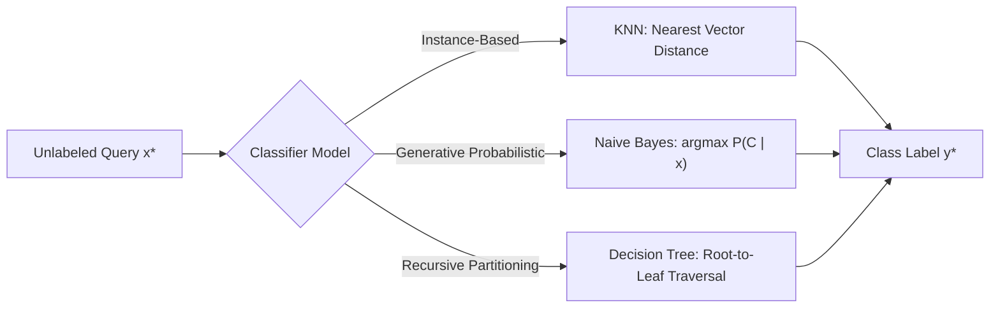
```mermaid
flowchart LR
    A[Unlabeled Query x*] --> B{Classifier Model}
    B -->|Instance-Based| C[KNN: Nearest Vector Distance]
    B -->|Generative Probabilistic| D["Naive Bayes: argmax P(C | x)"]
    B -->|Recursive Partitioning| E[Decision Tree: Root-to-Leaf Traversal]
    C --> F[Class Label y*]
    D --> F
    E --> F
```

### 2.2 Taxonomy of Supervised Learners

| Characteristic | Lazy Learners (KNN) | Eager Probabilistic (Naïve Bayes) | Eager Rule-Based (Decision Trees) |
| :--- | :--- | :--- | :--- |
| **Model Nature** | Non-parametric, instance-storing | Parametric generative probabilistic | Non-parametric hierarchical rule induction |
| **Training Complexity** | $O(1)$ (trivial storage) | $O(m \cdot d)$ (frequency counting / stats) | $O(d \cdot m \log m)$ (sorting & splitting) |
| **Inference Complexity** | $O(m \cdot d)$ (exhaustive distance calculation) | $O(K \cdot d)$ (evaluating class likelihoods) | $O(\text{tree depth}) \le O(d)$ |
| **Memory Footprint** | $O(m \cdot d)$ (retains entire training set) | $O(K \cdot d)$ (stores class priors & likelihoods) | $O(\text{node count})$ (compact tree) |
| **Interpretability** | Low (no explicit reasoning rules) | Moderate (probabilistic evidence weights) | High (human-readable if-then rules) |

[Source: KNN Naive Bayes and DT1.pdf, Slides 2–5]

---

## 3. Core Terminology Dictionary

1. **Instance-Based Learning:** An inductive learning methodology that delays model generalization until an explicit query is issued, making local predictions based on stored exemplar instances.
2. **Voronoi Cell:** A convex geometric region surrounding a training point such that every point within the cell is closer to that training point than to any other.
3. **K-Nearest Neighbors (KNN):** A non-parametric classification algorithm where an unlabeled input is assigned the majority class label among its $k$ closest neighbors.
4. **Euclidean Distance:** The straight-line $L_2$ metric between two vector points in Euclidean space.
5. **Cosine Similarity:** The cosine of the angle between two multi-dimensional vectors, measuring directional orientation regardless of magnitude.
6. **Prior Probability $P(C_k)$:** The baseline probability of observing class $C_k$ before considering any feature evidence.
7. **Likelihood $P(\mathbf{x} \mid C_k)$:** The conditional probability that feature vector $\mathbf{x}$ is generated given true class $C_k$.
8. **Posterior Probability $P(C_k \mid \mathbf{x})$:** The revised probability of class $C_k$ after incorporating observed feature evidence $\mathbf{x}$.
9. **Naïve Independence Assumption:** The assumption that all input features $X_1, X_2, \dots, X_d$ are mutually conditionally independent given the class variable.
10. **Laplace (Add-1) Smoothing:** A pseudocount regularization mechanism preventing zero-probability multiplications in categorical frequency estimation.
11. **Multinomial Naïve Bayes:** A variant tailored for discrete count data (e.g., word frequencies in text documents).
12. **Multivariate Bernoulli Naïve Bayes:** A variant where features are binary indicators ($0$ or $1$) representing presence or absence.
13. **Gaussian Naïve Bayes:** A variant for continuous numerical features assuming a normal Gaussian probability distribution per class.
14. **Confusion Matrix:** A table comparing actual target classes against model predictions to compute diagnostic error metrics.
15. **Sensitivity (Recall / True Positive Rate):** The ratio of correctly predicted positive instances to total actual positive instances.
16. **Specificity (True Negative Rate):** The ratio of correctly predicted negative instances to total actual negative instances.
17. **Precision (Positive Predictive Value):** The ratio of correctly predicted positive instances to total predicted positive instances.
18. **F1-Score:** The harmonic mean of Precision and Recall ($2 \cdot \frac{\text{Precision} \cdot \text{Recall}}{\text{Precision} + \text{Recall}}$).
19. **Shannon Entropy $H(S)$:** An information-theoretic measure of impurity or unpredictability in a dataset $S$.
20. **Information Gain $IG(S, A)$:** The expected reduction in entropy achieved by partitioning dataset $S$ on attribute $A$.
21. **Split Information:** The intrinsic entropy of an attribute partition, measuring the breadth and uniformity of the split.
22. **Gain Ratio:** The ratio of Information Gain to Split Information used in C4.5 to penalize high-cardinality attributes.
23. **Gini Impurity:** A statistical measure used in CART representing the likelihood of misclassifying a randomly selected instance under empirical class distributions.
24. **Pre-Pruning:** Stopping decision tree expansion prematurely based on stopping heuristics (e.g., max depth, min samples).
25. **Post-Pruning:** Pruning a fully grown decision tree from the bottom up to minimize validation error.

[Source: KNN Naive Bayes and DT1.pdf, Slides 2–100]

---

## 4. K-Nearest Neighbors (KNN) Classifier
[Source: KNN Naive Bayes and DT1.pdf, Slides 3–9]

### 4.1 Concept and Geometric Intuition
The K-Nearest Neighbors (KNN) algorithm is a non-parametric, lazy supervised learning algorithm. Rather than estimating an explicit parametric decision boundary, KNN defines decision boundaries locally through **Voronoi tessellation**. 

When a test point $\mathbf{x}^*$ is presented:
1. The distance between $\mathbf{x}^*$ and all $m$ stored training instances $\mathbf{x}^{(i)}$ is computed.
2. The $k$ smallest distances are identified, defining the neighborhood $\mathcal{N}_k(\mathbf{x}^*)$.
3. The class label is determined by majority vote (or distance-weighted vote).

### Figure 6.1: KNN Decision Boundaries and Voronoi Tessellation
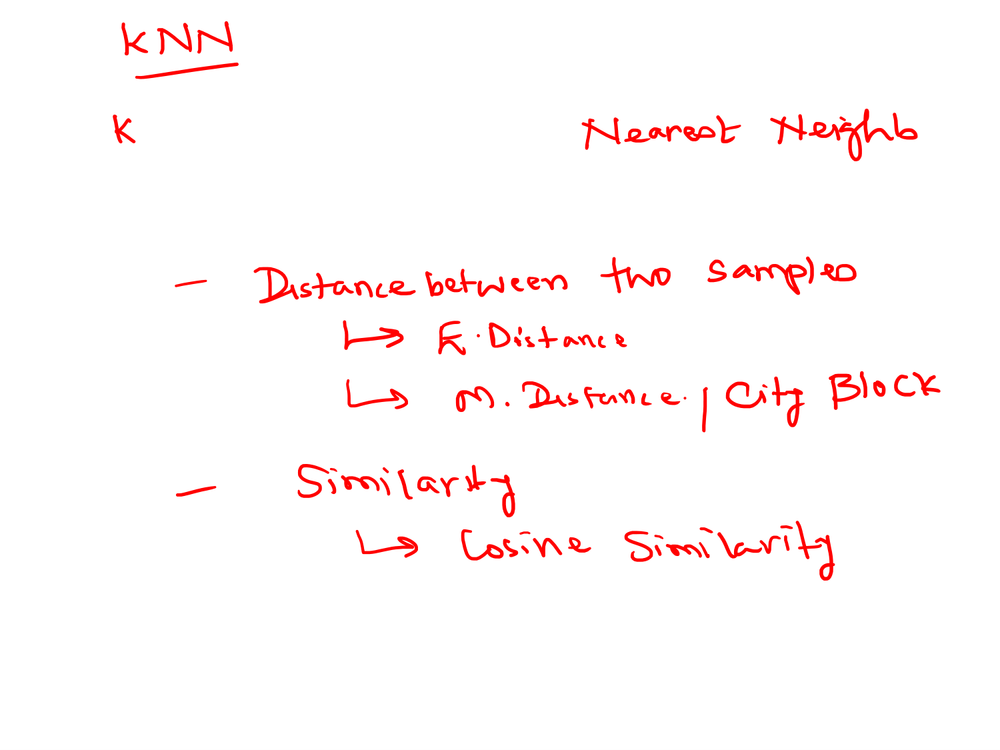

**What it shows:**
Figure 6.1 displays the piecewise linear decision boundaries produced by KNN. Each stored training point acts as a seed generating a Voronoi polygon. As $k$ varies, the boundary transitions from a jagged, complex multi-component boundary ($k=1$) to a smooth, generalized partition (large $k$).

**Components:**
- **Training Exemplars:** Class A (circles) and Class B (triangles) situated in 2D Euclidean space.
- **Query Vector:** The target instance $\mathbf{x}^*$ whose class is to be inferred.
- **Neighborhood Circle:** Radius enclosing exactly the $k$ nearest neighbors.

---

### 4.2 Distance & Similarity Metrics
The metric used to define "closeness" fundamentally governs KNN performance.

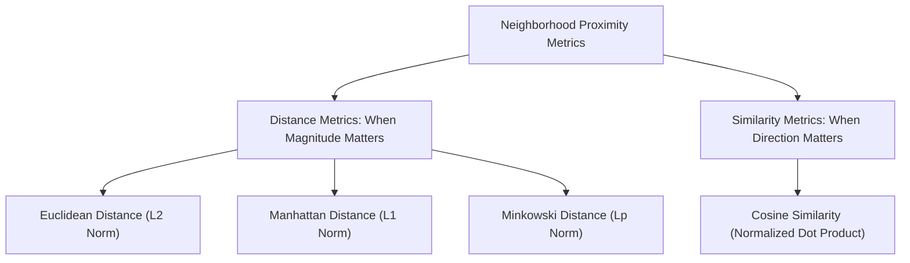
```mermaid
flowchart TD
    A[Neighborhood Proximity Metrics] --> B[Distance Metrics: When Magnitude Matters]
    A --> C[Similarity Metrics: When Direction Matters]
    
    B --> B1["Euclidean Distance (L2 Norm)"]
    B --> B2["Manhattan Distance (L1 Norm)"]
    B --> B3["Minkowski Distance (Lp Norm)"]
    
    C --> C1["Cosine Similarity (Normalized Dot Product)"]
```

#### Selection Guidelines:
- **Distance Metrics:** Used when features are **dense, numeric, continuous, and absolute magnitude matters**.
- **Cosine Similarity:** Used when features are **sparse, high-dimensional, directional, or text-like** (e.g., TF-IDF vectors where document length varies).

[Source: KNN Naive Bayes and DT1.pdf, Slide 6]

---

### 4.3 Distance Metric Formulations

#### 1. Euclidean Distance ($L_2$ Norm)

$$
d_2(\mathbf{u}, \mathbf{v}) = \sqrt{\sum_{j=1}^{d} (u_j - v_j)^2} = \|\mathbf{u} - \mathbf{v}\|_2
$$

Where:
- $\mathbf{u}, \mathbf{v} \in \mathbb{R}^d$: Feature vectors of dimension $d$.
- $u_j, v_j$: Numerical values along the $j$-th feature coordinate.

#### 2. Manhattan Distance ($L_1$ Norm / City-Block)

$$
d_1(\mathbf{u}, \mathbf{v}) = \sum_{j=1}^{d} |u_j - v_j| = \|\mathbf{u} - \mathbf{v}\|_1
$$

#### 3. Minkowski Distance ($L_p$ Metric)

$$
d_p(\mathbf{u}, \mathbf{v}) = \left( \sum_{j=1}^{d} |u_j - v_j|^p \right)^{\frac{1}{p}}
$$

Where $p=1$ yields Manhattan distance, and $p=2$ yields Euclidean distance.

#### 4. Cosine Similarity

$$
\text{CosineSimilarity}(\mathbf{u}, \mathbf{v}) = \frac{\mathbf{u} \cdot \mathbf{v}}{\|\mathbf{u}\|_2 \|\mathbf{v}\|_2} = \frac{\sum_{j=1}^d u_j v_j}{\sqrt{\sum_{j=1}^d u_j^2} \sqrt{\sum_{j=1}^d v_j^2}}
$$

Corresponding Cosine Distance:

$$
d_{\text{cosine}}(\mathbf{u}, \mathbf{v}) = 1 - \text{CosineSimilarity}(\mathbf{u}, \mathbf{v})
$$

[Source: KNN Naive Bayes and DT1.pdf, Slide 6]

---

### 4.4 Voting Protocols and Choice of $k$

#### Standard Majority Voting
The predicted label $\hat{y}$ is the mode of neighborhood classes:

$$
\hat{y} = \arg\max_{c \in \{1, \dots, K\}} \sum_{i \in \mathcal{N}_k(\mathbf{x}^*)} \mathbb{I}(y^{(i)} = c)
$$

Where $\mathbb{I}(\cdot)$ is the indicator function.

#### Distance-Weighted Voting
To prevent distant neighbors in sparse regions from outvoting close exemplars, weights inversely proportional to distance are applied:

$$
w_i = \frac{1}{d(\mathbf{x}^*, \mathbf{x}^{(i)})^2} \quad \text{or} \quad w_i = \frac{1}{d(\mathbf{x}^*, \mathbf{x}^{(i)})}
$$

The class decision rule becomes:

$$
\hat{y} = \arg\max_{c \in \{1, \dots, K\}} \sum_{i \in \mathcal{N}_k(\mathbf{x}^*)} w_i \cdot \mathbb{I}(y^{(i)} = c)
$$

### Figure 6.2: 1-NN vs. K-NN Decision Behavior
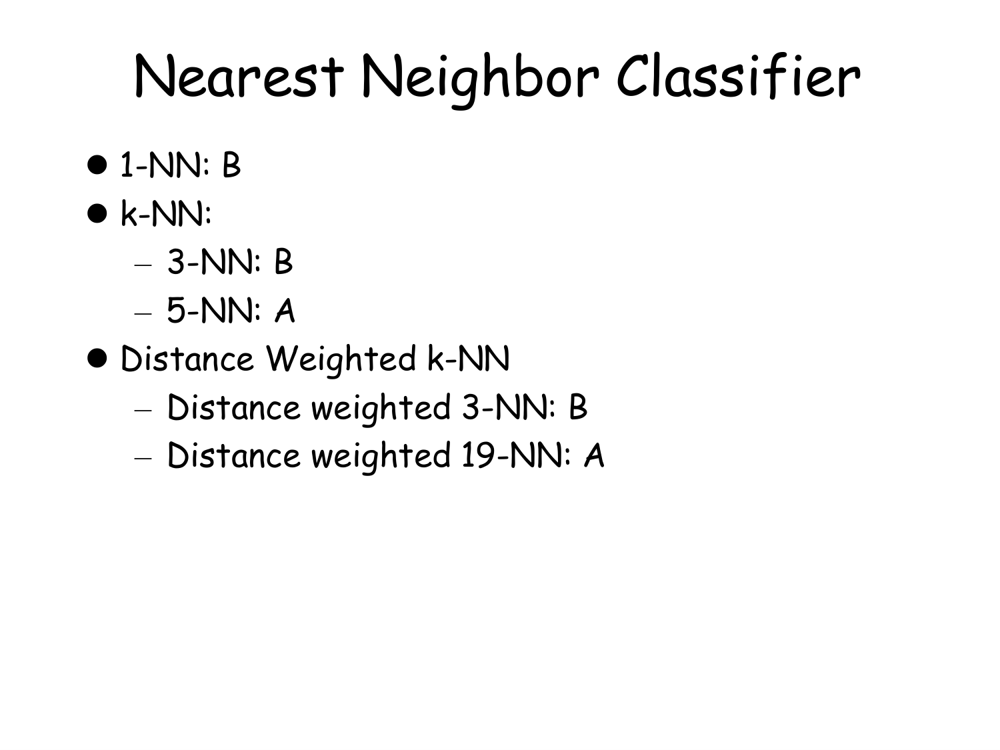

**Empirical Observations from Slide 9:**
- **1-NN:** Assigns label to Class B (nearest single neighbor is B).
- **3-NN:** Assigns label to Class B (2 out of 3 neighbors belong to B).
- **5-NN:** Assigns label to Class A (3 out of 5 neighbors belong to A).
- **Distance-Weighted 3-NN:** Selects Class B (heavy weight on immediate neighbor).
- **Distance-Weighted 19-NN:** Selects Class A (aggregate proximity of dense cluster A dominates).

[Source: KNN Naive Bayes and DT1.pdf, Slide 9]

---

### 4.5 Inline Worked Micro-Example: Vector Distance Calculation
[Source: KNN Naive Bayes and DT1.pdf, Slide 7]

**Problem Statement:**
Given query instance $\mathbf{x}^* = (2, 4)$ and two candidate points $\mathbf{x}^{(1)} = (1, 2)$ (Class Red) and $\mathbf{x}^{(2)} = (5, 6)$ (Class Blue), determine the 1-NN classification under Euclidean and Manhattan metrics.

**Step-by-Step Calculation:**

1. **Euclidean Distances:**

$$
\begin{aligned}
d_2(\mathbf{x}^*, \mathbf{x}^{(1)}) &= \sqrt{(2 - 1)^2 + (4 - 2)^2} = \sqrt{1 + 4} = \sqrt{5} \approx 2.236 \\
d_2(\mathbf{x}^*, \mathbf{x}^{(2)}) &= \sqrt{(2 - 5)^2 + (4 - 6)^2} = \sqrt{9 + 4} = \sqrt{13} \approx 3.605
\end{aligned}
$$

2. **Manhattan Distances:**

$$
\begin{aligned}
d_1(\mathbf{x}^*, \mathbf{x}^{(1)}) &= |2 - 1| + |4 - 2| = 1 + 2 = 3 \\
d_1(\mathbf{x}^*, \mathbf{x}^{(2)}) &= |2 - 5| + |4 - 6| = 3 + 2 = 5
\end{aligned}
$$

**Conclusion:** Under both metrics, $d(\mathbf{x}^*, \mathbf{x}^{(1)}) < d(\mathbf{x}^*, \mathbf{x}^{(2)})$. The query point is assigned to **Class Red**.

---

## 5. Mathematical Foundations of Naïve Bayes Classifiers
[Source: KNN Naive Bayes and DT1.pdf, Slides 10–24]

### 5.1 Bayes' Theorem Formulation
Naïve Bayes is a generative probabilistic classifier rooted in Bayes' Rule of conditional probability:

$$
P(C_k \mid \mathbf{x}) = \frac{P(\mathbf{x} \mid C_k) P(C_k)}{P(\mathbf{x})}
$$

Where:
- $P(C_k \mid \mathbf{x})$: **Posterior Probability** of class $C_k$ given feature vector $\mathbf{x} = (x_1, x_2, \dots, x_d)^T$.
- $P(\mathbf{x} \mid C_k)$: **Class-Conditional Likelihood** of observing features $\mathbf{x}$ given class $C_k$.
- $P(C_k)$: **Prior Probability** of class $C_k$.
- $P(\mathbf{x})$: **Evidence (Marginal Probability)** normalizing the posterior over all $K$ classes:

$$
P(\mathbf{x}) = \sum_{j=1}^{K} P(\mathbf{x} \mid C_j) P(C_j)
$$

### Figure 6.3: Bayes' Theorem Derivation and Architecture
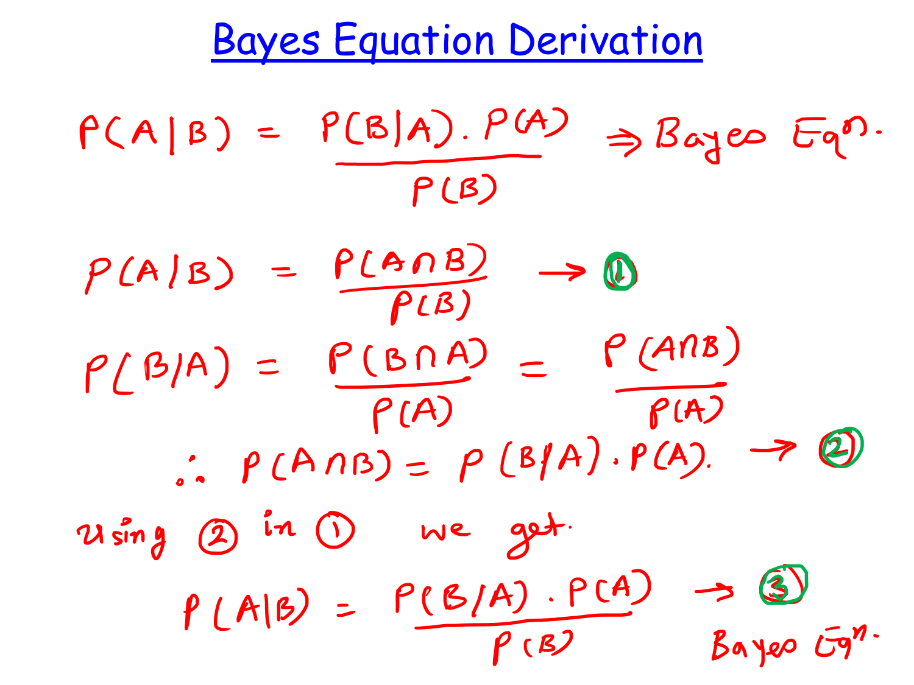
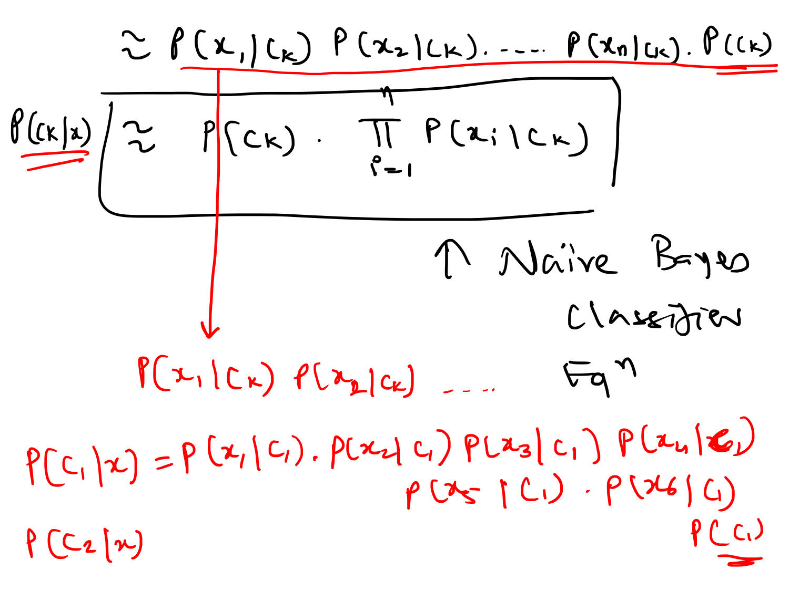

---

### 5.2 Formal Derivation of the Naïve Bayes Objective

1. **Joint Probability Expansion via the Chain Rule:**
By the definition of conditional probability, the joint probability of class $C_k$ and features $x_1, \dots, x_d$ is:

$$
P(C_k, x_1, x_2, \dots, x_d) = P(C_k) \cdot P(x_1 \mid C_k) \cdot P(x_2 \mid C_k, x_1) \cdots P(x_d \mid C_k, x_1, \dots, x_{d-1})
$$

2. **The Naïve Conditional Independence Assumption:**
Modeling the full joint distribution requires estimating $O(K \cdot 2^d)$ parameters, which quickly becomes intractable. Naïve Bayes assumes that each feature $x_i$ is conditionally independent of every other feature $x_j$ ($j \ne i$) given class $C_k$:

$$
P(x_i \mid C_k, x_1, \dots, x_{i-1}) = P(x_i \mid C_k)
$$

Substituting this assumption into the joint chain:

$$
P(\mathbf{x} \mid C_k) = P(x_1, x_2, \dots, x_d \mid C_k) = \prod_{j=1}^{d} P(x_j \mid C_k)
$$

### Figure 6.4: Naïve Conditional Independence Assumption
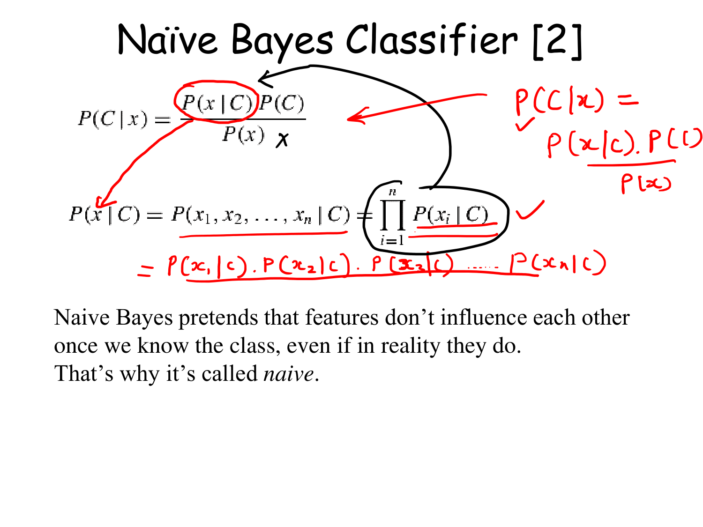

**Written Analysis of Figure 6.4:**
The graphical model illustrates a Bayesian network where the class node $C$ is the single parent node pointing outward to conditionally independent child attribute nodes $X_1, X_2, \dots, X_d$. Given $C$, all paths between features are d-separated, meaning features do not directly influence each other.

3. **Maximum A Posteriori (MAP) Decision Rule:**
Because the evidence denominator $P(\mathbf{x})$ is identical for all classes $C_k$, it acts as a constant scaling factor and can be omitted during classification:

$$
\begin{aligned}
\hat{y} &= \arg\max_{k \in \{1, \dots, K\}} P(C_k \mid \mathbf{x}) \\
&= \arg\max_{k \in \{1, \dots, K\}} \frac{P(C_k) \prod_{j=1}^{d} P(x_j \mid C_k)}{P(\mathbf{x})} \\
&= \arg\max_{k \in \{1, \dots, K\}} P(C_k) \prod_{j=1}^{d} P(x_j \mid C_k)
\end{aligned}
$$

4. **Log-Likelihood Transformation (Numerical Underflow Prevention):**
Multiplying dozens of probabilities $P(x_j \mid C_k) < 1$ causes floating-point arithmetic underflow on computers. Taking the natural logarithm converts the product into a stable summation:

$$
\hat{y} = \arg\max_{k \in \{1, \dots, K\}} \left[ \ln P(C_k) + \sum_{j=1}^{d} \ln P(x_j \mid C_k) \right]
$$

[Source: KNN Naive Bayes and DT1.pdf, Slides 14–21]

---

### 5.3 Zero-Frequency Problem & Laplace Smoothing
If a feature value $x_j$ never occurs alongside class $C_k$ in the training set, the maximum likelihood estimate is zero:

$$
P(x_j \mid C_k) = 0 \implies \prod_{j=1}^d P(x_j \mid C_k) = 0
$$

A single zero term completely erases all other evidence. To fix this, **Laplace (Add-1) Smoothing** adds a pseudo-count $\alpha = 1$:

$$
P(x_j = v \mid C_k) = \frac{N_{kj} + \alpha}{N_k + \alpha \cdot |V_j|}
$$

Where:
- $N_{kj}$: Number of times feature $j$ takes value $v$ in class $C_k$.
- $N_k$: Total count of instances belonging to class $C_k$.
- $|V_j|$: Cardinality (number of distinct possible values) of feature $j$.
- $\alpha$: Smoothing parameter (typically $\alpha = 1$).

[Source: KNN Naive Bayes and DT1.pdf, Slides 25–28]

---

## 6. The Three Major Naïve Bayes Implementations
[Source: KNN Naive Bayes and DT1.pdf, Slides 25–43]

### 6.1 Multinomial Naïve Bayes
Multinomial Naïve Bayes is designed for discrete count data, particularly document classification using bag-of-words representations.

#### Likelihood Formulation:

$$
P(\mathbf{x} \mid C_k) = \frac{(\sum_{j=1}^d x_j)!}{\prod_{j=1}^d x_j!} \prod_{j=1}^{d} p_{kj}^{x_j}
$$

With Laplace smoothing, the parameter $p_{kj} = P(w_j \mid C_k)$ (probability of token $w_j$ in class $C_k$) is estimated as:

$$
p_{kj} = \frac{\text{Count}(w_j, C_k) + 1}{\sum_{w \in V} \text{Count}(w, C_k) + |V|}
$$

Where $|V|$ is the total vocabulary size.

### Figure 6.5: Multinomial Text Corpus
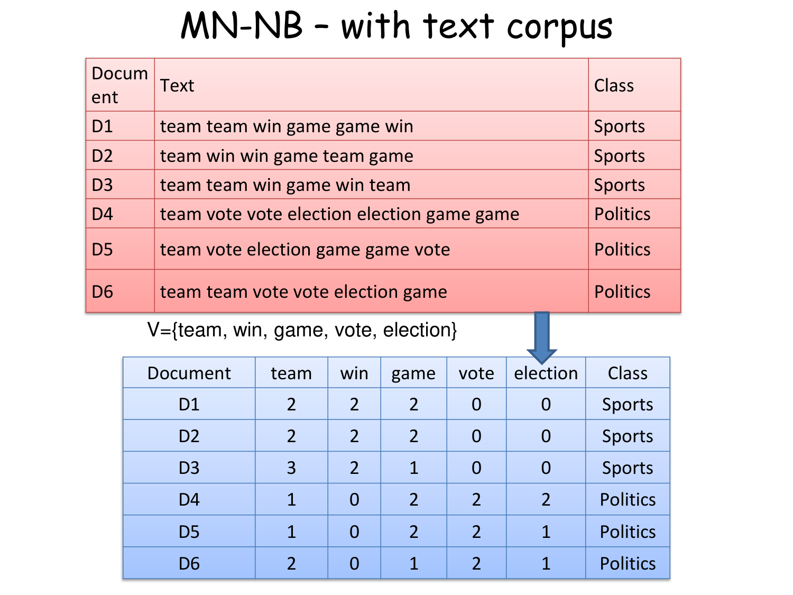

#### Document-Term Matrix from Slide 29:
Vocabulary: $V = \{\text{team}, \text{win}, \text{game}, \text{vote}, \text{election}\}$, $|V| = 5$.

| Document | Text Contents | team | win | game | vote | election | True Class |
| :--- | :--- | :---: | :---: | :---: | :---: | :---: | :--- |
| **D1** | team team win game game win | 2 | 2 | 2 | 0 | 0 | **Sports** |
| **D2** | team win win game team game | 2 | 2 | 2 | 0 | 0 | **Sports** |
| **D3** | team team win game win team | 3 | 2 | 1 | 0 | 0 | **Sports** |
| **D4** | team vote vote election election game game | 1 | 0 | 2 | 2 | 2 | **Politics** |
| **D5** | team vote election game game vote | 1 | 0 | 2 | 2 | 1 | **Politics** |
| **D6** | team team vote vote election game | 2 | 0 | 1 | 2 | 1 | **Politics** |

Total words in Sports: $6 + 6 + 6 = 18$ tokens.
Total words in Politics: $7 + 6 + 6 = 19$ tokens.

[Source: KNN Naive Bayes and DT1.pdf, Slide 29]

---

### 6.2 Multivariate Bernoulli Naïve Bayes
In Multivariate Bernoulli Naïve Bayes, feature vectors are strictly binary indicators: $x_j \in \{0, 1\}$ denotes whether attribute/token $j$ appears in the instance.

#### Likelihood Formulation:

$$
P(\mathbf{x} \mid C_k) = \prod_{j=1}^{d} p_{kj}^{x_j} (1 - p_{kj})^{(1 - x_j)}
$$

With Laplace smoothing:

$$
p_{kj} = P(x_j = 1 \mid C_k) = \frac{\text{Count}(x_j = 1 \text{ in } C_k) + 1}{N_k + 2}
$$

$$
1 - p_{kj} = P(x_j = 0 \mid C_k) = \frac{\text{Count}(x_j = 0 \text{ in } C_k) + 1}{N_k + 2}
$$

Where $N_k$ is the total number of documents in class $C_k$, and denominator adds $+2$ because binary features have $|V_j| = 2$ outcomes ($\{0, 1\}$).

### Figure 6.6: Bernoulli Dataset and Calculations
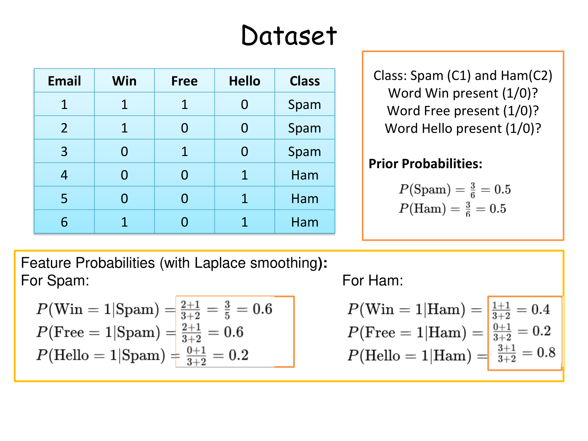
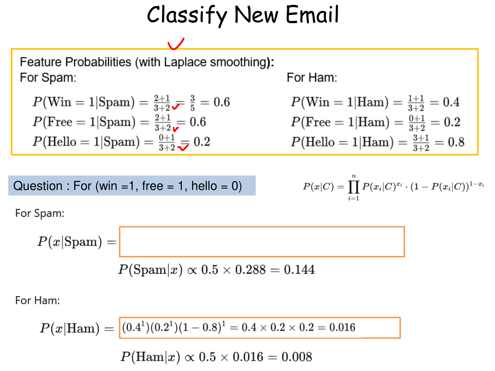

#### Fully Worked Micro-Example: Email Spam Classification
[Source: KNN Naive Bayes and DT1.pdf, Slides 32–33]

**Training Dataset:**

| Email ID | Win ($x_1$) | Free ($x_2$) | Hello ($x_3$) | Class ($y$) |
| :---: | :---: | :---: | :---: | :--- |
| **1** | 1 | 1 | 0 | **Spam** ($C_1$) |
| **2** | 1 | 0 | 0 | **Spam** ($C_1$) |
| **3** | 0 | 1 | 0 | **Spam** ($C_1$) |
| **4** | 0 | 0 | 1 | **Ham** ($C_2$) |
| **5** | 0 | 0 | 1 | **Ham** ($C_2$) |
| **6** | 1 | 0 | 1 | **Ham** ($C_2$) |

**Class Priors:**
Total emails $m = 6$, $N_{\text{Spam}} = 3$, $N_{\text{Ham}} = 3$.

$$
P(\text{Spam}) = \frac{3}{6} = 0.5, \quad P(\text{Ham}) = \frac{3}{6} = 0.5
$$

**Feature Probability Estimation with Laplace Smoothing ($+1 / +2$):**

- **For Spam ($N_{\text{Spam}} = 3$):**
  - Word `Win`: appears in 2 emails (1, 2) $\implies P(\text{Win}=1 \mid \text{Spam}) = \frac{2+1}{3+2} = \frac{3}{5} = 0.6$
  - Word `Free`: appears in 2 emails (1, 3) $\implies P(\text{Free}=1 \mid \text{Spam}) = \frac{2+1}{3+2} = \frac{3}{5} = 0.6$
  - Word `Hello`: appears in 0 emails $\implies P(\text{Hello}=1 \mid \text{Spam}) = \frac{0+1}{3+2} = \frac{1}{5} = 0.2$
  - Consequently: $P(\text{Hello}=0 \mid \text{Spam}) = 1 - 0.2 = 0.8$

- **For Ham ($N_{\text{Ham}} = 3$):**
  - Word `Win`: appears in 1 email (6) $\implies P(\text{Win}=1 \mid \text{Ham}) = \frac{1+1}{3+2} = \frac{2}{5} = 0.4$
  - Word `Free`: appears in 0 emails $\implies P(\text{Free}=1 \mid \text{Ham}) = \frac{0+1}{3+2} = \frac{1}{5} = 0.2$
  - Word `Hello`: appears in 3 emails (4, 5, 6) $\implies P(\text{Hello}=1 \mid \text{Ham}) = \frac{3+1}{3+2} = \frac{4}{5} = 0.8$
  - Consequently: $P(\text{Hello}=0 \mid \text{Ham}) = 1 - 0.8 = 0.2$

**Classifying Query Email:** $\mathbf{x}^* = (\text{Win}=1, \text{Free}=1, \text{Hello}=0)$

$$
\begin{aligned}
P(\text{Spam} \mid \mathbf{x}^*) &\propto P(\text{Spam}) \cdot P(\text{Win}=1 \mid \text{Spam}) \cdot P(\text{Free}=1 \mid \text{Spam}) \cdot P(\text{Hello}=0 \mid \text{Spam}) \\
&= 0.5 \times 0.6 \times 0.6 \times 0.8 \\
&= 0.5 \times 0.288 = 0.144
\end{aligned}
$$

$$
\begin{aligned}
P(\text{Ham} \mid \mathbf{x}^*) &\propto P(\text{Ham}) \cdot P(\text{Win}=1 \mid \text{Ham}) \cdot P(\text{Free}=1 \mid \text{Ham}) \cdot P(\text{Hello}=0 \mid \text{Ham}) \\
&= 0.5 \times 0.4 \times 0.2 \times 0.2 \\
&= 0.5 \times 0.016 = 0.008
\end{aligned}
$$

**Normalized Probabilities:**

$$
P(\text{Spam} \mid \mathbf{x}^*) = \frac{0.144}{0.144 + 0.008} = \frac{0.144}{0.152} \approx 94.74\%
$$

$$
P(\text{Ham} \mid \mathbf{x}^*) = \frac{0.008}{0.152} \approx 5.26\%
$$

**Result:** The incoming email is classified as **Spam**.

[Source: KNN Naive Bayes and DT1.pdf, Slides 32–33]

---

### 6.3 Gaussian Naïve Bayes
When features are continuous real numbers $\mathbf{x} \in \mathbb{R}^d$, Gaussian Naïve Bayes assumes that each feature within class $C_k$ follows a Normal (Gaussian) distribution:

$$
P(x_j \mid C_k) = \frac{1}{\sqrt{2\pi \sigma_{kj}^2}} \exp\left( -\frac{(x_j - \mu_{kj})^2}{2\sigma_{kj}^2} \right)
$$

Where:
- $\mu_{kj}$: Sample mean of feature $j$ for training instances of class $C_k$:

$$
\mu_{kj} = \frac{1}{N_k} \sum_{i: y^{(i)}=C_k} x_j^{(i)}
$$

- $\sigma_{kj}^2$: Sample variance of feature $j$ for training instances of class $C_k$:

$$
\sigma_{kj}^2 = \frac{1}{N_k - 1} \sum_{i: y^{(i)}=C_k} (x_j^{(i)} - \mu_{kj})^2
$$

### Figure 6.7: Gaussian Naïve Bayes Dataset and Model
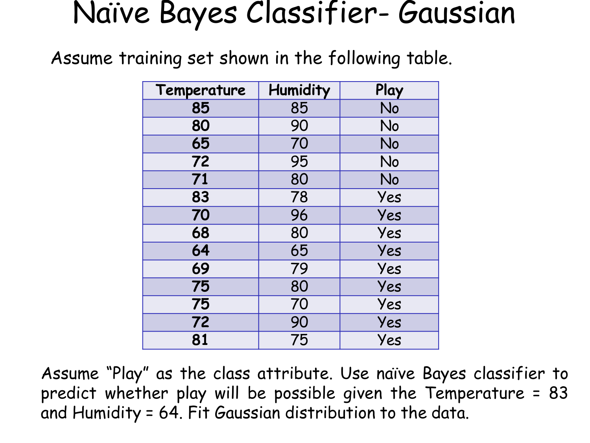

#### Fully Worked Micro-Example: Weather Play Prediction
[Source: KNN Naive Bayes and DT1.pdf, Slides 37–40]

**Training Dataset ($m = 14$ instances):**

| Instance | Temperature ($x_1$) | Humidity ($x_2$) | Play ($y$) |
| :---: | :---: | :---: | :---: |
| 1 | 85 | 85 | **No** |
| 2 | 80 | 90 | **No** |
| 3 | 65 | 70 | **No** |
| 4 | 72 | 95 | **No** |
| 5 | 71 | 80 | **No** |
| 6 | 83 | 78 | **Yes** |
| 7 | 70 | 96 | **Yes** |
| 8 | 68 | 80 | **Yes** |
| 9 | 64 | 65 | **Yes** |
| 10 | 69 | 79 | **Yes** |
| 11 | 75 | 80 | **Yes** |
| 12 | 75 | 70 | **Yes** |
| 13 | 72 | 90 | **Yes** |
| 14 | 81 | 75 | **Yes** |

**Class Sample Counts and Priors:**
- $N_{\text{No}} = 5 \implies P(\text{No}) = \frac{5}{14} \approx 0.3571$
- $N_{\text{Yes}} = 9 \implies P(\text{Yes}) = \frac{9}{14} \approx 0.6429$

**Estimated Parameters (Mean & Standard Deviation):**
- **Class No ($N=5$):**
  - Temperature values: $\{85, 80, 65, 72, 71\}$
    - Mean $\mu_{\text{Temp, No}} = \frac{85+80+65+72+71}{5} = \mathbf{74.60}$
    - Std $\sigma_{\text{Temp, No}} = \mathbf{7.893}$
  - Humidity values: $\{85, 90, 70, 95, 80\}$
    - Mean $\mu_{\text{Hum, No}} = \frac{85+90+70+95+80}{5} = \mathbf{84.00}$
    - Std $\sigma_{\text{Hum, No}} = \mathbf{9.618}$

- **Class Yes ($N=9$):**
  - Temperature values: $\{83, 70, 68, 64, 69, 75, 75, 72, 81\}$
    - Mean $\mu_{\text{Temp, Yes}} = \frac{657}{9} = \mathbf{73.00}$
    - Std $\sigma_{\text{Temp, Yes}} = \mathbf{6.164}$
  - Humidity values: $\{78, 96, 80, 65, 79, 80, 70, 90, 75\}$
    - Mean $\mu_{\text{Hum, Yes}} = \frac{713}{9} = \mathbf{79.22}$
    - Std $\sigma_{\text{Hum, Yes}} = \mathbf{9.391}$

**Query Instance Evaluation:** $\mathbf{x}^* = (\text{Temperature} = 83, \text{Humidity} = 64)$

1. **Gaussian Densities for Class Yes:**

$$
\begin{aligned}
P(T=83 \mid \text{Yes}) &= \frac{1}{\sqrt{2\pi (6.164)^2}} \exp\left( -\frac{(83 - 73.00)^2}{2(6.164)^2} \right) \\
&= \frac{1}{15.45} \exp\left( -\frac{100}{76.00} \right) = 0.06472 \times 0.2683 = \mathbf{0.01736}
\end{aligned}
$$

$$
\begin{aligned}
P(H=64 \mid \text{Yes}) &= \frac{1}{\sqrt{2\pi (9.391)^2}} \exp\left( -\frac{(64 - 79.22)^2}{2(9.391)^2} \right) \\
&= \frac{1}{23.54} \exp\left( -\frac{231.65}{176.38} \right) = 0.04248 \times 0.2689 = \mathbf{0.01142}
\end{aligned}
$$

Posterior Score for Yes:

$$
\text{Score}(\text{Yes}) = P(\text{Yes}) \cdot P(T=83 \mid \text{Yes}) \cdot P(H=64 \mid \text{Yes}) = 0.6429 \times 0.01736 \times 0.01142 = \mathbf{0.0001275}
$$

2. **Gaussian Densities for Class No:**

$$
\begin{aligned}
P(T=83 \mid \text{No}) &= \frac{1}{\sqrt{2\pi (7.893)^2}} \exp\left( -\frac{(83 - 74.60)^2}{2(7.893)^2} \right) \\
&= \frac{1}{19.78} \exp\left( -\frac{70.56}{124.60} \right) = 0.05055 \times 0.5676 = \mathbf{0.02869}
\end{aligned}
$$

$$
\begin{aligned}
P(H=64 \mid \text{No}) &= \frac{1}{\sqrt{2\pi (9.618)^2}} \exp\left( -\frac{(64 - 84.00)^2}{2(9.618)^2} \right) \\
&= \frac{1}{24.11} \exp\left( -\frac{400.00}{185.01} \right) = 0.04148 \times 0.1151 = \mathbf{0.00477}
\end{aligned}
$$

Posterior Score for No:

$$
\text{Score}(\text{No}) = P(\text{No}) \cdot P(T=83 \mid \text{No}) \cdot P(H=64 \mid \text{No}) = 0.3571 \times 0.02869 \times 0.00477 = \mathbf{0.0000489}
$$

**Final Decision:** Since $\text{Score}(\text{Yes}) = 0.0001275 > \text{Score}(\text{No}) = 0.0000489$, the model predicts **Play = Yes** (under unbiased sample standard deviation estimators).

[Source: KNN Naive Bayes and DT1.pdf, Slides 37–41]

---

## 7. Performance Evaluation of Classifiers
[Source: KNN Naive Bayes and DT1.pdf, Slides 44–56]

Evaluating a classifier requires nuanced diagnostic metrics beyond raw accuracy, particularly in the presence of class imbalance.

### 7.1 The Binary Confusion Matrix
A confusion matrix tabulates predicted outcomes against actual ground truth:

| | Actual Positive ($y=1$) | Actual Negative ($y=0$) |
| :--- | :--- | :--- |
| **Predicted Positive ($\hat{y}=1$)** | **True Positive (TP)** | **False Positive (FP)** (Type I Error) |
| **Predicted Negative ($\hat{y}=0$)** | **False Negative (FN)** (Type II Error) | **True Negative (TN)** |

### Figure 6.8: Confusion Matrix and Metric Formulations
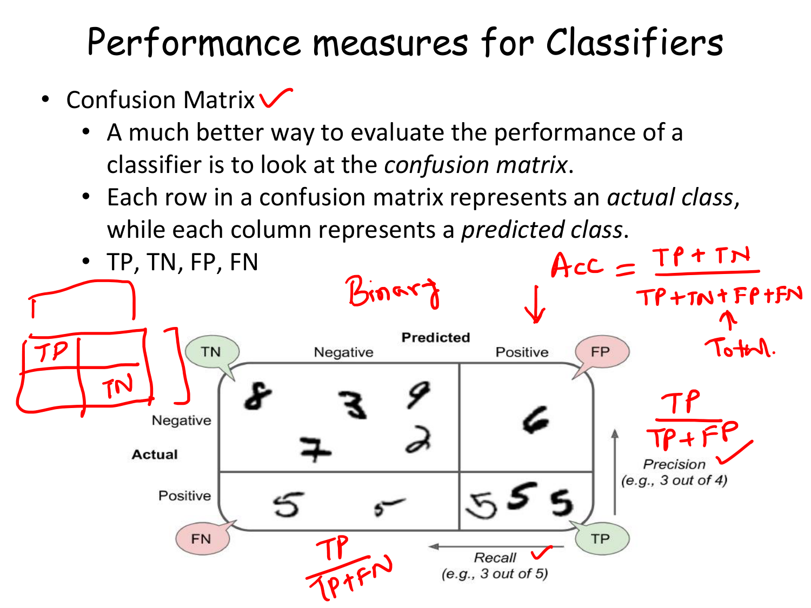
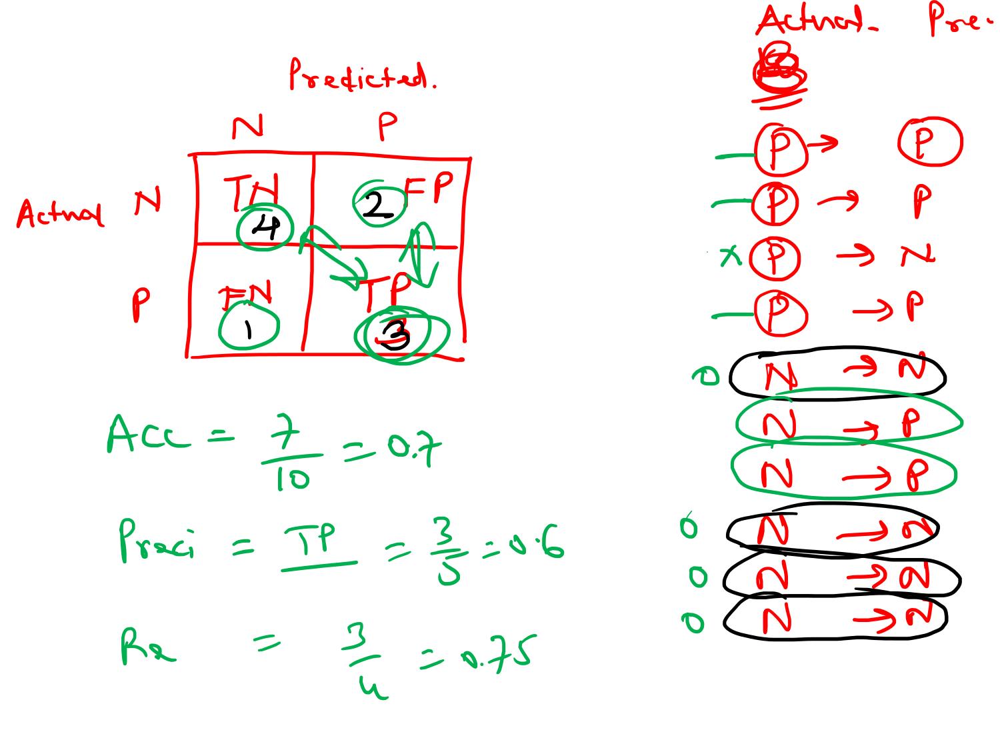

---

### 7.2 Diagnostic Metric Definitions and Mathematical Formulations

#### 1. Classification Accuracy
The overall proportion of correct classifications:

$$
\text{Accuracy} = \frac{TP + TN}{TP + TN + FP + FN}
$$

#### 2. Classification Error Rate

$$
\text{Error Rate} = 1 - \text{Accuracy} = \frac{FP + FN}{TP + TN + FP + FN}
$$

#### 3. Sensitivity / Recall / True Positive Rate (TPR)
The ability of the classifier to detect positive events:

$$
\text{Sensitivity} = \text{Recall} = \frac{TP}{TP + FN}
$$

#### 4. Specificity / True Negative Rate (TNR)
The ability of the classifier to identify negative events:

$$
\text{Specificity} = \frac{TN}{TN + FP}
$$

#### 5. Precision / Positive Predictive Value (PPV)
The accuracy of positive predictions:

$$
\text{Precision} = \frac{TP}{TP + FP}
$$

#### 6. F1-Score / F-Measure
The harmonic mean of Precision and Recall:

$$
F_1 = 2 \cdot \frac{\text{Precision} \cdot \text{Recall}}{\text{Precision} + \text{Recall}} = \frac{2 \cdot TP}{2 \cdot TP + FP + FN}
$$

#### Why Accuracy Fails on Skewed Datasets:
Consider a medical screening test where $98\%$ of patients are healthy (Class Negative) and $2\%$ have disease (Class Positive). A "dumb" baseline classifier that predicts negative for every patient achieves $98\%$ accuracy while detecting $0\%$ of diseased individuals (Recall = $0.00$).

[Source: KNN Naive Bayes and DT1.pdf, Slide 44]

---

### 7.3 Multiclass Confusion Matrix (One-vs-Rest Decomposition)
For $K > 2$ classes, the confusion matrix expands to $K \times K$. Metrics for each individual class $C_i$ are computed by reducing the matrix to an equivalent binary table (Class $C_i$ vs. All Other Classes).

### Figure 6.9: Multiclass Confusion Matrix Illustrated
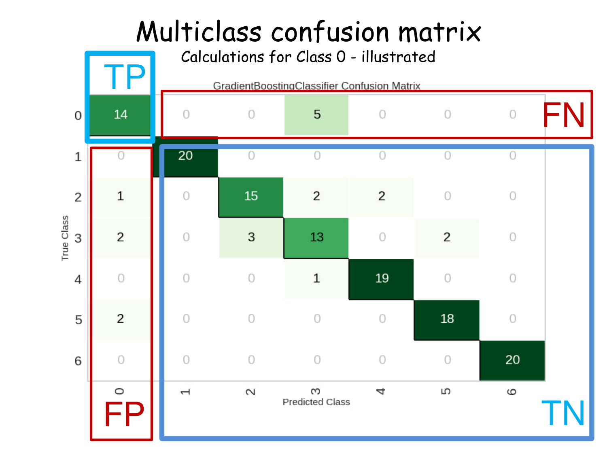

For Class $0$ in a $3 \times 3$ matrix:
- **$TP_0$:** Cell $(0, 0)$.
- **$FP_0$:** Sum of column $0$ excluding cell $(0, 0)$: $\sum_{j \ne 0} M_{j, 0}$.
- **$FN_0$:** Sum of row $0$ excluding cell $(0, 0)$: $\sum_{k \ne 0} M_{0, k}$.
- **$TN_0$:** Sum of all remaining cells neither in row $0$ nor column $0$.

[Source: KNN Naive Bayes and DT1.pdf, Slide 50]

---

### 7.4 Validation and Resampling Protocols

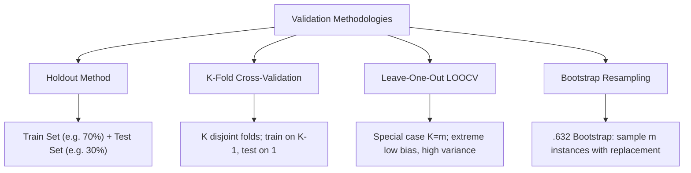
```mermaid
flowchart TD
    A[Validation Methodologies] --> B[Holdout Method]
    A --> C[K-Fold Cross-Validation]
    A --> D[Leave-One-Out LOOCV]
    A --> E[Bootstrap Resampling]
    
    B --> B1["Train Set (e.g. 70%) + Test Set (e.g. 30%)"]
    C --> C1["K disjoint folds; train on K-1, test on 1"]
    D --> D1["Special case K=m; extreme low bias, high variance"]
    E --> E1[".632 Bootstrap: sample m instances with replacement"]
```

#### The $.632$ Bootstrap Protocol
In bootstrap resampling, a dataset of $m$ examples is sampled **with replacement** $m$ times to form the training set.
The probability of a specific instance NOT being selected in a single draw is $1 - \frac{1}{m}$.
After $m$ independent draws, the probability of an instance never being selected is:

$$
\lim_{m \to \infty} \left( 1 - \frac{1}{m} \right)^m = e^{-1} \approx 0.368
$$

Thus, approximately $63.2\%$ of original instances form the training set, while the remaining $36.8\%$ form the out-of-bag (OOB) test set. The overall bootstrap accuracy estimator combines both:

$$
\text{Acc}_{\text{boot}} = 0.632 \cdot \text{Acc}_{\text{test}} + 0.368 \cdot \text{Acc}_{\text{train}}
$$

[Source: KNN Naive Bayes and DT1.pdf, Slides 52–56]

---

## 8. Decision Tree Induction & The ID3 Algorithm
[Source: KNN Naive Bayes and DT1.pdf, Slides 57–81]

### 8.1 Anatomy of a Decision Tree
A decision tree is a hierarchical, non-parametric model that recursively partitions the feature space into axis-aligned rectangular regions.
- **Root Node:** The topmost node containing the entire training corpus with no incoming edges.
- **Internal (Decision) Nodes:** Intermediate nodes representing tests on specific feature attributes.
- **Branches:** Outgoing edges representing distinct outcomes of the test.
- **Leaf (Terminal) Nodes:** Terminal nodes holding the final predicted class label or class probability distribution.

### Figure 6.10: Decision Tree Anatomy and Induction Flow
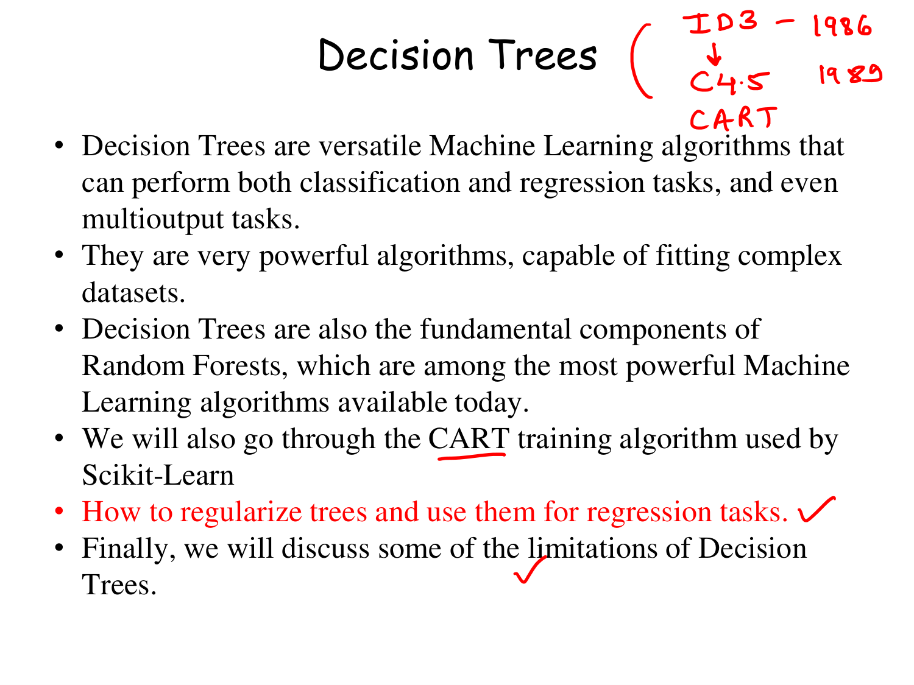
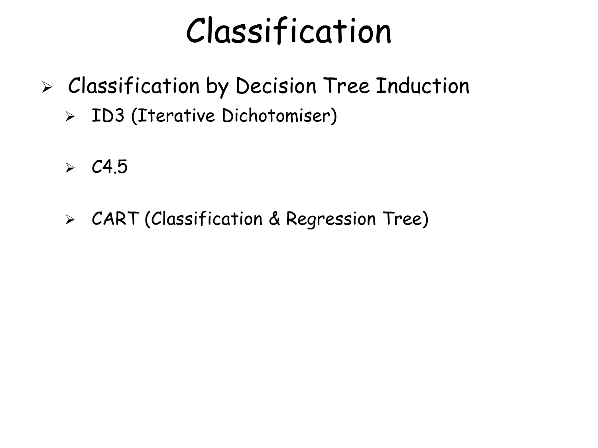

---

### 8.2 Information Theory Foundations & Shannon Entropy
In Information Theory (Claude Shannon, 1948), information is quantified as the degree of uncertainty resolved. An event with probability $p$ conveys surprise / information content:

$$
I(p) = \log_2\left(\frac{1}{p}\right) = -\log_2(p) \quad \text{(bits)}
$$

#### Shannon Entropy $H(S)$:
Entropy measures the average impurity or uncertainty in a sample $S$ partitioned into $c$ classes:

$$
H(S) = -\sum_{i=1}^{c} p_i \log_2(p_i)
$$

Where:
- $p_i$: Empirical proportion of examples in $S$ belonging to class $i$.
- By convention: $0 \log_2(0) \equiv 0$.
- For binary classification ($p_+$ and $p_-$):

$$
H(S) = -p_+ \log_2(p_+) - p_- \log_2(p_-)
$$

### Figure 6.11: Entropy Curve for Binary Classification
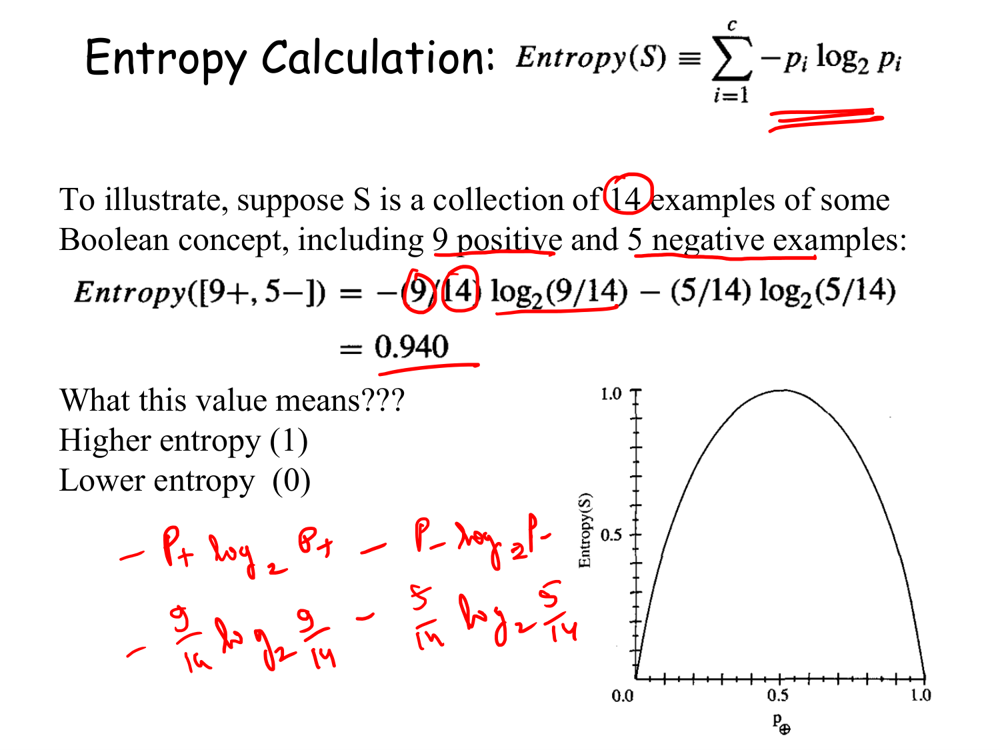

**Key Properties:**
- If $S$ is purely homogeneous ($p_+ = 1$ or $p_+ = 0$), $H(S) = 0$ bits (zero uncertainty).
- If $S$ is maximally impure ($p_+ = 0.5, p_- = 0.5$), $H(S) = 1.0$ bit (maximum uncertainty).

[Source: KNN Naive Bayes and DT1.pdf, Slide 65]

---

### 8.3 Information Gain Formulation
Information Gain $IG(S, A)$ is the expected reduction in entropy resulting from partitioning dataset $S$ using attribute $A$:

$$
IG(S, A) = H(S) - \sum_{v \in \text{Values}(A)} \frac{|S_v|}{|S|} H(S_v)
$$

Where:
- $\text{Values}(A)$: Set of all possible discrete outcomes of attribute $A$.
- $S_v$: Subset of $S$ for which attribute $A$ takes value $v$.
- $\frac{|S_v|}{|S|}$: Weight assigned to subset $v$ (fraction of examples).

The ID3 algorithm greedily selects the attribute that **maximizes Information Gain**:

$$
A^* = \arg\max_A IG(S, A)
$$

[Source: KNN Naive Bayes and DT1.pdf, Slide 67]

---

### 8.4 Complete Step-by-Step Worked ID3 Example: PlayTennis Dataset
[Source: KNN Naive Bayes and DT1.pdf, Slides 68–80]

### Figure 6.12: The PlayTennis 14-Instance Dataset
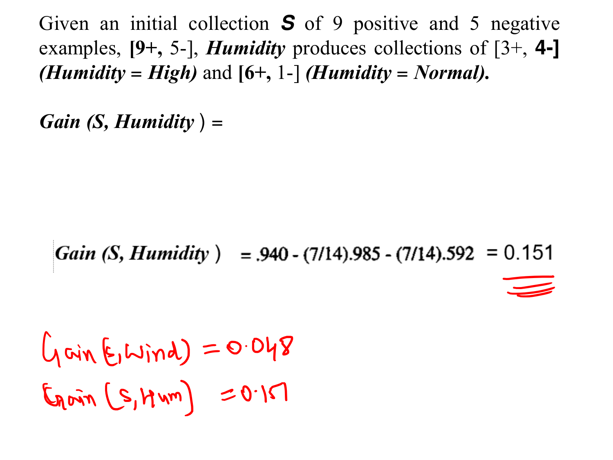

#### The 14-Instance Training Table:

| Day | Outlook | Temperature | Humidity | Wind | Play Tennis ($y$) |
| :---: | :--- | :--- | :--- | :--- | :---: |
| D1 | Sunny | Hot | High | Weak | **No** |
| D2 | Sunny | Hot | High | Strong | **No** |
| D3 | Overcast | Hot | High | Weak | **Yes** |
| D4 | Rain | Mild | High | Weak | **Yes** |
| D5 | Rain | Cool | Normal | Weak | **Yes** |
| D6 | Rain | Cool | Normal | Strong | **No** |
| D7 | Overcast | Cool | Normal | Strong | **Yes** |
| D8 | Sunny | Mild | High | Weak | **No** |
| D9 | Sunny | Cool | Normal | Weak | **Yes** |
| D10 | Rain | Mild | Normal | Weak | **Yes** |
| D11 | Sunny | Mild | Normal | Strong | **Yes** |
| D12 | Overcast | Mild | High | Strong | **Yes** |
| D13 | Overcast | Hot | Normal | Weak | **Yes** |
| D14 | Rain | Mild | High | Strong | **No** |

#### Step 1: Compute Global Dataset Entropy $H(S)$
Total instances $|S| = 14$: $9$ Yes, $5$ No ($[9+, 5-]$).

$$
\begin{aligned}
H(S) &= -\left(\frac{9}{14}\right) \log_2\left(\frac{9}{14}\right) - \left(\frac{5}{14}\right) \log_2\left(\frac{5}{14}\right) \\
&= -(0.6429)(-0.6374) - (0.3571)(-1.4854) \\
&= 0.4098 + 0.5305 = \mathbf{0.9403 \text{ bits}}
\end{aligned}
$$

#### Step 2: Compute Information Gain for Candidate Root Attributes

1. **Candidate Attribute: Outlook**
Values: $\{\text{Sunny}, \text{Overcast}, \text{Rain}\}$.
- Sunny ($5$ instances: D1, D2, D8, D9, D11): $2$ Yes, $3$ No ($[2+, 3-]$)

$$
H(S_{\text{Sunny}}) = -\frac{2}{5} \log_2\left(\frac{2}{5}\right) - \frac{3}{5} \log_2\left(\frac{3}{5}\right) = \mathbf{0.9710}
$$

- Overcast ($4$ instances: D3, D7, D12, D13): $4$ Yes, $0$ No ($[4+, 0-]$)

$$
H(S_{\text{Overcast}}) = 0 \quad \text{(Completely pure)}
$$

- Rain ($5$ instances: D4, D5, D6, D10, D14): $3$ Yes, $2$ No ($[3+, 2-]$)

$$
H(S_{\text{Rain}}) = -\frac{3}{5} \log_2\left(\frac{3}{5}\right) - \frac{2}{5} \log_2\left(\frac{2}{5}\right) = \mathbf{0.9710}
$$

Weighted Remaining Entropy:

$$
\sum_{v} \frac{|S_v|}{|S|} H(S_v) = \frac{5}{14}(0.9710) + \frac{4}{14}(0) + \frac{5}{14}(0.9710) = 0.3468 + 0 + 0.3468 = 0.6936
$$

Information Gain:

$$
IG(S, \text{Outlook}) = 0.9403 - 0.6936 = \mathbf{0.2467 \text{ bits}}
$$

2. **Candidate Attribute: Humidity**
Values: $\{\text{High}, \text{Normal}\}$.
- High ($7$ instances: D1, D2, D3, D4, D8, D12, D14): $3$ Yes, $4$ No ($[3+, 4-]$)

$$
H(S_{\text{High}}) = -\frac{3}{7} \log_2\left(\frac{3}{7}\right) - \frac{4}{7} \log_2\left(\frac{4}{7}\right) = \mathbf{0.9852}
$$

- Normal ($7$ instances: D5, D6, D7, D9, D10, D11, D13): $6$ Yes, $1$ No ($[6+, 1-]$)

$$
H(S_{\text{Normal}}) = -\frac{6}{7} \log_2\left(\frac{6}{7}\right) - \frac{1}{7} \log_2\left(\frac{1}{7}\right) = \mathbf{0.5917}
$$

Weighted Remaining Entropy:

$$
\frac{7}{14}(0.9852) + \frac{7}{14}(0.5917) = 0.4926 + 0.2958 = 0.7884
$$

Information Gain:

$$
IG(S, \text{Humidity}) = 0.9403 - 0.7884 = \mathbf{0.1518 \text{ bits}}
$$

3. **Candidate Attribute: Wind**
Values: $\{\text{Weak}, \text{Strong}\}$.
- Weak ($8$ instances): $6$ Yes, $2$ No ($[6+, 2-]$) $\implies H = 0.8113$
- Strong ($6$ instances): $3$ Yes, $3$ No ($[3+, 3-]$) $\implies H = 1.0000$

$$
IG(S, \text{Wind}) = 0.9403 - \left[\frac{8}{14}(0.8113) + \frac{6}{14}(1.0000)\right] = 0.9403 - 0.8922 = \mathbf{0.0481 \text{ bits}}
$$

4. **Candidate Attribute: Temperature**
Values: $\{\text{Hot}, \text{Mild}, \text{Cool}\}$.
- Hot ($4$ instances: $[2+, 2-]$): $H = 1.0000$
- Mild ($6$ instances: $[4+, 2-]$): $H = 0.9183$
- Cool ($4$ instances: $[3+, 1-]$): $H = 0.8113$

$$
IG(S, \text{Temperature}) = 0.9403 - \left[\frac{4}{14}(1.0) + \frac{6}{14}(0.9183) + \frac{4}{14}(0.8113)\right] = 0.9403 - 0.9111 = \mathbf{0.0292 \text{ bits}}
$$

#### Comparison Matrix at Root:

| Attribute | Expected Remaining Entropy | Information Gain (bits) | Decision |
| :--- | :---: | :---: | :--- |
| **Outlook** | **0.6936** | **0.2467** | **Selected as Root Node** |
| Humidity | 0.7884 | 0.1518 | Rejected |
| Wind | 0.8922 | 0.0481 | Rejected |
| Temperature | 0.9111 | 0.0292 | Rejected |

### Figure 6.13: First Root Split on Outlook
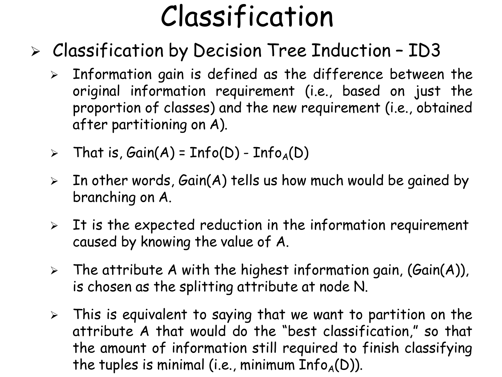

#### Step 3: Recursive Induction on Child Subtrees

- **Branch 1: Outlook = Overcast**
  Subset $S_{\text{Overcast}}$ contains $4$ tuples, all of which have label **Yes**.
  $\implies$ **Pure Leaf Node: Class = Yes**.

- **Branch 2: Outlook = Sunny ($5$ tuples: D1, D2, D8, D9, D11)**
  Target distribution: $[2+, 3-]$, $H(S_{\text{Sunny}}) = 0.9710$.
  Evaluating remaining attributes on $S_{\text{Sunny}}$:
  - **Humidity:**
    - High (D1, D2, D8): $[0+, 3-] \implies H = 0$ (all No).
    - Normal (D9, D11): $[2+, 0-] \implies H = 0$ (all Yes).

$$
IG(S_{\text{Sunny}}, \text{Humidity}) = 0.9710 - 0 = \mathbf{0.9710 \text{ bits}} \quad (\text{Perfect Split!})
$$

  - **Wind:**
    - Weak (D1, D8, D9): $[1+, 2-] \implies H = 0.9183$.
    - Strong (D2, D11): $[1+, 1-] \implies H = 1.0000$.

2885
$$IG(S_{\text{Sunny}}, \text{Wind}) = 0.9710 - 0.9510 = 0.0200 \text{ bits}$$
2885
  - **Decision:** Split on **Humidity**. High $\to$ **No**, Normal $\to$ **Yes**.

- **Branch 3: Outlook = Rain ($5$ tuples: D4, D5, D6, D10, D14)**
  Target distribution: $[3+, 2-]$, $H(S_{\text{Rain}}) = 0.9710$.
  Evaluating remaining attributes on $S_{\text{Rain}}$:
  - **Wind:**
    - Weak (D4, D5, D10): $[3+, 0-] \implies H = 0$ (all Yes).
    - Strong (D6, D14): $[0+, 2-] \implies H = 0$ (all No).

$$
IG(S_{\text{Rain}}, \text{Wind}) = 0.9710 - 0 = \mathbf{0.9710 \text{ bits}} \quad (\text{Perfect Split!})
$$

  - **Decision:** Split on **Wind**. Weak $\to$ **Yes**, Strong $\to$ **No**.

### Figure 6.14: Final Completed ID3 Decision Tree
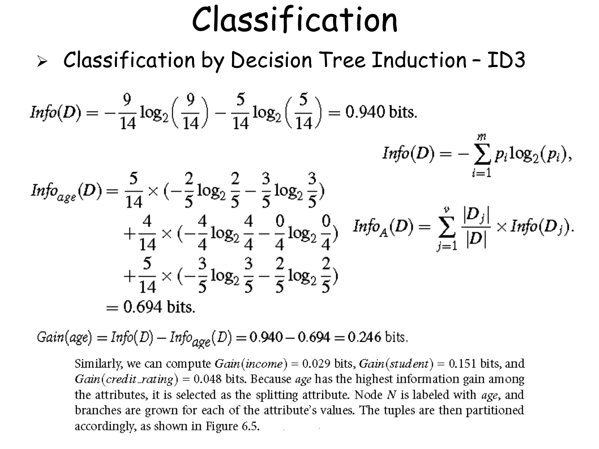

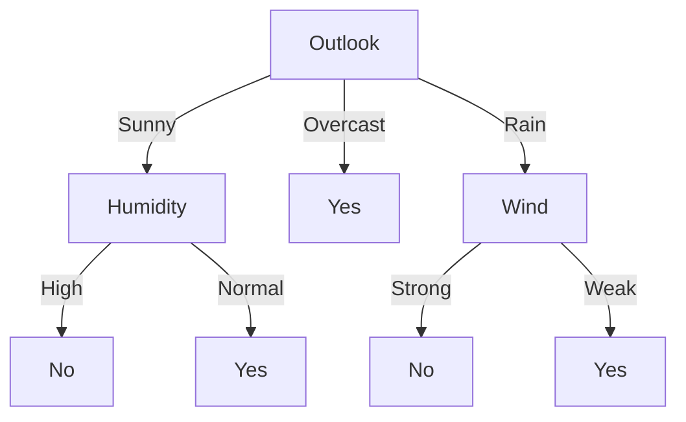
```mermaid
flowchart TD
    A[Outlook] -->|Sunny| B[Humidity]
    A -->|Overcast| C[Yes]
    A -->|Rain| D[Wind]
    
    B -->|High| B1[No]
    B -->|Normal| B2[Yes]
    
    D -->|Strong| D1[No]
    D -->|Weak| D2[Yes]
```

[Source: KNN Naive Bayes and DT1.pdf, Slides 70–76]

---

## 9. The C4.5 Algorithm
[Source: KNN Naive Bayes and DT1.pdf, Slides 82–85]

Developed by Ross Quinlan as the successor to ID3, C4.5 introduces several crucial enhancements to address practical limitations of ID3.

### 9.1 The High-Cardinality Bias of Information Gain
A major defect in ID3's Information Gain criterion is its systemic bias towards attributes with large numbers of distinct values (e.g., `Customer_ID`, `Transaction_Date`, or `SSN`). If an attribute assigns a unique value to every single instance, partitioning on that attribute produces $m$ pure single-item subsets with $H(S_v) = 0$, yielding maximum possible Information Gain:

$$
IG(S, \text{ID}) = H(S) - 0 = H(S)
$$

However, this tree has zero predictive capability on unseen data and results in catastrophic overfitting.

---

### 9.2 Split Information and Gain Ratio Formulations

#### 1. Split Information
To neutralize this bias, C4.5 defines **Split Information** (the intrinsic entropy of the partition itself):

$$
\text{SplitInfo}_A(S) = -\sum_{v=1}^{c} \frac{|S_v|}{|S|} \log_2\left( \frac{|S_v|}{|S|} \right)
$$

Where:
- $c$: Number of distinct outcome branches of attribute $A$.
- High-cardinality attributes with many small splits yield large $\text{SplitInfo}$, heavily penalizing fragmented partitions.

#### 2. Gain Ratio

$$
\text{GainRatio}(S, A) = \frac{IG(S, A)}{\text{SplitInfo}_A(S)}
$$

### Figure 6.15: C4.5 Gain Ratio Principles
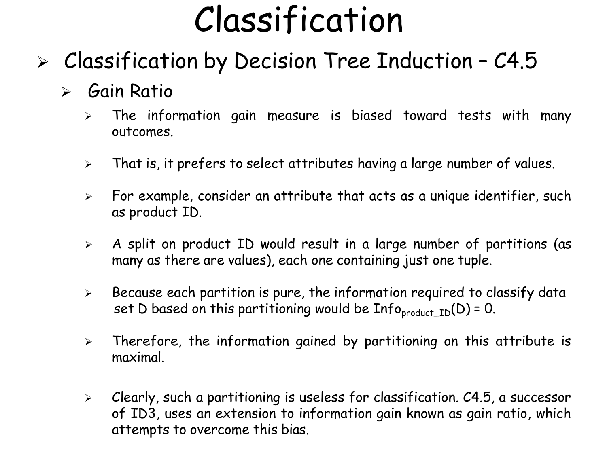

#### Attribute Selection Rule:
To prevent selecting attributes with trivial Information Gain simply because their Split Information is infinitesimally small, C4.5 applies a two-step selection rule:
1. Compute the average Information Gain across all candidate attributes.
2. Select the attribute that **maximizes Gain Ratio** strictly among those attributes whose Information Gain is **at or above average**.

---

### 9.3 Additional Advances in C4.5

#### 1. Continuous Attribute Handling (Dynamic Thresholding)
For continuous feature $A$, sort distinct training values in ascending order: $\{v_1, v_2, \dots, v_n\}$.
Evaluate binary split candidate thresholds at midpoints:

$$
\theta_i = \frac{v_i + v_{i+1}}{2}
$$

Partition data into $S_1 = \{x \mid A \le \theta_i\}$ and $S_2 = \{x \mid A > \theta_i\}$, computing Information Gain for each midpoint and selecting the optimal threshold $\theta^*$.

#### 2. Handling Missing Feature Values
If an instance has a missing value for test attribute $A$, C4.5 assigns it fractional weights proportional to the sizes of the split branches:

$$
w_v = \frac{|S_v|}{|S|}
$$

[Source: KNN Naive Bayes and DT1.pdf, Slides 82–85]

---

## 10. The CART Algorithm (Classification and Regression Trees)
[Source: KNN Naive Bayes and DT1.pdf, Slides 86–100]

Developed by Breiman, Friedman, Olshen, and Stone (1984), CART constructs strictly **binary decision trees** using the **Gini Impurity Index**.

### 10.1 Mathematical Formulation of Gini Impurity

$$
\text{Gini}(S) = 1 - \sum_{i=1}^{c} p_i^2
$$

Where $p_i$ is the empirical probability that an item in $S$ belongs to class $i$.
For binary classification ($p_1$ and $p_2 = 1 - p_1$):

$$
\text{Gini}(S) = 1 - (p_1^2 + p_2^2) = 2 p_1 (1 - p_1)
$$

### Figure 6.16: Gini Impurity Formulation
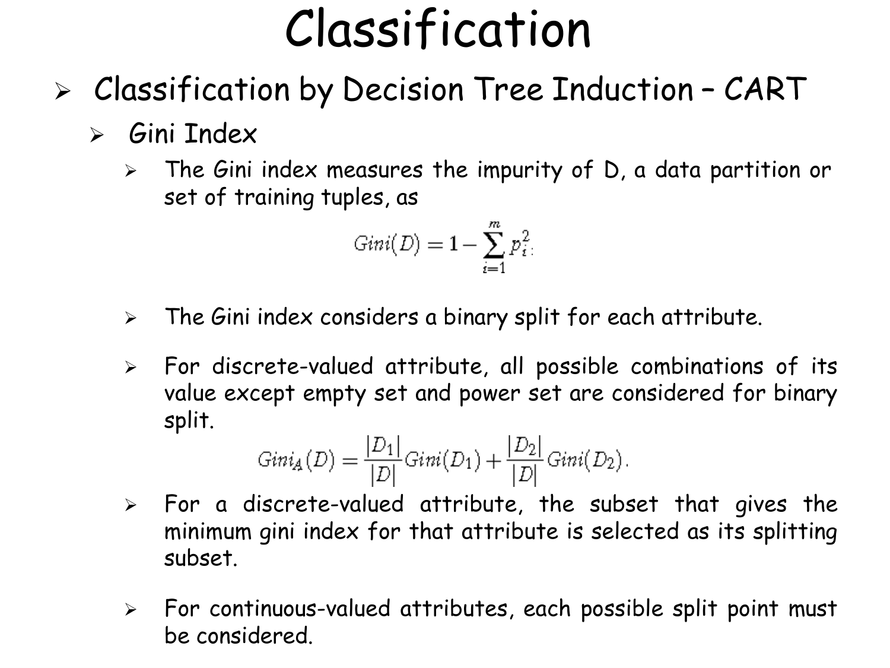

**Key Properties of Gini Impurity:**
- **Minimum Value:** $\text{Gini} = 0$ when the node is purely homogeneous ($p_1 = 1$).
- **Maximum Value:** $\text{Gini} = 0.50$ when instances are equally distributed ($p_1 = 0.50, p_2 = 0.50$).
- **Computational Efficiency:** Does not require costly logarithmic computations (unlike Shannon Entropy).

---

### 10.2 Binary Splitting Strategy for Subsets
For a categorical attribute $A$ with distinct values $\{v_1, \dots, v_k\}$, CART examines all non-empty, proper binary subsets $\mathcal{P}(A) \setminus \{\emptyset, A\}$.
The weighted Gini index of partition $(S_1, S_2)$ generated by condition $A \in V_{\text{subset}}$ is:

$$
\text{Gini}_A(S) = \frac{|S_1|}{|S|} \text{Gini}(S_1) + \frac{|S_2|}{|S|} \text{Gini}(S_2)
$$

The reduction in impurity (Gini Gain) is:

$$
\Delta\text{Gini}(A) = \text{Gini}(S) - \text{Gini}_A(S)
$$

CART selects the attribute and subset split that **maximizes $\Delta\text{Gini}$** (equivalently, minimizes $\text{Gini}_A(S)$).

[Source: KNN Naive Bayes and DT1.pdf, Slides 86–90]

---

### 10.3 Complete Step-by-Step Worked CART Example: Job Offer Dataset
[Source: KNN Naive Bayes and DT1.pdf, Slides 87–96]

#### Training Dataset ($m = 10$ instances):

| ID | CGPA | Interactiveness | Practical Knowledge | Communication Skills | Job Offer ($y$) |
| :---: | :---: | :---: | :--- | :--- | :---: |
| 1 | $\ge 9$ | Yes | Very Good | Good | **Yes** |
| 2 | $\ge 8$ | No | Good | Moderate | **Yes** |
| 3 | $\ge 9$ | No | Average | Poor | **No** |
| 4 | $< 8$ | No | Average | Good | **No** |
| 5 | $\ge 8$ | Yes | Good | Moderate | **Yes** |
| 6 | $\ge 9$ | Yes | Good | Moderate | **Yes** |
| 7 | $< 8$ | Yes | Good | Poor | **No** |
| 8 | $\ge 9$ | No | Very Good | Good | **Yes** |
| 9 | $\ge 8$ | Yes | Good | Good | **Yes** |
| 10 | $\ge 8$ | Yes | Average | Good | **Yes** |

#### Step 1: Base Gini Impurity of Dataset $T$
Total instances $|T| = 10$: $7$ Yes, $3$ No ($[7+, 3-]$).

$$
\text{Gini}(T) = 1 - \left( \frac{7}{10} \right)^2 - \left( \frac{3}{10} \right)^2 = 1 - 0.49 - 0.09 = \mathbf{0.4200}
$$

#### Step 2: Evaluate Candidate Attributes for Root Split

1. **Attribute: CGPA**
Possible categorical values: $\{\ge 9, \ge 8, < 8\}$.
Evaluating candidate subset split: $\{\ge 9, \ge 8\}$ vs. $\{< 8\}$:
- Subset $S_1$ (CGPA $\in \{\ge 9, \ge 8\}$): $8$ instances (IDs 1, 2, 3, 5, 6, 8, 9, 10):
  - Distribution: $7$ Yes, $1$ No ($[7+, 1-]$)

$$
\text{Gini}(S_1) = 1 - \left(\frac{7}{8}\right)^2 - \left(\frac{1}{8}\right)^2 = 1 - \frac{49}{64} - \frac{1}{64} = \frac{14}{64} = \mathbf{0.21875}
$$

- Subset $S_2$ (CGPA $< 8$): $2$ instances (IDs 4, 7):
  - Distribution: $0$ Yes, $2$ No ($[0+, 2-]$)

$$
\text{Gini}(S_2) = 1 - \left(\frac{0}{2}\right)^2 - \left(\frac{2}{2}\right)^2 = 0 \quad (\text{Pure!})
$$

Weighted Gini Index:

$$
\text{Gini}(T, \text{CGPA}) = \frac{8}{10}(0.21875) + \frac{2}{10}(0) = \mathbf{0.1755}
$$

Impurity Reduction:

$$
\Delta\text{Gini}(\text{CGPA}) = 0.4200 - 0.1755 = \mathbf{0.2445}
$$

2. **Attribute: Practical Knowledge**
Values: $\{\text{Very Good}, \text{Good}, \text{Average}\}$.
- Subset $\{\text{Very Good}, \text{Good}\}$ vs $\{\text{Average}\}$ gives $\text{Gini} = 0.3054$.

$$
\Delta\text{Gini}(\text{Practical Knowledge}) = 0.4200 - 0.3054 = \mathbf{0.1146}
$$

3. **Attribute: Communication Skills**
Values: $\{\text{Good}, \text{Moderate}, \text{Poor}\}$.
Evaluating subset: $\{\text{Good}, \text{Moderate}\}$ vs $\{\text{Poor}\}$:
- Poor ($2$ instances: IDs 3, 7): $0$ Yes, $2$ No $\implies \text{Gini} = 0$.
- Good/Moderate ($8$ instances): $7$ Yes, $1$ No $\implies \text{Gini} = 0.21875$.

$$
\text{Gini}(T, \text{Comm Skills}) = \frac{8}{10}(0.21875) + 0 = 0.1755 \implies \Delta\text{Gini} = \mathbf{0.2445}
$$

4. **Selecting Root Split:**
Both CGPA and Communication Skills tie at $\Delta\text{Gini} = 0.2445$. CART selects **CGPA $\in \{\ge 9, \ge 8\}$ vs. $< 8$** as the primary root test.
- The right branch (CGPA $< 8$) terminates in a pure leaf: **Job Offer = No**.

### Figure 6.17: Step-by-Step CART Split Calculations
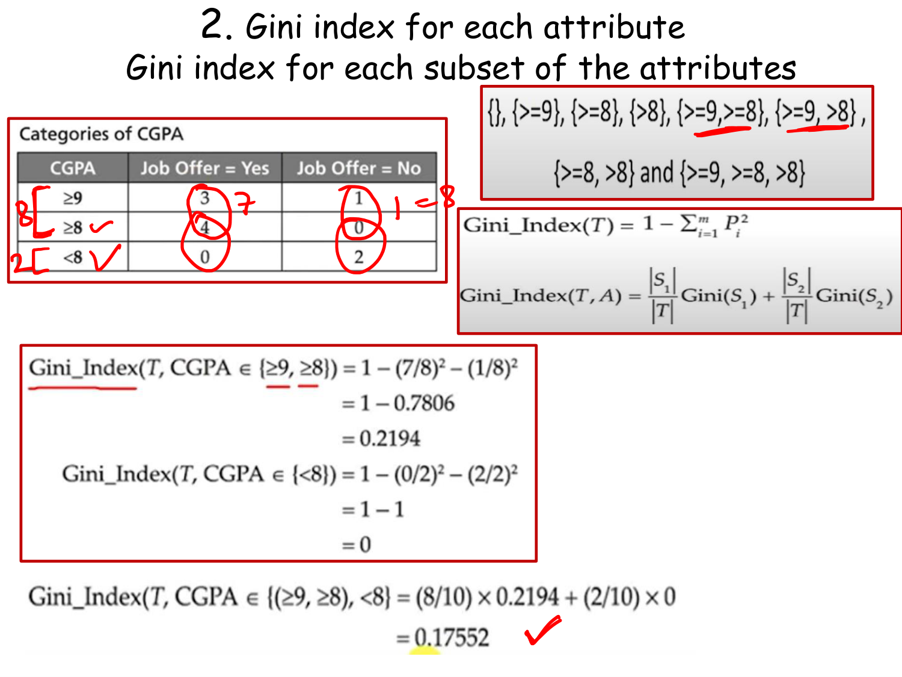

#### Step 3: Splitting the Left Branch (CGPA $\in \{\ge 9, \ge 8\}$)
Dataset at node: $8$ instances ($7$ Yes, $1$ No), $\text{Gini} = 0.2184$.
Evaluating remaining candidate attributes:
- **Communication Skills $\in \{\text{Good}, \text{Moderate}\}$ vs. $\{\text{Poor}\}$:**
  - Poor (1 instance: ID 3): Job Offer = **No** ($[0+, 1-] \implies \text{Gini} = 0$).
  - Good/Moderate (7 instances: IDs 1, 2, 5, 6, 8, 9, 10): Job Offer = **Yes** ($[7+, 0-] \implies \text{Gini} = 0$).

$$
\text{Gini}(T_{\text{left}}, \text{Comm Skills}) = 0 \implies \Delta\text{Gini} = 0.2184 \quad (\text{Perfect Purity!})
$$

### Figure 6.18: Completed CART Binary Decision Tree
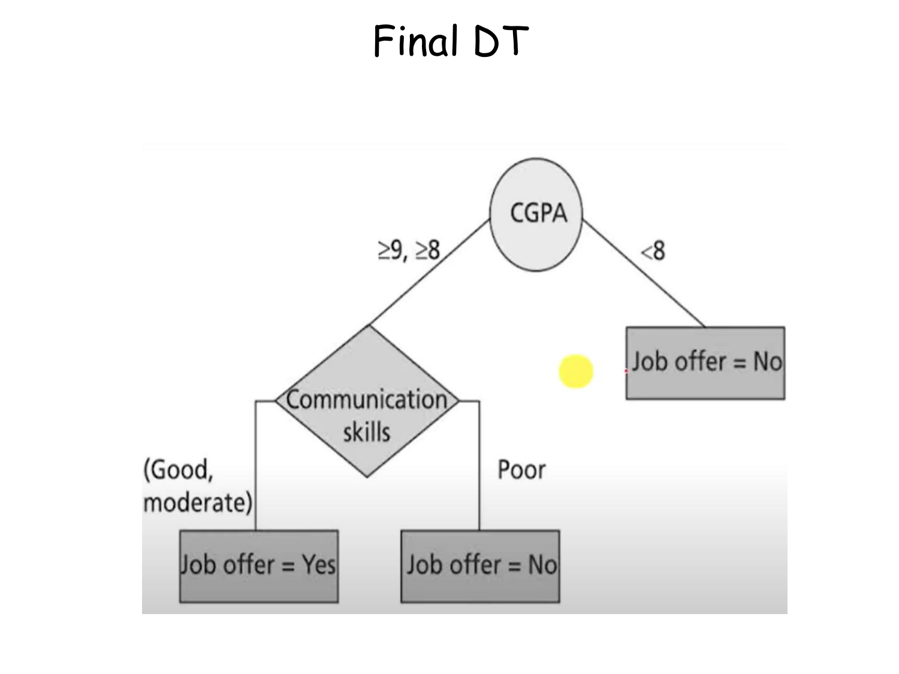

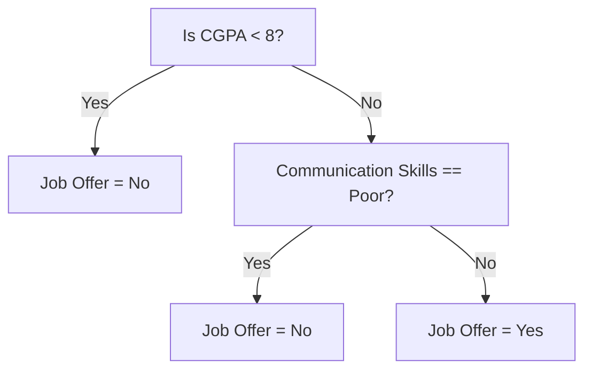
```mermaid
flowchart TD
    A["Is CGPA < 8?"] -->|Yes| B[Job Offer = No]
    A -->|No| C["Communication Skills == Poor?"]
    C -->|Yes| D[Job Offer = No]
    C -->|No| E[Job Offer = Yes]
```

[Source: KNN Naive Bayes and DT1.pdf, Slides 87–96]

---

## 11. Decision Tree Pruning & Overfitting Prevention
[Source: KNN Naive Bayes and DT1.pdf, Slide 100]

Deep decision trees tend to memorize sample noise and idiosyncrasies, leading to high variance and severe generalization error on test data.

### Figure 6.19: Tree Pruning and Generalization Tradeoff
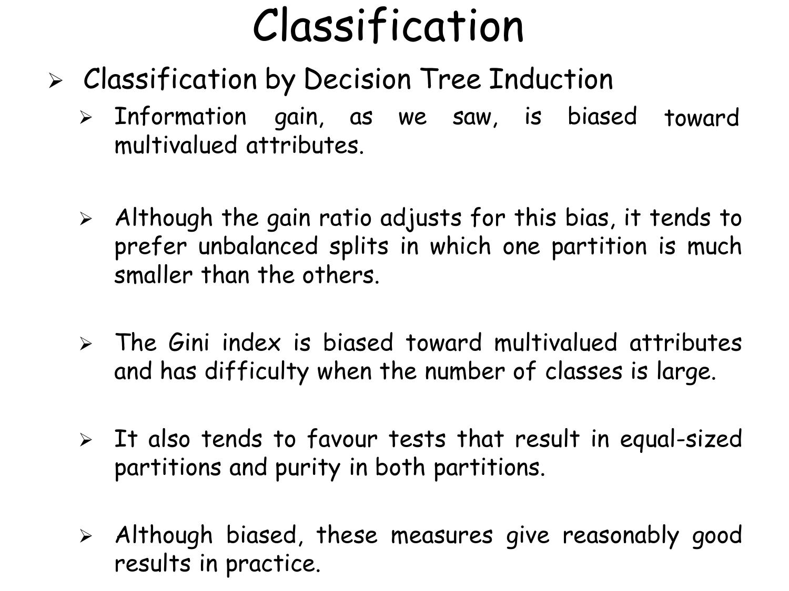

### 11.1 Pre-Pruning (Early Stopping)
Pre-pruning halts tree construction during induction if a stopping heuristic is triggered:
1. **Maximum Depth Limit:** Cease tree growth once tree depth exceeds $d_{\max}$.
2. **Minimum Samples per Leaf:** Refuse splitting if a child partition contains fewer than $n_{\min}$ instances.
3. **Purity Threshold:** Stop if node impurity falls below threshold $\epsilon$.
4. **Statistical Significance Test:** Stop if impurity reduction $\Delta$ is not statistically significant (e.g., $\chi^2$ test).

*Disadvantage:* Prone to premature halting ("horizon effect"), where an apparently uninformative split would have enabled a decisive subsequent split.

### 11.2 Post-Pruning (Cost-Complexity Pruning)
Post-pruning grows the tree to its absolute maximum depth (zero training error) and then systematically prunes subtrees from the leaves upward using validation data.

#### Cost-Complexity Objective (Weakest Link Pruning):

$$
R_\alpha(T) = R(T) + \alpha |T|
$$

Where:
- $R(T)$: Empirical classification error rate of tree $T$ on training data.
- $|T|$: Number of terminal leaf nodes in tree $T$ (model complexity penalty).
- $\alpha \ge 0$: Regularization complexity parameter. As $\alpha$ increases, simpler trees with fewer leaves are preferred.

[Source: KNN Naive Bayes and DT1.pdf, Slide 100]

---

## 12. Comprehensive Comparative Matrix of Classifiers

| Criterion | K-Nearest Neighbors (KNN) | Naïve Bayes Classifiers | ID3 Decision Trees | C4.5 Decision Trees | CART Decision Trees |
| :--- | :--- | :--- | :--- | :--- | :--- |
| **Model Type** | Non-parametric, lazy | Parametric generative | Non-parametric rule tree | Non-parametric rule tree | Non-parametric binary tree |
| **Splitting Metric** | Distance / Similarity | Joint probability likelihood | Shannon Information Gain | Information Gain Ratio | Gini Impurity Index |
| **Branching Structure**| Implicit local Voronoi cells | No explicit tree | Multi-way categorical branches | Multi-way & binary splits | Strict binary branching |
| **Feature Types** | Numerical (Euclidean) / Sparse | Count (Multi), Binary (Bernoulli), Continuous (Gauss) | Strictly categorical discrete | Discrete and continuous | Discrete and continuous |
| **Handling Missing Data**| Imputation required prior to run | Omit missing feature in likelihood product | Requires pre-processing | Proportional fractional weights | Surrogate split variables |
| **Computational Bottleneck**| Inference time $O(m \cdot d)$ | Very fast $O(K \cdot d)$ training and inference | Training phase $O(d \cdot m \log m)$ | Training phase $O(d \cdot m \log m)$ | Training phase $O(d \cdot m \log m)$ |
| **Primary Limitation**| Curse of dimensionality; sensitive to outliers | Unrealistic feature independence assumption | Biased toward high-cardinality features | High memory during recursive tree creation | Sensitive to class imbalance |

[Source: KNN Naive Bayes and DT1.pdf, Slides 2–100]

---

## 13. Consolidated Formula Sheet

### 1. K-Nearest Neighbors Distance Formulations

$$
d_{\text{Euclidean}}(\mathbf{u}, \mathbf{v}) = \sqrt{\sum_{j=1}^d (u_j - v_j)^2}, \quad d_{\text{Manhattan}}(\mathbf{u}, \mathbf{v}) = \sum_{j=1}^d |u_j - v_j|, \quad \text{Cosine}(\mathbf{u}, \mathbf{v}) = \frac{\mathbf{u} \cdot \mathbf{v}}{\|\mathbf{u}\|_2 \|\mathbf{v}\|_2}
$$

- $u_j, v_j$: Vector elements. Assumes feature normalization across coordinates.

### 2. General Naïve Bayes MAP Classifier

$$
\hat{y} = \arg\max_{k \in \{1, \dots, K\}} \left[ \ln P(C_k) + \sum_{j=1}^{d} \ln P(x_j \mid C_k) \right]
$$

### 3. Multivariate Bernoulli Naïve Bayes Likelihood

$$
P(\mathbf{x} \mid C_k) = \prod_{j=1}^{d} p_{kj}^{x_j} (1 - p_{kj})^{(1 - x_j)}, \quad p_{kj} = \frac{\text{Count}(x_j = 1, C_k) + 1}{N_k + 2}
$$

### 4. Gaussian Naïve Bayes Likelihood

$$
P(x_j \mid C_k) = \frac{1}{\sqrt{2\pi \sigma_{kj}^2}} \exp\left( -\frac{(x_j - \mu_{kj})^2}{2\sigma_{kj}^2} \right)
$$

### 5. Classification Performance Metrics

$$
\text{Accuracy} = \frac{TP + TN}{TP + TN + FP + FN}, \quad \text{Precision} = \frac{TP}{TP + FP}, \quad \text{Recall} = \frac{TP}{TP + FN}, \quad F_1 = \frac{2 \cdot TP}{2 \cdot TP + FP + FN}
$$

### 6. Shannon Entropy and Information Gain (ID3)

$$
H(S) = -\sum_{i=1}^c p_i \log_2(p_i), \quad IG(S, A) = H(S) - \sum_{v \in \text{Values}(A)} \frac{|S_v|}{|S|} H(S_v)
$$

### 7. Split Information and Gain Ratio (C4.5)

$$
\text{SplitInfo}_A(S) = -\sum_{v=1}^c \frac{|S_v|}{|S|} \log_2\left( \frac{|S_v|}{|S|} \right), \quad \text{GainRatio}(S, A) = \frac{IG(S, A)}{\text{SplitInfo}_A(S)}
$$

### 8. Gini Impurity and Gini Gain (CART)

$$
\text{Gini}(S) = 1 - \sum_{i=1}^c p_i^2, \quad \Delta\text{Gini}(A) = \text{Gini}(S) - \left( \frac{|S_1|}{|S|} \text{Gini}(S_1) + \frac{|S_2|}{|S|} \text{Gini}(S_2) \right)
$$

---

## 14. Important Definitions Sheet

- **Lazy Learner:** An algorithm that stores training instances and defers all hypothesis formulation until an active inference query arrives (e.g., KNN).
- **Curse of Dimensionality:** The phenomenon where high-dimensional feature spaces become exponential in volume, making all pairwise Euclidean distances equidistant.
- **Conditional Independence:** The condition where random variables $X_i$ and $X_j$ provide no information about each other when conditioned on class $C$.
- **Laplace Smoothing:** Adding 1 to observation counts and $|V|$ to denominators to eliminate 0 probabilities in categorical likelihood estimation.
- **Sensitivity (Recall):** Probability that a positive instance is identified by the model ($TP / (TP + FN)$).
- **Specificity:** Probability that a negative instance is identified by the model ($TN / (TN + FP)$).
- **Shannon Entropy:** The expected amount of information (in bits) produced by a stochastic source.
- **Information Gain:** The reduction in entropy obtained by splitting on a specific attribute.
- **Gain Ratio:** Information Gain normalized by Split Information to penalize attributes with excessive branches.
- **Gini Impurity:** A quadratic measure of node impurity representing expected misclassification probability.
- **Pre-Pruning:** Stopping decision tree growth before full expansion using validation metrics or depth caps.
- **Post-Pruning:** Collapsing branches of a fully grown decision tree to optimize test set generalization.

---

## 15. Exam-Oriented Review

### 15.1 High-Probability Theory Questions
1. **Explain the differences between lazy and eager learners. Why is KNN classified as a lazy learner?**
   - *Answer:* Eager learners (Naïve Bayes, Decision Trees) construct an explicit, compiled hypothesis model during training, discarding the original data. Lazy learners (KNN) perform $O(1)$ storage during training, deferring all computational effort ($O(m \cdot d)$ distance computations) to the inference query phase.

2. **State the conditional independence assumption of Naïve Bayes. Why is it called "naïve", and why does it perform surprisingly well in practice?**
   - *Answer:* It assumes $P(\mathbf{x} \mid C) = \prod_{j=1}^d P(x_j \mid C)$. It is naïve because real-world features frequently correlate. It performs well because classification only requires picking the maximum posterior class, which remains correct even if the probability magnitudes are distorted, provided the ranking order is preserved.

3. **Why does the ID3 algorithm favor attributes with many possible values, and how does C4.5 solve this issue?**
   - *Answer:* Attributes with many distinct values (e.g., ID numbers) partition data into many tiny, pure single-item subsets, achieving zero subset entropy and maximal Information Gain. C4.5 resolves this by normalizing Information Gain by the Split Information of the attribute partition, defining the Gain Ratio.

4. **Differentiate between Information Gain and Gini Impurity.**
   - *Answer:* Information Gain is logarithmic ($-\sum p_i \log_2 p_i$), maximizing entropy reduction; Gini Impurity is quadratic ($1 - \sum p_i^2$), computationally faster, and tends to isolate the largest class into pure binary splits.

---

### 15.2 Step-by-Step Worked Exam Numerical Problems

#### Problem 1: KNN Classification
Given 2D training points:
$A_1 = (1, 2)$ [Class $+1$], $A_2 = (2, 1)$ [Class $+1$], $A_3 = (2, 3)$ [Class $+1$], $B_1 = (4, 5)$ [Class $-1$], $B_2 = (5, 4)$ [Class $-1$].
Classify query point $\mathbf{x}^* = (3, 3)$ using:
a) 1-NN with Euclidean distance.
b) 3-NN with Euclidean distance.

**Solution:**
1. Compute Euclidean distances from $\mathbf{x}^* = (3, 3)$:
   - $d(\mathbf{x}^*, A_1) = \sqrt{(3-1)^2 + (3-2)^2} = \sqrt{4+1} = \sqrt{5} \approx 2.236$
   - $d(\mathbf{x}^*, A_2) = \sqrt{(3-2)^2 + (3-1)^2} = \sqrt{1+4} = \sqrt{5} \approx 2.236$
   - $d(\mathbf{x}^*, A_3) = \sqrt{(3-2)^2 + (3-3)^2} = \sqrt{1+0} = 1.000$
   - $d(\mathbf{x}^*, B_1) = \sqrt{(3-4)^2 + (3-5)^2} = \sqrt{1+4} = \sqrt{5} \approx 2.236$
   - $d(\mathbf{x}^*, B_2) = \sqrt{(3-5)^2 + (3-4)^2} = \sqrt{4+1} = \sqrt{5} \approx 2.236$

2. **1-NN Decision:** The closest point is $A_3$ at distance $1.000$. Class = **$+1$**.
3. **3-NN Decision:** The 3 nearest neighbors are $A_3$ (dist 1.0), and any two tied points among $\{A_1, A_2, B_1, B_2\}$ (dist 2.236). Since points from Class $+1$ constitute at least 2 out of 3 closest neighbors, the majority vote yields Class = **$+1$**.

---

#### Problem 2: Classification Metric Derivation
A medical diagnostic classifier tests $1000$ patients:
- Actual Sick ($200$): $180$ predicted Sick ($TP$), $20$ predicted Healthy ($FN$).
- Actual Healthy ($800$): $80$ predicted Sick ($FP$), $720$ predicted Healthy ($TN$).

Calculate Accuracy, Sensitivity, Specificity, Precision, and F1-Score.

**Solution:**
1. $\text{Accuracy} = \frac{180 + 720}{1000} = \frac{900}{1000} = \mathbf{90.0\%}$
2. $\text{Sensitivity (Recall)} = \frac{180}{180 + 20} = \frac{180}{200} = \mathbf{90.0\%}$
3. $\text{Specificity} = \frac{720}{720 + 80} = \frac{720}{800} = \mathbf{90.0\%}$
4. $\text{Precision} = \frac{180}{180 + 80} = \frac{180}{260} \approx \mathbf{69.23\%}$
5. $F_1 = 2 \cdot \frac{0.6923 \times 0.9000}{0.6923 + 0.9000} = \frac{1.2461}{1.5923} \approx \mathbf{78.26\%}$

---
---

#### Problem 3: Naïve Bayes Classification with Laplace Smoothing

> [!IMPORTANT]
> **Complete Tabular Problem:**
> A software company evaluates job applicants based on two categorical attributes:
> - **Experience:** $\{ \text{Junior}, \text{Senior} \}$
> - **Degree:** $\{ \text{BSc}, \text{MSc} \}$
> - **Target Class ($Y$):** Offer Made ($\{ \text{Yes}, \text{No} \}$)
>
> Historical Training Records ($m = 10$):
>
> | Candidate | Experience ($X_1$) | Degree ($X_2$) | Offer ($Y$) |
> | :---: | :---: | :---: | :---: |
> | 1 | Junior | BSc | No |
> | 2 | Junior | BSc | No |
> | 3 | Junior | MSc | Yes |
> | 4 | Junior | MSc | No |
> | 5 | Senior | BSc | Yes |
> | 6 | Senior | MSc | Yes |
> | 7 | Senior | MSc | Yes |
> | 8 | Senior | BSc | Yes |
> | 9 | Senior | BSc | No |
> | 10 | Junior | BSc | No |
>
> **Task:** Classify an unseen candidate: $\mathbf{x}^* = (\text{Experience} = \text{Junior}, \text{Degree} = \text{MSc})$ using Naïve Bayes with Laplace (Add-1) Smoothing ($k = 1$).

**Step 1: Compute Prior Probabilities $P(Y)$**:
- Total candidates $m = 10$.
- Count($\text{Offer}=\text{Yes}$) = $5 \implies P(\text{Yes}) = \frac{5}{10} = 0.5$.
- Count($\text{Offer}=\text{No}$) = $5 \implies P(\text{No}) = \frac{5}{10} = 0.5$.

**Step 2: Frequency Counts & Laplace-Smoothed Likelihoods**:
For an attribute with $|V|$ distinct categories, Laplace smoothing adds $1$ to numerator and $|V|$ to denominator:

2885
$$P(X_j = v \mid Y = c) = \frac{\text{Count}(X_j = v, Y = c) + 1}{\text{Count}(Y = c) + |V|}$$
2885

Here, both attributes have $|V| = 2$ categories.

- **For Class $Y = \text{Yes}$ ($N_{\text{Yes}} = 5$):**
  - Experience = Junior: Count = $1 \implies P(\text{Junior} \mid \text{Yes}) = \frac{1 + 1}{5 + 2} = \mathbf{\frac{2}{7}}$
  - Degree = MSc: Count = $3 \implies P(\text{MSc} \mid \text{Yes}) = \frac{3 + 1}{5 + 2} = \mathbf{\frac{4}{7}}$

- **For Class $Y = \text{No}$ ($N_{\text{No}} = 5$):**
  - Experience = Junior: Count = $4 \implies P(\text{Junior} \mid \text{No}) = \frac{4 + 1}{5 + 2} = \mathbf{\frac{5}{7}}$
  - Degree = MSc: Count = $1 \implies P(\text{MSc} \mid \text{No}) = \frac{1 + 1}{5 + 2} = \mathbf{\frac{2}{7}}$

**Step 3: Posterior Score Calculation for Query $\mathbf{x}^* = (\text{Junior}, \text{MSc})$**:
- Score($\text{Yes}$) $= P(\text{Yes}) \times P(\text{Junior} \mid \text{Yes}) \times P(\text{MSc} \mid \text{Yes})$

2885
$$\text{Score}(\text{Yes}) = 0.5 \times \frac{2}{7} \times \frac{4}{7} = 0.5 \times \frac{8}{49} = \frac{4}{49} \approx \mathbf{0.0816}$$
2885

- Score($\text{No}$) $= P(\text{No}) \times P(\text{Junior} \mid \text{No}) \times P(\text{MSc} \mid \text{No})$

2885
$$\text{Score}(\text{No}) = 0.5 \times \frac{5}{7} \times \frac{2}{7} = 0.5 \times \frac{10}{49} = \frac{5}{49} \approx \mathbf{0.1020}$$
2885

**Step 4: Normalized Probabilities & Classification**:

2885
$$\text{Total Score} = \frac{4}{49} + \frac{5}{49} = \frac{9}{49}$$
2885

2885
$$P(\text{Yes} \mid \mathbf{x}^*) = \frac{4/49}{9/49} = \frac{4}{9} \approx \mathbf{44.44\%}$$
2885

2885
$$P(\text{No} \mid \mathbf{x}^*) = \frac{5/49}{9/49} = \frac{5}{9} \approx \mathbf{55.56\%}$$
2885

**Decision:** Since $P(\text{No} \mid \mathbf{x}^*) > P(\text{Yes} \mid \mathbf{x}^*)$, candidate is classified as **Offer = No**.

---

#### Problem 4: Decision Tree Induction (Shannon Entropy, Information Gain, & Mermaid Tree)

> [!IMPORTANT]
> **Complete Induction Problem:**
> A banking dataset determines loan approval based on Credit Rating and Income:
>
> | ID | Credit Rating | Income | Loan Approved? |
> | :---: | :---: | :---: | :---: |
> | 1 | Fair | High | Yes |
> | 2 | Fair | Low | No |
> | 3 | Good | High | Yes |
> | 4 | Good | Low | Yes |
> | 5 | Poor | High | No |
> | 6 | Poor | Low | No |
> | 7 | Good | High | Yes |
> | 8 | Fair | High | Yes |
>
> Total samples $|S| = 8$: $5$ Yes ($+$), $3$ No ($-$).

**Step 1: Calculate Total Dataset Entropy $H(S)$**:

2885
$$p_+ = \frac{5}{8} = 0.625, \quad p_- = \frac{3}{8} = 0.375$$
2885

2885
$$H(S) = -\left[ \frac{5}{8} \log_2\left(\frac{5}{8}\right) + \frac{3}{8} \log_2\left(\frac{3}{8}\right) \right]$$
2885

2885
$$H(S) = -[0.625(-0.678) + 0.375(-1.415)] = -[-0.4238 - 0.5306] = \mathbf{0.9544 \text{ bits}}$$
2885

**Step 2: Information Gain for Attribute "Credit Rating"**:
Values: $\{\text{Good}, \text{Fair}, \text{Poor}\}$
- **Credit = Good** ($|S_{\text{Good}}| = 3$): IDs 3, 4, 7 $\implies 3$ Yes, $0$ No.

2885
$$H(S_{\text{Good}}) = -\left[1 \log_2 1 + 0\right] = \mathbf{0.0 \text{ (Pure)}}$$
2885
- **Credit = Fair** ($|S_{\text{Fair}}| = 3$): IDs 1, 2, 8 $\implies 2$ Yes, $1$ No.

2885
$$H(S_{\text{Fair}}) = -\left[\frac{2}{3} \log_2\left(\frac{2}{3}\right) + \frac{1}{3} \log_2\left(\frac{1}{3}\right)\right] = \mathbf{0.9183 \text{ bits}}$$
2885
- **Credit = Poor** ($|S_{\text{Poor}}| = 2$): IDs 5, 6 $\implies 0$ Yes, $2$ No.

2885
$$H(S_{\text{Poor}}) = \mathbf{0.0 \text{ (Pure)}}$$
2885

Weighted Remaining Entropy:

2885
$$H(S, \text{Credit}) = \frac{3}{8}(0.0) + \frac{3}{8}(0.9183) + \frac{2}{8}(0.0) = \frac{2.7549}{8} = 0.3444 \text{ bits}$$
2885

2885
$$IG(S, \text{Credit}) = H(S) - H(S, \text{Credit}) = 0.9544 - 0.3444 = \mathbf{0.6100 \text{ bits}}$$
2885

**Step 3: Information Gain for Attribute "Income"**:
Values: $\{\text{High}, \text{Low}\}$
- **Income = High** ($|S_{\text{High}}| = 5$): IDs 1, 3, 5, 7, 8 $\implies 4$ Yes, $1$ No.

2885
$$H(S_{\text{High}}) = -\left[\frac{4}{5}\log_2\left(\frac{4}{5}\right) + \frac{1}{5}\log_2\left(\frac{1}{5}\right)\right] = -[0.8(-0.322) + 0.2(-2.322)] = \mathbf{0.7219 \text{ bits}}$$
2885
- **Income = Low** ($|S_{\text{Low}}| = 3$): IDs 2, 4, 6 $\implies 1$ Yes, $2$ No.

2885
$$H(S_{\text{Low}}) = \mathbf{0.9183 \text{ bits}}$$
2885

Weighted Remaining Entropy:

2885
$$H(S, \text{Income}) = \frac{5}{8}(0.7219) + \frac{3}{8}(0.9183) = 0.4512 + 0.3444 = 0.7956 \text{ bits}$$
2885

2885
$$IG(S, \text{Income}) = 0.9544 - 0.7956 = \mathbf{0.1588 \text{ bits}}$$
2885

**Step 4: Root Attribute Selection & Sub-tree Expansion**:
- $IG(S, \text{Credit}) = \mathbf{0.6100 \text{ bits}} > IG(S, \text{Income}) = \mathbf{0.1588 \text{ bits}}$.
- **Root Node:** Split on **Credit Rating**!
- Branch `Credit = Good` $\implies$ Pure $\implies$ **Leaf: "Yes"**.
- Branch `Credit = Poor` $\implies$ Pure $\implies$ **Leaf: "No"**.
- Branch `Credit = Fair` has 2 Yes, 1 No. Split on remaining attribute **Income**:
  - `Income = High` $\implies$ IDs 1, 8 (2 Yes) $\implies$ **Leaf: "Yes"**.
  - `Income = Low` $\implies$ ID 2 (1 No) $\implies$ **Leaf: "No"**.

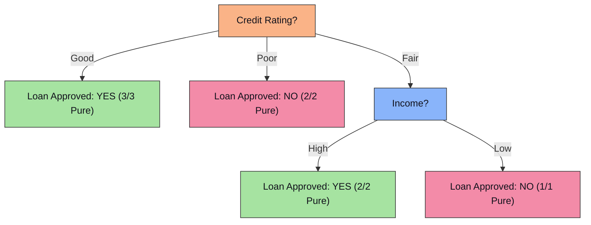
```mermaid
flowchart TD
    Root["Credit Rating?"]
    Root -->|Good| L_Yes1["Loan Approved: YES (3/3 Pure)"]
    Root -->|Poor| L_No1["Loan Approved: NO (2/2 Pure)"]
    Root -->|Fair| Sub["Income?"]

    Sub -->|High| L_Yes2["Loan Approved: YES (2/2 Pure)"]
    Sub -->|Low| L_No2["Loan Approved: NO (1/1 Pure)"]

    style Root fill:#fab387,stroke:#333,color:#11111b
    style Sub fill:#89b4fa,stroke:#333,color:#11111b
    style L_Yes1 fill:#a6e3a1,stroke:#333,color:#11111b
    style L_Yes2 fill:#a6e3a1,stroke:#333,color:#11111b
    style L_No1 fill:#f38ba8,stroke:#333,color:#11111b
    style L_No2 fill:#f38ba8,stroke:#333,color:#11111b
```

