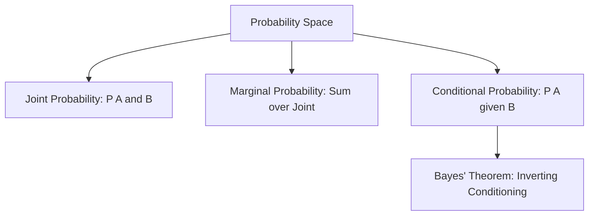
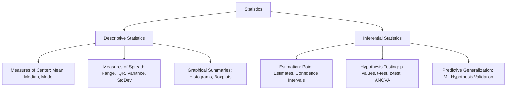
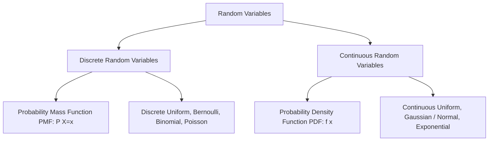

# Complete Machine Learning Notes: Probability & Statistics

> **Course Code:** 3CS526CC23
> **Course Title:** Machine Learning and its Applications
> **Primary Source:** Faculty Lecture Slides - Dr. Sapan H. Mankad, Nirma University
> **Files Integrated:** `ps4ml.pdf` (44 Slides)

---

# Chapter 2 — Probability & Statistics for Machine Learning

## 1. Chapter Overview
Probability and statistics constitute the rigorous mathematical bedrock upon which all machine learning theory and algorithms are erected. Real-world machine learning systems must constantly operate under stochastic noise, incomplete sensory observation, sampling bias, and intrinsic uncertainty. Probability provides the formal calculus for quantifying uncertainty and reasoning under incomplete information, while statistics provides the operational methodology for extracting parameter estimates, validating hypotheses, and quantifying variability from empirical sample data.

This chapter synthesizes the foundational probabilistic and statistical concepts required for machine learning:
1. **Epistemological Probability:** Empirical (relative frequency) versus Theoretical (classical) probability, Joint, Marginal, and Conditional probabilities, and Bayes' theorem.
2. **Asymptotic Convergence:** The Law of Large Numbers (LLN) and the Central Limit Theorem.
3. **Statistical Taxonomy:** Descriptive Statistics (summarization) versus Inferential Statistics (generalization).
4. **Diagnostic Summary Statistics:** Three structural classes of descriptive measures:
   - Measures of Central Tendency (Arithmetic Mean, Weighted Mean, Median, Mode).
   - Measures of Variability / Dispersion (Range, Interquartile Range, Population Variance, Sample Variance with Bessel's correction, Standard Deviation).
   - Measures of Position (Percentiles, Quartiles, 5-Number Summary).
5. **Exploratory Data Visualization:** Box and Whisker plots, interquartile fences, and Tukey's $1.5 \times \text{IQR}$ outlier detection protocol.
6. **Probability Distributions:** Probability Mass Functions (PMF), Probability Density Functions (PDF), Discrete/Continuous Uniform distributions, and the Gaussian (Normal) distribution with the 68–95–99.7% empirical rule.
7. **Information Theory Foundations:** Self-information (surprise), Shannon Entropy ($H(X)$), bits of uncertainty, and its direct applications to Decision Tree induction and neural loss functions.

[Source: ps4ml.pdf, Slides 1–4]

---

## 2. Core Terminology Dictionary

1. **Empirical Probability:** Probability calculated from observed experimental trial frequencies: $\frac{\text{Occurrences of event}}{\text{Total experimental trials}}$.
2. **Theoretical (Classical) Probability:** Probability calculated mathematically from known symmetric sample spaces: $\frac{n(E)}{n(S)}$.
3. **Sample Space ($\Omega$ or $S$):** The set of all mutually exclusive and exhaustive primitive outcomes of a random experiment.
4. **Joint Probability $P(A \cap B)$:** The probability that event $A$ and event $B$ occur concurrently.
5. **Marginal Probability $P(A)$:** The unconditional probability of event $A$, obtained by summing the joint probability over all possible outcomes of variable $B$: $P(A) = \sum_b P(A, B=b)$.
6. **Conditional Probability $P(A \mid B)$:** The revised probability of event $A$ given the certainty that conditioning event $B$ has occurred.
7. **Law of Large Numbers (LLN):** An asymptotic theorem asserting that the empirical sample mean $\bar{X}_n$ converges in probability to the true population expectation $\mu$ as $n \to \infty$.
8. **Descriptive Statistics:** Statistical procedures focused on summarizing, organizing, and visualizing the quantitative features of a specific dataset.
9. **Inferential Statistics:** Procedures that deduce population characteristics, test hypotheses, and make predictions based on representative sample data.
10. **Arithmetic Mean ($\bar{x}$):** The sum of all numerical observations divided by the sample size; highly sensitive to extreme outliers.
11. **Median ($M$):** The central value separating the upper half from the lower half of an ordered dataset; robust to extreme outliers.
12. **Mode:** The most frequently occurring observation in a dataset; applicable to both categorical and numerical data.
13. **Interquartile Range (IQR):** The spread of the central $50\%$ of data: $\text{IQR} = Q_3 - Q_1$.
14. **Bessel's Correction ($n-1$):** Dividing by $n-1$ instead of $n$ in sample variance to correct for negative bias and yield an unbiased estimator of population variance.
15. **Box and Whisker Plot:** A standardized five-point visual representation illustrating minimum, $Q_1$, median, $Q_3$, maximum, and outliers.
16. **Outlier:** An observational datum that deviates markedly from the overall pattern of the sample (formally falling outside $[Q_1 - 1.5 \cdot \text{IQR}, Q_3 + 1.5 \cdot \text{IQR}]$).
17. **Random Variable (R.V.):** A measurable function $X: \Omega \to \mathbb{R}$ that maps primitive experimental outcomes to real numbers.
18. **Probability Density Function (PDF):** A function $f(x) \ge 0$ for a continuous random variable whose integral over interval $[a, b]$ equals $P(a \le X \le b)$.
19. **Gaussian (Normal) Distribution:** A symmetric, bell-shaped continuous distribution completely characterized by its mean $\mu$ and variance $\sigma^2$.
20. **Shannon Entropy $H(X)$:** An information-theoretic measure quantifying the expected uncertainty or average surprise generated by a stochastic process.

[Source: ps4ml.pdf, Slides 5–44]

---

## 3. Epistemological Foundations of Probability
[Source: ps4ml.pdf, Slides 5–8]

### 3.1 Empirical vs. Theoretical Probability
Probability theory balances two complementary interpretations: empirical observation and theoretical deduction.

| Feature | Empirical (Experimental) Probability | Theoretical (Classical) Probability |
| :--- | :--- | :--- |
| **Fundamental Basis** | Derived from observed historical data or active experiments | Derived mathematically from deductive reasoning and symmetry |
| **Operational Formula** | $P_{\text{emp}}(E) = \frac{\text{Number of times event occurred}}{\text{Total number of trials}}$ | $P_{\text{theo}}(E) = \frac{\text{Number of favorable outcomes } n(E)}{\text{Total possible outcomes in sample space } n(S)}$ |
| **Dependence on Sample Size** | Fluctuates heavily for small $n$; stabilizes as $n \to \infty$ | Exact constant value regardless of experimental sample size |
| **Requirement** | Demands physical trials or historical logging | Demands an assumption of equally likely primitive outcomes |
| **ML Application** | Estimating class priors from labeled datasets | Combinatorial priors, gaming simulations, baseline null hypotheses |

### Figure 2.1: Coin Toss Experiment and Empirical Convergence


---

### 3.2 Joint, Marginal, and Conditional Probabilities



#### 1. Joint Probability:
The probability of the simultaneous occurrence of two events $A$ and $B$:

$$
P(A \cap B) = P(A, B)
$$

For statistically independent events: $P(A, B) = P(A) \cdot P(B)$.

#### 2. Marginal Probability:
The unconditional probability of event $A$ obtained by marginalizing (summing or integrating) over all possible states of variable $B$:

$$
P(A) = \sum_{k} P(A, B = b_k) \quad \text{(Discrete)} \qquad P(A) = \int_{-\infty}^{\infty} P(A, B = b) \, db \quad \text{(Continuous)}
$$

#### 3. Conditional Probability:
The probability of event $A$ occurring given the factual knowledge that event $B$ has occurred ($P(B) > 0$):

$$
P(A \mid B) = \frac{P(A \cap B)}{P(B)}
$$

#### 4. Bayes' Theorem:
Enables the inversion of conditional probabilities, converting a class-conditional likelihood into a posterior belief:

$$
P(A \mid B) = \frac{P(B \mid A) \cdot P(A)}{P(B)} = \frac{P(B \mid A) \cdot P(A)}{\sum_k P(B \mid A_k) P(A_k)}
$$

[Source: ps4ml.pdf, Slides 8, 15]

---

## 4. The Law of Large Numbers (LLN)
[Source: ps4ml.pdf, Slides 5–8]

### 4.1 Theoretical Formulation
The Law of Large Numbers establishes that if a random experiment is repeated independently an arbitrarily large number of times, the empirical average of the results will converge to the theoretical expected value.

Let $X_1, X_2, \dots, X_n$ be a sequence of independent and identically distributed (i.i.d.) random variables, each having theoretical population mean $\mathbb{E}[X_i] = \mu$ and finite variance $\text{Var}(X_i) = \sigma^2$. The sample mean is:

$$
\bar{X}_n = \frac{1}{n} \sum_{i=1}^{n} X_i
$$

#### The Weak Law of Large Numbers (WLLN):
For any arbitrarily small positive tolerance $\epsilon > 0$:

$$
\lim_{n \to \infty} P\left( |\bar{X}_n - \mu| < \epsilon \right) = 1 \quad \iff \quad \lim_{n \to \infty} P\left( |\bar{X}_n - \mu| \ge \epsilon \right) = 0
$$

### Figure 2.2: LLN Empirical Convergence Curves


**Written Analysis of Figure 2.2:**
The diagram illustrates repeated runs of a fair coin toss experiment ($X \in \{0, 1\}$, $\mu = 0.5$). For small trial counts ($n < 50$), the relative frequency $\bar{X}_n$ fluctuates wildly between $0.2$ and $0.8$. As $n$ surpasses $500$ and approaches $10,000$, all empirical trajectories dampen and converge asymptotically to the horizontal line at $\mu = 0.5$. In machine learning, this theorem guarantees that empirical risk minimization converges to true expected risk as training datasets grow large.

---

## 5. Statistical Taxonomy: Descriptive vs. Inferential Statistics
[Source: ps4ml.pdf, Slides 9–10]

Statistics is the mathematical discipline concerning the collection, organization, presentation, analysis, and interpretation of data.



### Comparative Analysis:

| Dimension | Descriptive Statistics | Inferential Statistics |
| :--- | :--- | :--- |
| **Objective** | Describe and summarize the characteristics of a known dataset | Draw inferences, conclusions, and predictions about an unseen population |
| **Data Scope** | Examines only the collected sample or census at hand | Utilizes sample data to infer properties of a much larger population |
| **Output Formats** | Summary tables, numerical metrics (mean, IQR), graphical charts | Point estimators, confidence intervals, test statistics ($p$-values) |
| **Uncertainty Level** | Completely deterministic calculation with zero uncertainty | Involves probabilistic uncertainty and sampling error margins |
| **Role in ML** | Exploratory Data Analysis (EDA), feature distribution checking | Validating model generalization, cross-validation statistical significance |

[Source: ps4ml.pdf, Slides 9–10]

---

## 6. The Three Structural Classes of Summary Measures
[Source: ps4ml.pdf, Slide 13]

In descriptive statistics, empirical datasets are characterized through three distinct, complementary families of metrics:
1. **Measures of Central Tendency:** Identify the single central value around which data cluster.
2. **Measures of Variability / Dispersion:** Quantify the extent to which observations scatter away from the center.
3. **Measures of Position:** Identify the relative standing of an individual observation within the broader distribution.

---

## 7. Measures of Central Tendency
[Source: ps4ml.pdf, Slides 13–15]

### Figure 2.3: Measures of Center


### 7.1 Mathematical Formulations

#### 1. Sample Arithmetic Mean ($\bar{x}$)

$$
\bar{x} = \frac{1}{n} \sum_{i=1}^{n} x_i
$$

- **Properties:** Incorporates all numerical values; uniquely possesses the zero-residual property $\sum (x_i - \bar{x}) = 0$.
- **Major Weakness:** Highly non-robust; a single extreme outlier can distort the mean arbitrarily.

#### 2. Weighted Arithmetic Mean ($\bar{x}_w$)

$$
\bar{x}_w = \frac{\sum_{i=1}^{n} w_i x_i}{\sum_{i=1}^{n} w_i}
$$

Where $w_i > 0$ denotes the relative importance or sample weighting of observation $x_i$.

#### 3. Median ($M$)
The exact geometric middle value of an ordered dataset. Given ordered sample $x_{(1)} \le x_{(2)} \le \dots \le x_{(n)}$:

$$
M = \begin{cases}
x_{\left(\frac{n+1}{2}\right)} & \text{if } n \text{ is odd} \\[1em]
\dfrac{x_{\left(\frac{n}{2}\right)} + x_{\left(\frac{n}{2} + 1\right)}}{2} & \text{if } n \text{ is even}
\end{cases}
$$

- **Properties:** Purely positional; entirely unaffected by extreme outlier magnitudes.

#### 4. Mode
The observation that occurs with the highest frequency in the sample.
- May not exist (if all values occur once).
- May be multimodal (bimodal, trimodal).
- The only measure of central tendency valid for nominal categorical data.

---

### 7.2 The Impact of Distributional Skewness
The relative ordering of Mean, Median, and Mode diagnoses distributional asymmetry:

```mermaid
flowchart LR
    subgraph PosSkew[Positive / Right Skewed]
        direction LR
        A1[Mode] &lt; B1[Median] &lt; C1[Mean]
    end
    subgraph Symm[Symmetric / Normal]
        direction LR
        A2[Mode] == B2[Median] == C2[Mean]
    end
    subgraph NegSkew[Negative / Left Skewed]
        direction LR
        A3[Mean] &lt; B3[Median] &lt; C3[Mode]
    end
```

- **Symmetric Distributions:** $\text{Mean} = \text{Median} = \text{Mode}$.
- **Right-Skewed (Positive) Distributions:** Long tail to the right pull the mean upward: $\text{Mode} < \text{Median} < \text{Mean}$. (Typical for income, house prices, website visit durations).
- **Left-Skewed (Negative) Distributions:** Long tail to the left pull the mean downward: $\text{Mean} < \text{Median} < \text{Mode}$. (Typical for human lifespan, university graduation ages).

[Source: ps4ml.pdf, Slides 14–15]

---

## 8. Measures of Variability / Dispersion
[Source: ps4ml.pdf, Slides 16–21]

Variability quantifies the degree of dispersion, spread, or heterogeneity in a dataset. Reporting central tendency alone is hazardous: two datasets can possess identical means of $50$, where one dataset consists of $\{50, 50, 50\}$ (zero variability) and the other consists of $\{0, 50, 100\}$ (immense variability).

### Figure 2.4: Dispersion and Standard Deviation


---

### 8.1 Mathematical Formulations

#### 1. Range
The absolute difference between maximum and minimum values:

$$
\text{Range} = x_{\max} - x_{\min}
$$

*Limitation:* Extremely crude; relies entirely on the two most extreme boundary observations, ignoring all intermediate data.

#### 2. Interquartile Range (IQR)
The spread of the middle $50\%$ of ordered observations:

$$
\text{IQR} = Q_3 - Q_1
$$

*Advantage:* Resistant to extreme outliers; represents the physical width of the box in a boxplot.

#### 3. Population Variance ($\sigma^2$)

$$
\sigma^2 = \frac{1}{N} \sum_{i=1}^{N} (x_i - \mu)^2
$$

Where $N$ is the total population count and $\mu$ is the population mean.

#### 4. Sample Variance ($s^2$) with Bessel's Correction
When calculating variance from a sample of size $n$, dividing by $n$ produces a biased underestimate of population variance. Dividing by degrees of freedom $n - 1$ corrects this bias:

$$
s^2 = \frac{1}{n - 1} \sum_{i=1}^{n} (x_i - \bar{x})^2
$$

#### 5. Sample Standard Deviation ($s$)

$$
s = \sqrt{s^2} = \sqrt{\frac{1}{n - 1} \sum_{i=1}^{n} (x_i - \bar{x})^2}
$$

*Advantage:* Expressed in the exact same physical measurement units as the original data (unlike variance, which is in squared units).

[Source: ps4ml.pdf, Slides 16–21]

---

## 9. Measures of Position & The 5-Number Summary
[Source: ps4ml.pdf, Slides 22–26]

Measures of position describe where a particular observation stands relative to the overall sample distribution.

### 9.1 Quartiles
Quartiles partition an ordered dataset into four equal segments, each comprising $25\%$ of observations:
- **First Quartile ($Q_1$ / 25th Percentile):** $25\%$ of data lie below $Q_1$.
- **Second Quartile ($Q_2$ / 50th Percentile / Median):** $50\%$ of data lie below $Q_2$.
- **Third Quartile ($Q_3$ / 75th Percentile):** $75\%$ of data lie below $Q_3$.

### 9.2 The 5-Number Summary
The 5-number summary provides an exhaustive, non-parametric overview of location and spread:

$$
\text{Five-Number Summary} = \left\{ \text{Minimum}, \, Q_1, \, \text{Median } (Q_2), \, Q_3, \, \text{Maximum} \right\}
$$

### Figure 2.5: Five-Number Summary Architecture


---

## 10. Exploratory Data Visualization: Box and Whisker Plots
[Source: ps4ml.pdf, Slides 23–26]

A Box and Whisker Plot (Boxplot) visually translates the 5-number summary and flags statistical outliers using John Tukey's fence criteria.

### Figure 2.6: Boxplot Anatomy and Outlier Detection


### 10.1 Geometric Construction Protocol:
1. **Central Box:** Spans from $Q_1$ to $Q_3$. The vertical span represents the $\text{IQR} = Q_3 - Q_1$, enclosing the middle $50\%$ of data.
2. **Median Line:** Drawn horizontally inside the box at $Q_2$. Asymmetric positioning indicates skewness.
3. **Inner Fences (Tukey's Outlier Boundaries):**
   - **Lower Fence:**

$$
   \text{LF} = Q_1 - 1.5 \times \text{IQR}
$$

   - **Upper Fence:**

$$
   \text{UF} = Q_3 + 1.5 \times \text{IQR}
$$

4. **Whiskers:** Extend from $Q_1$ and $Q_3$ to the most extreme data points that lie **inside** the fences. Whiskers *never* extend past fences.
5. **Mild Outliers:** Data points falling between $1.5 \times \text{IQR}$ and $3.0 \times \text{IQR}$ beyond the quartiles (plotted as open circles $\circ$).
6. **Extreme Outliers:** Data points falling beyond $3.0 \times \text{IQR}$ from the box (plotted as asterisks $*$).

---

### 10.2 Fully Worked Numerical Problem: Real Estate Outlier Detection
[Source: ps4ml.pdf, Slide 26]

**Problem Statement:**
A dataset records $n = 13$ residential real estate selling prices (in USD):
`389,950; 230,500; 158,000; 479,000; 639,000; 114,950; 5,500,000; 387,000; 659,000; 529,000; 575,000; 488,800; 1,095,000`.
Calculate the 5-number summary, the $\text{IQR}$, the outlier fences, and identify all potential outliers.

#### Step 1: Order the Dataset in Ascending Order
1. $\$114,950$
2. $\$158,000$
3. $\$230,500$
4. $\$387,000$
5. $\$389,950$
6. $\$479,000$
7. **$\$488,800$** (Rank 7)
8. $\$529,000$
9. $\$575,000$
10. $\$639,000$
11. $\$659,000$
12. $\$1,095,000$
13. $\$5,500,000$

#### Step 2: Compute Median ($Q_2$)
For $n = 13$ (odd), the median is the value at rank $\frac{13+1}{2} = 7$:

$$
M = Q_2 = \mathbf{\$488,800}
$$

#### Step 3: Compute Quartiles $Q_1$ and $Q_3$
- **Lower Half ($6$ observations strictly below median):**
  $\{114,950; 158,000; 230,500; 387,000; 389,950; 479,000\}$.
  $Q_1$ is the average of ranks 3 and 4:

$$
Q_1 = \frac{230,500 + 387,000}{2} = \mathbf{\$308,750}
$$

- **Upper Half ($6$ observations strictly above median):**
  $\{529,000; 575,000; 639,000; 659,000; 1,095,000; 5,500,000\}$.
  $Q_3$ is the average of ranks 10 and 11:

$$
Q_3 = \frac{639,000 + 659,000}{2} = \mathbf{\$649,000}
$$

#### Step 4: Compute Interquartile Range (IQR)

$$
\text{IQR} = Q_3 - Q_1 = 649,000 - 308,750 = \mathbf{\$340,250}
$$

#### Step 5: Compute Outlier Fences

$$
1.5 \times \text{IQR} = 1.5 \times 340,250 = \mathbf{\$510,375}
$$

- **Lower Fence:**

$$
\text{LF} = Q_1 - 1.5 \times \text{IQR} = 308,750 - 510,375 = \mathbf{-\$201,625}
$$

- **Upper Fence:**

$$
\text{UF} = Q_3 + 1.5 \times \text{IQR} = 649,000 + 510,375 = \mathbf{\$1,159,375}
$$

#### Step 6: Outlier Evaluation
- No home price is lower than the lower fence ($-\$201,625$).
- Comparing maximum values against upper fence:
  - $\$1,095,000 \le \$1,159,375$ (Valid non-outlier datum).
  - **$\$5,500,000 > \$1,159,375$** (Severe Outlier!).

**Conclusion:** The observation **$\$5,500,000$** is flagged as an extreme potential outlier and should be investigated or trimmed prior to training linear models.

[Source: ps4ml.pdf, Slide 26]

---

## 11. Random Variables and Distributions
[Source: ps4ml.pdf, Slides 27–36]

A Random Variable $X$ is a formal mathematical mapping from the sample space of an experiment to real numbers: $X: \Omega \to \mathbb{R}$.



### 11.1 Discrete vs. Continuous Random Variables

| Property | Discrete Random Variables | Continuous Random Variables |
| :--- | :--- | :--- |
| **Values** | Countable set (finite or countably infinite) | Uncountable continuum / real intervals |
| **Governing Function** | Probability Mass Function (PMF): $p(x) = P(X = x)$ | Probability Density Function (PDF): $f(x)$ |
| **Probability at a Point** | Non-zero: $P(X = x) \ge 0$ | Strictly zero: $P(X = x) = 0$ for any exact single point |
| **Interval Probability** | Summation: $P(a \le X \le b) = \sum_{x=a}^b p(x)$ | Integration: $P(a \le X \le b) = \int_a^b f(x) \, dx$ |
| **Total Normalization** | $\sum_x p(x) = 1.0$ | $\int_{-\infty}^{\infty} f(x) \, dx = 1.0$ |

---

### 11.2 The Continuous Uniform Distribution
A continuous random variable $X$ has a uniform distribution over interval $[a, b]$ if its probability density is constant across the interval:

$$
f(x) = \begin{cases}
\dfrac{1}{b - a} & \text{for } a \le x \le b \\[1em]
0 & \text{otherwise}
\end{cases}
$$

- **Mean:** $\mathbb{E}[X] = \frac{a + b}{2}$
- **Variance:** $\text{Var}(X) = \frac{(b - a)^2}{12}$

### Figure 2.7: Uniform Distribution


---

### 11.3 The Gaussian (Normal) Distribution
The Gaussian distribution is the most prominent probability distribution in statistical machine learning, largely due to the Central Limit Theorem.

#### Probability Density Function:

$$
f(x \mid \mu, \sigma^2) = \frac{1}{\sqrt{2\pi \sigma^2}} \exp\left( -\frac{(x - \mu)^2}{2\sigma^2} \right)
$$

Where:
- $\mu$: Distribution mean (location parameter, governing the central peak).
- $\sigma^2$: Distribution variance (scale parameter, governing the bell width).
- $\sigma$: Standard deviation.

### Figure 2.8: Gaussian Distribution and Empirical Rule


#### Fundamental Properties:
1. **Symmetry:** Perfectly symmetric bell curve centered at $x = \mu$. Mean, Median, and Mode are identical.
2. **Inflection Points:** The curve transitions from concave downward to concave upward at points $x = \mu \pm \sigma$.
3. **Standard Normal Distribution ($Z$):** Transformation via $Z = \frac{X - \mu}{\sigma}$ yields standard normal variable $Z \sim \mathcal{N}(0, 1)$ with density $\phi(z) = \frac{1}{\sqrt{2\pi}} e^{-z^2/2}$.
4. **The Empirical Rule (68–95–99.7% Rule):**
   - Exactly $68.27\%$ of total probability mass lies within $\mu \pm 1\sigma$.
   - Exactly $95.45\%$ of total probability mass lies within $\mu \pm 2\sigma$.
   - Exactly $99.73\%$ of total probability mass lies within $\mu \pm 3\sigma$.

[Source: ps4ml.pdf, Slide 34]

---

## 12. Information Theory Foundations & Shannon Entropy
[Source: ps4ml.pdf, Slides 37–41]

Information Theory, established by Claude Shannon in 1948, quantifies the volume of information, surprise, and uncertainty inherent in probabilistic variables.

### 12.1 Concept of Self-Information (Surprise)
If an event is guaranteed to happen ($P(E) = 1$), its occurrence conveys **zero information** (zero surprise). Conversely, the occurrence of an extremely rare event conveys massive information.
The self-information of an event with probability $p$ is mathematically defined as:

$$
I(p) = \log_2\left( \frac{1}{p} \right) = -\log_2(p) \quad \text{(measured in bits)}
$$

---

### 12.2 Shannon Entropy Formulation
Shannon Entropy $H(X)$ measures the **average expected surprise / uncertainty** across all possible outcomes of a discrete random variable $X$:

$$
H(X) = \mathbb{E}[I(X)] = -\sum_{i=1}^{n} p(x_i) \log_2 p(x_i)
$$

Where:
- $p(x_i) = P(X = x_i)$ is the probability of outcome $x_i$.
- By limit convention: $\lim_{p \to 0^+} p \log_2(p) = 0$.

### Figure 2.9: Shannon Entropy Principles


---

### 12.3 Mathematical Properties of Entropy

1. **Non-Negativity:** $H(X) \ge 0$ for all discrete distributions.
2. **Deterministic Extremum:** If an event is deterministic ($p_k = 1$ and $p_{j \ne k} = 0$), entropy is minimized:

$$
H(X) = -(1 \log_2 1) - 0 = \mathbf{0 \text{ bits}}
$$

3. **Uniform Maximum:** Entropy is strictly maximized when the probability distribution is completely uniform ($p_i = 1/n$ for all $i$):

$$
H_{\max} = -\sum_{i=1}^n \frac{1}{n} \log_2\left(\frac{1}{n}\right) = \log_2(n) \text{ bits}
$$

#### Numerical Demonstrations from Slide 39:
- **Fair Coin Toss ($P = [0.5, 0.5]$):**

$$
H = -(0.5 \log_2 0.5 + 0.5 \log_2 0.5) = -(0.5(-1) + 0.5(-1)) = \mathbf{1.000 \text{ bit}} \quad (\text{Maximal uncertainty})
$$

- **Slightly Biased Coin ($P = [0.67, 0.33]$):**

$$
H = -0.67 \log_2(0.67) - 0.33 \log_2(0.33) = -(0.67)(-0.5778) - (0.33)(-1.5995) = 0.3871 + 0.5278 = \mathbf{0.915 \text{ bits}}
$$

- **Completely Biased Coin ($P = [1.0, 0.0]$):**

$$
H = -(1.0 \log_2 1.0 + 0) = \mathbf{0.000 \text{ bits}} \quad (\text{Zero uncertainty / complete predictability})
$$

---

### 12.4 Direct Applications in Machine Learning
[Source: ps4ml.pdf, Slide 40]
1. **Decision Tree Induction (ID3 Algorithm):** Measures node impurity; selects attribute splits that maximize Information Gain $IG(S, A) = H(S) - \sum \frac{|S_v|}{|S|} H(S_v)$.
2. **Neural Network Loss Functions (Cross-Entropy Loss):** Measures the divergence between true label distribution $y$ and predicted probability distribution $\hat{y}$:

$$
\mathcal{L}_{\text{CE}} = -\sum_k y_k \log(\hat{y}_k)
$$

3. **Kullback-Leibler (KL) Divergence:** Measures relative entropy between two probability distributions $P$ and $Q$:

$$
D_{\text{KL}}(P \parallel Q) = \sum_x P(x) \log\left( \frac{P(x)}{Q(x)} \right)
$$

[Source: ps4ml.pdf, Slides 37–41]

---

## 13. Consolidated Formula Sheet

### 1. Conditional Probability & Bayes' Rule

$$
P(A \mid B) = \frac{P(A \cap B)}{P(B)}, \qquad P(A \mid B) = \frac{P(B \mid A) P(A)}{P(B)}
$$

### 2. Descriptive Summary Measures

$$
\bar{x} = \frac{1}{n} \sum_{i=1}^n x_i, \qquad \text{IQR} = Q_3 - Q_1
$$

$$
\sigma^2 = \frac{1}{N} \sum_{i=1}^N (x_i - \mu)^2, \qquad s^2 = \frac{1}{n - 1} \sum_{i=1}^n (x_i - \bar{x})^2, \qquad s = \sqrt{s^2}
$$

### 3. Tukey's Outlier Fences

$$
\text{Lower Fence} = Q_1 - 1.5 \times \text{IQR}, \qquad \text{Upper Fence} = Q_3 + 1.5 \times \text{IQR}
$$

### 4. Continuous Probability Distributions

$$
f_{\text{Uniform}}(x) = \frac{1}{b - a} \quad (a \le x \le b)
$$

$$
f_{\text{Gaussian}}(x) = \frac{1}{\sqrt{2\pi \sigma^2}} \exp\left( -\frac{(x - \mu)^2}{2\sigma^2} \right), \qquad Z = \frac{X - \mu}{\sigma}
$$

### 5. Information Theory & Shannon Entropy

$$
I(p) = -\log_2(p), \qquad H(X) = -\sum_{i=1}^n p(x_i) \log_2 p(x_i)
$$

---

## 14. Important Definitions Sheet

- **Empirical Probability:** Event frequency relative to total completed experiment trials.
- **Theoretical Probability:** Mathematical ratio of favorable outcomes to sample space cardinality.
- **Law of Large Numbers:** The theorem proving sample mean convergence to expected value as $n \to \infty$.
- **Descriptive Statistics:** Techniques summarizing observable features of an existing sample.
- **Inferential Statistics:** Methods inferring population characteristics from sample observations.
- **Median:** Positional middle value dividing an ordered dataset into two equal halves.
- **Interquartile Range (IQR):** Distance between 75th percentile ($Q_3$) and 25th percentile ($Q_1$).
- **Bessel's Correction:** Using divisor $n-1$ in sample variance to yield an unbiased population variance estimator.
- **Outlier:** A datum falling outside $[Q_1 - 1.5 \cdot \text{IQR}, Q_3 + 1.5 \cdot \text{IQR}]$.
- **Random Variable:** A function mapping sample space outcomes to real numbers ($X: \Omega \to \mathbb{R}$).
- **Probability Density Function:** A non-negative continuous function whose integral equals interval probability.
- **Gaussian Distribution:** A symmetric bell-shaped distribution governed by mean $\mu$ and variance $\sigma^2$.
- **Empirical Rule:** In a normal distribution, $68.27\%, 95.45\%, 99.73\%$ of data fall within $1\sigma, 2\sigma, 3\sigma$.
- **Shannon Entropy:** The expected value of self-information, measuring uncertainty in bits.

---

## 15. Exam-Oriented Review

### 15.1 High-Probability Theory Questions
1. **Explain the fundamental difference between Empirical and Theoretical probability. Why does the Law of Large Numbers bridge these two concepts?**
   - *Answer:* Theoretical probability is deduced *a priori* from the mathematical symmetry of the sample space ($n(E)/n(S)$), whereas empirical probability is calculated *a posteriori* from observed trial frequencies. The Law of Large Numbers bridges them by proving mathematically that as the number of independent trials $n \to \infty$, empirical relative frequency converges with probability 1 to theoretical probability.

2. **Why is Bessel's correction ($n-1$) necessary when computing sample variance, and why is dividing by $n$ biased?**
   - *Answer:* When calculating variance using the sample mean $\bar{x}$ instead of the true population mean $\mu$, deviations $(x_i - \bar{x})^2$ are systematically smaller because the sample mean inherently minimizes squared deviations for that specific sample. Dividing by $n$ underestimates true population variance $\sigma^2$. Dividing by $n-1$ (degrees of freedom lost by estimating $\bar{x}$) corrects for this negative bias, creating an unbiased estimator $\mathbb{E}[s^2] = \sigma^2$.

3. **Under what distributional conditions should a data scientist choose the Median over the Mean as a measure of central tendency?**
   - *Answer:* When the dataset exhibits heavy skewness (long tails) or contains extreme outliers (e.g., real estate pricing, individual wealth, income). The arithmetic mean incorporates all values and is dragged into the tail, whereas the median is purely rank-based and remains unaffected by outlier magnitude.

4. **Define Shannon Entropy. Prove that the entropy of a deterministic binary variable is 0 bits, while a fair coin is 1 bit.**
   - *Answer:* Shannon entropy is $H(X) = -\sum p_i \log_2 p_i$. For a deterministic variable, $p_1 = 1, p_2 = 0$. $H = -(1 \log_2 1 + 0) = 0$ bits. For a fair coin, $p_1 = 0.5, p_2 = 0.5$. $H = -(0.5 \log_2 0.5 + 0.5 \log_2 0.5) = -(0.5(-1) + 0.5(-1)) = 1.0$ bit.

---

### 15.2 Step-by-Step Worked Exam Numerical Problems

#### Problem 1: Variance and Standard Deviation Calculation
Compute the sample mean, sample variance, and sample standard deviation for the dataset: $\{4, 8, 6, 5, 3, 2, 7\}$.

**Solution:**
1. Sample size $n = 7$.
2. Compute Sample Mean $\bar{x}$:

$$
\bar{x} = \frac{4 + 8 + 6 + 5 + 3 + 2 + 7}{7} = \frac{35}{7} = \mathbf{5.0}
$$

3. Compute Squared Deviations $(x_i - \bar{x})^2$:
   - $(4 - 5)^2 = (-1)^2 = 1$
   - $(8 - 5)^2 = (3)^2 = 9$
   - $(6 - 5)^2 = (1)^2 = 1$
   - $(5 - 5)^2 = (0)^2 = 0$
   - $(3 - 5)^2 = (-2)^2 = 4$
   - $(2 - 5)^2 = (-3)^2 = 9$
   - $(7 - 5)^2 = (2)^2 = 4$

$$
\sum_{i=1}^{7} (x_i - \bar{x})^2 = 1 + 9 + 1 + 0 + 4 + 9 + 4 = \mathbf{28}
$$

4. Compute Sample Variance $s^2$ (with $n-1 = 6$):

$$
s^2 = \frac{28}{6} = \frac{14}{3} \approx \mathbf{4.667}
$$

5. Compute Sample Standard Deviation $s$:

$$
s = \sqrt{4.667} \approx \mathbf{2.160}
$$

---

#### Problem 2: Shannon Entropy of a Three-State Variable
A stochastic classification model outputs predictions across three classes $\{A, B, C\}$ with probabilities $P(A) = 0.50$, $P(B) = 0.25$, $P(C) = 0.25$. Calculate the Shannon Entropy of this distribution in bits.

**Solution:**

$$
\begin{aligned}
H(X) &= -\sum_{i=1}^3 P(x_i) \log_2 P(x_i) \\
&= -\left[ 0.50 \log_2(0.50) + 0.25 \log_2(0.25) + 0.25 \log_2(0.25) \right] \\
&= -\left[ 0.50 (-1.0) + 0.25 (-2.0) + 0.25 (-2.0) \right] \\
&= -\left[ -0.50 - 0.50 - 0.50 \right] = -[-1.50] = \mathbf{1.50 \text{ bits}}
\end{aligned}
$$

---
