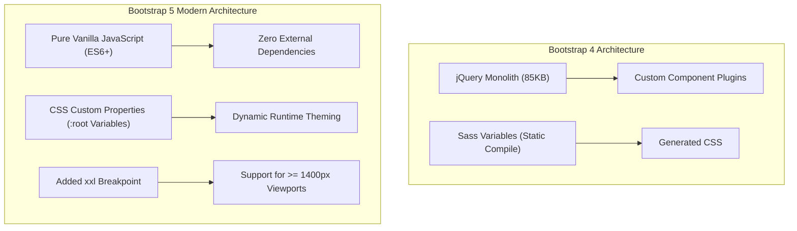

# Chapter 4: Bootstrap 5 Framework Architecture & Utility Engine

> **Course Title:** Full Stack Web Development (FSD)
> **Source Material:** `UNIT-2 Frontend Frameworks.docx`, `unit2code/`

---

## 1. Chapter Overview
Bootstrap 5 is an open-source, mobile-first front-end framework. This chapter covers:
- Architectural evolution: dropped jQuery dependency, CSS custom properties (`--bs-*`), and removal of IE support.
- CDN installation vs offline compiled production deployment.
- Subresource Integrity (SRI) security verification.
- The 6-tier container breakpoint step functions.
- The 12-column flexbox grid matrix, row mechanics, and gutter spacing (`g-*`, `gx-*`, `gy-*`).
- Master utility classes reference catalog (spacing, typography, colors, flexbox, borders, display, components).
- Edge cases and critical layout pitfalls.
- Live interactive Bootstrap 5 UI sandbox.

---

## 2. Bootstrap 5 Architectural Innovations



### Key Differences:
1. **Zero jQuery:** Rewritten in vanilla JavaScript for faster DOM execution.
2. **CSS Variables (`--bs-*`):** Custom properties on `:root` allow runtime theme adjustments.
3. **`xxl` Breakpoint ($1400\text{px}$):** Expanded layout support for ultra-wide displays.

---

## 3. Container Breakpoints & Grid System

### 3.1 Container Breakpoint Matrix

| Container Class | `xs` $<576\text{px}$ | `sm` $\ge 576\text{px}$ | `md` $\ge 768\text{px}$ | `lg` $\ge 992\text{px}$ | `xl` $\ge 1200\text{px}$ | `xxl` $\ge 1400\text{px}$ |
| :--- | :--- | :--- | :--- | :--- | :--- | :--- |
| `.container` | $100\%$ | $540\text{px}$ | $720\text{px}$ | $960\text{px}$ | $1140\text{px}$ | $1320\text{px}$ |
| `.container-fluid` | $100\%$ | $100\%$ | $100\%$ | $100\%$ | $100\%$ | $100\%$ |

---

### 3.2 12-Column Grid Matrix
Grid structure rule: $\text{Container} \to \text{Row} \to \text{Column}$.

```html
<div class="container">
  <div class="row g-3">
    <div class="col-12 col-md-4">Sidebar (col-md-4)</div>
    <div class="col-12 col-md-8">Main Content (col-md-8)</div>
  </div>
</div>
```

---

## 4. Master Bootstrap 5 Utility Classes Reference Catalog

- **Spacing:** `m-{0-5}`, `p-{0-5}`, `mt-3`, `mb-4`, `mx-auto`, `px-3`, `py-2`.
- **Colors:** `text-primary`, `text-success`, `text-danger`, `bg-dark`, `bg-light`, `bg-warning`.
- **Typography:** `.h1` through `.h6`, `.display-1` through `.display-6`, `.fw-bold`, `.fst-italic`, `.text-center`, `.text-truncate`.
- **Flexbox:** `.d-flex`, `.flex-row`, `.flex-column`, `.justify-content-between`, `.align-items-center`.
- **Borders:** `.border`, `.border-0`, `.border-primary`, `.rounded`, `.rounded-circle`, `.rounded-pill`.

---

## 5. Live Interactive UI Sandbox
Below is a live interactive Bootstrap 5 UI sandbox running directly in the browser via CDN.

```html
<iframe srcdoc='<!DOCTYPE html>
<html lang="en">
<head>
  <meta charset="utf-8">
  <meta name="viewport" content="width=device-width, initial-scale=1">
  <link href="https://cdn.jsdelivr.net/npm/bootstrap@5.3.0/dist/css/bootstrap.min.css" rel="stylesheet">
  <style>body { padding: 12px; background: #f8fafc; }</style>
</head>
<body>
  <div class="container-fluid">
    <div class="alert alert-primary d-flex align-items-center justify-content-between p-2 mb-3">
      <div><strong>Bootstrap 5 Live Engine</strong> — Interactive Flexbox & Grid Sandbox</div>
      <span class="badge bg-primary">v5.3 CDN</span>
    </div>

    <div class="row g-2 mb-3">
      <div class="col-12 col-md-4">
        <div class="card shadow-sm h-100">
          <div class="card-body">
            <h6 class="card-title text-primary fw-bold">Sidebar (col-md-4)</h6>
            <p class="card-text small text-muted">Adapts from 100% mobile to 4-column tablet/desktop slice.</p>
            <button class="btn btn-sm btn-outline-primary" onclick="alert(&quot;Bootstrap Action Triggered!&quot;)">Action Button</button>
          </div>
        </div>
      </div>
      <div class="col-12 col-md-8">
        <div class="card shadow-sm h-100">
          <div class="card-body">
            <h6 class="card-title text-success fw-bold">Data View (col-md-8)</h6>
            <table class="table table-sm table-striped mb-0">
              <thead><tr><th>#</th><th>Component</th><th>Class Pattern</th></tr></thead>
              <tbody>
                <tr><td>1</td><td>Container</td><td>.container-fluid</td></tr>
                <tr><td>2</td><td>Grid</td><td>.col-md-8</td></tr>
              </tbody>
            </table>
          </div>
        </div>
      </div>
    </div>
  </div>
</body>
</html>' width="100%" height="320" style="border: 1px solid #cbd5e1; border-radius: 8px; margin: 12px 0;" loading="lazy"></iframe>
```

---

## 6. Formula Sheet

- **Bootstrap 5 Piecewise Max-Width Function:**

$$
\text{Max Width}(w) = \begin{cases}
100\% & w < 576\text{px} \\
540\text{px} & 576\text{px} \le w < 768\text{px} \\
720\text{px} & 768\text{px} \le w < 992\text{px} \\
960\text{px} & 992\text{px} \le w < 1200\text{px} \\
1140\text{px} & 1200\text{px} \le w < 1400\text{px} \\
1320\text{px} & w \ge 1400\text{px}
\end{cases}
$$

---

## 7. Definition Sheet

1. **Bootstrap 5:** An open-source, mobile-first front-end CSS framework providing grid systems and components.
2. **Subresource Integrity (SRI):** A browser security feature verifying CDN resource cryptographic hashes.
3. **Gutter:** The padding space separating adjacent columns within a Bootstrap grid row.

---

## 8. Exam-Oriented Review

1. Describe the key architectural changes introduced in Bootstrap 5 compared to Bootstrap 4.
2. Detail the 6 container breakpoints and explain how `.col-12.col-md-6` behaves across screen widths.
3. Explain the negative horizontal margin behavior of `.row` and why placing a row outside a container causes horizontal scrollbars.
