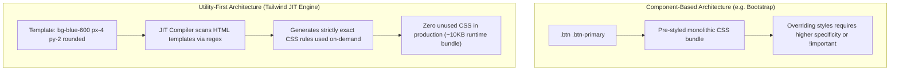

# Chapter 5: Tailwind CSS — Utility-First Engine & Exhaustive Class Catalog

> **Course Title:** Full Stack Web Development (FSD)
> **Source Material:** `UNIT-2 Frontend Frameworks.docx`, `unit2code/`

---

## 1. Chapter Overview
Tailwind CSS is an atomic, utility-first CSS framework. This chapter provides an exhaustive reference covering:
- Philosophy & architecture: Utility-First vs Component-Based CSS.
- Just-In-Time (JIT) compilation engine and CSS purging mechanics.
- Spacing scale linear equation ($\text{Dimension} = n \times 4\text{px}$).
- Exhaustive class catalog: sizing, typography, color palettes ($50-950$), flex/grid layouts, borders, shadows, and filter effects.
- Responsive prefixes (`sm:`, `md:`, `lg:`, `xl:`, `2xl:`) and state variants (`hover:`, `focus:`, `group-hover:`, `dark:`).
- Square bracket arbitrary value syntax (`w-[350px]`, `bg-[#10b981]`).
- Live interactive Tailwind CSS UI sandbox.

---

## 2. Architecture: Utility-First vs Component-Based CSS



---

## 3. Spacing Scale & Class Catalog

### 3.1 Spacing Scale
Formula: $\text{Dimension (in px)} = n \times 4\text{px} = n \times 0.25\text{rem}$ (for $1\text{rem} = 16\text{px}$).

| Key ($n$) | rem Equivalent | Pixel Value | Available Classes |
| :--- | :--- | :--- | :--- |
| `0` | `0rem` | `0px` | `p-0`, `m-0`, `gap-0` |
| `0.5` | `0.125rem` | `2px` | `p-0.5`, `m-0.5` |
| `1` | `0.25rem` | `4px` | `p-1`, `m-1`, `gap-1`, `space-x-1` |
| `1.5` | `0.375rem` | `6px` | `p-1.5`, `m-1.5` |
| `2` | `0.5rem` | `8px` | `p-2`, `m-2`, `gap-2`, `space-x-2` |
| `2.5` | `0.625rem` | `10px` | `p-2.5`, `m-2.5` |
| `3` | `0.75rem` | `12px` | `p-3`, `m-3`, `gap-3` |
| `4` | `1.0rem` | `16px` | `p-4`, `m-4`, `gap-4`, `space-x-4` |
| `6` | `1.5rem` | `24px` | `p-6`, `m-6`, `gap-6` |
| `8` | `2.0rem` | `32px` | `p-8`, `m-8`, `gap-8` |
| `12` | `3.0rem` | `48px` | `p-12`, `m-12` |
| `16` | `4.0rem` | `64px` | `p-16`, `m-16` |
| `24` | `6.0rem` | `96px` | `p-24`, `m-24` |

---

### 3.2 Typography & Color Palettes
- **Typography Sizes:** `text-xs` ($12\text{px}$), `text-sm` ($14\text{px}$), `text-base` ($16\text{px}$), `text-lg` ($18\text{px}$), `text-xl` ($20\text{px}$), `text-2xl` ($24\text{px}$), `text-3xl` ($30\text{px}$), `text-4xl` ($36\text{px}$), `text-5xl` ($48\text{px}$).
- **Font Weight:** `font-light` (300), `font-normal` (400), `font-medium` (500), `font-semibold` (600), `font-bold` (700), `font-extrabold` (800).
- **Color Shades:** Available across `slate`, `gray`, `red`, `amber`, `emerald`, `cyan`, `blue`, `indigo`, `purple`, `rose` across shades `50, 100, 200, 300, 400, 500, 600, 700, 800, 900, 950`.
- **Flex & Grid:** `flex`, `flex-col`, `items-center`, `justify-between`, `grid`, `grid-cols-1`, `md:grid-cols-3`, `gap-4`.
- **Filters & Effects:** `shadow-md`, `rounded-xl`, `hover:scale-105`, `transition-all`, `duration-300`, `blur-sm`, `grayscale`.

---

## 4. Live Interactive UI Sandbox

```html
<iframe srcdoc='<!DOCTYPE html>
<html lang="en">
<head>
  <meta charset="utf-8">
  <meta name="viewport" content="width=device-width, initial-scale=1">
  <script src="https://cdn.tailwindcss.com"></script>
</head>
<body class="bg-slate-100 p-4 font-sans text-slate-800">
  <div class="max-w-md mx-auto space-y-4">
    <div class="bg-gradient-to-r from-cyan-500 to-blue-600 p-4 rounded-xl shadow-lg text-white flex items-center justify-between">
      <div>
        <h2 class="text-lg font-bold tracking-tight">Tailwind CSS Live Engine</h2>
        <p class="text-xs text-cyan-100">Utility-first styling compiled on-the-fly</p>
      </div>
      <span class="bg-white/20 px-2 py-0.5 rounded-full text-xs font-semibold">CDN JIT</span>
    </div>

    <div class="bg-white p-4 rounded-lg shadow border border-slate-200">
      <h3 class="font-semibold text-slate-900 text-sm mb-1">Hover Filter Effects</h3>
      <p class="text-xs text-slate-500 mb-3">Hover over the gradient box to trigger scale transition:</p>
      <div class="h-16 w-full bg-gradient-to-r from-emerald-400 to-teal-500 rounded-md flex items-center justify-center text-white text-xs font-bold transition-all duration-300 hover:scale-105 cursor-pointer">
        Hover To Scale (+5%)
      </div>
    </div>
  </div>
</body>
</html>' width="100%" height="280" style="border: 1px solid #cbd5e1; border-radius: 8px; margin: 12px 0;" loading="lazy"></iframe>
```

---

## 5. Formula Sheet

- **Tailwind CSS Spacing Dimension Formula:**

$$
\text{Dimension (px)} = n \times 4\text{px} \quad (n \in \mathbb{N} \cup \{0.5, 1.5, 2.5, 3.5\})
$$

---

## 6. Definition Sheet

1. **Tailwind CSS:** An atomic, utility-first CSS framework designed for building custom user interfaces directly in markup.
2. **Just-In-Time (JIT) Compiler:** A compilation engine scanning template files at build time to output only used CSS rules.
3. **Arbitrary Value Syntax:** Square bracket escape syntax (e.g. `w-[350px]`) allowing custom values without leaving markup.

---

## 7. Exam-Oriented Review

1. Explain the architectural difference between utility-first CSS and component-based CSS frameworks.
2. Calculate the exact pixel dimensions applied by `p-6` and `mb-2.5` in Tailwind CSS.
3. Describe the purpose of JIT compilation and how it prevents bloated CSS production bundles.
