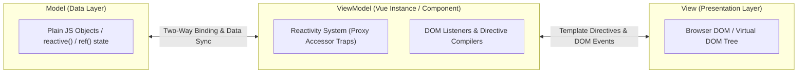

# Chapter 6: Vue.js — Reactive Directives, MVVM & Lifecycle Architecture

> **Course Title:** Full Stack Web Development (FSD)
> **Source Material:** `UNIT-2 Frontend Frameworks.docx`, `unit2code/`

---

## 1. Chapter Overview
Vue.js is a progressive JavaScript framework for building user interfaces. This chapter covers:
- MVVM (Model-View-ViewModel) architecture and Single Page Application (SPA) paradigms.
- Complete reference catalog of all 15 built-in directives (`v-bind`, `v-model`, `v-for`, `v-if`, `v-show`, `v-html`, etc.).
- Directives modifiers: event modifiers (`.prevent`, `.stop`), form modifiers (`.lazy`, `.number`, `.trim`), and keyboard modifiers.
- Custom directives deep dive across Vue 2 and Vue 3 lifecycle hooks (`mounted`, `updated`, `unmounted`).
- Options API vs Composition API (`createApp`, `setup`, `ref`, `computed`).
- Reactive state management with worked shopping cart implementations.
- Live interactive Vue 3 shopping cart UI sandbox.

---

## 2. MVVM Architecture & Vue Reactivity Engine



---

## 3. Master Catalog of Vue Built-In Directives

| Directive | Shorthand | Value / Expression | Functional Behavior |
| :--- | :--- | :--- | :--- |
| `v-text` | None | `string` | Updates element `textContent`; escapes HTML tags automatically. |
| `v-html` | None | `string` | Updates element `innerHTML`; renders raw HTML strings (XSS hazard). |
| `v-show` | None | `boolean` | Toggles CSS `display: none`; element remains mounted in DOM tree. |
| `v-if` | None | `boolean` | Conditionally mounts or destroys element and children from DOM. |
| `v-else-if`| None | `boolean` | Denotes "else if" branch for preceding `v-if`. |
| `v-else` | None | Flag | Denotes "else" fallback branch for preceding `v-if`. |
| `v-for` | None | Array / Object / Number | Iteratively clones element tree. Syntax: `(item, index) in items`. Requires `:key`. |
| `v-on` | `@` | Handler Function | Attaches DOM event listeners (`@click="handleClick"`). |
| `v-bind` | `:` | Attribute Expression | Dynamically binds attributes (`:src="imgUrl"`, `:class="{ active: isActive }"`). |
| `v-model` | None | Reactive Variable | Creates bidirectional two-way data binding on form controls. |
| `v-slot` | `#` | Slot Name | Configures named or scoped slot content. |
| `v-pre` | None | Flag | Skips template compilation for uncompiled mustache tags `{{ }}` display. |
| `v-cloak` | None | Flag | Remains until compilation finishes; hides uncompiled templates. |
| `v-once` | None | Flag | Renders element once; ignores subsequent reactive state updates. |
| `v-memo` | None | Dependency Array | Memoizes sub-tree rendering based on dependency array mutation (Vue 3.2+). |

---

## 4. Custom Directives: Lifecycle Hooks & Worked Code

### 4.1 Custom Directives Lifecycle Hooks (Vue 3)
- `created`: Called before element attributes or event listeners are applied.
- `beforeMount`: Called when directive is bound, but before element is mounted in DOM.
- `mounted`: **Most common hook**; called once element is mounted into parent DOM.
- `updated`: Called after containing component and child VNodes have re-rendered.
- `unmounted`: Called once directive is unbound and element unmounted.

---

### 4.2 Worked Implementation: Localized Date Formatting Directive (`v-format-date`)
```javascript
const app = Vue.createApp({
  data() {
    return {
      orderTimestamp: '2026-09-03T11:45:00Z'
    };
  }
});

app.directive('format-date', {
  mounted(el, binding) {
    const dateObj = new Date(binding.value);
    const formatted = new Intl.DateTimeFormat('en-US', {
      year: 'numeric', month: 'long', day: 'numeric'
    }).format(dateObj);
    el.textContent = formatted;
    el.style.color = '#0284c7';
    el.style.fontWeight = '600';
  }
});

app.mount('#app');
```

---

## 5. Live Interactive UI Sandbox: Vue 3 Shopping Cart
Below is a live interactive Vue 3 reactive shopping cart running directly via CDN.

```html
<iframe srcdoc='<!DOCTYPE html>
<html lang="en">
<head>
  <meta charset="utf-8">
  <meta name="viewport" content="width=device-width, initial-scale=1">
  <script src="https://unpkg.com/vue@3/dist/vue.global.js"></script>
  <style>
    body { font-family: system-ui, sans-serif; margin: 0; padding: 14px; background: #f8fafc; color: #1e293b; }
    .cart-card { background: white; border-radius: 8px; padding: 14px; border: 1px solid #cbd5e1; box-shadow: 0 2px 4px rgba(0,0,0,0.05); }
    .item-row { display: flex; align-items: center; justify-content: space-between; padding: 8px 0; border-bottom: 1px solid #f1f5f9; }
    .btn-qty { background: #e2e8f0; border: none; width: 26px; height: 26px; border-radius: 4px; font-weight: bold; cursor: pointer; }
    .btn-qty:hover { background: #cbd5e1; }
    .summary-box { margin-top: 12px; padding: 10px; background: #f0f9ff; border-radius: 6px; border: 1px solid #bae6fd; font-weight: 600; }
  </style>
</head>
<body>
  <div id="app" class="cart-card">
    <h3 style="margin-top:0; color:#0284c7;">Vue 3 Live Reactive Cart Engine</h3>
    <div v-for="item in items" :key="item.id" class="item-row">
      <div>
        <div style="font-weight: 600;">{{ item.name }}</div>
        <div style="font-size: 12px; color: #64748b;">${{ item.price.toFixed(2) }} each</div>
      </div>
      <div style="display: flex; align-items: center; gap: 8px;">
        <button class="btn-qty" @click="item.quantity > 0 ? item.quantity-- : 0">-</button>
        <span style="font-weight: 700; width: 20px; text-align: center;">{{ item.quantity }}</span>
        <button class="btn-qty" @click="item.quantity++">+</button>
        <span style="font-weight: 600; width: 65px; text-align: right;">${{ (item.price * item.quantity).toFixed(2) }}</span>
      </div>
    </div>

    <div class="summary-box">
      <div style="display:flex; justify-content:space-between; font-size:13px; color:#475569;">
        <span>Subtotal:</span><span>${{ subtotal.toFixed(2) }}</span>
      </div>
      <div style="display:flex; justify-content:space-between; font-size:15px; color:#0369a1; border-top:1px solid #bae6fd; padding-top:4px; margin-top:4px;">
        <span>Grand Total (Inc. 8% Tax):</span><span>${{ (subtotal * 1.08).toFixed(2) }}</span>
      </div>
    </div>
  </div>

  <script>
    const { createApp, ref, computed } = Vue;
    createApp({
      setup() {
        const items = ref([
          { id: 1, name: "Vue 3 Course Guide", price: 29.99, quantity: 1 },
          { id: 2, name: "Bootstrap 5 UI Kit", price: 45.00, quantity: 2 },
          { id: 3, name: "Tailwind Component Pack", price: 39.50, quantity: 1 }
        ]);
        const subtotal = computed(() => {
          return items.value.reduce((sum, item) => sum + (item.price * item.quantity), 0);
        });
        return { items, subtotal };
      }
    }).mount("#app");
  </script>
</body>
</html>' width="100%" height="360" style="border: 1px solid #cbd5e1; border-radius: 8px; margin: 12px 0;" loading="lazy"></iframe>
```

---

## 6. Formula Sheet

- **Vue 3 Proxy Reactivity Dependency Tracking:**

$$
\text{Proxy Trap}: \quad \text{get}(target, prop) \implies \text{track}(target, prop)
$$

$$
\text{Proxy Trap}: \quad \text{set}(target, prop, val) \implies \text{trigger}(target, prop)
$$

---

## 7. Definition Sheet

1. **MVVM (Model-View-ViewModel):** An architectural pattern separating user interface presentation from data models via a dynamic reactivity layer.
2. **Directive:** A specialized attribute prefixed with `v-` instructing Vue to apply dynamic DOM manipulations.
3. **Composition API:** A function-based component API in Vue 3 that organizes code logic around feature domains using reactive primitives (`ref`, `reactive`, `setup`).

---

## 8. Exam-Oriented Review

1. Compare `v-if` and `v-show` in terms of DOM mounting cost and toggle performance.
2. Explain the priority reversal of `v-if` and `v-for` between Vue 2 and Vue 3.
3. Detail the custom directive lifecycle hooks in Vue 3 (`created`, `mounted`, `updated`, `unmounted`).
