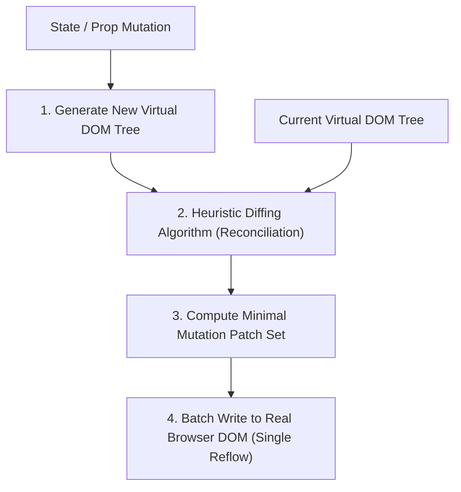

# Chapter 7: React.js — Virtual DOM, Component Architecture & Hooks

> **Course Title:** Full Stack Web Development (FSD)
> **Source Material:** `UNIT-2 Frontend Frameworks.docx`, `unit2code/`

---

## 1. Chapter Overview
React is a declarative, component-driven JavaScript library for building user interfaces. This chapter provides an exhaustive reference covering:
- The Virtual DOM (VDOM) reconciliation engine and $O(n)$ heuristic diffing mechanics.
- Real DOM vs Virtual DOM comprehensive performance comparison matrix.
- React elements vs components; functional components vs class components.
- State management (`useState`) and side effect lifecycles (`useEffect` dependency matrix).
- Asynchronous REST API data fetching with error handling and request cancellation (`AbortController`).
- Edge cases: stale closures, asynchronous race conditions, and referential equality bugs.
- Live interactive Virtual DOM simulation sandbox.

---

## 2. Virtual DOM & Reconciliation Engine



### 2.1 Heuristic Diffing Assumptions
Classical minimum tree edit distance algorithms operate at $O(n^3)$ time complexity. React reduces this to $O(n)$ using two key heuristics:
1. **Different Element Types:** Two elements of different types produce completely different trees; React tears down the old tree and builds the new tree from scratch.
2. **Stable Keys:** Developers hint which child elements remain stable across re-renders using a unique `key` prop.

---

### 2.2 Real DOM vs Virtual DOM Comparison Matrix

| Architectural Dimension | Real Browser DOM | React Virtual DOM |
| :--- | :--- | :--- |
| **Data Structure** | Heavy C++ browser internal tree representation of HTML document. | Lightweight plain JavaScript object in heap memory (`{ type, props, children }`). |
| **Update Mechanism** | Direct mutation causes layout recalculations, reflows, and repaints. | In-memory tree comparison; real DOM is mutated only for changed nodes. |
| **Performance Impact** | Slow on frequent updates; $O(n)$ real DOM mutations cause dropped frames. | High throughput via batched updates and $O(n)$ heuristic diffing. |
| **Platform Portability**| Locked exclusively to browser web rendering engines. | Platform agnostic (can render to Web, Mobile via React Native, or SSR). |

---

## 3. React Hooks Engine (`useState` & `useEffect`)

### 3.1 State Management: `useState`
```javascript
import React, { useState } from 'react';

function Counter() {
  const [count, setCount] = useState(0);

  // Functional state update prevents stale closure bugs
  const increment = () => setCount(prevCount => prevCount + 1);

  return (
    <button onClick={increment}>Count: {count}</button>
  );
}
```

---

### 3.2 Side Effect Management: `useEffect` Dependency Matrix

| Dependency Array Argument | Execution Timing in Lifecycle | Purpose / Role |
| :--- | :--- | :--- |
| `useEffect(() => { ... })` *(No array)* | Runs after **every** single render (mount + updates). | Logging, unrestricted observers. |
| `useEffect(() => { ... }, [])` *(Empty array)* | Runs **once only** after initial DOM mount. | Data fetching, event listener setup. |
| `useEffect(() => { ... }, [propA, stateB])` | Runs on mount and whenever `propA` or `stateB` change value. | Reactive side-effects triggered by state mutations. |
| `return () => { ... }` *(Cleanup function)* | Runs before re-executing effect and immediately prior to unmount. | Listener detachment, request cancellation (`AbortController`). |

---

## 4. Asynchronous REST API Data Fetching Pattern

```javascript
import React, { useState, useEffect } from 'react';

function UserList() {
  const [users, setUsers] = useState([]);
  const [loading, setLoading] = useState(true);
  const [error, setError] = useState(null);

  useEffect(() => {
    const controller = new AbortController();

    async function fetchUsers() {
      try {
        setLoading(true);
        const response = await fetch('https://jsonplaceholder.typicode.com/users', {
          signal: controller.signal
        });

        if (!response.ok) {
          throw new Error(`HTTP Error: Status ${response.status}`);
        }

        const data = await response.json();
        setUsers(data);
        setError(null);
      } catch (err) {
        if (err.name !== 'AbortError') {
          setError(err.message);
        }
      } finally {
        setLoading(false);
      }
    }

    fetchUsers();

    return () => controller.abort(); // Cancels in-flight network request on unmount
  }, []);

  if (loading) return <div>Loading records...</div>;
  if (error) return <div>Error: {error}</div>;

  return (
    <ul>
      {users.map(user => (
        <li key={user.id}>{user.name} ({user.email})</li>
      ))}
    </ul>
  );
}

export default UserList;
```

---

## 5. Live Interactive UI Sandbox: React VDOM Simulation

```html
<iframe srcdoc='<!DOCTYPE html>
<html lang="en">
<head>
  <meta charset="utf-8">
  <meta name="viewport" content="width=device-width, initial-scale=1">
  <style>
    body { font-family: system-ui, sans-serif; margin: 0; padding: 14px; background: #f8fafc; color: #1e293b; }
    .app-card { background: white; border-radius: 8px; padding: 14px; border: 1px solid #cbd5e1; box-shadow: 0 2px 4px rgba(0,0,0,0.05); }
    .search-input { width: 100%; box-sizing: border-box; padding: 8px 12px; border: 1px solid #cbd5e1; border-radius: 6px; margin-bottom: 12px; font-size: 14px; }
    .user-item { padding: 8px 12px; border: 1px solid #e2e8f0; border-radius: 6px; margin-bottom: 6px; display: flex; justify-content: space-between; align-items: center; }
    .badge { padding: 2px 8px; border-radius: 9999px; font-size: 11px; font-weight: 600; background: #e0f2fe; color: #0369a1; }
  </style>
</head>
<body>
  <div class="app-card">
    <h3 style="margin-top:0; color:#0f172a;">React Virtual DOM Reconciliation Simulation</h3>
    <input type="text" id="searchBox" class="search-input" placeholder="Filter users in real-time..." oninput="handleSearch()">
    <div id="userContainer"></div>
  </div>

  <script>
    const mockUsers = [
      { id: 1, name: "Leanne Graham", role: "Engineering Lead" },
      { id: 2, name: "Ervin Howell", role: "Frontend Architect" },
      { id: 3, name: "Clementine Bauch", role: "UI/UX Designer" },
      { id: 4, name: "Patricia Lebsack", role: "DevOps Engineer" },
      { id: 5, name: "Chelsey Dietrich", role: "Full Stack Developer" }
    ];

    function render(users) {
      const container = document.getElementById("userContainer");
      container.innerHTML = "";
      if (users.length === 0) {
        container.innerHTML = "<p style=&quot;color:#94a3b8; font-size:13px;&quot;>No matching users found in Virtual DOM.</p>";
        return;
      }
      users.forEach(u => {
        const div = document.createElement("div");
        div.className = "user-item";
        div.innerHTML = "<div><strong>" + u.name + "</strong></div><span class=&quot;badge&quot;>" + u.role + "</span>";
        container.appendChild(div);
      });
    }

    function handleSearch() {
      const query = document.getElementById("searchBox").value.toLowerCase();
      const filtered = mockUsers.filter(u => u.name.toLowerCase().includes(query));
      render(filtered);
    }

    render(mockUsers);
  </script>
</body>
</html>' width="100%" height="340" style="border: 1px solid #cbd5e1; border-radius: 8px; margin: 12px 0;" loading="lazy"></iframe>
```

---

## 6. Formula Sheet

- **Tree Reconciliation Algorithmic Complexity Reduction:**

$$
\text{Levenshtein Tree Edit Distance} = O(n^3) \xrightarrow[\text{Keys + Distinct Types}]{\text{React Heuristics}} O(n)
$$

---

## 7. Definition Sheet

1. **Virtual DOM:** An in-memory JavaScript object representation of the real browser Document Object Model used for high-efficiency diffing and minimal paint operations.
2. **Reconciliation:** The recursive algorithmic process where React compares two Virtual DOM trees and computes the minimal patch set required to update the DOM.
3. **Stale Closure:** A JavaScript closure issue in asynchronous callbacks or hooks where a function captures an outdated snapshot of state variables from a previous render cycle.

---

## 8. Exam-Oriented Review

1. Explain the Virtual DOM reconciliation algorithm and how React reduces diffing complexity from $O(n^3)$ to $O(n)$.
2. Contrast `useState` direct mutations versus functional update callbacks (`setCount(prev => prev + 1)`).
3. Describe the purpose of the `useEffect` cleanup function and write a snippet using `AbortController` to handle fetch cancellations.
