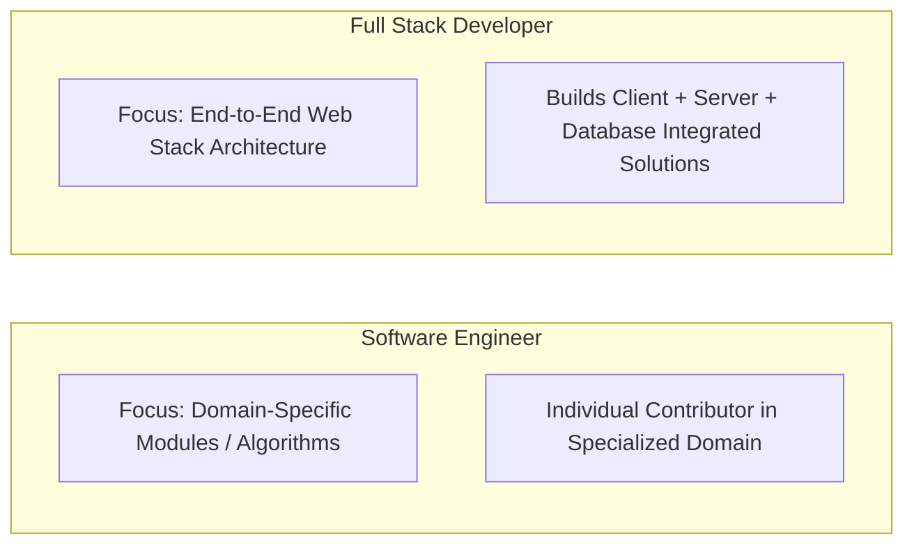
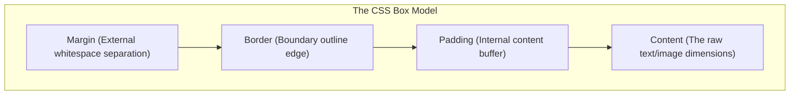
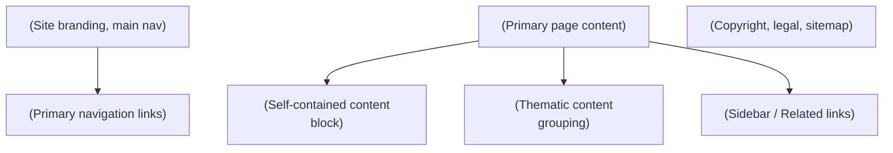
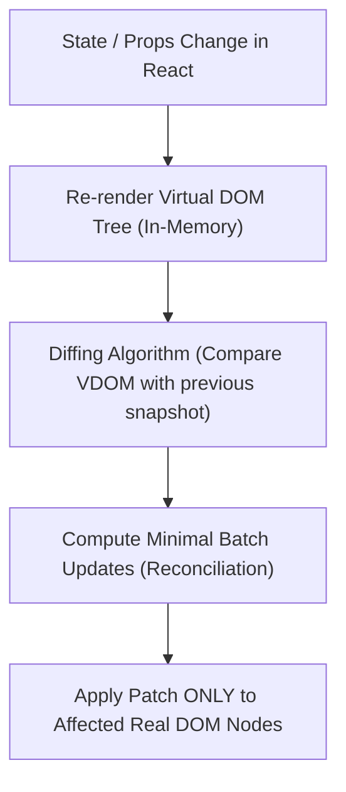

# Full Stack Web Development

**Course:** Full Stack Web Development (FSD)  
**Source Material:** `UNIT-1 Full Stack Development Basics.docx`, `UNIT-1 Full Stack Development Basics.pdf`, `UNIT-2 Frontend Frameworks.docx`  
**Generated Date:** August 09, 2026  

---

# Chapter 1 — Full Stack Basics

## Source map
- `UNIT-1 Full Stack Development Basics.docx` — primary faculty lecture notes.
- `UNIT-1 Full Stack Development Basics.pdf` — secondary reference slides.

---

## 1. Chapter Overview
Unit 1 provides the structural, architectural, and protocol foundation for web application engineering. It spans:
- Core concepts of Full Stack Web Development and role responsibilities.
- Comparative analysis of Front-End, Back-End, and Full Stack engineers.
- Software Engineering vs. Full Stack Development distinctions.
- 3-Tier Enterprise Architecture rules, layer boundary constraints, and decoupled communication.
- Web Development Stacks (LAMP, MEAN, MERN, Ruby on Rails, Django, Spring Boot, Serverless, Flutter/React Native cross-platform).
- JavaScript Object Notation (JSON): syntax rules, data types, nested/multidimensional structures, parsing efficiency, and comment workarounds.
- REpresentational State Transfer (REST) Architecture: 6 architectural constraints, client-server decoupling, statelessness, cacheability, uniform interface, HATEOAS.
- RESTful HTTP Protocol Operations: HTTP Verbs (GET, POST, PUT, DELETE), MIME Types & Accept headers, URI Path design conventions, Response Content-Types, and Standard HTTP Status Codes.

---

## 2. Fundamental Concepts & Terminology

### 2.1 Full Stack Development Defined
A **Full Stack Developer** possesses comprehensive domain knowledge across the entire technology stack—from client-side user interface rendering to server-side business logic, API definition, database administration, and deployment architecture.

> **Role Responsibilities:**
> 1. Technology Evaluation: Selecting client-side and server-side stack components during early project phases.
> 2. Stack Implementation: Writing clean, maintainable code adhering to stack-specific best practices.
> 3. Cross-Disciplinary Knowledge: Maintaining currency with emerging frameworks, databases, and DevOps tools.
> 4. Agile Team Contribution: Serving as versatile, high-velocity engineering nodes in cross-functional Agile environments.

[Source: `UNIT-1 Full Stack Development Basics.docx`, Section 1]

---

### 2.2 Role Comparison

| Feature / Dimension | Front-End Developer | Back-End Developer | Full Stack Developer |
| :--- | :--- | :--- | :--- |
| **Primary Focus** | User Interface (UI), User Experience (UX), Visual Layout, Navigation, Client-Side Interactivity. | Business Logic, Security, Data Management, Database Querying, Request Handling, Scalability. | End-to-End Workflow Execution (Client + Server + Database + API). |
| **Core Technologies** | HTML5, CSS3, JavaScript (ES6+), React, Vue, Angular, Bootstrap, Tailwind. | Node.js, Python, Java, Ruby, PHP, C#/.NET, Express, Django, Spring Boot. | Full Stacks (MERN, MEAN, LAMP, RoR, Serverless) spanning front-end & back-end. |
| **Data Handling** | Manipulates DOM, renders JSON payloads received from server APIs. | Constructs APIs, interacts directly with DBMS (SQL/NoSQL), manages state persistence. | Manages data modeling, API payload construction, and DOM presentation. |
| **System Visibility** | Client browser engine / web runtime. | Server environment / OS / Cloud container / Database. | Complete application topology. |

[Source: `UNIT-1 Full Stack Development Basics.docx`, Section 1]

---

### 2.3 SE vs. FSD



- **Software Engineer:** Broad engineering title. Typically focuses deeply on specialized individual modules, system components, algorithms, low-level OS drivers, or single-tier infrastructure.
- **Full Stack Developer:** Web engineering specialization. Responsible for delivering functional end-to-end applications across all layers (Presentation, Logic, Database).

---

### 2.4 Trade-Off Analysis

#### Advantages:
1. **End-to-End Ownership:** Deep architectural insight into the entire software lifecycle.
2. **Cost & Time Efficiency:** Reduces communication overhead and team size requirement for small-to-medium builds.
3. **Rapid Debugging:** Faster issue isolation across API layer boundaries.
4. **Agile Versatility:** Smooth task-switching between front-end UI and back-end services in sprint cycles.
5. **Entrepreneurial Autonomy:** Enables solo prototyping, SaaS MVP creation, and site monetization.

#### Disadvantages:
1. **Jack-of-all-trades Risk:** Breadth of knowledge can lead to reduced depth compared to specialized backend or database engineers.
2. **Key Person Dependency:** Over-reliance on a single developer creates severe single-point-of-failure risks.
3. **Cognitive Overhead:** Rapid shifts across multiple paradigms (CSS, SQL, Async JS, DevOps) increase defect likelihood.

[Source: `UNIT-1 Full Stack Development Basics.docx`, Section 1]

---

## 3. The 3-Tier Architecture

### 3.1 Structural Architecture
The 3-Tier Architecture cleanly segregates software application code into three distinct, decoupled tiers.

```mermaid
flowchart TD
    Client["Client / User Interface"] <--> Presentation["&quot;Presentation Tier (UI Layer)\n[HTML, CSS, JS, Frameworks"]"]
    Presentation <--> Business["&quot;Business Tier (Logic Layer)\n[Node.js, Express, Python, Java"]"]
    Business <--> DataAccess["&quot;Data Access Tier (DAL)\n[SQL DDL/DML, ORM, MongoDB Driver"]"]
    DataAccess <--> Database["(&quot;Database Tier (DBMS)\n[MySQL, PostgreSQL, MongoDB"]")]
```

### 3.2 Rules of 3-Tier Architecture
1. **Absolute Layer Isolation:** Code belonging to a tier must reside exclusively inside that tier's files.
2. **Strict Cascade Communication:**
   - Presentation Tier talks **only** to Business Tier. It is strictly prohibited from touching the Data Access Tier or Database directly.
   - Business Tier talks **only** to Presentation Tier (upstream) and Data Access Tier (downstream). It cannot execute raw DB operations directly.
   - Data Access Tier talks **only** to Business Tier (upstream) and the specific DBMS engine (downstream).
3. **Decoupled Agnosticism:**
   - The Business Tier must be **Database-Agnostic** (unaware of whether SQL or NoSQL stores data) and **Presentation-Agnostic** (unaware if output is HTML, JSON, PDF, or CSV).
4. **Granular Multi-Component Structure:**
   - Presentation Tier: A dedicated controller/view component per user transaction.
   - Business Tier: A dedicated business entity logic component per database entity.
   - Data Access Tier: A dedicated Data Access Object (DAO) component per supported DBMS engine.

### 3.3 Skill Requirements per Tier

| Tier | Primary Purpose | Required Technical Skills |
| :--- | :--- | :--- |
| **Presentation Tier** | User interaction, visual rendering, input capture. | HTML5, CSS3, JavaScript, UI/UX Design, Frameworks (React, Vue, Angular). |
| **Business Tier** | Enforcing business rules, computational algorithms, access validation. | Core Server Languages (Node.js, Python, Java, PHP, C#), API Routing. |
| **Data Access Tier** | Executing CRUD transactions against persistent storage. | SQL (DDL/DML), Database Schema Design, Indexing, NoSQL Query APIs. |

[Source: `UNIT-1 Full Stack Development Basics.docx`, Section 2]

---

## 4. Web Stacks & Project Contexts

### 4.1 Comparative Stack Matrix

| Stack | Technology Breakdown | Ideal Project Context | Industry Adopters |
| :--- | :--- | :--- | :--- |
| **LAMP** | **L**inux, **A**pache, **M**ySQL, **P**HP | Low-cost, highly customizable e-commerce, content management systems (CMS). | Wikipedia, Yahoo, Etsy, WordPress, Magento, Shopify |
| **MEAN** | **M**ongoDB, **E**xpress.js, **A**ngular, **N**ode.js | Real-time collaborative enterprise suites, SPA web apps requiring strong TypeScript support. | Google, Microsoft, IBM, Amazon, Uber, PayPal, LinkedIn |
| **MERN** | **M**ongoDB, **E**xpress.js, **R**eact, **N**ode.js | Dynamic, highly interactive single-page web applications with real-time UI state re-rendering. | Meta (Facebook), Netflix, Airbnb, Tesla, Walmart, Uber |
| **Ruby on Rails** | Ruby Language + Rails Framework (MVC) | Rapid startup MVP prototyping, donation management, developer-friendly convention-over-configuration apps. | GitHub, Airbnb, Shopify, SlideShare, CrunchBase, Dribbble |
| **Django (Python)**| Python + Django Framework (MTV) | High-security enterprise internal portals, machine learning-driven web apps, data processing engines. | Instagram, Spotify, YouTube, Disqus, Bitbucket |
| **Java / Spring Boot**| Java + Spring Boot Framework | Large-scale, high-concurrency enterprise applications, banking, microservices architectures. | Amazon, Netflix, Google, Ebay, Enterprise Banking |
| **Serverless** | AWS Lambda / Azure Functions + DynamoDB / Serverless API | Personalized travel planning, event-driven web apps requiring auto-scaling with pay-per-use costing. | Serverless Startups, Cloud Native SaaS |
| **Flutter / React Native**| Cross-Platform Frameworks (Dart / JS) | Multi-platform on-demand mobile & web applications (food delivery, fitness tracking). | Instagram, Uber Eats, BMW, Alibaba |

[Source: `UNIT-1 Full Stack Development Basics.docx`, Section 3]

---

## 5. JavaScript Object Notation (JSON)

### 5.1 Definition & Properties
**Definition:** JSON (JavaScript Object Notation) is a lightweight, text-based, open standard format designed specifically for human-readable, language-independent data interchange.

> **Key Characteristics:**
> - **Language-Independent:** Built on a text interface supported by virtually all modern runtimes (JS, Python, C++, Java, etc.).
> - **Self-Describing:** Structures map directly onto common dictionary/hash-map structures.
> - **Open Standard:** Derived from standard JavaScript (ECMA-262), governed strictly by RFC 8259.

---

### 5.2 JSON vs. XML Comparison

| Evaluation Metric | JSON | XML |
| :--- | :--- | :--- |
| **Verbosity & Footprint** | Extremely compact; minimal syntax markers. | Verbose; requires dual-sided tags (`<tag></tag>`). |
| **Parsing Cost** | Fast; compiles instantly into native in-memory objects via `JSON.parse()`. | High; requires intensive DOM tree or SAX parsing. |
| **Supported Structures** | Objects (key-value), Arrays (indexed), Primitives. | Hierarchical trees, tags, attributes, entities. |
| **Native JS Integration** | Native; inherits syntax directly from JS object literals. | Requires manual XML parser/transformer overhead. |
| **Namespace Support** | None (managed via nested unique object keys). | Fully supported natively via XML namespaces (`xmlns`). |

---

### 5.3 Rigid JSON Syntax Rules & Constraints
JSON enforces strict syntactic constraints that differ from standard JavaScript objects. Violating these constraints results in parse failures:

1. **Keys Must Be Double-Quoted:** Object keys **must** be wrapped in double-quotes `""`. Unquoted keys or keys wrapped in single-quotes `''` are strictly invalid.
2. **String Values Must Be Double-Quoted:** All string literals must use double-quotes `""`. Single quotes `''` are illegal.
3. **No Trailing Commas:** A comma is strictly a separator. Placing a trailing comma after the final item in an array or final key-value pair in an object is invalid.
4. **No Native Comments:** Standard comments (`//` or `/* */`) are forbidden. Comment workarounds must use reserved descriptive string keys.
5. **No Special Numeric Values:** Standard numbers are valid, but NaN, Infinity, and -Infinity are forbidden in strict JSON payloads.
6. **No Functions or Undefined:** Complex JavaScript types like `undefined`, functions, symbol references, and standard instantiated objects (such as RegExp, Map, Set) are not allowed. Dates are not natively supported and must be formatted as ISO-8601 string representations.

---

### 5.4 Valid JSON Data Types

| Data Type | Formal Syntactic Rules | Valid Example |
| :--- | :---: | :--- |
| **String** | Double-quoted Unicode sequence. Escape characters (e.g., `\n`, `\t`, `\"`) are permitted. | `"name": "Sarah Jones"` |
| **Number** | Base-10 signed decimals, exponents (`e`/`E`). Octals and hexadecimals are forbidden. | `"gpa": 3.85`, `"count": -120`, `"limit": 2e4` |
| **Boolean** | Must be lowercase literal `true` or `false`. | `"isEnrolled": true` |
| **Null** | Represents a deliberate empty reference using lowercase literal `null`. | `"middleName": null` |
| **Object** | Nested collection of key-value pairs wrapped in `{}`. Each key must be a double-quoted string. | `{"deptId": 101, "name": "CS"}` |
| **Array** | Ordered sequence of JSON values enclosed in square brackets `[]`. Can hold mixed types. | `"scores": [98, 100, "Incomplete"]` |

[Source: `UNIT-1 Full Stack Development Basics.docx`, Table 1 & Section 4]

---

### 5.5 Comprehensive JSON Code Examples

#### A. Multi-tiered Nested JSON Object Example
```json
{
  "studentId": "FSD-2026-99",
  "name": "Jack",
  "active": true,
  "enrollmentDate": "2026-08-09T08:00:00Z",
  "gpa": 3.91,
  "contact": {
    "email": "jack@university.edu",
    "phone": null
  },
  "courses": [
    { "code": "CS101", "grade": "A" },
    { "code": "CS102", "grade": "A-" }
  ]
}
```

#### B. Multidimensional JSON Array Example
```json
[
  ["row0_col0", "row0_col1", "row0_col2"],
  ["row1_col0", "row1_col1", "row1_col2"]
]
```

#### C. Native Comment Workaround
```json
{
  "systemConfig": {
    "port": 8080,
    "_comment_port": "The development port must be aligned with environment settings.",
    "debugMode": false
  }
}
```

---

### 5.6 JSON API & Manipulation in JavaScript

#### A. Dot Notation vs. Bracket Notation Access
Once parsed into an in-memory JS Object, properties can be navigated using:
- **Dot Notation (`obj.prop`):** Cleanest syntax; restricted to valid JS identifiers (cannot start with numbers, contain hyphens or spaces).
- **Bracket Notation (`obj["prop"]`):** Supports arbitrary strings, variable lookups, and keys containing special characters.

```javascript
const response = {
  "user-id": 4091,
  "age": 21,
  "primary address": "123 Main St",
  "role_level": "Admin"
};

// Dot Notation
console.log(response.age);        // Output: 21
console.log(response.role_level); // Output: "Admin"

// Bracket Notation (Mandatory due to special characters/spaces)
console.log(response["user-id"]);         // Output: 4091
console.log(response["primary address"]); // Output: "123 Main St"

// Dynamic Variable Lookup
const propName = "age";
console.log(response[propName]);          // Output: 21
```

---

#### B. Direct Parsing vs. Serialization (The JSON API)
The global native `JSON` object coordinates serialization and deserialization in high-performance engines:

##### 1. `JSON.parse(text, reviver)`
- **Purpose:** Converts a valid serialized JSON string into an in-memory JavaScript object.
- **Error Handling:** Throws a `SyntaxError` if the string violates any rigid JSON rules. Wrapping in a `try...catch` block is an industry standard requirement to prevent app crashes.
- **Reviver Callback:** A transformer function applied to every key-value pair during parsing. Excellent for instantiating Date objects.

```javascript
const rawJson = '{"username":"Jack","joined":"2026-01-15T12:00:00.000Z"}';

try {
  // Parsing with reviver to instantiate real Dates automatically
  const parsedData = JSON.parse(rawJson, (key, value) => {
    if (key === "joined") return new Date(value);
    return value;
  });

  console.log(parsedData.joined instanceof Date); // Output: true
} catch (error) {
  if (error instanceof SyntaxError) {
    console.error("Malformed JSON payload received!", error.message);
  }
}
```

##### 2. `JSON.stringify(value, replacer, space)`
- **Purpose:** Serializes a live JavaScript data structure into a flat JSON string representation.
- **Handling of Non-JSON Types:**
  - `undefined`, Functions, and Symbols are **omitted** entirely when they reside in objects.
  - `undefined`, Functions, and Symbols are **converted to `null`** when they appear inside arrays.
- **Replacer Argument:** Either an array of allowed keys to preserve, or a custom filtering function.
- **Space Argument:** Adds whitespace, indentation, and newlines for readable "pretty-printing".

```javascript
const userRecord = {
  name: "Jack",
  tempToken: undefined,          // Omitted during stringify
  printProfile: function() { },  // Omitted during stringify
  tags: ["FSD", undefined, 99]   // undefined converted to null in array
};

// 1. Standard Stringify
const serialized = JSON.stringify(userRecord);
console.log(serialized);
// Output: '{"name":"Jack","tags":["FSD",null,99]}'

// 2. Stringify with Space parameter (2-space formatting indentation)
console.log(JSON.stringify(userRecord, null, 2));
/* Output:
{
  "name": "Jack",
  "tags": [
    "FSD",
    null,
    99
  ]
}
*/

// 3. Stringify with Replacer filter (only includes "name" key)
console.log(JSON.stringify(userRecord, ["name"]));
// Output: '{"name":"Jack"}'
```

---

### 5.7 Exam Twisters & Catching Bugs
Be alert to these common syntax bugs often targeted in technical exams:

| Malformed Fragment | Violation | Corrected JSON Version |
| :--- | :--- | :--- |
| `{ name: "Jack" }` | Keys must be double-quoted. | `{ "name": "Jack" }` |
| `{ "name": 'Jack' }` | String values cannot use single-quotes. | `{ "name": "Jack" }` |
| `[1, 2, 3, ]` | No trailing commas are allowed. | `[1, 2, 3]` |
| `{"id": 105, "desc": "Note" // comment}` | Comments are completely forbidden. | `{"id": 105, "desc": "Note"}` |
| `{"val": NaN}` | special floats (`NaN`, `Infinity`) are invalid. | `{"val": null}` or omit key. |

[Source: `UNIT-1 Full Stack Development Basics.docx`, Section 4]

---

## 6. REST Architecture

### 6.1 Architectural Definition
REST is an architectural style that defines constraints for building scalable, resilient, and stateless web services. Systems adhering to REST principles are termed **RESTful**.

---

### 6.2 The 6 Core Constraints of REST

```mermaid
flowchart TD
    C1["1. Client-Server Decoupling\n("UI isolated from Data Storage")"]
    C2["2. Statelessness\n("No client context saved on server")"]
    C3["3. Cacheability\n("Explicit response cache headers")"]
    C4["4. Uniform Interface\n("Resource URIs, Self-descriptive, HATEOAS")"]
    C5["5. Layered System\n("Client cannot tell if connected to end DB or proxy")"]
    C6["6. Code on Demand (Optional)\n("Executable code download like JS")"]
```

1. **Client-Server Separation:** Enforces complete boundary separation. The client handles presentation; the server manages storage and logic. Enables independent platform evolution.
2. **Statelessness:** Every request from client to server must contain **all** authentication credentials and contextual data needed to process it. The server stores no session state between requests.
3. **Cacheability:** Responses must explicitly declare whether they can be cached by clients/proxies (`Cache-Control`, `ETag`) to eliminate redundant round-trips.
4. **Uniform Interface:** Standardized interaction contract containing sub-constraints:
   - *Identification of Resources:* Unique URIs identify resources (`/customers/102`).
   - *Manipulation via Representations:* Resources are modified via JSON/XML payloads.
   - *Self-Descriptive Messages:* Headers explicitly describe payload metadata (e.g., `Content-Type`).
   - *HATEOAS (Hypermedia as the Engine of Application State):* Responses include dynamic hypermedia links guiding available client state transitions.
5. **Layered System:** Application topology can include intermediaries (load balancers, cache layers, API gateways) without client awareness.
6. **Code-on-Demand (Optional):** Servers can temporarily extend client functionality by transferring executable code (e.g., JavaScript scripts).

[Source: `UNIT-1 Full Stack Development Basics.docx`, Section 5]

---

## 7. REST HTTP Communications

### 7.1 HTTP Verbs (Operations on Resources)

| Verb | CRUD Mapping | Operational Behavior | Idempotent? | Safe? | Expected Success Code |
| :--- | :--- | :--- | :--- | :--- | :--- |
| **GET** | Read | Retrieves a specific resource or resource collection. | Yes | Yes | `200 OK` |
| **POST** | Create | Creates a new resource under a collection URI. | No | No | `201 CREATED` |
| **PUT** | Update / Replace | Replaces an existing resource or creates if non-existent. | Yes | No | `200 OK` |
| **DELETE**| Delete | Removes a specific resource by ID. | Yes | No | `204 NO CONTENT` |

*Note on Idempotency:* An operation is idempotent if executing it multiple identical times produces the exact same server state as executing it once.

---

### 7.2 Headers & MIME Types
The request `Accept` header indicates media types acceptable in response. The response `Content-Type` header informs the client of the returned payload format.

#### MIME Type Structure: `type/subtype`

```
  application/json
  └───┬───┘   └─┬──┘
    Type     Subtype
```

| Type Category | Commonly Used Subtypes |
| :--- | :--- |
| **Text** | `text/html`, `text/css`, `text/plain`, `text/csv` |
| **Application** | `application/json`, `application/xml`, `application/pdf`, `application/octet-stream` |
| **Image** | `image/png`, `image/jpeg`, `image/gif`, `image/webp` |
| **Audio / Video** | `audio/mpeg`, `audio/wav`, `video/mp4`, `video/ogg` |

#### Client-Server Handshake Trace Example:
- **Client Request:**
```http
GET /articles/23 HTTP/1.1
Host: api.example.com
Accept: text/html, application/json
```
- **Server Response:**
```http
HTTP/1.1 200 OK
Content-Type: application/json

{
  "id": 23,
  "title": "REST Architecture Deep Dive",
  "author": "FSD Expert"
}
```

---

### 7.3 REST URI Path Design Conventions
1. **Plural Naming:** Use plural nouns for collection resources (`/customers`, `/orders`).
2. **Hierarchical Nesting:** Show child resource ownership cleanly:
   - `GET /customers/223/orders/12` (Fetches Order #12 for Customer #223).
3. **Identifier Rules:**
   - Collection Requests (`POST /customers`): No ID appended; server generates ID.
   - Individual Resource Requests (`GET /customers/:id`, `DELETE /customers/:id`): Explicit ID appended.

---

### 7.4 Standard HTTP Response Status Codes

| Code Range | Category | Code & Name | Exam-Critical Definition |
| :--- | :--- | :--- | :--- |
| **2xx** | Success | `200 OK` | Standard response for successful GET, PUT, or PATCH. |
| | | `201 CREATED` | Request succeeded and a new resource was created (POST). |
| | | `204 NO CONTENT` | Request succeeded but response body is intentionally empty (DELETE). |
| **4xx** | Client Error | `400 BAD REQUEST` | Request syntax error, invalid parameters, or payload malformed. |
| | | `403 FORBIDDEN` | Client authenticated, but lacks permissions for resource. |
| | | `404 NOT FOUND` | Resource URI does not exist or has been deleted. |
| **5xx** | Server Error | `500 INTERNAL SERVER ERROR` | Unhandled server-side exception or runtime system crash. |

[Source: `UNIT-1 Full Stack Development Basics.docx`, Table 2 & Section 5]

---

# Chapter 2 — Frontend Frameworks & Modern Web UI

## Source map
- `UNIT-2 Frontend Frameworks.docx` — primary faculty lecture notes.

---

## 1. Chapter Overview
Unit 2 covers front-end web engineering, UI frameworks, responsive visual design, and SPA component architectures:
- Responsive Web Design (RWD) mechanics, Viewport configurations, Responsive Images, and Media Queries.
- HTML5 Semantic Elements, Media Tags (`<audio>`, `<video>`), Graphics Canvas, Drag-and-Drop APIs.
- Bootstrap 5 CSS Framework: Grid Layout system, Breakpoints, Container variants (`container`, `container-fluid`, `container-{breakpoint}`).
- Utility-First Styling with Tailwind CSS: Play CDN setup, utility class breakdowns, state pseudo-classes (`hover:`), transitions.
- Vue.js Core Architecture: Composition API (`createApp`, `ref`), custom directives (`v-uppercase`, `v-list`, `v-format-date`), DOM hooks.
- React.js Architecture: Virtual DOM vs. Real DOM reconciliation engine, JSX elements, Functional vs. Class Components, State Management hooks (`useState`), Side Effect hooks (`useEffect`), and async REST API integration.

---

## 2. HTML5 Foundations & Document Structure

HTML5 is the standard markup language for documents designed to be displayed in a web browser. It provides the semantically structured hierarchy that forms the backbone of all modern web applications.

### 2.1 HTML5 Document Skeleton & Metadata
Every valid HTML5 page begins with a document type declaration (`<!DOCTYPE html>`) followed by the structural element root and `head` metadata definitions:

```html
<!DOCTYPE html>
<html lang="en">
<head>
  <!-- Metadata & Character Encoding -->
  <meta charset="UTF-8">
  <meta name="description" content="Exam preparation and full-stack development reference notes.">
  <meta name="keywords" content="HTML5, CSS3, JavaScript, Bootstrap 5">
  <meta name="author" content="DeepLumiere">

  <!-- Responsive Viewport Mapping -->
  <meta name="viewport" content="width=device-width, initial-scale=1.0">

  <title>FSD Learning Portal</title>
  <link rel="icon" type="image/svg+xml" href="logo.svg">
  <link rel="stylesheet" href="stylesheets/extra.css">
</head>
<body>
  <h1>Welcome to Full Stack Development</h1>
  <p>Learn end-to-end web engineering.</p>
  <script src="app.js"></script>
</body>
</html>
```

* **`<!DOCTYPE html>`:** A mandatory preamble instructing standard compliance rendering (prevents "quirks mode").
* **`<html>`:** Root wrapper. The `lang` attribute specifies standard page localization for search engines and screen-readers.
* **`<head>`:** Keeps page characteristics, fonts, icons, search engine descriptions, and link tags; contents are not directly rendered inside the viewport.
* **`<body>`:** House for visual document contents and DOM elements.

---

### 2.2 List Structures in HTML5
HTML provides three main lists structures to group visual contents:

1. **Unordered Lists (`<ul>`):** Standard bulleted collections. Items wrap inside `<li>` nodes.
2. **Ordered Lists (`<ol>`):** Sequential lists. Supporting helper attributes:
   - `type`: Control numbering styles (`1` standard, `a`/`A` alphabetical, `i`/`I` roman numerals).
   - `start`: Sets custom integer sequence offset (e.g., `<ol start="5">`).
   - `reversed`: Boolean flag; flips list numbering order downwards.
3. **Description Lists (`<dl>`):** Dictionary lists matching dynamic terms (`<dt>`) to corresponding description nodes (`<dd>`).

```html
<!-- Unordered List -->
<ul>
  <li>MERN Stack</li>
  <li>LAMP Stack</li>
</ul>

<!-- Ordered List with Roman numerals starting at V -->
<ol type="I" start="5">
  <li>Database Schema Draft</li>
  <li>API Interface Specs</li>
</ol>

<!-- Description List -->
<dl>
  <dt>JSON</dt>
  <dd>Lightweight, text-based data interchange standard.</dd>
  <dt>REST</dt>
  <dd>Representational State Transfer web architecture.</dd>
</dl>
```

---

### 2.3 HTML Table Architecture
HTML tables present structured relational data. Elements follow clean hierarchical structures:

- **`<table>`:** Root container node.
- **`<thead>` / `<tbody>` / `<tfoot>`:** Sections isolating header cells, table bodies, and sum/footer rows.
- **`<tr>`:** Row wrapper node.
- **`<th>`:** Bolded, centered header labels. Supports `scope="col"` or `scope="row"` for screen-readers.
- **`<td>`:** Relational data columns.

#### Spanning Attributes:
- **`colspan`:** Spans one column across multiple horizontal column zones.
- **`rowspan`:** Spans one cell vertically across multiple rows.

```html
<table border="1" style="border-collapse: collapse; width: 100%;">
  <thead>
    <tr>
      <th>Topic</th>
      <th>Duration</th>
      <th>Status</th>
    </tr>
  </thead>
  <tbody>
    <tr>
      <td rowspan="2">Frontend Prep</td>
      <td>2 Hours</td>
      <td>Completed</td>
    </tr>
    <tr>
      <td>3 Hours</td>
      <td>Pending</td>
    </tr>
    <tr>
      <td colspan="2">Consolidated Assessment Study</td>
      <td>Active</td>
    </tr>
  </tbody>
</table>
```

---

### 2.4 Block vs. Inline Elements
HTML layout elements are categorized into two primary display behaviors:

| behavioral Attribute | Block-level Elements | Inline Elements |
| :--- | :--- | :--- |
| **Line Flow** | Always starts on a new line; forces subsequent siblings down. | Flows inside line wraps; elements sit side-by-side. |
| **Sizing Rules** | Auto-expands to fill 100% parent width. Respects explicit CSS `width`/`height`. | Takes only content bounds width. Ignores explicit CSS `width`/`height` directives. |
| **Padding & Margins** | Fully respects vertical and horizontal margins and padding. | Vertical padding/margins flow overlay; they do **not** push adjacent blocks. |
| **Nesting Boundaries** | Can hold other block elements and nested inline tags. | Can only wrap inline children (never wrap block tags). |
| **Typical Tags** | `<div>`, `<p>`, `<h1>`-`<h6>`, `<form>`, `<section>`, `<ol>`, `<ul>`, `<li>` | `<span>`, `<a>`, `<strong>`, `<em>`, `<label>`, ``, `<input>` |

---

### 2.5 Advanced HTML5 Forms & Custom Validation
HTML5 standardizes user inputs, dropdown selectors, field groupings, autocomplete suggestions, and native client-side validations:

```html
<form action="/api/submit" method="POST" id="userForm">
  <fieldset class="p-3 mb-3 border">
    <legend class="float-none w-auto px-2">Account Registry</legend>

    <!-- 1. Form Grid: Input Controls -->
    <div>
      <label for="usr">Username (4-12 characters, letters/numbers only):</label>
      <input type="text" id="usr" name="username" required minlength="4" maxlength="12" pattern="[a-zA-Z0-9]+">
    </div>

    <div>
      <label for="pwd">Password:</label>
      <input type="password" id="pwd" name="password" required>
    </div>

    <div>
      <label for="email">Primary Email:</label>
      <input type="email" id="email" name="email" required>
    </div>

    <div>
      <label for="gpa">Academic GPA (Range 0.0 - 4.0, increments of 0.01):</label>
      <input type="number" id="gpa" name="gpa" required min="0.0" max="4.0" step="0.01">
    </div>

    <!-- 2. Option Selection & Grouping -->
    <div>
      <label for="track">Development Track:</label>
      <select id="track" name="track">
        <optgroup label="Frontend Core">
          <option value="react">React Library</option>
          <option value="vue">Vue Framework</option>
        </optgroup>
        <optgroup label="Backend Core">
          <option value="node">Node.js / Express</option>
          <option value="django">Django (Python)</option>
        </optgroup>
      </select>
    </div>

    <!-- 3. Multi-line Inputs -->
    <div>
      <label for="bio">Cover Summary:</label>
      <textarea id="bio" name="bio" rows="4" cols="50" placeholder="Describe your experience..."></textarea>
    </div>

    <!-- 4. Autocomplete via Datalist -->
    <div>
      <label for="city">Preferred Work Location:</label>
      <input list="cities" id="city" name="city">
      <datalist id="cities">
        <option value="New York">
        <option value="San Francisco">
        <option value="London">
        <option value="Bangalore">
      </datalist>
    </div>

    <!-- 5. Numeric Slider and Color Inputs -->
    <div>
      <label for="skillScale">JS Confidence Level (1-10):</label>
      <input type="range" id="skillScale" name="skillScale" min="1" max="10" value="5">
    </div>

    <div>
      <label for="themeColor">Theme Palette:</label>
      <input type="color" id="themeColor" name="themeColor" value="#0d9488">
    </div>

    <!-- 6. File Upload Controls -->
    <div>
      <label for="resume">Upload Resume (PDF only):</label>
      <input type="file" id="resume" name="resume" accept=".pdf">
    </div>

    <!-- 7. Multiple Choice Selectors -->
    <div>
      <label>Preferred Working Contexts:</label>
      <label><input type="checkbox" name="work" value="remote"> Remote</label>
      <label><input type="checkbox" name="work" value="hybrid"> Hybrid</label>
    </div>

    <div>
      <label>Subscribe to Alerts:</label>
      <label><input type="radio" name="subs" value="yes" checked> Yes</label>
      <label><input type="radio" name="subs" value="no"> No</label>
    </div>

    <button type="submit">Submit Registry</button>
  </fieldset>
</form>
```

#### Native Constraint Validation Attributes:
* **`required`:** Halts form processing if the field is empty.
* **`pattern="regex"`:** Evaluates input using a regular expression before validation passes.
* **`minlength` / `maxlength`:** Character count boundaries for text/password types.
* **`min` / `max` / `step`:** Value range boundaries and increments for numbers and date types.
* **`type="..."` validations:** Dynamic runtime parsing for standard syntactic types (e.g., `email`, `url`).

---

### 2.6 Global & Custom Data Attributes
All HTML elements share **global attributes**, but developers can attach custom metadata:

1. **`id`:** Unique global identifier. An ID must be unique within a document. Used for CSS styling anchors and JS target selections.
2. **`class`:** Multi-use styling tag. Can apply to multiple elements to share common style declarations.
3. **`style`:** Used to apply style properties directly inline (carries highest base specificity).
4. **`title`:** Offers advisory text displayed as a native tooltip when hovering over elements.
5. **`tabindex`:** Alters default tab keyboard accessibility focus navigation.
6. **`data-*` (Custom Data Attributes):** Private custom data parameters stored on the element. Accessible in JavaScript via the `dataset` DOM API property.

```html
<div id="product-card" class="card shadow"
     data-id="9051" data-category="books" data-discount-active="true">
  Title: Modern Fullstack Development
</div>

<script>
  const cardNode = document.getElementById("product-card");
  // Access data values via dataset (dashes automatically convert to camelCase)
  console.log(cardNode.dataset.id);             // Output: "9051"
  console.log(cardNode.dataset.category);       // Output: "books"
  console.log(cardNode.dataset.discountActive); // Output: "true" (string)
</script>
```

---

## 3. Responsive Web Design (RWD) & Layout Media

### 3.1 Viewport Configuration
To ensure mobile browser engines do not default to scaling down a desktop-width page (~980px), every responsive layout **must include** the viewport meta tag inside the HTML `<head>`:

```html
<meta name="viewport" content="width=device-width, initial-scale=1.0">
```

- `width=device-width`: Maps viewport width to follow screen width of device in device-independent pixels.
- `initial-scale=1.0`: Sets initial zoom scale level upon page load by browser.

---

### 3.2 Responsive Images Techniques

#### Method 1: Fluid Width (`width: 100%`)
```css
img {
  width: 100%;
  height: auto;
}
```
*Layout Implication:* Scales image to fill parent container width. If parent container expands past image's native resolution, the image upscales, which can cause pixelation.

#### Method 2: Constrained Max Width (`max-width: 100%`) — **Recommended**
```css
img {
  max-width: 100%;
  height: auto;
}
```
*Layout Implication:* Image scales down if container shrinks below native width, but never scales larger than native pixel dimensions, preserving quality.

#### Method 3: HTML5 `<picture>` Element & Media Queries
```html
<picture>
  <source srcset="images/hero_desktop.webp" media="(min-width: 1200px)">
  <source srcset="images/hero_tablet.webp" media="(min-width: 768px)">
  
</picture>
```
*Layout Implication:* The browser selects and downloads only the single best matching image file, optimizing performance.

---

### 3.3 Responsive Typography (Viewport Units)
Text sizes can scale dynamically with browser viewport width using `vw` or `vh` units:

$$
1\text{vw} = 1\% \text{ of viewport width}, \quad 1\text{vh} = 1\% \text{ of viewport height}
$$

```css
h1 {
  font-size: calc(1.5rem + 2vw); /* responsive fluid type with safe minimum size */
}
```

---

### 3.4 CSS Media Queries
Media queries apply targeted CSS rules based on device properties (e.g., media types, viewport width/height, orientation, aspect-ratio).

#### Media Types:
- `screen`: Screen devices (desktops, tablets, mobile phones).
- `print`: Print previews and printed pages.
- `all`: All media types.

#### Media Features:
- `orientation`: Apply styles based on orientation (`portrait` or `landscape`).
- `aspect-ratio`: Target device screen ratio (e.g., `16/9`).

```css
/* Base Mobile Styles (Mobile First) */
body {
  font-size: 14px;
  background-color: #ffffff;
}

/* Tablet Media Query (min-width: 768px) and landscape orientation */
@media screen and (min-width: 768px) and (orientation: landscape) {
  body {
    font-size: 16px;
    background-color: #f8fafc;
  }
}

/* Desktop Breakpoint (min-width: 1200px) */
@media screen and (min-width: 1200px) {
  body {
    font-size: 18px;
    background-color: #e2e8f0;
  }
}
```

---

### 3.5 CSS Foundations & Styling Systems

CSS (Cascading Style Sheets) controls the visual presentation, layout, and styling of HTML elements. Understanding its foundational rules is critical for any front-end or full-stack developer.

#### A. CSS Selector Specificity Rules
CSS uses rules of **specificity** to resolve conflicts when multiple styles target the same element. Specificity is calculated as a 4-part value `(a, b, c, d)`:

1. **`a` (Inline Styles):** Directly attached via `style="..."`. Weight `(1, 0, 0, 0)`.
2. **`b` (ID Selectors):** Matches single elements via `#id`. Weight `(0, 1, 0, 0)`.
3. **`c` (Classes, Pseudo-classes, Attributes):** Matches `.class`, `:hover`, `:nth-child()`, or `[type="text"]`. Weight `(0, 0, 1, 0)`.
4. **`d` (Elements, Pseudo-elements):** Matches `div`, `p`, `h1`, `::before`, `::after`. Weight `(0, 0, 0, 1)`.

> **Note on `!important`:** Overrides all other specificity weights. However, its use is heavily discouraged in standard engineering as it breaks cascade inheritance and debugging flow.

```css
/* Specificity: (0, 0, 0, 1) - Element Selector */
p { color: red; }

/* Specificity: (0, 0, 1, 0) - Class Selector */
.highlight { color: green; }

/* Specificity: (0, 1, 0, 0) - ID Selector */
#main-banner { color: blue; }

/* Specificity: (0, 1, 1, 1) - Combined ID + Class + Element */
#main-banner p.highlight { color: purple; }
```

---

#### B. CSS Combinators
Combinators describe the structural relationships between elements:

| Combinator Pattern | Notation | Selection Target | Example Usage |
| :--- | :---: | :--- | :--- |
| **Descendant** | `A B` | Selects any element `B` that is inside element `A` (regardless of nesting depth). | `div p` targets any `<p>` inside any `<div>`. |
| **Child** | `A &gt; B` | Selects only immediate child elements `B` directly nested under element `A`. | `ul &gt; li` targets only top-level `<li>` items. |
| **Adjacent Sibling** | `A + B` | Selects the sibling `B` immediately following element `A` at the same hierarchy level. | `h1 + p` targets the first paragraph after an `h1`. |
| **General Sibling** | `A ~ B` | Selects all sibling elements `B` following element `A` at the same hierarchy level. | `h2 ~ p` targets all paragraphs after an `h2`. |

---

#### C. CSS Pseudo-Classes & Pseudo-Elements
- **Pseudo-classes (`:pseudo-class`):** Style elements in specific states (e.g., hover, focus, structure).
  - `:hover`: Triggered when mouse pointer is placed over the element.
  - `:focus`: Triggered when an input gets keyboard focus.
  - `:active`: Triggered while the user clicked the element (mouse button pressed).
  - `:nth-child(n)`: Matches the $n^{\text{th}}$ child of its parent (e.g., `:nth-child(2n)` matches even rows).
  - `:first-child` / `:last-child`: Matches the first or last sibling.
- **Pseudo-elements (`::pseudo-element`):** Style specific portions of an element's content.
  - `::before` / `::after`: Inserts generated content (via `content` property) before/after the element's actual content.
  - `::placeholder`: Styles the helper text inside text inputs.

```css
/* Style alternate rows in a table */
tr:nth-child(odd) {
  background-color: #f1f5f9;
}

/* Insert a quote symbol before an blockquote text */
blockquote::before {
  content: "“";
  font-size: 2rem;
  color: #0d9488;
}
```

---

#### D. The Cascade & CSS Inheritance
The CSS **Cascade** processes conflicting declarations by evaluating:
1. **Origin & Importance:** User-Agent stylesheet (browser default) $<$ User stylesheet $<$ Author stylesheet (developer CSS) $<$ Author `!important` $<$ User `!important`.
2. **Selector Specificity:** Highest `(a,b,c,d)` weight wins.
3. **Source Order:** If specificity and origin are equal, the declaration written last in the CSS source file wins.

#### CSS Inheritance Rules:
- **Inheritable Properties:** Elements inherit styles from parents automatically. Examples: `color`, `font-family`, `font-size`, `line-height`, `text-align`.
- **Non-Inheritable Properties:** Styles do not pass to children. Examples: `margin`, `padding`, `border`, `width`, `height`, `position`, `background-color`.

---

#### E. The CSS Box Model & Sizing



### Formula

$$
\text{Total Rendered Width} = \text{width} + \text{left/right padding} + \text{left/right border} + \text{left/right margin}
$$

### Where
* $\text{width}$ = Declared width property in CSS.
* $\text{padding}$ = Internal space buffer surrounding the content.
* $\text{border}$ = Structural boundary line.
* $\text{margin}$ = External space separation between surrounding elements.

#### Margin Collapsing Rule:
In normal layout flow, adjacent vertical margins (top/bottom) of block elements collapse into a single margin. The collapsed margin size is equal to the **largest single margin value**, not the sum of both margins. Margin collapsing does not occur on horizontal margins, floating elements, or absolute positioned elements.

> **CRITICAL EXAM TWISTER (Box Sizing Rules):**
> - **`box-sizing: content-box` (Default):** Padding and borders are added **outside** of the declared dimensions. If you configure `width: 250px`, `padding: 20px`, and `border: 5px solid`, the **total rendered width** in the browser becomes:

$$
250\text (width) + 40\text (padding) + 10\text (border) = 300\text{px}
$$

> This can break layouts when adding padding.
> - **`box-sizing: border-box` (Recommended Best Practice):** Incorporates padding and borders **inside** the declared width. If you set `width: 250px`, the content area automatically shrinks, and the **total rendered width remains exactly 250px**.
>
>   ```css
>   /* Standard Global Sizing Reset */
>   *, *::before, *::after {
>     box-sizing: border-box;
>     margin: 0;
>     padding: 0;
>   }
>   ```

---

#### F. Display Properties Comparison
The CSS `display` property determines an element's rendering box type:

- **`block`:** Takes 100% parent width; starts on a new line. Respects width/height.
- **`inline`:** Takes only content width; no line break. Ignores width/height and vertical margins/padding.
- **`inline-block`:** Flows inline, but respects width, height, and vertical margins/padding.
- **`flex`** / **`grid`:** Transforms container into a 1D Flexbox or 2D Grid context.
- **`none` vs `visibility: hidden`:**
  - `display: none`: Removes the element completely from the document flow. It occupies no layout space.
  - `visibility: hidden`: Hides the element visually, but it **still occupies its layout space** in the document flow (rendered as empty space).

---

#### G. CSS Positioning Layout Modes
CSS `position` determines how an element is placed in the document layout coordinates:

1. **`static` (Default):** Normal document flow. Coordinates `top/bottom/left/right` and `z-index` have no effect.
2. **`relative`:** Positioned offset relative to its **original static position** in the flow. The space it originally occupied remains vacant.
3. **`absolute`:** Removed from normal document flow. Positioned relative to its **nearest non-static ancestor** (usually a parent configured with `position: relative`). It occupies no space in the document flow.
4. **`fixed`:** Removed from normal document flow. Positioned relative to the **viewport (screen)**. Stays locked in position during page scrolls.
5. **`sticky`:** Hybrid mode. Behaves like a `relative` element until it reaches a specified scroll threshold (e.g., `top: 0`), where it locks and acts as a `fixed` element relative to its parent.

---

#### H. Flexbox Layout System (1-Dimensional Layout)
Optimized for aligning items along a single axis (row or column).

##### Container (Parent) Properties:
- `display: flex`: Activates flex layout.
- `flex-direction`: Sets main axis (`row` | `column` | `row-reverse` | `column-reverse`).
- `flex-wrap`: Controls wrapping (`nowrap` | `wrap` | `wrap-reverse`).
- `justify-content`: Aligns items along the **main axis** (`flex-start` | `flex-end` | `center` | `space-between` | `space-around` | `space-evenly`).
- `align-items`: Aligns items along the **cross axis** (`flex-start` | `flex-end` | `center` | `stretch` | `baseline`).
- `align-content`: Aligns multi-row wrap lines along the cross axis.

##### Item (Child) Properties:
- `flex-grow`: Ability to expand to fill empty container space (integer ratio; `0` default).
- `flex-shrink`: Ability to shrink to prevent parent overflow (`1` default).
- `flex-basis`: Default size before remaining space is distributed.
- `flex`: Shorthand for `flex-grow flex-shrink flex-basis` (e.g., `flex: 1 1 200px`).
- `align-self`: Overrides container's `align-items` setting for an individual item.
- `order`: Controls rendering order sequence (default `0`).

---

#### I. CSS Grid Layout System (2-Dimensional Layout)
Optimized for managing grid structures across both rows and columns simultaneously.

##### Container (Parent) Properties:
- `display: grid`: Activates grid layout.
- `grid-template-columns`: Defines column counts and widths. Uses fractional units (`fr`) representing proportional shares of free space.
  - *Example:* `grid-template-columns: repeat(3, 1fr);` (creates three equal columns).
- `grid-template-rows`: Defines row heights.
- `gap` (or `row-gap` / `column-gap`): Grid line gutter spacing between cells.

##### Item (Child) Properties:
- `grid-column`: Shorthand specifying column start and span.
  - *Example:* `grid-column: 1 / span 3;` (starts at grid column line 1 and spans across 3 columns).
- `grid-row`: Shorthand specifying row start and span.
- `grid-area`: Assigns an item to a named template layout area.

---

---

## 3. HTML5 Semantic Elements & Advanced APIs

### 3.1 Structural Semantic Tags



| Tag | Purpose & Description |
| :--- | :--- |
| `<header>` | Specifies introductory content, site logo, header heading, or navigational links. |
| `<footer>` | Defines footer for document containing authoring info, copyright, or privacy links. |
| `<figure>` | Encloses self-contained visual media like illustrations, diagrams, photos, or code snippets. |
| `<figcaption>`| Provides textual caption / legend specifically attached to parent `<figure>`. |
| `<progress>` | Renders visual progress bar indicating completion ratio of a task (attributes: `value`, `max`). |
| `<mark>` | Represents highlighted text for reference due to relevance in user context. |

---

### 3.2 Native HTML5 Media Tags

#### A. Audio Player Code Example
```html
<audio controls autoplay loop>
  <source src="track.mp3" type="audio/mpeg">
  <source src="track.ogg" type="audio/ogg">
  Your browser does not support the audio element.
</audio>
```

#### B. Video Player Code Example
```html
<video width="640" height="360" controls poster="thumbnail.jpg">
  <source src="movie.mp4" type="video/mp4">
  <source src="movie.webm" type="video/webm">
  Your browser does not support the video tag.
</video>
```

---

### 3.3 Native HTML5 Drag and Drop API

#### Code Example: Drag Element into Target Drop Zone
```html
<!DOCTYPE html>
<html>
<head>
<style>
  #dropZone {
    width: 300px;
    height: 150px;
    padding: 10px;
    border: 2px dashed #007bff;
  }
  #dragElement {
    width: 100px;
    height: 40px;
    background-color: #28a745;
    color: white;
    text-align: center;
    line-height: 40px;
    cursor: move;
  }
</style>
</head>
<body>

<div id="dropZone" ondragover="allowDrop(event)" ondrop="drop(event)"></div>
<br>
<div id="dragElement" draggable="true" ondragstart="dragStart(event)">Drag Me</div>

<script>
function dragStart(event) {
  // Store ID of dragged element in dataTransfer buffer
  event.dataTransfer.setData("text/plain", event.target.id);
}

function allowDrop(event) {
  // Prevent default browser handling to allow drop target behavior
  event.preventDefault();
}

function drop(event) {
  event.preventDefault();
  // Retrieve dragged element ID
  var draggedId = event.dataTransfer.getData("text/plain");
  var draggedNode = document.getElementById(draggedId);
  // Append node inside drop target
  event.target.appendChild(draggedNode);
}
</script>
</body>
</html>
```

[Source: `UNIT-2 Frontend Frameworks.docx`, Section 2]

---

### 3.4 Native HTML5 Geolocation API
The HTML5 Geolocation API allows the user to share their physical geographic location coordinates with web applications. For privacy reasons, the browser explicitly prompts the user for permission before sharing location coordinates.

#### Core Syntax:
- **`navigator.geolocation.getCurrentPosition(successCallback, errorCallback, options)`:** Fetches the current location once.
- **`navigator.geolocation.watchPosition(successCallback, errorCallback, options)`:** Periodically tracks the user's location as it changes.

```html
<button onclick="getLocation()">Get Coordinates</button>
<p id="locationDisplay"></p>

<script>
function getLocation() {
  const display = document.getElementById("locationDisplay");
  if (navigator.geolocation) {
    navigator.geolocation.getCurrentPosition(showPosition, showError);
  } else {
    display.innerHTML = "Geolocation is not supported by this browser.";
  }
}

function showPosition(position) {
  const lat = position.coords.latitude;
  const lon = position.coords.longitude;
  document.getElementById("locationDisplay").innerHTML =
    `Latitude: ${lat} <br>Longitude: ${lon}`;
}

function showError(error) {
  const display = document.getElementById("locationDisplay");
  switch(error.code) {
    case error.PERMISSION_DENIED:
      display.innerHTML = "User denied the request for Geolocation.";
      break;
    case error.POSITION_UNAVAILABLE:
      display.innerHTML = "Location information is unavailable.";
      break;
    case error.TIMEOUT:
      display.innerHTML = "The request to get user location timed out.";
      break;
    default:
      display.innerHTML = "An unknown error occurred.";
  }
}
</script>
```

---

### 3.5 HTML5 Web Storage API
Web Storage allows applications to store key-value data directly in the browser. This is much faster, more secure, and carries a much larger capacity (~5 MB) compared to HTTP cookies (~4 KB).

#### LocalStorage vs. SessionStorage Comparison:

| Feature / Dimension | LocalStorage | SessionStorage |
| :--- | :--- | :--- |
| **Data Persistence** | Persistent. Retained permanently even when the tab, window, or browser is closed. | Temporary. Cleared automatically when the specific browser tab is closed. |
| **Scope Boundary** | Shared across all tabs and windows of the same origin (protocol + host + port). | Limited to the specific browser tab where it was created. |
| **Typical Use Cases** | User preferences, persistent theme configurations, offline draft autosaves. | Temporary forms multi-step wizards, single-session data state. |

#### Core API Operations & Syntax:
All storage keys and values are stored exclusively as **strings**. To store complex JavaScript objects/arrays, they must be converted using `JSON.stringify()` before saving and `JSON.parse()` when retrieving:

```javascript
// 1. Setting and Getting primitive values
localStorage.setItem("username", "Alice FSD");
const user = localStorage.getItem("username");
console.log(user); // Output: "Alice FSD"

// 2. Storing and retrieving complex structured objects
const profile = { id: 101, roles: ["User", "Admin"] };

// Serialization required
localStorage.setItem("userProfile", JSON.stringify(profile));

// Deserialization required
const savedProfile = JSON.parse(localStorage.getItem("userProfile"));
console.log(savedProfile.roles[1]); // Output: "Admin"

// 3. Deleting data
localStorage.removeItem("username"); // Delete specific key
localStorage.clear();               // Clear entire origin storage
```

---

### 3.6 HTML5 Canvas API
The HTML5 `<canvas>` element provides a resolution-dependent coordinate grid space used to draw 2D/3D graphics dynamically via JavaScript scripts.

#### Core Syntax:
1. Define the canvas element with fixed `width` and `height` attributes (do not use CSS to scale them as it stretches the pixel grid).
2. Retrieve the 2D rendering context using `canvas.getContext("2d")`.
3. Invoke draw API paths (`strokeRect`, `beginPath`, `arc`, `fillText`).

```html
<canvas id="myCanvas" width="400" height="200" style="border:1px solid #000;"></canvas>

<script>
const canvas = document.getElementById("myCanvas");
const ctx = canvas.getContext("2d");

// 1. Draw a blue solid rectangle
ctx.fillStyle = "#3b82f6";
ctx.fillRect(20, 20, 150, 100);

// 2. Draw a red circle outline
ctx.beginPath();
ctx.arc(280, 70, 40, 0, 2 * Math.PI); // x, y, radius, startAngle, endAngle
ctx.strokeStyle = "#ef4444";
ctx.lineWidth = 5;
ctx.stroke();

// 3. Draw solid text
ctx.font = "24px Arial";
ctx.fillStyle = "#1e293b";
ctx.fillText("HTML5 Canvas", 110, 160);
</script>
```

---

### 3.7 HTML5 Web Workers API
In standard web browsers, JavaScript runs inside a single-threaded execution context (the Main Thread). If a script executes a heavy mathematical calculation, the browser tab freezes (lock-up UI).
**Web Workers** allow scripts to run in background worker threads independently of the main execution thread.

```mermaid
flowchart LR
    Main["Main JS Thread (UI, DOM, User Clicks)"]
    Worker["Background Worker Thread (Heavy Calculation)"]

    Main -->|"1. postMessage("data")"| Worker
    Worker -->|"2. onmessage (process data)"| Worker
    Worker -->|"3. postMessage("result")"| Main
    Main -->|"4. onmessage (render result)"| Main
```

#### Code Implementation:

1. **The Background Worker Script (`worker.js`):**
   ```javascript
   // Listen for message from main thread
   onmessage = function(e) {
     const limit = e.data;
     let sum = 0;
     // Perform heavy computation
     for (let i = 1; i <= limit; i++) {
       sum += i;
     }
     // Post result back to main thread
     postMessage(sum);
   };
   ```

2. **The Main Thread Script (`app.js`):**
   ```javascript
   // 1. Spawning the background thread worker
   const myWorker = new Worker("worker.js");

   // 2. Sending calculation task to worker
   myWorker.postMessage(1000000000); // Pass heavy loop limit

   // 3. Listen for completed result
   myWorker.onmessage = function(e) {
     console.log("Calculated Sum result: " + e.data);
     document.getElementById("output").innerText = e.data;

     // 4. Terminate worker when finished to free memory resources
     myWorker.terminate();
   };
   ```

[Source: `UNIT-2 Frontend Frameworks.docx`, Section 2]

---

## 4. Bootstrap 5 Framework

### 4.1 Overview & Bootstrap 5 vs 4 Key Upgrades
Bootstrap is an open-source front-end framework optimized for rapid responsive visual layout creation.

> **Key Bootstrap 5 Changes:**
> - **Zero jQuery Dependency:** Dropped jQuery completely in favor of modern, high-performance Vanilla ES6+ JavaScript.
> - **New Breakpoint:** Introduced the `XX-Large (xxl)` breakpoint ($1400\text{px}$) to support ultra-wide screen layouts.
> - **CSS Custom Properties:** Rebuilt with native CSS variables for modular real-time overrides.
> - **Updated Utility API:** Added a Sass-based utility compiler API for custom class generation.
> - **Custom Icons:** Introduced Bootstrap Icons, a dedicated SVG icon set.

---

### 4.2 Installation & Integration Modes

#### Method A: High-Availability CDN Integration
```html
<!-- Bootstrap 5 CSS stylesheet -->
<link href="https://cdn.jsdelivr.net/npm/bootstrap@5.3.0/dist/css/bootstrap.min.css" rel="stylesheet">

<!-- Bootstrap 5 JS Bundle (includes Popper.js for tooltips and dropdowns) -->
<script src="https://cdn.jsdelivr.net/npm/bootstrap@5.3.0/dist/js/bootstrap.bundle.min.js"></script>
```

#### Method B: Offline Local Installation
Useful for environments without active internet connections:
```html
<link rel="stylesheet" href="bootstrap-5.0.2-dist/css/bootstrap.css">
```

---

### 4.3 Container System
Containers define the layout bounds. The fixed `.container` snaps to responsive widths at specific breakpoints, while `.container-fluid` remains 100% wide at all viewports:

| Container Class | Extra Small (`< 576px`) | Small `sm` (`≥ 576px`) | Medium `md` (`≥ 768px`) | Large `lg` (`≥ 992px`) | X-Large `xl` (`≥ 1200px`) | XXL `xxl` (`≥ 1400px`) |
| :--- | :--- | :--- | :--- | :--- | :--- | :--- |
| **`.container`** | `100%` | `540px` | `720px` | `960px` | `1140px` | `1320px` |
| **`.container-sm`** | `100%` | `540px` | `720px` | `960px` | `1140px` | `1320px` |
| **`.container-md`** | `100%` | `100%` | `720px` | `960px` | `1140px` | `1320px` |
| **`.container-lg`** | `100%` | `100%` | `100%` | `960px` | `1140px` | `1320px` |
| **`.container-xl`** | `100%` | `100%` | `100%` | `100%` | `1140px` | `1320px` |
| **`.container-xxl`**| `100%` | `100%` | `100%` | `100%` | `100%` | `1320px` |
| **`.container-fluid`**| `100%` | `100%` | `100%` | `100%` | `100%` | `100%` |

[Source: `UNIT-2 Frontend Frameworks.docx`, Table 3]

---

### 4.4 The 12-Column Responsive Grid System
Bootstrap's layout uses a flexbox-based 12-column grid system consisting of **containers**, **rows**, and **columns**:

- **Row Wrappers (`.row`):** Act as flexbox row containers. They align nested columns and correct margin offsets.
- **Column Classes (`.col-*`):** Define how many grid units (1 to 12) a column should span.
  - *Example:* `.col-6` spans exactly half the container width.
- **Responsive Columns (`.col-{breakpoint}-{units}`):** Columns automatically resize when the screen crosses specified breakpoints (e.g., `.col-md-4` occupies 4 columns on tablets and above, and collapses to 100% width on mobile).
- **Auto-layout Columns (`.col`):** Distribute space equally among all sibling columns in a row.
- **Offsets (`.offset-*`):** Move columns to the right by adding horizontal margin (e.g., `.col-md-4.offset-md-4`).
- **Alignment Utilities:**
  - *Horizontal:* Aligns columns along the main axis of a `.row` using `.justify-content-center`, `.justify-content-between`, etc.
  - *Vertical:* Aligns columns along the cross axis of a `.row` using `.align-items-center`, `.align-items-end`, etc.

#### Code Example: Complex Grid with Nesting, Offsets, and Alignments
```html
<div class="container my-4 border p-3">
  <!-- Align items vertically centered in the row -->
  <div class="row align-items-center min-vh-25 bg-light mb-3">
    <!-- Responsive layout: 4/12 width on desktop, 6/12 on tablet, full-width on mobile -->
    <div class="col-lg-4 col-md-6 col-12 bg-primary text-white p-3">Column 1</div>

    <!-- Push Column 2 right with an offset on desktop -->
    <div class="col-lg-4 col-md-6 col-12 offset-lg-4 bg-success text-white p-3">
      Column 2 (Offset on desktop)
    </div>
  </div>

  <div class="row justify-content-center">
    <div class="col-md-8 bg-dark text-light p-3">
      <h5>Parent Grid Column (Grid nesting example)</h5>
      <div class="row">
        <div class="col-6 bg-info text-dark p-2">Nested Sub-Col A</div>
        <div class="col-6 bg-warning text-dark p-2">Nested Sub-Col B</div>
      </div>
    </div>
  </div>
</div>
```

---

### 4.5 General CSS Utility Classes

#### A. Spacing Utilities (Margins & Paddings)
Uses a consistent notation format: `{property}{sides}-{size}` or `{property}{sides}-{breakpoint}-{size}`:
- **Properties:** `m` (margin), `p` (padding).
- **Sides:**
  - `t` (top), `b` (bottom), `s` (start/left), `e` (end/right).
  - `x` (horizontal left and right), `y` (vertical top and bottom).
  - *Blank:* applies to all four sides of the element.
- **Size Scale:**
  - `0`: removes margin/padding.
  - `1` to `5`: matches spacing increments from $0.25\text{rem}$ up to $3\text{rem}$ ($48\text{px}$).
  - `auto`: centers block-level elements horizontally (`mx-auto`).

#### B. Borders & Custom Shapes
- **Borders:** `.border`, `.border-top`, `.border-0` (removes borders), `.border-primary` (contextual colors).
- **Radius Shapes:** `.rounded` (rounded corners), `.rounded-0` (sharp edges), `.rounded-circle` (makes element circular, e.g., for avatars).

#### C. Typography Helpers
- **Heading Styles:** `.h1` to `.h6` (applies heading sizes to non-heading elements).
- **Display Headings:** `.display-1` to `.display-6` (large, lightweight font style).
- **Alignment:** `.text-start` (left), `.text-center`, `.text-end` (right).
- **Weight & Style:** `.fw-bold` (bold), `.fw-normal`, `.fst-italic` (italic).
- **Text Colors:** `.text-primary`, `.text-secondary`, `.text-success`, `.text-danger`, `.text-white`, `.text-muted`.

#### D. Flexbox Utilities
- **Layout:** `.d-flex`, `.flex-row`, `.flex-column`, `.flex-wrap`.
- **Justification:** `.justify-content-start`, `.justify-content-center`, `.justify-content-between`.
- **Alignment:** `.align-items-start`, `.align-items-center`, `.align-items-end`.

#### E. Background Colors
- `.bg-primary`, `.bg-success`, `.bg-danger`, `.bg-warning`, `.bg-info`, `.bg-dark`, `.bg-light`, `.bg-transparent`.

---

### 4.6 Core Bootstrap UI Components (Exam Targets)

#### A. Navigation Bar (`.navbar`)
Creates responsive navigation headers that automatically collapse into expandable menus on mobile screens:

```html
<nav class="navbar navbar-expand-lg navbar-dark bg-dark">
  <div class="container-fluid">
    <a class="navbar-brand" href="#">FSD Portal</a>
    <button class="navbar-toggler" type="button" data-bs-toggle="collapse" data-bs-target="#navMenu">
      <span class="navbar-toggler-icon"></span>
    </button>
    <div class="collapse navbar-collapse" id="navMenu">
      <ul class="navbar-nav ms-auto">
        <li class="nav-item"><a class="nav-link active" href="#">Home</a></li>
        <li class="nav-item"><a class="nav-link" href="#">Notes</a></li>
      </ul>
    </div>
  </div>
</nav>
```
- **`.navbar-expand-lg`:** Sets the breakpoint (large screens) where the navigation bar expands into a full horizontal menu.

---

#### B. Card Components (`.card`)
Provides a flexible, structured container for images, headers, bodies, and footers:

```html
<div class="card" style="width: 18rem;">
  
  <div class="card-header bg-teal text-white">Course Overview</div>
  <div class="card-body">
    <h5 class="card-title">Fullstack Web Engineering</h5>
    <p class="card-text">Learn HTML5, CSS3, ES6+, Bootstrap 5, and framework mechanics.</p>
    <a href="#" class="btn btn-primary">Start Review</a>
  </div>
</div>
```

---

#### C. Interactive Modals (`.modal`)
Overlay dialog boxes controlled dynamically via Javascript or `data-*` triggers:

```html
<!-- Button Trigger -->
<button type="button" class="btn btn-danger" data-bs-toggle="modal" data-bs-target="#confirmModal">
  Delete Record
</button>

<!-- Modal Structure -->
<div class="modal fade" id="confirmModal" tabindex="-1">
  <div class="modal-dialog">
    <div class="modal-content">
      <div class="modal-header">
        <h5 class="modal-title">Confirm Deletion</h5>
        <button type="button" class="btn-close" data-bs-dismiss="modal"></button>
      </div>
      <div class="modal-body">
        <p>Warning: This action is permanent. Do you want to proceed?</p>
      </div>
      <div class="modal-footer">
        <button type="button" class="btn btn-secondary" data-bs-dismiss="modal">Cancel</button>
        <button type="button" class="btn btn-danger">Confirm Delete</button>
      </div>
    </div>
  </div>
</div>
```

---

#### D. Form Controls (`.form-*`)
Applies modern styling to standard forms, dropdown selectors, checkboxes, and validation alerts:

```html
<div class="mb-3">
  <label for="regEmail" class="form-label">Email Address</label>
  <input type="email" id="regEmail" class="form-control" placeholder="user@domain.com" required>
</div>

<div class="mb-3">
  <label for="trackSelect" class="form-label">Select Major Track</label>
  <select id="trackSelect" class="form-select">
    <option value="fsd">Full Stack Development</option>
    <option value="da">Data Analytics</option>
  </select>
</div>

<div class="form-check mb-3">
  <input class="form-check-input" type="checkbox" id="termsCheck" required>
  <label class="form-check-label" for="termsCheck">Accept Terms of Service</label>
</div>
```

---

#### E. Alert Feedback Boxes (`.alert`)
Provides contextual feedback messages for user actions:

```html
<div class="alert alert-success alert-dismissible fade show" role="alert">
  <strong>Registry Saved!</strong> Account has been compiled successfully.
  <button type="button" class="btn-close" data-bs-dismiss="alert" aria-label="Close"></button>
</div>
```
- **`.alert-dismissible`:** Enables users to close the alert box dynamically using a close button configured with `data-bs-dismiss="alert"`.

---

#### F. Styled Data Tables (`.table`)
Bootstrap provides utility styles to format plain HTML tables:

```html
<div class="table-responsive">
  <table class="table table-striped table-hover table-bordered border-dark">
    <thead class="table-dark">
      <tr>
        <th>Exam ID</th>
        <th>Student Name</th>
        <th>Score</th>
      </tr>
    </thead>
    <tbody>
      <tr>
        <td>FSD-01</td>
        <td>Alice</td>
        <td>100%</td>
      </tr>
    </tbody>
  </table>
</div>
```
- **`.table-striped`:** Adds alternating zebra striping backgrounds to rows.
- **`.table-hover`:** Adds a hover background state on rows.
- **`.table-responsive`:** Wraps the table in a scrollable horizontal container on smaller screens.

[Source: `UNIT-2 Frontend Frameworks.docx`, Section 4]

---

## 5. Utility-First CSS with Tailwind CSS

### 5.1 Play CDN & Utility Class Breakdown
Tailwind CSS provides low-level utility classes to compose UI designs directly inside markup.

```html
<script src="https://cdn.tailwindcss.com"></script>
```

#### Utility Class Deconstruction Example:
`<div class="bg-blue-500 text-white p-4 text-2xl mt-2 rounded-lg text-center">`

| Class | CSS Property Applied | Options / Scale Meaning |
| :--- | :--- | :--- |
| `bg-blue-500` | `background-color` | Color shade intensity 500 on Tailwind color palette. |
| `text-white` | `color` | Solid white text color (`#ffffff`). |
| `p-4` | `padding` | Padding size index 4 ($1\text{rem} = 16\text{px}$ on default scale). |
| `text-2xl` | `font-size`, `line-height` | Extra large font size ($1.5\text{rem} = 24\text{px}$). |
| `mt-2` | `margin-top` | Top margin size index 2 ($0.5\text{rem} = 8\text{px}$). |
| `rounded-lg` | `border-radius` | Large border radius ($0.5\text{rem} = 8\text{px}$). |
| `text-center` | `text-align` | Center text alignment. |

---

### 5.2 Hover Pseudo-Class State & Transition Example
```html
<div class="h-full border-2 border-gray-200 border-opacity-60 rounded-lg overflow-hidden">
  <div class="p-6 hover:bg-green-600 hover:text-white transition duration-300 ease-in">
    <h1 class="text-2xl font-semibold mb-3">Hover Card Interaction</h1>
    <p>Card background transforms smoothly to green on mouse hover.</p>
  </div>
</div>
```

[Source: `UNIT-2 Frontend Frameworks.docx`, Section 3]

---

### 5.3 JavaScript Core Engineering Concepts

JavaScript is the native, high-performance, single-threaded execution language of the web browser runtime environment. Deeply mastering its core engineering mechanics is essential for any full-stack developer.

#### A. Primitive vs. Reference Types
The JS engine manages data across two memory spaces: **Stack** (static, fixed allocation for values/references) and **Heap** (dynamic allocation for unstructured objects).

| Attribute | Primitive Types | Reference Types |
| :--- | :--- | :--- |
| **Types** | `Number`, `String`, `Boolean`, `Null`, `Undefined`, `Symbol`, `BigInt` | `Object`, `Array`, `Function`, `Date`, `RegExp` |
| **Storage Area** | Value stored directly in Stack memory. | Pointer reference stored in Stack; physical data in Heap. |
| **Mutability** | Completely immutable (re-assigning replaces the value). | Mutable (properties can be changed without re-allocating reference). |
| **Comparison** | Compared **by value** (value equality). | Compared **by reference** (checks pointer addresses, not contents). |

```javascript
// Primitive Assignment
let a = 10;
let b = a; // Copy by value
b = 20;
console.log(a); // Output: 10 (unaffected)

// Reference Assignment
let obj1 = { score: 90 };
let obj2 = obj1; // Copy by reference pointer
obj2.score = 100;
console.log(obj1.score); // Output: 100 (mutated!)
console.log(obj1 === obj2); // Output: true (same pointer)
```

---

#### B. Coercion & Equality Rules
JavaScript performs implicit type conversion (coercion) when operators encounter mixed types.

- **Implicit Coercion:** Conversions occurring automatically (e.g., `5 + "5" === "55"` where number is coerced to string; `"5" - 2 === 3` where string is coerced to number).
- **Explicit Coercion:** Developer-driven conversions (e.g., `Number("12")`, `String(false)`).
- **Loose Equality (`==`):** Coerces operands to a common type before comparison. Highly error-prone.
- **Strict Equality (`===`):** Checks both value and type without coercion. Standard engineering best practice.

##### Critical Exam Equality Edge-Cases:
- `[] == false` $\implies$ `true` (both coerced to numeric `0` during evaluation).
- `null == undefined` $\implies$ `true` (special rule in the JS specification).
- `null === undefined` $\implies$ `false` (different types).
- `NaN === NaN` $\implies$ `false` (NaN is never equal to itself. Must check with `Number.isNaN()`).

---

#### C. Control Flow & Collection Iterators
JS supports standard conditionals (`if-else`, `switch` using strict equality `===`) and loop patterns:

- **`for...in`:** Iterates over the **enumerable string keys/properties** of an object (or indices of an array). Walks up the prototype chain.
- **`for...of`:** Iterates over the **values of an iterable** object (Array, String, Set, Map). Ignores non-iterable object keys.

```javascript
const fruits = ["Apple", "Banana"];
fruits.customAttr = "Organic";

// for...in loops over keys/indices (and custom attributes!)
for (let index in fruits) {
  console.log(index); // Output: "0", "1", "customAttr"
}

// for...of loops over iterable values directly
for (let value of fruits) {
  console.log(value); // Output: "Apple", "Banana"
}
```

---

#### D. Core JS Array Methods Quick-Reference Chart
Arrays inherit a rich suite of built-in prototype methods. Mastery of mutator status and return signatures is a key assessment area:

| Method | Type | Mutates Original? | Return Value | Standard Usage Example |
| :--- | :--- | :---: | :--- | :--- |
| **`push(val)`** | Modifier | **Yes** | New array length ($N$). | `arr.push("React")` adds to end. |
| **`pop()`** | Modifier | **Yes** | The removed end element. | `const last = arr.pop()` |
| **`shift()`** | Modifier | **Yes** | The removed first element. | `const first = arr.shift()` |
| **`unshift(val)`**| Modifier | **Yes** | New array length ($N$). | `arr.unshift("HTML")` adds to start. |
| **`splice(s, c)`** | Modifier | **Yes** | Array of deleted elements. | `arr.splice(1, 2)` cuts 2 elements starting from index 1. |
| **`slice(s, e)`** | Accessor | No | Shallow copy slice array. | `const sub = arr.slice(0, 3)` (index 0 to 2). |
| **`concat(arr)`** | Accessor | No | New combined merged array. | `const union = arr1.concat(arr2)` |
| **`join(delim)`** | Accessor | No | Single concatenated string. | `const csv = ["A", "B"].join(",")` $\implies$ `"A,B"` |
| **`reverse()`** | Modifier | **Yes** | Reversed array reference. | `arr.reverse()` |
| **`sort()`** | Modifier | **Yes** | Sorted array reference (alphabetical default). | `arr.sort((a, b) => a - b)` (numerical sort). |
| **`map(cb)`** | Iterator | No | New array of mapped items. | `const doubles = nums.map(x => x * 2)` |
| **`filter(cb)`** | Iterator | No | New array of matched items. | `const evens = nums.filter(x => x % 2 === 0)` |
| **`reduce(cb, i)`**| Iterator | No | Single accumulated result. | `const sum = nums.reduce((acc, x) => acc + x, 0)` |
| **`forEach(cb)`** | Iterator | No | `undefined`. | `arr.forEach(x => console.log(x))` |
| **`find(cb)`** | Iterator | No | First matching value or `undefined`. | `const user = users.find(u => u.id === 5)` |
| **`findIndex(cb)`**| Iterator | No | First matching index or `-1`. | `const index = users.findIndex(u => u.id === 5)` |
| **`some(cb)`** | Iterator | No | Boolean (`true`/`false`). | `const hasAdmin = users.some(u => u.isAdmin)` |
| **`every(cb)`** | Iterator | No | Boolean (`true`/`false`). | `const allActive = users.every(u => u.active)` |
| **`includes(val)`**| Accessor | No | Boolean (`true`/`false`). | `const hasItem = arr.includes("JS")` |

---

#### E. Execution Context, Variable Hoisting & Closures

##### 1. Execution Context & Hoisting
The JS Engine runs code in two phases: **Creation Phase** (allocates memory for functions/variables) and **Execution Phase** (assigns values and runs logic).

- **Function Declarations:** Fully hoisted; the function definition is available before its line of code is reached.
- **`var` variables:** Hoisted to the top of their functional/global scope and initialized as `undefined`. This can lead to silent errors.
- **`let` and `const` variables:** Hoisted but uninitialized. They reside in the **Temporal Dead Zone (TDZ)** from the start of the block until the execution reaches their declaration line. Accessing them beforehand throws a `ReferenceError`.

```javascript
console.log(myVar); // Output: undefined (hoisted var)
// console.log(myLet); // ReferenceError: Cannot access before initialization (TDZ)

var myVar = "Hello";
let myLet = "World";
```

##### 2. Lexical Scoping & Closures
- **Lexical Scoping:** A function's scope is determined by its physical placement inside the source code during compilation/authoring, rather than where it is executed at runtime.
- **Closure:** A function retains references to its surrounding lexical scope (outer state variables) even after the outer function has finished execution and returned. This is essential for encapsulating private state.

```javascript
function createSecureBank(initialDeposit) {
  let balance = initialDeposit; // Private encapsulated state variable

  return {
    deposit(amount) {
      balance += amount;
      return balance;
    },
    getBalance() {
      return balance;
    }
  };
}

const myAccount = createSecureBank(1000);
console.log(myAccount.deposit(500)); // Output: 1500
console.log(myAccount.getBalance());  // Output: 1500
// balance is completely private and cannot be directly modified or read!
```

---

#### F. ES6+ Syntactic Enhancements
- **Arrow Functions:** Concise syntax `() => {}` with **lexical `this` binding**. They do not bind their own `this`, `arguments`, or `super` pointers, inheriting them from the enclosing context instead.
- **Template Literals:** Supports multi-line strings and inline string interpolation via backticks (`` ` ``) and `${}` delimiters.
- **Destructuring Assignment:** Unpacks properties from objects or values from arrays into distinct variables:
  `const { name, role } = user;` or `const [first, second] = array;`
- **Spread / Rest Operator (`...`):**
  - *Spread:* Unpacks elements/properties (e.g., `const copy = [...original];`).
  - *Rest:* Gathers remaining arguments into an array parameter (e.g., `function sum(...nums) {}`).

---

#### G. Asynchronous JavaScript & The Event Loop
Because JavaScript is single-threaded, it can only execute one task at a time. It handles asynchronous operations (network requests, timers, file I/O) using the browser's concurrency architecture.

```mermaid
flowchart TD
    JS["JS Engine Call Stack\n("LIFO - Executes Code")"]
    WebAPI["Web APIs\n("Timers, Fetch, DOM Events")"]
    Micro["Microtask Queue\n("Promises, queueMicrotask")"]
    Macrotask["Macrotask / Callback Queue\n("setTimeout, UI Events")"]
    Loop["Event Loop Coordinator"]

    JS -->|Asynchronous Task| WebAPI
    WebAPI -->|Completed Promise| Micro
    WebAPI -->|Completed Timer/DOM| Macrotask
    Loop -->|1. Call Stack Empty?| JS
    Loop -->|2. Drain All Microtasks| Micro
    Loop -->|3. Execute One Macrotask| Macrotask
```

##### Event Loop Execution Priority:
1. **Synchronous Tasks:** Run instantly on the Call Stack.
2. **Microtasks:** When the Call Stack is empty, the Event Loop drains the **entire Microtask Queue** before moving on.
3. **Macrotasks:** The Event Loop processes **one macrotask** from the Callback Queue, then immediately returns to check and drain any new microtasks.

---

#### H. DOM Manipulation & Event Propagation

##### 1. DOM Querying & Manipulation
JavaScript interacts with the HTML document tree via selectors:
```javascript
const element = document.getElementById("my-id"); // Fast single node lookup
const nodes = document.querySelectorAll(".item");   // Returns a static NodeList
```

##### 2. Event Propagation Phases
When an event occurs on a DOM element, it propagates through three phases:

```mermaid
flowchart TD
    Window["1. Window Node"]
    Parent["2. Parent Container"]
    Target["3. Target Element"]

    Window -->|Capturing Phase (Down)| Parent -->|Capturing Phase (Down)| Target
    Target -->|Target Phase| Target
    Target -->|Bubbling Phase (Up)| Parent -->|Bubbling Phase (Up)| Window
```

1. **Capturing Phase:** The event travels down from the `window` and root nodes through parents to the target element.
2. **Target Phase:** The event is fired on the exact element that initiated the action.
3. **Bubbling Phase:** The event travels upwards from the target element through parent nodes back to the `window`.

##### Core Stop & Prevent Controls:
- **`event.stopPropagation()`:** Stops the event from propagating further up (bubbling) or down (capturing) the DOM tree.
- **`event.preventDefault()`:** Halts the browser's default action associated with the event (e.g., stopping form submit redirects or link clicks).

##### Event Delegation Pattern:
Instead of attaching individual event listeners to dozens of child nodes, developers bind a **single listener to a shared parent node**. The parent intercepts bubbled events and identifies the target element using `event.target`:

```javascript
document.querySelector("#item-list").addEventListener("click", (event) => {
  // Check if click target matches expected child button
  if (event.target && event.target.matches("button.delete-btn")) {
    console.log("Delete action requested for node ID:", event.target.dataset.id);
  }
});
```

[Source: `UNIT-2 Frontend Frameworks.docx`, Section 3]

---

## 6. Vue.js Progressive Framework

### 6.1 Core Architectural Overview
Vue.js is an open-source progressive JavaScript framework for UI development.

> **Key Concepts:**
> - **Reactivity System:** Dynamic data binding updates DOM automatically when data state changes.
> - **Directives:** Special prefixed HTML attributes (`v-`) extending HTML functionality.
> - **Composition API:** Introduced in Vue 3 via `createApp` and `ref` for modular state composition.

---

### 6.2 Vue 3 Composition API Setup Code Example
```html
<!DOCTYPE html>
<html lang="en">
<head>
  <meta charset="UTF-8">
  <title>Vue JS Composition API</title>
  <script src="https://unpkg.com/vue@3/dist/vue.global.js"></script>
</head>
<body>
  <div id="app">
    <h1>{{ message }}</h1>
  </div>

  <script>
    const { createApp, ref } = Vue;

    createApp({
      setup() {
        // Define reactive property
        const message = ref('Hello FSD Division!');
        
        // Expose reactive property to template
        return { message };
      }
    }).mount('#app');
  </script>
</body>
</html>
```

---

### 6.3 Vue.js Custom Directives
Custom directives encapsulate low-level DOM manipulations on elements.

#### Example 1: `v-uppercase` Custom Directive
Converts text content of element to uppercase when clicked.
```html
<div id="app">
  <p v-uppercase>Click this paragraph text to uppercase!</p>
</div>

<script>
  const app = Vue.createApp({});

  app.directive('uppercase', {
    mounted(el) {
      el.addEventListener('click', () => {
        el.textContent = el.textContent.toUpperCase();
      });
    }
  });

  app.mount('#app');
</script>
```

#### Example 2: `v-list` Dynamic Unordered List Directive
Renders array of items as dynamic `<li>` items.
```html
<div id="app">
  <ul v-list="items"></ul>
</div>

<script>
  const app = Vue.createApp({
    data() {
      return { items: ['MongoDB', 'Express.js', 'React.js', 'Node.js'] };
    }
  });

  app.directive('list', {
    mounted(el, binding) {
      binding.value.forEach(item => {
        const li = document.createElement('li');
        li.textContent = item;
        el.appendChild(li);
      });
    }
  });

  app.mount('#app');
</script>
```

#### Example 3: `v-format-date` Custom Directive
Formats Date objects into readable strings inside DOM node.
```html
<div id="app">
  <p v-format-date="currentDate"></p>
</div>

<script>
  const app = Vue.createApp({
    data() {
      return { currentDate: new Date() };
    }
  });

  app.directive('format-date', {
    mounted(el, binding) {
      const date = new Date(binding.value);
      el.textContent = date.toLocaleDateString('en-US', {
        year: 'numeric', month: 'long', day: 'numeric'
      });
    }
  });

  app.mount('#app');
</script>
```

[Source: `UNIT-2 Frontend Frameworks.docx`, Section 4]

---

## 7. React.js Library & Component Architecture

### 7.1 Virtual DOM vs. Real DOM Comparison



| Dimension | Real DOM | Virtual DOM (React Engine) |
| :--- | :--- | :--- |
| **Data Structure** | Actual browser rendered HTML DOM node tree. | Lightweight JavaScript object copy of Real DOM kept in memory. |
| **Update Mechanism** | Re-renders entire subtree when data mutates. | Runs Diffing algorithm to find exact modified nodes. |
| **Performance Impact**| High performance overhead; layout reflows and repaints. | Extremely fast; batched UI updates eliminate reflow overhead. |
| **Direct Manipulation**| Direct document manipulation (`document.getElementById`). | Abstracted via React Engine state rendering. |

---

### 7.2 React Installation Commands
```bash
# Create new React single page app
npx create-react-app my-fsd-app

# Navigate into project root
cd my-fsd-app

# Launch dev server on http://localhost:3000
npm start
```

---

### 7.3 Functional vs. Class Components

#### A. Functional Component Syntax (Modern Standard)
```jsx
import React from 'react';

function Greeting(props) {
  return <h1>Hello, {props.name}!</h1>;
}

export default Greeting;
```

#### B. Class Component Syntax (Legacy Standard)
```jsx
import React, { Component } from 'react';

class Greeting extends Component {
  render() {
    return <h1>Hello, {this.props.name}!</h1>;
  }
}

export default Greeting;
```

---

### 7.4 React Hooks: Async REST API Data Fetching

#### Complete Code Implementation (`App.js`):
```jsx
import React, { useState, useEffect } from 'react';

function App() {
  // State 1: Track async loading state
  const [loading, setLoading] = useState(true);
  
  // State 2: Store fetched API records
  const [records, setRecords] = useState([]);

  // Side effect hook: Runs once when component mounts
  useEffect(() => {
    fetch('https://jsonplaceholder.typicode.com/users')
      .then((response) => response.json())
      .then((data) => {
        setRecords(data);
        setLoading(false);
      })
      .catch((error) => {
        console.error('API Fetch Error:', error);
        setLoading(false);
      });
  }, []); // Empty dependency array ensures single execution on mount

  if (loading) {
    return <h3>Loading records from server...</h3>;
  }

  return (
    <div style={{ padding: '20px' }}>
      <h2>User Records (Fetched via REST API)</h2>
      <ul>
        {records.map((user) => (
          <li key={user.id}>
            <strong>{user.name}</strong> - {user.email} ({user.company.name})
          </li>
        ))}
      </ul>
    </div>
  );
}

export default App;
```

---

### 7.5 Practical App: Movie Ticket Booking

#### Complete Code Implementation (`MovieTicketBooking.js`):
```jsx
import React, { useState } from 'react';

const MovieTicketBooking = () => {
  // State for tracked user selections
  const [selectedMovie, setSelectedMovie] = useState(null);
  const [selectedSeats, setSelectedSeats] = useState([]);

  // Available Movies Catalog Data
  const movies = [
    { id: 1, title: 'Avengers: Endgame', availableSeats: 12 },
    { id: 2, title: 'Interstellar', availableSeats: 8 },
    { id: 3, title: 'Inception', availableSeats: 15 }
  ];

  // Event Handler: Movie Selection
  const handleMovieSelect = (movie) => {
    setSelectedMovie(movie);
    setSelectedSeats([]); // Reset seat selections for new movie
  };

  // Event Handler: Seat Toggle Selection
  const handleSeatSelect = (seatIndex) => {
    if (!selectedSeats.includes(seatIndex)) {
      setSelectedSeats([...selectedSeats, seatIndex]);
    }
  };

  // Event Handler: Reset Selections
  const handleReset = () => {
    setSelectedSeats([]);
  };

  return (
    <div style={{ padding: '20px', fontFamily: 'Arial, sans-serif' }}>
      <h2>Cinema Ticket Booking System</h2>
      
      {/* Movie Selection Section */}
      <div>
        <h3>Step 1: Select a Movie</h3>
        <ul>
          {movies.map((movie) => (
            <li 
              key={movie.id} 
              onClick={() => handleMovieSelect(movie)}
              style={{
                cursor: 'pointer',
                fontWeight: selectedMovie?.id === movie.id ? 'bold' : 'normal',
                color: selectedMovie?.id === movie.id ? '#007bff' : '#333'
              }}
            >
              {movie.title} — ({movie.availableSeats} seats available)
            </li>
          ))}
        </ul>
      </div>

      {/* Seat Interactive Selection Grid */}
      {selectedMovie && (
        <div style={{ marginTop: '20px', borderTop: '2px solid #ccc', paddingTop: '10px' }}>
          <h3>Step 2: Select Seats for {selectedMovie.title}</h3>
          
          <div style={{ display: 'flex', flexWrap: 'wrap', gap: '8px', maxWidth: '300px' }}>
            {Array.from({ length: selectedMovie.availableSeats }, (_, index) => (
              <button
                key={index}
                disabled={selectedSeats.includes(index)}
                onClick={() => handleSeatSelect(index)}
                style={{
                  width: '40px',
                  height: '40px',
                  backgroundColor: selectedSeats.includes(index) ? '#28a745' : '#e2e8f0',
                  color: selectedSeats.includes(index) ? '#fff' : '#000',
                  border: '1px solid #cbd5e1',
                  borderRadius: '4px',
                  cursor: selectedSeats.includes(index) ? 'not-allowed' : 'pointer'
                }}
              >
                {index + 1}
              </button>
            ))}
          </div>

          {/* Selected Seat Summary Panel */}
          <div style={{ marginTop: '15px' }}>
            <h4>Selected Seat Summary:</h4>
            {selectedSeats.length === 0 ? (
              <p>No seats selected yet.</p>
            ) : (
              <p>
                Seats: {selectedSeats.map((seat) => `#${seat + 1}`).join(', ')}
              </p>
            )}
            
            <button 
              onClick={handleReset}
              style={{
                backgroundColor: '#dc3545',
                color: 'white',
                border: 'none',
                padding: '8px 16px',
                borderRadius: '4px',
                cursor: 'pointer'
              }}
            >
              Reset Seat Selection
            </button>
          </div>
        </div>
      )}
    </div>
  );
};

export default MovieTicketBooking;
```

[Source: `UNIT-2 Frontend Frameworks.docx`, Section 5]

---

# Formula & Rule Sheet

### 1. Viewport Text Sizing Rule

$$
\text{Font Size (in cm)} = \text{Viewport Width (cm)} \times \left(\frac{\text{vw}}{100}\right)
$$

*Where $1\text{vw} = 1\%$ of total browser viewport width.*

### 2. HTTP Method Idempotency & Safety Matrix

$$
\begin{aligned}
\text{GET} &\implies \text{Safe: True}, \quad \text{Idempotent: True} \\
\text{PUT} &\implies \text{Safe: False}, \quad \text{Idempotent: True} \\
\text{DELETE} &\implies \text{Safe: False}, \quad \text{Idempotent: True} \\
\text{POST} &\implies \text{Safe: False}, \quad \text{Idempotent: False}
\end{aligned}
$$

### 3. Bootstrap Container Max-Width Step Function

$$
\text{Max Width}(\text{viewport } w) = \begin{cases} 
100\% & w < 576\text{px} \\
540\text{px} & 576\text{px} \le w < 768\text{px} \\
720\text{px} & 768\text{px} \le w < 992\text{px} \\
960\text{px} & 992\text{px} \le w < 1200\text{px} \\
1140\text{px} & 1200\text{px} \le w < 1400\text{px} \\
1320\text{px} & w \ge 1400\text{px}
\end{cases}
$$

---

# Key Glossary

- **3-Tier Architecture:** Software engineering pattern dividing application into Presentation, Business Logic, and Data Access tiers.
- **REST:** REpresentational State Transfer architectural style for stateless, scalable web service communication.
- **HATEOAS:** Hypermedia as the Engine of Application State constraint where REST responses contain dynamic hypermedia navigation links.
- **MIME Type:** Multipurpose Internet Mail Extensions format specifying payload media encoding (`type/subtype`).
- **Idempotency:** Property of HTTP verbs where executing identical requests $N$ times yields identical server state.
- **Virtual DOM:** In-memory lightweight clone of real DOM used by React for fast diffing and minimal reconciliation repaints.
- **Directive:** Special DOM attribute (`v-` in Vue) instructing framework engine to execute DOM manipulations.
- **Composition API:** Vue 3 function-based API structure utilizing `setup()`, `ref()`, and `createApp()`.

---

# Exam Review & Questions

> This section provides an **Exam-oriented review** and study questions to test core web engineering concepts.

### 1. Conceptual & Descriptive Questions
1. **Explain the 3-Tier Architecture in detail.** Detail the exact rules governing communication between tiers. Why is the Business Tier prohibited from knowing database details?
2. **List and explain all 6 architectural constraints of RESTful APIs.** What does statelessness imply for client requests?
3. **Compare JSON and XML.** Provide 5 distinct parameters of evaluation and write a valid JSON array of objects example.
4. **Explain Virtual DOM vs. Real DOM in React.** How does the diffing algorithm optimize performance?

### 2. Code & Implementation Questions
1. **Write an HTML5 web page demonstrating Native Drag and Drop.** Include inline JS for `ondragstart`, `ondragover`, and `ondrop`.
2. **Write a complete Vue 3 application using custom directives.** Implement a directive `v-format-date` that displays formatted dates inside `<p>`.
3. **Write a React component fetching REST API data.** Implement `useState` and `useEffect` to display a list of users fetched asynchronously from a remote endpoint.
4. **Demonstrate responsive images in RWD.** Write code using fluid width, `max-width`, and the HTML5 `<picture>` tag with breakpoints.

### 3. Multiple Choice & Quick Options Reference

1. Which HTTP status code is returned upon successful resource creation via `POST`?
   - A) 200 OK
   - **B) 201 CREATED** *(Correct)*
   - C) 204 NO CONTENT
   - D) 400 BAD REQUEST

2. In Bootstrap 5, what is the minimum breakpoint width for `container-lg` to stop being $100\%$ fluid?
   - A) 576px
   - B) 768px
   - **C) 992px** *(Correct)*
   - D) 1200px

3. Which of the following HTTP verbs is **NOT** idempotent?
   - A) GET
   - B) PUT
   - **C) POST** *(Correct)*
   - D) DELETE

4. In Tailwind CSS, what styling does `p-4` apply?
   - A) Position fixed at 4px
   - **B) Padding on all 4 sides** *(Correct)*
   - C) Percent width 4%
   - D) Paragraph font weight

5. Which hook handles side effects in functional React components?
   - A) `useState`
   - **B) `useEffect`** *(Correct)*
   - C) `useContext`
   - D) `useReducer`
