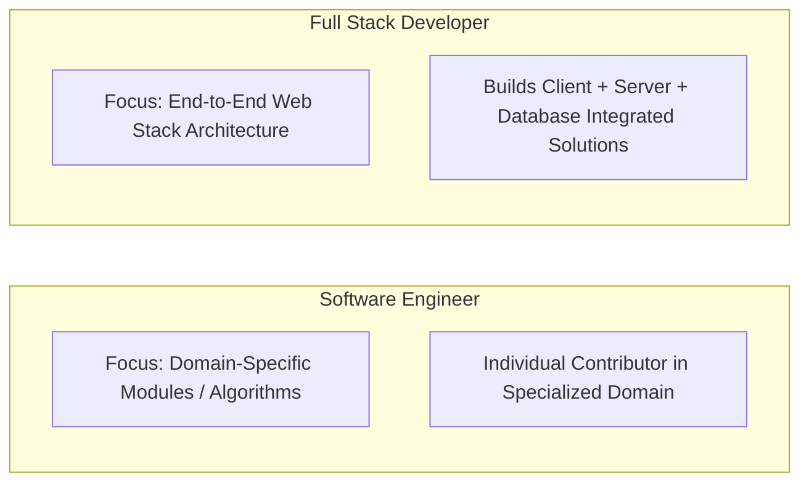
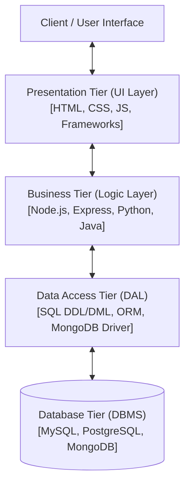
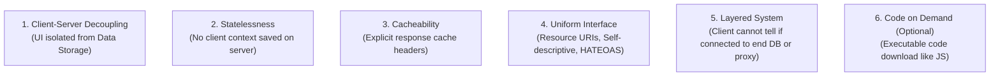

# Chapter 1: Full Stack Development Basics

> **Course Title:** Full Stack Web Development (FSD)
> **Source Material:** `UNIT-1 Full Stack Development Basics.docx`, `UNIT-1 Full Stack Development Basics.pdf`, `UNIT-2 Frontend Frameworks.docx`

---

## 1. Chapter Overview
Unit 1 provides the structural, architectural, and protocol foundation for web application engineering. It spans:
- Core concepts of Full Stack Web Development and role responsibilities.
- Comparative analysis of Front-End, Back-End, and Full Stack engineers.
- Software Engineering vs. Full Stack Development distinctions.
- 3-Tier Enterprise Architecture rules, layer boundary constraints, and decoupled communication.
- Web Development Stacks (LAMP, MEAN, MERN, Ruby on Rails, Django, Spring Boot, Serverless, Flutter/React Native cross-platform).
- JavaScript Object Notation (JSON): syntax rules, data types, nested/multidimensional structures, parsing efficiency, and comment workarounds.
- REpresentational State Transfer (REST) Architecture: 6 architectural constraints, client-server decoupling, statelessness, cacheability, uniform interface, HATEOAS.
- RESTful HTTP Protocol Operations: HTTP Verbs (GET, POST, PUT, DELETE), MIME Types & Accept headers, URI Path design conventions, Response Content-Types, and Standard HTTP Status Codes.

---

## 2. Fundamental Concepts & Terminology

### 2.1 Full Stack Development Defined
A **Full Stack Developer** possesses comprehensive domain knowledge across the entire technology stack—from client-side user interface rendering to server-side business logic, API definition, database administration, and deployment architecture.

> **Role Responsibilities:**
> 1. Technology Evaluation: Selecting client-side and server-side stack components during early project phases.
> 2. Stack Implementation: Writing clean, maintainable code adhering to stack-specific best practices.
> 3. Cross-Disciplinary Knowledge: Maintaining currency with emerging frameworks, databases, and DevOps tools.
> 4. Agile Team Contribution: Serving as versatile, high-velocity engineering nodes in cross-functional Agile environments.

---

### 2.2 Role Comparison: Front-End vs. Back-End vs. Full Stack

| Feature / Dimension | Front-End Developer | Back-End Developer | Full Stack Developer |
| :--- | :--- | :--- | :--- |
| **Primary Focus** | User Interface (UI), User Experience (UX), Visual Layout, Navigation, Client-Side Interactivity. | Business Logic, Security, Data Management, Database Querying, Request Handling, Scalability. | End-to-End Workflow Execution (Client + Server + Database + API). |
| **Core Technologies** | HTML5, CSS3, JavaScript (ES6+), React, Vue, Angular, Bootstrap, Tailwind. | Node.js, Python, Java, Ruby, PHP, C#/.NET, Express, Django, Spring Boot. | Full Stacks (MERN, MEAN, LAMP, RoR, Serverless) spanning front-end & back-end. |
| **Data Handling** | Manipulates DOM, renders JSON payloads received from server APIs. | Constructs APIs, interacts directly with DBMS (SQL/NoSQL), manages state persistence. | Manages data modeling, API payload construction, and DOM presentation. |
| **System Visibility** | Client browser engine / web runtime. | Server environment / OS / Cloud container / Database. | Complete application topology. |

---

### 2.3 Software Engineer vs. Full Stack Developer



- **Software Engineer:** Broad engineering title. Typically focuses deeply on specialized individual modules, system components, algorithms, low-level OS drivers, or single-tier infrastructure.
- **Full Stack Developer:** Web engineering specialization. Responsible for delivering functional end-to-end applications across all layers (Presentation, Logic, Database).

---

### 2.4 Trade-Off Analysis of Full Stack Development

#### Advantages:
1. **End-to-End Ownership:** Deep architectural insight into the entire software lifecycle.
2. **Cost & Time Efficiency:** Reduces communication overhead and team size requirement for small-to-medium builds.
3. **Rapid Debugging:** Faster issue isolation across API layer boundaries.
4. **Agile Versatility:** Smooth task-switching between front-end UI and back-end services in sprint cycles.
5. **Entrepreneurial Autonomy:** Enables solo prototyping, SaaS MVP creation, and site monetization.

#### Disadvantages:
1. **Jack-of-all-trades Risk:** Breadth of knowledge can lead to reduced depth compared to specialized backend or database engineers.
2. **Key Person Dependency:** Over-reliance on a single developer creates severe single-point-of-failure risks.
3. **Cognitive Overhead:** Rapid shifts across multiple paradigms (CSS, SQL, Async JS, DevOps) increase defect likelihood.

---

## 3. The 3-Tier Enterprise Architecture

### 3.1 Structural Architecture
The 3-Tier Architecture cleanly segregates software application code into three distinct, decoupled tiers.



### 3.2 Strict Rules of 3-Tier Architecture
1. **Absolute Layer Isolation:** Code belonging to a tier must reside exclusively inside that tier's files.
2. **Strict Cascade Communication:**
   - Presentation Tier talks **only** to Business Tier. It is strictly prohibited from touching the Data Access Tier or Database directly.
   - Business Tier talks **only** to Presentation Tier (upstream) and Data Access Tier (downstream). It cannot execute raw DB operations directly.
   - Data Access Tier talks **only** to Business Tier (upstream) and the specific DBMS engine (downstream).
3. **Decoupled Agnosticism:**
   - The Business Tier must be **Database-Agnostic** (unaware of whether SQL or NoSQL stores data) and **Presentation-Agnostic** (unaware if output is HTML, JSON, PDF, or CSV).
4. **Granular Multi-Component Structure:**
   - Presentation Tier: A dedicated controller/view component per user transaction.
   - Business Tier: A dedicated business entity logic component per database entity.
   - Data Access Tier: A dedicated Data Access Object (DAO) component per supported DBMS engine.

### 3.3 Skill Requirements per Tier

| Tier | Primary Purpose | Required Technical Skills |
| :--- | :--- | :--- |
| **Presentation Tier** | User interaction, visual rendering, input capture. | HTML5, CSS3, JavaScript, UI/UX Design, Frameworks (React, Vue, Angular). |
| **Business Tier** | Enforcing business rules, computational algorithms, access validation. | Core Server Languages (Node.js, Python, Java, PHP, C#), API Routing. |
| **Data Access Tier** | Executing CRUD transactions against persistent storage. | SQL (DDL/DML), Database Schema Design, Indexing, NoSQL Query APIs. |

---

## 4. Popular Web Development Stacks & Project Contexts

### 4.1 Comparative Stack Matrix

| Stack | Technology Breakdown | Ideal Project Context | Industry Adopters |
| :--- | :--- | :--- | :--- |
| **LAMP** | **L**inux, **A**pache, **M**ySQL, **P**HP | Low-cost, highly customizable e-commerce, content management systems (CMS). | Wikipedia, Yahoo, Etsy, WordPress, Magento, Shopify |
| **MEAN** | **M**ongoDB, **E**xpress.js, **A**ngular, **N**ode.js | Real-time collaborative enterprise suites, SPA web apps requiring strong TypeScript support. | Google, Microsoft, IBM, Amazon, Uber, PayPal, LinkedIn |
| **MERN** | **M**ongoDB, **E**xpress.js, **R**eact, **N**ode.js | Dynamic, highly interactive single-page web applications with real-time UI state re-rendering. | Meta (Facebook), Netflix, Airbnb, Tesla, Walmart, Uber |
| **Ruby on Rails** | Ruby Language + Rails Framework (MVC) | Rapid startup MVP prototyping, donation management, developer-friendly convention-over-configuration apps. | GitHub, Airbnb, Shopify, SlideShare, CrunchBase, Dribbble |
| **Django (Python)**| Python + Django Framework (MTV) | High-security enterprise internal portals, machine learning-driven web apps, data processing engines. | Instagram, Spotify, YouTube, Disqus, Bitbucket |
| **Java / Spring Boot**| Java + Spring Boot Framework | Large-scale, high-concurrency enterprise applications, banking, microservices architectures. | Amazon, Netflix, Google, Ebay, Enterprise Banking |
| **Serverless** | AWS Lambda / Azure Functions + DynamoDB / Serverless API | Personalized travel planning, event-driven web apps requiring auto-scaling with pay-per-use costing. | Serverless Startups, Cloud Native SaaS |
| **Flutter / React Native**| Cross-Platform Frameworks (Dart / JS) | Multi-platform on-demand mobile & web applications (food delivery, fitness tracking). | Instagram, Uber Eats, BMW, Alibaba |

---

## 5. JavaScript Object Notation (JSON)

### 5.1 Definition & Properties
**Definition:** JSON (JavaScript Object Notation) is a lightweight, text-based, open standard format designed specifically for human-readable data interchange.

> **Key Characteristics:**
> - **Language-Independent:** Native support in JavaScript, Python, Java, C#, PHP, Ruby, Go.
> - **Self-Describing:** Structural key-value pairing defines data context implicitly.
> - **Open Standard:** Based on a subset of JavaScript standard ECMA-262.

### 5.2 JSON vs. XML Comparison

| Evaluation Metric | JSON | XML |
| :--- | :--- | :--- |
| **Verbosity** | Compact, minimal syntax footprint. | Verbose, requires opening and closing tags `<tag></tag>`. |
| **Parsing Speed** | Faster. Uses native fast JavaScript `JSON.parse()`. | Slower. Requires DOM/SAX parser tree construction in memory. |
| **Data Structure Support**| Maps (Key-Value), Arrays, Primitives (Strings, Numbers, Booleans, Null). | Tree structures, Attributes, Elements. |
| **Memory Footprint** | Extremely low. | High (due to DOM node tree allocation). |
| **Readability** | High for both humans and machines. | Moderate (cluttered by markup tags). |

### 5.3 Valid JSON Data Types

| Data Type | Formal Rule & Syntax | Valid Example |
| :--- | :--- | :--- |
| **String** | Double-quoted UTF-8 text string. | `"studentName": "Alice"` |
| **Number** | Integer or floating-point number (no quotes). | `"age": 22`, `"gpa": 3.85` |
| **Boolean** | Literal `true` or `false` (lowercase). | `"isEnrolled": true` |
| **Null** | Literal `null` representing empty value. | `"middleName": null` |
| **Object** | Unordered collection of key-value pairs wrapped in `{}`. Keys MUST be double-quoted strings. | `{"id": 101, "dept": "CS"}` |
| **Array** | Ordered sequence of values wrapped in `[]`. | `"grades": [88, 92, 95]` |

---

### 5.4 JSON Structural Formats & Code Examples

#### A. JSON Object Example
```json
{
  "name": "Jack",
  "employeeid": 1,
  "present": false
}
```

#### B. JSON Array of Objects Example
```json
{
  "employees": [
    { "name": "Ram", "email": "ram@gmail.com", "age": 23 },
    { "name": "Shyam", "email": "shyam23@gmail.com", "age": 28 },
    { "name": "John", "email": "john@gmail.com", "age": 33 },
    { "name": "Bob", "email": "bob32@gmail.com", "age": 41 }
  ]
}
```

#### C. Multidimensional JSON Array Example
```json
[
  ["a", "b", "c"],
  ["m", "n", "o"],
  ["x", "y", "z"]
]
```

#### D. JSON Comment Workaround
JSON standard **does not support native comments** (`//` or `/* */`). To include explanatory notes in a JSON payload, developers introduce explicit attribute keys:
```json
{
  "employee": {
    "name": "Bob",
    "salary": 56000,
    "_comment": "This attribute acts as a comment line for documentation."
  }
}
```

---

## 6. REpresentational State Transfer (REST) Architecture

### 6.1 Architectural Definition
REST is an architectural style that defines constraints for building scalable, resilient, and stateless web services. Systems adhering to REST principles are termed **RESTful**.

---

### 6.2 The 6 Core Constraints of REST



1. **Client-Server Separation:** Enforces complete boundary separation. The client handles presentation; the server manages storage and logic. Enables independent platform evolution.
2. **Statelessness:** Every request from client to server must contain **all** authentication credentials and contextual data needed to process it. The server stores no session state between requests.
3. **Cacheability:** Responses must explicitly declare whether they can be cached by clients/proxies (`Cache-Control`, `ETag`) to eliminate redundant round-trips.
4. **Uniform Interface:** Standardized interaction contract containing sub-constraints:
   - *Identification of Resources:* Unique URIs identify resources (`/customers/102`).
   - *Manipulation via Representations:* Resources are modified via JSON/XML payloads.
   - *Self-Descriptive Messages:* Headers explicitly describe payload metadata (e.g., `Content-Type`).
   - *HATEOAS (Hypermedia as the Engine of Application State):* Responses include dynamic hypermedia links guiding available client state transitions.
5. **Layered System:** Application topology can include intermediaries (load balancers, cache layers, API gateways) without client awareness.
6. **Code-on-Demand (Optional):** Servers can temporarily extend client functionality by transferring executable code (e.g., JavaScript scripts).

---

## 7. RESTful HTTP Communications & Protocol Details

### 7.1 HTTP Verbs (Operations on Resources)

| Verb | CRUD Mapping | Operational Behavior | Idempotent? | Safe? | Expected Success Code |
| :--- | :--- | :--- | :--- | :--- | :--- |
| **GET** | Read | Retrieves a specific resource or resource collection. | Yes | Yes | `200 OK` |
| **POST** | Create | Creates a new resource under a collection URI. | No | No | `201 CREATED` |
| **PUT** | Update / Replace | Replaces an existing resource or creates if non-existent. | Yes | No | `200 OK` |
| **DELETE**| Delete | Removes a specific resource by ID. | Yes | No | `204 NO CONTENT` |

*Note on Idempotency:* An operation is idempotent if executing it multiple identical times produces the exact same server state as executing it once.

---

### 7.2 Headers & Media Content Types (MIME Types)
The request `Accept` header indicates media types acceptable in response. The response `Content-Type` header informs the client of the returned payload format.

#### MIME Type Structure: `type/subtype`

```text
  application/json
  └───┬───┘   └─┬──┘
    Type     Subtype
```

| Type Category | Commonly Used Subtypes |
| :--- | :--- |
| **Text** | `text/html`, `text/css`, `text/plain`, `text/csv` |
| **Application** | `application/json`, `application/xml`, `application/pdf`, `application/octet-stream` |
| **Image** | `image/png`, `image/jpeg`, `image/gif`, `image/webp` |
| **Audio / Video** | `audio/mpeg`, `audio/wav`, `video/mp4`, `video/ogg` |

---

### 7.3 REST URI Path Design Conventions
1. **Plural Naming:** Use plural nouns for collection resources (`/customers`, `/orders`).
2. **Hierarchical Nesting:** Show child resource ownership cleanly:
   - `GET /customers/223/orders/12` (Fetches Order #12 for Customer #223).
3. **Identifier Rules:**
   - Collection Requests (`POST /customers`): No ID appended; server generates ID.
   - Individual Resource Requests (`GET /customers/:id`, `DELETE /customers/:id`): Explicit ID appended.

---

### 7.4 Standard HTTP Response Status Codes

| Code Range | Category | Code & Name | Exam-Critical Definition |
| :--- | :--- | :--- | :--- |
| **2xx** | Success | `200 OK` | Standard response for successful GET, PUT, or PATCH. |
| | | `201 CREATED` | Request succeeded and a new resource was created (POST). |
| | | `204 NO CONTENT` | Request succeeded but response body is intentionally empty (DELETE). |
| **4xx** | Client Error | `400 BAD REQUEST` | Request syntax error, invalid parameters, or payload malformed. |
| | | `403 FORBIDDEN` | Client authenticated, but lacks permissions for resource. |
| | | `404 NOT FOUND` | Resource URI does not exist or has been deleted. |
| **5xx** | Server Error | `500 INTERNAL SERVER ERROR` | Unhandled server-side exception or runtime system crash. |

---

## 8. Formula Sheet

- **REST Idempotency Ratio:**
  $$
  f(f(x)) = f(x)
  $$
- **API Throughput Overhead Ratio:**
  $$
  \text{Overhead} = \frac{\text{Header Size (Bytes)}}{\text{Header Size} + \text{Payload Size}} \times 100\%
  $$

---

## 9. Definition Sheet

1. **Full Stack Developer:** A developer who works with both client-side and server-side software, managing UI, APIs, logic, and databases.
2. **3-Tier Architecture:** A client-server architecture in which functional process logic, data access, user interface, and computer data storage are developed and maintained as independent modules.
3. **JSON:** A lightweight, text-based data interchange format derived from JavaScript object notation syntax.
4. **REST:** REpresentational State Transfer; a software architectural style that defines constraints for web service communications.
5. **HATEOAS:** Hypermedia as the Engine of Application State; a REST constraint where hypermedia links in responses direct clients to available actions.

---

## 10. Exam-Oriented Review

1. Compare 3-tier architecture with monolithic single-tier applications. Explain the cascade communication rule.
2. Contrast JSON and XML across verbosity, parsing speed, and data structure support.
3. List the 6 architectural constraints of REST and define HATEOAS with a JSON example.
4. Detail the HTTP verbs (GET, POST, PUT, DELETE), their CRUD mappings, idempotency status, and standard return status codes.
