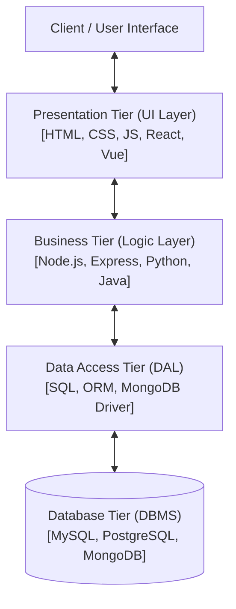
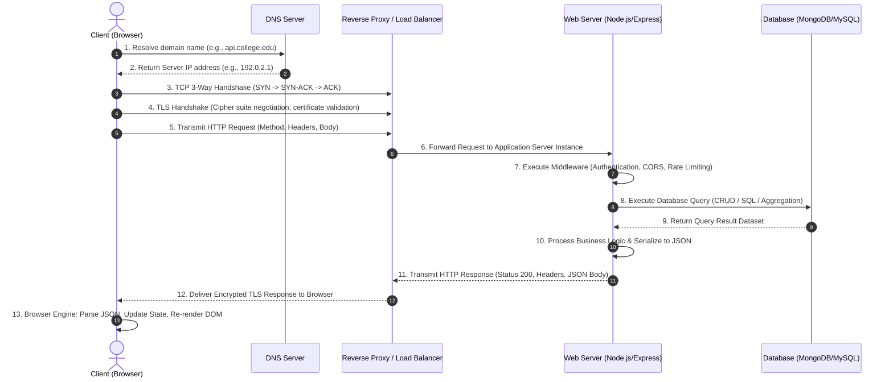
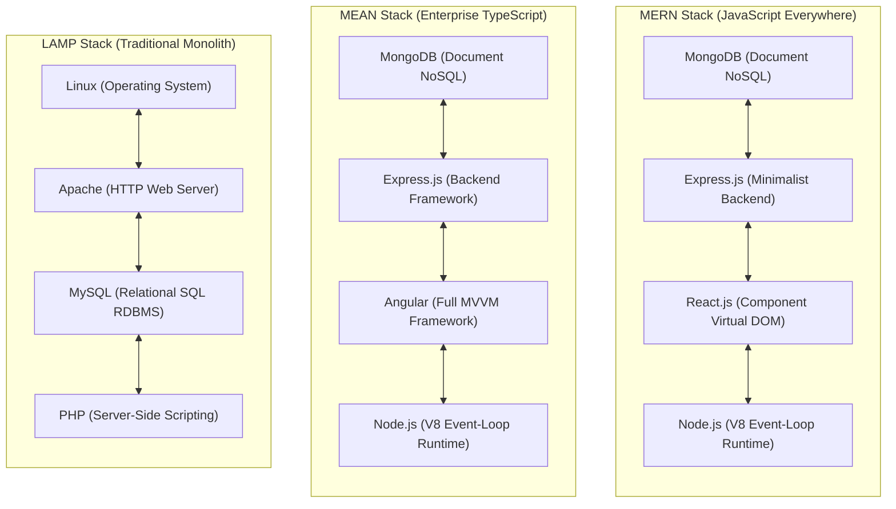
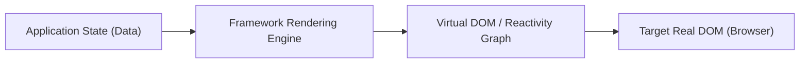
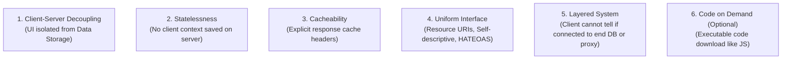

# Chapter 1: Full Stack Development Basics & Core Web Protocols


> **Course Title:** Full Stack Web Development (FSD)

> **Source Material:** `UNIT-1 Full Stack Development Basics.docx`, `UNIT-1 Full Stack Development Basics.pdf`, `UNIT-2 Frontend Frameworks.docx`


---


## 1. Chapter Overview

- **Core Full Stack Architecture:** Role distinctions, 3-tier enterprise separation, and modern web stacks (LAMP, MEAN, MERN, Django, Spring Boot, Serverless).

- **JSON Data Interchange:** Complete syntax rules, data types, nested/multidimensional structures, parsing/serialization, file I/O, dynamic updates, and data querying in JavaScript.

- **Node.js Core Fundamentals:** Event-driven non-blocking I/O, `http` module server creation, `fs` file operations, `path` resolution, middleware execution, and JSON REST API endpoint routing.

- **RESTful Architecture:** 6 architectural constraints, statelessness, HTTP verbs, MIME types, URI design rules, and status codes.


---


## 2. Fundamental Concepts & Terminology


### 2.1 Role Comparison: Front-End vs. Back-End vs. Full Stack


| Dimension | Front-End Developer | Back-End Developer | Full Stack Developer |
| :--- | :--- | :--- | :--- |
| **Primary Scope** | User Interface (UI), User Experience (UX), DOM presentation, client interactivity. | Business logic, server architecture, database management, security, API routing. | End-to-end web stack architecture (Client + Server + Database + API). |
| **Technology Stack** | HTML5, CSS3, JavaScript (ES6+), React, Vue, Bootstrap, Tailwind. | Node.js, Express, Python (Django), Java (Spring Boot), SQL/NoSQL databases. | Full stacks: MERN, MEAN, LAMP, Django, Serverless, Flutter/React Native. |
| **Data Handling** | Manipulates DOM; processes JSON API payloads received from server. | Constructs REST APIs, queries DBMS (SQL/NoSQL), manages state persistence. | Models database schemas, builds REST API payloads, and renders DOM views. |
| **Runtime Environment** | Web browser rendering engine (V8, SpiderMonkey, WebKit). | Node.js runtime, OS, Docker containers, Cloud server instances. | Complete web application topology across browser and server. |


---


### 2.2 The 3-Tier Enterprise Architecture Rules

- **Presentation Tier (UI Layer):** Handles user interaction and visual rendering. Communicates **strictly** with the Business Tier.

- **Business Tier (Logic Layer):** Enforces business rules, validation, and algorithms. Communicates **only** with Presentation Tier (upstream) and Data Access Tier (downstream). Must be Presentation-Agnostic and Database-Agnostic.

- **Data Access Tier (DAL / Database Layer):** Executes CRUD transactions against DBMS engines. Communicates **only** with Business Tier and DBMS.





---


---

### 2.3 Client-Server Architecture & The HTTP/HTTPS Request-Response Lifecycle

Full-stack web applications operate on the foundational **Client-Server Architecture**—a distributed computing model where workload is partitioned between service requesters (Clients / User Agents) and service providers (Servers).



#### The 7 Steps of the Web Request Journey:
1. **DNS Resolution:** The client browser checks DNS cache (Browser cache $	o$ OS cache $	o$ Router cache $	o$ ISP DNS resolver) to translate the human-readable domain into a numerical IP address.
2. **TCP Three-Way Handshake:** Establishes a reliable transport layer connection over TCP/IP:
   - Client sends `SYN` (Synchronize sequence number).
   - Server responds with `SYN-ACK` (Synchronize-Acknowledgment).
   - Client returns `ACK` (Acknowledgment). Connection is established.
3. **TLS/SSL Handshake (HTTPS):** For encrypted traffic, asymmetric cryptography authenticates server identity via X.509 SSL certificates and securely exchanges a symmetric session key for fast, encrypted AES data transmission.
4. **HTTP Request Transmission:** The client transmits a formatted plain-text HTTP request consisting of:
   - **Request Line:** Method (`GET`, `POST`, `PUT`, `DELETE`), Request URI (`/api/v1/students`), and Protocol Version (`HTTP/1.1` or `HTTP/2`).
   - **Request Headers:** Metadata including `Host`, `User-Agent`, `Accept`, `Authorization: Bearer <token>`, `Content-Type: application/json`.
   - **Empty Line (`CRLF`):** Required separator dividing headers from body.
   - **Request Body:** Optional data payload (e.g., JSON payload in `POST`/`PUT` requests).
5. **Server Processing & Business Logic:** Reverse proxy (Nginx) passes request to Node.js/Express; middleware executes authentication and payload validation; business logic queries the database tier.
6. **HTTP Response Transmission:** Server packages output into an HTTP response:
   - **Status Line:** Protocol version, 3-digit Status Code (`200 OK`, `201 Created`, `404 Not Found`, `500 Internal Server Error`).
   - **Response Headers:** `Content-Type: application/json`, `Cache-Control`, `Set-Cookie`, `Access-Control-Allow-Origin`.
   - **Empty Line (`CRLF`).**
   - **Response Body:** Serialized payload (e.g., JSON string).
7. **Client Rendering & DOM Reconstruction:** Browser parsing engine processes JSON, updates application state, triggers Virtual DOM / DOM reconciliation, and performs reflow/repaint on the display screen.

#### Statelessness of HTTP & State Persistence
HTTP is inherently a **stateless protocol**—each request-response transaction is completely independent; the server retains zero memory of previous interactions. To maintain user identity across requests (e.g., shopping carts, authenticated sessions), modern full-stack architectures employ state preservation mechanisms:
- **Session-Cookie Architecture:** The server creates a session store record, assigns a unique `SessionID`, and sets it in an HTTP cookie (`Set-Cookie: session_id=...; HttpOnly; Secure`). The browser automatically includes this cookie in subsequent requests.
- **Token-Based Architecture (JWT - JSON Web Token):** The server signs a cryptographically verifiable token containing user claims (`id`, `role`, `exp`) and returns it in a JSON response. The client explicitly attaches it in the request header: `Authorization: Bearer <jwt_token>`. This maintains server-side statelessness, enabling horizontal scaling across multi-server cloud clusters.

---

### 2.4 Modern Full Stack Web Stacks: Comprehensive Architectural Breakdown

A "Web Stack" is the cohesive collection of software subsystems, programming languages, frameworks, runtime environments, and databases required to build a complete end-to-end web application.



#### Master Web Stacks Comparison Matrix

| Feature / Stack | **MERN Stack** | **MEAN Stack** | **MEVN Stack** | **LAMP Stack** | **Django Stack** | **Spring Boot Stack** |
| :--- | :--- | :--- | :--- | :--- | :--- | :--- |
| **Frontend Tier** | React.js (Virtual DOM, JSX) | Angular (TypeScript, Two-way binding) | Vue.js (Reactivity, Single File Components) | Server-rendered HTML / Vanilla JS / jQuery | Django Templates / HTMX / React | Thymeleaf / React / Angular |
| **Backend / API Tier** | Express.js / Node.js | Express.js / Node.js | Express.js / Node.js | PHP | Django (Python) | Spring Boot (Java) |
| **Database Tier** | MongoDB (NoSQL BSON) | MongoDB (NoSQL BSON) | MongoDB (NoSQL BSON) | MySQL / MariaDB (Relational) | PostgreSQL / MySQL (Django ORM) | Oracle / PostgreSQL / MySQL (Hibernate) |
| **Server Runtime** | Node.js (V8 Engine) | Node.js (V8 Engine) | Node.js (V8 Engine) | Apache HTTP Server / Nginx | WSGI / ASGI (Gunicorn, Uvicorn) | Java Virtual Machine (JVM / Tomcat) |
| **Language Paradigm** | Pure JavaScript / TypeScript | TypeScript across all tiers | JavaScript / TypeScript | PHP + SQL + C | Python + SQL | Java / Kotlin |
| **Primary Strength** | Rapid UI iteration, vast npm ecosystem, single language across stack. | Enterprise governance, built-in dependency injection, strict typing. | Gentle learning curve, elegant reactivity, progressive integration. | Ubiquitous web hosting, mature codebase, powering ~40% of web (WordPress). | "Batteries-included" (built-in admin, auth, ORM, CSRF protection). | High concurrency, robust multi-threading, banking & enterprise scalability. |
| **Primary Drawback** | Boilerplate state management, non-opinionated architecture. | Steep learning curve, heavy initial bundle footprint. | Smaller enterprise ecosystem than React. | CPU-heavy synchronous execution per request, legacy monolith structure. | Slower execution compared to compiled Go/Java, synchronous WSGI limits. | Verbose configuration, high memory footprint, slower cold start. |

---

### 2.5 Modern Frontend Frameworks & UI Architecture: React, Vue, Bootstrap & Tailwind CSS

Historically, web interfaces were built using **Imperative Programming** (e.g., Vanilla JavaScript and jQuery), where developers explicitly wrote step-by-step instructions to select DOM nodes, attach listeners, and manually mutate HTML elements:
```javascript
// Imperative (Legacy jQuery/Vanilla JS): "HOW to mutate the DOM"
const button = document.getElementById("btn");
button.addEventListener("click", () => {
    const counter = document.getElementById("count");
    let current = parseInt(counter.innerText);
    counter.innerText = current + 1; // Manual DOM mutation
});
```

Modern frontend engineering relies on **Declarative Programming**, where developers define the UI as a direct mathematical projection of state:
$$
	ext{UI} = f(	ext{State})
$$
When `State` changes, the underlying framework automatically updates the DOM.



---

#### 2.5.1 What is React.js? (Architecture, Virtual DOM & Uni-directional Data Flow)

**Formal Definition:** React is an open-source, declarative, component-based front-end JavaScript library developed and maintained by Meta (Facebook) and an international developer community. It is specifically designed for building high-performance, interactive User Interfaces (UIs) and Single Page Applications (SPAs).

##### The 5 Core Architectural Pillars of React:

1. **Component-Based Architecture:**
   - React divides the user interface into independent, self-contained, reusable building blocks called **Components**.
   - Components accept inputs called **Props** (properties) and return JSX elements describing what should appear on the screen.
   - Components can be composed hierarchically: Parent components pass data downward to child components.

2. **The Virtual DOM (VDOM) & Reconciliation Algorithm:**
   - Directly modifying the real browser DOM is extremely computationally expensive because DOM mutations trigger **Reflow** (recalculating element geometries and layouts) and **Repaint** (drawing pixels to screen).
   - React solves this by maintaining an in-memory lightweight JavaScript representation of the real DOM called the **Virtual DOM**.
   - **The 3-Step Reconciliation Process:**
     1. Whenever component state changes, React generates a brand new Virtual DOM tree representing the updated UI.
     2. React compares the new Virtual DOM tree with the previous Virtual DOM tree using an optimized **$O(n)$ Heuristic Diffing Algorithm** (instead of standard $O(n^3)$ tree comparison algorithms).
     3. React calculates the minimal set of changes required (the "patch") and executes **Batch Updates** on the real DOM in a single operation, eliminating redundant layout recalculations.

3. **JSX (JavaScript XML):**
   - JSX is a syntax extension to JavaScript that allows developers to write HTML-like markup directly inside JavaScript files.
   - JSX is **not** valid JavaScript; build tools (Babel / SWC / Vite) transpile JSX into native `React.createElement()` function calls:
     ```jsx
     // JSX Source Code:
     const element = <h1 className="title">Hello Full Stack</h1>;

     // Transpiled Native JavaScript Output:
     const element = React.createElement('h1', { className: 'title' }, 'Hello Full Stack');
     ```

4. **Uni-Directional (One-Way) Data Flow:**
   - In React, data strictly flows in one direction: **Top $	o$ Down** (from Parent Component to Child Component) via read-only `props`.
   - Child components cannot directly modify parent data. If a child needs to mutate parent state, the parent passes a callback function via props. This guarantees predictable state mutations, simplifies debugging, and isolates bugs.

5. **Props vs. State (Critical Exam Distinction):**
   - **Props (Properties):** Arbitrary inputs passed from parent to child component. Props are strictly **immutable** (read-only) within the receiving component.
   - **State:** A private, internal data store managed within the component that can change over time based on user interactions or network events. When state changes (`setState` or `useState`), the component triggers a re-render.

```jsx
import React, { useState } from 'react';

// Example: Functional React Component with Hooks
function Counter({ initialCount, step }) {
  // Local state declaration
  const [count, setCount] = useState(initialCount);

  return (
    <div className="card">
      <h3>Count: {count}</h3>
      <button onClick={() => setCount(count + step)}>Increment by {step}</button>
    </div>
  );
}
export default Counter;
```

---

#### 2.5.2 What is Vue.js? (Progressive Architecture, MVVM & Two-Way Data Binding)

**Formal Definition:** Vue.js is an open-source, progressive JavaScript framework created by Evan You for building modern user interfaces and SPAs. It is described as "progressive" because it can be integrated incrementally—from a lightweight library imported via a `<script>` tag in a static HTML page to an advanced enterprise SPA framework powered by Vite, Vue Router, and Pinia.

##### The 5 Core Architectural Pillars of Vue.js:

1. **Model-View-ViewModel (MVVM) Pattern:**
   - **Model:** The raw JavaScript data objects representing the application state.
   - **View:** The visible HTML DOM rendered in the browser.
   - **ViewModel (The Vue Instance):** The mediator connecting Model and View. It automatically synchronizes data changes in the Model to the View, and user inputs in the View back to the Model.

2. **Two-Way Data Binding (`v-model`):**
   - Unlike React which requires manual event handlers (`onChange={(e) => setState(e.target.value)}`), Vue provides native two-way data binding through the `v-model` directive.
   - `v-model` internally binds the element's value attribute (`:value="data"`) and listens to the input event (`@input="data = $event.target.value"`), maintaining real-time bi-directional synchronization between form inputs and state.

3. **Reactivity Engine (Dependency Tracking):**
   - Vue automatically tracks which data properties are used during component rendering.
   - **Vue 2 Reactivity:** Implemented using `Object.defineProperty()` to convert data object properties into ES5 getters and setters. *Limitation: Cannot detect property addition/deletion or direct array index assignment without `Vue.set()`.*
   - **Vue 3 Reactivity:** Implemented using native ES6 `Proxy` objects. Intercepts operations (`get`, `set`, `deleteProperty`) on objects and arrays seamlessly, achieving superior performance and zero reactivity caveats.

4. **Single File Components (SFC - `.vue` Files):**
   - Vue standardizes component authoring into single `.vue` files that encapsulate HTML markup, JavaScript behavior, and CSS styling in dedicated blocks:
     ```html
     <template>
       <div class="user-box">
         <h2>{{ username }}</h2>
         <input v-model="username" placeholder="Edit name">
       </div>
     </template>

     <script>
     export default {
       data() {
         return { username: 'Alex Johnson' }
       }
     }
     </script>

     <style scoped>
     .user-box { border: 1px solid #e2e8f0; padding: 1rem; border-radius: 8px; }
     h2 { color: #2563eb; }
     </style>
     ```

5. **Options API vs. Composition API:**
   - **Options API (Vue 2 & 3):** Organizes component logic by option categories (`data()`, `methods`, `computed`, `watch`, `mounted()`). Highly intuitive for beginners.
   - **Composition API (Vue 3 `setup()` / `<script setup>`):** Organizes code by logical feature rather than option categories using reactive primitives (`ref()`, `reactive()`, `computed()`). Solves code fragmentation in large, complex enterprise codebases.

---

#### 2.5.3 What is Bootstrap 5? (Responsive Grid, Breakpoints & Utility Engine)

**Formal Definition:** Bootstrap is the world's most popular open-source, mobile-first CSS framework originally developed at Twitter by Mark Otto and Jacob Thornton. It provides a standardized library of responsive layout systems, pre-styled UI components, and helper utilities to rapidly construct cross-browser compatible web applications.

##### The 4 Architectural Foundations of Bootstrap 5:

1. **The 12-Column Flexbox Grid Matrix:**
   - Bootstrap's layout system is built on a 12-column grid. The viewport width is divided into 12 equal vertical tracks.
   - Layout hierarchy strictly follows: `.container` $	o$ `.row` $	o$ `.col-{breakpoint}-{columns}`.
   - Column classes indicate how many of the 12 columns an element occupies:
     ```html
     <div class="container">
       <div class="row">
         <!-- Occupies 8 columns on medium screens and up (66.66% width) -->
         <div class="col-md-8">Main Content Area</div>
         <!-- Occupies 4 columns on medium screens and up (33.33% width) -->
         <div class="col-md-4">Sidebar Widget</div>
       </div>
     </div>
     ```

2. **The 6 Responsive Breakpoint Tiers:**
   - Bootstrap adopts a **Mobile-First** paradigm using CSS `min-width` media queries:

| Breakpoint Tier | Infix Class | Viewport Range | Target Devices |
| :--- | :--- | :--- | :--- |
| **Extra Small** | None (`.col-`) | $< 576	ext{px}$ | Mobile smartphones in portrait. |
| **Small** | `sm` (`.col-sm-`) | $\ge 576	ext{px}$ | Large phones / mobile in landscape. |
| **Medium** | `md` (`.col-md-`) | $\ge 768	ext{px}$ | Tablets and mini laptops. |
| **Large** | `lg` (`.col-lg-`) | $\ge 992	ext{px}$ | Desktop monitors and laptops. |
| **Extra Large** | `xl` (`.col-xl-`) | $\ge 1200	ext{px}$ | High-resolution desktop displays. |
| **Extra Extra Large** | `xxl` (`.col-xxl-`) | $\ge 1400	ext{px}$ | Ultra-wide monitors and 4K displays. |

3. **Pre-Built Interactive UI Components:**
   - Delivers standardized, accessibility-compliant (ARIA) UI components: Navbars, Dropdowns, Modals, Accordions, Toasts, Carousels, Badges, and Tooltips.

4. **Architectural Advancements in Bootstrap 5:**
   - **Removal of jQuery:** Completely dropped jQuery dependency in favor of native Vanilla JavaScript (ES6+), drastically reducing payload weight and execution latency.
   - **CSS Custom Properties (Variables):** Extensively adopts native CSS variables (`--bs-primary`, `--bs-body-bg`) for runtime dynamic theming and dark mode integration.
   - **Subresource Integrity (SRI):** Secure CDN delivery using cryptographic hashes (`integrity="sha384-..."`) preventing man-in-the-middle CDN script tampering.

---

#### 2.5.4 Why Tailwind CSS? (Utility-First Architecture & JIT Engine)

**Formal Definition:** Tailwind CSS is a utility-first CSS framework created by Adam Wathan that provides low-level atomic utility classes (such as `flex`, `pt-4`, `text-center`, `rounded-lg`, and `bg-indigo-600`) that can be composed directly in HTML markup to construct custom user interface designs without writing traditional custom CSS stylesheets.

##### Why Tailwind CSS? The 5 Major Problems it Solves:

1. **Elimination of Naming Fatigue & CSS Bloat:**
   - Traditional CSS requires inventing arbitrary class names for every element (`.sidebar-header-user-avatar-wrapper__inner`). Developers waste cognitive energy naming containers.
   - With Tailwind, styles are applied using standard atomic utility classes directly in the markup.

2. **Zero CSS Specificity Wars & Cascading Conflicts:**
   - In traditional stylesheets, CSS rules often collide due to selector specificity (`div.main > ul li:first-child a.active`). Modifying a class in one stylesheet inadvertently breaks layouts across unrelated pages.
   - Tailwind utility classes operate at flat specificity, making style scopes entirely local to the element where they are declared.

3. **Sub-10KB Production Bundles via the Just-In-Time (JIT) Compiler:**
   - Monolithic frameworks like Bootstrap ship full CSS stylesheets (~150KB–300KB) containing hundreds of classes the application never uses.
   - Tailwind's **Just-In-Time (JIT) Engine** scans all project template files (`.html`, `.jsx`, `.vue`), extracts the exact utility classes used, and compiles *strictly* the CSS needed on-demand. Production stylesheets are routinely under $10	ext{KB}$ gzipped, regardless of application scale.

4. **Constraint-Based Design System:**
   - Prevents arbitrary "magic numbers" (`margin: 17px; font-size: 13.5px;`).
   - Tailwind provides a mathematical design token scale for spacing ($4 = 1	ext{rem} = 16	ext{px}$), font sizes (`text-sm`, `text-base`, `text-xl`), box shadows (`shadow-md`, `shadow-xl`), and color palettes (`slate-500`, `emerald-600`).

5. **Responsive Prefixes & Pseudo-Class Modifiers:**
   - Allows complex responsive design, dark mode, and state styling directly within class strings without writing a single media query:
     ```html
     <!-- Responsive button with hover, dark mode, and focus ring -->
     <button class="bg-blue-600 hover:bg-blue-700 text-white font-semibold py-2 px-4 rounded-lg shadow-md focus:outline-none focus:ring-2 focus:ring-blue-400 sm:w-auto w-full dark:bg-blue-800">
       Submit Assessment
     </button>
     ```

---

#### 2.5.5 Comprehensive Comparative Framework Matrices (Exam High-Yield)

##### Table A: React.js vs. Vue.js (Frontend Framework Comparison)

| Dimension | **React.js** | **Vue.js** |
| :--- | :--- | :--- |
| **Creator / Backing** | Meta (Facebook) + Open-source community. | Evan You + Open-source community crowdfunding. |
| **Type / Nature** | UI Library (relies on third-party ecosystem for routing & state). | Progressive Framework (official Router, Pinia state management). |
| **DOM Paradigm** | Virtual DOM with heuristic diffing ($O(n)$ reconciliation). | Virtual DOM with fine-grained reactivity tracking (Vue 3 Proxies). |
| **Template Syntax** | JSX (JavaScript XML) inside pure JavaScript. | HTML Template syntax with directives (`v-if`, `v-for`) or JSX. |
| **Data Binding** | **Uni-directional (One-way)** data flow via read-only props. | **Two-way data binding** (`v-model`) + One-way props. |
| **State Management** | Built-in: `useState`, `useReducer`, `Context API`; External: Redux, Zustand. | Built-in: `ref()`, `reactive()`; External: Pinia (official standard). |
| **Component Structure** | JavaScript / TypeScript functions returning JSX. | Single File Components (`.vue`) uniting `<template>`, `<script>`, `<style>`. |
| **Learning Curve** | Moderate (requires strong JavaScript ES6+ & functional programming). | Gentle (resembles standard HTML, CSS, and JS). |
| **Best Used For** | Large-scale enterprise applications, dynamic web apps, cross-platform (React Native). | Fast prototyping, mid-to-large enterprise SPAs, content-heavy sites. |

##### Table B: Bootstrap 5 vs. Tailwind CSS (Styling Paradigms Comparison)

| Dimension | **Bootstrap 5** | **Tailwind CSS** |
| :--- | :--- | :--- |
| **Styling Philosophy** | **Component-Based:** Pre-designed, opinionated UI components. | **Utility-First:** Low-level, unopinionated atomic utility classes. |
| **Syntax Example** | `<button class="btn btn-primary btn-lg">Button</button>` | `<button class="bg-blue-600 text-white px-6 py-3 rounded-lg">Button</button>` |
| **Customizability** | Low / Medium (requires overriding SASS variables or CSS rules). | High / Infinite (complete freedom over styling without overriding rules). |
| **Bundle Size in Production**| Fixed, larger footprint (~150KB–280KB unminified). | Ultra-light dynamic bundle (typically $< 10	ext{KB}$ gzipped via JIT purge). |
| **Design Uniqueness** | Websites often look like "Bootstrap clones" unless customized heavily. | Every website built with Tailwind can have a unique, tailored look. |
| **Built-in Components** | Yes: Includes full pre-built Navbars, Modals, Carousels, Alerts. | No: Provides building blocks; UI libraries (Tailwind UI, DaisyUI) separate. |
| **CSS File Maintenance**| Traditional CSS / SASS overrides. | Rarely write custom CSS files; classes declared directly in markup. |

---

### 2.6 Client-Side Web Storage Architecture: LocalStorage vs SessionStorage vs Cookies vs IndexedDB

Modern full-stack web applications utilize browser storage mechanisms to persist state, authentication tokens, and cached offline data on the client device.

| Storage Mechanism | Capacity Limit | Data Lifespan / Expiration | Storage Scope | Sent with Every HTTP Request? | Access API | Primary Use Cases | Security Vulnerabilities |
| :--- | :--- | :--- | :--- | :--- | :--- | :--- | :--- |
| **`localStorage`** | $\sim 5	ext{MB} - 10	ext{MB}$ per origin | Permanent (persists until explicitly cleared by user or script). | Same-Origin (all tabs and windows from origin). | **No** (purely client-side access). | Synchronous Key-Value (`localStorage.setItem()`). | User preferences (Dark mode), draft text, cached offline data. | Vulnerable to **XSS (Cross-Site Scripting)** attacks; accessible via JS. |
| **`sessionStorage`** | $\sim 5	ext{MB}$ per origin | Tab Lifetime (deleted automatically when browser tab closes). | Per Tab / Per Window (not shared across tabs). | **No** (purely client-side access). | Synchronous Key-Value (`sessionStorage.setItem()`). | Multi-step wizard data, single-session transaction data. | Vulnerable to **XSS** attacks if malicious scripts execute in tab. |
| **HTTP Cookies** | $\sim 4	ext{KB}$ per cookie | Configurable via `Expires` or `Max-Age` header attributes. | Origin + Path (configurable via `Domain` and `Path`). | **Yes** (automatically transmitted in `Cookie` header). | Synchronous via `document.cookie` (unless `HttpOnly`). | Authentication session IDs, tracking tokens. | Vulnerable to **CSRF** (Cross-Site Request Forgery). Mitigated with `SameSite=Strict`. Protected from XSS via `HttpOnly`. |
| **`IndexedDB`** | $> 250	ext{MB}$ (often up to $80\%$ of free disk space) | Permanent (persists until cleared or disk pressure eviction). | Same-Origin (shared across tabs from origin). | **No** (purely client-side access). | Asynchronous Object-Oriented NoSQL database. | Large offline datasets, progressive web apps (PWAs), binary files, audio/video blobs. | Vulnerable to **XSS** attacks if untrusted scripts run. |

---

## 3. JavaScript Object Notation (JSON) Engine & Full Code Operations

### 3.0 Theoretical Foundations of JSON: Definition, Origins & JSON vs. XML

#### 1. What is JSON? (Definition & Origins)
**Formal Definition:** JavaScript Object Notation (JSON) is an open-standard, text-based, language-independent data interchange format. Standardized under **ECMA-404** and **IETF RFC 8259**, it defines a collection of universal data structures (objects and arrays) that can be parsed and generated natively by virtually all modern programming languages.

- **Historical Origin:** Specified by Douglas Crockford in the early 2000s as a lightweight alternative to XML for browser-server asynchronous communication.
- **MIME Media Type:** The official MIME media type for JSON text is:
  ```http
  Content-Type: application/json; charset=utf-8
  Accept: application/json
  ```
- **Language Independence:** Although syntactically derived from JavaScript object literal notation, JSON is a pure text format. Parsers exist for Python (`json.loads()`), Java (`Jackson`, `Gson`), C# (`System.Text.Json`), Go (`encoding/json`), and PHP (`json_decode()`).

---

#### 2. The Great Exam Debate: JSON vs. XML (Extensive 9-Point Comparison)

The comparison between JSON and XML is one of the most frequently tested theoretical questions in Web Development examinations.

```mermaid
flowchart LR
    subgraph JSON_Payload["JSON: 52 Bytes"]
        J["{"id":101,"name":"Alice","active":true}"]
    end

    subgraph XML_Payload["XML: 114 Bytes (219% larger)"]
        X["<student><id>101</id><name>Alice</name><active>true</active></student>"]
    end
```

| Dimension | **JSON (JavaScript Object Notation)** | **XML (eXtensible Markup Language)** |
| :--- | :--- | :--- |
| **Data Representation Paradigm**| **Data-Centric:** Focuses purely on structured data interchange. | **Document-Centric:** Focuses on document markup, metadata, and data. |
| **Syntax Verbosity & Overhead**| **Minimal & Lightweight:** Uses punctuation delimiters (`{}`, `[]`, `:`, `,`). Significantly fewer bytes transmitted over the network. | **Heavy & Verbose:** Requires explicit closing tags (`<name>...</name>`), generating massive tag overhead and higher bandwidth consumption. |
| **Native Data Types** | **Rich Typing:** Natively supports Strings, Numbers (integer/float), Booleans (`true`/`false`), Arrays, Objects, and `null`. | **String-Only:** Everything is stored as character text; applications must manually parse and cast text to integers or booleans. |
| **Array Representation** | **Native First-Class Arrays:** Ordered sequences expressed cleanly via square brackets: `[10, 20, 30]`. | **No Native Arrays:** Requires repeated element tags inside container tags: `<grades><grade>10</grade><grade>20</grade></grades>`. |
| **Parsing Performance & Speed** | **Fast & Efficient:** Parsed directly into native runtime memory objects using browser-native C++ engines (`JSON.parse()`). Minimal CPU overhead. | **Slow & Memory-Intensive:** Requires complex DOM/SAX/StAX tree parsers that consume substantial memory and CPU clock cycles. |
| **JavaScript Integration** | **Native:** Syntactically identical to JavaScript object notation. Seamlessly evaluated and manipulated in JavaScript. | **External:** Requires the browser to initialize a `DOMParser` object and navigate XML nodes using XPath or DOM traversal methods. |
| **Comments & Metadata** | **No Comments or Metadata:** Strictly prohibits comments to ensure unambiguous machine parsing. No native support for namespaces. | **Supported:** Supports comments (`<!-- comment -->`), XML namespaces (`xmlns`), attributes, and processing instructions. |
| **Schema Validation** | Validated using **JSON Schema** (modern, declarative, written in JSON). | Validated using **DTD (Document Type Definition)** or **XSD (XML Schema Definition)** (highly complex, enterprise standard). |
| **Security Risk Profile** | Vulnerable to Prototype Pollution and JSON Hijacking if improperly parsed. | Vulnerable to severe parsing exploits: **XXE (XML External Entity)** injection and Billion Laughs Denial-of-Service attacks. |

---

#### 3. Core Theoretical Concepts: Serialization vs. Deserialization

In distributed systems, memory structures cannot be directly transmitted over network sockets or written to disk. They must be transformed into a standardized sequential byte stream:

```mermaid
flowchart LR
    A["Live In-Memory JavaScript Object<br>(Heap Memory, Pointers, Functions)"] 
    -->|"Serialization / Stringify<br>(Marshalling)"| B["Standardized JSON UTF-8 String<br>'{"id":101,"name":"Alice"}'"]
    B -->|"Deserialization / Parse<br>(Unmarshalling)"| C["Reconstructed In-Memory Object<br>(New Memory Allocation in Target Heap)"]
```

- **Serialization (Marshalling / Stringification):**
  The deterministic algorithmic process of translating a live, in-memory object graph into a sequential, platform-independent text format (JSON string) suitable for network transmission or disk persistence.
  *In JavaScript:* `const jsonText = JSON.stringify(data);`
- **Deserialization (Unmarshalling / Parsing):**
  The reverse process of reading a sequential JSON text stream, validating its structural syntax against grammar rules, and allocating a corresponding native object tree in the host language's heap memory.
  *In JavaScript:* `const liveObject = JSON.parse(jsonText);`

---

### 3.1 JSON Data Types Reference


| Data Type | Formal Structural Rule | Code Syntax Example |
| :--- | :--- | :--- |
| **String** | Double-quoted UTF-8 text string. | `"studentName": "Alice"` |
| **Number** | Integer or floating-point number (no quotes). | `"age": 22`, `"gpa": 3.85` |
| **Boolean** | Lowercase literal `true` or `false`. | `"isEnrolled": true` |
| **Null** | Lowercase literal `null` representing empty value. | `"middleName": null` |
| **Object** | Unordered key-value pairs wrapped in `{}`. Keys MUST be double-quoted strings. | `{"id": 101, "dept": "CS"}` |
| **Array** | Ordered sequence of values wrapped in `[]`. | `"grades": [88, 92, 95]` |


### 3.1.1 JSON Syntax Rules & Structure — Complete Example


A valid JSON object has **strictly double-quoted keys**, no trailing commas, and no JS functions/undefined values.


```json

{

  "student": {

    "id": 1001,

    "name": "Riya Sharma",

    "age": 21,

    "isEnrolled": true,

    "gpa": 8.75,

    "middleName": null,

    "subjects": ["FSD", "DBMS", "Networks"],

    "address": {

      "city": "Mumbai",

      "pincode": "400001"

    }

  }

}

```


**Rules at a glance:**

- ✅ Keys are **always** `"double-quoted"` strings

- ✅ Strings use `"double quotes"` — single quotes `'` are **invalid**

- ✅ Numbers, booleans (`true`/`false`), `null` — no quotes

- ❌ No trailing commas: `{"a": 1, "b": 2,}` — **invalid**

- ❌ No comments: `// this breaks JSON` — **invalid**

- ❌ No `undefined`, functions, or `Date` objects


**JSON vs JavaScript Object:**


| Feature | JSON | JS Object |
| :--- | :--- | :--- |
| Key quoting | Required: `"key"` | Optional: `key` or `"key"` |
| String quotes | Double only | Single or double |
| Trailing comma | ❌ Not allowed | ✅ Allowed |
| Comments | ❌ Not allowed | ✅ Allowed |
| Functions | ❌ Not allowed | ✅ Allowed |
| `undefined` | ❌ Not allowed | ✅ Allowed |


---


### 3.2 Master Code Guide: Complete JSON Operations in JavaScript / Node.js


#### A. JSON Stringification (`JSON.stringify`) & Custom Replacer

- `JSON.stringify(value, replacer, space)` converts JavaScript objects into valid JSON strings.

- `space`: Integer defining indent spacing for pretty-printing.

- `replacer`: Function or array filtering keys during serialization.


```javascript

const user = {

  id: 101,

  name: "Alice Johnson",

  passwordHash: "secret_hash_9823",

  roles: ["admin", "editor"],

  profile: { age: 24, email: "alice@example.com" }

};


// 1. Basic Stringification

const jsonCompact = JSON.stringify(user);

console.log("Compact JSON:", jsonCompact);


// 2. Pretty-Printed JSON (4-space indentation)

const jsonPretty = JSON.stringify(user, null, 4);

console.log("Pretty JSON:\n", jsonPretty);


// 3. Stringification with Replacer Array (Filter specific sensitive keys)

const jsonFiltered = JSON.stringify(user, ["id", "name", "roles"], 2);

console.log("Filtered JSON:\n", jsonFiltered);


// 4. Stringification with Replacer Function (Mask sensitive attributes dynamically)

const jsonCustom = JSON.stringify(user, (key, value) => {

  if (key === "passwordHash") return undefined; // Omits passwordHash key

  if (typeof value === "string") return value.toUpperCase();

  return value;

}, 2);

console.log("Custom Replacer JSON:\n", jsonCustom);

```


> [!WARNING]

> **Common Mistake:** `localStorage.setItem("user", userObj)` silently stores `"[object Object]"`.

> Always call `JSON.stringify()` first: `localStorage.setItem("user", JSON.stringify(userObj))`.


---


#### B. JSON Parsing (`JSON.parse`) & Custom Reviver

- `JSON.parse(text, reviver)` transforms a JSON string into a JavaScript object.

- `reviver`: Function executing custom transformations on every parsed key-value pair (e.g. converting ISO date strings back to JavaScript `Date` instances).


```javascript

const rawJson = `{

  "orderId": "ORD-58392",

  "amount": 249.99,

  "createdAt": "2026-09-03T10:30:00.000Z",

  "status": "completed"

}`;


// 1. Basic Parsing

const orderObj = JSON.parse(rawJson);

console.log("Parsed Amount:", orderObj.amount); // 249.99 (number)


// 2. Parsing with Reviver Function (Automatic Date Typecasting)

const orderWithDates = JSON.parse(rawJson, (key, value) => {

  if (key === "createdAt") return new Date(value); // Converts string to Date instance

  if (key === "amount") return "$" + value.toFixed(2); // Formats currency without template literals

  return value;

});


console.log("Parsed Date Object:", orderWithDates.createdAt.toISOString());

console.log("Formatted Currency Amount:", orderWithDates.amount);


// 3. Safe Parse with try-catch (Always wrap JSON.parse!)

function safeParse(jsonString) {

  try {

    return JSON.parse(jsonString);

  } catch (err) {

    console.error("Invalid JSON:", err.message);

    return null;

  }

}

safeParse('{"name": "ok"}');  // Works

safeParse("not json at all"); // Returns null gracefully

```


---


#### C. Asynchronous File I/O for JSON (`fs.promises` in Node.js)


```javascript

const fs = require('fs').promises;

const path = require('path');


const filePath = path.join(__dirname, 'data.json');


// 1. Asynchronous Write JSON File

async function writeJsonFile(data) {

  try {

    const jsonString = JSON.stringify(data, null, 2);

    await fs.writeFile(filePath, jsonString, 'utf8');

    console.log("JSON successfully written to file!");

  } catch (err) {

    console.error("Error writing JSON file:", err.message);

  }

}


// 2. Asynchronous Read & Parse JSON File

async function readJsonFile() {

  try {

    const rawData = await fs.readFile(filePath, 'utf8');

    const parsedData = JSON.parse(rawData);

    console.log("Successfully read JSON file:", parsedData);

    return parsedData;

  } catch (err) {

    if (err.code === 'ENOENT') {

      console.warn("File not found, initializing empty dataset.");

      return [];

    } else if (err instanceof SyntaxError) {

      console.error("Malformed JSON syntax in file!");

    } else {

      console.error("Error reading JSON file:", err.message);

    }

    return null;

  }

}


// Execution Workflow

(async () => {

  const initialData = { store: "TechStore", items: [{ id: 1, name: "Laptop", price: 999 }] };

  await writeJsonFile(initialData);

  await readJsonFile();

})();

```


---


#### D. `fetch()` API — Consuming JSON from REST APIs (Browser)


The `fetch()` API is the standard browser mechanism for making HTTP requests and consuming JSON responses. It returns a **Promise**.


**Fetch Lifecycle:**

```

fetch(url, options) → Promise<Response> → response.json() → Promise<Object>

```


##### D1. GET Request — Fetch & Display JSON


```javascript

// Simple GET: Fetch a list of users from a public API

fetch("https://jsonplaceholder.typicode.com/users")

  .then(response => {

    // Step 1: Check HTTP status (response.ok is true for 200-299)

    if (!response.ok) {

      throw new Error(`HTTP Error: ${response.status}`);

    }

    // Step 2: Parse response body as JSON (also returns a Promise)

    return response.json();

  })

  .then(users => {

    // Step 3: Work with the parsed data array

    console.log("Total users:", users.length);

    users.forEach(user => {

      console.log(`${user.id}: ${user.name} — ${user.email}`);

    });

  })

  .catch(err => {

    console.error("Fetch failed:", err.message);

  });

```


##### D2. GET with `async/await` — Recommended Pattern


```javascript

async function fetchUsers() {

  try {

    const response = await fetch("https://jsonplaceholder.typicode.com/users");


    if (!response.ok) {

      throw new Error(`HTTP Error: Status ${response.status}`);

    }


    const users = await response.json(); // Parses JSON body

    console.log("Users loaded:", users.length);

    console.log("First user:", users[0].name);

    return users;


  } catch (err) {

    console.error("Error fetching users:", err.message);

    return [];

  }

}


fetchUsers();

```


##### D3. POST Request — Sending JSON Body to API


```javascript

async function createPost(title, body, userId) {

  try {

    const newPost = { title, body, userId };


    const response = await fetch("https://jsonplaceholder.typicode.com/posts", {

      method: "POST",                          // HTTP Method

      headers: {

        "Content-Type": "application/json",    // Tell server we're sending JSON

        "Accept": "application/json"           // Tell server we want JSON back

      },

      body: JSON.stringify(newPost)            // Serialize JS object to JSON string

    });


    if (!response.ok) {

      throw new Error(`POST failed: ${response.status}`);

    }


    const createdPost = await response.json(); // Parse response

    console.log("Created Post:", createdPost);

    // Output: { id: 101, title: "...", body: "...", userId: 1 }

    return createdPost;


  } catch (err) {

    console.error("Error creating post:", err.message);

  }

}


createPost("My First Post", "Hello World content", 1);

```


##### D4. PUT & DELETE Requests


```javascript

// PUT — Full replacement update

async function updateUser(userId, updatedData) {

  const response = await fetch(`https://jsonplaceholder.typicode.com/users/${userId}`, {

    method: "PUT",

    headers: { "Content-Type": "application/json" },

    body: JSON.stringify(updatedData)

  });

  const result = await response.json();

  console.log("Updated User:", result);

}

updateUser(1, { name: "Alice Updated", email: "alice@new.com" });


// DELETE — Remove a resource

async function deleteUser(userId) {

  const response = await fetch(`https://jsonplaceholder.typicode.com/users/${userId}`, {

    method: "DELETE"

  });

  if (response.ok) {

    console.log(`User ${userId} deleted. Status: ${response.status}`);

  }

}

deleteUser(3);

```


##### D5. fetch() Options Reference


| Option | Type | Example | Purpose |
| :--- | :--- | :--- | :--- |
| `method` | string | `"GET"`, `"POST"`, `"PUT"`, `"DELETE"` | HTTP verb |
| `headers` | object | `{ "Content-Type": "application/json" }` | Request headers |
| `body` | string | `JSON.stringify(data)` | Payload (POST/PUT only) |
| `signal` | AbortSignal | `controller.signal` | Cancels in-flight requests |
| `mode` | string | `"cors"`, `"no-cors"`, `"same-origin"` | CORS policy |
| `credentials` | string | `"include"`, `"omit"`, `"same-origin"` | Cookie handling |


##### D6. Response Object Reference


```javascript

const response = await fetch(url);


response.ok;         // Boolean: true if status 200–299

response.status;     // Number: e.g. 200, 201, 404, 500

response.statusText; // String: e.g. "OK", "Not Found"

response.headers;    // Headers object — response.headers.get("Content-Type")

response.url;        // Final URL after redirects


// Body reading methods (can only be called ONCE — body stream consumed):

await response.json();   // Parse body as JSON → JavaScript object

await response.text();   // Parse body as plain string

await response.blob();   // Parse body as Blob (binary/image/file)

```


> [!IMPORTANT]

> `response.json()` can only be called **once** per response — the body stream is consumed on first read. Always store the result in a variable.


##### D7. fetch with Query Parameters & AbortController


```javascript

// Query Parameters

const params = new URLSearchParams({ category: "Electronics", limit: 10 });

const response = await fetch(`/api/products?${params.toString()}`);

// Requests: /api/products?category=Electronics&limit=10


// AbortController (cancel on timeout)

const controller = new AbortController();

setTimeout(() => controller.abort(), 5000); // Cancel after 5s


try {

  const res = await fetch("/api/slow", { signal: controller.signal });

  const data = await res.json();

} catch (err) {

  if (err.name === "AbortError") console.warn("Request cancelled!");

}

```


---


#### E. Complete Dynamic JSON Manipulation (CRUD Operations in Memory)


```javascript

// Sample JSON Database

let database = {

  users: [

    { id: 1, name: "John Doe", email: "john@example.com", tags: ["tech", "sports"], address: { city: "New York", zip: "10001" } },

    { id: 2, name: "Jane Smith", email: "jane@example.com", tags: ["design"], address: { city: "San Francisco", zip: "94101" } }

  ],

  meta: { totalCount: 2, version: "1.0" }

};


// --- 1. CREATE (Insert New User) ---

function addUser(newUser) {

  database.users.push(newUser);

  database.meta.totalCount = database.users.length;

  console.log("User Added. New Count:", database.meta.totalCount);

}


addUser({ id: 3, name: "Bob Martin", email: "bob@example.com", tags: ["devops"], address: { city: "Chicago", zip: "60601" } });


// --- 2. READ / FIND (Querying JSON Data) ---

// Find user by ID

const user = database.users.find(u => u.id === 2);

console.log("Found User:", user ? user.name : "Not Found");


// Filter users by city (Nested object lookup)

const sfUsers = database.users.filter(u => u.address.city === "San Francisco");

console.log("Users in SF:", sfUsers.map(u => u.name));


// Filter users by tag (Array inclusion lookup)

const techUsers = database.users.filter(u => u.tags.includes("tech"));

console.log("Tech Users:", techUsers.map(u => u.name));


// --- 3. UPDATE (Modify Existing Properties & Deep Nested Attributes) ---

function updateUser(id, updatedFields) {

  const index = database.users.findIndex(u => u.id === id);

  if (index !== -1) {

    // Deep merge address if provided, shallow merge remaining fields

    if (updatedFields.address) {

      database.users[index].address = { ...database.users[index].address, ...updatedFields.address };

      delete updatedFields.address;

    }

    database.users[index] = { ...database.users[index], ...updatedFields };

    console.log(`User ${id} Updated Successfully!`);

  }

}


updateUser(1, { email: "john_new@example.com", address: { zip: "10002" } });

console.log("Updated User 1:", database.users[0]);


// --- 4. DELETE (Remove Attributes & Delete User Objects) ---

function deleteUser(id) {

  database.users = database.users.filter(u => u.id !== id);

  database.meta.totalCount = database.users.length;

  console.log(`User ${id} Deleted. New Count:`, database.meta.totalCount);

}


deleteUser(2);

console.log("Final Database Users:", database.users.map(u => u.name));

```


---


## 4. Node.js Core Architecture & Server Execution


### 4.1 Node.js Core Modules Reference


| Core Module | Primary Purpose & Capabilities | Example Function Signatures |
| :--- | :--- | :--- |
| `http` | Creating low-level HTTP web servers, parsing incoming requests, sending HTTP response headers/bodies. | `http.createServer((req, res) => {})` |
| `fs` | File system operations (reading, writing, appending, deleting, streaming files synchronously or asynchronously). | `fs.readFile()`, `fs.writeFile()`, `fs.promises` |
| `path` | Cross-platform file path resolution, normalization, extension extraction (`.join()`, `.resolve()`, `.extname()`). | `path.join(__dirname, 'public', 'index.html')` |
| `url` | Parsing URL query strings, protocol parameters, and pathnames. | `new URL(req.url, 'http://localhost:3000')` |


---


### 4.2 Master Node.js HTTP Server & JSON REST API Implementation


```javascript

const http = require('http');

const path = require('path');

const url = require('url');


// In-Memory JSON Database

let products = [

  { id: 1, name: "Wireless Mouse", price: 29.99, category: "Electronics" },

  { id: 2, name: "Mechanical Keyboard", price: 89.99, category: "Electronics" },

  { id: 3, name: "Ergonomic Chair", price: 199.99, category: "Furniture" }

];


// Helper: Parse JSON Body from Incoming HTTP Request Stream

function getRequestBody(req) {

  return new Promise((resolve, reject) => {

    let body = '';

    req.on('data', chunk => { body += chunk.toString(); });

    req.on('end', () => {

      try {

        resolve(body ? JSON.parse(body) : {});

      } catch (err) {

        reject(new SyntaxError('Invalid JSON Payload'));

      }

    });

    req.on('error', err => reject(err));

  });

}


// Helper: Send JSON Response

function sendJsonResponse(res, statusCode, data) {

  res.writeHead(statusCode, {

    'Content-Type': 'application/json',

    'Access-Control-Allow-Origin': '*', // CORS Header

    'Access-Control-Allow-Methods': 'GET, POST, PUT, DELETE, OPTIONS'

  });

  res.end(JSON.stringify(data, null, 2));

}


// Create HTTP Web Server

const server = http.createServer(async (req, res) => {

  const parsedUrl = url.parse(req.url, true);

  const pathname = parsedUrl.pathname;

  const method = req.method;


  // Handle CORS Preflight OPTIONS Request

  if (method === 'OPTIONS') {

    res.writeHead(204, {

      'Access-Control-Allow-Origin': '*',

      'Access-Control-Allow-Methods': 'GET, POST, PUT, DELETE, OPTIONS',

      'Access-Control-Allow-Headers': 'Content-Type'

    });

    return res.end();

  }


  // --- ROUTE 1: GET /api/products (Fetch All Products or Filter by Category Query) ---

  if (method === 'GET' && pathname === '/api/products') {

    const categoryQuery = parsedUrl.query.category;

    if (categoryQuery) {

      const filtered = products.filter(p => p.category.toLowerCase() === categoryQuery.toLowerCase());

      return sendJsonResponse(res, 200, { success: true, count: filtered.length, data: filtered });

    }

    return sendJsonResponse(res, 200, { success: true, count: products.length, data: products });

  }


  // --- ROUTE 2: GET /api/products/:id (Fetch Single Product by ID) ---

  if (method === 'GET' && pathname.startsWith('/api/products/')) {

    const id = parseInt(pathname.split('/')[3], 10);

    const product = products.find(p => p.id === id);

    if (!product) {

      return sendJsonResponse(res, 404, { success: false, error: `Product with ID ${id} not found.` });

    }

    return sendJsonResponse(res, 200, { success: true, data: product });

  }


  // --- ROUTE 3: POST /api/products (Create New Product) ---

  if (method === 'POST' && pathname === '/api/products') {

    try {

      const body = await getRequestBody(req);

      if (!body.name || !body.price) {

        return sendJsonResponse(res, 400, { success: false, error: 'Name and price are required fields.' });

      }

      const newProduct = {

        id: products.length > 0 ? Math.max(...products.map(p => p.id)) + 1 : 1,

        name: body.name,

        price: parseFloat(body.price),

        category: body.category || 'General'

      };

      products.push(newProduct);

      return sendJsonResponse(res, 201, { success: true, message: 'Product Created', data: newProduct });

    } catch (err) {

      return sendJsonResponse(res, 400, { success: false, error: err.message });

    }

  }


  // --- ROUTE 4: DELETE /api/products/:id (Delete Product by ID) ---

  if (method === 'DELETE' && pathname.startsWith('/api/products/')) {

    const id = parseInt(pathname.split('/')[3], 10);

    const index = products.findIndex(p => p.id === id);

    if (index === -1) {

      return sendJsonResponse(res, 404, { success: false, error: `Product with ID ${id} not found.` });

    }

    const deleted = products.splice(index, 1)[0];

    return sendJsonResponse(res, 200, { success: true, message: 'Product Deleted', data: deleted });

  }


  // Fallback 404 Route

  sendJsonResponse(res, 404, { success: false, error: 'Endpoint URI path not found.' });

});


// Start Server on Port 3000

const PORT = 3000;

server.listen(PORT, () => {

  console.log(`Node.js REST API Server running live at http://localhost:${PORT}`);

});

```


---


## 5. REpresentational State Transfer (REST) Architecture & HTTP Details


### 5.1 The 6 Core Constraints of REST





1. **Client-Server Separation:** UI presentation is fully isolated from backend data storage.

2. **Statelessness:** Every request must contain complete authentication and contextual information. The server stores no session state.

3. **Cacheability:** Responses must explicitly declare cache policy (`Cache-Control`, `ETag`).

4. **Uniform Interface:** Standardized URIs identify resources (`/customers/102`); hypermedia links (`HATEOAS`) guide state transitions.

5. **Layered System:** Intermediaries (load balancers, cache proxies) can be inserted transparently.

6. **Code-on-Demand (Optional):** Servers can send executable code (e.g. JavaScript) to clients.


---


### 5.2 RESTful HTTP Operations Matrix


| Verb | CRUD Mapping | Operational Description | Idempotent? | Safe? | Expected Success Code |
| :--- | :--- | :--- | :--- | :--- | :--- |
| **GET** | Read | Fetches resource or collection without modifying server state. | Yes | Yes | `200 OK` |
| **POST** | Create | Creates a new resource within a collection. | No | No | `201 CREATED` |
| **PUT** | Update / Replace | Replaces an entire target resource or creates it if absent. | Yes | No | `200 OK` / `201 CREATED` |
| **DELETE**| Delete | Removes a specific target resource by ID. | Yes | No | `204 NO CONTENT` |


---


### 5.3 Standard HTTP Status Codes


| Code Range | Category | Code & Name | Technical Application Context |
| :--- | :--- | :--- | :--- |
| **2xx** | Success | `200 OK` | Standard success for GET, PUT, or PATCH. |
| | | `201 CREATED` | Resource created successfully via POST. |
| | | `204 NO CONTENT` | Action succeeded; response body intentionally empty (DELETE). |
| **4xx** | Client Error | `400 BAD REQUEST` | Payload syntax error or missing mandatory parameters. |
| | | `401 UNAUTHORIZED` | Authentication required or token invalid. |
| | | `403 FORBIDDEN` | Authenticated, but lacks required role permissions. |
| | | `404 NOT FOUND` | Requested URI resource path does not exist. |
| **5xx** | Server Error | `500 INTERNAL SERVER ERROR` | Unhandled server exception or runtime crash. |


---


## 6. Formula Sheet


- **REST Idempotency Mathematical Operator Rule:**


$$
f(f(x)) = f(x)
$$


- **JSON Serialization Memory Footprint Ratio:**


$$
\text{Memory Overhead} = \frac{\text{JSON String Size (Bytes)}}{\text{Raw Binary Data Size (Bytes)}} \times 100\%
$$


---


## 6. Formula Sheet

- **REST Idempotency Mathematical Operator Rule:**
  An HTTP method $f$ is idempotent if and only if executing it multiple times yields the exact same side-effect on server state as executing it once:
  $$
  f(f(x)) = f(x)
  $$
  *(Holds for `GET`, `PUT`, `DELETE`, `HEAD`, `OPTIONS`; does NOT hold for `POST` or `PATCH`)*.

- **React Virtual DOM Heuristic Diffing Complexity:**
  Traditional minimum tree edit distance algorithms (e.g., Levenshtein on trees) have cubic complexity:
  $$
  O(n^3)
  $$
  React's heuristic diffing algorithm reduces reconciliation complexity to linear time:
  $$
  O(n)
  $$
  by assuming two elements of different types produce different trees and elements across re-renders are identified by stable `key` attributes.

- **JSON Serialization Memory Footprint Ratio:**
  $$
  	ext{Memory Overhead} = rac{	ext{JSON String Size (Bytes)}}{	ext{Raw Binary Data Size (Bytes)}} 	imes 100\%
  $$

- **Bootstrap 5 Responsive Grid Width Equation:**
  For an element spanning $C$ columns in a 12-column grid container with width $W_{	ext{container}}$:
  $$
  	ext{Width}_{	ext{element}} = \left( rac{C}{12} 
ight) 	imes 100\%
  $$

---

## 7. Definition Sheet

1. **Full Stack Developer:** A software engineer equipped to architect, develop, and maintain both client-side presentation interfaces and server-side business logic, APIs, and database schemas.
2. **3-Tier Architecture:** An enterprise software architectural pattern enforcing strict separation of concerns across Presentation (UI), Business Logic, and Data Access tiers.
3. **Statelessness:** The architectural constraint wherein each HTTP client request contains all the information necessary for the server to fulfill it, with no server-side session state stored between requests.
4. **React.js:** An open-source, component-based declarative JavaScript UI library developed by Meta that utilizes a Virtual DOM and uni-directional data flow to build high-performance web applications.
5. **Virtual DOM:** An in-memory JavaScript object tree mirroring the actual browser DOM, used by React to compute minimal required UI mutations via reconciliation diffing.
6. **JSX:** JavaScript XML; a syntactic extension enabling developers to write declarative HTML-like structures directly inside JavaScript code, transpiled to `React.createElement()`.
7. **Vue.js:** A progressive, approachable JavaScript framework designed by Evan You featuring MVVM architecture, reactive data binding (`v-model`), and Single File Components (`.vue`).
8. **Reactivity System:** An architectural mechanism that automatically tracks data dependencies and synchronizes the DOM whenever application state undergoes mutation.
9. **Bootstrap 5:** A mobile-first, component-based CSS framework featuring a 12-column flexbox grid system, pre-styled UI components, and zero dependencies on jQuery.
10. **Tailwind CSS:** A utility-first CSS framework providing atomic styling classes (`flex`, `p-4`, `text-center`) combined with a Just-In-Time (JIT) compiler to generate minimal, purged production stylesheets.
11. **JSON (JavaScript Object Notation):** A standardized, lightweight, language-agnostic data interchange format structured around key-value object pairs and ordered value arrays.
12. **Serialization (Stringify / Marshalling):** The deterministic translation of in-memory application objects into a standardized sequential string or byte stream for network transport or persistence.
13. **Deserialization (Parse / Unmarshalling):** The reconstruction of a raw text or byte stream into an active in-memory object hierarchy within program memory.
14. **Node.js:** An open-source, cross-platform, single-threaded, event-driven asynchronous JavaScript runtime environment built on Google Chrome's V8 engine.
15. **REST (Representational State Transfer):** An architectural style for distributed hypermedia systems defining six core constraints including statelessness, uniform interfaces, and client-server separation.
16. **HATEOAS:** Hypermedia as the Engine of Application State; a REST maturity constraint where response payloads provide dynamic hypermedia links guiding allowable next actions.
17. **CORS (Cross-Origin Resource Sharing):** A browser HTTP-header mechanism allowing a server to indicate any origins other than its own from which a browser should permit loading resources.

---

## 8. Exam-Oriented Comprehensive Review & Model Answers

### Question 1: Explain the 3-Tier Enterprise Architecture and state the strict separation rules.
**Model Answer:**
The 3-tier architecture isolates enterprise software into three independent computing layers:
1. **Presentation Tier (UI Layer):** Renders graphics, captures user interactions, and formats display data (HTML5, CSS3, React, Vue).
2. **Business Tier (Logic Layer):** Encapsulates core validation algorithms, transaction processing, and computational business rules (Node.js, Express, Spring Boot, Django).
3. **Data Access Tier (Database Layer):** Manages physical data storage, CRUD execution, and transaction persistence (PostgreSQL, MongoDB, MySQL).

**Strict Communication Rules:**
- The Presentation Tier communicates **only** with the Business Tier; it never directly queries the database.
- The Business Tier must be **Presentation-Agnostic** (operates identically whether consumed by a Web browser, Mobile iOS app, or CLI tool) and **Database-Agnostic** (abstracted from the physical DBMS engine via ORMs/drivers).
- The Data Access Tier communicates **only** with the Business Tier.

---

### Question 2: Differentiate between React.js and Vue.js in terms of architecture, data binding, and learning curve.
**Model Answer:**
- **Architecture:** React is an unopinionated UI library focusing solely on the View layer (requiring third-party libraries for routing and state management). Vue is a progressive, full-featured framework offering official core libraries (Vue Router, Pinia).
- **Data Binding:** React strictly enforces **uni-directional (one-way) data flow**; state flows downward via read-only props, and mutations require explicit event handlers (`onChange`). Vue provides **two-way data binding** via the `v-model` directive for form controls alongside one-way props.
- **Syntax:** React utilizes JSX (JavaScript XML) inside pure JavaScript functions. Vue uses HTML-based templates inside Single File Components (`.vue`) uniting `<template>`, `<script>`, and `<style scoped>`.
- **Reactivity & Diffing:** React reconciles entire component trees using Virtual DOM diffing. Vue 3 uses fine-grained reactivity proxies that track precise component dependencies, triggering re-renders only for components whose tracked dependencies change.
- **Learning Curve:** React has a steeper learning curve requiring deep familiarity with modern ES6+, functional paradigms, and JSX. Vue has an approachable, gentle learning curve that builds directly on standard HTML/CSS/JS knowledge.

---

### Question 3: Why should a developer choose Tailwind CSS over Bootstrap 5? Explain the Utility-First paradigm.
**Model Answer:**
Bootstrap 5 is an **opinionated, component-based framework** providing pre-styled components (like `.btn`, `.card`, `.modal`). While fast for initial prototyping, it suffers from several limitations:
1. All Bootstrap sites share a uniform, recognizable aesthetic unless extensively overridden with custom CSS.
2. Production CSS bundles remain large (~150KB–280KB) because unused component classes are often packaged into the build.
3. Customizing components leads to CSS specificity conflicts and bloated override stylesheets.

**Why Tailwind CSS (Utility-First Paradigm):**
- **Atomic Classes:** Instead of providing pre-designed buttons, Tailwind provides low-level utility classes (`flex`, `bg-blue-600`, `px-4`, `py-2`, `rounded-lg`) that compose directly inside markup.
- **Zero CSS Specificity Wars:** Eliminates cascading stylesheet conflicts because styles are applied locally at flat specificity.
- **Just-In-Time (JIT) Purging:** Tailwind's compiler scans project source files and generates *only* the CSS classes actually utilized in markup. Production stylesheets are routinely under $10	ext{KB}$ gzipped.
- **Design System Constraints:** Enforces strict mathematical scales for spacing, color palettes, and typography, preventing visual inconsistency across teams.
- **No Class-Naming Fatigue:** Developers no longer waste time creating artificial BEM class names (`.user-card__header--active`).

---

### Question 4: Compare JSON and XML. Why has JSON completely replaced XML in modern REST APIs?
**Model Answer:**
JSON has supplanted XML as the global standard for web API data interchange due to five critical factors:
1. **Lightweight Syntax:** JSON uses minimal punctuation delimiters (`{}`, `[]`, `:`), whereas XML requires verbose opening and closing tags (`<name>Alice</name>`), resulting in significantly smaller network payloads and faster transmission speeds.
2. **Native JavaScript Serialization:** JSON is a direct subset of JavaScript syntax. Browsers can parse JSON in native C++ using `JSON.parse()` at orders of magnitude faster speeds than XML `DOMParser`.
3. **First-Class Native Types:** JSON inherently supports Strings, Numbers, Booleans, Arrays, and `null`. In XML, every value is fundamentally text, requiring manual data type casting on the client and server.
4. **Clean Array Structures:** JSON represents lists natively (`"grades": [88, 92, 95]`), whereas XML requires repetitive wrapper tags (`<grades><grade>88</grade><grade>92</grade></grades>`).
5. **Security Simplicity:** XML parsers are notoriously vulnerable to XML External Entity (XXE) attacks and Billion Laughs exponential entity expansion Denial-of-Service attacks. JSON is data-only and cannot execute entity expansion.

---

### Question 5: Differentiate between `localStorage`, `sessionStorage`, and HTTP Cookies.
**Model Answer:**

| Parameter | `localStorage` | `sessionStorage` | HTTP Cookies |
| :--- | :--- | :--- | :--- |
| **Capacity** | $\sim 5	ext{MB} - 10	ext{MB}$ | $\sim 5	ext{MB}$ | $\sim 4	ext{KB}$ |
| **Lifespan** | Permanent (until manually cleared). | Tab session (wiped on tab close). | Configurable (`Expires` / `Max-Age`). |
| **Network Transfer** | Never sent automatically to server. | Never sent automatically to server. | Automatically transmitted in every HTTP request header. |
| **Security Flags** | None (accessible via JavaScript). | None (accessible via JavaScript). | Supports `HttpOnly` (blocks JS access) and `Secure` (HTTPS only). |
| **Primary Use Case** | User UI themes, cached offline data. | Multi-step form state, session shopping cart. | Session identifiers, authentication tokens. |
