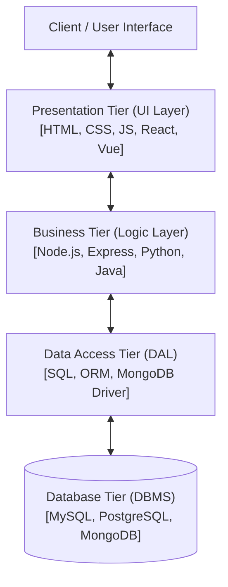
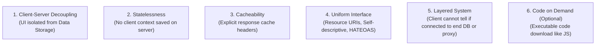

# Chapter 1: Full Stack Development Basics & Core Web Protocols


> **Course Title:** Full Stack Web Development (FSD)

> **Source Material:** `UNIT-1 Full Stack Development Basics.docx`, `UNIT-1 Full Stack Development Basics.pdf`, `UNIT-2 Frontend Frameworks.docx`


---


## 1. Chapter Overview

- **Core Full Stack Architecture:** Role distinctions, 3-tier enterprise separation, and modern web stacks (LAMP, MEAN, MERN, Django, Spring Boot, Serverless).

- **JSON Data Interchange:** Complete syntax rules, data types, nested/multidimensional structures, parsing/serialization, file I/O, dynamic updates, and data querying in JavaScript.

- **Node.js Core Fundamentals:** Event-driven non-blocking I/O, `http` module server creation, `fs` file operations, `path` resolution, middleware execution, and JSON REST API endpoint routing.

- **RESTful Architecture:** 6 architectural constraints, statelessness, HTTP verbs, MIME types, URI design rules, and status codes.


---


## 2. Fundamental Concepts & Terminology


### 2.1 Role Comparison: Front-End vs. Back-End vs. Full Stack


| Dimension | Front-End Developer | Back-End Developer | Full Stack Developer |
| :--- | :--- | :--- | :--- |
| **Primary Scope** | User Interface (UI), User Experience (UX), DOM presentation, client interactivity. | Business logic, server architecture, database management, security, API routing. | End-to-end web stack architecture (Client + Server + Database + API). |
| **Technology Stack** | HTML5, CSS3, JavaScript (ES6+), React, Vue, Bootstrap, Tailwind. | Node.js, Express, Python (Django), Java (Spring Boot), SQL/NoSQL databases. | Full stacks: MERN, MEAN, LAMP, Django, Serverless, Flutter/React Native. |
| **Data Handling** | Manipulates DOM; processes JSON API payloads received from server. | Constructs REST APIs, queries DBMS (SQL/NoSQL), manages state persistence. | Models database schemas, builds REST API payloads, and renders DOM views. |
| **Runtime Environment** | Web browser rendering engine (V8, SpiderMonkey, WebKit). | Node.js runtime, OS, Docker containers, Cloud server instances. | Complete web application topology across browser and server. |


---


### 2.2 The 3-Tier Enterprise Architecture Rules

- **Presentation Tier (UI Layer):** Handles user interaction and visual rendering. Communicates **strictly** with the Business Tier.

- **Business Tier (Logic Layer):** Enforces business rules, validation, and algorithms. Communicates **only** with Presentation Tier (upstream) and Data Access Tier (downstream). Must be Presentation-Agnostic and Database-Agnostic.

- **Data Access Tier (DAL / Database Layer):** Executes CRUD transactions against DBMS engines. Communicates **only** with Business Tier and DBMS.





---


## 3. JavaScript Object Notation (JSON) Engine & Full Code Operations


### 3.1 JSON Data Types Reference


| Data Type | Formal Structural Rule | Code Syntax Example |
| :--- | :--- | :--- |
| **String** | Double-quoted UTF-8 text string. | `"studentName": "Alice"` |
| **Number** | Integer or floating-point number (no quotes). | `"age": 22`, `"gpa": 3.85` |
| **Boolean** | Lowercase literal `true` or `false`. | `"isEnrolled": true` |
| **Null** | Lowercase literal `null` representing empty value. | `"middleName": null` |
| **Object** | Unordered key-value pairs wrapped in `{}`. Keys MUST be double-quoted strings. | `{"id": 101, "dept": "CS"}` |
| **Array** | Ordered sequence of values wrapped in `[]`. | `"grades": [88, 92, 95]` |


### 3.1.1 JSON Syntax Rules & Structure — Complete Example


A valid JSON object has **strictly double-quoted keys**, no trailing commas, and no JS functions/undefined values.


```json

{

  "student": {

    "id": 1001,

    "name": "Riya Sharma",

    "age": 21,

    "isEnrolled": true,

    "gpa": 8.75,

    "middleName": null,

    "subjects": ["FSD", "DBMS", "Networks"],

    "address": {

      "city": "Mumbai",

      "pincode": "400001"

    }

  }

}

```


**Rules at a glance:**

- ✅ Keys are **always** `"double-quoted"` strings

- ✅ Strings use `"double quotes"` — single quotes `'` are **invalid**

- ✅ Numbers, booleans (`true`/`false`), `null` — no quotes

- ❌ No trailing commas: `{"a": 1, "b": 2,}` — **invalid**

- ❌ No comments: `// this breaks JSON` — **invalid**

- ❌ No `undefined`, functions, or `Date` objects


**JSON vs JavaScript Object:**


| Feature | JSON | JS Object |
| :--- | :--- | :--- |
| Key quoting | Required: `"key"` | Optional: `key` or `"key"` |
| String quotes | Double only | Single or double |
| Trailing comma | ❌ Not allowed | ✅ Allowed |
| Comments | ❌ Not allowed | ✅ Allowed |
| Functions | ❌ Not allowed | ✅ Allowed |
| `undefined` | ❌ Not allowed | ✅ Allowed |


---


### 3.2 Master Code Guide: Complete JSON Operations in JavaScript / Node.js


#### A. JSON Stringification (`JSON.stringify`) & Custom Replacer

- `JSON.stringify(value, replacer, space)` converts JavaScript objects into valid JSON strings.

- `space`: Integer defining indent spacing for pretty-printing.

- `replacer`: Function or array filtering keys during serialization.


```javascript

const user = {

  id: 101,

  name: "Alice Johnson",

  passwordHash: "secret_hash_9823",

  roles: ["admin", "editor"],

  profile: { age: 24, email: "alice@example.com" }

};


// 1. Basic Stringification

const jsonCompact = JSON.stringify(user);

console.log("Compact JSON:", jsonCompact);


// 2. Pretty-Printed JSON (4-space indentation)

const jsonPretty = JSON.stringify(user, null, 4);

console.log("Pretty JSON:\n", jsonPretty);


// 3. Stringification with Replacer Array (Filter specific sensitive keys)

const jsonFiltered = JSON.stringify(user, ["id", "name", "roles"], 2);

console.log("Filtered JSON:\n", jsonFiltered);


// 4. Stringification with Replacer Function (Mask sensitive attributes dynamically)

const jsonCustom = JSON.stringify(user, (key, value) => {

  if (key === "passwordHash") return undefined; // Omits passwordHash key

  if (typeof value === "string") return value.toUpperCase();

  return value;

}, 2);

console.log("Custom Replacer JSON:\n", jsonCustom);

```


> [!WARNING]

> **Common Mistake:** `localStorage.setItem("user", userObj)` silently stores `"[object Object]"`.

> Always call `JSON.stringify()` first: `localStorage.setItem("user", JSON.stringify(userObj))`.


---


#### B. JSON Parsing (`JSON.parse`) & Custom Reviver

- `JSON.parse(text, reviver)` transforms a JSON string into a JavaScript object.

- `reviver`: Function executing custom transformations on every parsed key-value pair (e.g. converting ISO date strings back to JavaScript `Date` instances).


```javascript

const rawJson = `{

  "orderId": "ORD-58392",

  "amount": 249.99,

  "createdAt": "2026-09-03T10:30:00.000Z",

  "status": "completed"

}`;


// 1. Basic Parsing

const orderObj = JSON.parse(rawJson);

console.log("Parsed Amount:", orderObj.amount); // 249.99 (number)


// 2. Parsing with Reviver Function (Automatic Date Typecasting)

const orderWithDates = JSON.parse(rawJson, (key, value) => {

  if (key === "createdAt") return new Date(value); // Converts string to Date instance

  if (key === "amount") return "$" + value.toFixed(2); // Formats currency without template literals

  return value;

});


console.log("Parsed Date Object:", orderWithDates.createdAt.toISOString());

console.log("Formatted Currency Amount:", orderWithDates.amount);


// 3. Safe Parse with try-catch (Always wrap JSON.parse!)

function safeParse(jsonString) {

  try {

    return JSON.parse(jsonString);

  } catch (err) {

    console.error("Invalid JSON:", err.message);

    return null;

  }

}

safeParse('{"name": "ok"}');  // Works

safeParse("not json at all"); // Returns null gracefully

```


---


#### C. Asynchronous File I/O for JSON (`fs.promises` in Node.js)


```javascript

const fs = require('fs').promises;

const path = require('path');


const filePath = path.join(__dirname, 'data.json');


// 1. Asynchronous Write JSON File

async function writeJsonFile(data) {

  try {

    const jsonString = JSON.stringify(data, null, 2);

    await fs.writeFile(filePath, jsonString, 'utf8');

    console.log("JSON successfully written to file!");

  } catch (err) {

    console.error("Error writing JSON file:", err.message);

  }

}


// 2. Asynchronous Read & Parse JSON File

async function readJsonFile() {

  try {

    const rawData = await fs.readFile(filePath, 'utf8');

    const parsedData = JSON.parse(rawData);

    console.log("Successfully read JSON file:", parsedData);

    return parsedData;

  } catch (err) {

    if (err.code === 'ENOENT') {

      console.warn("File not found, initializing empty dataset.");

      return [];

    } else if (err instanceof SyntaxError) {

      console.error("Malformed JSON syntax in file!");

    } else {

      console.error("Error reading JSON file:", err.message);

    }

    return null;

  }

}


// Execution Workflow

(async () => {

  const initialData = { store: "TechStore", items: [{ id: 1, name: "Laptop", price: 999 }] };

  await writeJsonFile(initialData);

  await readJsonFile();

})();

```


---


#### D. `fetch()` API — Consuming JSON from REST APIs (Browser)


The `fetch()` API is the standard browser mechanism for making HTTP requests and consuming JSON responses. It returns a **Promise**.


**Fetch Lifecycle:**

```

fetch(url, options) → Promise<Response> → response.json() → Promise<Object>

```


##### D1. GET Request — Fetch & Display JSON


```javascript

// Simple GET: Fetch a list of users from a public API

fetch("https://jsonplaceholder.typicode.com/users")

  .then(response => {

    // Step 1: Check HTTP status (response.ok is true for 200-299)

    if (!response.ok) {

      throw new Error(`HTTP Error: ${response.status}`);

    }

    // Step 2: Parse response body as JSON (also returns a Promise)

    return response.json();

  })

  .then(users => {

    // Step 3: Work with the parsed data array

    console.log("Total users:", users.length);

    users.forEach(user => {

      console.log(`${user.id}: ${user.name} — ${user.email}`);

    });

  })

  .catch(err => {

    console.error("Fetch failed:", err.message);

  });

```


##### D2. GET with `async/await` — Recommended Pattern


```javascript

async function fetchUsers() {

  try {

    const response = await fetch("https://jsonplaceholder.typicode.com/users");


    if (!response.ok) {

      throw new Error(`HTTP Error: Status ${response.status}`);

    }


    const users = await response.json(); // Parses JSON body

    console.log("Users loaded:", users.length);

    console.log("First user:", users[0].name);

    return users;


  } catch (err) {

    console.error("Error fetching users:", err.message);

    return [];

  }

}


fetchUsers();

```


##### D3. POST Request — Sending JSON Body to API


```javascript

async function createPost(title, body, userId) {

  try {

    const newPost = { title, body, userId };


    const response = await fetch("https://jsonplaceholder.typicode.com/posts", {

      method: "POST",                          // HTTP Method

      headers: {

        "Content-Type": "application/json",    // Tell server we're sending JSON

        "Accept": "application/json"           // Tell server we want JSON back

      },

      body: JSON.stringify(newPost)            // Serialize JS object to JSON string

    });


    if (!response.ok) {

      throw new Error(`POST failed: ${response.status}`);

    }


    const createdPost = await response.json(); // Parse response

    console.log("Created Post:", createdPost);

    // Output: { id: 101, title: "...", body: "...", userId: 1 }

    return createdPost;


  } catch (err) {

    console.error("Error creating post:", err.message);

  }

}


createPost("My First Post", "Hello World content", 1);

```


##### D4. PUT & DELETE Requests


```javascript

// PUT — Full replacement update

async function updateUser(userId, updatedData) {

  const response = await fetch(`https://jsonplaceholder.typicode.com/users/${userId}`, {

    method: "PUT",

    headers: { "Content-Type": "application/json" },

    body: JSON.stringify(updatedData)

  });

  const result = await response.json();

  console.log("Updated User:", result);

}

updateUser(1, { name: "Alice Updated", email: "alice@new.com" });


// DELETE — Remove a resource

async function deleteUser(userId) {

  const response = await fetch(`https://jsonplaceholder.typicode.com/users/${userId}`, {

    method: "DELETE"

  });

  if (response.ok) {

    console.log(`User ${userId} deleted. Status: ${response.status}`);

  }

}

deleteUser(3);

```


##### D5. fetch() Options Reference


| Option | Type | Example | Purpose |
| :--- | :--- | :--- | :--- |
| `method` | string | `"GET"`, `"POST"`, `"PUT"`, `"DELETE"` | HTTP verb |
| `headers` | object | `{ "Content-Type": "application/json" }` | Request headers |
| `body` | string | `JSON.stringify(data)` | Payload (POST/PUT only) |
| `signal` | AbortSignal | `controller.signal` | Cancels in-flight requests |
| `mode` | string | `"cors"`, `"no-cors"`, `"same-origin"` | CORS policy |
| `credentials` | string | `"include"`, `"omit"`, `"same-origin"` | Cookie handling |


##### D6. Response Object Reference


```javascript

const response = await fetch(url);


response.ok;         // Boolean: true if status 200–299

response.status;     // Number: e.g. 200, 201, 404, 500

response.statusText; // String: e.g. "OK", "Not Found"

response.headers;    // Headers object — response.headers.get("Content-Type")

response.url;        // Final URL after redirects


// Body reading methods (can only be called ONCE — body stream consumed):

await response.json();   // Parse body as JSON → JavaScript object

await response.text();   // Parse body as plain string

await response.blob();   // Parse body as Blob (binary/image/file)

```


> [!IMPORTANT]

> `response.json()` can only be called **once** per response — the body stream is consumed on first read. Always store the result in a variable.


##### D7. fetch with Query Parameters & AbortController


```javascript

// Query Parameters

const params = new URLSearchParams({ category: "Electronics", limit: 10 });

const response = await fetch(`/api/products?${params.toString()}`);

// Requests: /api/products?category=Electronics&limit=10


// AbortController (cancel on timeout)

const controller = new AbortController();

setTimeout(() => controller.abort(), 5000); // Cancel after 5s


try {

  const res = await fetch("/api/slow", { signal: controller.signal });

  const data = await res.json();

} catch (err) {

  if (err.name === "AbortError") console.warn("Request cancelled!");

}

```


---


#### E. Complete Dynamic JSON Manipulation (CRUD Operations in Memory)


```javascript

// Sample JSON Database

let database = {

  users: [

    { id: 1, name: "John Doe", email: "john@example.com", tags: ["tech", "sports"], address: { city: "New York", zip: "10001" } },

    { id: 2, name: "Jane Smith", email: "jane@example.com", tags: ["design"], address: { city: "San Francisco", zip: "94101" } }

  ],

  meta: { totalCount: 2, version: "1.0" }

};


// --- 1. CREATE (Insert New User) ---

function addUser(newUser) {

  database.users.push(newUser);

  database.meta.totalCount = database.users.length;

  console.log("User Added. New Count:", database.meta.totalCount);

}


addUser({ id: 3, name: "Bob Martin", email: "bob@example.com", tags: ["devops"], address: { city: "Chicago", zip: "60601" } });


// --- 2. READ / FIND (Querying JSON Data) ---

// Find user by ID

const user = database.users.find(u => u.id === 2);

console.log("Found User:", user ? user.name : "Not Found");


// Filter users by city (Nested object lookup)

const sfUsers = database.users.filter(u => u.address.city === "San Francisco");

console.log("Users in SF:", sfUsers.map(u => u.name));


// Filter users by tag (Array inclusion lookup)

const techUsers = database.users.filter(u => u.tags.includes("tech"));

console.log("Tech Users:", techUsers.map(u => u.name));


// --- 3. UPDATE (Modify Existing Properties & Deep Nested Attributes) ---

function updateUser(id, updatedFields) {

  const index = database.users.findIndex(u => u.id === id);

  if (index !== -1) {

    // Deep merge address if provided, shallow merge remaining fields

    if (updatedFields.address) {

      database.users[index].address = { ...database.users[index].address, ...updatedFields.address };

      delete updatedFields.address;

    }

    database.users[index] = { ...database.users[index], ...updatedFields };

    console.log(`User ${id} Updated Successfully!`);

  }

}


updateUser(1, { email: "john_new@example.com", address: { zip: "10002" } });

console.log("Updated User 1:", database.users[0]);


// --- 4. DELETE (Remove Attributes & Delete User Objects) ---

function deleteUser(id) {

  database.users = database.users.filter(u => u.id !== id);

  database.meta.totalCount = database.users.length;

  console.log(`User ${id} Deleted. New Count:`, database.meta.totalCount);

}


deleteUser(2);

console.log("Final Database Users:", database.users.map(u => u.name));

```


---


## 4. Node.js Core Architecture & Server Execution


### 4.1 Node.js Core Modules Reference


| Core Module | Primary Purpose & Capabilities | Example Function Signatures |
| :--- | :--- | :--- |
| `http` | Creating low-level HTTP web servers, parsing incoming requests, sending HTTP response headers/bodies. | `http.createServer((req, res) => {})` |
| `fs` | File system operations (reading, writing, appending, deleting, streaming files synchronously or asynchronously). | `fs.readFile()`, `fs.writeFile()`, `fs.promises` |
| `path` | Cross-platform file path resolution, normalization, extension extraction (`.join()`, `.resolve()`, `.extname()`). | `path.join(__dirname, 'public', 'index.html')` |
| `url` | Parsing URL query strings, protocol parameters, and pathnames. | `new URL(req.url, 'http://localhost:3000')` |


---


### 4.2 Master Node.js HTTP Server & JSON REST API Implementation


```javascript

const http = require('http');

const path = require('path');

const url = require('url');


// In-Memory JSON Database

let products = [

  { id: 1, name: "Wireless Mouse", price: 29.99, category: "Electronics" },

  { id: 2, name: "Mechanical Keyboard", price: 89.99, category: "Electronics" },

  { id: 3, name: "Ergonomic Chair", price: 199.99, category: "Furniture" }

];


// Helper: Parse JSON Body from Incoming HTTP Request Stream

function getRequestBody(req) {

  return new Promise((resolve, reject) => {

    let body = '';

    req.on('data', chunk => { body += chunk.toString(); });

    req.on('end', () => {

      try {

        resolve(body ? JSON.parse(body) : {});

      } catch (err) {

        reject(new SyntaxError('Invalid JSON Payload'));

      }

    });

    req.on('error', err => reject(err));

  });

}


// Helper: Send JSON Response

function sendJsonResponse(res, statusCode, data) {

  res.writeHead(statusCode, {

    'Content-Type': 'application/json',

    'Access-Control-Allow-Origin': '*', // CORS Header

    'Access-Control-Allow-Methods': 'GET, POST, PUT, DELETE, OPTIONS'

  });

  res.end(JSON.stringify(data, null, 2));

}


// Create HTTP Web Server

const server = http.createServer(async (req, res) => {

  const parsedUrl = url.parse(req.url, true);

  const pathname = parsedUrl.pathname;

  const method = req.method;


  // Handle CORS Preflight OPTIONS Request

  if (method === 'OPTIONS') {

    res.writeHead(204, {

      'Access-Control-Allow-Origin': '*',

      'Access-Control-Allow-Methods': 'GET, POST, PUT, DELETE, OPTIONS',

      'Access-Control-Allow-Headers': 'Content-Type'

    });

    return res.end();

  }


  // --- ROUTE 1: GET /api/products (Fetch All Products or Filter by Category Query) ---

  if (method === 'GET' && pathname === '/api/products') {

    const categoryQuery = parsedUrl.query.category;

    if (categoryQuery) {

      const filtered = products.filter(p => p.category.toLowerCase() === categoryQuery.toLowerCase());

      return sendJsonResponse(res, 200, { success: true, count: filtered.length, data: filtered });

    }

    return sendJsonResponse(res, 200, { success: true, count: products.length, data: products });

  }


  // --- ROUTE 2: GET /api/products/:id (Fetch Single Product by ID) ---

  if (method === 'GET' && pathname.startsWith('/api/products/')) {

    const id = parseInt(pathname.split('/')[3], 10);

    const product = products.find(p => p.id === id);

    if (!product) {

      return sendJsonResponse(res, 404, { success: false, error: `Product with ID ${id} not found.` });

    }

    return sendJsonResponse(res, 200, { success: true, data: product });

  }


  // --- ROUTE 3: POST /api/products (Create New Product) ---

  if (method === 'POST' && pathname === '/api/products') {

    try {

      const body = await getRequestBody(req);

      if (!body.name || !body.price) {

        return sendJsonResponse(res, 400, { success: false, error: 'Name and price are required fields.' });

      }

      const newProduct = {

        id: products.length > 0 ? Math.max(...products.map(p => p.id)) + 1 : 1,

        name: body.name,

        price: parseFloat(body.price),

        category: body.category || 'General'

      };

      products.push(newProduct);

      return sendJsonResponse(res, 201, { success: true, message: 'Product Created', data: newProduct });

    } catch (err) {

      return sendJsonResponse(res, 400, { success: false, error: err.message });

    }

  }


  // --- ROUTE 4: DELETE /api/products/:id (Delete Product by ID) ---

  if (method === 'DELETE' && pathname.startsWith('/api/products/')) {

    const id = parseInt(pathname.split('/')[3], 10);

    const index = products.findIndex(p => p.id === id);

    if (index === -1) {

      return sendJsonResponse(res, 404, { success: false, error: `Product with ID ${id} not found.` });

    }

    const deleted = products.splice(index, 1)[0];

    return sendJsonResponse(res, 200, { success: true, message: 'Product Deleted', data: deleted });

  }


  // Fallback 404 Route

  sendJsonResponse(res, 404, { success: false, error: 'Endpoint URI path not found.' });

});


// Start Server on Port 3000

const PORT = 3000;

server.listen(PORT, () => {

  console.log(`Node.js REST API Server running live at http://localhost:${PORT}`);

});

```


---


## 5. REpresentational State Transfer (REST) Architecture & HTTP Details


### 5.1 The 6 Core Constraints of REST





1. **Client-Server Separation:** UI presentation is fully isolated from backend data storage.

2. **Statelessness:** Every request must contain complete authentication and contextual information. The server stores no session state.

3. **Cacheability:** Responses must explicitly declare cache policy (`Cache-Control`, `ETag`).

4. **Uniform Interface:** Standardized URIs identify resources (`/customers/102`); hypermedia links (`HATEOAS`) guide state transitions.

5. **Layered System:** Intermediaries (load balancers, cache proxies) can be inserted transparently.

6. **Code-on-Demand (Optional):** Servers can send executable code (e.g. JavaScript) to clients.


---


### 5.2 RESTful HTTP Operations Matrix


| Verb | CRUD Mapping | Operational Description | Idempotent? | Safe? | Expected Success Code |
| :--- | :--- | :--- | :--- | :--- | :--- |
| **GET** | Read | Fetches resource or collection without modifying server state. | Yes | Yes | `200 OK` |
| **POST** | Create | Creates a new resource within a collection. | No | No | `201 CREATED` |
| **PUT** | Update / Replace | Replaces an entire target resource or creates it if absent. | Yes | No | `200 OK` / `201 CREATED` |
| **DELETE**| Delete | Removes a specific target resource by ID. | Yes | No | `204 NO CONTENT` |


---


### 5.3 Standard HTTP Status Codes


| Code Range | Category | Code & Name | Technical Application Context |
| :--- | :--- | :--- | :--- |
| **2xx** | Success | `200 OK` | Standard success for GET, PUT, or PATCH. |
| | | `201 CREATED` | Resource created successfully via POST. |
| | | `204 NO CONTENT` | Action succeeded; response body intentionally empty (DELETE). |
| **4xx** | Client Error | `400 BAD REQUEST` | Payload syntax error or missing mandatory parameters. |
| | | `401 UNAUTHORIZED` | Authentication required or token invalid. |
| | | `403 FORBIDDEN` | Authenticated, but lacks required role permissions. |
| | | `404 NOT FOUND` | Requested URI resource path does not exist. |
| **5xx** | Server Error | `500 INTERNAL SERVER ERROR` | Unhandled server exception or runtime crash. |


---


## 6. Formula Sheet


- **REST Idempotency Mathematical Operator Rule:**


$$
f(f(x)) = f(x)
$$


- **JSON Serialization Memory Footprint Ratio:**


$$
\text{Memory Overhead} = \frac{\text{JSON String Size (Bytes)}}{\text{Raw Binary Data Size (Bytes)}} \times 100\%
$$


---


## 7. Definition Sheet


1. **Full Stack Developer:** An engineer capable of designing, building, and deploying software across client UI, server logic, APIs, and database tiers.

2. **3-Tier Architecture:** Software architecture dividing application logic into Presentation, Business, and Data Access tiers.

3. **JSON:** A lightweight, text-based, human-readable data interchange format derived from JavaScript object literals.

4. **JSON.parse():** JavaScript method transforming a JSON-formatted string into a live JavaScript object.

5. **JSON.stringify():** JavaScript method serializing a JavaScript object into a JSON string.

6. **Node.js:** An open-source, cross-platform, single-threaded asynchronous JavaScript runtime built on Chrome's V8 engine.

7. **REST:** REpresentational State Transfer; an architectural style defining constraints for stateless web services.

8. **HATEOAS:** Hypermedia as the Engine of Application State; a REST constraint where hypermedia links inside response payloads guide client actions.


---


## 8. Exam-Oriented Review


1. Detail the 3-tier enterprise architecture rules. Explain why the Business Tier must be Presentation-Agnostic and Database-Agnostic.

2. Write runnable JavaScript code demonstrating how to perform CRUD operations on an in-memory JSON array of objects.

3. Write a complete Node.js HTTP server using core modules (`http`, `url`) that parses JSON POST bodies and serves REST requests.

4. List the 6 REST architectural constraints. Explain idempotency for GET, POST, PUT, and DELETE methods.

