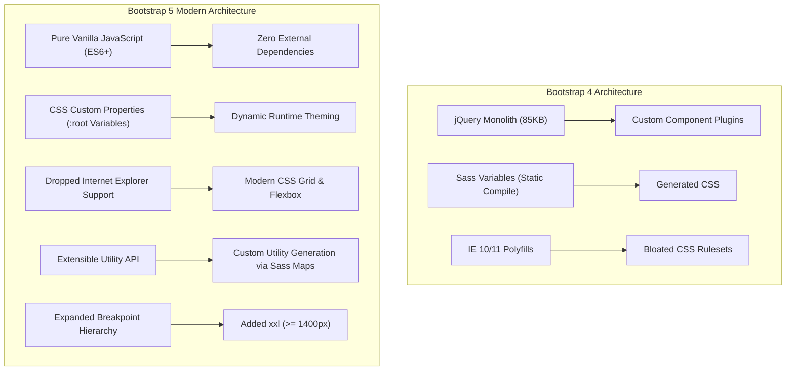
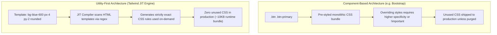
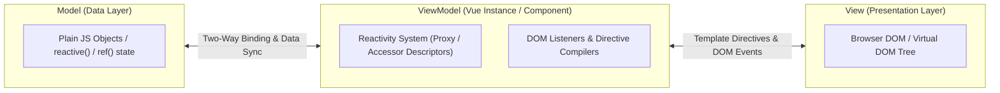
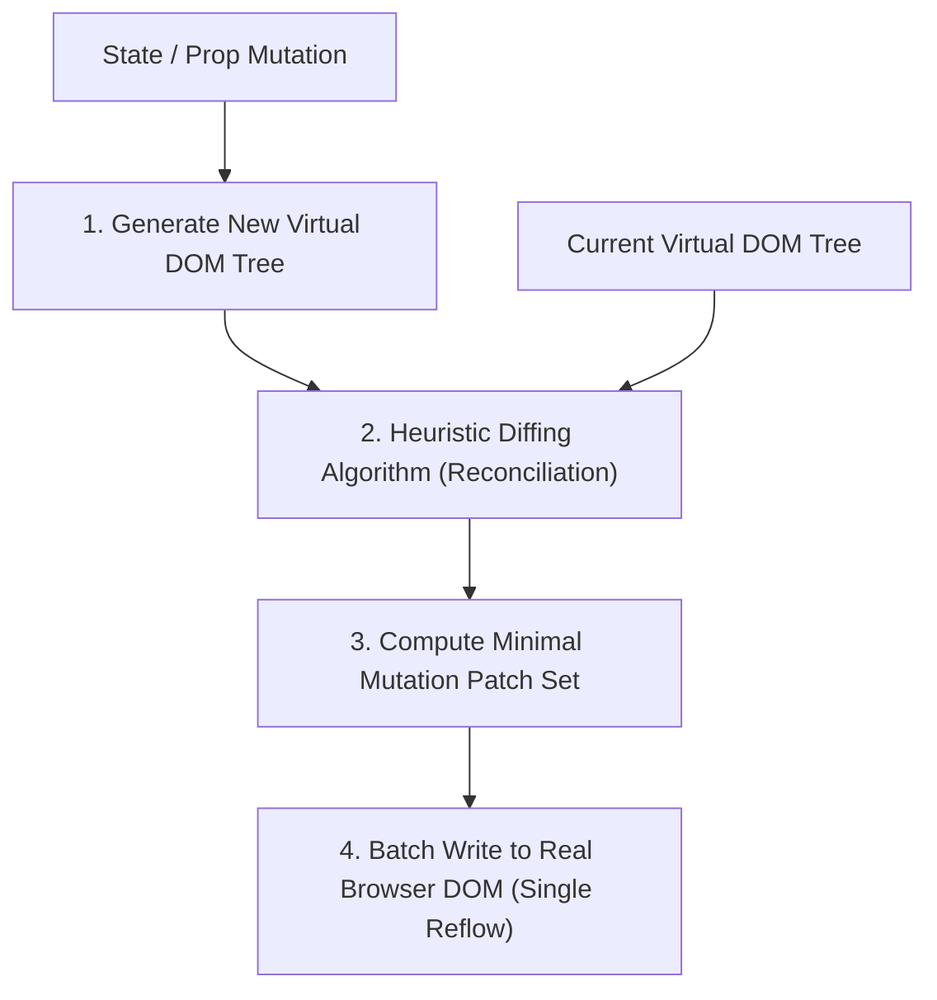
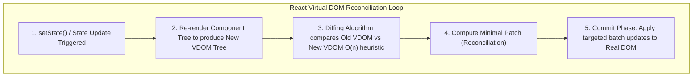
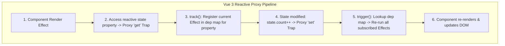
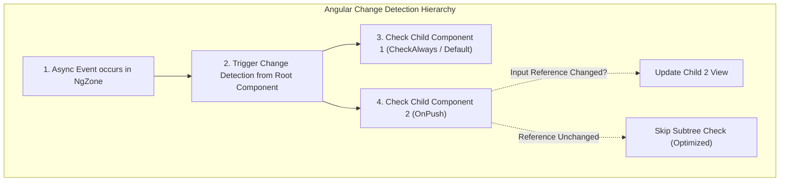

# Chapter 2: Unit 02 — Frontend Frameworks

# Full Stack Web Development (FSD) — Unit 2: Frontend Frameworks & Responsive Architecture

**Course:** Full Stack Web Development (FSD)  
**Units Covered:** Unit 2 — Frontend Frameworks, Responsive Web Design & Modern Client-Side Engineering  
**Primary Sources:** `UNIT-2 Frontend Frameworks.docx`, `UNIT-2 Frontend Frameworks (1).docx`, `unit2code/` (33 interactive implementation files)  
**Complementary Sources:** `UNIT-1 Full Stack Development Basics.docx`, `UNIT-1 Full Stack Development Basics.pdf`  
**Quality Bar:** Exhaustive textbook-style study notes with zero information loss, comprehensive reference tables listing every class and directive option, mathematical formulations, edge-case failure mode analyses, and live embedded interactive `<iframe>` visual sandboxes.

---

# Pre-Generation File-to-Topic Source Mapping

| Source Artifact | Topic Domain | Key Concepts Extracted | Role in Study Notes |
| :--- | :--- | :--- | :--- |
| `UNIT-2 Frontend Frameworks.docx` | Responsive Design, HTML5, Bootstrap 5, Tailwind CSS, Vue.js, React.js | Viewport meta, responsive images (`<picture>`), `<video>`, `<audio>`, Geolocation, Web Storage, Drag & Drop, Bootstrap 5 architecture & grid, Tailwind utility engine, Vue 2/3 directives & custom directives, React Virtual DOM & hooks | Primary Lecture Curriculum Source |
| `unit2code/BS-Grid.html`, `Demo-Container-breakpoint.html`, `demoContainer.html` | Bootstrap 5 Layouts | Container breakpoints (`sm` to `xxl`), 12-column grid system, auto-layout columns, gutter spacing | Layout & Container Reference Implementation |
| `unit2code/Utility-Tailwind.html`, `imageEffect.html`, `textEffect.html` | Tailwind CSS Utilities | Utility classes, typography scales, spacing units, responsive prefixes, image filters (`blur`, `grayscale`, `scale`) | Tailwind Utility Engine Implementation |
| `unit2code/Vue-Demo1.html`, `Student-record.html`, `sample-Vue.html`, `shoppingcart.html`, `shoppingcardJSON.html` | Vue.js Reactivity & Directives | `v-model`, `v-for`, `v-if`, `v-show`, `v-bind`, Composition API (`createApp`, `setup`, `ref`), reactive shopping cart, dynamic array manipulation | Vue.js Reactivity & Directives Implementation |
| `unit2code/Demo2.html` - `Demo7-media-print.html`, `speechapi.html` | Responsive Media & HTML5 APIs | Fluid width vs max-width, `<picture>` responsive art direction, `@media` print/screen queries, Web Speech Synthesis API | RWD & HTML5 Media Implementations |

---

# Unit 2 — Frontend Frameworks & Responsive Architecture

## 1. Chapter Overview
Unit 2 addresses the engineering principles, architectural patterns, and practical implementation libraries underpinning modern client-side web application development. It encompasses:
- Responsive Web Design (RWD) foundations: Viewport meta configurations, fluid grid equations, responsive imagery paradigms (`max-width` vs `width: 100%`, art direction with `<picture>`), viewport typography units (`vw`, `vh`), and multi-condition CSS3 media queries.
- HTML5 Next-Generation Platform APIs: Native multimedia audio/video streaming tags, semantic outline containers (`<header>`, `<footer>`, `<figure>`, `<figcaption>`), programmatic raster graphics (`<canvas>`), `<progress>`, browser Geolocation, client-side Web Storage engines (LocalStorage vs SessionStorage), and the native HTML5 Drag and Drop event lifecycle.
- Bootstrap 5 Architecture & Utility Engine: Evolution from jQuery-dependent monoliths to pure vanilla JS, Subresource Integrity (SRI) CDN authentication vs compiled offline deployment, 6-tier container breakpoint step functions, the 12-column flexbox grid matrix, gutter mechanics, and an exhaustive reference of all utility classes (spacing, colors, typography, flex alignments, borders, and UI components).
- Tailwind CSS Utility-First Architecture: Just-In-Time (JIT) compilation mechanics, purging unused CSS trees, an exhaustive reference catalog of core utility classes (spacing scales, fractional widths, typography hierarchies, arbitrary bracket syntax, opacity, gradients, flex/grid layouts), state variants, and responsive prefixes.
- Vue.js Declarative Rendering & Reactivity Engine: MVVM architecture, Single Page Application (SPA) paradigms, exhaustive breakdown of all 15 built-in directives (`v-bind`, `v-model`, `v-for`, `v-if`, `v-show`, etc.), event and keycode modifiers, deep dive into Custom Directives across Vue 2 and Vue 3 lifecycle hooks, and Options API vs Composition API (`createApp`, `setup`, `ref`).
- React JS Component Architecture: Virtual DOM reconciliation, $O(n)$ heuristic diffing mechanics, functional components vs class components, Hook lifecycles (`useState`, `useEffect` dependency arrays and cleanup functions), and asynchronous REST API integration.
- Critical Edge Cases & Failure Modes across all frameworks, comparative decision matrices, mathematical formulas, comprehensive glossaries, and live embedded interactive `<iframe>` visual sandboxes.

[Source: `UNIT-2 Frontend Frameworks.docx`, Section 1]

---

## 2. Responsive Web Design (RWD) & Adaptive Layouts

### 2.1 Viewport Configuration Mechanics
In mobile and tablet browsers, the default viewport is simulated as a desktop monitor (typically $980\text{px}$) and downscaled, resulting in unreadable text and tiny touch targets. The HTML5 `<meta name="viewport">` tag explicitly overrides this behavior by setting the layout viewport to the physical device width.

#### Viewport Meta Tag Syntax
```html
<meta name="viewport" content="width=device-width, initial-scale=1.0, minimum-scale=1.0, maximum-scale=5.0, user-scalable=yes">
```

#### Master Configuration Attributes Table

| Viewport Directive | Permissible Values | Default Value | Functional Role & Technical Behavior |
| :--- | :--- | :--- | :--- |
| `width` | `device-width` or integer in px (e.g. `1024`) | `980px` (mobile default) | Sets the logical viewport width in CSS pixels to match the physical device width. |
| `height` | `device-height` or integer in px | Auto / viewport height | Defines the logical viewport height in CSS pixels. |
| `initial-scale` | Float between `0.1` and `10.0` (typically `1.0`) | `1.0` (with meta) | Establishes the 1:1 zoom ratio between CSS pixels and device-independent pixels upon page load. |
| `minimum-scale` | Float between `0.1` and `10.0` | `0.1` | Constrains the maximum zoom-out level permissible for the user. |
| `maximum-scale` | Float between `0.1` and `10.0` | `10.0` | Constrains the maximum zoom-in magnification permissible for the user. |
| `user-scalable` | `yes` (1) or `no` (0) | `yes` | Controls whether the end user can pinch-to-zoom the interface. |

[Source: `UNIT-2 Frontend Frameworks.docx`, Section 1]

---

### 2.2 Responsive Image Strategies: Fluid Width vs Max-Width vs Picture Element

#### Technique A: Fluid `width: 100%` vs Constrained `max-width: 100%`
- Setting `style="width: 100%;"` forces the image to strictly span $100\%$ of its parent container. **Critical Pitfall:** If the container is wider than the image's native resolution, the image upscales, pixelates, and degrades visual quality.
- Setting `style="max-width: 100%; height: auto;"` enables the image to scale down responsively when the parent container narrows, but **prevents it from ever stretching beyond its original intrinsic pixel width**. `height: auto` maintains the intrinsic aspect ratio, preventing vertical distortion.

```html
<!-- Scales down, but never expands beyond native pixel boundaries -->

```

#### Technique B: Art Direction with HTML5 `<picture>` Element
When mobile layouts require not merely a scaled-down asset, but a cropped, differently composed image (e.g., a square close-up instead of a wide panoramic banner), the `<picture>` element provides multi-source media querying.

```html
<picture>
  <!-- Rendered on viewports <= 600px -->
  <source srcset="img_smallflower.jpg" media="(max-width: 600px)">
  <!-- Rendered on viewports <= 1500px -->
  <source srcset="img_flowers.jpg" media="(max-width: 1500px)">
  <!-- Fallback image rendered on desktop screens > 1500px or unsupported browsers -->
  
</picture>
```

[Source: `UNIT-2 Frontend Frameworks.docx`, Section 1; `unit2code/Demo2.html`, `Demo3.html`]

---

### 2.3 Viewport Typography Units: Mathematical Scaling
Viewport units enable text and UI dimensions to scale continuously with the browser window dimensions rather than jumping at discrete media query thresholds.

#### Master Viewport Units Reference Table

| Unit Identifier | Exact Mathematical Basis | Conversion Example ($1920 \times 1080\text{px}$ Display) | Primary Application |
| :--- | :--- | :--- | :--- |
| `1vw` | $1\%$ of total viewport browser width | $1\text{vw} = 19.2\text{px}$ | Fluid fluid typography, responsive banner widths. |
| `1vh` | $1\%$ of total viewport browser height | $1\text{vh} = 10.8\text{px}$ | Full-screen hero sections (`min-height: 100vh`), modal heights. |
| `1vmin` | $1\%$ of minimum between width and height | $\min(19.2\text{px}, 10.8\text{px}) = 10.8\text{px}$ | Square components that must fit viewport in both orientations. |
| `1vmax` | $1\%$ of maximum between width and height | $\max(19.2\text{px}, 10.8\text{px}) = 19.2\text{px}$ | Dynamic background sizing across orientation flips. |

```html
<!-- Scales dynamically with browser viewport width -->
<h1 style="font-size: 8vw; margin: 0; color: #1e293b;">Fluid Headline</h1>
<p style="font-size: 2.5vw; color: #64748b;">Dynamic body copy scaling at 2.5% of browser width.</p>
```

[Source: `UNIT-2 Frontend Frameworks.docx`, Section 1; `unit2code/Demo5.html`]

---

### 2.4 CSS3 Media Queries: Multi-Condition Syntax
Media queries conditionally apply CSS style blocks based on target device media types (`screen`, `print`, `speech`, `all`) and physical feature expressions.

#### Master Media Query Features Table

| Feature Expression | Valid Values | Operational Purpose | Example Syntax |
| :--- | :--- | :--- | :--- |
| `min-width` | Integer px / rem / em | Applies styles when viewport width $\ge$ threshold (Mobile-first). | `@media screen and (min-width: 768px)` |
| `max-width` | Integer px / rem / em | Applies styles when viewport width $\le$ threshold (Desktop-down). | `@media screen and (max-width: 576px)` |
| `orientation` | `portrait`, `landscape` | Triggers based on whether height $>$ width or width $>$ height. | `@media (orientation: landscape)` |
| `resolution` | `dpi`, `dpcm`, `dppx` | Detects high-density Retina displays ($>192\text{dpi}$ or $2\text{dppx}$). | `@media (min-resolution: 2dppx)` |
| `prefers-color-scheme` | `light`, `dark` | Queries OS-level dark mode preference. | `@media (prefers-color-scheme: dark)` |
| `print` | N/A (media type) | Strips navigation, sets high contrast, formats pages for print. | `@media print` |

```css
/* Mobile-first base styles */
body {
  font-family: system-ui, sans-serif;
  background-color: #f8fafc;
  color: #0f172a;
}

/* Tablet screens and above */
@media screen and (min-width: 768px) {
  body { background-color: #e0f2fe; }
  .grid-layout { display: flex; gap: 20px; }
}

/* Print stylesheet overrides */
@media print {
  nav, footer, .no-print { display: none !important; }
  body { background: #fff !important; color: #000 !important; font-size: 12pt; }
}
```

[Source: `UNIT-2 Frontend Frameworks.docx`, Section 1; `unit2code/Demo6.html`, `Demo7-media-print.html`]

---

### 2.5 Edge Cases & Critical Pitfalls in Responsive Web Design

> [!CAUTION]
> **Edge Case 1: The `user-scalable=no` Accessibility Violation**  
> Disabling user zoom via `<meta name="viewport" content="width=device-width, user-scalable=no, maximum-scale=1.0">` violates Web Content Accessibility Guidelines (WCAG 2.1 Success Criterion 1.4.4 - Resize Text). It blocks visually impaired users from zooming text to $200\%$ and causes mobile browser engines (including iOS Safari) to forcibly ignore the attribute in modern versions. **Resolution:** Always permit user scaling up to at least `maximum-scale=5.0`.

> [!WARNING]
> **Edge Case 2: Cumulative Layout Shift (CLS) on Responsive Images**  
> Specifying only `style="max-width: 100%; height: auto;"` without explicit HTML `width` and `height` attributes causes Cumulative Layout Shift. When the HTML parser encounters the `` tag without dimensions, it allocates $0\text{px}$ height initially. When the network returns the decoded image, the browser recalculates geometry, violently shifting following text downward.  
> **Resolution:** Always specify intrinsic HTML attributes alongside CSS:  
> ``. This reserves layout aspect-ratio space prior to download.

> [!NOTE]
> **Edge Case 3: Extreme Viewport Scaling on 4K Monitors and Smartwatches**  
> Pure viewport units like `font-size: 6vw` cause catastrophic UI failures at scale extremes: on a 4K monitor ($3840\text{px}$ wide), `6vw` equals $230.4\text{px}$ (unusable giant text), whereas on an Apple Watch ($320\text{px}$ wide), `6vw` yields $19.2\text{px}$.  
> **Resolution:** Utilize the CSS mathematical function `clamp(min, preferred, max)`:  
> `font-size: clamp(1rem, 2.5vw + 0.5rem, 2.75rem);`.

---

### 2.6 Live Interactive Visualization: Responsive Web Design Sandbox
The sandboxed `<iframe>` below demonstrates live responsive image scaling, viewport unit calculations, and responsive media query breakpoint simulation in real time.

```html
<iframe srcdoc='<!DOCTYPE html>
<html lang="en">
<head>
  <meta charset="utf-8">
  <meta name="viewport" content="width=device-width, initial-scale=1">
  <style>
    body { font-family: system-ui, -apple-system, sans-serif; margin: 0; padding: 16px; background: #f8fafc; color: #1e293b; }
    .card { background: white; border-radius: 8px; padding: 16px; margin-bottom: 16px; border: 1px solid #e2e8f0; box-shadow: 0 2px 4px rgba(0,0,0,0.05); }
    .fluid-title { font-size: clamp(1.2rem, 3.5vw, 2.2rem); font-weight: 700; color: #0284c7; margin-top: 0; }
    .res-box { width: 100%; height: 80px; border-radius: 6px; display: flex; align-items: center; justify-content: center; font-weight: 600; color: white; transition: background-color 0.3s; }
    /* Media query demonstration */
    @media (max-width: 500px) { .res-box { background-color: #ef4444; } .res-box::after { content: " (Mobile <=500px: Red)"; } }
    @media (min-width: 501px) and (max-width: 800px) { .res-box { background-color: #f59e0b; } .res-box::after { content: " (Tablet 501-800px: Amber)"; } }
    @media (min-width: 801px) { .res-box { background-color: #10b981; } .res-box::after { content: " (Desktop >800px: Emerald)"; } }
    .img-demo { width: 100%; max-width: 100%; height: 100px; background: linear-gradient(135deg, #6366f1, #a855f7); border-radius: 6px; display: flex; align-items: center; justify-content: center; color: white; font-weight: 600; }
  </style>
</head>
<body>
  <div class="card">
    <h2 class="fluid-title">Responsive Design Live Testbench</h2>
    <p style="margin: 4px 0 12px 0; color: #64748b; font-size: 14px;">Resize the viewport or frame to watch typography, image container, and media query breakpoints react dynamically.</p>
    <div class="res-box">Active Breakpoint:</div>
    <div style="margin-top: 12px;" class="img-demo">Fluid Responsive Container (max-width: 100%)</div>
  </div>
</body>
</html>' width="100%" height="280" style="border: 1px solid #cbd5e1; border-radius: 8px; margin: 12px 0; box-shadow: 0 4px 6px -1px rgba(0,0,0,0.1);" loading="lazy"></iframe>
```

<iframe srcdoc='<!DOCTYPE html>
<html lang="en">
<head>
  <meta charset="utf-8">
  <meta name="viewport" content="width=device-width, initial-scale=1">
  <style>
    body { font-family: system-ui, -apple-system, sans-serif; margin: 0; padding: 16px; background: #f8fafc; color: #1e293b; }
    .card { background: white; border-radius: 8px; padding: 16px; margin-bottom: 16px; border: 1px solid #e2e8f0; box-shadow: 0 2px 4px rgba(0,0,0,0.05); }
    .fluid-title { font-size: clamp(1.2rem, 3.5vw, 2.2rem); font-weight: 700; color: #0284c7; margin-top: 0; }
    .res-box { width: 100%; height: 80px; border-radius: 6px; display: flex; align-items: center; justify-content: center; font-weight: 600; color: white; transition: background-color 0.3s; }
    @media (max-width: 500px) { .res-box { background-color: #ef4444; } .res-box::after { content: " (Mobile <=500px: Red)"; } }
    @media (min-width: 501px) and (max-width: 800px) { .res-box { background-color: #f59e0b; } .res-box::after { content: " (Tablet 501-800px: Amber)"; } }
    @media (min-width: 801px) { .res-box { background-color: #10b981; } .res-box::after { content: " (Desktop >800px: Emerald)"; } }
    .img-demo { width: 100%; max-width: 100%; height: 100px; background: linear-gradient(135deg, #6366f1, #a855f7); border-radius: 6px; display: flex; align-items: center; justify-content: center; color: white; font-weight: 600; }
  </style>
</head>
<body>
  <div class="card">
    <h2 class="fluid-title">Responsive Design Live Testbench</h2>
    <p style="margin: 4px 0 12px 0; color: #64748b; font-size: 14px;">Resize the viewport or frame to watch typography, image container, and media query breakpoints react dynamically.</p>
    <div class="res-box">Active Breakpoint:</div>
    <div style="margin-top: 12px;" class="img-demo">Fluid Responsive Container (max-width: 100%)</div>
  </div>
</body>
</html>' width="100%" height="280" style="border: 1px solid #cbd5e1; border-radius: 8px; margin: 12px 0; box-shadow: 0 4px 6px -1px rgba(0,0,0,0.1);" loading="lazy"></iframe>

---

## 3. HTML5 Advanced Web APIs & Modern Semantic Elements

### 3.1 Multimedia Streaming: Audio and Video Engines
HTML5 introduced native multimedia codecs directly into the browser DOM without requiring legacy proprietary plugins (such as Adobe Flash or Microsoft Silverlight).

#### Multimedia Attributes Master Catalog

| Attribute Name | Permissible Values | Default | Technical Behavior |
| :--- | :--- | :--- | :--- |
| `controls` | Boolean flag (`controls`) | Absent (false) | Renders the browser native playback UI (Play, Pause, Volume, Seekbar, Fullscreen). |
| `autoplay` | Boolean flag (`autoplay`) | Absent (false) | Instructs browser to stream and play media immediately upon document load. *(Subject to browser autoplay policies).* |
| `loop` | Boolean flag (`loop`) | Absent (false) | Causes media playback to restart from timeline $0.0\text{s}$ upon reaching completion. |
| `muted` | Boolean flag (`muted`) | Absent (false) | Forces audio output level to $0\text{dB}$. **Mandatory** for programmatic `autoplay` in modern Chrome/Safari. |
| `preload` | `auto`, `metadata`, `none` | `auto` | `auto`: buffers full file; `metadata`: buffers dimensions/duration only; `none`: zero network pre-fetching. |
| `poster` | Valid image URI | None | Specifies a placeholder thumbnail graphic displayed prior to playback initiation (video only). |
| `width` / `height` | Positive integers (pixels) | Intrinsic stream size | Specifies layout box dimensions on the page canvas. |

```html
<!-- Multi-codec fallback video element -->
<video width="480" height="270" controls autoplay muted loop poster="thumbnail.jpg" preload="metadata">
  <source src="movie.webm" type="video/webm">
  <source src="movie.mp4" type="video/mp4">
  <source src="movie.ogg" type="video/ogg">
  <p>Your browser engine does not support native HTML5 video streaming.</p>
</video>

<!-- Native audio player -->
<audio controls preload="auto">
  <source src="track.mp3" type="audio/mpeg">
  <source src="track.ogg" type="audio/ogg">
  Your browser does not support native audio playback.
</audio>
```

[Source: `UNIT-2 Frontend Frameworks.docx`, Section 2; `unit2code/demo8.html`]

---

### 3.2 Semantic Structure & Data Visualization Tags

#### A. Master Semantic Elements Reference Table

| HTML5 Tag | Semantic Specification | Rendering Characteristics | Accessibility Role (ARIA Mapping) |
| :--- | :--- | :--- | :--- |
| `<header>` | Introductory content, top-level navigation container, branding elements. | Block-level display. | Maps to landmark `role="banner"` (at document root). |
| `<footer>` | Author information, copyright declarations, disclosure links, sitemaps. | Block-level display. | Maps to landmark `role="contentinfo"`. |
| `<figure>` | Self-contained illustrative unit (illustrations, photos, diagrams, code blocks). | Block-level, default browser margin $1\text{em}$ left/right. | Maps to `role="figure"`. |
| `<figcaption>` | Captions, titles, or descriptions tied to parent `<figure>`. | Block-level inside `<figure>`. | Supplies accessible label for parent `<figure>`. |
| `<mark>` | Represents text highlighted for reference due to relevance in another context. | Inline display, default browser background `#ffff00` (yellow). | Highlighted semantic status. |
| `<progress>` | Visual progress bar of a task of known or indeterminate duration. | Inline-block; attributes: `value` (current float) and `max` (target float). | Maps to `role="progressbar"`. |
| `<canvas>` | Resolution-dependent bitmap canvas for scriptable dynamic 2D/3D graphics. | Inline-block, default $300 \times 150\text{px}$ buffer. | Pixel canvas buffer. |

```html
<!-- Semantic Figure with Caption -->
<figure style="border: 1px solid #cbd5e1; padding: 12px; border-radius: 6px; width: fit-content;">
  
  <figcaption style="font-size: 0.875rem; color: #475569; margin-top: 6px; text-align: center;">
    Figure 2.1: Cultivated Tulipa Gesneriana in spring bloom.
  </figcaption>
</figure>

<!-- Progress Bar Implementation -->
<p>Task Processing Status:</p>
<progress value="72" max="100" style="width: 100%; height: 20px;"></progress>
```

[Source: `UNIT-2 Frontend Frameworks.docx`, Section 2]

---

### 3.3 HTML5 Canvas 2D Rendering Engine
The `<canvas>` element provides a procedural, immediate-mode raster drawing API executed in JavaScript via the `CanvasRenderingContext2D`.

```html
<canvas id="myCanvas" width="400" height="150" style="border: 1px solid #94a3b8; border-radius: 6px;"></canvas>

<script>
  const canvas = document.getElementById("myCanvas");
  const ctx = canvas.getContext("2d");

  // Draw solid rectangle
  ctx.fillStyle = "#0284c7";
  ctx.fillRect(20, 20, 100, 60);

  // Draw stroked circle (arc)
  ctx.beginPath();
  ctx.arc(200, 50, 35, 0, 2 * Math.PI);
  ctx.strokeStyle = "#ef4444";
  ctx.lineWidth = 4;
  ctx.stroke();

  // Render text
  ctx.font = "16px sans-serif";
  ctx.fillStyle = "#1e293b";
  ctx.fillText("HTML5 2D Canvas Engine", 140, 125);
</script>
```

[Source: `UNIT-2 Frontend Frameworks.docx`, Section 2]

---

### 3.4 Geolocation API: Location Services Specification
The Geolocation API allows client-side applications to access the device's geographical coordinates via GPS, Wi-Fi tri-lateration, IP lookup, or cellular towers.

#### API Method Signature
`navigator.geolocation.getCurrentPosition(successCallback, errorCallback, options)`

#### Master Coordinates & Error Properties Table

| Object / Property | Data Type | Units / Range | Meaning & Diagnostic Role |
| :--- | :--- | :--- | :--- |
| `coords.latitude` | Decimal Float | $-90.00^{\circ}$ to $+90.00^{\circ}$ | Geographic latitude in decimal degrees. |
| `coords.longitude` | Decimal Float | $-180.00^{\circ}$ to $+180.00^{\circ}$ | Geographic longitude in decimal degrees. |
| `coords.accuracy` | Decimal Float | Meters | Accuracy level of latitude and longitude (95% confidence radius). |
| `coords.altitude` | Float or `null` | Meters above sea level | Altitude relative to WGS 84 ellipsoid. |
| `coords.speed` | Float or `null` | Meters / second | Instantaneous ground velocity of the device. |
| `error.code = 1` | Integer Constant | `PERMISSION_DENIED` | User explicitly clicked "Block" or system permissions prohibited location access. |
| `error.code = 2` | Integer Constant | `POSITION_UNAVAILABLE` | Network or satellite triangulation failed to lock coordinates. |
| `error.code = 3` | Integer Constant | `TIMEOUT` | Device failed to resolve coordinates within `options.timeout` milliseconds. |

```javascript
const geoOptions = {
  enableHighAccuracy: true, // Forces GPS sensor instead of IP lookup
  timeout: 10000,           // Aborts if unfulfilled after 10,000ms
  maximumAge: 60000         // Accepts cached position if <= 60 seconds old
};

navigator.geolocation.getCurrentPosition(
  (position) => {
    console.log(`Lat: ${position.coords.latitude}, Lng: ${position.coords.longitude}`);
    console.log(`Accuracy radius: ${position.coords.accuracy} meters`);
  },
  (error) => {
    switch(error.code) {
      case error.PERMISSION_DENIED:
        console.error("User denied Geolocation prompt."); break;
      case error.POSITION_UNAVAILABLE:
        console.error("Location signals unavailable."); break;
      case error.TIMEOUT:
        console.error("Location lookup timed out."); break;
    }
  },
  geoOptions
);
```

[Source: `UNIT-2 Frontend Frameworks.docx`, Section 2]

---

### 3.5 Client-Side Web Storage API: LocalStorage vs SessionStorage

#### Comprehensive Storage Mechanism Matrix

| Feature / Dimension | `window.localStorage` | `window.sessionStorage` | Traditional HTTP Cookies |
| :--- | :--- | :--- | :--- |
| **Persistence Duration** | Permanent until explicitly deleted by code or user. | Survives page reloads; destroyed when browser tab closes. | Governed by `Expires` or `Max-Age` header. |
| **Storage Capacity** | $\sim 5\text{MB} - 10\text{MB}$ per origin. | $\sim 5\text{MB}$ per origin. | $\le 4\text{KB}$ total per cookie. |
| **Network Overhead** | Zero. Client-side local access only. | Zero. Client-side local access only. | Transmitted automatically on **every** HTTP request header. |
| **API Methods** | `setItem`, `getItem`, `removeItem`, `clear`. | `setItem`, `getItem`, `removeItem`, `clear`. | Raw string parsing (`document.cookie`). |
| **Execution Synchronicity**| Synchronous blocking on UI thread. | Synchronous blocking on UI thread. | Synchronous. |

#### Storage Methods Reference Table

| Method Signature | Return Value | Functional Description |
| :--- | :--- | :--- |
| `setItem(key, value)` | `undefined` | Stores `value` under string identifier `key`. Strings only. |
| `getItem(key)` | String or `null` | Retrieves string payload for `key`; returns `null` if key does not exist. |
| `removeItem(key)` | `undefined` | Deletes specific record matching `key`. |
| `clear()` | `undefined` | Purges all key-value entries belonging to the origin. |
| `key(index)` | String or `null` | Returns the key name at zero-indexed position `index`. |
| `length` | Integer (Property) | Returns total count of key-value pairs stored in the namespace. |

```javascript
// Data Serialization & Persistence Pattern
const userSession = {
  id: "USR-9842",
  username: "alex_fsd",
  roles: ["admin", "editor"],
  loginTimestamp: Date.now()
};

// Must serialize non-string objects with JSON.stringify
localStorage.setItem("user_auth", JSON.stringify(userSession));

// Retrieval & Deserialization
const rawData = localStorage.getItem("user_auth");
if (rawData) {
  const parsedUser = JSON.parse(rawData);
  console.log(`Authenticated: ${parsedUser.username}`);
}
```

[Source: `UNIT-2 Frontend Frameworks.docx`, Section 2; `unit2code/2-local-starage.html`]

---

### 3.6 HTML5 Native Drag and Drop API
The Drag and Drop API allows elements to become draggable objects that can be moved across drop targets within the DOM.

#### Master Drag & Drop Events Lifecycle Table

| Event Listener | Target Element | Purpose & Mandatory Handler Code |
| :--- | :--- | :--- |
| `ondragstart` | Draggable Item | Initiates the drag operation; sets drag payload via `dataTransfer.setData()`. |
| `ondrag` | Draggable Item | Fires continuously while the element is in motion. |
| `ondragend` | Draggable Item | Fires when the user releases the mouse button, completing or aborting the drag. |
| `ondragenter` | Drop Target Zone | Fires when a dragged item crosses into the bounding box of a drop target. |
| `ondragover` | Drop Target Zone | **CRITICAL:** Fires continuously over drop zone. **Must call `event.preventDefault()`** to permit drop! |
| `ondragleave` | Drop Target Zone | Fires when the dragged item exits the bounding box of the drop zone. |
| `ondrop` | Drop Target Zone | Executes drop logic; retrieves data payload via `dataTransfer.getData()`. **Must call `event.preventDefault()`**. |

```html
<!-- Draggable Source Item -->
<div id="dragItem1" draggable="true" ondragstart="dragStart(event)" style="padding: 10px; background: #38bdf8; width: 120px; border-radius: 4px; cursor: grab;">
  Draggable Box
</div>

<!-- Drop Zone Container -->
<div id="dropContainer" ondragover="allowDrop(event)" ondrop="drop(event)" style="margin-top: 20px; width: 200px; height: 120px; border: 2px dashed #64748b; border-radius: 6px; display: flex; align-items: center; justify-content: center;">
  Drop Here
</div>

<script>
  function dragStart(event) {
    // Record target element ID into DataTransfer payload
    event.dataTransfer.setData("text/plain", event.target.id);
    event.dataTransfer.dropEffect = "move";
  }

  function allowDrop(event) {
    // MANDATORY: Browser default cancels drops. Calling preventDefault activates drop zone.
    event.preventDefault();
  }

  function drop(event) {
    event.preventDefault();
    const elementId = event.dataTransfer.getData("text/plain");
    const draggedElement = document.getElementById(elementId);
    event.currentTarget.appendChild(draggedElement);
  }
</script>
```

[Source: `UNIT-2 Frontend Frameworks.docx`, Section 2; `unit2code/2-drag-drop.html`]

---

### 3.7 Web Speech Synthesis API
Provides programmatic text-to-speech synthesis running directly in the browser thread.

```javascript
function speakAnnouncement(textToRead) {
  if ('speechSynthesis' in window) {
    const utterance = new SpeechSynthesisUtterance(textToRead);
    utterance.pitch = 1.0;  // 0 to 2
    utterance.rate = 1.0;   // 0.1 to 10
    utterance.volume = 1.0; // 0 to 1
    window.speechSynthesis.speak(utterance);
  } else {
    console.warn("Web Speech Synthesis not supported in this browser.");
  }
}
```

[Source: `unit2code/speechapi.html`]

---

### 3.8 Edge Cases & Critical Pitfalls in HTML5 APIs

> [!CAUTION]
> **Edge Case 1: The Missing `event.preventDefault()` in `ondragover`**  
> The single most common failure in HTML5 Drag and Drop implementations is omitting `event.preventDefault()` in the `ondragover` event handler. The W3C specification dictates that by default, elements are **not** valid drop targets. If `event.preventDefault()` is not executed during `ondragover`, the browser will display a "not-allowed" cursor and will **never fire the `ondrop` event**, rendering the drop zone completely inert.

> [!WARNING]
> **Edge Case 2: LocalStorage Object Coercion & Silent `[object Object]` Bug**  
> `localStorage.setItem("key", obj)` does **not** serialize JavaScript objects automatically. It silently invokes the prototype method `obj.toString()`. Consequently, executing `localStorage.setItem("user", { name: "John" })` stores the literal string `"[object Object]"`. Calling `JSON.parse(localStorage.getItem("user"))` throws a fatal `SyntaxError: Unexpected token o in JSON`. Always explicitly call `JSON.stringify()` on write and wrap `JSON.parse()` in a `try...catch` block.

> [!NOTE]
> **Edge Case 3: Autoplay Policy Blocks Audio & Video Streams**  
> Modern browser security policies (Chrome, Firefox, Safari) strictly forbid media elements from invoking `autoplay` if sound is enabled without prior user interaction on the domain. Attempting `<video autoplay src="..."></video>` causes an unhandled rejection: `DOMException: play() failed because the user didn't interact with the document first`.  
> **Resolution:** Media must include the `muted` attribute: `<video autoplay muted ...>`.

---

### 3.9 Live Interactive Visualization: HTML5 Drag & Drop and LocalStorage Sandbox

```html
<iframe srcdoc='<!DOCTYPE html>
<html lang="en">
<head>
  <meta charset="utf-8">
  <meta name="viewport" content="width=device-width, initial-scale=1">
  <style>
    body { font-family: system-ui, sans-serif; margin: 0; padding: 14px; background: #f1f5f9; color: #0f172a; }
    .card { background: white; border-radius: 8px; padding: 14px; margin-bottom: 12px; border: 1px solid #cbd5e1; }
    h3 { margin-top: 0; font-size: 16px; color: #0369a1; }
    .drag-box { padding: 10px 14px; background: #38bdf8; color: white; font-weight: 600; border-radius: 6px; cursor: grab; width: fit-content; margin: 6px; }
    .drop-zone { min-height: 80px; border: 2px dashed #94a3b8; border-radius: 6px; padding: 8px; display: flex; align-items: center; justify-content: center; background: #fafafa; }
    button { background: #0284c7; color: white; border: none; padding: 6px 12px; border-radius: 4px; cursor: pointer; font-weight: 600; margin-right: 6px; }
    button:hover { background: #0369a1; }
    .counter-badge { font-size: 18px; font-weight: 700; color: #0f172a; margin: 8px 0; }
  </style>
</head>
<body>
  <div class="card">
    <h3>1. HTML5 Native Drag & Drop Interactive Engine</h3>
    <div style="display: flex; gap: 12px;">
      <div id="dragBox" class="drag-box" draggable="true" ondragstart="event.dataTransfer.setData("text/plain", "dragBox")">Drag Me!</div>
      <div class="drop-zone" id="zone1" ondragover="event.preventDefault()" ondrop="event.preventDefault(); this.appendChild(document.getElementById(event.dataTransfer.getData("text/plain")))">Zone A</div>
      <div class="drop-zone" id="zone2" ondragover="event.preventDefault()" ondrop="event.preventDefault(); this.appendChild(document.getElementById(event.dataTransfer.getData("text/plain")))">Zone B</div>
    </div>
  </div>

  <div class="card">
    <h3>2. Web Storage (LocalStorage) Live Persistence</h3>
    <div class="counter-badge" id="cDisplay">Stored Count: 0</div>
    <button onclick="updateCount(1)">Increment (+1)</button>
    <button onclick="clearStorage()" style="background: #ef4444;">Clear Storage</button>
  </div>

  <script>
    function updateCount(val) {
      let count = parseInt(localStorage.getItem("demo_counter") || "0", 10);
      count += val;
      localStorage.setItem("demo_counter", count);
      document.getElementById("cDisplay").textContent = "Stored Count: " + count;
    }
    function clearStorage() {
      localStorage.removeItem("demo_counter");
      document.getElementById("cDisplay").textContent = "Stored Count: 0";
    }
    document.getElementById("cDisplay").textContent = "Stored Count: " + (localStorage.getItem("demo_counter") || "0");
  </script>
</body>
</html>' width="100%" height="360" style="border: 1px solid #cbd5e1; border-radius: 8px; margin: 12px 0; box-shadow: 0 4px 6px -1px rgba(0,0,0,0.1);" loading="lazy"></iframe>
```

<iframe srcdoc='<!DOCTYPE html>
<html lang="en">
<head>
  <meta charset="utf-8">
  <meta name="viewport" content="width=device-width, initial-scale=1">
  <style>
    body { font-family: system-ui, sans-serif; margin: 0; padding: 14px; background: #f1f5f9; color: #0f172a; }
    .card { background: white; border-radius: 8px; padding: 14px; margin-bottom: 12px; border: 1px solid #cbd5e1; }
    h3 { margin-top: 0; font-size: 16px; color: #0369a1; }
    .drag-box { padding: 10px 14px; background: #38bdf8; color: white; font-weight: 600; border-radius: 6px; cursor: grab; width: fit-content; margin: 6px; }
    .drop-zone { min-height: 80px; border: 2px dashed #94a3b8; border-radius: 6px; padding: 8px; display: flex; align-items: center; justify-content: center; background: #fafafa; }
    button { background: #0284c7; color: white; border: none; padding: 6px 12px; border-radius: 4px; cursor: pointer; font-weight: 600; margin-right: 6px; }
    button:hover { background: #0369a1; }
    .counter-badge { font-size: 18px; font-weight: 700; color: #0f172a; margin: 8px 0; }
  </style>
</head>
<body>
  <div class="card">
    <h3>1. HTML5 Native Drag & Drop Interactive Engine</h3>
    <div style="display: flex; gap: 12px;">
      <div id="dragBox" class="drag-box" draggable="true" ondragstart="event.dataTransfer.setData("text/plain", "dragBox")">Drag Me!</div>
      <div class="drop-zone" id="zone1" ondragover="event.preventDefault()" ondrop="event.preventDefault(); this.appendChild(document.getElementById(event.dataTransfer.getData("text/plain")))">Zone A</div>
      <div class="drop-zone" id="zone2" ondragover="event.preventDefault()" ondrop="event.preventDefault(); this.appendChild(document.getElementById(event.dataTransfer.getData("text/plain")))">Zone B</div>
    </div>
  </div>

  <div class="card">
    <h3>2. Web Storage (LocalStorage) Live Persistence</h3>
    <div class="counter-badge" id="cDisplay">Stored Count: 0</div>
    <button onclick="updateCount(1)">Increment (+1)</button>
    <button onclick="clearStorage()" style="background: #ef4444;">Clear Storage</button>
  </div>

  <script>
    function updateCount(val) {
      let count = parseInt(localStorage.getItem("demo_counter") || "0", 10);
      count += val;
      localStorage.setItem("demo_counter", count);
      document.getElementById("cDisplay").textContent = "Stored Count: " + count;
    }
    function clearStorage() {
      localStorage.removeItem("demo_counter");
      document.getElementById("cDisplay").textContent = "Stored Count: 0";
    }
    document.getElementById("cDisplay").textContent = "Stored Count: " + (localStorage.getItem("demo_counter") || "0");
  </script>
</body>
</html>' width="100%" height="360" style="border: 1px solid #cbd5e1; border-radius: 8px; margin: 12px 0; box-shadow: 0 4px 6px -1px rgba(0,0,0,0.1);" loading="lazy"></iframe>

---

## 4. Bootstrap 5 — Complete Architecture & Utility Engine

### 4.1 Architectural Evolution: What is New in Bootstrap 5?
Bootstrap is an open-source, mobile-first front-end component framework originally developed at Twitter. Bootstrap 5 represents a complete re-engineering of the framework core:



#### Key Innovations in Bootstrap 5:
1. **Zero jQuery Dependency:** All JavaScript components (Modals, Dropdowns, Tooltips, Toasts) are rewritten in pure vanilla ES6+, dramatically improving page load and execution performance.
2. **Elimination of Internet Explorer Support:** Enables modern CSS features including CSS custom properties (variables), `gap` utilities for flexbox, and modern pseudo-classes.
3. **CSS Custom Properties (`--bs-*`):** Extensive adoption of native CSS variables on `:root` and components, allowing real-time client-side theme adjustments without Sass recompilation.
4. **Added `xxl` Breakpoint ($1400\text{px}$):** Optimized for wide, high-resolution desktop and ultra-wide gaming displays.
5. **New Utility API:** A modular Sass-based generator allowing developers to add, modify, or remove utility classes through structured Sass data maps.
6. **Redesigned Form Controls:** Standardized custom SVG checkboxes, radio buttons, and range inputs that render identically across all browser engines.

[Source: `UNIT-2 Frontend Frameworks.docx`, Section 3]

---

### 4.2 Installation: CDN vs Compiled Offline Production Architecture

#### A. Content Delivery Network (CDN) Implementation
```html
<!-- Bootstrap 5 Compiled CSS -->
<link 
  href="https://cdn.jsdelivr.net/npm/bootstrap@5.3.0/dist/css/bootstrap.min.css" 
  rel="stylesheet" 
  integrity="sha384-9ndCyUaIbzAi2FUVXJi0CjmCapSmO7SnpJef0486qhLnuZ2cdeRhO02iuK6FUUVM" 
  crossorigin="anonymous"
>

<!-- Bootstrap 5 Bundle JS (Includes Popper.js for tooltips/dropdowns) -->
<script 
  src="https://cdn.jsdelivr.net/npm/bootstrap@5.3.0/dist/js/bootstrap.bundle.min.js" 
  integrity="sha384-geWF76RCwLtnZ8qwWowPQNguL3RmwHVBC9FhGdlKrxdiJJigb/j/68SIy3Te4Bkz" 
  crossorigin="anonymous">
</script>
```

#### Security Attributes Analysis:
- `integrity="sha384-..."`: Implements **Subresource Integrity (SRI)**. The browser computes a cryptographic SHA-384 hash of the downloaded CDN file and compares it against the declared string. If an attacker tampers with the file on the CDN edge server, the hashes mismatch and the browser **refuses to execute the file**, preventing supply-chain XSS injection.
- `crossorigin="anonymous"`: Requests the resource without sending user credentials (cookies or HTTP Basic Auth), ensuring strict Cross-Origin Resource Sharing (CORS) privacy compliance.

#### B. CDN vs Offline Compiled CSS Deployment

| Dimension | CDN Edge Delivery | Offline Compiled Deployment |
| :--- | :--- | :--- |
| **Availability** | Requires active internet connection; subject to corporate proxy blocks. | $100\%$ available offline, on air-gapped intranets, and local dev environments. |
| **Latency** | Low globally due to geographically distributed edge servers (PoPs). | High-speed on local network; dependent on self-hosted origin server bandwidth. |
| **Caching** | Benefit of shared browser cache across sites. | Scoped exclusively to the application origin host domain. |
| **Customizability** | Fixed standard build; cannot toggle Sass configuration variables. | Full Sass source access; can prune unused modules and override theme variables. |

[Source: `UNIT-2 Frontend Frameworks.docx`, Section 3; `unit2code/demoContainer.html`]

---

### 4.3 Container Architecture: Breakpoint Step Function
Containers provide the foundational responsive wrapper by padding, centering, and constraining content widths relative to the active viewport width.

#### Master Breakpoint & Container Max-Widths Matrix

| Container Class | Extra Small (`xs`) $<576\text{px}$ | Small (`sm`) $\ge 576\text{px}$ | Medium (`md`) $\ge 768\text{px}$ | Large (`lg`) $\ge 992\text{px}$ | Extra Large (`xl`) $\ge 1200\text{px}$ | Extra Extra Large (`xxl`) $\ge 1400\text{px}$ |
| :--- | :--- | :--- | :--- | :--- | :--- | :--- |
| `.container` | $100\%$ | $540\text{px}$ | $720\text{px}$ | $960\text{px}$ | $1140\text{px}$ | $1320\text{px}$ |
| `.container-sm` | $100\%$ | $540\text{px}$ | $720\text{px}$ | $960\text{px}$ | $1140\text{px}$ | $1320\text{px}$ |
| `.container-md` | $100\%$ | $100\%$ | $720\text{px}$ | $960\text{px}$ | $1140\text{px}$ | $1320\text{px}$ |
| `.container-lg` | $100\%$ | $100\%$ | $100\%$ | $960\text{px}$ | $1140\text{px}$ | $1320\text{px}$ |
| `.container-xl` | $100\%$ | $100\%$ | $100\%$ | $100\%$ | $1140\text{px}$ | $1320\text{px}$ |
| `.container-xxl` | $100\%$ | $100\%$ | $100\%$ | $100\%$ | $100\%$ | $1320\text{px}$ |
| `.container-fluid` | $100\%$ | $100\%$ | $100\%$ | $100\%$ | $100\%$ | $100\%$ |

[Source: `UNIT-2 Frontend Frameworks.docx`, Section 3; `unit2code/Demo-Container-breakpoint.html`]

---

### 4.4 The 12-Column Grid System & Column Layouts
The Bootstrap 5 grid engine is constructed with flexbox and operates under strict structural hierarchy rules:

$$
\text{Container} \longrightarrow \text{Row} \longrightarrow \text{Column}
$$


```html
<div class="container">
  <!-- Rows apply negative margins to align column gutters -->
  <div class="row g-3">
    <!-- Equal auto-layout columns -->
    <div class="col bg-light border p-3">Auto Col A</div>
    <div class="col bg-light border p-3">Auto Col B</div>
    <div class="col bg-light border p-3">Auto Col C</div>
  </div>

  <!-- Responsive explicit columns: stacked on mobile, 4-col on tablet, 8-col on desktop -->
  <div class="row mt-3">
    <div class="col-12 col-md-4 col-lg-3 bg-primary text-white p-3">Sidebar</div>
    <div class="col-12 col-md-8 col-lg-9 bg-secondary text-white p-3">Main Content</div>
  </div>
</div>
```

#### Grid Column Options Master Table

| Column Class Pattern | Parameter Options | Functional Behavior |
| :--- | :--- | :--- |
| `.col` | None | Equal-width auto-layout column; distributes remaining row width equally among sibling `.col` elements. |
| `.col-{1-12}` | Integers $1$ through $12$ | Unconditional span: occupies fixed fraction of the 12 columns across all viewport sizes. |
| `.col-{bp}-{1-12}` | `bp` $\in$ `{sm, md, lg, xl, xxl}`, width $\in$ `{1..12}` | Responsive span: stacks $100\%$ width below breakpoint `bp`; spans specified columns at and above `bp`. |
| `.col-auto` | None | Natural width column: sizes itself strictly based on the intrinsic width of its content. |
| `.offset-{1-11}` | Integers $1$ through $11$ | Moves column to the right by increasing left margin by specified column units. |
| `.offset-{bp}-{1-11}`| `bp` $\in$ `{sm, md, lg, xl, xxl}`, offset $\in$ `{1..11}` | Responsive column offset applied at and above target breakpoint. |
| `.row-cols-{1-6}` | Integers $1$ through $6$ | Declared on parent `.row`: sets default number of columns rendered per row before wrapping. |
| `.g-{0-5}`, `.gx-{0-5}`, `.gy-{0-5}` | Integers $0$ through $5$ | Sets horizontal/vertical gutter spacing between columns ($0=0, 1=0.25\text{rem}, ..., 5=3\text{rem}$). |

[Source: `UNIT-2 Frontend Frameworks.docx`, Section 3; `unit2code/BS-Grid.html`]

---

### 4.5 Bootstrap 5 Master Utility Classes Catalog (All Options Listed)

#### A. Spacing Utilities (`margin` & `padding`)
Syntax: `{property}{sides}-{size}` or `{property}{sides}-{breakpoint}-{size}`

- **Property:** `m` (margin), `p` (padding)
- **Sides:**
  - `t` $\to$ top
  - `b` $\to$ bottom
  - `s` $\to$ start (left in LTR)
  - `e` $\to$ end (right in LTR)
  - `x` $\to$ horizontal (`start` + `end`)
  - `y` $\to$ vertical (`top` + `bottom`)
  - *(blank)* $\to$ all 4 sides
- **Size Scale Multipliers:**
  - `0` $\implies 0\text{px}$
  - `1` $\implies 0.25\text{rem} \; (4\text{px})$
  - `2` $\implies 0.5\text{rem} \; (8\text{px})$
  - `3` $\implies 1.0\text{rem} \; (16\text{px})$
  - `4` $\implies 1.5\text{rem} \; (24\text{px})$
  - `5` $\implies 3.0\text{rem} \; (48\text{px})$
  - `auto` $\implies \text{auto margin}$ (centering flex items or blocks: `mx-auto`)

#### B. Color & Background Palette
Available for `bg-{variant}`, `text-{variant}`, `border-{variant}`, `btn-{variant}`, `btn-outline-{variant}`, `badge bg-{variant}`, `alert-{variant}`:
- `primary` (Corporate Blue `#0d6efd`)
- `secondary` (Slate Gray `#6c757d`)
- `success` (Forest Green `#198754`)
- `danger` (Crimson Red `#dc3545`)
- `warning` (Amber Gold `#ffc107`)
- `info` (Cyan Teal `#0dcaf0`)
- `light` (Off-white `#f8f9fa`)
- `dark` (Near-black `#212529`)
- `body` (Standard page background)
- `muted` (Subdued gray text)
- `white` (Pure white `#ffffff`)
- `transparent` (Alpha zero background)

#### C. Typography Classes
- **Headings:** `.h1`, `.h2`, `.h3`, `.h4`, `.h5`, `.h6` (applies heading styles to non-heading elements)
- **Display Headings:** `.display-1`, `.display-2`, `.display-3`, `.display-4`, `.display-5`, `.display-6` (large hero typography)
- **Lead Text:** `.lead` (larger, light-weight body copy)
- **Text Alignment:** `.text-start`, `.text-center`, `.text-end`, `.text-sm-start`, `.text-md-center`, `.text-lg-end`
- **Text Transform:** `.text-lowercase`, `.text-uppercase`, `.text-capitalize`
- **Font Weight & Style:** `.fw-bold`, `.fw-bolder`, `.fw-semibold`, `.fw-normal`, `.fw-light`, `.fw-lighter`, `.fst-italic`, `.fst-normal`
- **Text Wrapping & Decoration:** `.text-truncate`, `.text-break`, `.text-decoration-none`, `.text-decoration-underline`

#### D. Display & Flexbox Utilities
- **Display:** `.d-none`, `.d-inline`, `.d-inline-block`, `.d-block`, `.d-grid`, `.d-table`, `.d-flex`, `.d-inline-flex`
- **Responsive Display:** `.d-{sm,md,lg,xl,xxl}-{none,block,flex}`
- **Flex Direction:** `.flex-row`, `.flex-row-reverse`, `.flex-column`, `.flex-column-reverse`
- **Justify Content:** `.justify-content-start`, `.justify-content-end`, `.justify-content-center`, `.justify-content-between`, `.justify-content-around`, `.justify-content-evenly`
- **Align Items:** `.align-items-start`, `.align-items-end`, `.align-items-center`, `.align-items-baseline`, `.align-items-stretch`
- **Align Self:** `.align-self-auto`, `.align-self-start`, `.align-self-end`, `.align-self-center`, `.align-self-baseline`, `.align-self-stretch`
- **Flex Wrap:** `.flex-nowrap`, `.flex-wrap`, `.flex-wrap-reverse`
- **Order:** `.order-first`, `.order-last`, `.order-0` through `.order-5`

#### E. Borders & Border Radius
- **Border Presence:** `.border`, `.border-top`, `.border-bottom`, `.border-start`, `.border-end`
- **Border Removal:** `.border-0`, `.border-top-0`, `.border-bottom-0`, `.border-start-0`, `.border-end-0`
- **Border Width:** `.border-1`, `.border-2`, `.border-3`, `.border-4`, `.border-5`
- **Border Radius:** `.rounded`, `.rounded-0`, `.rounded-1`, `.rounded-2`, `.rounded-3`, `.rounded-circle`, `.rounded-pill`, `.rounded-top`, `.rounded-bottom`, `.rounded-start`, `.rounded-end`

#### F. UI Components (Buttons, Tables, Cards)
- **Buttons:** `.btn`, `.btn-primary`, `.btn-secondary`, `.btn-success`, `.btn-danger`, `.btn-outline-primary`, `.btn-lg`, `.btn-sm`, `.btn-group`
- **Tables:** `.table`, `.table-striped`, `.table-bordered`, `.table-borderless`, `.table-hover`, `.table-sm`, `.table-dark`, `.table-responsive`
- **Cards:** `.card`, `.card-header`, `.card-body`, `.card-footer`, `.card-title`, `.card-subtitle`, `.card-text`, `.card-img-top`

[Source: `UNIT-2 Frontend Frameworks.docx`, Section 3]

---

### 4.6 Edge Cases & Critical Pitfalls in Bootstrap 5

> [!CAUTION]
> **Edge Case 1: The Row Outside Container Horizontal Scrollbar Bug**  
> In Bootstrap 5, `.row` elements apply negative horizontal margins (`margin-right: -0.75rem; margin-left: -0.75rem;` based on gutter size `--bs-gutter-x`) to pull columns outward and ensure column content aligns flush with text outside the row. If a `.row` is placed directly inside `<body>` without being enclosed inside a `.container` or `.container-fluid`, these negative margins overhang the root viewport, causing an immediate, unwanted horizontal scrollbar. Always wrap `.row` elements inside a `.container`.

> [!WARNING]
> **Edge Case 2: Direct Child Rule Violation in Grid Engine**  
> Placing non-column structural markup directly between `.row` and `.col` (e.g., `<div class="row"><div class="my-wrapper"><div class="col-6">...</div></div></div>`) breaks flex layout calculations. In Bootstrap 5, only columns (`.col-*`) may be direct children of rows (`.row`), and rows may only be direct children of containers or columns (for nested grids).

> [!NOTE]
> **Edge Case 3: Grid Wrapping when Column Sum Exceeds 12**  
> If more than 12 column widths are placed within a single `.row`, each group of extra columns will automatically wrap onto a new line as one unit. While valid, this can cause ragged row heights unless `.h-100` is explicitly set on inner card wrappers.

---

### 4.7 Live Interactive Visualization: Bootstrap 5 Dashboard Sandbox

```html
<iframe srcdoc='<!DOCTYPE html>
<html lang="en">
<head>
  <meta charset="utf-8">
  <meta name="viewport" content="width=device-width, initial-scale=1">
  <link href="https://cdn.jsdelivr.net/npm/bootstrap@5.3.0/dist/css/bootstrap.min.css" rel="stylesheet">
  <style>body { padding: 12px; background: #f8fafc; }</style>
</head>
<body>
  <div class="container-fluid">
    <!-- Header Banner -->
    <div class="alert alert-primary d-flex align-items-center justify-content-between p-2 mb-3" role="alert">
      <div><strong>Bootstrap 5 Live Engine</strong> — Interactive Flexbox & Grid Sandbox</div>
      <span class="badge bg-primary">v5.3 CDN</span>
    </div>

    <!-- 12-Column Responsive Grid -->
    <div class="row g-2 mb-3">
      <div class="col-12 col-md-4">
        <div class="card shadow-sm h-100">
          <div class="card-body">
            <h6 class="card-title text-primary fw-bold">Card A (col-md-4)</h6>
            <p class="card-text small text-muted">Auto-adapts from 100% mobile width to 4-column tablet/desktop slice.</p>
            <button class="btn btn-sm btn-outline-primary" onclick="alert("Button Active!")">Action Button</button>
          </div>
        </div>
      </div>
      <div class="col-12 col-md-8">
        <div class="card shadow-sm h-100">
          <div class="card-body">
            <h6 class="card-title text-success fw-bold">Live Data Table (col-md-8)</h6>
            <div class="table-responsive">
              <table class="table table-sm table-striped table-hover mb-0">
                <thead><tr><th>#</th><th>Component</th><th>Class Pattern</th><th>State</th></tr></thead>
                <tbody>
                  <tr><td>1</td><td>Container</td><td>.container-fluid</td><td><span class="badge bg-success">Active</span></td></tr>
                  <tr><td>2</td><td>Grid</td><td>.col-md-8</td><td><span class="badge bg-info text-dark">Rendered</span></td></tr>
                  <tr><td>3</td><td>Button</td><td>.btn-sm</td><td><span class="badge bg-warning text-dark">Interactive</span></td></tr>
                </tbody>
              </table>
            </div>
          </div>
        </div>
      </div>
    </div>
  </div>
</body>
</html>' width="100%" height="340" style="border: 1px solid #cbd5e1; border-radius: 8px; margin: 12px 0; box-shadow: 0 4px 6px -1px rgba(0,0,0,0.1);" loading="lazy"></iframe>
```

<iframe srcdoc='<!DOCTYPE html>
<html lang="en">
<head>
  <meta charset="utf-8">
  <meta name="viewport" content="width=device-width, initial-scale=1">
  <link href="https://cdn.jsdelivr.net/npm/bootstrap@5.3.0/dist/css/bootstrap.min.css" rel="stylesheet">
  <style>body { padding: 12px; background: #f8fafc; }</style>
</head>
<body>
  <div class="container-fluid">
    <div class="alert alert-primary d-flex align-items-center justify-content-between p-2 mb-3" role="alert">
      <div><strong>Bootstrap 5 Live Engine</strong> — Interactive Flexbox & Grid Sandbox</div>
      <span class="badge bg-primary">v5.3 CDN</span>
    </div>
    <div class="row g-2 mb-3">
      <div class="col-12 col-md-4">
        <div class="card shadow-sm h-100">
          <div class="card-body">
            <h6 class="card-title text-primary fw-bold">Card A (col-md-4)</h6>
            <p class="card-text small text-muted">Auto-adapts from 100% mobile width to 4-column tablet/desktop slice.</p>
            <button class="btn btn-sm btn-outline-primary" onclick="alert("Button Active!")">Action Button</button>
          </div>
        </div>
      </div>
      <div class="col-12 col-md-8">
        <div class="card shadow-sm h-100">
          <div class="card-body">
            <h6 class="card-title text-success fw-bold">Live Data Table (col-md-8)</h6>
            <div class="table-responsive">
              <table class="table table-sm table-striped table-hover mb-0">
                <thead><tr><th>#</th><th>Component</th><th>Class Pattern</th><th>State</th></tr></thead>
                <tbody>
                  <tr><td>1</td><td>Container</td><td>.container-fluid</td><td><span class="badge bg-success">Active</span></td></tr>
                  <tr><td>2</td><td>Grid</td><td>.col-md-8</td><td><span class="badge bg-info text-dark">Rendered</span></td></tr>
                  <tr><td>3</td><td>Button</td><td>.btn-sm</td><td><span class="badge bg-warning text-dark">Interactive</span></td></tr>
                </tbody>
              </table>
            </div>
          </div>
        </div>
      </div>
    </div>
  </div>
</body>
</html>' width="100%" height="340" style="border: 1px solid #cbd5e1; border-radius: 8px; margin: 12px 0; box-shadow: 0 4px 6px -1px rgba(0,0,0,0.1);" loading="lazy"></iframe>

---

## 5. Tailwind CSS — Utility-First Engine & Complete Class Reference

### 5.1 Architecture & Philosophy: Utility-First vs Component-Based CSS
Tailwind CSS departs fundamentally from traditional component-oriented frameworks like Bootstrap. Rather than authoring pre-packaged high-level components (`.btn`, `.card`, `.modal`), Tailwind provides low-level utility classes that directly map to specific atomic CSS property declarations.



#### Key Architectural Pillars of Tailwind CSS:
1. **No Context Switching:** Developers style elements directly in the HTML template without writing custom CSS selectors or jumping between files.
2. **Just-In-Time (JIT) Compiler:** Scans raw HTML/JS/Vue/React files at build time, discovers class names, and outputs only the CSS that is actively utilized.
3. **Immutable Styling:** Modifying a component's styling in one place will never accidentally break another component elsewhere in the application.
4. **Constrained Design System:** Restricts arbitrary pixel values to a cohesive typography, spacing, and color scale, enforcing visual rhythm.

[Source: `UNIT-2 Frontend Frameworks.docx`, Section 4]

---

### 5.2 Complete Tailwind CSS Master Class Catalog (All Options Listed)

#### A. Spacing Scale (`padding`, `margin`, `gap`)
Formulas:
- Standard integer scale: $\text{Dimension} = n \times 0.25\text{rem} = n \times 4\text{px}$ (for $1\text{rem} = 16\text{px}$).
- Example: `p-4` $\implies 4 \times 0.25\text{rem} = 1\text{rem} = 16\text{px}$.

#### Spacing Multipliers Reference Table

| Key ($n$) | rem Equivalent | Pixel Value ($1\text{rem} = 16\text{px}$) | Classes Available |
| :--- | :--- | :--- | :--- |
| `0` | `0rem` | `0px` | `p-0`, `m-0`, `gap-0`, `space-x-0` |
| `px` | `1px` (fixed) | `1px` | `p-px`, `m-px`, `-m-px` |
| `0.5` | `0.125rem` | `2px` | `p-0.5`, `m-0.5`, `gap-0.5` |
| `1` | `0.25rem` | `4px` | `p-1`, `m-1`, `gap-1`, `space-x-1` |
| `1.5` | `0.375rem` | `6px` | `p-1.5`, `m-1.5`, `gap-1.5` |
| `2` | `0.5rem` | `8px` | `p-2`, `m-2`, `gap-2`, `space-x-2` |
| `2.5` | `0.625rem` | `10px` | `p-2.5`, `m-2.5`, `gap-2.5` |
| `3` | `0.75rem` | `12px` | `p-3`, `m-3`, `gap-3`, `space-x-3` |
| `3.5` | `0.875rem` | `14px` | `p-3.5`, `m-3.5`, `gap-3.5` |
| `4` | `1.0rem` | `16px` | `p-4`, `m-4`, `gap-4`, `space-x-4` |
| `5` | `1.25rem` | `20px` | `p-5`, `m-5`, `gap-5` |
| `6` | `1.5rem` | `24px` | `p-6`, `m-6`, `gap-6`, `space-x-6` |
| `8` | `2.0rem` | `32px` | `p-8`, `m-8`, `gap-8`, `space-x-8` |
| `10` | `2.5rem` | `40px` | `p-10`, `m-10`, `gap-10` |
| `12` | `3.0rem` | `48px` | `p-12`, `m-12`, `gap-12` |
| `16` | `4.0rem` | `64px` | `p-16`, `m-16`, `gap-16` |
| `20` | `5.0rem` | `80px` | `p-20`, `m-20`, `gap-20` |
| `24` | `6.0rem` | `96px` | `p-24`, `m-24`, `gap-24` |
| `32` | `8.0rem` | `128px` | `p-32`, `m-32`, `gap-32` |
| `40` | `10.0rem` | `160px` | `p-40`, `m-40` |
| `48` | `12.0rem` | `192px` | `p-48`, `m-48` |
| `56` | `14.0rem` | `224px` | `p-56`, `m-56` |
| `64` | `16.0rem` | `256px` | `p-64`, `m-64` |
| `72` | `18.0rem` | `288px` | `p-72`, `m-72` |
| `80` | `20.0rem` | `320px` | `p-80`, `m-80` |
| `96` | `24.0rem` | `384px` | `p-96`, `m-96` |
| `auto` | Auto spacing | Dynamic | `m-auto`, `mx-auto`, `my-auto` |

- **Spacing Direction Prefixes:**
  - `p-` (all padding), `px-` (horizontal padding), `py-` (vertical padding), `pt-` (top), `pb-` (bottom), `pl-` (left), `pr-` (right).
  - `m-` (all margin), `mx-` (horizontal margin), `my-` (vertical margin), `mt-` (top), `mb-` (bottom), `ml-` (left), `mr-` (right).
  - `-m-` (negative margin, e.g. `-mt-4`).
  - `space-x-{n}` / `space-y-{n}`: Child element gap management via `> :not([hidden]) ~ :not([hidden])`.

---

#### B. Sizing Utilities (`width`, `height`, `max-width`)

| Category | Available Utility Classes | Description & Value |
| :--- | :--- | :--- |
| **Fixed Width** | `w-0` through `w-96`, `w-px` | Follows spacing scale (e.g., `w-64` $= 256\text{px}$). |
| **Fractional Width** | `w-1/2` ($50\%$), `w-1/3` ($33.3\%$), `w-2/3` ($66.6\%$), `w-1/4` ($25\%$), `w-3/4` ($75\%$), `w-1/5` to `w-4/5`, `w-1/6` to `w-5/6`, `w-1/12` to `w-11/12` | Grid and column division fractions. |
| **Full / Screen Width** | `w-full` ($100\%$), `w-screen` ($100\text{vw}$), `w-min`, `w-max`, `w-fit` | Container sizing utilities. |
| **Height** | `h-0` through `h-96`, `h-full` ($100\%$), `h-screen` ($100\text{vh}$), `h-fit` | Vertical dimensions. |
| **Max Width** | `max-w-none`, `max-w-xs` ($320\text{px}$), `max-w-sm` ($384\text{px}$), `max-w-md` ($448\text{px}$), `max-w-lg` ($512\text{px}$), `max-w-xl` ($576\text{px}$), `max-w-2xl` ($672\text{px}$), `max-w-3xl` ($768\text{px}$), `max-w-4xl` ($896\text{px}$), `max-w-5xl` ($1024\text{px}$), `max-w-6xl` ($1152\text{px}$), `max-w-7xl` ($1280\text{px}$), `max-w-full`, `max-w-prose` ($65\text{ch}$) | Optimal reading and layout bounds. |

---

#### C. Typography Utilities

| Property Domain | Available Class Catalog | Resulting CSS Rule |
| :--- | :--- | :--- |
| **Font Size** | `text-xs` ($12\text{px}$), `text-sm` ($14\text{px}$), `text-base` ($16\text{px}$), `text-lg` ($18\text{px}$), `text-xl` ($20\text{px}$), `text-2xl` ($24\text{px}$), `text-3xl` ($30\text{px}$), `text-4xl` ($36\text{px}$), `text-5xl` ($48\text{px}$), `text-6xl` ($60\text{px}$), `text-7xl` ($72\text{px}$), `text-8xl` ($96\text{px}$), `text-9xl` ($128\text{px}$) | `font-size: ...; line-height: ...;` |
| **Font Weight** | `font-thin` (100), `font-extralight` (200), `font-light` (300), `font-normal` (400), `font-medium` (500), `font-semibold` (600), `font-bold` (700), `font-extrabold` (800), `font-black` (900) | `font-weight: ...;` |
| **Letter Spacing** | `tracking-tighter` ($-0.05\text{em}$), `tracking-tight` ($-0.025\text{em}$), `tracking-normal` ($0\text{em}$), `tracking-wide` ($0.025\text{em}$), `tracking-wider` ($0.05\text{em}$), `tracking-widest` ($0.1\text{em}$) | `letter-spacing: ...;` |
| **Line Height** | `leading-none` (1), `leading-tight` (1.25), `leading-snug` (1.375), `leading-normal` (1.5), `leading-relaxed` (1.625), `leading-loose` (2) | `line-height: ...;` |
| **Text Transform** | `uppercase`, `lowercase`, `capitalize`, `normal-case` | `text-transform: ...;` |
| **Text Alignment** | `text-left`, `text-center`, `text-right`, `text-justify` | `text-align: ...;` |
| **Text Truncation** | `truncate` (ellipsis on single line), `text-ellipsis`, `text-clip` | `overflow: hidden; text-overflow: ellipsis; white-space: nowrap;` |

---

#### D. Color Palette & Gradients
Tailwind supplies full palettes across shades `50, 100, 200, 300, 400, 500, 600, 700, 800, 900, 950`:
- **Neutrals:** `slate`, `gray`, `zinc`, `neutral`, `stone`
- **Colors:** `red`, `orange`, `amber`, `yellow`, `lime`, `green`, `emerald`, `teal`, `cyan`, `sky`, `blue`, `indigo`, `violet`, `purple`, `fuchsia`, `pink`, `rose`
- **Special:** `inherit`, `current`, `transparent`, `black`, `white`
- **Prefixes:** `text-{color}-{shade}`, `bg-{color}-{shade}`, `border-{color}-{shade}`
- **Gradients:**
  - Direction: `bg-gradient-to-t`, `bg-gradient-to-tr`, `bg-gradient-to-r`, `bg-gradient-to-br`, `bg-gradient-to-b`, `bg-gradient-to-bl`, `bg-gradient-to-l`, `bg-gradient-to-tl`
  - Color stops: `from-{color}-{shade}`, `via-{color}-{shade}`, `to-{color}-{shade}`
  - Example: `bg-gradient-to-r from-blue-500 via-indigo-500 to-purple-600`

---

#### E. Flexbox & Grid Engine

| Category | Class Names | CSS Declarations |
| :--- | :--- | :--- |
| **Display** | `flex`, `inline-flex`, `grid`, `inline-grid` | `display: flex | inline-flex | grid` |
| **Flex Direction** | `flex-row`, `flex-row-reverse`, `flex-col`, `flex-col-reverse` | `flex-direction: ...;` |
| **Flex Wrap** | `flex-wrap`, `flex-wrap-reverse`, `flex-nowrap` | `flex-wrap: ...;` |
| **Justify Content** | `justify-start`, `justify-end`, `justify-center`, `justify-between`, `justify-around`, `justify-evenly` | `justify-content: ...;` |
| **Align Items** | `items-start`, `items-end`, `items-center`, `items-baseline`, `items-stretch` | `align-items: ...;` |
| **Grid Columns** | `grid-cols-1` through `grid-cols-12`, `grid-cols-none` | `grid-template-columns: repeat(N, minmax(0, 1fr));` |
| **Grid Column Span** | `col-auto`, `col-span-1` through `col-span-12`, `col-span-full` | `grid-column: span N / span N;` |
| **Grid Gap** | `gap-{n}`, `gap-x-{n}`, `gap-y-{n}` (uses spacing scale $0$ to $96$) | `gap: ...;` |

---

#### F. Borders, Shadows & Image Filters

| Category | Options Catalog | Resulting CSS Behavior |
| :--- | :--- | :--- |
| **Border Width** | `border` ($1\text{px}$), `border-0`, `border-2`, `border-4`, `border-8`, `border-t-2`, `border-b-4` | Border stroke width. |
| **Border Radius** | `rounded-none`, `rounded-sm` ($2\text{px}$), `rounded` ($4\text{px}$), `rounded-md` ($6\text{px}$), `rounded-lg` ($8\text{px}$), `rounded-xl` ($12\text{px}$), `rounded-2xl` ($16\text{px}$), `rounded-3xl` ($24\text{px}$), `rounded-full` ($9999\text{px}$) | `border-radius: ...;` |
| **Box Shadow** | `shadow-sm`, `shadow`, `shadow-md`, `shadow-lg`, `shadow-xl`, `shadow-2xl`, `shadow-inner`, `shadow-none` | Outer and inner drop shadows. |
| **Image Filters** | `blur-none`, `blur-sm`, `blur`, `blur-md`, `blur-lg`, `grayscale`, `grayscale-0`, `sepia`, `invert` | CSS `filter: blur(...) grayscale(...)` |
| **Transitions** | `transition-all`, `duration-150`, `duration-300`, `duration-500`, `ease-in-out`, `scale-105`, `rotate-6` | Hardware-accelerated CSS animations. |

---

#### G. Responsive Breakpoints & Pseudo-Class Modifiers

| Modifier Category | Syntax Format | Trigger Condition |
| :--- | :--- | :--- |
| **Responsive Prefix** | `sm:` ($\ge 640\text{px}$), `md:` ($\ge 768\text{px}$), `lg:` ($\ge 1024\text{px}$), `xl:` ($\ge 1280\text{px}$), `2xl:` ($\ge 1536\text{px}$) | Mobile-first CSS media queries (`min-width`). |
| **State Modifiers** | `hover:`, `focus:`, `active:`, `visited:`, `disabled:` | User interactions on target element. |
| **Parent/Group State** | `group-hover:`, `group-focus:` (requires `group` on parent) | Styles child based on parent interaction. |
| **Dark Mode** | `dark:bg-slate-900 dark:text-white` | Applies when `prefers-color-scheme: dark` or `.dark` class is set. |
| **Arbitrary Values** | `w-[350px]`, `bg-[#10b981]`, `top-[17px]`, `grid-cols-[200px_1fr]` | Precise square-bracket escape syntax for non-standard values. |

```html
<!-- Fully Styled Responsive Card -->
<div class="max-w-md mx-auto bg-white rounded-xl shadow-md overflow-hidden md:max-w-2xl hover:shadow-lg transition-shadow duration-300">
  <div class="md:flex">
    <div class="md:shrink-0">
      
    </div>
    <div class="p-8">
      <div class="uppercase tracking-wide text-sm text-indigo-500 font-semibold">Course Module</div>
      <a href="#" class="block mt-1 text-lg leading-tight font-medium text-black hover:underline">Tailwind CSS Architecture</a>
      <p class="mt-2 text-slate-500">Master utility-first layout composition with JIT compilation engines.</p>
    </div>
  </div>
</div>
```

[Source: `UNIT-2 Frontend Frameworks.docx`, Section 4; `unit2code/Utility-Tailwind.html`, `imageEffect.html`, `textEffect.html`]

---

### 5.3 Edge Cases & Critical Pitfalls in Tailwind CSS

> [!CAUTION]
> **Edge Case 1: Dynamic Class Name Concatenation Failure in JIT Scanner**  
> Tailwind's JIT compiler parses source files by looking for unbroken, complete string literal tokens via regex. It does **not** execute JavaScript code.  
> **FATAL ERROR:** Constructing dynamic classes via template literals will fail to generate CSS:  
> `<div class="text-${isError ? 'red' : 'green'}-500">` $\implies$ JIT scanner searches for `"text-${isError"`, finds no match, and leaves the CSS rule completely uncompiled.  
> **RESOLUTION:** Always declare full unbroken class strings:  
> `<div :class="isError ? 'text-red-500' : 'text-green-500'">` or maintain an explicit static mapping object:  
> `const colorMap = { error: 'text-red-500', success: 'text-green-500' };`.

> [!WARNING]
> **Edge Case 2: The HTML Class Order Precedence Illusion**  
> In HTML, the order of class names declared inside the `class="..."` attribute has **zero impact** on which CSS rule wins. CSS cascade precedence is strictly determined by specificity and the declaration order inside the compiled CSS stylesheet!  
> For example: `<div class="p-8 p-2">` will apply whichever class was declared later in the underlying Tailwind CSS bundle (in this case `p-8`), NOT `p-2` simply because `p-2` was written second. To override utility styles conditionally, use tools like `tailwind-merge`.

> [!NOTE]
> **Edge Case 3: Arbitrary Value Syntax Whitespace Bug**  
> When writing arbitrary calculation expressions inside square brackets, **never include whitespace**.  
> `w-[calc(100% - 20px)]` $\implies$ FAILS. The HTML parser treats space as a class delimiter, breaking the utility into two invalid tokens `w-[calc(100%` and `-`.  
> **RESOLUTION:** Omit spaces: `w-[calc(100%-20px)]` or use underscores to represent spaces: `w-[calc(100%_-_20px)]`.

---

### 5.4 Live Interactive Visualization: Tailwind CSS Feature Showcase Sandbox

```html
<iframe srcdoc='<!DOCTYPE html>
<html lang="en">
<head>
  <meta charset="utf-8">
  <meta name="viewport" content="width=device-width, initial-scale=1">
  <script src="https://cdn.tailwindcss.com"></script>
</head>
<body class="bg-slate-100 p-4 font-sans text-slate-800">
  <div class="max-w-xl mx-auto space-y-4">
    <!-- Interactive Header Card -->
    <div class="bg-gradient-to-r from-cyan-500 to-blue-600 p-4 rounded-xl shadow-lg text-white flex items-center justify-between">
      <div>
        <h2 class="text-xl font-bold tracking-tight">Tailwind CSS Live Engine</h2>
        <p class="text-xs text-cyan-100">Utility-first styling compiled on-the-fly</p>
      </div>
      <span class="bg-white/20 px-2.5 py-1 rounded-full text-xs font-semibold backdrop-blur-sm">CDN JIT</span>
    </div>

    <!-- Interactive Filter & Transform Grid -->
    <div class="grid grid-cols-1 sm:grid-cols-2 gap-3">
      <div class="bg-white p-4 rounded-lg shadow border border-slate-200 hover:border-blue-400 transition duration-200">
        <h3 class="font-semibold text-slate-900 text-sm mb-1">Hover Filter Effects</h3>
        <p class="text-xs text-slate-500 mb-3">Hover over the gradient box to trigger scale and blur transitions:</p>
        <div class="h-16 w-full bg-gradient-to-r from-emerald-400 to-teal-500 rounded-md flex items-center justify-center text-white text-xs font-bold transition-all duration-300 hover:scale-105 hover:shadow-md cursor-pointer">
          Hover To Scale (+5%)
        </div>
      </div>

      <div class="bg-white p-4 rounded-lg shadow border border-slate-200">
        <h3 class="font-semibold text-slate-900 text-sm mb-1">Typography & Badges</h3>
        <p class="text-xs text-slate-500 mb-2">Demonstration of atomic badges & leading scales:</p>
        <div class="flex flex-wrap gap-1.5">
          <span class="px-2 py-0.5 bg-indigo-50 text-indigo-700 rounded text-xs font-medium border border-indigo-200">flex</span>
          <span class="px-2 py-0.5 bg-purple-50 text-purple-700 rounded text-xs font-medium border border-purple-200">grid-cols-2</span>
          <span class="px-2 py-0.5 bg-rose-50 text-rose-700 rounded text-xs font-medium border border-rose-200">rounded-xl</span>
          <span class="px-2 py-0.5 bg-amber-50 text-amber-700 rounded text-xs font-medium border border-amber-200">shadow-md</span>
        </div>
      </div>
    </div>
  </div>
</body>
</html>' width="100%" height="360" style="border: 1px solid #cbd5e1; border-radius: 8px; margin: 12px 0; box-shadow: 0 4px 6px -1px rgba(0,0,0,0.1);" loading="lazy"></iframe>
```

<iframe srcdoc='<!DOCTYPE html>
<html lang="en">
<head>
  <meta charset="utf-8">
  <meta name="viewport" content="width=device-width, initial-scale=1">
  <script src="https://cdn.tailwindcss.com"></script>
</head>
<body class="bg-slate-100 p-4 font-sans text-slate-800">
  <div class="max-w-xl mx-auto space-y-4">
    <div class="bg-gradient-to-r from-cyan-500 to-blue-600 p-4 rounded-xl shadow-lg text-white flex items-center justify-between">
      <div>
        <h2 class="text-xl font-bold tracking-tight">Tailwind CSS Live Engine</h2>
        <p class="text-xs text-cyan-100">Utility-first styling compiled on-the-fly</p>
      </div>
      <span class="bg-white/20 px-2.5 py-1 rounded-full text-xs font-semibold backdrop-blur-sm">CDN JIT</span>
    </div>

    <div class="grid grid-cols-1 sm:grid-cols-2 gap-3">
      <div class="bg-white p-4 rounded-lg shadow border border-slate-200 hover:border-blue-400 transition duration-200">
        <h3 class="font-semibold text-slate-900 text-sm mb-1">Hover Filter Effects</h3>
        <p class="text-xs text-slate-500 mb-3">Hover over the gradient box to trigger scale and blur transitions:</p>
        <div class="h-16 w-full bg-gradient-to-r from-emerald-400 to-teal-500 rounded-md flex items-center justify-center text-white text-xs font-bold transition-all duration-300 hover:scale-105 hover:shadow-md cursor-pointer">
          Hover To Scale (+5%)
        </div>
      </div>

      <div class="bg-white p-4 rounded-lg shadow border border-slate-200">
        <h3 class="font-semibold text-slate-900 text-sm mb-1">Typography & Badges</h3>
        <p class="text-xs text-slate-500 mb-2">Demonstration of atomic badges & leading scales:</p>
        <div class="flex flex-wrap gap-1.5">
          <span class="px-2 py-0.5 bg-indigo-50 text-indigo-700 rounded text-xs font-medium border border-indigo-200">flex</span>
          <span class="px-2 py-0.5 bg-purple-50 text-purple-700 rounded text-xs font-medium border border-purple-200">grid-cols-2</span>
          <span class="px-2 py-0.5 bg-rose-50 text-rose-700 rounded text-xs font-medium border border-rose-200">rounded-xl</span>
          <span class="px-2 py-0.5 bg-amber-50 text-amber-700 rounded text-xs font-medium border border-amber-200">shadow-md</span>
        </div>
      </div>
    </div>
  </div>
</body>
</html>' width="100%" height="360" style="border: 1px solid #cbd5e1; border-radius: 8px; margin: 12px 0; box-shadow: 0 4px 6px -1px rgba(0,0,0,0.1);" loading="lazy"></iframe>

---

## 6. Vue.js — Declarative Directives, Reactivity & Lifecycle Architecture

### 6.1 Fundamentals: The MVVM Pattern & SPA Architecture
Vue.js is a progressive JavaScript framework designed for building reactive user interfaces. It follows the **Model-View-ViewModel (MVVM)** architectural pattern:



- **Single Page Application (SPA):** An application that loads a single HTML shell document and dynamically rewrites the current page as the user interacts with it, fetching data asynchronously via REST/JSON rather than loading entire new HTML pages from the server.

[Source: `UNIT-2 Frontend Frameworks.docx`, Section 5]

---

### 6.2 Master Catalog of Vue Built-In Directives (All Directives Detailed)
Directives are special attributes prefixed with `v-` that apply reactive behavior to the rendered DOM.

#### Master Vue Directives Reference Table

| Directive | Shorthand | Expected Value | DOM & Technical Behavior |
| :--- | :--- | :--- | :--- |
| `v-text` | None | `string` | Updates the element's `textContent`. Escapes HTML entities, rendering them as literal characters. |
| `v-html` | None | `string` | Updates the element's `innerHTML`. Renders raw HTML strings. **Severe XSS hazard** if data is untrusted. |
| `v-show` | None | `any` (truthy/falsy) | Toggles CSS `display: none` via inline style. Element always stays resident in the DOM tree. |
| `v-if` | None | `any` (truthy/falsy) | Conditionally creates or completely destroys the element and its children from the real DOM tree. |
| `v-else-if`| None | `any` (truthy/falsy) | Denotes the "else if" branch for a preceding `v-if` or `v-else-if` sibling. |
| `v-else` | None | None (Flag) | Denotes the "else" fallback block for a preceding `v-if` or `v-else-if` sibling. |
| `v-for` | None | Array / Object / Number / String | Iteratively clones the element. Syntax: `(item, index) in items` or `(val, key, index) in obj`. Requires `:key`. |
| `v-on` | `@` | Function / Inline Statement | Attaches DOM event listeners. Supports extensive event, keyboard, mouse, and system modifiers. |
| `v-bind` | `:` | Object / Array / Primitive | Dynamically binds HTML attributes or component props to reactive state expressions. |
| `v-model` | None | Reactive State Variable | Creates two-way data binding on form inputs, textareas, checkboxes, radio buttons, and selects. |
| `v-slot` | `#` | Slot name / Scoped props | Declares named or scoped slot templates consumed by child components. |
| `v-pre` | None | None (Flag) | Skips compilation for this element and all its children. Displays raw mustache tags `{{ }}` for documentation. |
| `v-cloak` | None | None (Flag) | Remains on the element until the Vue instance finishes compilation. Used with CSS `[v-cloak] { display: none; }`. |
| `v-once` | None | None (Flag) | Renders the element and component once only. Future reactive state updates will not trigger a re-render. |
| `v-memo` | None | Array of dependencies | Memoizes a sub-tree of the template. Re-renders only if values in dependency array change (Vue 3.2+). |

```html
<div id="app">
  <!-- v-text vs v-html -->
  <p v-text="rawSnippet"></p>  <!-- Outputs: &lt;strong&gt;Hello&lt;/strong&gt; -->
  <p v-html="rawSnippet"></p>  <!-- Renders bold: Hello -->

  <!-- v-if vs v-show -->
  <div v-if="role === 'admin'">Admin Panel (Mounted in DOM)</div>
  <div v-else-if="role === 'editor'">Editor Dashboard</div>
  <div v-else>Standard User View</div>
  <div v-show="isNotificationVisible">Persistent Alert (display: none when false)</div>

  <!-- v-for with unique :key -->
  <ul>
    <li v-for="(framework, idx) in frameworks" :key="framework.id">
      {{ idx + 1 }}. {{ framework.name }} ({{ framework.stars }} stars)
    </li>
  </ul>
</div>
```

[Source: `UNIT-2 Frontend Frameworks.docx`, Section 5; `unit2code/Vue-Demo1.html`, `Student-record.html`]

---

### 6.3 Master Directives Modifiers Catalog

#### A. Event Modifiers (`v-on` / `@`)

| Modifier Name | Native Event Equivalent | Technical Action |
| :--- | :--- | :--- |
| `.stop` | `event.stopPropagation()` | Halts event bubbling up the DOM parent hierarchy. |
| `.prevent` | `event.preventDefault()` | Cancels default browser action (e.g. form submission, anchor navigation). |
| `.capture` | `{ capture: true }` | Sets event listener to fire during the capture phase rather than the bubble phase. |
| `.self` | `if (event.target === event.currentTarget)` | Fires handler only if event was dispatched by this exact element, not a descendant. |
| `.once` | `{ once: true }` | Automatically detaches event listener after firing exactly once. |
| `.passive` | `{ passive: true }` | Informs browser the handler will never call `preventDefault()`. Optimizes mobile scroll. |

#### B. Form Input Modifiers (`v-model`)

| Modifier Name | Data Type Behavior | Functional Action |
| :--- | :--- | :--- |
| `.lazy` | Change Event Binding | Syncs input value to reactive state on native `change` (blur) rather than `input` events. |
| `.number` | Number Typecasting | Automatically casts string input to JavaScript float/integer via `parseFloat()`. |
| `.trim` | String Sanitization | Automatically trims leading and trailing whitespace from user input. |

#### C. Keyboard Key Modifiers (`@keyup`, `@keydown`)
Available aliases: `.enter`, `.tab`, `.delete` (captures both Delete and Backspace), `.esc`, `.space`, `.up`, `.down`, `.left`, `.right`.
- **System Modifier Keys:** `.ctrl`, `.alt`, `.shift`, `.meta` (Command on macOS, Windows key on Windows).
- **Exact Modifier:** `.exact` (e.g., `@click.ctrl.exact` fires only when Ctrl is pressed with no other modifier keys held).
- **Mouse Button Modifiers:** `@click.left`, `@click.right`, `@click.middle`.

```html
<!-- Form submission with event and key modifiers -->
<form @submit.prevent="submitForm">
  <!-- Trimmed string synced only on blur -->
  <input v-model.trim.lazy="userHandle" placeholder="Handle">
  <!-- Numeric input typecast automatically -->
  <input v-model.number="userAge" type="number" placeholder="Age">
  <!-- Submits on Ctrl + Enter -->
  <textarea @keydown.ctrl.enter="submitForm" placeholder="Press Ctrl+Enter to submit"></textarea>
</form>
```

[Source: `UNIT-2 Frontend Frameworks.docx`, Section 5]

---

### 6.4 Custom Directives Deep Dive: Vue 2 vs Vue 3 Lifecycle Hooks
Custom directives provide low-level direct DOM manipulation hooks on elements.

#### Lifecycle Hooks Comparison: Vue 2 vs Vue 3

| Vue 2 Hook Name | Vue 3 Hook Name | Execution Timing in Element Lifecycle |
| :--- | :--- | :--- |
| *(None)* | `created(el, binding, vnode, prevVnode)` | Called before attributes or event listeners are applied to the element. |
| `bind` | `beforeMount(el, binding, vnode, prevVnode)` | Called when directive is bound to element, but before element is inserted into DOM. |
| `inserted` | `mounted(el, binding, vnode, prevVnode)` | **Most Common:** Called once the element is inserted into the parent document DOM. |
| *(None)* | `beforeUpdate(el, binding, vnode, prevVnode)` | Called before the containing component itself is updated in the VDOM. |
| `update` | *(Combined with updated)* | In Vue 2: called after containing component updates, but before children update. |
| `componentUpdated`| `updated(el, binding, vnode, prevVnode)` | Called after the containing component AND all its child VNodes have re-rendered. |
| *(None)* | `beforeUnmount(el, binding, vnode, prevVnode)`| Called before the bound element is unmounted from the DOM. |
| `unbind` | `unmounted(el, binding, vnode, prevVnode)` | Called once when directive is unbound from element and parent component unmounted. |

#### Hook Arguments Reference (`binding` Object Properties)
- `el`: Raw native DOM element node bound to the directive.
- `binding.value`: The value passed into the directive (e.g. in `v-demo="1 + 1"`, value is `2`).
- `binding.oldValue`: The previous value (available only in `beforeUpdate` and `updated`).
- `binding.arg`: The argument passed to the directive (e.g. in `v-pin:top="20"`, arg is `"top"`).
- `binding.modifiers`: Key-value map of modifiers (e.g. in `v-pin:top.warning`, modifiers is `{ warning: true }`).
- `binding.instance`: The component instance where directive is used.

---

### 6.5 Four Exhaustive Worked Custom Directive Implementations (From Syllabus)

#### Implementation 1: `v-uppercase` (Transforms text to uppercase upon interaction)
```html
<div id="app">
  <p v-uppercase>Click this text to transform it to uppercase!</p>
</div>

<script>
  const { createApp } = Vue;
  const app = createApp({});

  // Register directive globally
  app.directive('uppercase', {
    mounted(el) {
      el.style.cursor = 'pointer';
      el.addEventListener('click', () => {
        el.textContent = el.textContent.toUpperCase();
      });
    }
  });

  app.mount('#app');
</script>
```

#### Implementation 2: `v-list` (Dynamically generates and mounts `<ul>`/`<li>` DOM nodes)
```html
<div id="app">
  <div v-list="technologies"></div>
</div>

<script>
  const { createApp } = Vue;
  createApp({
    data() {
      return {
        technologies: ['Vue.js 3', 'Bootstrap 5', 'Tailwind CSS', 'React 18']
      };
    }
  })
  .directive('list', {
    mounted(el, binding) {
      const ul = document.createElement('ul');
      ul.className = 'list-disc pl-5 space-y-1 text-slate-700';
      binding.value.forEach(itemText => {
        const li = document.createElement('li');
        li.textContent = itemText;
        ul.appendChild(li);
      });
      el.appendChild(ul);
    }
  })
  .mount('#app');
</script>
```

#### Implementation 3: `v-format-date` (Localized Date Formatting Directive)
```html
<div id="app">
  <p v-format-date="orderDate"></p>
</div>

<script>
  const { createApp } = Vue;
  createApp({
    data() {
      return {
        orderDate: '2026-09-03T11:45:00Z'
      };
    }
  })
  .directive('format-date', {
    mounted(el, binding) {
      const dateObj = new Date(binding.value);
      const options = { year: 'numeric', month: 'long', day: 'numeric', hour: '2-digit', minute: '2-digit' };
      el.textContent = new Intl.DateTimeFormat('en-US', options).format(dateObj);
      el.className = 'font-semibold text-sky-700';
    }
  })
  .mount('#app');
</script>
```

#### Implementation 4: `v-pin` (Directive with Dynamic Argument & Modifiers)
```javascript
app.directive('pin', {
  mounted(el, binding) {
    el.style.position = 'fixed';
    const direction = binding.arg || 'top'; // e.g., 'top', 'bottom', 'left', 'right'
    el.style[direction] = `${binding.value || 0}px`;

    if (binding.modifiers.warning) {
      el.style.backgroundColor = '#fef3c7';
      el.style.border = '1px solid #f59e0b';
      el.style.padding = '8px 12px';
      el.style.borderRadius = '6px';
    }
  }
});
```

[Source: `UNIT-2 Frontend Frameworks.docx`, Section 5; `unit2code/sample-Vue.html`, `Student-record.html`]

---

### 6.6 Options API vs Composition API Architecture

| Architectural Feature | Options API (`Vue 2 / Vue 3`) | Composition API (`Vue 3`) |
| :--- | :--- | :--- |
| **Logic Organization** | Split into option blocks: `data`, `methods`, `computed`, `watch`. | Grouped together by logical feature inside `setup()`. |
| **Reactivity Primitives** | Object properties defined in `data()` wrapped via `Object.defineProperty` (Vue 2) or `Proxy` (Vue 3). | Explicit reactive wrappers: `ref()` (primitives/objects) and `reactive()` (objects). |
| **Code Reusability** | Mixins (subject to namespace collisions and implicit source tracing). | Composable Functions (Hooks) with explicit parameter and return signatures. |
| **TypeScript Support** | Complex type inference across `this` context. | Native First-Class TypeScript type inference. |

#### Complete Reactive Shopping Cart Implementation (Composition API)
```javascript
const { createApp, ref, computed } = Vue;

createApp({
  setup() {
    const items = ref([
      { id: 1, name: 'Web Engineering Textbook', price: 49.99, quantity: 1 },
      { id: 2, name: 'Mechanical Ergonomic Keyboard', price: 129.50, quantity: 2 },
      { id: 3, name: 'Ultra-Wide Monitor Stand', price: 34.00, quantity: 1 }
    ]);

    const taxRate = 0.08; // 8% sales tax

    // Computed subtotal calculation
    const subtotal = computed(() => {
      return items.value.reduce((acc, item) => acc + item.price * item.quantity, 0);
    });

    // Computed total including tax
    const grandTotal = computed(() => {
      return subtotal.value + subtotal.value * taxRate;
    });

    const updateQuantity = (id, delta) => {
      const item = items.value.find(i => i.id === id);
      if (item) {
        item.quantity = Math.max(0, item.quantity + delta);
      }
    };

    return { items, subtotal, grandTotal, updateQuantity };
  }
}).mount('#app');
```

[Source: `unit2code/shoppingcart.html`, `shoppingcardJSON.html`]

---

### 6.7 Edge Cases & Critical Pitfalls in Vue.js

> [!CAUTION]
> **Edge Case 1: The `v-for` and `v-if` Precedence Reversal Between Vue 2 and Vue 3**  
> In Vue 2, `v-for` had a higher priority than `v-if`. Consequently, `v-if` evaluated on every loop iteration, having access to the loop variable.  
> **BREAKING CHANGE IN VUE 3:** `v-if` now has **higher priority** than `v-for`.  
> Writing `<li v-for="user in users" v-if="user.isActive">` in Vue 3 will throw a runtime `ReferenceError: user is not defined` because `v-if` attempts to evaluate `user.isActive` before the loop variable `user` has been instantiated!  
> **RESOLUTION:** Either filter items beforehand using a `computed` property, or wrap `v-for` inside a `<template>` tag:  
> `<template v-for="user in users" :key="user.id"><li v-if="user.isActive">{{ user.name }}</li></template>`.

> [!WARNING]
> **Edge Case 2: Reactivity Loss on Destructuring in Composition API**  
> An ES6 destructuring operation on a `reactive()` object strips away the underlying JavaScript `Proxy` handler:  
> `const state = reactive({ count: 0 });`  
> `let { count } = state; // count is now a disconnected primitive number!`  
> Mutating `count++` will update the local variable but will **never trigger a DOM re-render**.  
> **RESOLUTION:** Use the `toRefs()` helper: `const { count } = toRefs(state);`.

> [!NOTE]
> **Edge Case 3: Cross-Site Scripting (XSS) via `v-html`**  
> Using `v-html` with untrusted user input directly injects unescaped HTML strings into the DOM:  
> `<div v-html="userComment"></div>`  
> If `userComment` contains ``, the malicious script will immediately execute in the victim's session. Never use `v-html` on arbitrary user data without sanitizing via libraries like DOMPurify.

---

### 6.8 Live Interactive Visualization: Vue 3 Shopping Cart Sandbox

```html
<iframe srcdoc='<!DOCTYPE html>
<html lang="en">
<head>
  <meta charset="utf-8">
  <meta name="viewport" content="width=device-width, initial-scale=1">
  <script src="https://unpkg.com/vue@3/dist/vue.global.js"></script>
  <style>
    body { font-family: system-ui, sans-serif; margin: 0; padding: 14px; background: #f8fafc; color: #1e293b; }
    .cart-card { background: white; border-radius: 8px; padding: 14px; border: 1px solid #cbd5e1; box-shadow: 0 2px 4px rgba(0,0,0,0.05); }
    .item-row { display: flex; align-items: center; justify-content: space-between; padding: 8px 0; border-bottom: 1px solid #f1f5f9; }
    .btn-qty { background: #e2e8f0; border: none; width: 26px; height: 26px; border-radius: 4px; font-weight: bold; cursor: pointer; }
    .btn-qty:hover { background: #cbd5e1; }
    .summary-box { margin-top: 12px; padding: 10px; background: #f0f9ff; border-radius: 6px; border: 1px solid #bae6fd; font-weight: 600; }
  </style>
</head>
<body>
  <div id="app" class="cart-card">
    <h3 style="margin-top:0; color:#0284c7;">Vue 3 Live Reactive Shopping Cart</h3>
    <div v-for="item in items" :key="item.id" class="item-row">
      <div>
        <div style="font-weight: 600;">{{ item.name }}</div>
        <div style="font-size: 12px; color: #64748b;">${{ item.price.toFixed(2) }} each</div>
      </div>
      <div style="display: flex; align-items: center; gap: 8px;">
        <button class="btn-qty" @click="item.quantity > 0 ? item.quantity-- : 0">-</button>
        <span style="font-weight: 700; width: 20px; text-align: center;">{{ item.quantity }}</span>
        <button class="btn-qty" @click="item.quantity++">+</button>
        <span style="font-weight: 600; width: 65px; text-align: right;">${{ (item.price * item.quantity).toFixed(2) }}</span>
      </div>
    </div>

    <div class="summary-box">
      <div style="display:flex; justify-content:space-between; font-size:13px; color:#475569;">
        <span>Subtotal:</span><span>${{ subtotal.toFixed(2) }}</span>
      </div>
      <div style="display:flex; justify-content:space-between; font-size:13px; color:#475569; margin: 4px 0;">
        <span>Tax (8%):</span><span>${{ (subtotal * 0.08).toFixed(2) }}</span>
      </div>
      <div style="display:flex; justify-content:space-between; font-size:15px; color:#0369a1; border-top:1px solid #bae6fd; padding-top:4px;">
        <span>Grand Total:</span><span>${{ (subtotal * 1.08).toFixed(2) }}</span>
      </div>
    </div>
  </div>

  <script>
    const { createApp, ref, computed } = Vue;
    createApp({
      setup() {
        const items = ref([
          { id: 1, name: "Vue 3 Course Guide", price: 29.99, quantity: 1 },
          { id: 2, name: "Bootstrap 5 UI Kit", price: 45.00, quantity: 2 },
          { id: 3, name: "Tailwind Component Pack", price: 39.50, quantity: 1 }
        ]);
        const subtotal = computed(() => {
          return items.value.reduce((sum, item) => sum + (item.price * item.quantity), 0);
        });
        return { items, subtotal };
      }
    }).mount("#app");
  </script>
</body>
</html>' width="100%" height="380" style="border: 1px solid #cbd5e1; border-radius: 8px; margin: 12px 0; box-shadow: 0 4px 6px -1px rgba(0,0,0,0.1);" loading="lazy"></iframe>
```

<iframe srcdoc='<!DOCTYPE html>
<html lang="en">
<head>
  <meta charset="utf-8">
  <meta name="viewport" content="width=device-width, initial-scale=1">
  <script src="https://unpkg.com/vue@3/dist/vue.global.js"></script>
  <style>
    body { font-family: system-ui, sans-serif; margin: 0; padding: 14px; background: #f8fafc; color: #1e293b; }
    .cart-card { background: white; border-radius: 8px; padding: 14px; border: 1px solid #cbd5e1; box-shadow: 0 2px 4px rgba(0,0,0,0.05); }
    .item-row { display: flex; align-items: center; justify-content: space-between; padding: 8px 0; border-bottom: 1px solid #f1f5f9; }
    .btn-qty { background: #e2e8f0; border: none; width: 26px; height: 26px; border-radius: 4px; font-weight: bold; cursor: pointer; }
    .btn-qty:hover { background: #cbd5e1; }
    .summary-box { margin-top: 12px; padding: 10px; background: #f0f9ff; border-radius: 6px; border: 1px solid #bae6fd; font-weight: 600; }
  </style>
</head>
<body>
  <div id="app" class="cart-card">
    <h3 style="margin-top:0; color:#0284c7;">Vue 3 Live Reactive Shopping Cart</h3>
    <div v-for="item in items" :key="item.id" class="item-row">
      <div>
        <div style="font-weight: 600;">{{ item.name }}</div>
        <div style="font-size: 12px; color: #64748b;">${{ item.price.toFixed(2) }} each</div>
      </div>
      <div style="display: flex; align-items: center; gap: 8px;">
        <button class="btn-qty" @click="item.quantity > 0 ? item.quantity-- : 0">-</button>
        <span style="font-weight: 700; width: 20px; text-align: center;">{{ item.quantity }}</span>
        <button class="btn-qty" @click="item.quantity++">+</button>
        <span style="font-weight: 600; width: 65px; text-align: right;">${{ (item.price * item.quantity).toFixed(2) }}</span>
      </div>
    </div>

    <div class="summary-box">
      <div style="display:flex; justify-content:space-between; font-size:13px; color:#475569;">
        <span>Subtotal:</span><span>${{ subtotal.toFixed(2) }}</span>
      </div>
      <div style="display:flex; justify-content:space-between; font-size:13px; color:#475569; margin: 4px 0;">
        <span>Tax (8%):</span><span>${{ (subtotal * 0.08).toFixed(2) }}</span>
      </div>
      <div style="display:flex; justify-content:space-between; font-size:15px; color:#0369a1; border-top:1px solid #bae6fd; padding-top:4px;">
        <span>Grand Total:</span><span>${{ (subtotal * 1.08).toFixed(2) }}</span>
      </div>
    </div>
  </div>

  <script>
    const { createApp, ref, computed } = Vue;
    createApp({
      setup() {
        const items = ref([
          { id: 1, name: "Vue 3 Course Guide", price: 29.99, quantity: 1 },
          { id: 2, name: "Bootstrap 5 UI Kit", price: 45.00, quantity: 2 },
          { id: 3, name: "Tailwind Component Pack", price: 39.50, quantity: 1 }
        ]);
        const subtotal = computed(() => {
          return items.value.reduce((sum, item) => sum + (item.price * item.quantity), 0);
        });
        return { items, subtotal };
      }
    }).mount("#app");
  </script>
</body>
</html>' width="100%" height="380" style="border: 1px solid #cbd5e1; border-radius: 8px; margin: 12px 0; box-shadow: 0 4px 6px -1px rgba(0,0,0,0.1);" loading="lazy"></iframe>

---

## 7. React JS — Virtual DOM, Component Architecture & Hooks

### 7.1 Virtual DOM Engine & The Reconciliation Algorithm
React is a declarative, component-driven JavaScript library for building user interfaces. Its core architectural advantage is the **Virtual DOM (VDOM)**.



#### Real DOM vs Virtual DOM Comparison Matrix

| Architectural Dimension | Real Browser DOM | React Virtual DOM |
| :--- | :--- | :--- |
| **Data Structure** | Heavy C++ browser internal tree representation of HTML document. | Lightweight plain JavaScript object in heap memory (`{ type, props, children }`). |
| **Update Mechanism** | Direct mutation causes expensive layout recalculations, reflows, and repaints. | In-memory tree comparison; real DOM is only mutated for changed nodes. |
| **Performance Impact** | Slow on frequent updates; $O(N)$ real DOM mutations cause dropped frames. | High throughput via batched updates and $O(N)$ heuristic diffing. |
| **Platform Portability**| Locked exclusively to browser web rendering engines. | Platform agnostic (can render to Web, Mobile via React Native, or Terminal). |

#### Heuristic Diffing Assumptions:
Classical minimum tree edit distance algorithms have a time complexity of $O(n^3)$, where $n$ is the number of nodes in the tree (for $1000$ nodes, $10^9$ operations). React reduces this to $O(n)$ by relying on two heuristics:
1. Two elements of different types will produce completely different trees (React tears down the old tree and builds the new tree from scratch).
2. The developer can hint at which child elements are stable across renders using a unique `key` prop.

[Source: `UNIT-2 Frontend Frameworks.docx`, Section 6]

---

### 7.2 React Elements vs Components

- **React Element:** An immutable, plain JavaScript object describing a DOM node or component:
  ```javascript
  // JSX: <h1 className="title">Hello React</h1>
  // Transpiled JavaScript:
  const element = React.createElement('h1', { className: 'title' }, 'Hello React');
  ```
- **React Component:** A reusable, self-contained function or class that accepts inputs (`props`) and returns a React element tree.

#### Functional Components vs Class Components

| Dimension | Modern Functional Components (with Hooks) | Traditional Class Components |
| :--- | :--- | :--- |
| **Syntax** | Pure JavaScript function returning JSX. | ES6 Class extending `React.Component` implementing `render()`. |
| **State Management**| Handled via `useState` and `useReducer` hooks. | Handled via `this.state` and `this.setState()`. |
| **Lifecycle Handling**| Unified via `useEffect` hook. | Fragmented across `componentDidMount`, `componentDidUpdate`, etc. |
| **`this` Binding** | No `this` keyword; lexical scope prevents context confusion. | Requires manual method binding in `constructor` or arrow functions. |

[Source: `UNIT-2 Frontend Frameworks.docx`, Section 6]

---

### 7.3 React Hooks Engine: `useState` and `useEffect`

#### A. State Management: `useState`
```javascript
import React, { useState } from 'react';

function Counter() {
  const [count, setCount] = useState(0);

  // Functional state update prevents stale closure bugs
  const increment = () => setCount(prevCount => prevCount + 1);

  return (
    <button onClick={increment}>Count: {count}</button>
  );
}
```

#### B. Side Effect Management: `useEffect` Dependency Matrix

| Dependency Array Argument | Execution Timing in Lifecycle | Traditional Class Equivalent |
| :--- | :--- | :--- |
| `useEffect(() => { ... })` *(No array)* | Runs after **every** single render (initial mount + updates). | `componentDidMount` + `componentDidUpdate` |
| `useEffect(() => { ... }, [])` *(Empty array)* | Runs **once only** after initial DOM mount. | `componentDidMount` |
| `useEffect(() => { ... }, [propA, stateB])` | Runs on mount and whenever `propA` or `stateB` change value. | `componentDidUpdate` (conditional on prop changes) |
| `return () => { ... }` *(Cleanup function)* | Runs before re-executing effect and immediately prior to unmount. | `componentWillUnmount` |

```javascript
import React, { useState, useEffect } from 'react';

function WindowResizeTracker() {
  const [windowWidth, setWindowWidth] = useState(window.innerWidth);

  useEffect(() => {
    const handleResize = () => setWindowWidth(window.innerWidth);
    
    // Attach listener on mount
    window.addEventListener('resize', handleResize);

    // CRITICAL: Cleanup listener on unmount to prevent memory leaks
    return () => {
      window.removeEventListener('resize', handleResize);
    };
  }, []); // Empty array = mount/unmount only

  return <p>Window Width: {windowWidth}px</p>;
}
```

[Source: `UNIT-2 Frontend Frameworks.docx`, Section 6]

---

### 7.4 Asynchronous Data Fetching with REST APIs in React
Robust data fetching requires tracking three distinct operational states: `data`, `loading`, and `error`.

```javascript
import React, { useState, useEffect } from 'react';

function UserList() {
  const [users, setUsers] = useState([]);
  const [loading, setLoading] = useState(true);
  const [error, setError] = useState(null);

  useEffect(() => {
    // AbortController cancels in-flight fetch if component unmounts mid-request
    const controller = new AbortController();

    async function fetchUsers() {
      try {
        setLoading(true);
        const response = await fetch('https://jsonplaceholder.typicode.com/users', {
          signal: controller.signal
        });
        
        if (!response.ok) {
          throw new Error(`HTTP Error: Status ${response.status}`);
        }
        
        const data = await response.json();
        setUsers(data);
        setError(null);
      } catch (err) {
        if (err.name !== 'AbortError') {
          setError(err.message);
        }
      } finally {
        setLoading(false);
      }
    }

    fetchUsers();

    // Cleanup aborts network request on unmount
    return () => controller.abort();
  }, []);

  if (loading) return <div className="spinner">Loading user records...</div>;
  if (error) return <div className="alert-error">Failed to load: {error}</div>;

  return (
    <ul>
      {users.map(user => (
        <li key={user.id}>
          <strong>{user.name}</strong> — {user.email}
        </li>
      ))}
    </ul>
  );
}

export default UserList;
```

[Source: `UNIT-2 Frontend Frameworks.docx`, Section 6]

---

### 7.5 Edge Cases & Critical Pitfalls in React

> [!CAUTION]
> **Edge Case 1: The Asynchronous Race Condition in `useEffect`**  
> When fetching data based on a changing prop (e.g. `userId`), the user may rapidly click User 1, then User 2, then User 3. Because network latency is non-deterministic, the request for User 1 may take $800\text{ms}$ to return, while User 3 returns in $200\text{ms}$. If not handled, the slow User 1 response arrives last and overwrites User 3's data on screen!  
> **RESOLUTION:** Use an `AbortController` (as shown in Section 7.4) or maintain an active boolean flag:  
> ```javascript
> useEffect(() => {
>   let active = true;
>   fetchData(id).then(res => { if (active) setData(res); });
>   return () => { active = false; };
> }, [id]);
> ```

> [!WARNING]
> **Edge Case 2: Stale Closures in Asynchronous Callbacks and Timers**  
> Inside `setInterval` or `setTimeout`, if state setter is invoked with direct variable references (`setCount(count + 1)`), the closure captures the value of `count` from the initial render and holds it forever. The counter will never increment past $1$.  
> **RESOLUTION:** Always use the functional state updater form: `setCount(prev => prev + 1)`.

> [!NOTE]
> **Edge Case 3: Object and Array Referential Equality in Dependency Arrays**  
> Specifying a non-primitive object as a dependency (`useEffect(..., [options])`) will cause the effect to run on **every single render** if `options` is created inline: `const options = { theme: 'dark' };`. In JavaScript, `{}` does not equal `{}` by reference.  
> **RESOLUTION:** Wrap the object in `useMemo()` or depend on its individual primitive properties (`options.theme`).

---

### 7.6 Live Interactive Visualization: React-Style Asynchronous Directory Sandbox

```html
<iframe srcdoc='<!DOCTYPE html>
<html lang="en">
<head>
  <meta charset="utf-8">
  <meta name="viewport" content="width=device-width, initial-scale=1">
  <style>
    body { font-family: system-ui, sans-serif; margin: 0; padding: 14px; background: #f8fafc; color: #1e293b; }
    .app-card { background: white; border-radius: 8px; padding: 14px; border: 1px solid #cbd5e1; box-shadow: 0 2px 4px rgba(0,0,0,0.05); }
    .search-input { width: 100%; box-sizing: border-box; padding: 8px 12px; border: 1px solid #cbd5e1; border-radius: 6px; margin-bottom: 12px; font-size: 14px; }
    .user-item { padding: 8px 12px; border: 1px solid #e2e8f0; border-radius: 6px; margin-bottom: 6px; display: flex; justify-content: space-between; align-items: center; }
    .badge { padding: 2px 8px; border-radius: 9999px; font-size: 11px; font-weight: 600; background: #e0f2fe; color: #0369a1; }
    .spinner { color: #64748b; font-style: italic; padding: 12px 0; }
  </style>
</head>
<body>
  <div class="app-card">
    <h3 style="margin-top:0; color:#0f172a;">React Virtual DOM State Engine Simulation</h3>
    <input type="text" id="searchBox" class="search-input" placeholder="Filter users by name in real-time..." oninput="handleSearch()">
    <div id="status" class="spinner" style="display:none;">Reconciling Virtual DOM tree...</div>
    <div id="userContainer"></div>
  </div>

  <script>
    const mockUsers = [
      { id: 1, name: "Leanne Graham", role: "Engineering Lead" },
      { id: 2, name: "Ervin Howell", role: "Frontend Architect" },
      { id: 3, name: "Clementine Bauch", role: "UI/UX Designer" },
      { id: 4, name: "Patricia Lebsack", role: "DevOps Engineer" },
      { id: 5, name: "Chelsey Dietrich", role: "Full Stack Developer" }
    ];

    function render(users) {
      const container = document.getElementById("userContainer");
      container.innerHTML = "";
      if (users.length === 0) {
        container.innerHTML = "<p style="color:#94a3b8; font-size:13px;">No matching users found in Virtual DOM.</p>";
        return;
      }
      users.forEach(u => {
        const div = document.createElement("div");
        div.className = "user-item";
        div.innerHTML = "<div><strong>" + u.name + "</strong></div><span class="badge">" + u.role + "</span>";
        container.appendChild(div);
      });
    }

    function handleSearch() {
      const query = document.getElementById("searchBox").value.toLowerCase();
      const filtered = mockUsers.filter(u => u.name.toLowerCase().includes(query));
      render(filtered);
    }

    render(mockUsers);
  </script>
</body>
</html>' width="100%" height="360" style="border: 1px solid #cbd5e1; border-radius: 8px; margin: 12px 0; box-shadow: 0 4px 6px -1px rgba(0,0,0,0.1);" loading="lazy"></iframe>
```

<iframe srcdoc='<!DOCTYPE html>
<html lang="en">
<head>
  <meta charset="utf-8">
  <meta name="viewport" content="width=device-width, initial-scale=1">
  <style>
    body { font-family: system-ui, sans-serif; margin: 0; padding: 14px; background: #f8fafc; color: #1e293b; }
    .app-card { background: white; border-radius: 8px; padding: 14px; border: 1px solid #cbd5e1; box-shadow: 0 2px 4px rgba(0,0,0,0.05); }
    .search-input { width: 100%; box-sizing: border-box; padding: 8px 12px; border: 1px solid #cbd5e1; border-radius: 6px; margin-bottom: 12px; font-size: 14px; }
    .user-item { padding: 8px 12px; border: 1px solid #e2e8f0; border-radius: 6px; margin-bottom: 6px; display: flex; justify-content: space-between; align-items: center; }
    .badge { padding: 2px 8px; border-radius: 9999px; font-size: 11px; font-weight: 600; background: #e0f2fe; color: #0369a1; }
    .spinner { color: #64748b; font-style: italic; padding: 12px 0; }
  </style>
</head>
<body>
  <div class="app-card">
    <h3 style="margin-top:0; color:#0f172a;">React Virtual DOM State Engine Simulation</h3>
    <input type="text" id="searchBox" class="search-input" placeholder="Filter users by name in real-time..." oninput="handleSearch()">
    <div id="status" class="spinner" style="display:none;">Reconciling Virtual DOM tree...</div>
    <div id="userContainer"></div>
  </div>

  <script>
    const mockUsers = [
      { id: 1, name: "Leanne Graham", role: "Engineering Lead" },
      { id: 2, name: "Ervin Howell", role: "Frontend Architect" },
      { id: 3, name: "Clementine Bauch", role: "UI/UX Designer" },
      { id: 4, name: "Patricia Lebsack", role: "DevOps Engineer" },
      { id: 5, name: "Chelsey Dietrich", role: "Full Stack Developer" }
    ];

    function render(users) {
      const container = document.getElementById("userContainer");
      container.innerHTML = "";
      if (users.length === 0) {
        container.innerHTML = "<p style="color:#94a3b8; font-size:13px;">No matching users found in Virtual DOM.</p>";
        return;
      }
      users.forEach(u => {
        const div = document.createElement("div");
        div.className = "user-item";
        div.innerHTML = "<div><strong>" + u.name + "</strong></div><span class="badge">" + u.role + "</span>";
        container.appendChild(div);
      });
    }

    function handleSearch() {
      const query = document.getElementById("searchBox").value.toLowerCase();
      const filtered = mockUsers.filter(u => u.name.toLowerCase().includes(query));
      render(filtered);
    }

    render(mockUsers);
  </script>
</body>
</html>' width="100%" height="360" style="border: 1px solid #cbd5e1; border-radius: 8px; margin: 12px 0; box-shadow: 0 4px 6px -1px rgba(0,0,0,0.1);" loading="lazy"></iframe>

---

## 8. Exhaustive Architectural Comparison Matrices

### 8.1 Framework Matrix: Bootstrap 5 vs Tailwind CSS vs Pure Semantic CSS

| Dimension / Evaluation Parameter | Bootstrap 5 | Tailwind CSS | Pure Hand-Crafted CSS3 |
| :--- | :--- | :--- | :--- |
| **Core Design Paradigm** | Component-Oriented (pre-packaged `.card`, `.btn`, `.navbar`). | Utility-First (atomic building blocks: `flex`, `p-4`, `shadow`). | Semantic Selector-Oriented (`.article-header`, `#nav-bar`). |
| **Styling Customizability** | High effort; requires overriding Sass variables or custom class rules. | Unlimited; infinitely flexible without writing CSS selectors. | 100% custom; complete control with zero external constraints. |
| **Compilation & Build Engine** | Optional; can run directly via CDN or compiled offline bundle. | Requires build pipeline (Vite, PostCSS) for JIT compilation in production. | Zero build step required; native browser stylesheet execution. |
| **Production Bundle Footprint** | Fixed: $\approx 200\text{KB}$ (CSS + JS bundle) unless manually pruned. | Extremely small: $\approx 8\text{KB} - 15\text{KB}$ (JIT purges 100% unused rules). | Varies by project size; typically grows monotonically over time. |
| **JavaScript Dependency** | Vanilla ES6+ for dynamic interactive components (Modals, Toasts). | Pure CSS; zero runtime JavaScript or UI behavior included. | Pure CSS; JavaScript must be written manually from scratch. |
| **Learning Curve** | Low; memorize component class names and copy HTML markup. | Medium; requires understanding low-level CSS layout and utility tokens. | High; requires deep mastery of cascade, specificity, and flex/grid. |
| **Design Uniqueness** | Risk of "Cookie-Cutter" Bootstrap appearance if uncustomized. | High visual distinctiveness; each UI is bespoke by construction. | Completely bespoke. |

[Source: `UNIT-2 Frontend Frameworks.docx`, Sections 3, 4]

---

### 8.2 Component Architecture Matrix: Vue Options API vs Vue Composition API vs React Hooks

| Feature / Criterion | Vue 3 Options API | Vue 3 Composition API | React 18 Functional Hooks |
| :--- | :--- | :--- | :--- |
| **Primary Code Unit** | Single File Component (SFC) with declarative option keys. | SFC using `<script setup>` or `setup()` function. | Pure JavaScript/TypeScript function returning JSX. |
| **State Declaration** | `data() { return { count: 0 }; }` | `const count = ref(0);` or `const state = reactive({});` | `const [count, setCount] = useState(0);` |
| **State Mutation Style** | Direct assignment: `this.count++` | Mutate `.value`: `count.value++` | Immutable functional setter: `setCount(prev => prev + 1)` |
| **Computed Derived State** | `computed: { double() { return this.count * 2; } }` | `const double = computed(() => count.value * 2);` | `const double = useMemo(() => count * 2, [count]);` |
| **Side Effect Mechanism** | `watch: { count(val) { ... } }` | `watch(count, (newVal) => { ... })` or `watchEffect()` | `useEffect(() => { ... }, [count]);` |
| **Reactivity Primitive** | ES6 Proxy wrapping internal instance. | ES6 Proxy object wrapping target (`reactive`/`ref`). | Closure state linked to Fiber node internal linked list. |
| **Re-render Granularity** | Surgical component-level re-render driven by dependency tracker. | Surgical component-level re-render driven by dependency tracker. | Component function re-executes entirely from top to bottom on render. |

[Source: `UNIT-2 Frontend Frameworks.docx`, Sections 5, 6]

---

### 8.3 Client-Side Storage Mechanisms Matrix

| Evaluation Dimension | `window.localStorage` | `window.sessionStorage` | HTTP Cookies | IndexedDB Engine |
| :--- | :--- | :--- | :--- | :--- |
| **Data Model** | Key-Value Strings | Key-Value Strings | Key-Value Strings | Structured NoSQL Object Store |
| **Storage Quota** | $\approx 5\text{MB} - 10\text{MB}$ | $\approx 5\text{MB}$ | $\le 4\text{KB}$ total | $>250\text{MB}$ (disk available) |
| **Lifecycle / Expiry** | Persistent across browser restarts | Destroyed upon browser tab closure | Set via `Expires` / `Max-Age` | Persistent across browser restarts |
| **Thread Blocking** | Synchronous (blocks UI thread) | Synchronous (blocks UI thread) | Synchronous | Asynchronous (Event-driven / Promises) |
| **Automatic Server Sync**| No; client-only access | No; client-only access | Yes; sent with every HTTP request | No; client-only access |
| **Query Capabilities** | Key lookup only | Key lookup only | None (regex parsing) | Indexes, Cursors, Range queries |

[Source: `UNIT-2 Frontend Frameworks.docx`, Section 2]

---

### 8.4 DOM Rendering Engines Matrix: Real DOM vs Virtual DOM

| Dimension | Native Browser Real DOM | Virtual DOM (React & Vue 3) |
| :--- | :--- | :--- |
| **Representation** | Hierarchical C++ DOM nodes linked to layout and render trees. | Plain JavaScript Object tree residing in memory heap. |
| **Update Cycle** | Directly triggers layout tree calculations, reflows, and repaints. | Computes diff between VNode snapshots; batches writes to real DOM. |
| **Algorithmic Cost** | $O(N)$ native DOM operations cause heavy layout recalculations. | Heuristic Diffing: $O(N)$ operations instead of theoretical $O(N^3)$. |
| **Memory Overhead** | High (each DOM node implements dozens of interfaces). | Low (lightweight plain object literals). |
| **Cross-Platform Target** | Web browsers exclusively. | Web (DOM), Mobile (React Native / NativeScript), SSR (Node.js). |

[Source: `UNIT-2 Frontend Frameworks.docx`, Section 6]

---

## 9. Mathematical & Technical Rules Sheet

### 1. Viewport Text Sizing Scaling Equation
$$
\text{Font Size (in cm)} = \text{Viewport Width (in cm)} \times \left( \frac{\text{vw}}{100} \right)
$$
**Where:**
- $\text{vw}$ = Declared viewport width unit value ($1\text{vw} = 1\%$ of current browser window width).
- **Condition:** Continuously recalculates during window resize events on the main browser thread.

---

### 2. Bootstrap 5 Container Breakpoint Piecewise Step Function
$$
\text{Max Width}(w) = \begin{cases} 
100\% & w < 576\text{px} \\
540\text{px} & 576\text{px} \le w < 768\text{px} \\
720\text{px} & 768\text{px} \le w < 992\text{px} \\
960\text{px} & 992\text{px} \le w < 1200\text{px} \\
1140\text{px} & 1200\text{px} \le w < 1400\text{px} \\
1320\text{px} & w \ge 1400\text{px}
\end{cases}
$$
**Where:**
- $w$ = Viewport width in logical CSS pixels.
- Applied automatically by `.container` via mobile-first media query rules.

---

### 3. Tailwind CSS Spacing Scale Linear Formula
$$
\text{Dimension (in px)} = n \times 4\text{px} = n \times 0.25\text{rem} \quad (\text{for } n \in \mathbb{N}, \; 1\text{rem} = 16\text{px})
$$
**Where:**
- $n$ = The numeric key passed in utility classes (e.g. `p-4`, `m-12`, `gap-6`).
- **Condition:** Non-integer fractional steps ($0.5, 1.5, 2.5, 3.5$) scale linearly: $\text{Dimension} = n \times 4\text{px}$.

---

### 4. DOM Tree Diffing Algorithmic Complexity Reduction
$$
\text{Levenshtein Tree Edit Distance} = O(n^3) \xrightarrow[\text{Keys + Distinct Types}]{\text{React/Vue Heuristics}} O(n)
$$
**Where:**
- $n$ = Total count of element nodes in the UI hierarchy.
- For $n = 1000$ elements:
  $$
  O(n^3) = 10^9 \text{ operations} \implies O(n) = 10^3 \text{ operations (a } 10^6 \times \text{ efficiency gain!)}
  $$

---

## 10. Master Definition & Glossary Sheet

- **Responsive Web Design (RWD):** An approach to web design that makes web pages render well on a variety of devices and window or screen sizes using fluid grids, flexible images, and CSS media queries.
- **Viewport:** The visible area of a web page within the browser window. On mobile devices, the virtual layout viewport is configured via `<meta name="viewport">`.
- **Breakpoint:** A predefined viewport width threshold defined in CSS media queries where layout styles change to adapt to screen geometry.
- **Subresource Integrity (SRI):** A security feature that enables browsers to verify that resources fetched from CDNs are delivered without unexpected manipulation using cryptographic base64 hashes.
- **Atomic / Utility-First CSS:** A CSS architectural methodology prioritizing single-purpose, composable utility classes over complex component-specific selectors.
- **Just-In-Time (JIT) Compiler:** An on-demand compilation engine in modern CSS frameworks (Tailwind) that parses template files to generate only the CSS classes actively in use.
- **Model-View-ViewModel (MVVM):** An architectural pattern separating the graphical user interface (View) from the business logic and state (Model) via a bidirectional binding binder (ViewModel).
- **Single Page Application (SPA):** A web application that interacts with the user by dynamically rewriting the current page rather than loading entire new pages from a server.
- **Directive:** A specialized marker in template markup (e.g., `v-` in Vue) that instructs the framework engine to apply specific behaviors or mutations to a DOM element.
- **Two-Way Data Binding:** Synchronization mechanism where changes in the data model automatically update the UI view, and user input in the view immediately updates the data model.
- **Composition API:** A function-based API structure in Vue 3 that allows developers to compose and reuse component logic via reactive primitives (`ref`, `reactive`, `setup`).
- **Virtual DOM (VDOM):** A lightweight JavaScript object representation of the real Document Object Model maintained in memory, used for high-efficiency diffing and minimal paint operations.
- **Reconciliation:** The recursive algorithmic process through which React or Vue compares two Virtual DOM trees and computes the minimal set of mutations needed to update the browser DOM.
- **Stale Closure:** A JavaScript bug in asynchronous callbacks, hooks, or event listeners where a function captures an outdated snapshot of variables from a previous render cycle.
- **Web Storage API:** Browser mechanisms (`localStorage` and `sessionStorage`) enabling client-side web applications to store key-value string pairs persistently or per-session.
- **DataTransfer Object:** The browser object utilized within the HTML5 Drag and Drop API to hold data payloads transmitted between the drag source and drop target.
- **Cumulative Layout Shift (CLS):** A Core Web Vitals metric quantifying the total score of unexpected layout reflow shifts that occur during the lifespan of a page.
- **Cross-Origin Resource Sharing (CORS):** An HTTP-header based security mechanism allowing servers to indicate origins other than their own from which a browser should permit resource loading.

---

## 11. Exam-Oriented Review & Question Bank

### 11.1 Conceptual & Architectural Questions
1. **Explain the differences between Bootstrap 5 and Tailwind CSS.** Contrast their design philosophies, production bundle size optimizations, and the developer workflow when implementing custom designs.
2. **Detail the 6-tier container breakpoint hierarchy in Bootstrap 5.** Write the piecewise step function for container max-widths and explain why placing a `.row` directly inside `<body>` causes horizontal scrolling bugs.
3. **Analyze the architectural role of the Virtual DOM in React and Vue.** Why is traditional tree edit distance $O(n^3)$ impractical for web UI rendering, and what two heuristic assumptions reduce this complexity to $O(n)$?
4. **Compare Vue 2 and Vue 3 custom directive lifecycle hooks.** What was the motivation for aligning Vue 3 directive hook names with component lifecycle hooks?
5. **Describe the security significance of Subresource Integrity (SRI) in CDN `<link>` and `<script>` tags.** How does the browser calculate and verify the hash?

---

### 11.2 Code Implementation Challenges

#### Challenge 1: Vue 3 Reactive Dynamic Product Table
**Problem:** Write a complete, self-contained Vue 3 HTML page using the Composition API (`createApp`, `setup`, `ref`, `computed`) that renders a table of products with columns: Name, Unit Price, Quantity (with `+` and `-` buttons), and Subtotal. Add an overall Grand Total that recalculates reactively whenever quantities mutate.

#### Challenge 2: HTML5 Native Drag-and-Drop Kanban Column
**Problem:** Implement a two-column Kanban board (To Do and Done) using pure native HTML5 Drag and Drop events (`ondragstart`, `ondragover`, `ondrop`). Explain why `event.preventDefault()` must be invoked inside the `ondragover` listener.

#### Challenge 3: Custom Vue Directive `v-format-currency`
**Problem:** Construct a custom Vue 3 directive `v-format-currency` that accepts a numerical price and a currency code argument (e.g., `v-format-currency:USD="item.price"`), formatting the element text via `Intl.NumberFormat`.

---

### 11.3 Edge-Case Debugging Scenarios

#### Scenario 1: The Vue 3 `v-for` and `v-if` Crash
```html
<!-- FAILS IN VUE 3: Throws ReferenceError: item is not defined -->
<ul>
  <li v-for="item in inventory" v-if="item.inStock">
    {{ item.name }}
  </li>
</ul>
```
**Fix:** In Vue 3, `v-if` has a higher priority than `v-for`. To fix, filter the array beforehand via a `computed` property, or wrap `v-for` inside a `<template>` tag:
```html
<ul>
  <template v-for="item in inventory" :key="item.id">
    <li v-if="item.inStock">
      {{ item.name }}
    </li>
  </template>
</ul>
```

#### Scenario 2: The React Stale Closure Timer
```javascript
// FAILS: count never increments past 1
useEffect(() => {
  const timer = setInterval(() => {
    setCount(count + 1);
  }, 1000);
  return () => clearInterval(timer);
}, []);
```
**Fix:** The closure captures the initial value of `count` ($0$) and never updates. Use functional updates:
```javascript
useEffect(() => {
  const timer = setInterval(() => {
    setCount(prev => prev + 1);
  }, 1000);
  return () => clearInterval(timer);
}, []);
```

---

### 11.4 Multiple-Choice Review Questions (With Answers & Explanations)

1. In Bootstrap 5, which breakpoint corresponds to a minimum viewport width of $1400\text{px}$?
   - A) `xl`
   - B) `lg`
   - **C) `xxl`** *(Correct)*
   - D) `fluid`  
   *Explanation: Bootstrap 5 introduced the `xxl` tier for viewports $\ge 1400\text{px}$ with a container max-width of $1320\text{px}$.*

2. What occurs if `event.preventDefault()` is omitted from an HTML5 `ondragover` event listener?
   - A) The dragged element is duplicated into the drop target.
   - B) The element drops normally without animation.
   - **C) The browser treats the drop as prohibited and the `ondrop` event never fires.** *(Correct)*
   - D) The page reloads automatically.  
   *Explanation: The W3C Drag and Drop specification sets the default action of `dragover` to cancel the drop. Calling `preventDefault()` turns the element into a valid drop target.*

3. In Tailwind CSS, what exact pixel spacing does `mt-6` apply (assuming default $1\text{rem} = 16\text{px}$)?
   - A) $6\text{px}$
   - B) $12\text{px}$
   - **C) $24\text{px}$** *(Correct)*
   - D) $36\text{px}$  
   *Explanation: The Tailwind spacing scale formula is $n \times 0.25\text{rem} = n \times 4\text{px}$. For $n = 6$, $6 \times 4\text{px} = 24\text{px}$ ($1.5\text{rem}$).*

4. Which Vue 3 custom directive lifecycle hook corresponds to Vue 2's `inserted` hook?
   - A) `created`
   - B) `beforeMount`
   - **C) `mounted`** *(Correct)*
   - D) `updated`  
   *Explanation: In Vue 3, directive lifecycle hooks were harmonized with component lifecycles; `inserted` was renamed to `mounted`.*

5. What is the maximum storage limit typically allocated to `window.localStorage` per origin in modern browsers?
   - A) $4\text{KB}$
   - B) $512\text{KB}$
   - **C) $5\text{MB} - 10\text{MB}$** *(Correct)*
   - D) $250\text{MB}$  
   *Explanation: LocalStorage is allocated roughly $5\text{MB}$ to $10\text{MB}$ per origin, whereas cookies are constrained to $4\text{KB}$.*

---


---

## 8. Detailed Architectural Execution Flow & Reactivity Deep Dive

### React Virtual DOM Reconciliation & Diffing Algorithm
React utilizes a Virtual DOM (VDOM)—an in-memory lightweight JS tree representation of the actual DOM. When state changes (`useState`), React executes reconciliation:



### Vue 3 Reactive System (Proxy-based Tracking)
Vue 3 uses JavaScript `Proxy` objects to intercept property access (`get`) for dependency tracking (`track`) and property modification (`set`) for triggering effects (`trigger`):



### Angular Change Detection Cycle (Zone.js & Component Tree)
Angular tracks asynchronous events (clicks, HTTP responses, timers) using **Zone.js**, triggering top-down Change Detection across the component tree:



---
