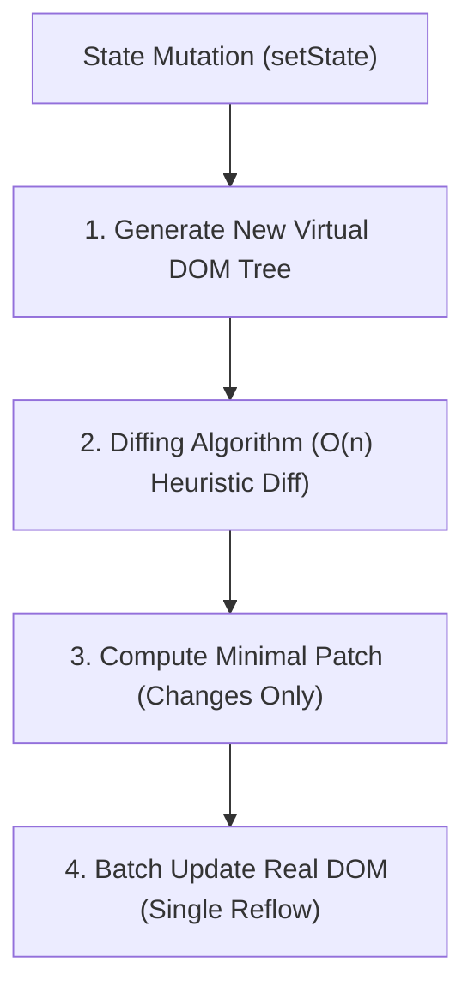
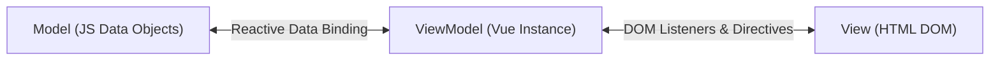
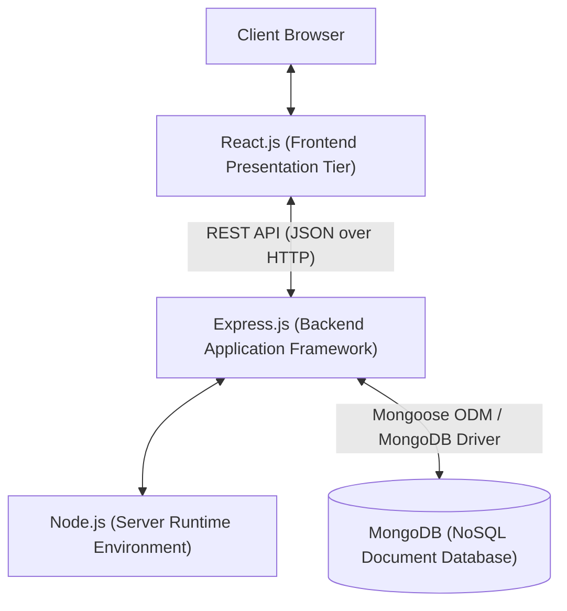

# Unit 1: Full Stack Basics - Question Bank & Detailed Notes

This document contains a curated list of possible exam/interview questions for Unit 1, along with detailed answers based on the core full-stack web development curriculum.

## Q1: Explain the 3-Tier Enterprise Architecture Rules.

**Answer:**
The 3-tier architecture is a software design pattern that separates applications into three logical and physical computing tiers. This separation of concerns improves scalability, maintainability, and security.

1.  **Presentation Tier (UI Layer):** 
    *   **Role:** Handles user interaction, rendering the UI, and collecting input.
    *   **Technologies:** HTML, CSS, JavaScript, React, Vue, browsers.
    *   **Rule:** Communicates **strictly** with the Business Tier. It has no direct access to the database.
2.  **Business Tier (Logic Layer):**
    *   **Role:** Contains the core business rules, validation logic, and algorithms. It processes data between the user and the database.
    *   **Technologies:** Node.js, Express, Python (Django), Java (Spring Boot).
    *   **Rule:** Communicates with both the Presentation Tier (upstream) and Data Access Tier (downstream). It must be UI-agnostic and Database-agnostic.
3.  **Data Access Tier (Database Layer):**
    *   **Role:** Executes CRUD (Create, Read, Update, Delete) transactions and manages data persistence.
    *   **Technologies:** MySQL, PostgreSQL, MongoDB, ORMs.
    *   **Rule:** Communicates **only** with the Business Tier.

## Q2: Differentiate between a Front-End, Back-End, and Full-Stack Developer.

**Answer:**

| Feature | Front-End Developer | Back-End Developer | Full-Stack Developer |
| :--- | :--- | :--- | :--- |
| **Focus** | Client-side, UI/UX, browser interactions, DOM manipulation. | Server-side logic, API routing, database management, security. | Both client-side and server-side end-to-end architecture. |
| **Technologies** | HTML, CSS, JS, React, Vue, Tailwind. | Node.js, Express, SQL, NoSQL, Python, Java. | MERN, MEAN, LAMP stacks. |
| **Data Flow** | Consumes JSON APIs and displays data to the user. | Creates REST APIs, queries databases, handles authentication. | Models the DB schema, builds APIs, and creates the UI to consume them. |

## Q3: What is JSON? Describe its strict structural rules.

**Answer:**
JSON (JavaScript Object Notation) is a lightweight data-interchange format. It is language-independent but uses conventions familiar to C-family languages.

**Strict Structural Rules:**
*   **Keys:** Must be explicitly wrapped in **double quotes** (e.g., `"name": "John"`). Single quotes are invalid.
*   **Strings:** Must be wrapped in **double quotes**.
*   **Data Types:** Supports String, Number, Boolean (`true`/`false`), Null (`null`), Object ( `{}` ), and Array ( `[]` ).
*   **Trailing Commas:** Strictly prohibited (e.g., `[1, 2, 3,]` is invalid).
*   **Unsupported Types:** Cannot contain functions, `undefined`, or `Date` objects. Comments are also natively unsupported.

## Q4: How do you parse and serialize JSON in JavaScript?

**Answer:**
JavaScript provides a built-in `JSON` object with two primary methods:

1.  **Serialization (`JSON.stringify`):** Converts a JS object into a JSON string. Used when sending data to a server or saving to `localStorage`.
    ```javascript
    const obj = { name: "Alice", age: 25 };
    const jsonString = JSON.stringify(obj); // '{"name":"Alice","age":25}'
    ```

2.  **Parsing (`JSON.parse`):** Converts a JSON string back into a JS object. Used when receiving data from a server.
    ```javascript
    const jsonStr = '{"status":"success"}';
    const parsedObj = JSON.parse(jsonStr);
    console.log(parsedObj.status); // success
    ```
    *Safety note:* Always wrap `JSON.parse` in a `try...catch` block to prevent application crashes from malformed JSON strings.

## Q5: Explain the Fetch API and how it handles asynchronous requests.

**Answer:**
The `fetch()` API provides an interface for fetching resources asynchronously across the network. It returns a Promise that resolves to the `Response` object representing the response to the request.

**Typical Workflow:**
1. Call `fetch(url, options)`.
2. The returned Promise resolves with a `Response` object.
3. Check `response.ok` to ensure the HTTP status code is 200-299.
4. Call `response.json()` (or `.text()`) to read the body. This also returns a Promise.
5. Handle the parsed data.

**Example:**
```javascript
async function getData() {
  try {
    const response = await fetch('https://api.example.com/data');
    if (!response.ok) throw new Error("HTTP Error");
    const data = await response.json(); // Consumes the body stream
    console.log(data);
  } catch (error) {
    console.error("Fetch failed", error);
  }
}
```

## Q6: What are the primary RESTful HTTP methods and their typical use cases?

**Answer:**
*   **GET:** Retrieves a representation of a resource. Safe and idempotent (doesn't change state).
*   **POST:** Submits new data to the server to create a new resource. Not idempotent.
*   **PUT:** Replaces all current representations of the target resource with the uploaded payload (full update). Idempotent.
*   **PATCH:** Applies partial modifications to a resource.
*   **DELETE:** Removes the target resource.

## Q7: Contrast `localStorage` and `sessionStorage`.

**Answer:**
Both provide synchronous key-value storage in the browser (around 5-10MB limit), but they differ in lifespan:
*   **`localStorage`:** Data persists indefinitely until explicitly cleared by the user (via browser settings) or by code (`localStorage.removeItem()`). It survives browser restarts.
*   **`sessionStorage`:** Data is tied to the specific browser tab session. The data is wiped as soon as the tab or window is closed. It survives page reloads within the same tab.

## Q8: What is React.js? Explain the Virtual DOM and its Reconciliation Process.

**Answer:**
**React.js** is an open-source, declarative, component-based front-end JavaScript library developed by Meta (Facebook) for building dynamic user interfaces and Single Page Applications (SPAs).

### Core Features:
1. **Component-Based Architecture:** UIs are divided into reusable, self-contained functional components that receive read-only `props` and return JSX.
2. **Uni-Directional Data Flow:** Data strictly flows from parent to child components, making state changes predictable and easier to debug.
3. **JSX (JavaScript XML):** An XML/HTML-like syntax extension transpiled to `React.createElement()` calls by build tools.

### The Virtual DOM & Reconciliation Process:
The browser's Real DOM is slow to mutate because direct updates trigger expensive layout recalculations (**Reflow**) and pixel redraws (**Repaint**).



1. **In-Memory Representation:** React maintains a lightweight in-memory JavaScript representation of the browser DOM called the **Virtual DOM**.
2. **Tree Regeneration:** When component state changes (`useState`), React renders a new Virtual DOM snapshot.
3. **$O(n)$ Heuristic Diffing:** React compares the new Virtual DOM tree with the previous snapshot using an optimized linear-time diffing algorithm:
   - Elements of different types produce entirely different subtrees.
   - Child lists are reconciled efficiently using unique, stable `key` attributes.
4. **Batch Update (Reconciliation):** React computes the minimal necessary set of DOM mutations (the patch) and applies them to the Real DOM in a single batch operation, minimizing expensive reflows.

---

## Q9: What is Vue.js? Explain its MVVM Architecture and Two-Way Data Binding (`v-model`).

**Answer:**
**Vue.js** is an open-source, progressive JavaScript framework created by Evan You for building modern user interfaces and SPAs. It is "progressive" because it can scale from an embeddable script tag in an HTML file to an enterprise-grade SPA framework.

### 1. Model-View-ViewModel (MVVM) Architecture:
*   **Model:** Raw JavaScript objects representing state and business data.
*   **View:** The visible HTML DOM rendered in the browser.
*   **ViewModel (Vue Instance):** The reactive bridge that binds the Model and the View. When Model state changes, the ViewModel updates the View; when the user interacts with the View, the ViewModel updates the Model.



### 2. Two-Way Data Binding (`v-model`):
Unlike React which requires explicit event handlers for form synchronization, Vue provides the `v-model` directive to establish seamless bi-directional data flow on form input elements:
*   Binds the element's `value` attribute to state: `:value="userName"`
*   Listens to user input events and updates state: `@input="userName = $event.target.value"`

```html
<template>
  <div>
    <!-- Changing input updates message; changing message updates input -->
    <input v-model="message" placeholder="Type here">
    <p>Live Preview: {{ message }}</p>
  </div>
</template>

<script>
export default {
  data() {
    return { message: '' };
  }
};
</script>
```

---

## Q10: Differentiate between React.js and Vue.js.

**Answer:**

| Comparison Parameter | **React.js** | **Vue.js** |
| :--- | :--- | :--- |
| **Type** | Front-end UI Library (Unopinionated). | Progressive Front-end Framework. |
| **Creator** | Meta (Facebook) + Community. | Evan You + Open-source community. |
| **Syntax** | JSX (JavaScript XML) inside JS/TS. | HTML-based Templates (or JSX) inside Single File Components (`.vue`). |
| **Data Binding** | Strictly **One-Way (Uni-directional)**. | **Two-Way** (`v-model`) for forms + One-way props. |
| **Reactivity Paradigm** | Virtual DOM diffing triggered on explicit `setState` / hooks. | Virtual DOM backed by fine-grained ES6 `Proxy` reactivity dependency tracking. |
| **State & Routing** | Relies on third-party libraries (React Router, Redux, Zustand). | Official first-party libraries provided (Vue Router, Pinia). |
| **Learning Curve** | Moderate to Steep (requires advanced JavaScript and functional programming). | Gentle and approachable (builds directly on standard HTML, CSS, JS). |

---

## Q11: What is Bootstrap 5? Explain its 12-Column Grid System and Key Enhancements over Bootstrap 4.

**Answer:**
**Bootstrap 5** is an open-source, mobile-first CSS framework designed by Twitter to build responsive, cross-browser web interfaces rapidly using pre-styled components and a flexbox layout grid.

### 1. The 12-Column Grid System:
The grid divides each container into 12 proportional columns. Layout structure adheres strictly to the hierarchy:
```
.container (or .container-fluid) -> .row -> .col-{breakpoint}-{columns}
```
*   Columns must sum to 12 within a `.row` to fill 100% width.
*   If column totals exceed 12, extra columns wrap to the next line.
*   Example: `<div class="col-md-8">` (occupies 66.6% width on tablets $\ge 768	ext{px}$) and `<div class="col-md-4">` (occupies 33.3% width).

### 2. Six Responsive Breakpoints:
*   `xs` ($< 576	ext{px}$): Mobile phones.
*   `sm` ($\ge 576	ext{px}$): Large phones in landscape.
*   `md` ($\ge 768	ext{px}$): Tablets.
*   `lg` ($\ge 992	ext{px}$): Laptops / Desktop displays.
*   `xl` ($\ge 1200	ext{px}$): High-resolution desktops.
*   `xxl` ($\ge 1400	ext{px}$): Ultra-wide monitors.

### 3. Major Enhancements in Bootstrap 5 over Bootstrap 4:
1. **Dropped jQuery:** Removed jQuery completely; all interactive components (modals, dropdowns) run on native **Vanilla JavaScript (ES6+)**, resulting in smaller bundles and faster execution.
2. **CSS Custom Properties (Variables):** Added native CSS variables (`--bs-primary`) for effortless theme switching and dark mode integration.
3. **Dropped Internet Explorer:** Dropped IE 10/11 support, enabling modern CSS standards (Flexbox, CSS Grid).
4. **Added `xxl` Breakpoint:** Added $\ge 1400	ext{px}$ tier for modern ultra-wide monitors.
5. **Native SVG Icon Library:** Integrated Bootstrap Icons natively without requiring external font libraries (FontAwesome).

---

## Q12: Why Tailwind CSS? Contrast the Utility-First Approach with Component-Based Frameworks (Bootstrap).

**Answer:**
**Tailwind CSS** is a utility-first CSS framework providing atomic styling classes (such as `flex`, `pt-4`, `text-center`, `rounded-lg`, `bg-blue-500`) that are composed directly in HTML markup to construct custom UIs without writing traditional CSS stylesheets.

### The 5 Core Problems Tailwind CSS Solves:
1. **Elimination of Naming Fatigue:** Developers don't waste time inventing arbitrary BEM class names (`.profile-card-header__title`).
2. **Zero CSS Specificity Wars:** Styles are applied locally to elements at flat specificity, preventing global CSS collisions.
3. **Sub-10KB Production Bundles (JIT Compiler):** Traditional frameworks ship large, monolithic CSS bundles (~200KB+). Tailwind's Just-In-Time (JIT) compiler scans template files and generates *strictly* the classes used, creating lightweight production stylesheets under $10	ext{KB}$ gzipped.
4. **Design System Consistency:** Provides standardized scales for spacing, typography, and color, eliminating arbitrary "magic numbers" (`margin: 19px`).
5. **Responsive & State Modifiers:** Supports responsive breakpoints (`sm:`, `md:`, `lg:`) and pseudo-states (`hover:`, `focus:`, `dark:`) directly within class strings:
   ```html
   <button class="w-full sm:w-auto bg-blue-600 hover:bg-blue-700 text-white font-bold py-2 px-4 rounded dark:bg-blue-900">
     Submit
   </button>
   ```

### Comparative Summary: Tailwind CSS vs. Bootstrap 5

| Dimension | **Bootstrap 5** | **Tailwind CSS** |
| :--- | :--- | :--- |
| **Philosophy** | **Component-Based:** Pre-designed opinionated UI widgets. | **Utility-First:** Atomic, low-level styling building blocks. |
| **Customizability** | Low/Moderate (requires overriding SASS or CSS rules). | High/Infinite (total freedom over UI appearance). |
| **Design Individuality** | Sites often have a recognizable "Bootstrap template" appearance. | Fully custom designs tailored uniquely to the brand. |
| **Bundle Size** | Monolithic (~150KB–280KB unminified). | Minimal (purged via JIT to $< 10	ext{KB}$ gzipped). |
| **Prototyping** | Extremely fast for standard prototypes (ready-made buttons/cards). | Fast once utility classes are mastered; requires composing elements. |

---

## Q13: Differentiate between JSON and XML. Why has JSON largely replaced XML in modern REST APIs?

**Answer:**

```mermaid
flowchart LR
    subgraph JSON_Format["JSON (Lightweight)"]
        J["{"name": "Alice", "age": 22}"]
    end
    subgraph XML_Format["XML (Heavy Overhead)"]
        X["<student><name>Alice</name><age>22</age></student>"]
    end
```

### Detailed Comparison Table:

| Parameter | **JSON (JavaScript Object Notation)** | **XML (eXtensible Markup Language)** |
| :--- | :--- | :--- |
| **Syntax Structure** | Key-value pairs and arrays (`{}`, `[]`). | Tag-based markup (`<tag>...</tag>`). |
| **Payload Weight** | **Lightweight:** Minimal syntax overhead. | **Heavy:** Verbose repetitive closing tags consume high bandwidth. |
| **Parsing Speed** | **Fast:** Parsed directly into native runtime objects via C++ `JSON.parse()`. | **Slow:** Requires complex tree parsers (DOM/SAX/StAX) consuming CPU and RAM. |
| **Data Types** | Natively supports String, Number, Boolean, Array, Object, `null`. | Treats all data as plain text strings; requires manual parsing and casting. |
| **Array Support** | Native first-class arrays: `[1, 2, 3]`. | No native array; requires repeating wrapper tags `<item>1</item><item>2</item>`. |
| **Security Risks** | Vulnerable to Prototype Pollution if not validated. | Vulnerable to severe **XXE (XML External Entity)** attacks and Billion Laughs DoS. |
| **Comments** | Strictly prohibited. | Supported (`<!-- comment -->`). |
| **JavaScript Integration** | Native and direct subset of JavaScript syntax. | Requires `DOMParser` and DOM traversal/XPath navigation. |

### Why JSON Replaced XML in Modern Web APIs:
1. **Network Efficiency:** JSON uses up to 50–70% fewer bytes than XML for the same dataset, drastically improving mobile load speeds.
2. **Native Browser Parsing:** Browsers parse JSON natively using `JSON.parse()` without requiring memory-heavy XML DOM trees.
3. **Data-Centric Design:** Web applications exchange structured data objects rather than annotated documents.

---

## Q14: Explain the MERN Stack and the distinct role of each technology in the stack.

**Answer:**
The **MERN Stack** is a widely adopted full-stack development framework that utilizes a single programming language—**JavaScript (or TypeScript)**—across every layer of application architecture.



1. **M — MongoDB (Database Tier):**
   * A cross-platform, document-oriented NoSQL database.
   * Stores data in flexible, schema-free JSON-like **BSON (Binary JSON)** documents.
   * Enables seamless storage of JavaScript objects without impedance mismatch from SQL object-relational mapping.
2. **E — Express.js (Backend Tier):**
   * A minimal, unopinionated web application framework running inside Node.js.
   * Provides routing engines for RESTful API endpoints, request parsing, and middleware chains (authentication, validation, CORS).
3. **R — React.js (Frontend Tier):**
   * A declarative, component-based client UI library developed by Meta.
   * Manages user interactions, component state, and renders dynamic views efficiently via the Virtual DOM.
4. **N — Node.js (Runtime Environment):**
   * An open-source, asynchronous event-driven JavaScript runtime engine built on Google Chrome's V8 C++ engine.
   * Executes backend server logic, handles concurrent client network connections via the event loop, and performs asynchronous non-blocking file and network I/O.

---

## Q15: Describe the Complete HTTP Request-Response Lifecycle from typing a URL in the browser to page rendering.

**Answer:**
When a user types a URL (e.g., `https://api.university.edu/grades`) into a browser and presses Enter, the following sequence occurs:

1. **DNS Resolution:** The browser resolves the human-readable domain name into an IP address checking sequentially: Browser DNS cache $	o$ OS hosts file $	o$ Router cache $	o$ ISP Recursive DNS Resolver $	o$ Root/TLD/Authoritative Nameservers.
2. **TCP 3-Way Handshake:** The browser opens a reliable TCP connection to the destination server IP on port 443 (HTTPS) via a three-way handshake: `SYN` $	o$ `SYN-ACK` $	o$ `ACK`.
3. **TLS/SSL Encryption Handshake:** For secure HTTPS connections, the client and server negotiate encryption algorithms, validate the server's X.509 digital certificate, and exchange a symmetric session encryption key.
4. **HTTP Request Transmission:** The browser formats and sends an HTTP Request:
   ```http
   GET /grades HTTP/1.1
   Host: api.university.edu
   Accept: application/json
   Authorization: Bearer eyJhbGciOi...
   ```
5. **Server Processing & Routing:** The web server (Nginx/Node.js) receives the request, runs middleware (CORS, JWT authentication, rate limiting), routes the request to controller business logic, and queries the database tier.
6. **HTTP Response Transmission:** The server serializes the result and transmits an HTTP Response:
   ```http
   HTTP/1.1 200 OK
   Content-Type: application/json
   Content-Length: 254

   [{"course":"FSD","grade":"A"},{"course":"DBMS","grade":"A+"}]
   ```
7. **Browser Parsing & Rendering:** The browser receives the payload, parses the JSON, updates application state in React/Vue, recalculates the Virtual DOM, and updates the browser's display screen.

---

## Q16: Compare Client-Side Web Storage Mechanisms in Tabular Form.

**Answer:**

| Parameter | **`localStorage`** | **`sessionStorage`** | **HTTP Cookies** | **`IndexedDB`** |
| :--- | :--- | :--- | :--- | :--- |
| **Capacity** | $\sim 5	ext{MB} - 10	ext{MB}$ | $\sim 5	ext{MB}$ | $\sim 4	ext{KB}$ | $> 250	ext{MB}$ (Gigabytes) |
| **Lifespan** | Permanent (persists until manually cleared). | Tab session (wiped when tab closes). | Set via `Expires` or `Max-Age`. | Permanent (until storage pressure eviction). |
| **Accessibility** | Client-side only (`window.localStorage`). | Client-side only (`window.sessionStorage`). | Client and Server (sent with every HTTP request). | Client-side only (`window.indexedDB`). |
| **Data Structure**| Key-Value (Strings only). | Key-Value (Strings only). | Key-Value (String pairs). | NoSQL Object Store (blobs, files, typed objects). |
| **API Style** | Synchronous. | Synchronous. | Synchronous (`document.cookie`).| Asynchronous (Promises / Event-based). |
| **Security Risk** | Vulnerable to **XSS** (readable by JS). | Vulnerable to **XSS**. | Vulnerable to **CSRF**; protected from XSS if `HttpOnly`. | Vulnerable to **XSS**. |
| **Best Used For** | UI theme preference (dark mode), cached app settings. | Temporary wizard data, active single-tab transactions. | User session tokens, authentication cookies. | Large offline datasets, PWAs, binary media caches. |
