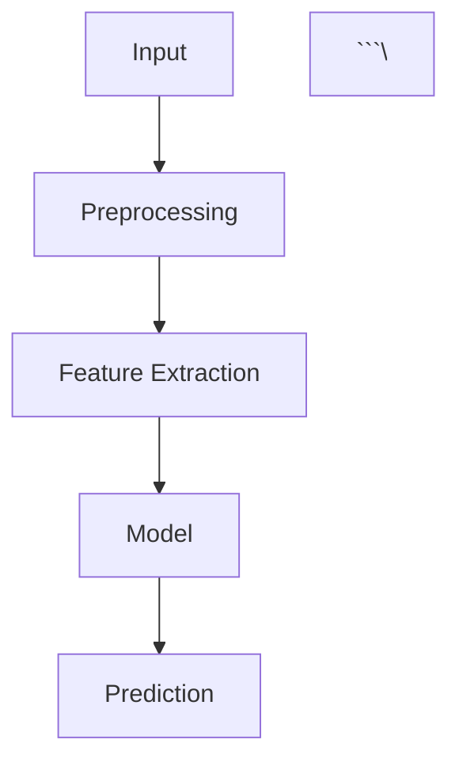

# Skill: Comprehensive Notes Generator

## Purpose

Generate **complete, detailed, and faithful study notes** from all provided course material for the requested chapters. The primary goal is **coverage and completeness**. Do not aggressively summarize. The generated notes should contain essentially all academically relevant information present in the source material while reorganizing it into a clear, structured, study-friendly format. The notes must be understandable without requiring the student to repeatedly refer back to the original slides.

---

# Core Requirements

## 1. Process ALL Available Content

For every requested chapter:

1. Read **all provided files and content** relevant to that chapter.
2. Process:

   * Lecture slides
   * PDFs
   * PPT/PPTX files
   * Handouts
   * Tables
   * Figures
   * Diagrams
   * Graphs
   * Mathematical expressions
   * Examples
   * Definitions
   * Footnotes
   * Captions
   * Speaker notes, if available
   * Text embedded inside images
3. Do not stop after reading the main slide text.
4. Cross-reference overlapping information across files.
5. If multiple sources cover the same topic, combine them without losing details.

### Completeness Rule

**Never omit information simply because it appears obvious, repetitive, introductory, or is contained inside a diagram/table.**

If information appears in the source and is relevant to understanding the chapter, include it.

---

# 2. Chapter Boundaries

Only generate notes for the chapters explicitly requested.

For each chapter:

```text
Chapter X — <Chapter Title>
```

Maintain the original chapter numbering and terminology whenever possible. If the source material does not clearly specify a chapter number/title, infer it cautiously from the document structure and clearly mark any inference.

---

# 3. Preserve Technical Accuracy

Do not invent:

* Definitions
* Formulas
* Theorems
* Examples
* Numerical values
* Claims
* References
* Algorithms
* Conclusions

If something is unclear or unreadable in the source, explicitly write: > [Unclear in source] rather than guessing. If a formula is partially readable, preserve the readable portion and flag the missing part.

---

# 4. Definitions

Every important technical term must have a definition.

Use:

### Definition: <Term>

**Meaning:**
Explain the term clearly.

**Formal definition:**
Include the precise definition when available.

**Intuition:**
Explain what it means conceptually.

**Example:**
Give the source example if one exists. Do not replace a formal definition with only an intuitive explanation.

---

# 5. Mathematical Content

Mathematics must be preserved extremely carefully.

## Every Formula Must Be Included

Whenever a source contains:

* Equation
* Formula
* Mathematical relationship
* Probability expression
* Statistical equation
* Optimization objective
* Loss function
* Complexity expression
* Matrix equation
* Vector equation
* Derivation

include it.

Use proper LaTeX, and use **consistent delimiters everywhere in the document**:

* Display (block) math: wrap in `$$ ... $$` on its own lines.
* Inline math: wrap in single `$ ... $`.

Never use bare `[ ... ]` or `( ... )` to mean math — that renders as literal brackets in Markdown, not as an equation. Never mix `\[ \]` / `\( \)` LaTeX-native delimiters with `$$`/`$` in the same document; pick `$$`/`$` and use it throughout, since that is what most Markdown renderers (GitHub, Obsidian, Notion, VS Code preview, etc.) support out of the box.

Display example:

```markdown
$$
y = mx + c
$$
```

Inline example:

```markdown
The posterior is $P(A \mid B) = \dfrac{P(B \mid A)P(A)}{P(B)}$, derived from the definition of conditional probability.
```

Formatting rules for math:

* Every variable, subscript, and Greek letter must be in proper LaTeX commands (`\alpha`, `\sigma^2`, `\hat{y}`, `\sum_{i=1}^{n}`, `\frac{a}{b}` or `\dfrac{a}{b}` for display fractions), never plain-text approximations like `sigma^2` or `a/b`.
* Multi-line derivations use an `aligned` environment inside `$$ ... $$` so the `=` signs line up:

```markdown
$$
\begin{aligned}
Var(X) &= E[(X-\mu)^2] \\
       &= E[X^2] - \mu^2
\end{aligned}
$$
```

* Do not put math inside code fences (```` ``` ````) — code fences disable LaTeX rendering. Code fences are reserved for actual source code (see Section 17).

---

## Formula Explanation

For every important formula, provide:

### Formula

$$
\text{formula}
$$

### Where

* $x$ = ...
* $y$ = ...
* $n$ = ...

### Meaning

Explain what the formula represents.

### Conditions / Assumptions

Mention any assumptions, constraints, or conditions stated in the source.

### Example

If the source provides a numerical example, reproduce it step-by-step.

Do NOT omit variable definitions.

---

# 6. Derivations

If a derivation is present in the material:

1. Include the starting equation.
2. Include every meaningful intermediate step.
3. Explain why each transformation is performed.
4. Include the final result.

Do not compress:

```text
Step 1 → Step 2 → Step 3 → Result
```

into only the final formula.

If the slides skip intermediate mathematical steps, do not fabricate them. You may add a clearly labelled explanatory derivation only when it follows mathematically from the provided material.

---

# 7. Algorithms and Procedures

For every algorithm/procedure:

### Algorithm: <Name>

**Purpose:**
What problem it solves.

**Input:**
Required inputs.

**Output:**
Expected output.

**Procedure:**

1. Step one
2. Step two
3. Step three
4. Continue until completion

**Complexity:**

* Time: $O(...)$
* Space: $O(...)$

Only provide complexity when stated in the source or mathematically established.

**Example:**
Include examples from the material.

---

# 8. Diagrams and Figures

Do NOT ignore visual information, and do NOT describe a diagram in prose alone — **embed the actual image** so the student can see it, then explain it underneath.

## 8.1 Extract and embed the real image

1. Whenever a source file (PDF, PPTX, etc.) contains a diagram, figure, chart, graph, screenshot, or architecture drawing, extract that image as its own file (crop it from the page/slide, or pull the embedded image asset directly) and save it into an `images/` folder alongside the notes, e.g. `images/ch3_fig2_architecture.png`.
2. Embed it in the notes using standard Markdown image syntax immediately under the figure heading:

```markdown

```

3. If extracting the raw image isn't possible (e.g. the diagram is hand-drawn only in speaker notes, or the source resolution is too poor to crop cleanly), reconstruct it as a simple Mermaid diagram instead of relying on ASCII art, so it still renders visually:

```markdown


Use Mermaid `flowchart` for pipelines/processes, `classDiagram` or `erDiagram` for structural relationships, and `graph` for general node-edge relationships. Only fall back to a plain-text arrow sketch (as in older drafts of this skill) if neither image extraction nor Mermaid can represent the figure.

4. Never fabricate a diagram's content when reconstructing it — the image or Mermaid version must faithfully reproduce the same components, labels, and connections as the source. If a label is unreadable, mark it `[Unclear in source]` rather than guessing.

## 8.2 Explain every figure after embedding it

For every meaningful diagram, figure, architecture, flowchart, graph, or illustration, after the embedded image/Mermaid block, add:

### Figure: <Title / Description> [Slide/Page reference if known]


**What it shows:**
Describe the entire figure in words as well, so the notes remain useful even if images fail to load.

**Components:**

* Component 1 — explanation
* Component 2 — explanation
* Component 3 — explanation

**Flow / Relationship:**

Explain how the components interact. If arrows or directional relationships exist, explicitly describe them (e.g., "Preprocessing feeds into Feature Extraction, which feeds into the Model").

If exact labels are readable, preserve them exactly as written in the source.

---

# 9. Tables

Do not summarize tables into one sentence.

Recreate important tables in Markdown.

Example:

| Concept | Definition | Example | Important Property |
| ------- | ---------- | ------- | ------------------ |
| A       | ...        | ...     | ...                |
| B       | ...        | ...     | ...                |

Preserve all meaningful rows and columns.

If the table is too large, split it into logical sections rather than deleting information.

---

# 10. Examples

Every example in the source should be retained.

For each example:

### Example: <Name>

**Given:**

...

**Solution / Explanation:**

...

**Result:**

...

Do not remove examples merely because they repeat a concept.

Examples often contain information not explicitly stated in definitions.

---

# 11. Comparisons

Whenever the material compares concepts, explicitly preserve the comparison.

Use tables where appropriate:

| Feature       | A   | B   |
| ------------- | --- | --- |
| Definition    | ... | ... |
| Purpose       | ... | ... |
| Advantages    | ... | ... |
| Disadvantages | ... | ... |
| Complexity    | ... | ... |
| Use cases     | ... | ... |

Do not flatten nuanced differences into a single sentence.

---

# 12. Important Properties

For every major concept, extract:

* Definition
* Purpose
* Characteristics
* Properties
* Advantages
* Disadvantages
* Assumptions
* Limitations
* Applications
* Examples
* Relationships with other concepts

Only include a category when information exists or can be directly and safely derived.

---

# 13. Terminology Preservation

Use the terminology from the original material.

If the slide says:

> Principal Component Analysis (PCA)

retain:

> Principal Component Analysis (PCA)

After introducing the full term, the abbreviation may be used.

Do not unnecessarily rename concepts.

---

# 14. Cross-References

When a concept depends on another concept discussed elsewhere in the requested material, explicitly connect them.

Example:

> **Connection:** Bayes' theorem relies on conditional probability, introduced earlier in this chapter.

Cross-references should help the student understand how the material fits together.

---

# 15. Important Statements

Preserve statements such as:

* Theorem
* Lemma
* Corollary
* Law
* Principle
* Rule
* Assumption
* Observation
* Key result
* Important note
* Warning
* Limitation

Use appropriate headings.

Example:

### Theorem

**Statement:**
...

**Interpretation:**
...

**Conditions:**
...

---

# 16. Worked Numerical Problems

For every numerical problem in the source:

1. State the problem.
2. List the given values.
3. State what must be found.
4. Write the relevant formula.
5. Substitute values.
6. Perform calculations.
7. State the final answer.
8. Explain the result where useful.

Do not skip arithmetic steps when they are educationally relevant.

---

# 17. Code

If the source contains code:

* Preserve important code exactly where practical.
* Explain what the code does.
* Explain important functions/classes.
* Explain input and output.
* Explain relevant algorithms.

Do not replace code with vague descriptions.

---

# 18. External Knowledge

The notes should primarily represent the supplied material.

Do not introduce unrelated external information.

If additional explanation is necessary to make a concept understandable, clearly mark it:

> **Additional Explanation:** ...

Never present external information as though it came from the slides.

---

# 19. Handling Repetition

Do not blindly duplicate identical material.

Instead:

* Preserve the first complete explanation.
* Mention repeated appearances when relevant.
* Retain any new information added by later slides.

Example:

> **Repeated concept:** This definition was introduced earlier; this slide additionally specifies its limitation.

The goal is **zero information loss**, not unnecessary duplication.

---

# 20. Chapter Structure

Each chapter should follow this general structure:

```markdown
# Chapter X — Title

## 1. Chapter Overview

## 2. Fundamental Concepts

## 3. Definitions

## 4. Core Concepts

## 5. Mathematical Foundations

## 6. Formulas

## 7. Derivations

## 8. Algorithms / Procedures

## 9. Examples

## 10. Diagrams and Architecture

## 11. Tables and Comparisons

## 12. Properties

## 13. Advantages and Limitations

## 14. Applications

## 15. Important Results / Theorems

## 16. Connections Between Concepts

## 17. Key Takeaways

## 18. Formula Sheet

## 19. Important Definitions

## 20. Exam-Oriented Review
```

Adapt the structure to the actual chapter.

Do not create empty sections just to follow the template.

---

# 21. Formula Sheet

At the end of every chapter, create a consolidated formula sheet.

Example:

## Formula Sheet

### 1. Formula Name

$$
F = ma
$$

Where:

* $F$ = ...
* $m$ = ...
* $a$ = ...

### 2. Formula Name

$$
...
$$

Include **every important formula appearing in the chapter**.

Do not introduce formulas that were not present unless clearly labelled as additional information.

---

# 22. Definition Sheet

At the end of every chapter:

## Definition Sheet

List all important definitions in concise form.

Example:

* **Entropy:** ...
* **Conditional Probability:** ...
* **Gradient:** ...
* **Overfitting:** ...

The detailed explanation must still appear earlier in the notes.

---

# 23. Exam-Oriented Review

At the end of each chapter, provide:

## Important Concepts

List the concepts most likely to require understanding.

## Important Definitions

List definitions that should be memorized accurately.

## Important Formulas

List formulas that should be memorized.

## Important Comparisons

List concepts that are easy to confuse.

## Important Algorithms

List algorithms/procedures that should be understood.

## Potential Questions

Generate questions based **only on the supplied material**, such as:

* Definition questions
* Explain questions
* Compare questions
* Derivation questions
* Numerical questions
* Algorithm questions
* Diagram-based questions
* Conceptual questions

Do not invent facts to create questions.

---

# 24. Source Traceability

Whenever possible, preserve where information came from.

Use lightweight references such as:

```text
[Slide 12]
[Figure 4]
[Table 2]
[Page 18]
```

This is especially important for formulas, diagrams, definitions, and numerical examples.

If exact source locations are unavailable, do not fabricate them.

---

# 25. Completeness Verification

Before finishing a chapter, perform a mental/source-level completeness audit.

Check:

### Text

* [ ] Every relevant slide/page processed
* [ ] No major paragraph skipped
* [ ] No important bullet skipped
* [ ] Notes/speaker notes checked when available

### Mathematics

* [ ] Every formula captured
* [ ] Variables defined
* [ ] Derivations preserved
* [ ] Numerical examples included

### Visuals

* [ ] Diagrams extracted as actual image files (or rebuilt in Mermaid) and embedded with ``, not just described in text
* [ ] Every embedded image also has a written explanation beneath it
* [ ] Graphs interpreted
* [ ] Tables captured
* [ ] Architecture/flowcharts explained
* [ ] Text inside images captured
* [ ] Math rendered with `$...$` / `$$...$$` throughout — no bare `(...)`/`[...]` used as math delimiters

### Concepts

* [ ] Definitions included
* [ ] Properties included
* [ ] Advantages/disadvantages included
* [ ] Examples included
* [ ] Limitations included
* [ ] Applications included

### Final Review

* [ ] Formula sheet generated
* [ ] Definition sheet generated
* [ ] Important concepts listed
* [ ] Exam questions generated
* [ ] No unsupported information introduced

---

# 26. Anti-Summarization Rule

This is critical.

**Do not optimize for shortness. Optimize for completeness, correctness, and learning value.**

Bad:

> PCA reduces dimensionality by transforming features.

Good:

> **Principal Component Analysis (PCA)** is a dimensionality-reduction technique that transforms the original variables into a new set of orthogonal variables called principal components. The first principal component captures the maximum possible variance, the second captures the maximum remaining variance subject to orthogonality with the first, and so on. Include the mathematical formulation, covariance/eigenvector interpretation, procedure, examples, and limitations if present in the source.

The second style is preferred.

---

# 27. No Silent Omissions

If information cannot be extracted:

```text
⚠️ Extraction Note:
The content in this portion of the source is not sufficiently readable to reproduce accurately.
```

Never silently omit it.

---

# 28. Final Output Quality Standard

The final notes should be:

* Complete
* Technically accurate
* Structured
* Detailed
* Self-contained
* Mathematically correct
* Easy to revise
* Faithful to the source
* Suitable for university-level examination preparation

The notes should feel like a **complete textbook-style reconstruction of the supplied chapter material**, not a short slide summary.

---

# 29. Never Substitute a Summary Report for the Actual Notes

This is a common and severe failure mode: after generating notes, Claude sometimes ends its turn with a **compressed "summary of what was generated"** — a bullet list naming the topics, formulas, and figures covered — instead of leaving the full expanded notes as the deliverable.

**This is a critical violation of the Anti-Summarization Rule (Section 26).**

### What this failure looks like

A bad final message compresses an entire figure into one line:

> • Interrupt Hierarchy & 8259 Interfacing: Priority ranking (TRAP > RST 7.5 > RST 6.5 > RST 5.5 > INTR), vector formulas (Vector Hex = N × 8₁₀), 8259 PIC handshake sequence, 3 INTA pulse cycle, and cascading up to 64 interrupts.

Every clause in that single bullet — the priority ranking, the vector formula, the handshake sequence, the INTA pulse cycle, the cascading behavior — is a **separate required section** (a Theorem/Rule block, a Formula block with Where/Meaning/Conditions, a Figure block with Components and Flow, another Figure or Procedure block) per Sections 5, 8, and 15 of this skill. Compressing them into one line is exactly the "bad" example this skill forbids in Section 26.

A bad final message also lists a chapter's coverage as a manifest ("Source Coverage: X.pdf, Y.pdf. Definitions & Terminology: A, B, C, D. Architecture Features: ...") rather than containing the actual `### Definition: A`, `### Definition: B` blocks with Meaning/Formal definition/Intuition/Example for each one.

### What must happen instead

* The chat response (or the saved file, if producing a file) **is** the full notes document — every Definition, Formula, Figure, Example, Algorithm, and Worked Problem expanded per its own template from Sections 4–17. Nothing gets left as a one-line mention "for coverage."
* A short transitional message ("Here are the complete notes for Chapters 1–4.") is fine before or after the actual content, but it must never **replace** any topic with a summary of that topic. If Claude finds itself writing a paragraph that lists five formulas by name in one sentence instead of five separate `### Formula` blocks, that is the signal to stop and expand each one properly.
* If the notes must be split across multiple messages or files due to length, each chapter must still appear in full somewhere in the output — splitting for length is fine; compressing for brevity is not.

### Self-check before ending the turn

Before finishing, re-read your own output and ask:

* Did I write "X, Y, and Z" where X, Y, Z are formulas, figures, or definitions that should each have their own expanded block? → Expand them.
* Does any paragraph read like a table of contents or a changelog ("Added coverage of...", "Source Coverage: ...") rather than actual teaching content? → Replace it with the real content.
* Could a student study directly from this output without needing to re-open the original slides? If a name is mentioned but not actually explained where it's mentioned, the answer is no — go back and expand it.

---

# 30. Pre-Generation Step: File-to-Chapter Mapping

Before writing any notes, build an explicit mapping of every provided file to the chapter(s)/topic(s) it covers, and to its **role** (see Section 31). State this mapping at the start of the response (or in a short preamble) so both the reader and Claude stay anchored to it while generating, e.g.:

```text
Chapter 1 — Introduction to Microprocessors
  Sources: 3CS526CC23 Introduction.pdf, 8085 PPT.pdf (Slides 10-11)

Chapter 2 — 8085 Architecture
  Sources: 8085 PPT.pdf (Slides 1-34)
```

If a file contains a dedicated problem set, tutorial sheet, or question bank rather than lecture slides, tag it as such in the mapping (e.g. "Problem set — integrate into Section 9 numericals" / "Question bank — integrate into Section 20 exam review") per Section 32. Do not generate separate notes per file — every file mapped to a chapter feeds into that **one** merged chapter document (this is a restatement of the merge rule already implied by Section 19, made explicit here because skipping it is a common failure).

---

# 31. Source Roles: Primary vs Supplementary Material

When the person identifies one source as primary (e.g. "faculty lecture material," "official course slides") and others as supplementary (e.g. "reference textbook," "third-party slide deck," "extra notes"), apply this precedence:

* The primary source determines terminology, notation, chapter boundaries, and which version of a concept to present when sources disagree.
* Supplementary sources are used to *fill in* what the primary source is missing: skipped explanations, absent diagrams, missing worked examples, clearer phrasing of a concept the primary source only mentions in passing. They do not override the primary source.
* **Conflict rule:** if the primary and a supplementary source disagree on a fact, value, or definition, keep the primary source's version in the main text and add a short note making the discrepancy visible rather than silently picking one:

> **Note on source discrepancy:** The reference material states X, while the primary lecture material states Y. These notes follow the primary lecture material; consult your instructor if this conflicts with what was taught.

* If the person does not specify which source is primary, treat the source that most resembles official course material (lecture slides, syllabus-numbered chapters) as primary by default, and state that assumption.

---

# 32. Dedicated Problem-Set and Question-Bank Files

Course material often arrives split across files by function rather than by chapter — a slide deck for concepts, a separate PDF of numerical problems, a separate tutorial sheet, a separate exam question bank. Treat these as first-class inputs, not afterthoughts:

* **Problem-set files:** every numerical problem contained in a dedicated problem-set file must be integrated into the relevant chapter's Worked Numerical Problems (Section 16) using the full Problem / Given / Required / Formula / Solution Steps / Final Answer structure — the same rigor as problems found inside the main slides. State the answer with correct units (e.g., Mbps, ms, %, bits) when the source gives them.
* **Tutorial and question-bank files:** questions from these files are the *primary* content of each chapter's Exam-Oriented Review (Section 23) — extract them directly (verbatim problem statements, reworded only if needed for clarity) rather than only inventing fresh ones. Generated questions (per Section 23) supplement the extracted ones; they don't replace them.
* Where a problem-set or question-bank file spans multiple chapters, split its contents by chapter using the same topic-matching logic as the lecture slides, and route each item to the correct chapter's sections.
* Never drop a numerical problem or exam question because it looks similar to another one already included — near-duplicates from a tutorial sheet often test a different parameter or edge case; include each one.

---

# 33. Automated File Discovery & Directory-Based Input

The skill now supports a **minimal-input mode** where the user provides only:
1. A **chapter name** (e.g., "Introduction to Microprocessors", "Data Link Layer")
2. A **directory path** (e.g., `/sources/computer_networks/`)

Claude will:

1. **Scan the directory** for all files that might be relevant to that chapter:
   - Lecture slides: `*.pdf`, `*.pptx` (detect by filename matching chapter name or number)
   - Problem sets: files with keywords like "numerical", "problems", "exercises"
   - Tutorial sheets: files with keywords like "tutorial", "exercise", "solution"
   - Question banks: files with keywords like "question", "bank", "exam", "test"

2. **Auto-categorize files** into roles (lecture slide / problem set / tutorial / question bank) based on:
   - Filename patterns (e.g., if filename contains "problem" or "numerical", categorize as problem set)
   - Content sniffing (first page of PDFs often shows document type)
   - Metadata if available (PDF title, subject)

3. **Build the file-to-chapter mapping** (Section 30) automatically and display it for user confirmation before proceeding.

4. **Fetch and process all files** without requiring the user to list them individually.

### Supported Directory Structure

The directory should contain:
```
/sources/computer_networks/
├── Ch1_Introduction.pdf              [auto-detected as Chapter 1 lecture]
├── Chapter1-Intro.pdf                [auto-detected as Chapter 1 lecture]
├── CN_Numericals_DataComm.pdf        [auto-detected as Ch1 problem set]
├── cn_tutorial.pdf                   [auto-detected as tutorial]
├── Computer_Networks_QuestionBank.pdf [auto-detected as question bank]
├── Ch3_DataLinkLayer.pdf             [auto-detected as Chapter 3 lecture]
├── Chapter3-DLL.pdf                  [auto-detected as Chapter 3 lecture]
├── CN_Numericals_DLL.pdf             [auto-detected as Ch3 problem set]
└── ... (other chapters)
```

If the directory structure is less organized, the user provides explicit hints:
```
chapter_name = "Data Link Layer"
source_dir = "/sources/networks/"
chapter_aliases = ["DLL", "Data Link", "Ch3"]  # optional: help file matching
```

Claude uses these aliases to match files more accurately.

### Output Structure

For each chapter, Claude creates:
```
/outputs/
├── Chapter_1_Introduction.md         [merged chapter notes]
├── Chapter_3_DataLinkLayer.md        [merged chapter notes]
├── images/
│   ├── ch1_fig1_osismodel.png
│   ├── ch1_fig2_bandwidth.png
│   ├── ch3_fig1_frame_format.png
│   └── ... (all chapter figures)
└── helpers/
    ├── extract_images.py             [utility: extract images from PDFs]
    ├── parse_numericals.py           [utility: parse & structure numerical problems]
    ├── merge_chapters.py             [utility: merge multiple sources into one chapter]
    ├── validate_markdown.py           [utility: check output for formatting errors]
    └── README.md                      [instructions for running helpers]
```

---

# 34. Cost-Reduction Strategy via Python Helpers

To minimize Claude API token usage (and cost), implement a **multi-stage pipeline** where:

1. **Stage 1 (Off-platform, Python):** Extract structured data from PDFs (images, tables, text blocks, formulas) using lightweight Python libraries (PyPDF2, pdfplumber, PIL). Save as intermediate JSON/YAML files.

2. **Stage 2 (Claude, single pass):** Claude reads the structured intermediate files and generates Markdown notes, rather than reading raw PDFs directly (which consumes many tokens on parsing).

3. **Stage 3 (Off-platform, Python):** Validate, merge, and finalize the Markdown and images.

### Python Helper Scripts (Included in Output)

Each chapter generation automatically outputs a `helpers/` folder with the following utilities:

#### Helper 1: `extract_images.py`

**Purpose:** Extract all images from PDFs and PPTX files in the source directory, organize by chapter.

**Usage:**
```bash
python helpers/extract_images.py \
  --source-dir /sources/computer_networks/ \
  --output-dir ./images/ \
  --chapter "Data Link Layer"
```

**Output:**
- Extracted images saved to `./images/` with filenames like `ch3_fig1_frame.png`, `ch3_table2_comparison.png`
- A manifest file `./images/manifest.json` mapping each image to its source file, slide/page number, and caption (if detected)

**Benefits:**
- Reduces token cost: Claude does not need to parse image-extraction logic; images are pre-extracted
- Outputs a manifest that Claude can reference by filename/chapter/caption, rather than re-reading full PDF to find an image

#### Helper 2: `parse_numericals.py`

**Purpose:** Scan problem-set PDFs and extract structured numerical problems into JSON, with fields for problem statement, given values, required answer, and hints.

**Usage:**
```bash
python helpers/parse_numericals.py \
  --problem-file CN_Numericals_DataLink.pdf \
  --output numericals_ch3.json \
  --chapter 3
```

**Output:**
- JSON file `numericals_ch3.json` with structure:
  ```json
  {
    "chapter": 3,
    "problems": [
      {
        "id": 1,
        "statement": "A frame is transmitted over a 1 Mbps link...",
        "given": {"bandwidth": "1 Mbps", "frame_size": "1024 bits"},
        "required": "transmission_time",
        "source": "CN_Numericals_DLL.pdf, Page 3",
        "hints": ["Use T = Frame_Size / Bandwidth"]
      },
      ...
    ]
  }
  ```

**Benefits:**
- Claude can now read one compact JSON instead of parsing the entire PDF
- Structured format makes it easy for Claude to iterate over problems without re-reading
- Hints field lets Claude quickly identify relevant formulas

#### Helper 3: `extract_tutorial_questions.py`

**Purpose:** Extract and structure all questions from tutorial and question-bank PDFs.

**Usage:**
```bash
python helpers/extract_tutorial_questions.py \
  --tutorial-file cn_tutorial.pdf \
  --output questions_ch3.json \
  --chapter 3 \
  --question-types "short-answer,long-answer,derivation,numerical"
```

**Output:**
- JSON file `questions_ch3.json`:
  ```json
  {
    "chapter": 3,
    "questions": [
      {
        "id": 1,
        "type": "short-answer",
        "question": "Define a frame.",
        "source": "cn_tutorial.pdf, Page 5"
      },
      {
        "id": 2,
        "type": "derivation",
        "question": "Derive the formula for Shannon's Capacity.",
        "source": "cn_tutorial.pdf, Page 12"
      },
      ...
    ]
  }
  ```

**Benefits:**
- Pre-structured questions reduce parsing burden on Claude
- Source references make it easy to verify against originals
- Type tags help Claude organize questions by category in Section 20

#### Helper 4: `merge_chapters.py`

**Purpose:** After Claude generates individual chapter Markdown files, merge them and fix cross-references.

**Usage:**
```bash
python helpers/merge_chapters.py \
  --chapters Chapter_1.md Chapter_3.md \
  --output Complete_Notes.md
```

**Output:**
- `Complete_Notes.md` with both chapters merged
- Updated cross-references (e.g., "see Section 2.3" becomes "see Chapter 1, Section 2.3")
- Table of contents auto-generated

**Benefits:**
- Offloads post-processing from Claude to a simple Python script
- Ensures consistency across chapters

#### Helper 5: `validate_markdown.py`

**Purpose:** Check the generated Markdown for common errors and compliance with the skill standard.

**Usage:**
```bash
python helpers/validate_markdown.py \
  --file Chapter_1.md \
  --check-latex \
  --check-images \
  --check-structure
```

**Checks:**
- LaTeX: Ensure all math uses `$...$` / `$$...$$`, not bare parentheses or `\[...\]`
- Images: Verify all embedded images exist at referenced paths
- Structure: Verify all 20 sections present (or log which are missing as expected)
- Completeness: Count definitions, formulas, examples, and flag if unusually low
- Formatting: Check for markdown syntax errors (unmatched backticks, malformed tables, etc.)

**Output:**
- Report: `validation_report.txt` listing all issues and warnings
- Exit code 0 if passing, 1 if errors found

**Benefits:**
- Catches formatting errors before human review
- Ensures LaTeX rendering compatibility across platforms (GitHub, Obsidian, Notion, VS Code)

#### Helper 6: `cost_estimator.py`

**Purpose:** Estimate Claude API cost before running the full generation.

**Usage:**
```bash
python helpers/cost_estimator.py \
  --source-dir /sources/computer_networks/ \
  --chapters "1,3" \
  --model "claude-opus-4.8" \
  --verbose
```

**Output:**
- Estimated token count for each chapter
- Estimated cost at current Claude pricing
- Recommendations (e.g., "Compress this file to save tokens")

**Benefits:**
- User can decide whether to proceed before incurring cost
- Helps identify which files contribute most to token usage

---

# 35. Unified Workflow: User Input → File Discovery → Python Prep → Claude Notes Generation

The complete workflow is:

```
User Input:
  - chapter_name: "Data Link Layer"
  - source_dir: "/sources/computer_networks/"
  - (optional) chapter_aliases: ["DLL", "Ch3"]
  ↓
Stage 1: File Discovery (Python/bash)
  - Scan source_dir for PDFs, PPTX, docs
  - Match to chapter_name using aliases
  - Categorize as lecture/problem-set/tutorial/question-bank
  - Output: file_manifest.json (Section 30 mapping)
  - User reviews mapping; approves or adjusts
  ↓
Stage 2: Data Extraction (Python helpers)
  - extract_images.py → ./images/ + manifest.json
  - parse_numericals.py → numericals_ch3.json
  - extract_tutorial_questions.py → questions_ch3.json
  - Outputs: Structured intermediate files (JSON/YAML)
  ↓
Stage 3: Cost Estimation (Optional)
  - cost_estimator.py reads intermediate files
  - Outputs: token count + cost estimate
  - User confirms before proceeding
  ↓
Stage 4: Claude Note Generation (Single API call)
  - Claude reads:
    * file_manifest.json (what to process)
    * numericals_ch3.json (all numerical problems, structured)
    * questions_ch3.json (all tutorial/exam questions, structured)
    * images/manifest.json (where extracted images are)
    * Lecture slide PDFs only if needed for unique content not in structured files
  - Claude generates: Chapter_3_DataLinkLayer.md
  - Cost: Significantly lower than reading raw PDFs (structured JSON is compact)
  ↓
Stage 5: Validation & Finalization (Python)
  - validate_markdown.py checks output
  - merge_chapters.py combines chapters if needed
  - Outputs: Final_Complete_Notes.md ready for study
```

### Benefits of This Approach

1. **Lower cost:** Python helpers extract and structure data once; Claude reads structured JSON, not raw PDFs.
2. **Faster:** Structured data is much smaller than raw PDFs; Claude processes faster.
3. **Reusable:** Once extracted, intermediate files can be regenerated/modified without re-scanning PDFs.
4. **Parallel-friendly:** Multiple Python scripts can run in parallel before Claude generation.
5. **Reproducible:** File manifests and intermediate JSON make it easy to audit what was processed.
6. **Extensible:** Adding new chapters only requires running Python helpers on new files; Claude generation script is unchanged.

---

# 36. New Output Specification: Markdown + Images + Helpers

When generating notes for a chapter, the output is not just Markdown. It is:

```
outputs/
├── Chapter_1_Introduction.md
├── Chapter_3_DataLinkLayer.md
├── images/
│   ├── ch1_fig1_osismodel.png
│   ├── ch1_fig2_bandwidth.png
│   ├── ch3_fig1_frame_structure.png
│   ├── ch3_fig2_slidingwindow.png
│   ├── ch3_table1_comparison.png
│   └── manifest.json
└── helpers/
    ├── extract_images.py
    ├── parse_numericals.py
    ├── extract_tutorial_questions.py
    ├── merge_chapters.py
    ├── validate_markdown.py
    ├── cost_estimator.py
    ├── requirements.txt           [pip dependencies for helpers]
    └── README.md                  [instructions for running helpers]
```

### helpers/requirements.txt

Lists Python dependencies for the helper scripts:

```
PyPDF2>=3.0
pdfplumber>=0.10.0
Pillow>=10.0
pyyaml>=6.0
```

### helpers/README.md

Instructions for running each helper, with examples.

---

# 37. User-Facing Invocation: Minimal Input, Maximal Output

The user's entire interaction is:

```python
# Example Python script or CLI command
from chapter_generator import generate_chapter

generate_chapter(
    chapter_name="Data Link Layer",
    source_dir="/path/to/computer_networks/sources/",
    output_dir="./output/",
    chapter_aliases=["DLL", "Ch3"],       # optional
    auto_approve_mapping=False,            # show mapping for review
    extract_images=True,
    estimate_cost=True
)
```

Or via CLI:

```bash
python generate_chapter.py \
  --chapter "Data Link Layer" \
  --source-dir /sources/computer_networks/ \
  --output-dir ./output/ \
  --aliases DLL,Ch3 \
  --estimate-cost
```

**Behind the scenes:**

1. Auto-discover files in source_dir
2. Show the generated file-to-chapter mapping for approval
3. Run Python helpers (extract_images, parse_numericals, etc.)
4. Estimate cost
5. Generate Markdown via Claude (single, efficient pass)
6. Validate output
7. Save everything to output_dir with images/ and helpers/ subdirs

---

# Priority Order

When making decisions, follow this priority:

1. **Do not lose source information**
2. **Maintain technical accuracy**
3. **Preserve formulas and mathematical meaning**
4. **Preserve diagrams/tables/examples**
5. **Organize information logically**
6. **Improve clarity**
7. **Make it exam-friendly**
8. **Only then optimize readability/conciseness**

If there is a conflict between brevity and completeness, **choose completeness**.
